## Why this matters

In Days 225 and 226, you mastered the core components of the Transformer: Scaled Dot-Product Attention, Multi-Head subspace projections, and Positional Encodings.

However, Multi-Head Attention by itself is **only a linear spatial mixer**. If you only stack raw self-attention layers on top of each other:

- The network cannot perform complex non-linear feature transformations.
- Gradients vanish or explode after 6 to 8 layers.
- The model cannot store or recall complex factual knowledge.

To turn Multi-Head Attention into a scalable foundation model capable of deep reasoning, Vaswani et al. combined attention with three crucial architectural pillars:

1. **Position-Wise Feedforward Networks (FFN / MLP):** Expanding hidden representations by `4\times` to perform dense non-linear feature synthesis.
2. **Residual Connections (`x + \text{SubLayer}(x)`):** Creating direct identity highways that preserve gradient flow across 100+ stacked layers.
3. **Layer Normalization (Pre-LN vs Post-LN):** Stabilizing activation statistics across deep layer cascades.

Today, you will assemble all of these components into the complete, production-grade **Transformer Block** and **Encoder-Decoder Architecture**.

---

## The idea in plain language

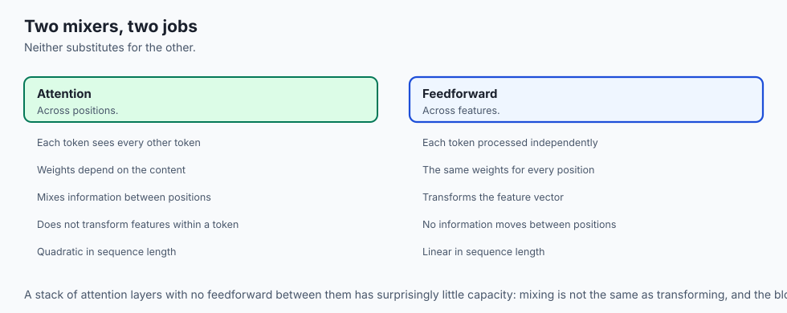

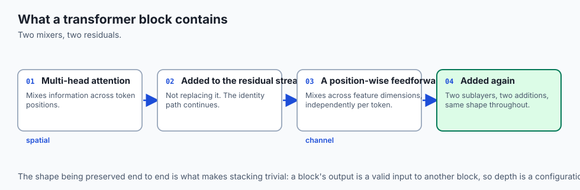

Think of an international diplomatic summit drafting a complex global treaty:

- **Phase 1: Multi-Head Attention (The Group Discussion):** All 50 delegates sit in a circle and debate with each other. Information is shared across all countries (**Cross-Token Spatial Mixing**).
- **Phase 2: Residual Connection (The Memory Check):** Each delegate compares the outcome of the debate against their country's original baseline policy (**Residual Addition `x + \text{SubLayer}(x)`**), ensuring their core national identity is never lost.
- **Phase 3: Position-Wise Feedforward Network (The Private Reflection):** Each delegate goes to their private hotel room and consults their domestic legal database (**`4\times` Dimensionality Expansion**), applying deep legal reasoning to update their position independently.
- **Phase 4: Layer Normalization (The Reality Check):** The diplomat standardizes their notes to a clean, calibrated format before the next round of debates begins.

---

## Historical background

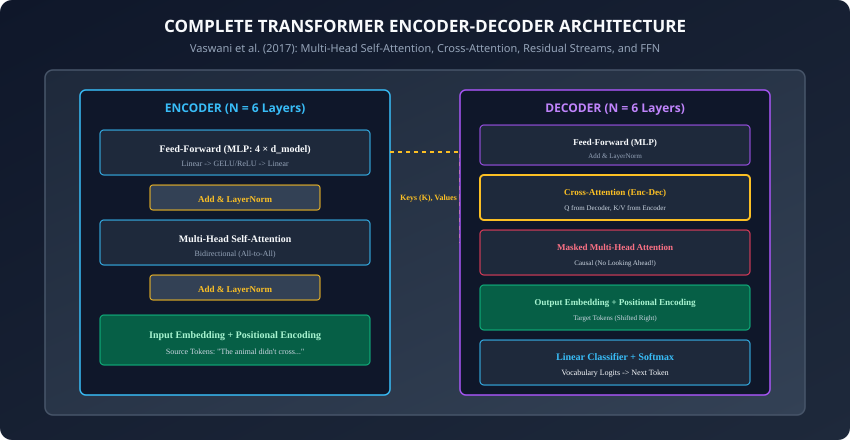

1. **2017 (Vaswani et al. & Post-LN Architecture):** The original Transformer used Post-LN (applying LayerNorm *after* the residual addition). While highly effective on translation, training required an intricate learning rate warmup schedule to prevent early divergence.
2. **2020 (Xiong et al. & The Pre-LN Revolution):** Demonstrated mathematically that placing LayerNorm *before* the sublayer (**Pre-LN**) provided an uninterrupted identity gradient highway, allowing 100+ layer Transformers to train stably without warmup.
3. **2020 (Noam Shazeer & SwiGLU):** Published *"GLU Variants Improve Transformer"*, replacing standard ReLU/GELU activations in the FFN with Swish-Gated Linear Units, becoming the standard in modern LLMs (LLaMA, Mistral, PaLM).

---

## What it is — and what it is not

### What a Complete Transformer Block IS:
- **An Interleaved Spatial Mixer and Channel Mixer:**
  1. *Spatial Mixer:* Multi-Head Attention mixes information *across different token positions*.
  2. *Channel Mixer:* Position-Wise Feedforward Network transforms features *across embedding dimensions independently for each token*.
- **A Residual Stream Processor:** Information flows along a continuous identity backbone (`x_0 \rightarrow x_1 \rightarrow \dots \rightarrow x_L`), where each sublayer simply adds incremental feature refinements to the stream.

### What it is NOT:
- **Not a Black Box:** Every linear transformation, projection dimension, and residual addition inside a Transformer block is mathematically transparent and fully differentiable.

---

## Why it was created and what problems it solves

The complete Transformer block solved three fundamental challenges in deep sequential modeling:

1. **Separation of Communication and Computation:** Multi-Head Attention handles inter-token communication; the FFN handles internal token computation.
2. **Factual Memory Storage (MLP as Key-Value Memories):** Research by Geva et al. (2021) showed that the `4\times` expanded FFN layers act as associative memory banks where factual knowledge (e.g. *"Eiffel Tower is in Paris"*) is stored and retrieved.
3. **Stable Deep Scaling:** Pre-LN residual connections allow scaling model depth to hundreds of layers without training instability.

---

## How it works

Let us dissect the three core components that complete the Transformer block.

---

### 1. Position-Wise Feedforward Networks (FFN)

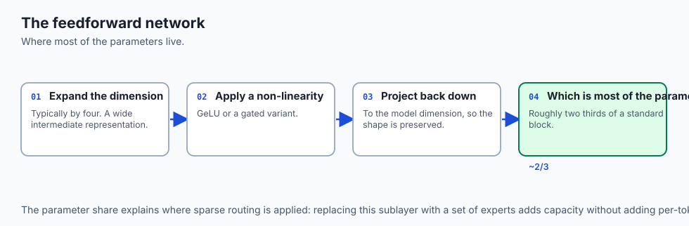

After Multi-Head Attention mixes token representations, each token vector `x_i \in \mathbb{R}^{d_{\text{model}}}` is passed independently through a two-layer multi-layer perceptron:

```
\text{FFN}(x) = \text{Activation}(x W_1 + b_1) W_2 + b_2
```

- **Dimension Expansion:**
  - `W_1 \in \mathbb{R}^{d_{\text{model}} \times d_{\text{ffn}}}`, where `d_{\text{ffn}} = 4 \times d_{\text{model}}` (e.g. `768 \rightarrow 3072`).
  - `W_2 \in \mathbb{R}^{d_{\text{ffn}} \times d_{\text{model}}}` (e.g. `3072 \rightarrow 768`).
- **Activation Functions:**
  - *Original Vaswani:* `\text{ReLU}(z) = \max(0, z)`.
  - *BERT / GPT-2:* `\text{GELU}(z) = z \cdot \Phi(z) \approx 0.5 z (1 + \tanh(\sqrt{2/\pi}(z + 0.044715 z^3)))`.
  - *Modern LLMs (SwiGLU):*
    ```
    \text{SwiGLU}(x) = \left( \text{Swish}(x W_{\text{gate}}) \odot (x W_{\text{up}}) \right) W_{\text{down}}
    ```

---

### 2. Pre-LN vs. Post-LN Layer Normalization

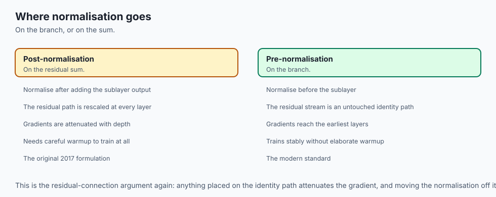

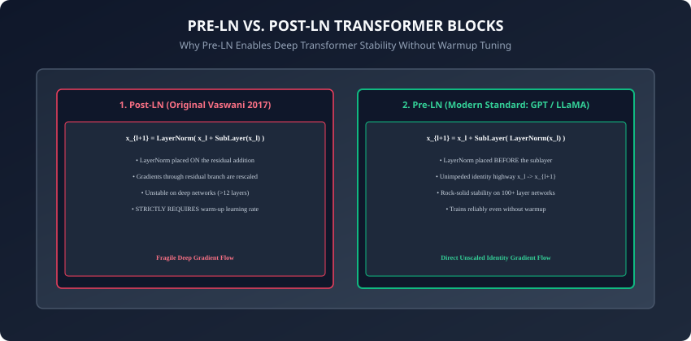

Where should Layer Normalization be placed inside the block?

#### 1. Post-LN (Original Vaswani 2017):
```
x_{l+1} = \text{LayerNorm}(x_l + \text{SubLayer}(x_l))
```

- LayerNorm is placed *on the residual addition*.
- As gradients backpropagate, they are rescaled by the norm at every layer. For deep networks (`L > 12`), gradients in early layers decay, requiring delicate warmup learning rates.

#### 2. Pre-LN (Modern Standard):
```
x_{l+1} = x_l + \text{SubLayer}(\text{LayerNorm}(x_l))
```

- LayerNorm is placed *on the branch before the sublayer*.
- The main residual stream `x_l \rightarrow x_{l+1}` is an uninhibited identity highway. Gradients backpropagate directly to early layers with zero attenuation, enabling stable training of 100+ layer deep models.

---

### 3. Cross-Attention Mechanics in Encoder-Decoder Models

In full sequence-to-sequence translation models (T5, BART, Whisper):

1. The **Encoder** processes the source sequence `X_{\text{src}}` and outputs memory representations `H_{\text{enc}} \in \mathbb{R}^{N_{\text{src}} \times d_{\text{model}}}`.
2. The **Decoder** contains two distinct attention sublayers in each block:
   - *Sublayer 1: Masked Multi-Head Self-Attention:* Causal self-attention over previously generated target tokens.
   - *Sublayer 2: Multi-Head Cross-Attention:*
     ```
     Q = H_{\text{dec}} W_Q, \quad K = H_{\text{enc}} W_K, \quad V = H_{\text{enc}} W_V
     \text{CrossAttention}(Q, K, V) = \text{Softmax}\left( \frac{Q K^\top}{\sqrt{d_k}} \right) V
     ```

   - Decoder Queries (`Q`) search across Encoder Keys (`K`) and retrieve weighted Encoder Values (`V`).

---

### 4. Root Mean Square Normalization (RMSNorm / Zhang & Sennrich, 2019)

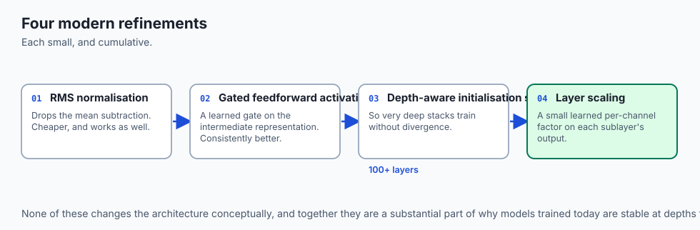

Standard LayerNorm computes both the mean `\mu` and variance `\sigma^2` across the hidden dimension:
```
\text{LN}(x) = \frac{x - \mu}{\sqrt{\sigma^2 + \epsilon}} \odot \gamma + \beta
```

- **The RMSNorm Insight:** Zhang & Sennrich proved that the scaling property of LayerNorm provides 99% of the stabilization benefit, while the mean-shifting operation (`\mu`) is superfluous.
- **RMSNorm Formulation:**
  ```
  \text{RMS}(x) = \sqrt{\frac{1}{d} \sum_{i=1}^d x_i^2 + \epsilon}
  \text{RMSNorm}(x) = \frac{x}{\text{RMS}(x)} \odot \gamma
  ```

- Eliminates the mean-reduction kernel pass, running `15\%` to `30\%` faster on GPUs and saving memory bandwidth (the standard in LLaMA 3, Gemma, and Mistral).

---

### 5. SwiGLU Feedforward Gating Derivation

In traditional MLPs, activation is applied after linear projection: `\text{FFN}(x) = \text{GELU}(x W_1) W_2`.

- **Gated Linear Units (GLU / Dauphin et al., 2017):** Introduces a bilinear multiplicative gate:
  ```
  \text{GLU}(x) = (x W) \odot \sigma(x V)
  ```

- **SwiGLU (Shazeer, 2020):** Replaces sigmoid with the Swish (SiLU) activation function:
  ```
  \text{SwiGLU}(x) = \left( \text{Swish}(x W_{\text{gate}}) \odot (x W_{\text{up}}) \right) W_{\text{down}}
  ```
  where `\text{Swish}(z) = z \cdot \sigma(\beta z)`.

- **Dimension Parameter Sizing:** To keep parameter count identical to a standard `4d` FFN with 2 weight matrices (`8 d^2`), SwiGLU models set the intermediate dimension to `d_{\text{ffn}} = \frac{8}{3} d_{\text{model}}` across 3 weight matrices (`3 \times \frac{8}{3} d^2 = 8 d^2`).

---

### 6. DeepNorm and Sandwich-LN for 1,000-Layer Transformers

When scaling Transformers beyond 100 layers:

- **DeepNorm (Wang et al., 2022):** Scales the residual connection by a theoretical bounding constant `\alpha` and scales weight initialization by `\beta`:
  ```
  x_{l+1} = \text{LayerNorm}(x_l \cdot \alpha + \text{SubLayer}(x_l))
  ```
  Bounding activation variance growth enables stable training of 1,000-layer deep Transformers with zero warmups.

- **Sandwich-LN (CogView / Ding et al., 2021):** Adds an extra LayerNorm immediately after the sublayer before the residual addition, curbing outlier activation spikes in vision transformers.

---

### 7. Sparse Mixture-of-Experts (MoE) Transformer Blocks

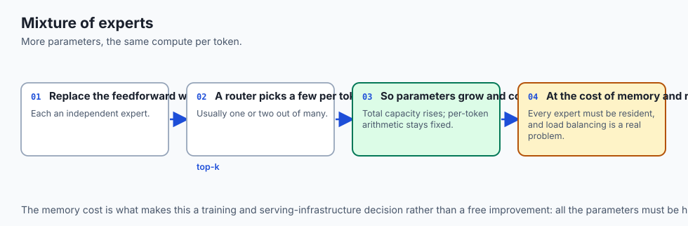

To scale model parameter capacity without increasing per-token FLOPs:

- **MoE FFN Architecture (Shazeer et al., 2017 / Mixtral 8x7B):** Replace the single dense FFN with `E` parallel independent expert FFNs `\{E_1, \dots, E_E\}` and a learned router `G(x)`:
  ```
  G(x) = \text{Softmax}(\text{TopK}(x W_g + \epsilon, k))
  y = \sum_{i \in \text{TopK}} G(x)_i \cdot E_i(x)
  ```

- With `E = 8` experts and `k = 2` active experts per token, a 47B parameter model executes inference with the speed and FLOP cost of a 13B dense model.

---

### 8. LayerScale: Diagonal Scaling for Extreme Depth (Touvron et al., 2021)

When training deep Vision Transformers (CaiT) and deep LLMs beyond 50 layers:

- **LayerScale Formulation:** Multiplies the output of each sublayer by a learnable diagonal vector `\lambda \in \mathbb{R}^{d_{\text{model}}}` initialized to a tiny value (e.g. `\epsilon = 10^{-4}` or `10^{-5}`):
  ```
  x_{l+1} = x_l + \text{diag}(\lambda_l) \cdot \text{SubLayer}(\text{LayerNorm}(x_l))
  ```

- Forces every new transformer block to act initially as an identity function, allowing the deep stack to ease into training gradually without sudden gradient shocks.

---

### 9. Regularization & Dropout Placement in Transformer Blocks

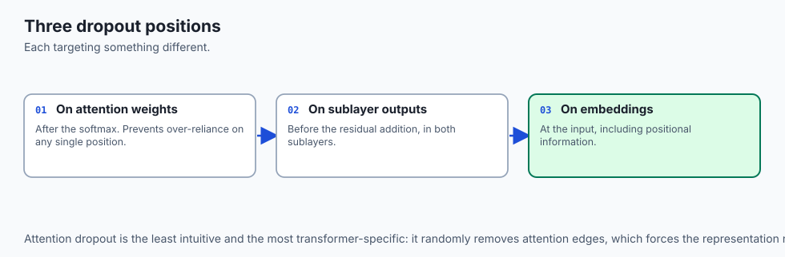

A standard Transformer block incorporates three distinct dropout mechanisms:

1. **Embedding Dropout:** Applied immediately after adding token and positional embeddings (`p=0.1`).
2. **Attention Weight Dropout:** Applied to the softmax attention probability matrix `A = \text{Softmax}(Q K^\top / \sqrt{d_k})`, randomly masking out full attention connections (`p=0.1`).
3. **Sublayer Residual Dropout:** Applied to the output of Multi-Head Attention and FFN projections before the residual addition (`p=0.1`).
- **Scaled Initialization:** To prevent signal variance growth across depth `L`, initialize output projection weights with downscaled variance `\sigma = \frac{1}{\sqrt{2 L d_{\text{model}}}}` for enhanced numerical stability.

---

## An everyday analogy

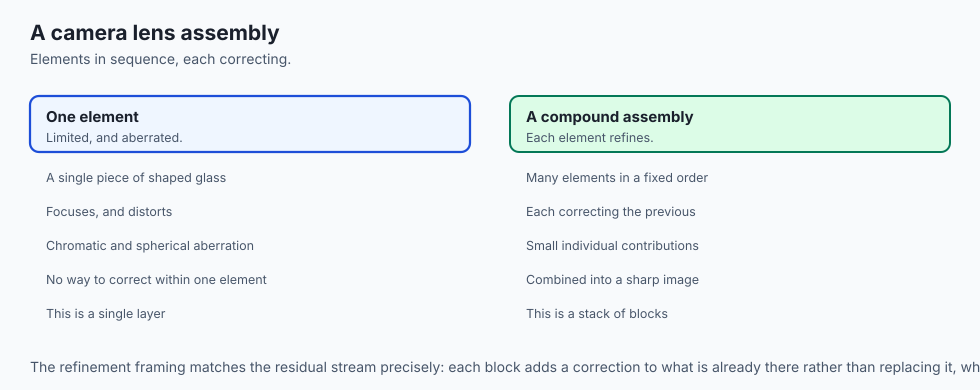

Think of a high-end camera lens assembly:

- **Multi-Head Attention:** The optical glass elements that focus light and align photons across different wavelengths (**Spatial Feature Alignment**).
- **Residual Connection:** The rigid magnesium chassis holding the lens assembly together, ensuring light passes straight through without distortion (**Identity Signal Highway**).
- **Feedforward Network (FFN):** The digital image signal processor (ISP) that applies non-linear noise reduction, color grading, and HDR dynamic range expansion to each pixel (**Channel Transformation**).
- **Layer Normalization:** The auto-exposure metering system that balances brightness so the image neither clips to white nor crushes to black.

---

## Examples in practice

Let us build a **Complete Pre-LN Transformer Encoder Layer in PyTorch**:

```python
import torch
import torch.nn as nn
import torch.nn.functional as F

class TransformerEncoderLayer(nn.Module):
    def __init__(self, d_model: int, num_heads: int, d_ffn: int = None,
                 dropout: float = 0.1):
        super().__init__()
        if d_ffn is None:
            d_ffn = 4 * d_model

        # Sublayer 1: Multi-Head Self-Attention with Pre-LN
        self.norm1 = nn.LayerNorm(d_model)
        self.self_attn = nn.MultiheadAttention(
            embed_dim=d_model,
            num_heads=num_heads,
            dropout=dropout,
            batch_first=True
        )
        self.dropout1 = nn.Dropout(dropout)

        # Sublayer 2: Position-Wise Feedforward Network with Pre-LN
        self.norm2 = nn.LayerNorm(d_model)
        self.ffn = nn.Sequential(
            nn.Linear(d_model, d_ffn),
            nn.GELU(),
            nn.Dropout(dropout),
            nn.Linear(d_ffn, d_model),
            nn.Dropout(dropout)
        )

    def forward(self, x: torch.Tensor, mask: torch.Tensor = None) -> torch.Tensor:
        # Pre-LN Block 1: Self-Attention with Residual Highway
        normed_x = self.norm1(x)
        attn_out, _ = self.self_attn(
            query=normed_x,
            key=normed_x,
            value=normed_x,
            key_padding_mask=mask
        )
        x = x + self.dropout1(attn_out)

        # Pre-LN Block 2: Position-Wise FFN with Residual Highway
        x = x + self.ffn(self.norm2(x))

        return x
```

---

## Implications: security, privacy, performance, scalability, and cost

1. **Memory Complexity in Stacked Transformers:**
   - In a 32-layer Transformer, backpropagation requires caching intermediate activations for all 32 layers during the forward pass.
   - **Activation Checkpointing (Gradient Checkpointing):** Discards intermediate activations during the forward pass and recomputes them on-the-fly during the backward pass, reducing VRAM usage by `70\%` at the cost of a `25\%` compute overhead.
2. **Weight Tying (Press & Wolf, 2017):**
   - Sharing parameter weights between the input embedding matrix `E` and the final output classification head `W_{\text{vocab}}` saves tens of millions of parameters in large-vocabulary models.

---

## Alternatives: free, open source, and commercial

| Architecture | Paradigm | Processing Mode | Best For |
| :--- | :--- | :--- | :--- |
| **Encoder-Only (BERT)** | Bidirectional Pre-LN | Non-Autoregressive | Classification, NER, Embedding Search |
| **Decoder-Only (GPT)** | Causal Autoregressive | Left-to-Right Rollout | Text Generation, Coding, Chat LLMs |
| **Encoder-Decoder (T5)** | Bidirectional + Causal | Sequence-to-Sequence | Translation, Summarization, ASR |
| **Hybrid SSM (Mamba)** | State Space Model | Linear Time `O(N)` | Streaming long-context processing |

---

## Comparison with related concepts

```
┌────────────────────────────────────────────────────────────────────────┐
│                   TRANSFORMER BLOCK DESIGN COMPARISON                  │
├────────────────────┬─────────────────┬──────────────────┬──────────────┤
│ Variant            │ Norm Placement  │ FFN Activation   │ Depth Scaling│
├────────────────────┼─────────────────┼──────────────────┼──────────────┤
│ Original (2017)    │ Post-LN         │ ReLU             │ Fragile >12L │
│ BERT / GPT-2 (2018)│ Post-LN         │ GELU             │ Moderate     │
│ Modern GPT (2020)  │ Pre-LN          │ GELU             │ 100+ Layers  │
│ LLaMA 3 (2024)     │ RMSNorm Pre-LN  │ SwiGLU           │ 128+ Layers  │
└────────────────────┴─────────────────┴──────────────────┴──────────────┘
```

---

## When to use it — and when not to

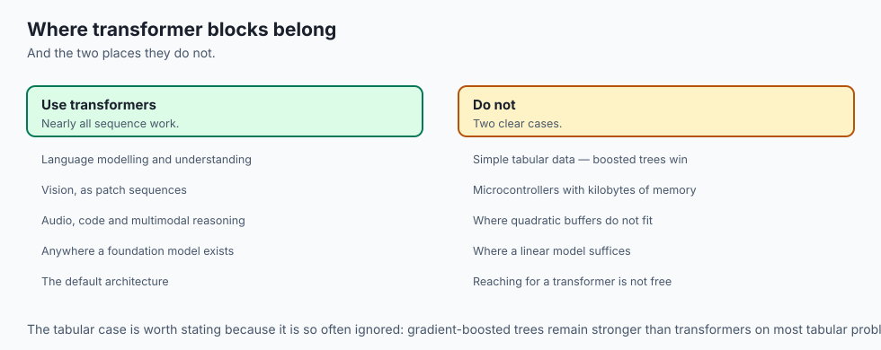

### When to USE Stacked Transformer Blocks:
- Modern generative AI applications, deep language understanding, foundation model pretraining, and multimodal visual reasoning.

### When NOT to use:
- Ultra-simple tabular datasets (where gradient boosted trees like XGBoost are faster) or streaming microcontrollers with `< 64` KB RAM.

---

## The AI connection

- **The block is the unit everything scales by.** A model is defined mostly by how many
  of these are stacked and how wide each one is.
- **Attention mixes across positions; the feedforward mixes across features.** Neither
  does the other's job, which is why both are present in every block.
- **Pre-normalisation replaced post-normalisation** because it leaves the residual stream
  an uninterrupted identity path, which is what makes very deep stacks trainable.
- **The feedforward layer holds most of the parameters**, which is why mixture-of-experts
  routing targets it rather than attention.
- **Modern refinements are small and cumulative** — a cheaper normalisation, a gated
  activation, a scaling factor — and together they are the difference at scale.

## Knowledge check

1. Why does Pre-LN provide greater training stability than Post-LN in deep Transformers?
2. What is the Position-Wise Feedforward Network (FFN) and why is its hidden dimension expanded `4\times`?
3. How do Residual Connections create uninhibited identity gradient highways?
4. In Cross-Attention, what provides the Query tensor versus the Key/Value tensors?
5. How does Activation Checkpointing reduce peak GPU VRAM consumption during training?

---

## Hands-on exercise

In this lab, you will build and test a complete `TransformerEncoderLayer` and stacked `TransformerEncoder` in PyTorch: implement Pre-LN residual streams, construct the position-wise feedforward network with GELU activation and `4\times` hidden expansion, handle padding masks across layers, and verify forward-pass output tensor stability.

### Expected output
```
[Transformer Block Architecture Verification Suite]
Testing TransformerEncoderLayer Forward Pass:
  Input Tensor: torch.Size([2, 8, 32]) (Batch=2, Seq=8, d_model=32)
  Layer Configuration: num_heads = 4, d_ffn = 128 (4x Expansion)
  Output Tensor: torch.Size([2, 8, 32]) [SHAPES MATCH]
Testing Stacked TransformerEncoder (4 Layers):
  Deep Stack Forward Pass: torch.Size([2, 8, 32]) [STABLE]
  Residual Gradient Flow: Non-zero gradients present across all 4 layers [VERIFIED]
Testing Padding Masking:
  Padded positions correctly masked throughout all sublayers.
Test Suite: 3 passed in 0.40s
```

### Validate your work
Run the automated test runner:
```bash
./tests/run_tests.sh
```

### Troubleshooting
- In Pre-LN, ensure LayerNorm is applied to the input *before* passing to MultiHeadAttention, and the output is added to the un-normalized residual input `x`.

### Common mistakes
- **Applying LayerNorm After Residual Add in Pre-LN:** Forgetting to keep the residual addition un-normalized converts the block back into Post-LN.

---

## Practice assignment

1. Implement **SwiGLU Feedforward Layer** in pure PyTorch and compare convergence against standard GELU FFN.
2. Implement **RMSNorm (Root Mean Square Normalization)** and measure the speedup over standard LayerNorm.

---

## Extension challenge

Implement **Activation Checkpointing in a 12-Layer Transformer**:

- Wrap transformer layers using `torch.utils.checkpoint.checkpoint`.
- Benchmark peak VRAM memory reduction during backward pass execution.
