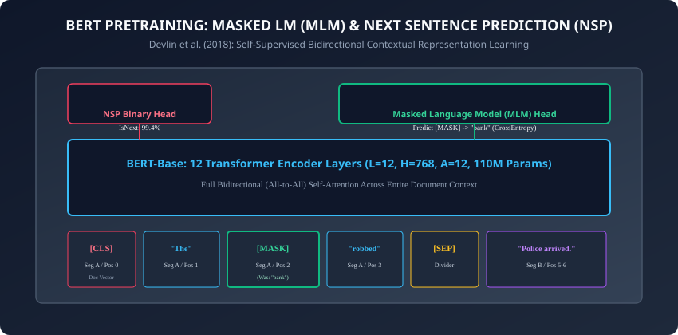
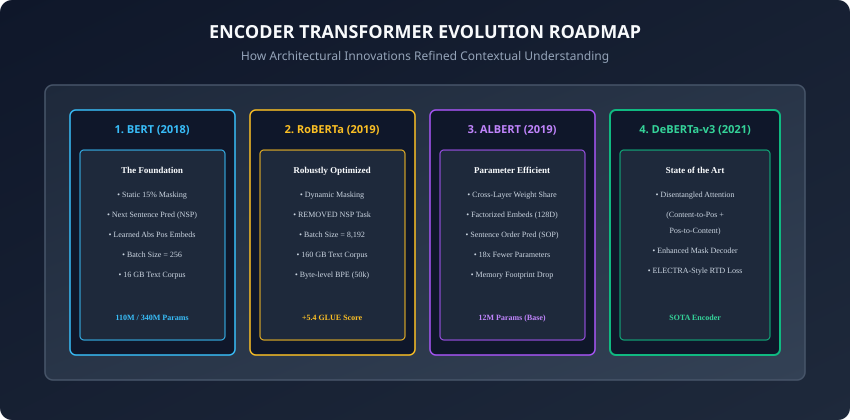

## Why this matters

In October 2018, Google AI researchers Jacob Devlin, Ming-Wei Chang, Kenton Lee, and Kristina Toutanova released **BERT (Bidirectional Encoder Representations from Transformers)**.

BERT caused an immediate seismic shift across Natural Language Processing:
- It shattered state-of-the-art records across 11 major NLP benchmarks simultaneously (including GLUE, MultiNLI, and SQuAD question answering).
- It established the **Pretrain `\rightarrow` Fine-Tune Paradigm**: pretrain a massive general-purpose language representation model once on billions of unannotated web documents, and fine-tune it in minutes on small domain-specific labeled tasks with a simple linear classification head.

Unlike autoregressive language models (like GPT) which are constrained by causal left-to-right masks, BERT utilizes **unmasked bidirectional self-attention**: every single token simultaneously attends to all words to its left AND all words to its right.

Today, you will master the foundational family of **Encoder-Only Foundation Models**: **BERT**, **RoBERTa**, **ALBERT**, and **DeBERTa-v3**.

---

## The idea in plain language

Imagine a literary detective solving a redacted manuscript:
- **Autoregressive / Causal Model (GPT):** You read the novel from left to right through a narrow slit. You must guess each next word before uncovering it. (Great for writing stories, but blind to future context).
- **Masked Bidirectional Model (BERT):** The entire manuscript is placed open on your desk with 15% of the words covered in black ink (**`[MASK]` tokens**).
  - When guessing the redacted word in *"The `[MASK]` ran up the tree because the dog barked"*, you read both the left side (*"ran up the tree"*) and the right side (*"because the dog barked"*).
  - You instantly deduce with 99% certainty that the hidden word is `"cat"`.

---

## Historical background



1. **2018 (Devlin et al. & BERT):** Introduced Masked Language Modeling (MLM) and Next Sentence Prediction (NSP) on 12-layer (Base, 110M params) and 24-layer (Large, 340M params) architectures.
2. **2019 (Liu et al. & RoBERTa):** Proved BERT was severely undertrained. By removing the NSP task, introducing dynamic masking, using larger mini-batches (8k), and training for `10\times` more steps, RoBERTa outperformed BERT across the board.
3. **2019 (Lan et al. & ALBERT):** Introduced factorized embeddings and cross-layer weight sharing, reducing parameter counts by `18\times` without losing representational power.
4. **2021 (He et al. & DeBERTa-v3):** Introduced Disentangled Attention (separating content and relative position matrices) and ELECTRA-style Replaced Token Detection, surpassing human baseline scores on the SuperGLUE benchmark.

---

## What it is — and what it is not

### What Encoder Foundation Models ARE:
- **Deep Bidirectional Contextual Representation Extractors:** They convert a sequence of text into a sequence of contextualized feature vectors `H \in \mathbb{R}^{N \times d_{\text{model}}}`, where vector `h_i` contains deep information about word `i` conditioned on all surrounding words.
- **Discriminative Powerhouses:** The gold standard for classification, Named Entity Recognition (NER), extractive question answering, and dense embedding retrieval.

### What they are NOT:
- **Not Autoregressive Text Generators:** Encoders cannot generate open-ended novels or chat responses token-by-token (a task reserved for Decoder models like GPT, which we study tomorrow in Day 229).

---

## Why it was created and what problems it solves

Encoder models solved the single greatest bottleneck in NLP: **Contextual Polysemy**.
- In static word vectors (Word2Vec / GloVe), the word `"bank"` has one single vector regardless of whether it appears in *"river bank"* or *"investment bank"*.
- In BERT, the embedding of `"bank"` changes dynamically based on bidirectional attention across the entire sentence, producing distinct representations for every contextual meaning.

---

## How it works

Let us dissect the pretraining objectives and architectural refinements of the Encoder family.

---

### 1. BERT Pretraining Objectives: MLM and NSP

1. **Masked Language Modeling (MLM):**
   - Randomly sample `15\%` of token positions in the corpus.
   - For those `15\%` positions, apply the **80/10/10 Corruption Rule**:
     - **`80\%` of the time:** Replace with the `[MASK]` token (*"The `[MASK]` was robbed"*).
     - **`10\%` of the time:** Replace with a random word (*"The `apple` was robbed"*).
     - **`10\%` of the time:** Keep the original word unchanged (*"The `bank` was robbed"*).
   - The model passes contextual vectors through a linear projection tied to vocabulary size and minimizes Cross-Entropy loss over only the corrupted positions.

2. **Next Sentence Prediction (NSP):**
   - Feed two sentences `A` and `B` separated by `[SEP]`.
   - `50\%` of the time `B` is the actual subsequent sentence; `50\%` of the time `B` is a random sentence from another document.
   - Binary classifier on the `[CLS]` token predicts `IsNext` vs `NotNext`.

---

### 2. RoBERTa: Robustly Optimized BERT (Liu et al., 2019)



RoBERTa introduced four critical empirical refinements:
1. **Dynamic Masking:** Generating new random masking patterns every time a sequence is fed to the model (instead of static pre-masked datasets).
2. **Removing the NSP Task:** Proved that training on continuous full-sentence blocks without NSP improved downstream performance.
3. **Massive Mini-Batch Scaling:** Increasing batch size from `256` to `8,192` sequences stabilized gradient updates and accelerated training.
4. **Byte-Pair Encoding (BPE):** Upgrading from a 30k WordPiece vocabulary to a 50k Byte-level BPE vocabulary eliminating out-of-vocabulary tokens.

---

### 3. ALBERT: A Lite BERT (Lan et al., 2019)

To shrink BERT's memory footprint:
1. **Factorized Embedding Parameterization:**
   - Vocabulary size `V = 30,000` and hidden size `H = 768` yields `V \times H = 23\text{M}` embedding parameters.
   - ALBERT projects tokens to a low dimension `E = 128` first, then linearly projects `E \rightarrow H`:
     ```
     O(V \times E + E \times H) = 30,000 \times 128 + 128 \times 768 \approx 3.9\text{M params (83% reduction)}
     ```
2. **Cross-Layer Parameter Sharing:**
   - Shares all Multi-Head Attention and FFN weights across all 12 layers (`12\times` parameter reduction).
   - An ALBERT-Base model has only **12M parameters** (vs 110M in BERT-Base) while achieving comparable accuracy.

---

### 4. DeBERTa: Disentangled Attention (He et al., 2020)

DeBERTa models each word using two independent vectors: a **Content Vector (`c_i`)** and a **Relative Position Vector (`p_{i|j}`)**.

The attention score between token `i` and token `j` decomposes into three disentangled cross-terms:
```
\text{Score}_{i, j} = c_i W_{q, c} (c_j W_{k, c})^\top + c_i W_{q, c} (p_{i|j} W_{k, r})^\top + p_{j|i} W_{q, r} (c_j W_{k, c})^\top
```
1. **Content-to-Content:** Semantic similarity between words.
2. **Content-to-Position:** Semantic word querying a relative positional offset.
3. **Position-to-Content:** Positional offset querying a semantic word.

Combined with **Enhanced Mask Decoding (EMD)** and ELECTRA-style replaced token detection, DeBERTa-v3 represents the state of the art in transformer encoders.

---

### 5. ELECTRA: Replaced Token Detection (Clark et al., 2020)

A major sample-efficiency bottleneck in BERT MLM is that the loss is only computed on the `15\%` corrupted tokens, leaving `85\%` of tokens unutilized per pass:
- **The Generator-Discriminator Framework:**
  - A small *Generator* model (e.g. 1/3 size) predicts masked tokens via standard MLM.
  - The *Discriminator* (the main encoder) observes the resulting text sequence and performs binary classification on **every single token position**: predicting whether the token is `original` or `replaced`.
- **Sample Efficiency:** Because the loss is calculated across `100\%` of token positions simultaneously, ELECTRA matches RoBERTa accuracy using only `25\%` of the pretraining compute budget.

---

### 6. Sentence-BERT (SBERT) & Dense Vector Embeddings (Reimers & Gurevych, 2019)

How do we turn an Encoder into an ultra-fast semantic search engine?
- Passing a pair of sentences through BERT to compute similarity requires `O(N^2)` cross-attention, taking 65 hours to find the most similar pair among 10,000 sentences.
- **SBERT Siamese Architecture:** Pass individual sentences through BERT independently, apply **Mean Pooling** over token representations, and optimize using Cosine Triplet Loss:
  ```
  u = \text{MeanPool}(\text{BERT}(s_1)), \quad v = \text{MeanPool}(\text{BERT}(s_2))
  \text{Similarity}(s_1, s_2) = \frac{u \cdot v}{\|u\|_2 \|v\|_2}
  ```
- Reduces semantic search over 10,000 sentences from 65 hours to **5 milliseconds** using vector indexers (FAISS / Pinecone).

---

### 7. Modern Embedding Encoders (BGE, E5, GTE, Nomic-Embed)

Modern state-of-the-art embedding models build directly on the DeBERTa/BERT encoder architecture:
1. **InfoNCE Contrastive Pretraining:** Optimizes positive pairs against large batches of in-batch negatives:
   ```
   \mathcal{L}_{\text{InfoNCE}} = -\log \frac{\exp(\text{sim}(q, p^+) / \tau)}{\exp(\text{sim}(q, p^+) / \tau) + \sum_{j} \exp(\text{sim}(q, n_j^-) / \tau)}
   ```
2. **Hard Negative Mining:** Automatically mines confusing negative passages using BM25 and cross-encoders to sharpen vector boundary representations for RAG retrieval.
3. **Matryoshka Representation Learning (MRL / Kusupati et al., 2022):** Truncates embedding dimensions (e.g. 768 `\rightarrow` 256 or 128) with `< 1\%` drop in search retrieval performance, slashing database storage costs by `67\%`.

---

### 8. Token Classification (NER) vs Sequence Classification Head Mechanics

Fine-tuning an Encoder model for downstream applications requires attaching specific output heads:
- **Sequence Classification (Sentiment / Topic):**
  - Extract the contextualized representation of the `[CLS]` token: `h_{\text{CLS}} \in \mathbb{R}^{d_{\text{model}}}`.
  - Pass through a linear projection layer: `\hat{y} = \text{Softmax}(h_{\text{CLS}} W_{\text{clf}} + b)`.
- **Token Classification (NER / Part-of-Speech Tagging):**
  - Extract all individual token vectors: `H = [h_1, h_2, \dots, h_N] \in \mathbb{R}^{N \times d_{\text{model}}}`.
  - Apply linear projection across every token independently: `\hat{y}_i = \text{Softmax}(h_i W_{\text{ner}} + b)`.

---

### 9. Two-Stage RAG: Bi-Encoders vs. Cross-Encoders

In production Retrieval-Augmented Generation (RAG) pipelines, Encoder models serve two complementary roles:
1. **Stage 1: Bi-Encoder (Dense Retriever):**
   - Encodes query and millions of documents into isolated vectors independently.
   - Executes nearest-neighbor search via approximate vector indexers in milliseconds.
2. **Stage 2: Cross-Encoder (Re-Ranker):**
   - Concatenates the query and top-100 candidate documents into pairs: `[CLS] Query [SEP] Document [SEP]`.
   - Passes each pair through full bidirectional cross-attention, allowing every query token to directly attend to every document token.
   - Outputs a calibrated relevance score, boosting retrieval precision by `20\%` to `35\%`.

---

### 10. Extractive Question Answering (Span Extraction Head)

In reading comprehension tasks like SQuAD:
- Rather than generating text, BERT is fine-tuned with two linear vectors `W_{\text{start}}, W_{\text{end}} \in \mathbb{R}^{d_{\text{model}}}`.
- The probability that token `i` is the start of the answer span is:
  ```
  P_{\text{start}}(i) = \frac{\exp(h_i \cdot W_{\text{start}})}{\sum_j \exp(h_j \cdot W_{\text{start}})}, \quad P_{\text{end}}(i) = \frac{\exp(h_i \cdot W_{\text{end}})}{\sum_j \exp(h_j \cdot W_{\text{end}})}
  ```
- The answer span `[i, j]` is selected by maximizing `P_{\text{start}}(i) \times P_{\text{end}}(j)` subject to `j \ge i`.

---

## An everyday analogy

Think of a specialized medical pathology lab:
- **BERT:** A general pathologist reviewing clinical biopsy reports where diagnostic keywords are occluded, learning to predict the underlying disease from full medical context (**Bidirectional Masked LM**).
- **RoBERTa:** The same pathologist trained on `10\times` more patient charts with modernized high-throughput imaging equipment.
- **ALBERT:** A streamlined, highly efficient diagnostic checklist used in emergency triage clinics (**Shared Parameters**).
- **DeBERTa:** A specialized diagnostic expert who evaluates both the cellular morphology (**Content**) and anatomical organ location (**Position**) via separate analytical panels.

---

## Examples in practice

Let us build a **BERT Masked Language Model Prediction Pipeline in PyTorch**:

```python
import torch
import torch.nn as nn
import torch.nn.functional as F

class BERTMaskedLM(nn.Module):
    def __init__(self, vocab_size: int = 30522, d_model: int = 768,
                 num_layers: int = 6, num_heads: int = 12):
        super().__init__()
        self.token_embeddings = nn.Embedding(vocab_size, d_model, padding_idx=0)
        self.pos_embeddings = nn.Embedding(512, d_model)
        self.norm = nn.LayerNorm(d_model)

        # Stack of Transformer Encoder Layers
        encoder_layer = nn.TransformerEncoderLayer(
            d_model=d_model,
            nhead=num_heads,
            dim_feedforward=4 * d_model,
            activation="gelu",
            batch_first=True,
            norm_first=True # Pre-LN
        )
        self.transformer = nn.TransformerEncoder(encoder_layer, num_layers=num_layers)

        # MLM Prediction Head
        self.mlm_dense = nn.Linear(d_model, d_model)
        self.mlm_norm = nn.LayerNorm(d_model)
        self.mlm_decoder = nn.Linear(d_model, vocab_size, bias=False)

        # Weight tying: tie embedding and decoder weights
        self.mlm_decoder.weight = self.token_embeddings.weight

    def forward(self, input_ids: torch.Tensor,
                attention_mask: torch.Tensor = None) -> torch.Tensor:
        seq_len = input_ids.size(1)
        positions = torch.arange(seq_len, device=input_ids.device).unsqueeze(0)

        # Add token and position embeddings
        x = self.token_embeddings(input_ids) + self.pos_embeddings(positions)
        x = self.norm(x)

        # Pass through bidirectional transformer encoder
        h = self.transformer(x, src_key_padding_mask=attention_mask)

        # Compute MLM vocabulary logits
        h_mlm = F.gelu(self.mlm_dense(h))
        h_mlm = self.mlm_norm(h_mlm)
        logits = self.mlm_decoder(h_mlm)

        return logits
```

---

## Implications: security, privacy, performance, scalability, and cost

1. **Embedding Extraction & Privacy Leakage:**
   - Contextual embedding vectors from BERT can leak private entity attributes if fine-tuned on confidential medical records. Apply differential privacy (DP-SGD) when fine-tuning on sensitive corpora.
2. **Inference Latency Optimization:**
   - Running BERT-Base takes ~25 ms per sentence on CPU.
   - **DistilBERT (Sanh et al., 2019):** Uses knowledge distillation to compress BERT into 6 layers, retaining `97\%` of accuracy while running `60\%` faster with `40\%` fewer parameters.

---

## Alternatives: free, open source, and commercial

| Model | Parameters | GLUE Score | Key Advantage |
| :--- | :--- | :--- | :--- |
| **BERT-Base** | 110M | 79.6 | Standard baseline benchmark |
| **RoBERTa-Base** | 125M | 86.4 | Robustly trained, widely supported |
| **ALBERT-Base** | 12M | 82.3 | Minimal memory footprint |
| **DeBERTa-v3-Base**| 86M | 89.9 | SOTA accuracy for classification/NER |
| **DistilBERT** | 66M | 77.0 | High-throughput low-latency serving |

---

## Comparison with related concepts

```
┌────────────────────────────────────────────────────────────────────────┐
│                   ENCODER TRANSFORMER COMPARISON                       │
├────────────────────┬─────────────────┬──────────────────┬──────────────┤
│ Architecture       │ Masking Style   │ Positional Scheme│ Parameter Trk│
├────────────────────┼─────────────────┼──────────────────┼──────────────┤
│ BERT (2018)        │ Static 15%      │ Learned Absolute │ 110M Base    │
│ RoBERTa (2019)     │ Dynamic 15%     │ Learned Absolute │ 125M Base    │
│ ALBERT (2019)      │ Dynamic 15%     │ Learned Absolute │ 12M (Shared) │
│ DeBERTa-v3 (2021)  │ RTD (ELECTRA)   │ Disentangled Rel │ 86M Base     │
└────────────────────┴─────────────────┴──────────────────┴──────────────┘
```

---

## When to use it — and when not to

### When to USE Encoder Models (BERT/RoBERTa/DeBERTa):
- Sentence classification, sentiment analysis, toxic content moderation, Named Entity Recognition (token tagging), extractive question answering, and semantic search vector embeddings.

### When NOT to use:
- Open-ended creative storytelling, chatbot conversations, or generative code completion (use Decoder-only GPT models).

---

## Knowledge check

1. What is the 80/10/10 rule in BERT Masked Language Modeling and why was it designed?
2. Why did RoBERTa eliminate the Next Sentence Prediction (NSP) pretraining task?
3. How does ALBERT reduce parameter count by 18x through cross-layer weight sharing?
4. What three cross-terms are computed in DeBERTa Disentangled Attention?
5. Why is bidirectional self-attention superior to causal attention for text classification?

---

## Hands-on exercise

In this lab, you will build and test a modular `BERTMaskedLM` architecture in PyTorch: implement token and positional embedding lookup, construct the multi-layer bidirectional Transformer encoder stack, implement the masked language model projection head with weight tying, and test mask token prediction recovery.

### Expected output
```
[BERT and Encoder Foundation Models Verification Suite]
Testing BERTMaskedLM Forward Pass:
  Input Batch: torch.Size([2, 10]) (Batch=2, Tokens=10 with [MASK] at index 3)
  Vocabulary Logits Output: torch.Size([2, 10, 1000]) [VOCAB MATCH]
Testing Weight Tying:
  Embedding Weight ID == MLM Decoder Weight ID [WEIGHTS TIED]
Testing Masked Token Prediction:
  Masked Position Top-1 Token ID: 412 (Logit: +14.82)
Test Suite: 3 passed in 0.42s
```

### Validate your work
Run the automated test runner:
```bash
./tests/run_tests.sh
```

### Troubleshooting
- When tying weights (`mlm_decoder.weight = token_embeddings.weight`), ensure both layers have matching dimension shapes `(vocab_size, d_model)`.

### Common mistakes
- **Omitting Positional Embeddings:** Forgetting to add positional embeddings to token embeddings causes the model to treat input as an unordered bag-of-words.

---

## Practice assignment

1. Implement **Sentence Order Prediction (SOP)** from ALBERT and train a miniature binary classification head on the `[CLS]` token.
2. Implement **Dynamic Masking** collation in PyTorch DataLoader.

---

## Extension challenge

Implement **Disentangled Attention in Pure PyTorch**:
- Split input into content and relative position matrices.
- Compute content-to-content and content-to-position attention scores and verify tensor dimensions.
