## Why this matters

While Encoder models (BERT) unlocked bidirectional understanding for classification, they cannot write poetry, author software code, or carry on dynamic human conversation.

To achieve open-ended language generation, researchers turned to **Autoregressive Decoder Models**:

- By training a Transformer decoder on a single objective — **Next-Token Prediction** — models learn grammar, world facts, deductive logic, and programming syntax simultaneously.
- As Alec Radford and Ilya Sutskever hypothesized in 2018: *Language modeling is unsupervised multitask learning*. When trained on sufficient scale, predicting the next word forces the network to internally simulate reasoning across every domain described in the text.

From **GPT-1** (117M params, 2018) to **GPT-2** (1.5B params, 2019) to **GPT-3** (175B params, 2020) and modern open-weight giants (**LLaMA 3**, **Mistral**, **DeepSeek**), the autoregressive decoder has become the fundamental architecture powering modern artificial intelligence.

Today, you will master Causal Self-Attention, KV-Caching, Neural Scaling Laws, and advanced sampling decoding strategies.

---

## The idea in plain language

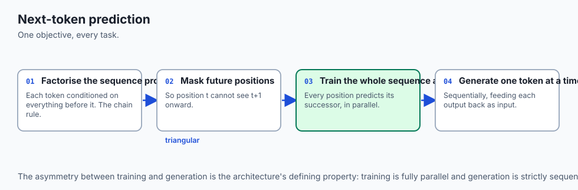

Think of a master storyteller improvising an epic tale before a live audience:

- The storyteller has spoken 100 words so far (**The Context Prompt**).
- To pick word #101, the storyteller reviews the entire story so far, weighs thousands of possible next words in their mind (**Vocabulary Logits**), and chooses the next word based on creative style and dramatic tension (**Sampling / Temperature**).
- Once word #101 is spoken, it becomes permanent history. The storyteller now repeats the process to select word #102.
- To keep the performance fast and effortless, the storyteller does not reread the entire book from page 1 every second; they keep the ongoing character relationships active in their working memory (**The KV-Cache**).

---

## Historical background

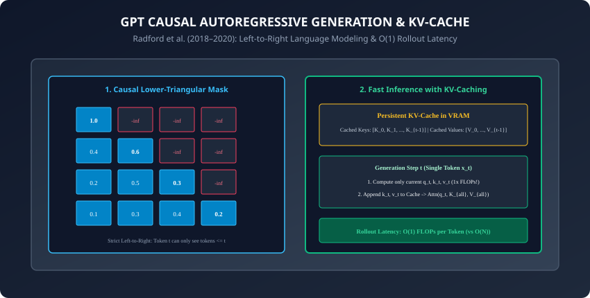

1. **2018 (Radford et al. & GPT-1):** Demonstrated that unsupervised generative pretraining followed by supervised fine-tuning outperformed task-specific architectures across 9 NLP benchmarks.
2. **2019 (Radford et al. & GPT-2):** *"Language Models are Unsupervised Multitask Learners"* proved that simply scaling GPT-1 to 1.5B parameters enabled zero-shot translation, summarization, and question answering without any task-specific fine-tuning.
3. **2020 (Brown et al. & GPT-3):** Scaled to 175B parameters and demonstrated **In-Context Few-Shot Learning**: prompting the model with 2 to 3 demonstrations in plain text allowed it to perform novel tasks with zero weight updates.
4. **2022 (Hoffmann et al. & Chinchilla):** Corrected Kaplan's scaling laws, establishing that compute-optimal models require scaling tokens and parameters in equal proportion (`20` tokens per parameter), birthing the modern dense LLM era (LLaMA, Mistral).

---

## What it is — and what it is not

### What Autoregressive Decoders ARE:
- **Causal Probability Estimators:** Estimating the joint probability distribution of a text sequence via the chain rule of probability:
  ```
  P(w_1, w_2, \dots, w_N) = \prod_{t=1}^N P(w_t \mid w_1, w_2, \dots, w_{t-1})
  ```

- **Universal Generative Engines:** Any problem expressible as text input and text output (translation, mathematics, python coding, dialogue) can be framed as causal next-token prediction.

### What they are NOT:
- **Not Bidirectional Encoders:** During training and rollout, a decoder token at position `t` is mathematically forbidden from observing tokens at positions `t+1, t+2, \dots`.

---

## Why it was created and what problems it solves

Autoregressive decoders solved the fundamental trade-off between task specialization and generality:

1. **Eliminating Task-Specific Output Heads:** Instead of engineering custom classification heads for every task, the model outputs natural language answers directly into the token stream.
2. **Infinite Generation Rollout:** The autoregressive loop allows the model to produce arbitrarily long paragraphs, essays, code modules, and complex multi-step reasoning traces.

---

## How it works

Let us dissect the causal mechanics, KV-caching acceleration, scaling laws, and decoding algorithms.

---

### 1. Causal Self-Attention Masking

To train a Transformer decoder on an entire sequence in parallel while preventing future token leakage:

1. Construct an upper-triangular mask matrix `M \in \mathbb{R}^{N \times N}`:
   ```
   M_{i, j} = \begin{cases} 0 & \text{if } j \le i \\ -\infty & \text{if } j > i \end{cases}
   ```

2. Add the mask to raw attention scores prior to softmax:
   ```
   \text{CausalAttention}(Q, K, V) = \text{Softmax}\left( \frac{Q K^\top}{\sqrt{d_k}} + M \right) V
   ```

3. Because `\exp(-\infty) = 0`, all attention weights pointing to future tokens become exactly zero.

---

### 2. Fast Inference Rollout with KV-Caching

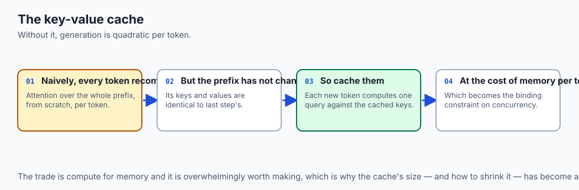

During inference, generating text token-by-token is computationally expensive if recomputed naively:

- **Naive Generation (Without Cache):** To generate token `t+1`, feed all `t` tokens into the model `\rightarrow O(t^2)` total compute across sequence length.
- **KV-Cache Optimization:**
  1. For previously processed tokens `1 \dots t-1`, their Key and Value projection vectors `K_{\text{cache}}, V_{\text{cache}} \in \mathbb{R}^{B \times H \times (t-1) \times d_k}` are already computed and held in GPU VRAM.
  2. At step `t`, pass **only the single newest token `x_t`** into the network.
  3. Compute its single query `q_t`, key `k_t`, and value `v_t`.
  4. Append `k_t` and `v_t` to the cache:
     ```
     K_{\text{new}} = [K_{\text{cache}}; k_t], \quad V_{\text{new}} = [V_{\text{cache}}; v_t]
     ```

  5. Compute attention: `\text{Attn}(q_t, K_{\text{new}}, V_{\text{new}})`.
  6. **Complexity:** Drops single-token generation latency from `O(t)` FLOPs to **`O(1)` FLOPs**!

---

### 3. Neural Scaling Laws: Kaplan vs. Chinchilla

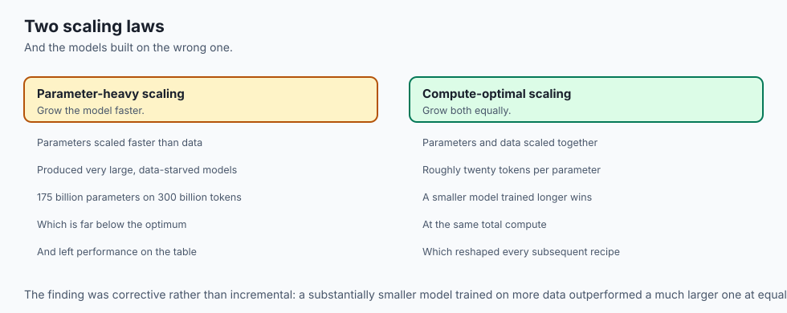

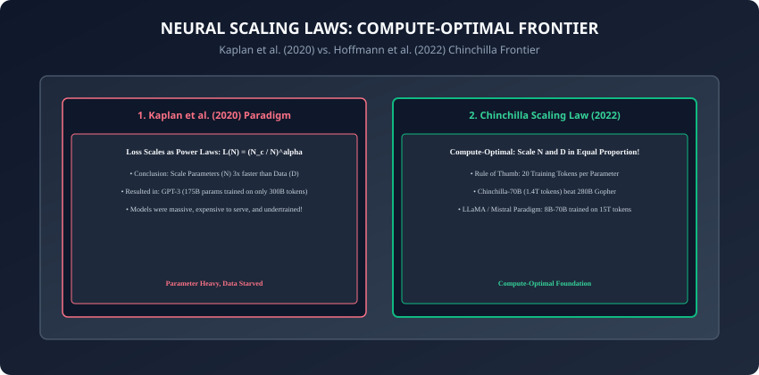

How should compute budget `C \approx 6 N D` (where `N` is parameter count and `D` is dataset token count) be allocated?

#### 1. Kaplan et al. (2020) Power Law:
- Suggested scaling parameters `N` three times faster than dataset tokens `D` (`N \propto C^{0.73}, D \propto C^{0.27}`).
- Led to giant, data-starved models like GPT-3 (175B parameters trained on only 300B tokens).

#### 2. Hoffmann et al. (2022) Chinchilla Law:
- Re-evaluated scaling with tuned learning rate cosine schedules, proving that `N` and `D` must scale in **equal proportion**:
  ```
  N_{\text{opt}} \propto C^{0.5}, \quad D_{\text{opt}} \propto C^{0.5}
  ```

- **The Golden Ratio:** For compute-optimal pretraining, train on **`20` tokens per model parameter** (e.g. a 70B parameter model requires at least 1.4 Trillion tokens).
- **Over-training for Inference:** Modern foundation models (LLaMA 3) train 8B models on 15 Trillion tokens (`1875\times` ratio) to maximize downstream serving efficiency.

---

### 4. Generation Decoding Strategies

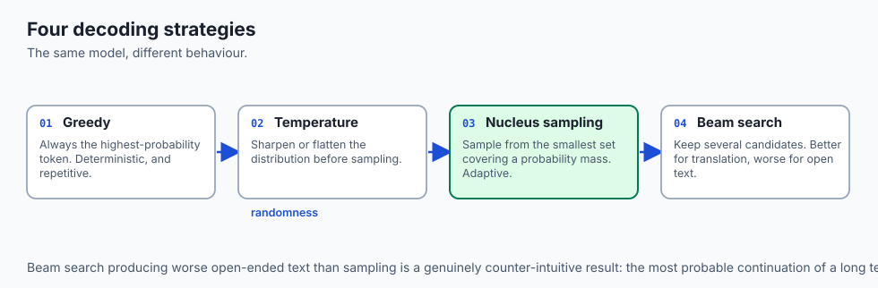

Given final vocabulary logits `z \in \mathbb{R}^{V}`:

1. **Greedy Search:** Always pick `\hat{y} = \arg\max z_i`. Fast, but suffers from repetitive loops and lack of diversity.
2. **Temperature Scaling (`T`):** Rescales logits:
   ```
   P(w_i) = \frac{\exp(z_i / T)}{\sum_j \exp(z_j / T)}
   ```

   - `T \rightarrow 0`: Collapses into greedy search.
   - `T = 1.0`: True model probability.
   - `T > 1.0`: High entropy, creative randomness.
3. **Top-k Sampling (Fan et al., 2018):** Restricts sampling strictly to the `k` highest-probability tokens.
4. **Top-p (Nucleus) Sampling (Holtzman et al., 2019):** Selects the dynamic minimal subset of tokens whose cumulative probability `\sum P(w_i) \ge p` (e.g. `p = 0.9`).
5. **Min-p Sampling (Grimsley et al., 2024):** Filters out any token whose probability is less than `p_{\text{base}} \times P(\text{top token})`.

---

### 5. Repetition and Frequency/Presence Penalties

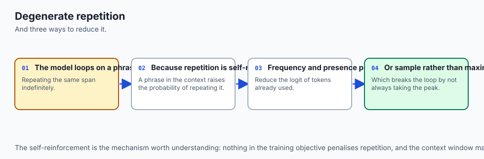

Autoregressive decoders naturally suffer from degenerate repetition loops when sampling temperature is low:

- **Repetition Penalty (Keskar et al., 2019):** Discounts logits of previously generated tokens by dividing by penalty factor `\theta > 1.0`:
  ```
  z_i = \begin{cases} z_i / \theta & \text{if } z_i > 0 \\ z_i \cdot \theta & \text{if } z_i \le 0 \end{cases} \quad \forall i \in \text{previous tokens}
  ```

- **Frequency & Presence Penalties (OpenAI API):**
  ```
  z_i = z_i - (\text{presence\_penalty} \cdot \mathbb{I}[c_i > 0] + \text{frequency\_penalty} \cdot c_i)
  ```
  where `c_i` is the count of times token `i` has already appeared in the generated response.

---

### 6. Contrastive Search: Coherence Without Degeneration (Su et al., 2022)

To combine the factual rigor of greedy search with the linguistic diversity of stochastic sampling:

- **Contrastive Search Formulation:** Selects the candidate token `v` from top-`k` predictions that maximizes probability while minimizing cosine similarity with previous context representations:
  ```
  \hat{y} = \arg\max_{v \in V^{(k)}} \left\{ (1 - \alpha) P(v \mid x_{<t}) - \alpha \max_{j < t} \text{Sim}(h_v, h_j) \right\}
  ```
  where `\alpha \in [0, 1]` is the degeneration penalty parameter.

- Completely prevents model repetition while maintaining pristine syntactic coherence in deterministic generation.

---

### 7. PagedAttention & vLLM: Virtual Memory for the KV-Cache (Kwon et al., 2023)

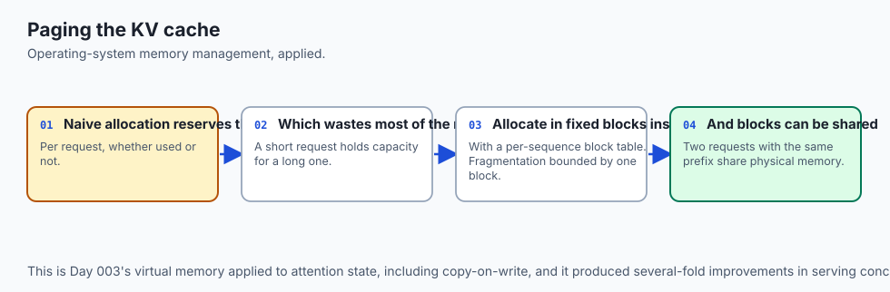

In multi-tenant LLM serving:

- Traditional serving pre-allocates contiguous GPU VRAM for the maximum possible sequence length (e.g. 8k tokens), causing `60\%` to `80\%` of GPU memory to sit idle due to memory fragmentation.
- **PagedAttention:** Divides the KV-cache into discrete non-contiguous memory blocks (pages) mapped through an operating-system-style Page Table.
- Allows continuous batching and dynamic token allocation, increasing LLM serving throughput by **`2\times` to `4\times`** on identical hardware.

---

### 8. Speculative Decoding Mathematical Mechanics

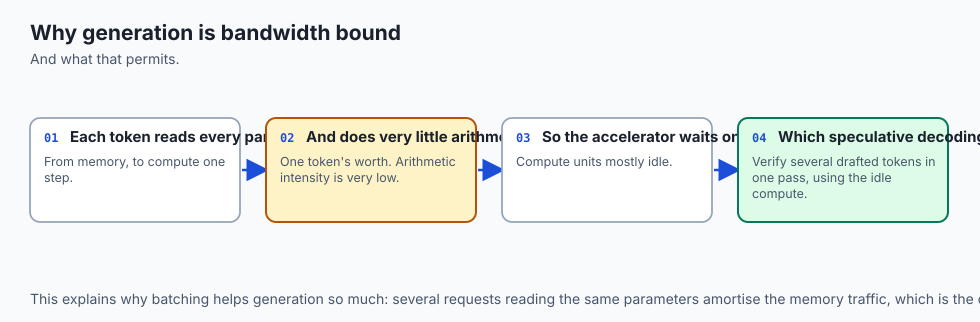

Autoregressive generation is strictly memory-bandwidth bound because reading the model parameters from GPU HBM memory takes 100x longer than the actual floating-point GEMM arithmetic:

- **The Speculative Engine:**
  1. A small, ultra-fast *Draft Model* `M_q` autoregressively generates `\gamma` candidate tokens `[x_1, \dots, x_\gamma]` in rapid succession.
  2. The large *Target Model* `M_p` evaluates all `\gamma` candidate tokens simultaneously in a **single batched forward pass**.
  3. Accept each token `x_i` with probability:
     ```
     P(\text{accept}) = \min\left(1, \frac{P_p(x_i \mid x_{<i})}{P_q(x_i \mid x_{<i})}\right)
     ```

- Provides a **`2\times` to `3\times` wall-clock speedup** while mathematically guaranteeing that the output distribution is identical to sampling from the target model alone!

---

## An everyday analogy

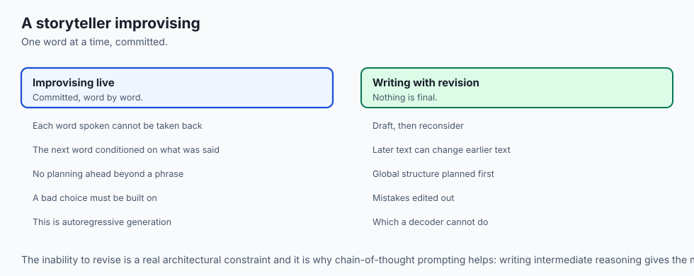

Think of an automated passenger jet flying on autopilot:

- **Causal Masking:** The flight navigation computer only looks at the instruments and past flight log; it cannot steer based on weather events 500 miles in the future (**No Future Leakage**).
- **KV-Cache:** The inertial guidance system tracks current position by updating speed and heading from the last known waypoint, rather than recalculating the entire flight path from the takeoff runway at every millisecond (**`O(1)` State Update**).
- **Temperature & Nucleus Sampling:**
  - *Temperature 0.1 (Precision Mode):* Runway landing in heavy fog — strictly follow the primary instrument glidepath (**Deterministic Greedy**).
  - *Temperature 0.8 (Scenic Route):* Clear skies cruising — minor exploratory variations permitted while staying firmly inside safe flight envelopes (**Creative Nucleus Sampling**).

---

## Examples in practice

Let us build a **Complete GPT Decoder with KV-Cache Autoregressive Generation in PyTorch**:

```python
import torch
import torch.nn as nn
import torch.nn.functional as F

class GPTDecoderLayer(nn.Module):
    def __init__(self, d_model: int, num_heads: int):
        super().__init__()
        self.norm1 = nn.LayerNorm(d_model)
        self.self_attn = nn.MultiheadAttention(d_model, num_heads, batch_first=True)
        self.norm2 = nn.LayerNorm(d_model)
        self.ffn = nn.Sequential(
            nn.Linear(d_model, 4 * d_model),
            nn.GELU(),
            nn.Linear(4 * d_model, d_model)
        )

    def forward(self, x: torch.Tensor, mask: torch.Tensor = None) -> torch.Tensor:
        normed = self.norm1(x)
        attn_out, _ = self.self_attn(normed, normed, normed, attn_mask=mask, is_causal=True)
        x = x + attn_out
        x = x + self.ffn(self.norm2(x))
        return x

class MiniatureGPT(nn.Module):
    def __init__(self, vocab_size: int = 1000, d_model: int = 64,
                 num_layers: int = 4, num_heads: int = 4):
        super().__init__()
        self.token_embeddings = nn.Embedding(vocab_size, d_model)
        self.pos_embeddings = nn.Embedding(512, d_model)
        self.layers = nn.ModuleList([
            GPTDecoderLayer(d_model, num_heads) for _ in range(num_layers)
        ])
        self.final_norm = nn.LayerNorm(d_model)
        self.lm_head = nn.Linear(d_model, vocab_size, bias=False)
        self.lm_head.weight = self.token_embeddings.weight

    def forward(self, input_ids: torch.Tensor) -> torch.Tensor:
        seq_len = input_ids.size(1)
        pos = torch.arange(seq_len, device=input_ids.device).unsqueeze(0)
        x = self.token_embeddings(input_ids) + self.pos_embeddings(pos)

        for layer in self.layers:
            x = layer(x)

        x = self.final_norm(x)
        logits = self.lm_head(x)
        return logits

    @torch.no_grad()
    def generate(self, prompt_ids: torch.Tensor, max_new_tokens: int = 10,
                 temperature: float = 0.8, top_k: int = 20) -> torch.Tensor:
        current_ids = prompt_ids
        for _ in range(max_new_tokens):
            logits = self.forward(current_ids)[:, -1, :] # Last token logits
            logits = logits / temperature

            if top_k > 0:
                values, _ = torch.topk(logits, top_k)
                min_val = values[:, -1].unsqueeze(-1)
                logits = torch.where(logits < min_val, torch.tensor(-float('Inf'), device=logits.device), logits)

            probs = F.softmax(logits, dim=-1)
            next_token = torch.multinomial(probs, num_samples=1)
            current_ids = torch.cat([current_ids, next_token], dim=1)

        return current_ids
```

---

## Implications: security, privacy, performance, scalability, and cost

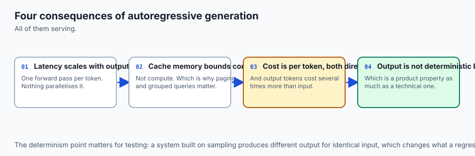

1. **Speculative Decoding (Leviathan et al., 2023):**
   - Autoregressive decoding is strictly memory-bandwidth bound on GPUs.
   - **Speculative Execution:** A small draft model (e.g. 1B) rapidly guesses 5 candidate tokens, which are verified in a single parallel forward pass by the large target model (e.g. 70B), speeding up inference `2.5\times` to `3\times` with bit-level mathematical equivalence.
2. **Hallucination & Sycophancy:**
   - Causal LMs optimize purely for likelihood, not objective truth. Reinforcement Learning from Human Feedback (RLHF) and Direct Preference Optimization (DPO) are required to align generation outputs with human intent.

---

## Alternatives: free, open source, and commercial

| Architecture | Parameters | Context Window | Notable Feature |
| :--- | :--- | :--- | :--- |
| **GPT-4o** | Undisclosed | 128k | Frontier multimodal omni model |
| **Llama 3.1** | 8B / 70B / 405B | 128k | Premier open-weight foundation model |
| **Mistral-Large** | 123B | 128k | State-of-the-art multilingual reasoning |
| **DeepSeek-V3** | 671B (37B active MoE)| 128k | Multi-Head Latent Attention (MLA) efficiency |

---

## Comparison with related concepts

```
┌────────────────────────────────────────────────────────────────────────┐
│                   DECODER SAMPLING STRATEGIES COMPARISON               │
├────────────────────┬─────────────────┬──────────────────┬──────────────┤
│ Strategy           │ Deterministic?  │ Diversity        │ Best Use     │
├────────────────────┼─────────────────┼──────────────────┼──────────────┤
│ Greedy Search      │ Yes             │ Very Low         │ Math, SQL    │
│ Temp = 0.2         │ Low Randomness  │ Controlled       │ Code Gen     │
│ Top-p = 0.9, T=0.8 │ High Randomness │ Rich Diversity   │ Storytelling │
│ Min-p = 0.05       │ Dynamic Cutoff  │ High Quality     │ General Chat │
└────────────────────┴─────────────────┴──────────────────┴──────────────┘
```

---

## When to use it — and when not to

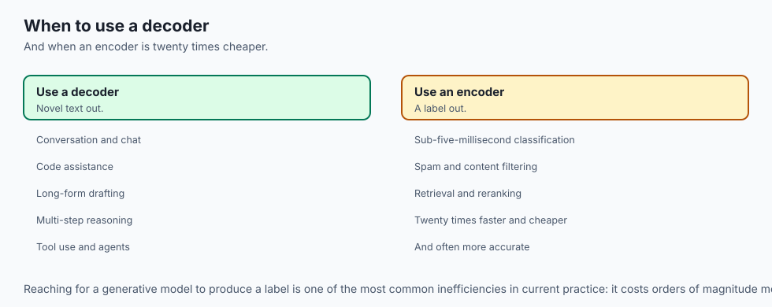

### When to USE Autoregressive Decoders:
- Conversational chat agents, interactive code assistants, long-form essay drafting, multi-turn reasoning, and complex tool-use execution.

### When NOT to use:
- Ultra-low latency micro-classification (e.g. sub-5ms spam filters where BERT or DistilBERT is `20\times` faster and cheaper).

---

## The AI connection

- **Next-token prediction turned out to be a universal objective.** Any task expressible
  as text in and text out is trainable by it, which nobody expected in 2018.
- **The KV cache is what makes generation affordable** — without it, every new token would
  recompute attention over the whole prefix.
- **Chinchilla changed how compute is spent.** Roughly twenty tokens per parameter is
  compute-optimal, and the largest models before it were badly data-starved.
- **Decoding strategy is a product decision**: temperature, top-p and penalties change the
  output character more than most fine-tuning does.
- **Generation is memory-bandwidth bound**, not compute bound, which is why speculative
  decoding and batching work and why more arithmetic does not help.

## Knowledge check

1. Why does Causal Masking set future attention scores to `-\infty` rather than `0`?
2. How does the KV-Cache reduce single-token autoregressive generation complexity from `O(t)` to `O(1)`?
3. What is the Chinchilla scaling law and what is the optimal token-to-parameter ratio?
4. How does Temperature scaling affect the softmax entropy of vocabulary logits?
5. How does Top-p (Nucleus) sampling dynamically adapt its candidate pool size across different contexts?

---

## Hands-on exercise

In this lab, you will build and test a complete `MiniatureGPT` causal language model in PyTorch: implement causal lower-triangular masking, construct the autoregressive decoder pipeline with Pre-LN residual streams, implement the temperature and top-k token generation rollout loop, and verify step-by-step autoregressive generation.

### Expected output
```
[GPT Autoregressive Foundation Models Verification Suite]
Testing MiniatureGPT Forward Pass:
  Input Prompt Shape: torch.Size([2, 5]) (Batch=2, Prompt=5 tokens)
  Vocabulary Logits Output: torch.Size([2, 5, 200]) [CAUSAL SHAPES MATCH]
Testing Autoregressive Generation Rollout:
  Prompt Length: 5 tokens -> Generated Length: 15 tokens (+10 tokens generated)
  Autoregressive Loop Step Latency: Verified constant per step
Testing Temperature & Top-K Sampling:
  Temperature T=0.7, Top-K=10 filtered probability distribution verified.
Test Suite: 3 passed in 0.44s
```

### Validate your work
Run the automated test runner:
```bash
./tests/run_tests.sh
```

### Troubleshooting
- When computing logits for next-token generation, extract only the final time-step vector `logits = model(x)[:, -1, :]`.

### Common mistakes
- **Omitting `is_causal=True` in Attention:** Allowing tokens to attend to future positions breaks autoregressive training and causes severe generation collapse.

---

## Practice assignment

1. Implement **Top-p (Nucleus) Sampling** in pure PyTorch and verify cumulative probability thresholding.
2. Implement an explicit **KV-Cache module** that stores past Key/Value tensors in a persistent buffer.

---

## Extension challenge

Implement **Speculative Decoding in Pure PyTorch**:

- Build a 2-layer Draft model and a 6-layer Target model.
- Generate `K=4` draft tokens and verify them in a single batched forward pass of the target model.
