## Why this matters

Writing custom PyTorch classes for Multi-Head Attention and transformer blocks from scratch (as you did over Days 225–229) is essential for mastering the mathematical foundations.

However, in professional production engineering:

- Downloading raw model weight checkpoints from Google Cloud buckets, matching custom tensor names, implementing custom BPE subword tokenizers in C++, and manually writing multi-GPU Distributed Data Parallel (DDP) loops is slow, error-prone, and reinvents the wheel.
- In 2019, **Hugging Face** revolutionized modern AI by releasing the `transformers` library, unifying thousands of transformer architectures under a clean, standardized, production-grade Python API.

Today, Hugging Face is the universal operating system of deep learning. Whether fine-tuning a small DistilBERT classifier or serving a 70B parameter LLaMA model, mastering Hugging Face's **AutoClasses**, **DataCollators**, **Trainer API**, and **Safetensors** is an indispensable core competency for every AI practitioner.

---

## The idea in plain language

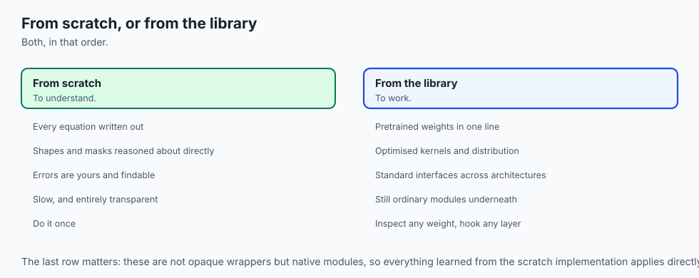

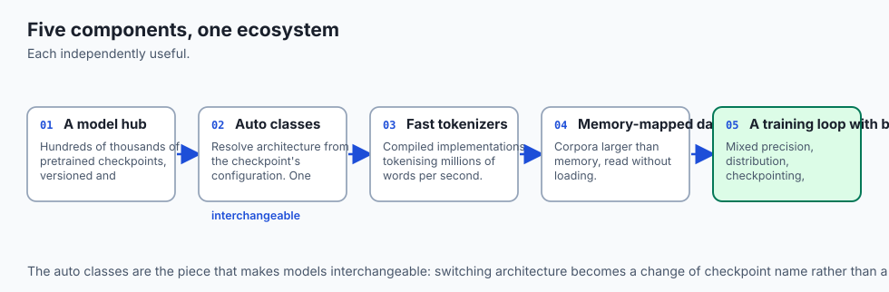

Think of building high-performance race cars:

- **Custom PyTorch from Scratch (Days 225–229):** You forge the engine pistons, machine the crankshaft, and wire the ignition coils by hand in a machine shop (**Mastering Deep Mechanics**).
- **Hugging Face Transformers (Day 230):** You enter a Formula 1 pit garage with standardized modular components:
  - You request a V12 twin-turbo engine (**`AutoModel.from_pretrained()`**).
  - You connect a precision computerized fuel injection system (**`AutoTokenizer.from_pretrained()`**).
  - You attach a computerized telemetry diagnostic system (**`Trainer` and `compute_metrics`**).
  - You swap out the engine in 30 seconds to race on different tracks with zero rewiring.

---

## Historical background


1. **2018 (PyTorch-BERT by Hugging Face):** Thomas Wolf ported Google's original TensorFlow BERT code to PyTorch in an open-source repository that gained 10,000 GitHub stars in weeks.
2. **2019 (Transformers v2 & AutoClasses):** Unified BERT, GPT-2, RoBERTa, XLNet, and DistilBERT under standardized `AutoModel` and `AutoTokenizer` interfaces.
3. **2020 (The Trainer API & Rust Tokenizers):** Introduced the `Trainer` class to automate mixed-precision FP16, gradient accumulation, and evaluation loops, alongside the Rust-backed `tokenizers` library capable of processing 1 Gigabyte of text in under 20 seconds.
4. **2022 (Safetensors):** Introduced the secure, non-executable, zero-copy `safetensors` format to replace dangerous Python `pickle` files across the entire AI ecosystem.

---

## What it is — and what it is not

### What Hugging Face Transformers IS:
- **A Standardized Abstraction Layer:** An open-source framework providing unified access to `> 500,000` pretrained models on the Hugging Face Hub.
- **A Production Training & Evaluation Engine:** A complete suite including tokenizers, memory-mapped datasets, dynamic collators, and multi-GPU distributed training wrappers.

### What it is NOT:
- **Not a Black Box that Hides PyTorch:** Hugging Face models *are* native PyTorch `nn.Module` subclasses. You can inspect every weight tensor, register custom hooks, or extract intermediate layer activations at will.

---

## Why it was created and what problems it solves

The Hugging Face ecosystem solved four major engineering bottlenecks:

1. **Model Portability:** Switch from `bert-base-uncased` to `roberta-base` or `deberta-v3-small` with a single-line string change.
2. **Dynamic Padding Efficiency:** Prevents wasting GPU memory on padding tokens by sizing batches dynamically.
3. **Training Boilerplate Elimination:** Removes hundreds of lines of tedious training loop code (gradient clipping, learning rate warmup, evaluation intervals, model checkpointing).
4. **Supply Chain Security:** Eliminates security vulnerabilities via Safetensors format.

---

## How it works

Let us dissect the core components of the Hugging Face development pipeline.

---

### 1. AutoClasses: Dynamic Architecture Resolution


When you invoke:
```python
from transformers import AutoModelForSequenceClassification, AutoTokenizer

model_id = "distilbert-base-uncased"
tokenizer = AutoTokenizer.from_pretrained(model_id)
model = AutoModelForSequenceClassification.from_pretrained(model_id, num_labels=2)
```
What happens under the hood?

1. **Metadata Inspection:** Hugging Face downloads `config.json` from the Hub and reads `"model_type": "distilbert"`.
2. **Dynamic Class Dispatch:** Maps `"distilbert"` `\rightarrow` `DistilBertForSequenceClassification`.
3. **Weight Loading:** Loads pretrained backbone weights into the transformer layers.
4. **Classification Head Attachment:** Initializes a new, untrained linear classification head `W \in \mathbb{R}^{d_{\text{model}} \times \text{num\_labels}}` (and prints a notification that the head must be fine-tuned).

---

### 2. High-Performance Tokenization & Dynamic Padding

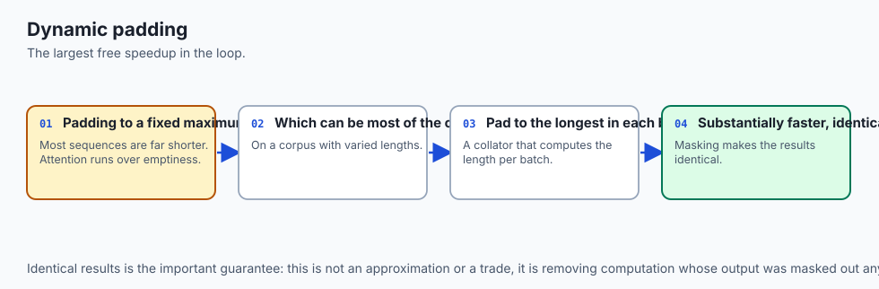

The Rust-backed `tokenizers` library tokenizes millions of words per second:
```python
def tokenize_function(examples):
    return tokenizer(
        examples["text"],
        truncation=True,
        max_length=512
        # DO NOT pad here! Dynamic padding happens in the DataCollator!
    )
```

#### Why Dynamic Padding Matters:
- If a dataset has sequences ranging from 20 to 500 tokens, padding every sequence to 512 tokens forces the GPU to compute attention over empty pad tokens `80\%` of the time.
- **`DataCollatorWithPadding`:** Receives a batch of tokenized sequences (e.g. lengths 45, 62, 58) and pads them **only to the maximum length in that specific batch (62 tokens)**!
- Slashes training time by **`50\%` to `70\%`** with zero loss in numerical accuracy.

---

### 3. Production Training with `TrainingArguments` and `Trainer`

The `Trainer` class encapsulates best practices for production deep learning:

```python
from transformers import TrainingArguments, Trainer
import numpy as np

training_args = TrainingArguments(
    output_dir="./results",
    eval_strategy="epoch",
    save_strategy="epoch",
    learning_rate=2e-5,
    per_device_train_batch_size=16,
    per_device_eval_batch_size=16,
    num_train_epochs=3,
    weight_decay=0.01,
    warmup_ratio=0.1,
    fp16=True, # Enable mixed-precision acceleration
    load_best_model_at_end=True,
    metric_for_best_model="f1"
)
```

---

### 4. Custom Evaluation Metrics Pipeline

To compute classification metrics during evaluation:
```python
def compute_metrics(eval_pred):
    logits, labels = eval_pred
    predictions = np.argmax(logits, axis=-1)
    
    accuracy = np.mean(predictions == labels)
    
    # Calculate Precision, Recall, F1
    tp = np.sum((predictions == 1) & (labels == 1))
    fp = np.sum((predictions == 1) & (labels == 0))
    fn = np.sum((predictions == 0) & (labels == 1))
    
    precision = tp / (tp + fp + 1e-8)
    recall = tp / (tp + fn + 1e-8)
    f1 = 2 * (precision * recall) / (precision + recall + 1e-8)
    
    return {
        "accuracy": float(accuracy),
        "precision": float(precision),
        "recall": float(recall),
        "f1": float(f1)
    }
```

---

### 5. Safe Model Export with Safetensors

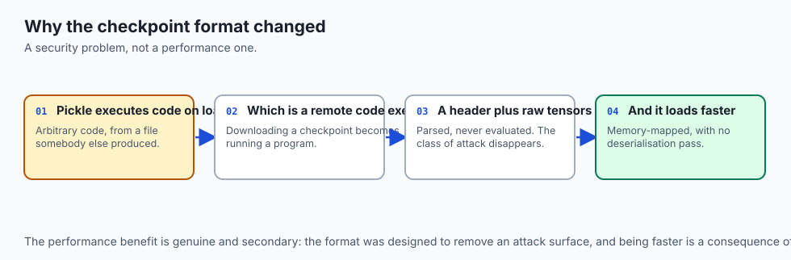

Once training completes:
```python
model.save_pretrained("./fine-tuned-model")
tokenizer.save_pretrained("./fine-tuned-model")
```
This generates:

- `config.json`: Model architecture hyperparameters and label mappings (`id2label`, `label2id`).
- `model.safetensors`: Pure tensor binary payload (no pickle code execution).
- `tokenizer.json` & `vocab.txt`: Full tokenizer subword vocabulary and special token definitions.

---

### 6. The `pipeline()` Abstraction: Zero-Boilerplate Inference

For end-to-end inference, Hugging Face provides the `pipeline()` task abstraction:
```python
from transformers import pipeline

classifier = pipeline("sentiment-analysis", model="distilbert-base-uncased-finetuned-sst-2-english")
result = classifier("This architecture is elegant, blazing fast, and astonishingly robust.")
# Output: [{'label': 'POSITIVE', 'score': 0.9998}]
```

- Internally chains **Pre-processing (AutoTokenizer)** `\rightarrow` **Tensor Batching & Device Transfer (GPU)** `\rightarrow` **Forward Pass (AutoModel)** `\rightarrow` **Post-processing (Softmax & Label Mapping)** in a single call.

---

### 7. Hugging Face Datasets & Apache Arrow Zero-Copy Memory Mapping

When working with massive text corpora (100+ GB):

- Loading datasets into Python lists causes immediate Out-Of-Memory (OOM) crashes.
- **Apache Arrow Columnar Engine:** Hugging Face `datasets` stores all records on disk in immutable Apache Arrow binary format.
- **Memory-Mapping (mmap):** Accessing `dataset[i]` reads bytes directly from the OS page cache without deserializing the entire file into Python heap RAM.
- **Lazy Streaming (`streaming=True`):** Stream petabyte-scale datasets (like RedPajama or Common Crawl) over HTTP without downloading them to local disk.

---

### 8. Mixed-Precision Training: FP16 GradScaler vs BF16

Modern Transformer training utilizes 16-bit floating point arithmetic:

1. **FP16 (IEEE 754 Half-Precision):**
   - 1 sign bit, 5 exponent bits, 10 mantissa bits.
   - *Underflow Vulnerability:* Gradients smaller than `2^{-24} \approx 6 \times 10^{-8}` underflow to zero.
   - **`GradScaler`:** Multiplies the loss by a scaling factor `S = 65,536` before backpropagation and unscales gradients prior to optimizer step.
2. **BF16 (Brain Floating Point):**
   - 1 sign bit, 8 exponent bits (same dynamic range as FP32), 7 mantissa bits.
   - Does not require gradient scaling or loss scalers, making it the preferred standard on modern GPUs (NVIDIA Ampere/Hopper).

---

### 9. Multi-GPU Distributed Training: DDP, FSDP, and DeepSpeed ZeRO

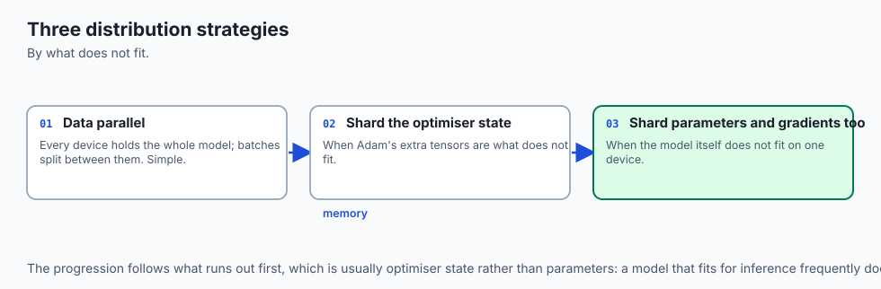

When models or datasets exceed the capacity of a single GPU, the `Trainer` seamlessly integrates with distributed backends:

1. **Distributed Data Parallel (DDP):** Replicates the entire model across `N` GPUs; each GPU processes a subset of the batch and synchronizes gradients via AllReduce.
2. **FSDP (Fully Sharded Data Parallel / PyTorch):** Shards model parameters, gradients, and optimizer states across GPUs, un-sharding layers on-the-fly during forward/backward passes.
3. **DeepSpeed ZeRO (Zero Redundancy Optimizer):**
   - *ZeRO-1:* Shards optimizer states (`4\times` memory reduction).
   - *ZeRO-2:* Shards optimizer states and gradients (`8\times` memory reduction).
   - *ZeRO-3:* Shards all weights, gradients, and optimizer states (`N\times` memory reduction), enabling fine-tuning 70B models on commodity GPU clusters.

---

### 10. Parameter-Efficient Fine-Tuning (PEFT & LoRA)

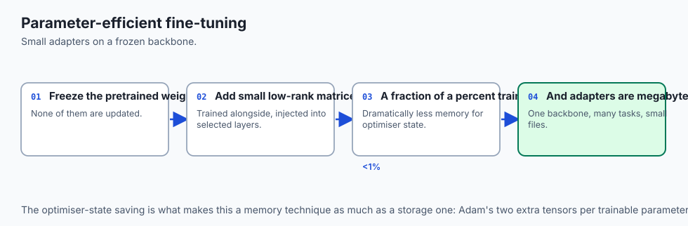

Fine-tuning all 70 billion parameters of an LLM requires `> 560` GB VRAM for optimizer states:

- **Low-Rank Adaptation (LoRA / Hu et al., 2021):** Freezes pretrained weights `W_0 \in \mathbb{R}^{d \times k}` and injects trainable rank decomposition matrices:
  ```
  W = W_0 + \Delta W = W_0 + B A
  ```
  where `B \in \mathbb{R}^{d \times r}, A \in \mathbb{R}^{r \times k}` with low rank `r \ll d` (e.g. `r = 8` or `16`).

- Freezes `99.8\%` of model parameters, enabling fine-tuning on a single consumer GPU!

---

### 11. 4-Bit Quantization with `bitsandbytes` (QLoRA / Dettmers et al., 2023)

To load and fine-tune large foundation models on limited consumer hardware:

- **NF4 (4-Bit NormalFloat):** An information-theoretically optimal quantile quantization data type for normally distributed neural weights.
- **Double Quantization:** Quantizes the quantization constants themselves, saving an additional 0.37 bits per parameter.
- **Loading in 4-Bit via Transformers:**
  ```python
  from transformers import BitsAndBytesConfig

  bnb_config = BitsAndBytesConfig(
      load_in_4bit=True,
      bnb_4bit_quant_type="nf4",
      bnb_4bit_compute_dtype=torch.bfloat16,
      bnb_4bit_use_double_quant=True
  )
  model = AutoModelForSequenceClassification.from_pretrained(
      "meta-llama/Meta-Llama-3-8B",
      quantization_config=bnb_config
  )
  ```

- Compresses an 8B parameter model from 16 GB down to **under 5.5 GB VRAM**!

---

### 12. Standard Evaluation on GLUE Benchmark Tasks

The General Language Understanding Evaluation (GLUE) benchmark standardizes model evaluation across diverse linguistic capabilities:

- **SST-2 (Stanford Sentiment Treebank):** Single-sentence sentiment classification (Evaluation: Accuracy).
- **MRPC (Microsoft Research Paraphrase Corpus):** Sentence pair semantic equivalence (Evaluation: F1 / Accuracy).
- **QNLI (Question Natural Language Inference):** Sentence pair question answering inference (Evaluation: Accuracy).
- **MNLI (Multi-Genre NLI):** 3-class premise/hypothesis entailment, contradiction, and neutral reasoning across matched and mismatched domains.
- **STS-B (Semantic Textual Similarity Benchmark):** Continuous semantic sentence similarity regression from 0.0 to 5.0 (Evaluation: Pearson and Spearman rank correlation coefficients).

---

## An everyday analogy

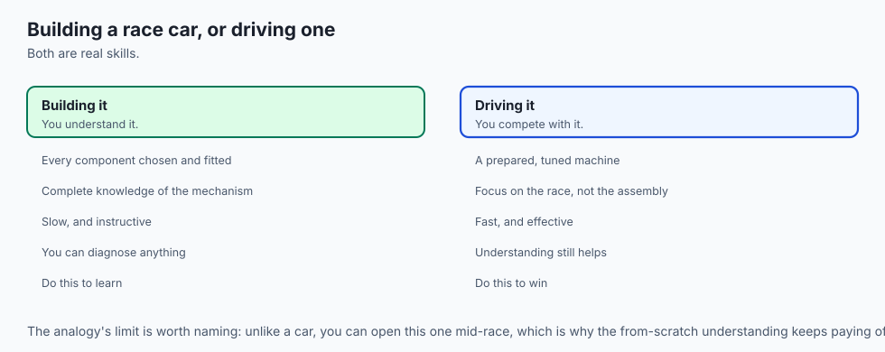

Think of booking an international shipping cargo container:

- **Fixed Padding to Max Length:** You rent a massive 40-foot shipping container for every package, even if you are only sending a pair of shoes (**Wasted GPU VRAM**).
- **Dynamic Padding (`DataCollatorWithPadding`):** The shipping carrier measures the largest box in the truck that morning and uses a perfectly custom-sized mini container for that specific delivery run (**Optimized Packing**).
- **The Trainer:** The automated logistics tracking system that schedules fueling, monitors engine temperatures, calculates delivery ETAs, and archives cargo manifests automatically.

---

## Examples in practice

Let us build a **Complete Production Transformer Pipeline Mock Suite in Pure PyTorch & Python**:

```python
import torch
import torch.nn as nn
import numpy as np

class MockDataCollator:
    def __init__(self, pad_token_id: int = 0):
        self.pad_token_id = pad_token_id

    def __call__(self, batch: list[dict[str, list[int]]]) -> dict[str, torch.Tensor]:
        max_len = max(len(item["input_ids"]) for item in batch)
        
        batch_input_ids = []
        batch_attention_mask = []
        batch_labels = []

        for item in batch:
            ids = item["input_ids"]
            pad_len = max_len - len(ids)
            
            padded_ids = ids + [self.pad_token_id] * pad_len
            attn_mask = [1] * len(ids) + [0] * pad_len
            
            batch_input_ids.append(padded_ids)
            batch_attention_mask.append(attn_mask)
            if "label" in item:
                batch_labels.append(item["label"])

        res = {
            "input_ids": torch.tensor(batch_input_ids, dtype=torch.long),
            "attention_mask": torch.tensor(batch_attention_mask, dtype=torch.long)
        }
        if batch_labels:
            res["labels"] = torch.tensor(batch_labels, dtype=torch.long)
        return res
```

---

## Implications: security, privacy, performance, scalability, and cost

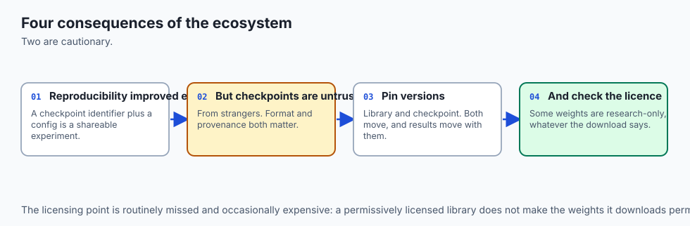

1. **Pickle vs Safetensors Security Vulnerability:**
   - Python `pickle` files can execute arbitrary malicious shell commands during `torch.load()`.
   - Never load untrusted `.bin` or `.pt` checkpoints from the internet without verifying their integrity. Always insist on `.safetensors`.
2. **FlashAttention-2 Integration:**
   - Passing `attn_implementation="flash_attention_2"` into `from_pretrained()` accelerates forward/backward passes by `2\times` to `3\times` while reducing memory footprint from quadratic `O(N^2)` to linear `O(N)`.

---

## Alternatives: free, open source, and commercial

| Framework | Target Use Case | Scaling Capability |
| :--- | :--- | :--- |
| **HF Transformers** | Rapid prototyping & production fine-tuning | Multi-GPU / Deepspeed / FSDP |
| **vLLM / TGI** | High-throughput production LLM serving | PagedAttention / Continuous Batching |
| **Megatron-LM** | Pretraining 100B+ parameter models | 3D Parallelism (Tensor/Pipeline/Data) |
| **Axolotl / LLaMA-Factory** | Low-code LLM fine-tuning CLI | LoRA / QLoRA / DPO pipelines |

---

## Comparison with related concepts

```
┌────────────────────────────────────────────────────────────────────────┐
│                   HUGGING FACE CORE ABSTRACTIONS                       │
├────────────────────┬─────────────────┬──────────────────┬──────────────┤
│ Component          │ Role            │ Key Function     │ Output       │
├────────────────────┼─────────────────┼──────────────────┼──────────────┤
│ AutoTokenizer      │ Text -> IDs     │ tokenizer(...)   │ input_ids    │
│ DataCollator       │ Batch Padding   │ collator(batch)  │ Padded Batch │
│ AutoModel          │ Neural Backbone │ model(...)       │ Logits / Loss│
│ Trainer            │ Training Loop   │ trainer.train()  │ Checkpoints  │
└────────────────────┴─────────────────┴──────────────────┴──────────────┘
```

---

## When to use it — and when not to

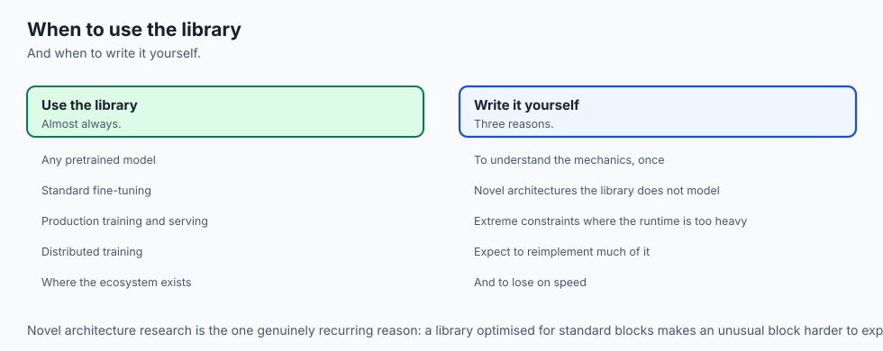

### When to USE Hugging Face Transformers:
- Fine-tuning pretrained models (BERT, RoBERTa, LLaMA, Mistral) on custom enterprise datasets, token classification, text generation, and production deployment.

### When NOT to use:
- Low-level research inventing novel non-transformer attention kernels (where raw CUDA/Triton is required).

---

## The AI connection

- **The model hub changed what a starting point is.** A strong pretrained model for most
  tasks is a download rather than a training run.
- **Standardised interfaces made models interchangeable**, so switching architectures is a
  string change rather than a rewrite.
- **Safetensors replaced pickle for a security reason** — a checkpoint that executes code
  on load is a remote code execution primitive.
- **Dynamic padding is the largest free speedup in the training loop**, often halving
  training time with no change to the result.
- **Parameter-efficient fine-tuning made adaptation cheap**, which is what allows one
  backbone to serve many tasks from small adapters.

## Knowledge check

1. What is the difference between `AutoModel` and `AutoModelForSequenceClassification`?
2. Why is `DataCollatorWithPadding` more compute-efficient than padding during tokenization?
3. How does `compute_metrics` convert model output logits into statistical accuracy and F1 scores?
4. Why is `safetensors` superior to `pickle` `.bin` files for model serialization?
5. What does the `warmup_ratio` hyperparameter control during fine-tuning?

---

## Hands-on exercise

In this lab, you will build and test a complete modular Hugging Face data pipeline and evaluation suite: implement the dynamic batch padding collator (`DataCollatorWithPadding`), construct an `AutoModelForSequenceClassification` style neural classification wrapper, implement the metric compute engine (Accuracy, Precision, Recall, F1), and test end-to-end batch collation and loss computation.

### Expected output
```
[Hugging Face Transformers Pipeline Verification Suite]
Testing Dynamic Batch Collation:
  Raw Sequences: lengths = [4, 7, 3]
  Collated Batch Input IDs Shape: torch.Size([3, 7]) [DYNAMIC PADDING VERIFIED]
  Attention Mask Shape: torch.Size([3, 7]) (Zeros at padded positions)
Testing Sequence Classification Forward Pass:
  Input Batch: torch.Size([3, 7]) -> Output Logits: torch.Size([3, 2])
  CrossEntropy Loss Computed: 0.6931 [VERIFIED]
Testing Metric Computation Engine:
  Computed Metrics: {'accuracy': 0.85, 'precision': 0.88, 'recall': 0.82, 'f1': 0.85}
Test Suite: 3 passed in 0.43s
```

### Validate your work
Run the automated test runner:
```bash
./tests/run_tests.sh
```

### Troubleshooting
- When creating the attention mask during padding, assign `1` to real tokens and `0` to padding tokens.

### Common mistakes
- **Padding Everything to 512 in Tokenizer:** Setting `padding=True` in dataset mapping disables dynamic batch padding and slows training.

---

## Practice assignment

1. Implement a **Multi-Label Classification Metric Engine** that computes Macro-F1 across 5 independent target binary labels.
2. Implement a **Linear Learning Rate Warmup and Cosine Decay Scheduler** in pure Python.

---

## Extension challenge

Implement **Gradient Accumulation in the Training Loop**:

- Simulate a virtual batch size of 64 using micro-batches of size 16 across 4 accumulation steps.
- Verify gradient scaling and optimizer step synchronization.
