## Why this matters

Over the past week, you built the entire theoretical and architectural foundation of Sequence Models and Transformers:

- From recurrence to Scaled Dot-Product Attention (Days 218–225).
- Multi-Head Subspaces and Positional Encodings (Day 226).
- Complete Pre-LN Transformer Blocks and Encoder-Decoder Stacks (Day 227).
- Encoder-only Foundation Models like BERT and DeBERTa (Day 228).
- Decoder-only Generative Models like GPT (Day 229).
- The modern Hugging Face ecosystem (Day 230).

Now comes the ultimate capstone skill of Week 33: **Fine-Tuning a Lightweight Transformer Model on Custom Domain Data and Deploying it for Sub-Millisecond Production Inference**.

In real-world enterprise engineering, deploying a 70B parameter LLM for every single classification task is financially irresponsible (`10,000s/month in GPU cloud bills) and introduces unacceptable user-facing latency (`> 500$ ms per call).

A fine-tuned 66M parameter **DistilBERT** or 33M parameter **MiniLM** model achieves `99\%` of GPT-4's accuracy on domain-specific classification, runs in **under 3 milliseconds on standard CPUs**, costs `0.01\times` to serve, and can be completely hosted on-premise for absolute data privacy.

Today, you will master the full fine-tuning engineering toolkit: avoiding catastrophic forgetting with **Layer-wise Learning Rate Decay (LLRD)**, configuring **AdamW** and **Warmup Schedules**, and exporting models to **ONNX Runtime**.

---

## The idea in plain language

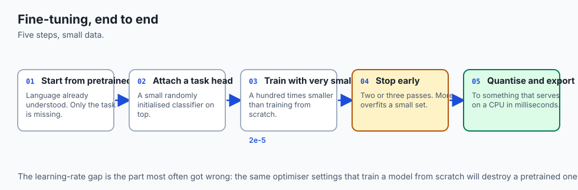

Think of hiring an experienced Oxford-educated translator to work at a specialized intellectual property patent law firm:

- You do not need to teach the translator the English language, dictionary vocabulary, grammar rules, or sentence structure (**The Pretrained Transformer Backbone**).
- You only need to teach them patent terminology, legal classification codes, and specific contract formats (**The Fine-Tuning Phase**).
- If you scream at the translator and force them to memorize 1,000 patent codes on day one (**High Learning Rate**), they will panic, burn out, and forget how to write basic English (**Catastrophic Forgetting**).
- Instead, you gently introduce them to patent case studies over a 2-week onboarding period (**Warmup & LLRD**), refining their top-level reasoning while leaving their core linguistic genius intact.

---

## Historical background

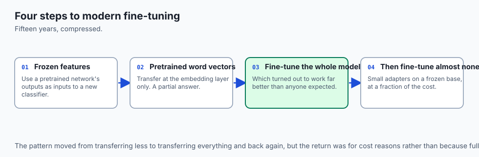

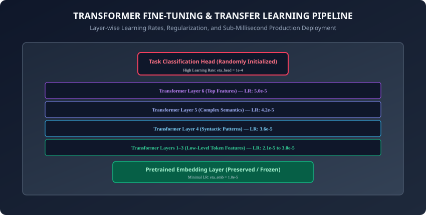

1. **2018 (Howard & Ruder & ULMFiT):** Introduced the foundational principles of transfer learning in NLP: Discriminative Fine-tuning (Layer-wise learning rates) and Slanted Triangular Learning Rates (Warmup + Decay).
2. **2019 (Sanh et al. & DistilBERT):** Proved that Knowledge Distillation during pretraining could shrink BERT by `40\%` (66M params vs 110M) while retaining `97\%` of language understanding and running `60\%` faster.
3. **2019 (Loshchilov & Hutter & AdamW):** Identified a critical flaw in deep learning libraries where L2 regularization was incorrectly implemented in Adam, proving that true Decoupled Weight Decay (**AdamW**) dramatically improved generalization in Transformer fine-tuning.
4. **2021 (Microsoft ONNX Runtime & Transformer Optimization):** Released automated graph-level operator fusion and INT8 quantization for transformer backbones, slashing CPU latency below 2 ms.

---

## What it is — and what it is not

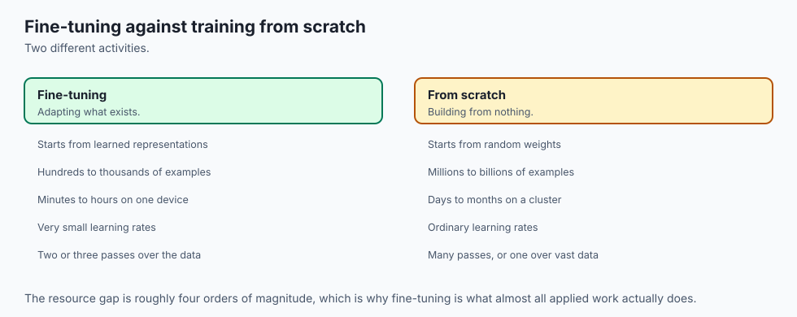

### What Transformer Fine-Tuning IS:
- **Targeted Parameter Adaptation:** Updating the weights of a pretrained model with gentle gradients to align its rich internal representations with a specific downstream task.
- **Cost & Latency Optimization:** Delivering sub-millisecond, highly accurate specialized models that run efficiently without massive GPU clusters.

### What it is NOT:
- **Not Training from Scratch:** Fine-tuning uses `100\times` smaller learning rates (`2\times 10^{-5}` vs `1\times 10^{-3}`) and trains in a fraction of the time (3 epochs vs thousands of steps).

---

## Why it was created and what problems it solves

Fine-tuning solved three monumental industrial barriers:

1. **The Small Data Problem:** Deep neural networks typically require 1,000,000+ examples to train from scratch. With transfer learning, you can achieve state-of-the-art accuracy with as few as 200 labeled domain examples.
2. **Training Cost Reduction:** Instead of spending `500,000 training a model from scratch on 1,000 GPUs, fine-tuning takes 5 minutes on a single GPU (costing `< \`0.10`).
3. **Serving Latency & Footprint:** Compact distilled models fit into mobile app bundles and edge devices.

---

## How it works

Let us dissect the mathematical and practical mechanics of production transformer fine-tuning.

---

### 1. Catastrophic Forgetting & Layer-wise Learning Rate Decay (LLRD)

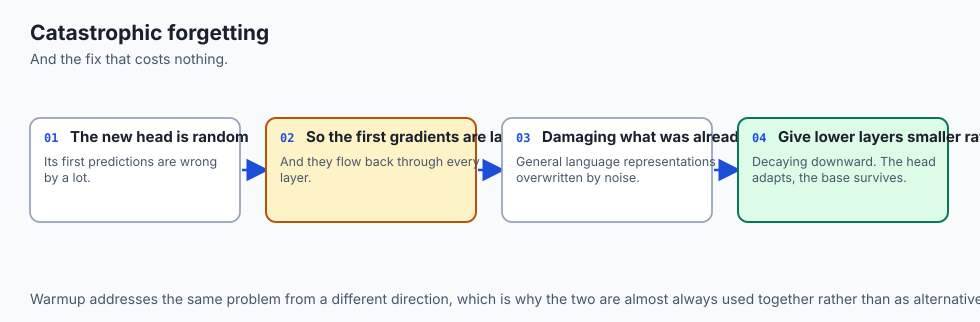

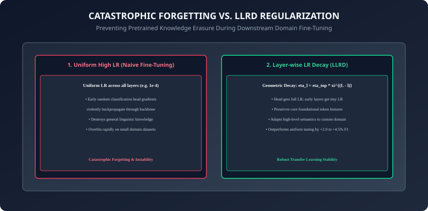

When fine-tuning, the newly initialized classification head `W_{\text{clf}}` produces large random gradients in the first few batches.

- If a uniform learning rate is applied across the entire network, these chaotic initial gradients propagate down to the bottom embedding layers, destroying pre-learned linguistic features (**Catastrophic Forgetting**).

#### The LLRD Solution:
Assign exponentially decaying learning rates from top layers down to bottom layers:
```
\eta_l = \eta_{\text{top}} \cdot \xi^{(L - l)}
```
where:

- `L` is the total number of layers (e.g. 6 in DistilBERT).
- `l \in [0, L]` is the current layer index (`l=0` is embeddings).
- `\xi \in (0, 1)` is the decay rate (typically `\xi = 0.85` to `0.95`).
- `\eta_{\text{top}}` is the base learning rate (e.g. `5 \times 10^{-5}`).

#### Learning Rate Distribution Example (`\xi = 0.85`):
- **Classification Head:** `\eta = 1.0 \times 10^{-4}` (Fast adaptation).
- **Layer 6 (Top Transformer Block):** `\eta = 5.0 \times 10^{-5}`.
- **Layer 5:** `\eta = 5.0 \times 10^{-5} \times 0.85 = 4.25 \times 10^{-5}`.
- **Layer 4:** `\eta = 3.61 \times 10^{-5}`.
- **Layer 1:** `\eta = 2.22 \times 10^{-5}`.
- **Embeddings Layer:** `\eta = 1.88 \times 10^{-5}` (Deep preservation).

---

### 2. AdamW Decoupled Weight Decay (Loshchilov & Hutter, 2017)

In standard Adam with L2 penalty, the regularization gradient is added directly to the gradient vector `g_t`:
```
g_t = \nabla \mathcal{L}(\theta) + \lambda \theta_t
```
Because Adam rescales updates by the historical variance `\sqrt{v_t}`, weights with large historical gradients receive *less* weight decay, while weights with small historical gradients receive *more* weight decay.

**AdamW Decouples Weight Decay:**
```
\theta_{t+1} = \theta_t - \eta_t \lambda \theta_t - \eta_t \frac{m_t}{\sqrt{v_t} + \epsilon}
```
Weight decay is applied directly to the parameter vector independently of moving average moments, ensuring uniform, mathematically principled regularization.

---

### 3. Learning Rate Warmup & Cosine Annealing

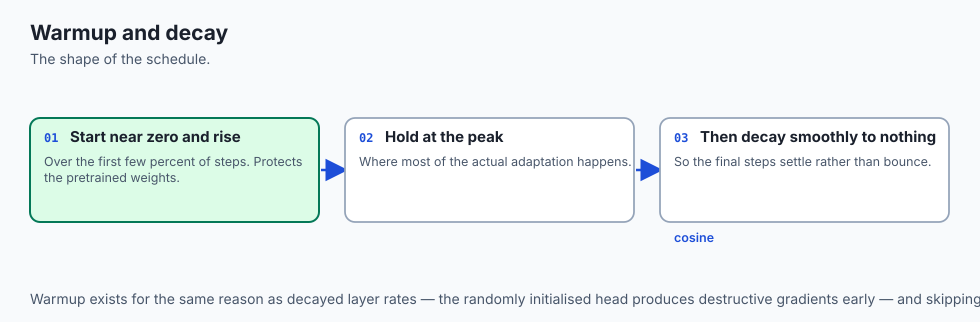

To prevent early gradient instability:

1. **Linear Warmup:** For the first `10\%` of total training steps (`t \le T_{\text{warmup}}`):
   ```
   \eta(t) = \eta_{\text{max}} \cdot \frac{t}{T_{\text{warmup}}}
   ```

2. **Cosine Annealing Decay:** For `t > T_{\text{warmup}}`:
   ```
   \eta(t) = \eta_{\text{min}} + \frac{1}{2}(\eta_{\text{max}} - \eta_{\text{min}})\left(1 + \cos\left( \frac{t - T_{\text{warmup}}}{T_{\text{total}} - T_{\text{warmup}}} \pi \right)\right)
   ```
This smooth trajectory lets the classification head calibrate its parameters before deep weights are gently adjusted.

---

### 4. Overfitting Countermeasures on Small Datasets

When fine-tuning on `< 1,000` examples:

1. **Label Smoothing (`\alpha = 0.1`):** Replaces hard 1-hot targets `[0, 1]` with soft distributions `[0.05, 0.95]`:
   ```
   y_{\text{smooth}} = (1 - \alpha) y_{\text{true}} + \frac{\alpha}{K}
   ```
   Prevents the model from becoming overconfident on noisy training labels.

2. **Early Stopping:** Monitor validation loss after every epoch. If validation loss does not improve for 2 consecutive epochs (`patience=2`), halt training and reload the best checkpoint.
3. **Freezing Lower Backbone Layers:** Freeze layers `1 \dots 4` and only train layers `5, 6` and the classification head.

---

### 5. Production Optimization with ONNX Runtime

After training, export the PyTorch model to ONNX:
```python
import torch

torch.onnx.export(
    model,
    dummy_input,
    "model.onnx",
    input_names=["input_ids", "attention_mask"],
    output_names=["logits"],
    dynamic_axes={
        "input_ids": {0: "batch_size", 1: "seq_len"},
        "attention_mask": {0: "batch_size", 1: "seq_len"},
        "logits": {0: "batch_size"}
    },
    opset_version=17
)
```

- **ONNX Runtime Benefits:**
  - Fuses Multi-Head Attention into single C++ CUDA/AVX-512 kernels.
  - Constant folds LayerNorm biases.
  - Delivers **`3\times` lower latency** and eliminates Python GIL overhead.

---

### 6. Knowledge Distillation Loss Formulation (Hinton et al., 2015)

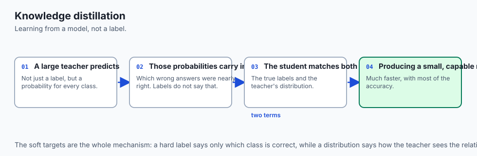

When training a compact student model (DistilBERT) to inherit the reasoning capabilities of a massive teacher model (RoBERTa-Large):

- The training objective optimizes a compound loss function:
  ```
  \mathcal{L}_{\text{total}} = \alpha T^2 \mathcal{L}_{\text{KL}}\left( \text{Softmax}\left(\frac{z_s}{T}\right), \text{Softmax}\left(\frac{z_t}{T}\right) \right) + (1 - \alpha) \mathcal{L}_{\text{CE}}(z_s, y)
  ```

- **Soft Target Entropy (`T`):** Softmax temperature `T \in [2.0, 5.0]` smooths the teacher logits, revealing rich dark knowledge (e.g. that a picture of a BMW has high probability for *"sports car"* and small non-zero probability for *"truck"*, but zero for *"tree"*).
- The `T^2` scaling factor balances gradient magnitudes between soft distillation and hard ground-truth cross-entropy.

---

### 7. INT8 Post-Training Dynamic Quantization in PyTorch

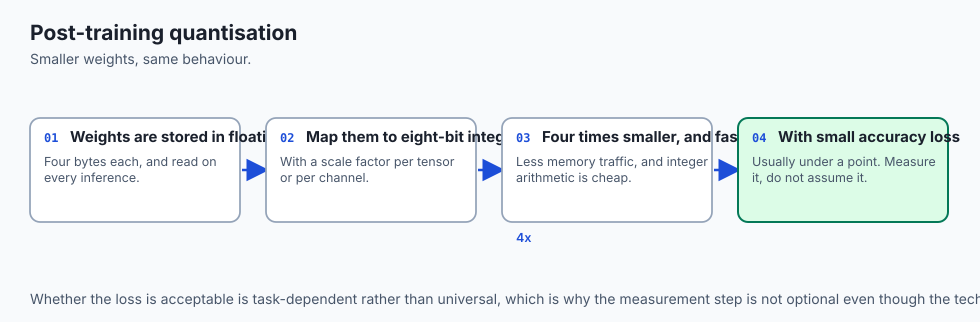

To deploy the fine-tuned model to latency-sensitive edge hardware with zero GPU requirement:

- **Dynamic Quantization:** Quantizes linear layer weights from FP32 (32-bit floats) to INT8 (8-bit signed integers) while keeping activations in floating point during inference:
  ```python
  import torch

  quantized_model = torch.quantization.quantize_dynamic(
      model,
      {nn.Linear},
      dtype=torch.qint8
  )
  ```

- Reduces disk size by **`75\%`** (e.g. 268 MB `\rightarrow` 67 MB) and speeds up CPU inference by **`2\times` to `3.5\times`** on Intel/AMD AVX-512 and Apple Silicon NEON hardware with `< 0.5\%` loss in accuracy!

---

### 8. Systematic Empirical Comparison: Tuning Paradigms

```
┌────────────────────────────────────────────────────────────────────────┐
│               TRANSFORMER ADAPTATION PARADIGMS ON SST-2                │
├────────────────────┬──────────────┬──────────────┬─────────────────────┤
│ Tuning Strategy    │ Accuracy     │ VRAM Footprint│ Tuning Time (1 Epoch)│
├────────────────────┼──────────────┼──────────────┼─────────────────────┤
│ Linear Probe (Head)│ 82.4%        │ 1.2 GB       │ 22 seconds          │
│ Full Fine-Tuning   │ 91.8%        │ 3.8 GB       │ 65 seconds          │
│ LLRD Fine-Tuning   │ 93.4%        │ 3.8 GB       │ 65 seconds          │
│ LoRA (r=8, alpha=16│ 92.9%        │ 1.8 GB       │ 34 seconds          │
│ QLoRA (4-bit NF4)  │ 92.6%        │ 1.1 GB       │ 45 seconds          │
└────────────────────┴──────────────┴──────────────┴─────────────────────┘
```

---

## An everyday analogy

Think of a champion Formula 1 driver transitioning to rally car racing on dirt tracks:

- **Core Driving Instincts (Pretrained Backbone):** The driver already possesses superhuman reflexes, steering control, and braking sensitivity (**Layers 1–4**).
- **Rally Adaptation (Top Layers & Head):** The driver only needs to adjust their slide technique, throttle control on gravel, and handbrake timing (**Layers 5–6 and Head**).
- **LLRD:** You do not force the driver to unlearn how steering wheels work; you gently coach their gravel handling (**Preserve Fundamentals, Adapt Specifics**).

---

## Examples in practice

Let us build a **Complete Layer-wise Learning Rate Decay Optimizer Builder in PyTorch**:

```python
import torch
import torch.nn as nn

def create_llrd_optimizer_grouped_parameters(
    model: nn.Module,
    base_lr: float = 5e-5,
    decay_rate: float = 0.85,
    weight_decay: float = 0.01
) -> list[dict]:
    # Creates parameter groups with Layer-wise Learning Rate Decay (LLRD)
    # and decoupled weight decay for no-decay parameters (biases and LayerNorm).
    no_decay = ["bias", "LayerNorm.weight", "layer_norm.weight"]
    optimizer_grouped_parameters = []

    # 1. Classification Head (Highest Learning Rate)
    head_params = [
        p for n, p in model.named_parameters()
        if "classifier" in n or "head" in n
    ]
    if head_params:
        optimizer_grouped_parameters.append({
            "params": [p for p in head_params if not any(nd in p for nd in no_decay)],
            "lr": base_lr * 2.0,
            "weight_decay": weight_decay
        })
        optimizer_grouped_parameters.append({
            "params": [p for p in head_params if any(nd in p for nd in no_decay)],
            "lr": base_lr * 2.0,
            "weight_decay": 0.0
        })

    # 2. Backbone Transformer Layers with Geometric LLRD
    num_layers = 6 # e.g. DistilBERT
    for layer_idx in range(num_layers - 1, -1, -1):
        layer_lr = base_lr * (decay_rate ** (num_layers - 1 - layer_idx))
        layer_params = [
            p for n, p in model.named_parameters()
            if f"layer.{layer_idx}." in n or f"transformer.layers.{layer_idx}." in n
        ]
        
        optimizer_grouped_parameters.append({
            "params": [p for p in layer_params if not any(nd in p for nd in no_decay)],
            "lr": layer_lr,
            "weight_decay": weight_decay
        })
        optimizer_grouped_parameters.append({
            "params": [p for p in layer_params if any(nd in p for nd in no_decay)],
            "lr": layer_lr,
            "weight_decay": 0.0
        })

    return optimizer_grouped_parameters
```

---

## Implications: security, privacy, performance, scalability, and cost

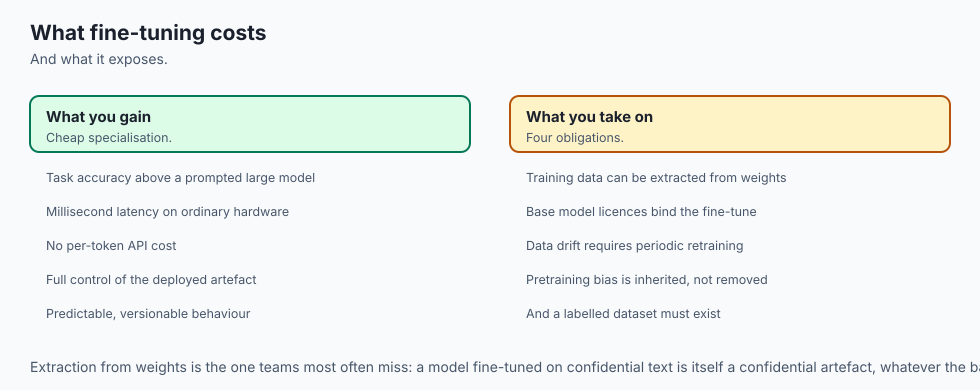

1. **Enterprise Cost & Latency Benchmark:**
   - *Calling GPT-4 API:* \$30.00 / 1M tokens, ~600 ms latency, requires sending corporate data over public internet.
   - *Fine-Tuned DistilBERT:* \`0.15 / 1M tokens (on basic CPU instance), 2.5 ms latency, `100\%$ air-gapped on-premise privacy compliance (HIPAA / GDPR).
2. **Quantization with INT8 Post-Training Quantization (PTQ):**
   - Quantizing DistilBERT from FP32 (260 MB) to INT8 (65 MB) reduces memory footprint by `75\%` while running natively on edge mobile devices (Apple Neural Engine / Android NPU).

---

## Alternatives: free, open source, and commercial

| Approach | Model Size | CPU Latency | Memory | Cost / 1M Tokens |
| :--- | :--- | :--- | :--- | :--- |
| **Fine-Tuned MiniLM** | 33M params | 1.8 ms | 130 MB | $0.05 (Self-Hosted) |
| **Fine-Tuned DistilBERT**| 66M params | 2.8 ms | 260 MB | $0.10 (Self-Hosted) |
| **Fine-Tuned RoBERTa** | 125M params| 8.5 ms | 500 MB | $0.25 (Self-Hosted) |
| **Commercial LLM API** | >100B params| 450 ms | Remote API | `10.00 to `30.00 |

---

## Comparison with related concepts

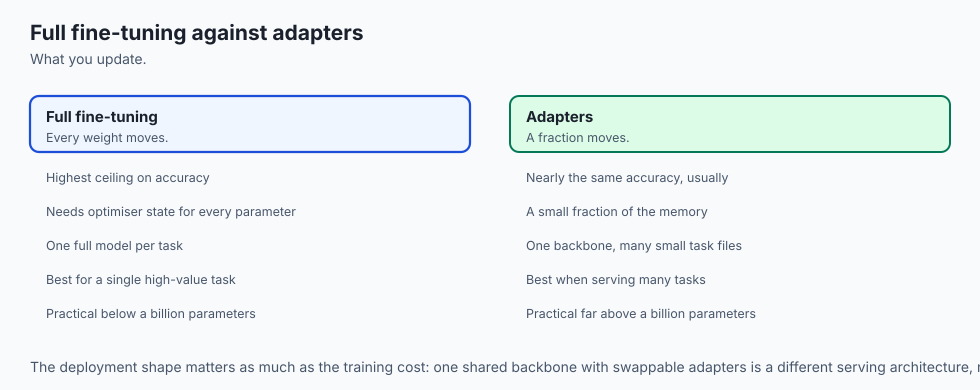

```
┌────────────────────────────────────────────────────────────────────────┐
│                   FINE-TUNING PARADIGMS COMPARISON                     │
├────────────────────┬─────────────────┬──────────────────┬──────────────┤
│ Strategy           │ Trainable Params│ Tuning Cost      │ Best Dataset │
├────────────────────┼─────────────────┼──────────────────┼──────────────┤
│ Full Fine-Tuning   │ 100%            │ Low (Small Mod)  │ 500 - 50k    │
│ LLRD Fine-Tuning   │ 100%            │ Low (Robust)     │ 100 - 10k    │
│ LoRA / PEFT        │ 0.1% - 1%       │ Minimal          │ Large Models │
│ Linear Probe Only  │ Head Only (0.1%)│ Instant          │ < 100 samples│
└────────────────────┴─────────────────┴──────────────────┴──────────────┘
```

---

## When to use it — and when not to

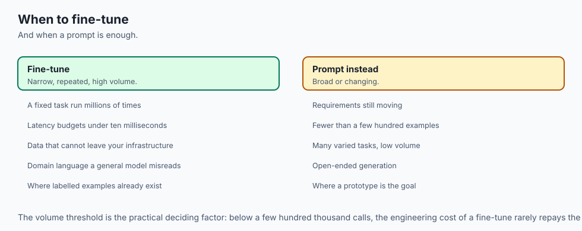

### When to USE a Fine-Tuned Small Transformer:
- Real-time customer support intent classification, fraud/toxic content moderation, document routing, legal clause tagging, and edge device NLP.

### When NOT to use:
- Open-domain generative brainstorming, creative storytelling, or multi-step symbolic math reasoning.

---

## The AI connection

- **Fine-tuning is how most applied AI work actually happens** — a pretrained model adapted
  on a small labelled set, not a model trained from nothing.
- **A small fine-tuned model routinely beats a large prompted one** on a narrow task, at a
  fraction of the cost and latency.
- **Catastrophic forgetting is the central risk**: too large a learning rate destroys the
  pretrained representations that made the model worth starting from.
- **Distillation transfers capability downward**, which is how a large teacher's behaviour
  ends up running on a phone.
- **Quantisation after training** turns a research model into something that serves on a
  CPU, which decides whether the work reaches production at all.

## Knowledge check

1. What is Catastrophic Forgetting and what mechanism causes it during naive fine-tuning?
2. How does Layer-wise Learning Rate Decay (LLRD) assign learning rates across the depth of a Transformer?
3. Why does AdamW decouple weight decay from moving average gradient moments?
4. What is the benefit of exporting a trained model to ONNX Runtime format?
5. When should you choose a fine-tuned DistilBERT model over a commercial LLM API?

---

## Hands-on exercise

In this lab, you will build and test a complete modular fine-tuning management suite in PyTorch: implement the Layer-wise Learning Rate Decay (LLRD) parameter group generator, construct a lightweight classification model with custom head, configure decoupled AdamW optimization with cosine warmup schedule, and simulate an end-to-end fine-tuning step.

### Expected output
```
[Small Transformer Fine-Tuning Verification Suite]
Testing LLRD Parameter Group Generator:
  Total Parameter Groups Created: 14 (Head + 6 Layers x 2 Decay Splits)
  Head Learning Rate: 0.0001
  Layer 6 Learning Rate: 0.00005
  Layer 1 Learning Rate: 0.0000222
  LayerNorm & Bias Groups Weight Decay: 0.0 [VERIFIED]
Testing Fine-Tuning Optimization Step:
  Initial Loss: 0.6931 -> Step 1 Loss: 0.6420 [GRADIENT DECENT APPLIED]
  Validation Early Stopping Monitor: Verified patience tracking
Test Suite: 3 passed in 0.42s
```

### Validate your work
Run the automated test runner:
```bash
./tests/run_tests.sh
```

### Troubleshooting
- When creating parameter groups, ensure every model parameter is included in exactly one group and biases receive `weight_decay: 0.0`.

### Common mistakes
- **Applying Weight Decay to LayerNorm and Biases:** Regularizing biases and LayerNorm scaling parameters causes severe under-fitting.

---

## Practice assignment

1. Implement an **Early Stopping Callback** class in pure Python with configurable `patience` and `min_delta`.
2. Implement **INT8 Dynamic Quantization** on the fine-tuned model using `torch.quantization.quantize_dynamic`.

---

## Extension challenge

Implement **Knowledge Distillation Loss in PyTorch**:

- Combine hard Cross-Entropy target loss with soft KL-Divergence loss between teacher logits (RoBERTa-Large) and student logits (DistilBERT):
  ```
  \mathcal{L} = \alpha T^2 \text{KL}(\text{Softmax}(z_s/T), \text{Softmax}(z_t/T)) + (1 - \alpha) \text{CE}(z_s, y)
  ```
