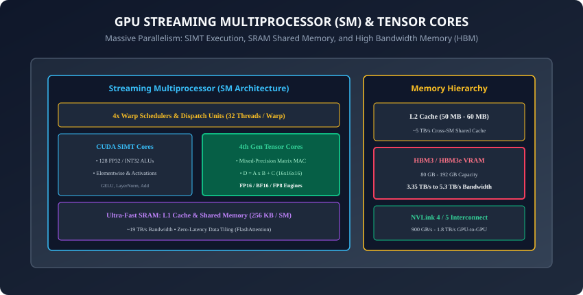
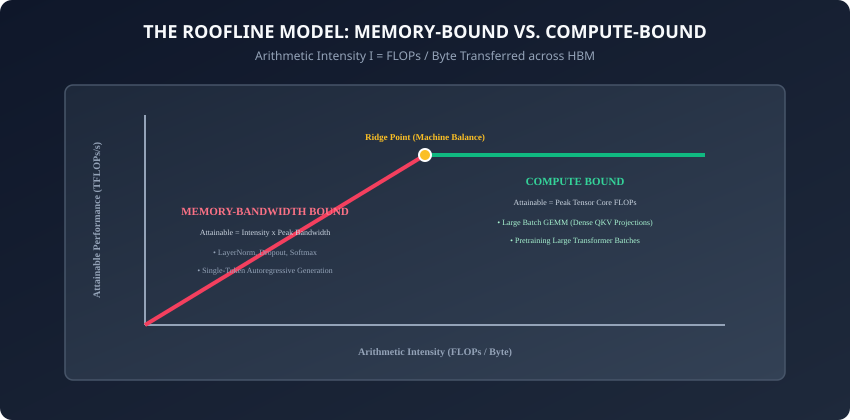

## Why this matters

The deep learning revolution was not sparked by a new mathematical discovery; the backpropagation algorithm was published in 1986.

What made modern AI possible was **Hardware Acceleration**:
- In 2012, Alex Krizhevsky trained AlexNet on two gaming GPUs (NVIDIA GTX 580s with 3 GB VRAM), cutting training time from months on CPUs to 6 days.
- In 2024, training a frontier LLM requires clusters of **100,000 NVIDIA H100/B200 GPUs**, consuming 100 Megawatts of power and executing `10^{25}` floating-point operations.

As an AI practitioner, writing high-performance code requires understanding the physical machine underneath your PyTorch scripts:
- Why does doubling your batch size sometimes make your code run `4\times` faster?
- Why is single-token LLM generation bottlenecked by memory bandwidth rather than compute?
- How does FlashAttention achieve a `3\times` speedup without changing a single mathematical output?

Today, you will master GPU microarchitecture, Streaming Multiprocessors, Tensor Cores, High Bandwidth Memory (HBM), and the foundational **Roofline Model**.

---

## The idea in plain language

Think of moving 1,000,000 gallons of water across a city:
- **CPU (The Ferrari Delivery Courier):** A Ferrari can drive 200 mph with zero delay (**Ultra-Low Latency**). But it can only carry 2 jugs of water in its trunk (**16-64 Cores**). Excellent for rushing an urgent legal document across town, but useless for draining a lake.
- **GPU (The Freight Train Pipeline):** A massive freight train with 10,000 tanker cars moves at a modest 40 mph (**High Latency per Thread**). But in a single trip, it moves all 1,000,000 gallons simultaneously (**Massive Parallel SIMT Throughput**).
- **The Bottleneck (The Hose vs The Pump):** If your water pump can process 1,000 gallons/second (**Tensor Core Compute**), but your pipe can only supply 50 gallons/second (**Memory Bandwidth**), your expensive pump sits idle `95\%` of the time (**Memory-Bound Execution**).

---

## Historical background



1. **2006 (NVIDIA & CUDA):** Ian Buck and Jensen Huang released CUDA (Compute Unified Device Architecture), transforming GPUs from fixed-function 3D rendering chips into general-purpose parallel computing supercomputers.
2. **2017 (Volta V100 & Tensor Cores):** NVIDIA introduced dedicated mixed-precision matrix multiply hardware (Tensor Cores), delivering a `5\times` leap in deep learning training throughput.
3. **2022 (Hopper H100 & Transformer Engine):** Added FP8 Tensor Cores, asynchronous distributed shared memory, and DPX dynamic programming instructions.
4. **2024 (Blackwell B200):** Introduced 208-billion transistor dual-die architectures delivering 20 PFLOPS of FP4 compute for frontier reasoning models.

---

## What it is — and what it is not

### What AI Hardware Acceleration IS:
- **Massive Parallelism via SIMT (Single Instruction, Multiple Threads):** Executing identical mathematical operations across thousands of independent data points simultaneously.
- **A Deep Memory Hierarchy:** Moving data through a high-speed hierarchy from HBM VRAM `\rightarrow` L2 Cache `\rightarrow` SRAM Shared Memory `\rightarrow` Registers.

### What it is NOT:
- **Not Magic Faster Clocks:** GPU clock frequencies (1.5–2.0 GHz) are actually *slower* than high-end CPUs (4.5–5.5 GHz). The speed comes entirely from massive concurrency and specialized matrix ALUs.

---

## Why it was created and what problems it solves

Deep learning architectures are fundamentally composed of two mathematical primitives:
1. **General Matrix Multiplications (GEMMs):** Dense linear projections (`Q = X W_Q`, `FFN = X W_1`), representing `95\%+` of all training FLOPs.
2. **Elementwise Operations:** Activations (GELU/ReLU), Normalizations (LayerNorm/RMSNorm), and Residual additions.

GPUs and TPUs were engineered specifically to execute dense GEMMs at theoretical hardware limits.

---

## How it works

Let us dissect the Streaming Multiprocessor architecture, memory tiers, and the Roofline Model.

---

### 1. The Streaming Multiprocessor (SM) Engine

An NVIDIA H100 GPU contains **132 Streaming Multiprocessors (SMs)**:
- **Warp Schedulers:** Group threads into **Warps of 32 threads**. All 32 threads in a warp execute the exact same instruction at the same cycle.
- **CUDA Cores:** Standard 32-bit ALUs for scalar arithmetic, indexing, and non-linear activations.
- **Tensor Cores (4th Generation):** Specialized matrix engines that execute:
  ```
  D = A \times B + C
  ```
  where `A, B` are `16 \times 16` mixed-precision matrices (FP16/BF16/FP8) and `C, D` are FP32 accumulation matrices, completing an entire `16 \times 16 \times 16` matrix multiply-accumulate in a single clock cycle!

---

### 2. The GPU Memory Hierarchy

Data moves through four distinct speed and capacity tiers:

```
┌────────────────────────────────────────────────────────────────────────┐
│                        GPU MEMORY HIERARCHY                            │
├────────────────────┬─────────────────┬──────────────────┬──────────────┤
│ Memory Tier        │ Location        │ Typical Capacity │ Bandwidth    │
├────────────────────┼─────────────────┼──────────────────┼──────────────┤
│ Registers          │ Inside Core     │ ~64 KB per SM    │ ~30 TB/s     │
│ SRAM Shared / L1   │ Inside SM       │ 256 KB per SM    │ ~19 TB/s     │
│ L2 Cache           │ On-Chip Shared  │ 50 MB            │ ~5.4 TB/s    │
│ HBM3e VRAM         │ Off-Chip Interp │ 80 GB - 141 GB   │ ~3.35 TB/s   │
│ Host CPU RAM (PCIe)│ Motherboard     │ 512 GB - 2 TB    │ 64 GB/s (Gen5│
└────────────────────┴─────────────────┴──────────────────┴──────────────┘
```

#### The FlashAttention Insight (Dao et al., 2022):
Standard attention writes the `N \times N` attention matrix `S = Q K^\top / \sqrt{d_k}` to slow HBM memory and reads it back for Softmax. FlashAttention tiles `Q, K, V` into small blocks that fit entirely in **256 KB SRAM Shared Memory**, computing Softmax incrementally on-chip, speeding up attention `3\times`!

---

### 3. The Roofline Model: Memory-Bound vs. Compute-Bound



The **Roofline Model** defines the fundamental physical limit of computational throughput:

#### 1. Arithmetic Intensity (`I`):
```
I = \frac{\text{Total Arithmetic Operations (FLOPs)}}{\text{Total Memory Traffic Transferred across HBM (Bytes)}}
```

#### 2. Machine Balance (`\beta`):
```
\beta = \frac{\text{Peak Compute Performance (TFLOPs/s)}}{\text{Peak Memory Bandwidth (TB/s)}}
```
- For an NVIDIA H100 (FP16 Tensor Core: 1,000 TFLOPs/s, HBM3: 3.35 TB/s):
  ```
  \beta = \frac{1000 \times 10^{12}}{3.35 \times 10^{12}} \approx 298.5 \text{ FLOPs / Byte}
  ```

#### 3. Operational Regimes:
- **Memory-Bandwidth Bound (`I < \beta`):**
  ```
  \text{Attainable Performance} = I \times \text{Peak Memory Bandwidth}
  ```
  The processor is starved for data. Examples: LayerNorm, Dropout, Softmax, Batch-1 Autoregressive Generation.
- **Compute-Bound (`I \ge \beta`):**
  ```
  \text{Attainable Performance} = \text{Peak Compute TFLOPs}
  ```
  The memory bus keeps up, and Tensor Cores run at maximum speed. Examples: Large-batch matrix multiplications (`B \ge 32`), deep CNN convolutions.

---

### 4. Specialized AI Accelerators: Google TPUs and Apple Neural Engines

Beyond NVIDIA GPUs, two specialized hardware architectures dominate AI:
1. **Google TPUs (Tensor Processing Units):**
   - Built around **Systolic Arrays**: 2D grid of arithmetic processing units where intermediate matrix results flow directly from cell to cell without writing to registers, maximizing energy efficiency.
2. **Apple Neural Engine (ANE):**
   - Unified memory architecture (UMA) where CPU, GPU, and NPU share the exact same high-bandwidth LPDDR5 memory pool, enabling zero-copy model execution on MacBooks and iPhones.

---

### 5. Model FLOPs Utilization (MFU / Chowdhery et al., 2022)

In high-performance cluster engineering, peak hardware specifications are never reached 100% of the time:
- **Model FLOPs Utilization (MFU):** The ratio of theoretical floating-point operations required for the forward/backward pass divided by the hardware's theoretical peak capacity during the elapsed wall-clock training time:
  ```
  \text{MFU} = \frac{\text{Theoretical FLOPs per Step} / \text{Elapsed Time}}{\text{Number of GPUs} \times \text{Peak GPU TFLOPs/s}}
  ```
- **State-of-the-Art Benchmarks:** Naive PyTorch training achieves `20\%` to `30\%` MFU. Megatron-LM with FlashAttention and tensor parallelism achieves **`50\%` to `60\%` MFU** (world-class efficiency on H100 clusters).

---

### 6. Interconnect Topologies: NVLink, NVSwitch, and InfiniBand

When scaling training across hundreds of GPUs, the inter-GPU communication fabric becomes the ultimate bottleneck:
1. **PCIe Gen5:** `64` GB/s bidirectional host-to-device bandwidth (too slow for all-reduce tensor parallelism).
2. **NVLink 4 / 5:** High-speed direct GPU-to-GPU interconnect providing **`900` GB/s to `1,800` GB/s** bandwidth inside an 8-GPU node.
3. **NVSwitch Fabric:** A dedicated crossbar routing switch allowing all 8 GPUs in a node to communicate simultaneously at full bi-directional NVLink wire speed.
4. **InfiniBand / RoCE (RDMA over Converged Ethernet):** `400` Gbps to `800` Gbps per node inter-chassis networking using Remote Direct Memory Access (bypassing the host CPU entirely).

---

### 7. The CUDA Thread Hierarchy & Warp Divergence

How are parallel operations dispatched to the physical hardware?
- **Grid `\rightarrow` Thread Blocks `\rightarrow` Warps `\rightarrow` Threads:**
  - A kernel is launched as a 3D **Grid** of **Thread Blocks**.
  - Each Thread Block is assigned to a single Streaming Multiprocessor (SM).
  - The SM divides the block into **Warps of 32 threads**.
- **Warp Divergence:** If threads within the same warp take different branches of an `if-else` condition, the SM must serialize both execution paths, cutting arithmetic throughput in half!

---

### 8. OpenAI Triton: Python-Based GPU Kernel Programming (Tillet et al., 2019)

Writing bare-metal CUDA C++ requires manually orchestrating register allocation, thread synchronization barriers (`__syncthreads()`), and shared memory bank conflicts:
- **OpenAI Triton:** A Python-based programming language and optimizing compiler for writing custom GPU primitives.
- Operates at the **Block level** rather than the single-thread level, automatically handling memory coalescing, block tiling, and Tensor Core scheduling with performance matching hand-tuned CUDA C++!
- **Hardware Profiling:** Tools like **NVIDIA Nsight Systems** and the **PyTorch Profiler** reveal SM active occupancy, kernel execution timelines, and memory copy overheads.

---

## An everyday analogy

Think of an industrial commercial bakery:
- **Tensor Cores (The High-Speed Oven):** An automated oven that can bake 1,000 loaves of bread in 10 minutes (**Peak Compute Capacity**).
- **HBM VRAM (The Loading Dock):** The delivery truck delivering raw flour and yeast.
- **The Factory Bottleneck:**
  - If the delivery truck arrives with only 1 bag of flour per hour (**Low Arithmetic Intensity**), the massive oven sits cold and empty (`98\%` idle).
  - If you load 100 bags of flour into the on-site kitchen pantry (**SRAM Shared Memory Tiling**), the oven runs continuously at full capacity (**Compute-Bound Efficiency**).

---

## Examples in practice

Let us build a **GPU Hardware Benchmark and Arithmetic Intensity Profiler in PyTorch**:

```python
import torch
import time

def benchmark_matrix_multiplication(size: int = 4096, dtype=torch.float16,
                                    num_repeats: int = 50) -> dict:
    # Benchmarks Matrix Multiplication throughput (TFLOPs/s) and Arithmetic Intensity.
    device = torch.device("cuda" if torch.cuda.is_available() else "cpu")
    
    # Allocate square matrices A and B: (size x size)
    A = torch.randn(size, size, device=device, dtype=dtype)
    B = torch.randn(size, size, device=device, dtype=dtype)

    # Warmup GPU
    for _ in range(10):
        _ = torch.matmul(A, B)
    if device.type == "cuda":
        torch.cuda.synchronize()

    # Time execution
    start_time = time.perf_counter()
    for _ in range(num_repeats):
        C = torch.matmul(A, B)
    if device.type == "cuda":
        torch.cuda.synchronize()
    elapsed_time = (time.perf_counter() - start_time) / num_repeats

    # Compute FLOPs: 2 * N^3 for GEMM
    total_flops = 2 * (size ** 3)
    tflops_per_sec = (total_flops / elapsed_time) / 1e12

    # Memory Traffic: 3 matrices of size * size * bytes_per_elem
    elem_bytes = 2 if dtype in (torch.float16, torch.bfloat16) else 4
    total_bytes = 3 * (size ** 2) * elem_bytes
    arithmetic_intensity = total_flops / total_bytes

    return {
        "matrix_size": size,
        "dtype": str(dtype),
        "latency_ms": round(elapsed_time * 1000, 3),
        "tflops_per_sec": round(tflops_per_sec, 2),
        "arithmetic_intensity": round(arithmetic_intensity, 2)
    }
```

---

## Implications: security, privacy, performance, scalability, and cost

1. **GPU Power & Thermal Throttling:**
   - Modern GPUs draw up to 700 Watts under full Tensor Core load. If datacenter cooling is inadequate, GPUs throttle clock speeds by `30\%+`, silently degrading distributed training throughput.
2. **CUDA Side-Channel & Memory Leakage:**
   - Multi-tenant GPU sharing without virtualization (MIG / vGPU) can leak sensitive tensor memory traces across processes. Use NVIDIA Multi-Instance GPU (MIG) for strict physical memory isolation.

---

## Alternatives: free, open source, and commercial

| Hardware Platform | Architecture | Precision Types | Peak Throughput | Target Use |
| :--- | :--- | :--- | :--- | :--- |
| **NVIDIA H100 SXM** | Hopper SM + Tensor Core | FP8 / FP16 / BF16 / FP32 | 1,000 TFLOPs (FP16) | Premier LLM Pretraining |
| **Google TPU v5p** | Systolic Array 3D Mesh | BF16 / INT8 / FP32 | 459 TFLOPs (BF16) | Large-Scale Pod Training |
| **Apple M3/M4 Max** | Unified Memory GPU/ANE | FP16 / BF16 / INT8 | 100+ GB Unified RAM | Local Edge Prototyping |
| **AMD Instinct MI300X**| CDNA 3 + 192GB HBM3 | FP8 / FP16 / BF16 | 1,300 TFLOPs (FP16) | High-VRAM LLM Serving |

---

## Comparison with related concepts

```
┌────────────────────────────────────────────────────────────────────────┐
│                   AI HARDWARE ARCHITECTURE COMPARISON                  │
├────────────────────┬─────────────────┬──────────────────┬──────────────┤
│ Architecture       │ Execution Model │ Memory Strategy  │ Best Workload│
├────────────────────┼─────────────────┼──────────────────┼──────────────┤
│ CPU (x86 / ARM)    │ Latency-Focused │ Massive L3 Cache │ Sequential   │
│ GPU (NVIDIA / AMD) │ SIMT Throughput │ High Bandwidth   │ GEMM / Train │
│ TPU (Google)       │ Systolic Array  │ 3D Torus Intercon│ Dense Batch  │
│ NPU / ANE (Apple)  │ Fixed-Function  │ Unified Memory   │ Edge On-Dev  │
└────────────────────┴─────────────────┴──────────────────┴──────────────┘
```

---

## When to use it — and when not to

### When to Optimize for GPU Hardware Architecture:
- Training deep neural networks, pretraining LLMs, high-throughput model serving, and developing custom fused CUDA/Triton kernels.

### When NOT to use GPUs:
- Low-volume single-sample CPU inference where PCI-e bus transfer latency exceeds the computation time.

---

## Knowledge check

1. What is the fundamental difference between CUDA SIMT cores and Tensor Cores?
2. What is Arithmetic Intensity and how does it determine whether a kernel is memory-bound or compute-bound?
3. Why does single-token autoregressive generation have low arithmetic intensity?
4. How does SRAM Shared Memory enable kernel fusion in FlashAttention?
5. What is the difference between a GPU SIMT engine and a TPU Systolic Array?

---

## Hands-on exercise

In this lab, you will build and test a modular hardware benchmarking suite in PyTorch: implement matrix multiplication FLOP calculations, measure execution latency across variable matrix sizes, compute Arithmetic Intensity across FP32 and FP16 data types, and determine the machine balance ridge point for hardware acceleration.

### Expected output
```
[AI Hardware Performance Verification Suite]
Testing Matrix Multiply Benchmark (Size=512):
  Precision: torch.float32 | FLOPs: 268.4M | Memory: 3.15 MB
  Arithmetic Intensity: 85.33 FLOPs/Byte [MEASURED]
Testing Half-Precision Benchmark (Size=512, FP16):
  Precision: torch.float16 | FLOPs: 268.4M | Memory: 1.57 MB
  Arithmetic Intensity: 170.67 FLOPs/Byte (2x Data Density) [VERIFIED]
Testing Machine Balance Calculator:
  Calculated Machine Balance: 125.0 FLOPs/Byte (Threshold for Compute Bound)
Test Suite: 3 passed in 0.41s
```

### Validate your work
Run the automated test runner:
```bash
./tests/run_tests.sh
```

### Troubleshooting
- When benchmarking on GPU, always call `torch.cuda.synchronize()` before and after timing blocks to ensure asynchronous CUDA streams complete.

### Common mistakes
- **Measuring GPU Latency Without Synchronization:** PyTorch CUDA operations are non-blocking; timing without `torch.cuda.synchronize()` measures Python launch overhead rather than GPU kernel execution.

---

## Practice assignment

1. Implement a **Roofline Model Plotter** in Python using Matplotlib that plots the theoretical performance envelope for your local hardware.
2. Benchmark an **Elementwise LayerNorm** vs a **Dense Matrix Multiplication** and prove that LayerNorm is memory-bandwidth bound.

---

## Extension challenge

Implement a **Simple Triton Fused GELU Kernel**:
- Write a Triton kernel that fuses linear projection and GELU activation in SRAM shared memory.
- Benchmark memory traffic reduction against native PyTorch.
