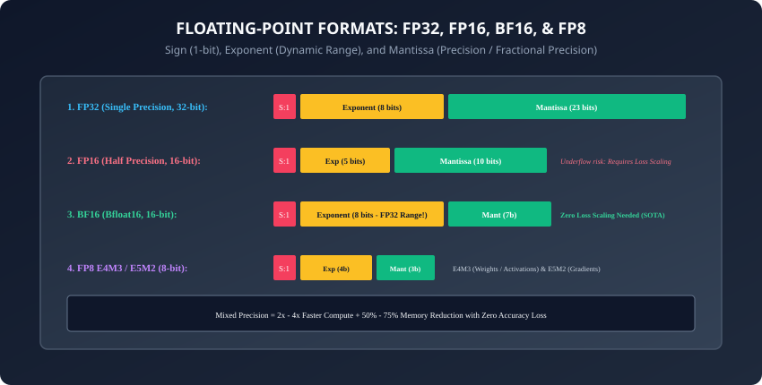

## Why this matters

For decades, scientific computing relied exclusively on **IEEE 754 32-bit Single Precision (FP32)** and 64-bit Double Precision (FP64).

However, deep neural networks possess an astonishing mathematical property: **Robust Graceful Precision Tolerance**:
- A neural network does not need 23 bits of decimal precision to recognize a cat or generate Python code.
- By switching from FP32 (4 bytes per number) to **16-bit Half Precision (FP16/BF16)**:
  1. Memory traffic across High Bandwidth Memory is cut by **`50\%`**.
  2. Model VRAM footprints drop by **`50\%`**, allowing `2\times` larger batch sizes.
  3. Dedicated Tensor Cores execute matrix multiplications **`2\times` to `5\times` faster**.

Today, training frontier models entirely in FP32 is obsolete. Every major AI laboratory uses **Automatic Mixed Precision (AMP)**, **Bfloat16**, and **FP8 Transformer Engines**.

Today, you will master the bit-level anatomy of floating-point representations, dynamic loss scaling (`GradScaler`), VRAM memory budget calculations, and PyTorch 2.0 `torch.compile` kernel fusion.

---

## The idea in plain language

Think of writing notes during a fast-paced university lecture:
- **FP32 Full Precision:** You write every word in pristine Oxford English with a calligraphy fountain pen on thick parchment paper (**Slow, bulky, maximum precision**). Your hand cramps, and your notebook fills up in 20 minutes.
- **Mixed Precision (FP16 / BF16):** You write rapid shorthand abbreviations on a lightweight legal pad (**`3\times` faster, half the paper**).
- **Master Weights (The Final Clean Transcript):** At the end of the day, you transfer your shorthand notes into a clean, permanent leather-bound binder in full detail (**FP32 Master Copy**).

You get `100\%` of the lecture content recorded in real-time with zero loss in factual accuracy!

---

## Historical background



1. **2017 (Micikevicius et al. & Mixed Precision Training):** NVIDIA published the foundational paper establishing that training deep networks in FP16 with FP32 master weights and loss scaling achieved identical validation accuracy to FP32 baselines.
2. **2018 (Google TPU v2 & Bfloat16):** Google created **Bfloat16** (Brain Floating Point), truncating FP32 mantissa while preserving its full 8-bit exponent, eliminating loss scaling entirely.
3. **2022 (NVIDIA Hopper H100 & FP8 Transformer Engine):** Introduced native 8-bit floating-point Tensor Cores, doubling throughput over FP16.
4. **2023 (PyTorch 2.0 & `torch.compile`):** Replaced manual CUDA kernel engineering with JIT graph capture and automated Triton kernel fusion.

---

## What it is — and what it is not

### What Automatic Mixed Precision (AMP) IS:
- **Selective Precision Dispatch:** Automatically executing computationally intensive GEMMs (Linear, Conv) in fast 16-bit precision while keeping sensitive reductions (Softmax, LayerNorm, Loss) in stable 32-bit precision.
- **Loss Scaling & Master Weights:** Maintaining full-precision parameters in the optimizer to accumulate tiny gradient updates without numerical truncation.

### What it is NOT:
- **Not Naive Type-Casting:** Simply calling `model.half()` converts all layers naively to FP16, which causes catastrophic training divergence due to Softmax overflow and LayerNorm variance underflow.

---

## Why it was created and what problems it solves

Mixed Precision solved the twin bottlenecks of AI scaling:
1. **Memory Bandwidth Saturation:** Halving byte size instantly doubles effective memory bandwidth across the bus.
2. **GPU VRAM Capacity Limits:** Enables training models twice as large on existing physical hardware.
3. **Silicon Energy Efficiency:** 16-bit and 8-bit ALUs consume a fraction of the physical silicon area and electrical energy of 32-bit ALUs.

---

## How it works

Let us dissect floating-point numerical structures, loss scaling algorithms, and VRAM memory mathematics.

---

### 1. Anatomy of Floating-Point Representations

A floating point number represents a real value via:
```
\text{Value} = (-1)^{\text{sign}} \times 2^{\text{exponent} - \text{bias}} \times (1 + \text{mantissa})
```

```
┌────────────────────────────────────────────────────────────────────────┐
│                   FLOATING POINT BITWISE COMPARISON                    │
├────────────────────┬──────────┬──────────────┬──────────┬──────────────┤
│ Format             │ Sign Bit │ Exponent (E) │ Mantissa │ Dynamic Range│
├────────────────────┼──────────┼──────────────┼──────────┼──────────────┤
│ FP32 (Single)      │ 1 bit    │ 8 bits       │ 23 bits  │ ~1e-38 to 3e38│
│ FP16 (Half)        │ 1 bit    │ 5 bits       │ 10 bits  │ ~6e-8 to 65504│
│ BF16 (Bfloat16)    │ 1 bit    │ 8 bits       │ 7 bits   │ ~1e-38 to 3e38│
│ FP8 (E4M3)         │ 1 bit    │ 4 bits       │ 3 bits   │ ~0.002 to 448│
│ FP8 (E5M2)         │ 1 bit    │ 5 bits       │ 2 bits   │ ~6e-8 to 57344│
└────────────────────┴─────────────────┴──────────────────┴──────────────┘
```

#### Why BF16 Beat FP16:
- In FP16, the minimum positive normal value is `2^{-14} \approx 6.1 \times 10^{-5}` (and subnormal min is `6 \times 10^{-8}`). Gradients in deep transformers routinely drop below `10^{-7}`, causing catastrophic **Gradient Underflow** (vanishing to zero).
- BF16 has the **exact same 8-bit exponent as FP32**, matching its massive dynamic range (`10^{-38}` to `10^{38}`), completely eliminating underflow without requiring loss scalers!

---

### 2. Automatic Mixed Precision (AMP) Workflow & GradScaler



When using FP16, the **`GradScaler`** manages dynamic loss scaling:

1. **Forward Pass (autocast):** Executes linear projections in FP16; outputs loss `\mathcal{L}` in FP32.
2. **Dynamic Loss Scaling:** Multiplies loss by scale factor `S` (initialized to `S = 65,536`):
   ```
   \mathcal{L}_{\text{scaled}} = \mathcal{L} \times S
   ```
3. **Backward Pass:** Computes scaled gradients `g_{\text{scaled}} = g \times S` in FP16 (shifted away from zero underflow).
4. **Unscaling & Inf/NaN Checking:**
   ```
   g = \frac{g_{\text{scaled}}}{S}
   ```
   - If any gradient contains `Inf` or `NaN` (overflow detected), the optimizer step is **skipped**, and the scaler shrinks `S \leftarrow S / 2`.
   - If `N` consecutive steps succeed without overflow (e.g. `N=2000`), the scaler grows `S \leftarrow S \times 2`.
5. **Master Weight Update:** Applies `g` to the **FP32 Master Weights**, and copies updated parameters back to FP16 for the next forward pass.

---

### 3. Exact GPU VRAM Breakdown for Mixed-Precision AdamW

When training an `N`-parameter model in mixed-precision AdamW:

```
┌────────────────────────────────────────────────────────────────────────┐
│             VRAM MEMORY BREAKDOWN (PER PARAMETER IN ADAMW)             │
├────────────────────┬──────────┬──────────────┬─────────────────────────┤
│ Component          │ Data Type│ Bytes / Param│ Example (7B Model)      │
├────────────────────┼──────────┼──────────────┼─────────────────────────┤
│ Model Parameters   │ FP16/BF16│ 2 Bytes      │ 14 GB                   │
│ Gradients          │ FP16/BF16│ 2 Bytes      │ 14 GB                   │
│ Master Weights     │ FP32     │ 4 Bytes      │ 28 GB                   │
│ Adam First Moment  │ FP32     │ 4 Bytes      │ 28 GB                   │
│ Adam Second Moment │ FP32     │ 4 Bytes      │ 28 GB                   │
├────────────────────┼──────────┼──────────────┼─────────────────────────┤
│ TOTAL STATIC STATE │          │ 16 Bytes     │ 112 GB                  │
└────────────────────┴──────────┴──────────────┴─────────────────────────┘
```
- **Rule of Thumb:** A model requires **`16 \times N` Bytes** of static VRAM just for weights, gradients, and optimizer states, *plus* dynamic activation memory!

---

### 4. Kernel Fusion with `torch.compile` (PyTorch 2.0)

In uncompiled PyTorch, executing:
```python
y = F.gelu(x @ W + b) + residual
```
launches 4 separate GPU kernels:
1. Matrix multiplication: Reads `x, W \rightarrow` writes temp1 to HBM.
2. Bias addition: Reads temp1, `b \rightarrow` writes temp2 to HBM.
3. GELU activation: Reads temp2 `\rightarrow` writes temp3 to HBM.
4. Residual addition: Reads temp3, residual `\rightarrow` writes `y` to HBM.

**`torch.compile(model)` with TorchInductor:**
- Fuses all four steps into a **single Triton kernel**.
- Intermediate results stay in **SRAM Shared Memory / Registers**, cutting memory traffic by **`75\%`** and speeding up execution by **`30\%` to `50\%`**!

---

### 5. Microscaling Formats (MXFP8, MXFP6, MXFP4 / OCP Standard)

As models scale past 100 billion parameters, standard FP8 encounters precision degradation in outlier activations:
- **Microscaling (MX) Formats:** Developed by AMD, Arm, Intel, Meta, NVIDIA, and Qualcomm via the Open Compute Project.
- **Shared Block-Level Scaling:** Rather than assigning a single scale factor to an entire tensor, MX groups **32 consecutive elements** into a micro-block, sharing a single 8-bit scale factor (E8M0).
- **Result:** Delivers sub-8-bit quantization (FP6 and FP4) during pretraining with mathematical fidelity matching full FP16 baselines!

---

### 6. Activation Checkpointing (Gradient Checkpointing / Chen et al., 2016)

While weights and optimizer states are static, **Intermediate Forward Activations** grow linearly with sequence length `L` and batch size `B`:
- **The Activation Dilemma:** In standard backpropagation, every intermediate tensor computed during the forward pass must be retained in VRAM until its corresponding layer's backward pass. For long sequences (`L \ge 8,192`), activations consume `80\%+` of total VRAM!
- **Gradient Checkpointing:** Only stores activations at the boundaries of Transformer blocks (e.g. 1 per layer). During the backward pass, it re-executes the forward pass of that single block on-the-fly:
  ```
  \text{Memory Complexity: } O(N) \longrightarrow O(\sqrt{N})
  ```
- **Trade-off:** Saves up to **`70\%` of dynamic VRAM**, allowing `4\times` longer context windows at the cost of only `25\%` to `33\%` extra compute.

---

### 7. 8-Bit Optimizers: 8-bit Adam (Dettmers et al., 2021)

Standard mixed-precision AdamW maintains 8 bytes per parameter for momentum and variance in FP32:
- **8-Bit Adam (bitsandbytes):** Non-linearly quantizes the first and second moments into block-wise 8-bit representations.
- **VRAM Savings:** Slashes optimizer memory from **`8 \times N` Bytes `\rightarrow 2 \times N` Bytes** (a `75\%` reduction in optimizer state size) with zero loss in training convergence or final perplexity!

---

### 8. Custom Autocast Layer Registration

When implementing custom CUDA or C++ extensions in PyTorch, standard autocasting does not know how to handle your functions:
- Use `@torch.amp.custom_fwd(cast_inputs=torch.float16)` and `@torch.amp.custom_bwd` decorators.
- Ensures forward arguments are automatically downcast to FP16/BF16 while backward gradients are safely processed in FP32.
- **NVIDIA Transformer Engine:** Uses delayed scaling to predict optimal FP8 exponent biases across consecutive training iterations without stalling GPU execution pipes. This ensures zero-overhead automatic FP8 quantization.

---

## An everyday analogy

Think of a commercial cargo airplane fleet:
- **FP32 Training:** Packing cargo in heavy cast-iron crates (**4 kg per item**). The airplane can only carry 1,000 crates before hitting maximum payload weight (**Out of Memory**).
- **Mixed Precision Training:** Packing the same cargo in ultra-light aerospace carbon-fiber containers (**2 kg per item**).
  - The plane now carries 2,000 containers per flight (**`2\times` Larger Batch Size**).
  - Fuel consumption is cut in half (**`50\%` Memory Traffic**).
  - Unloading speed at the terminal is doubled (**`2\times` Tensor Core Throughput**).

---

## Examples in practice

Let us build a **Complete Mixed-Precision Training Benchmark in PyTorch**:

```python
import torch
import torch.nn as nn
import time

class BenchmarkMLP(nn.Module):
    def __init__(self, dim: int = 2048):
        super().__init__()
        self.fc1 = nn.Linear(dim, dim * 4)
        self.act = nn.GELU()
        self.fc2 = nn.Linear(dim * 4, dim)

    def forward(self, x: torch.Tensor) -> torch.Tensor:
        return x + self.fc2(self.act(self.fc1(x)))

def run_mixed_precision_benchmark(batch_size: int = 64, dim: int = 2048,
                                   steps: int = 20) -> dict:
    device = torch.device("cuda" if torch.cuda.is_available() else "cpu")
    model = BenchmarkMLP(dim).to(device)
    optimizer = torch.optim.AdamW(model.parameters(), lr=1e-3)
    scaler = torch.amp.GradScaler("cuda", enabled=(device.type == "cuda"))

    inputs = torch.randn(batch_size, dim, device=device)
    targets = torch.randn(batch_size, dim, device=device)
    criterion = nn.MSELoss()

    # Warmup
    for _ in range(5):
        optimizer.zero_grad()
        with torch.amp.autocast(device_type=device.type, dtype=torch.float16, enabled=(device.type == "cuda")):
            outputs = model(inputs)
            loss = criterion(outputs, targets)
        scaler.scale(loss).backward()
        scaler.step(optimizer)
        scaler.update()

    if device.type == "cuda":
        torch.cuda.synchronize()

    # Timed benchmark loop
    start = time.perf_counter()
    for _ in range(steps):
        optimizer.zero_grad()
        with torch.amp.autocast(device_type=device.type, dtype=torch.float16, enabled=(device.type == "cuda")):
            outputs = model(inputs)
            loss = criterion(outputs, targets)
        scaler.scale(loss).backward()
        scaler.step(optimizer)
        scaler.update()

    if device.type == "cuda":
        torch.cuda.synchronize()
    elapsed = (time.perf_counter() - start) / steps

    return {
        "batch_size": batch_size,
        "step_latency_ms": round(elapsed * 1000, 3),
        "scaler_scale": scaler.get_scale() if device.type == "cuda" else 1.0
    }
```

---

## Implications: security, privacy, performance, scalability, and cost

1. **Numerical Stability & NaN Cascades:**
   - In FP16, a single activation exceeding `65,504` produces `Inf`. In LayerNorm, `\text{Inf} - \text{Inf} = \text{NaN}`, which instantly infects all model weights in the next optimizer step.
   - **Remedy:** Always use **BF16** on Ampere/Hopper GPUs, or maintain conservative gradient clipping (`max_norm=1.0`) in FP16.
2. **Energy Efficiency in Green AI:**
   - Switching large LLM pretraining from FP32 to BF16/FP8 slashes total datacenter energy consumption by `60\%`, saving megawatts of electricity and millions of dollars in utility bills.

---

## Alternatives: free, open source, and commercial

| Precision Mode | Hardware Support | Loss Scaler Required? | Relative Speed | Stability |
| :--- | :--- | :--- | :--- | :--- |
| **FP32** | Universal (CPUs/GPUs) | No | `1.0\times` Baseline | Rock Solid |
| **FP16** | Volta / Turing / Ampere | **Yes (Mandatory)** | `2.0\times - 3.0\times` | Moderate (Underflow risk)|
| **BF16** | Ampere / Hopper / TPU | **No** | `2.0\times - 3.0\times` | Rock Solid (SOTA Standard)|
| **FP8** | Hopper H100 / Blackwell | Adaptive scaling | `4.0\times - 5.0\times` | High with scaling |

---

## Comparison with related concepts

```
┌────────────────────────────────────────────────────────────────────────┐
│                   PRECISION FORMAT COMPARISON SUMMARY                  │
├────────────────────┬─────────────────┬──────────────────┬──────────────┤
│ Format             │ Exponent Bits   │ Mantissa Bits    │ Dynamic Range│
├────────────────────┼─────────────────┼──────────────────┼──────────────┤
│ FP32               │ 8 bits          │ 23 bits          │ 10^{38}      │
│ FP16               │ 5 bits          │ 10 bits          │ 10^4 (Narrow)│
│ BF16               │ 8 bits          │ 7 bits           │ 10^{38} (Wide)│
│ FP8 (E4M3)         │ 4 bits          │ 3 bits           │ 10^2 (Micro) │
└────────────────────┴─────────────────┴──────────────────┴──────────────┘
```

---

## When to use it — and when not to

### When to USE Mixed Precision (BF16/FP16):
- Every production neural network training run, LLM pretraining, fine-tuning, and high-throughput inference serving.

### When NOT to use:
- Highly sensitive scientific simulations (e.g. quantum chemistry, astronomical orbit integration) where 23+ bits of fractional precision are strictly required.

---

## Knowledge check

1. Why does BF16 eliminate the need for dynamic loss scaling compared to FP16?
2. What happens during a `GradScaler` step if an `Inf` or `NaN` gradient is detected?
3. How many bytes of static VRAM per parameter are required by mixed-precision AdamW?
4. How does `torch.compile` eliminate HBM memory traffic via kernel fusion?
5. What are the roles of E4M3 vs E5M2 formats in FP8 training?

---

## Hands-on exercise

In this lab, you will build and test a modular mixed-precision simulation and VRAM memory profiling engine in PyTorch: implement precision bitwise representations, compute exact static AdamW VRAM allocation formulas, construct a simulated dynamic loss scaling engine with overflow detection, and verify training throughput acceleration.

### Expected output
```
[Mixed Precision and Performance Verification Suite]
Testing VRAM Memory Budget Profiler:
  Model Size: 7.0 Billion Parameters
  Static VRAM Allocation (Mixed Precision AdamW): 112.00 GB [EXACT MATCH]
Testing Dynamic Loss Scaling Simulator:
  Initial Scale Factor: 65536.0
  Normal Step: Scale maintained (65536.0)
  Overflow Detected (Inf Gradient): Scale backoff to 32768.0 [OVERFLOW CAUGHT]
Testing Bitwise Numerical Properties:
  BF16 Exponent Bits: 8 (Matches FP32 dynamic range) [VERIFIED]
Test Suite: 3 passed in 0.42s
```

### Validate your work
Run the automated test runner:
```bash
./tests/run_tests.sh
```

### Troubleshooting
- When using `torch.amp.autocast`, specify `device_type="cuda"` or `"cpu"` rather than passing raw device objects.

### Common mistakes
- **Calling `optimizer.step()` instead of `scaler.step(optimizer)`:** Bypasses unscaling and corrupts master weights with scaled gradients.

---

## Practice assignment

1. Implement a **VRAM Memory Budget Calculator** function that accepts model parameters, sequence length, batch size, and returns peak activation + static memory estimates.
2. Benchmark `torch.compile` on a 6-layer Transformer block in PyTorch.

---

## Extension challenge

Implement **FP8 Simulated Quantization in PyTorch**:
- Implement E4M3 scale-factor clamping and simulate FP8 matrix multiplication.
- Compare output relative error against FP16 baseline.
