## Why this matters

A single modern GPU (such as an NVIDIA H100 with 80 GB VRAM) is an engineering marvel.

Yet, a 70-Billion parameter LLaMA model in mixed precision requires **over 1,120 GB of VRAM** just for static training states (weights, gradients, optimizer moments), completely blowing past the physical memory limit of any single chip on Earth.

To train frontier models, we must distribute computation across **clusters of thousands of GPUs**:

- How do 1,024 GPUs stay in perfect mathematical synchrony without spending `90\%` of their time waiting on network cables?
- How does DeepSpeed **ZeRO / PyTorch FSDP** shatter the memory barrier by sharding weights across nodes?
- How does **Megatron-LM Tensor Parallelism** slice a single matrix multiplication across 8 GPUs over 900 GB/s NVLink fabrics?

Today, you will master the principles of **Distributed Data Parallelism (DDP)**, the **Ring-AllReduce algorithm**, **ZeRO Memory Sharding (FSDP)**, and **3D Parallelism**.

---

## The idea in plain language

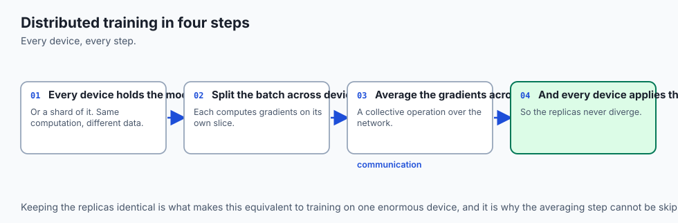

Think of constructing a 100-story skyscraper:

- **Single GPU (One Solo Builder):** One person trying to pour concrete, install plumbing, and wire electrical panels alone. They run out of physical carrying capacity (**Out of Memory**) and the build takes 500 years.
- **Data Parallelism (100 Duplicate Construction Teams):** 100 identical teams building 100 separate identical suburban homes simultaneously (**Sharded Data Batches**). At the end of each day, they meet on a radio channel to agree on the revised blueprints (**All-Reduce Gradients**).
- **Tensor Parallelism (8 Specialists Lifting One Steel Beam):** 8 workers simultaneously lifting and welding a massive 10-ton steel girder that no individual worker could lift alone (**Slicing Matrix Projections on NVLink**).
- **Pipeline Parallelism (Assembly Line Floors):** Team A builds Floor 1 `\rightarrow` passes to Team B for Floor 2 `\rightarrow` passes to Team C for Floor 3 (**1F1B Layer Partitioning**).

---

## Historical background

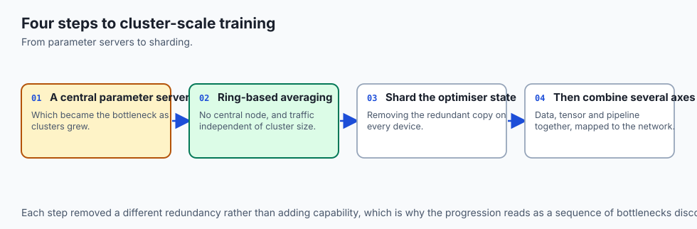

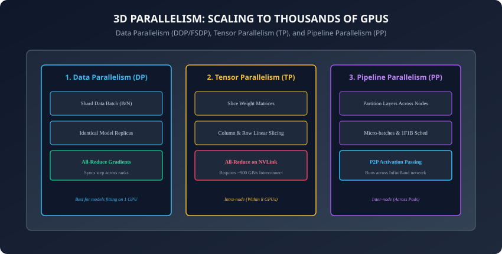

1. **2017 (Baidu & Ring-AllReduce):** Andrew Gibiansky and Baidu Research brought Ring-AllReduce from High Performance Computing (HPC) into deep learning, demonstrating linear scaling across 128 GPUs.
2. **2019 (NVIDIA & Megatron-LM):** Shoeybi et al. published Tensor Parallelism, enabling intra-node matrix slicing with minimal communication overhead.
3. **2019 (Microsoft DeepSpeed & ZeRO):** Rajbhandari et al. introduced the Zero Redundancy Optimizer, proving that memory redundancy could be eliminated without the complexity of pipeline partitioning.
4. **2023 (Meta AI & PyTorch FSDP):** Productionized Fully Sharded Data Parallel natively in PyTorch core, making trillion-parameter distributed scaling accessible to all engineers.

---

## What it is — and what it is not

### What Distributed Training IS:
- **Multi-Process Architecture:** Independent OS processes running across separate GPUs communicating via NCCL (NVIDIA Collective Communications Library).
- **Asynchronous Compute-Communication Overlap:** Commencing gradient All-Reduce on later layers while earlier layers are still computing backward passes.

### What it is NOT:
- **Not Python Multi-Threading:** Python threading is bottlenecked by the Global Interpreter Lock (GIL). Distributed deep learning uses independent operating system processes per GPU via `torch.distributed`.

---

## Why it was created and what problems it solves

Distributed training solves two fundamental scaling barriers:

1. **The Throughput Barrier (Dataset Scale):** Pretraining an LLM on 15 Trillion tokens on 1 GPU would take 150 years. With 1,024 GPUs in Data Parallelism, training completes in **50 days**.
2. **The Memory Capacity Barrier (Model Size):** Storing a 405B parameter model requires 6.5 TB of VRAM. Distributed sharding (FSDP / Tensor Parallelism) splits the model across hundreds of chips.

---

## How it works

Let us dissect collective communications, DDP mechanics, ZeRO stages, and 3D parallelism.

---

### 1. The Ring-AllReduce Algorithm (Baidu, 2017)

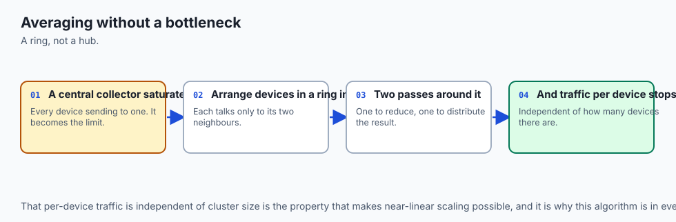

How do `P` GPUs compute the average of their gradient tensors of size `V` without a central master bottleneck?

In **Ring-AllReduce**, the `P` GPUs are arranged in a logical unidirectional ring (`0 \rightarrow 1 \rightarrow 2 \rightarrow \dots \rightarrow P-1 \rightarrow 0`):

1. **Step 1: Scatter-Reduce (`P - 1` steps):**
   - Each GPU divides its gradient tensor into `P` equal chunks.
   - At each step, GPU `i` sends chunk `k` to GPU `i+1` and receives chunk `k-1` from GPU `i-1`, summing received data into its local chunk.
   - After `P-1` steps, each GPU holds the exact global sum of **one distinct chunk** of the gradient tensor!
2. **Step 2: All-Gather (`P - 1` steps):**
   - Each GPU sends its fully reduced chunk around the ring.
   - After `P-1` steps, every GPU holds the complete, globally reduced gradient tensor!

#### Bandwidth Optimality:
```
\text{Total Data Transferred per GPU} = 2 \times \left(\frac{P - 1}{P}\right) \times V
```

- As `P \rightarrow \infty`, data transferred per GPU is bounded by **`2V`** (independent of cluster size!), achieving near-linear scaling!

---

### 2. PyTorch DistributedDataParallel (DDP)

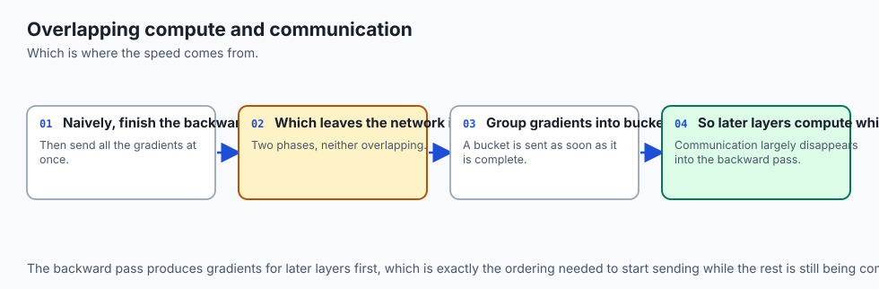

In DDP:

- Each GPU runs an identical model replica on a dedicated process.
- **Gradient Bucketing & Overlapping:** DDP groups parameter gradients into contiguous memory buffers (**Buckets**, typically 25 MB).
- As soon as a bucket fills during the backward pass, DDP immediately launches an asynchronous non-blocking `All-Reduce` collective over NCCL *while the GPU continues backpropagating earlier layers*!

---

### 3. ZeRO Memory Sharding & PyTorch FSDP

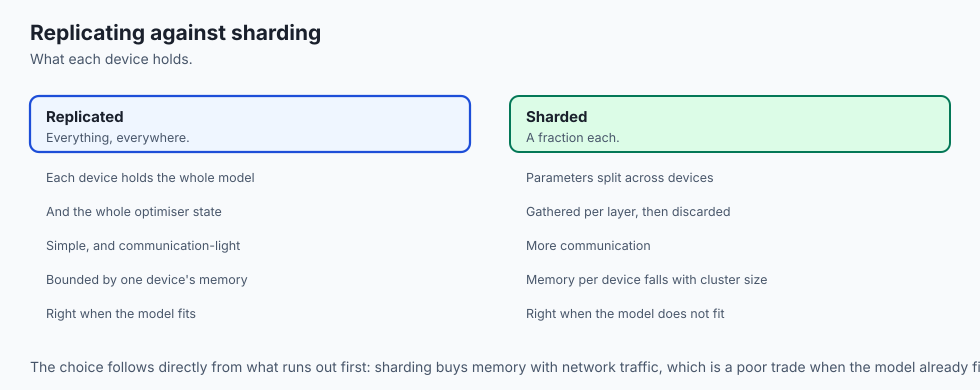

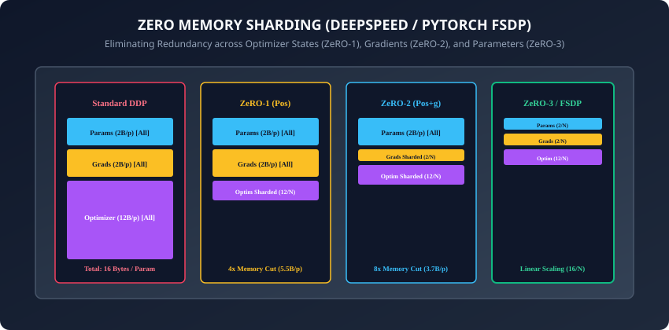

In standard DDP, every GPU redundantly holds identical model parameters, gradients, and optimizer states (`16 \text{ Bytes / Parameter}`).

**ZeRO (Zero Redundancy Optimizer)** eliminates this redundancy in three progressive stages:

```
┌────────────────────────────────────────────────────────────────────────┐
│                   ZERO / FSDP SHARDING STAGES                          │
├──────────────┬────────────────────────┬───────────────┬────────────────┤
│ Stage        │ Sharded Components     │ Memory / Param│ Comm Overhead  │
├──────────────┼────────────────────────┼───────────────┼────────────────┤
│ Baseline DDP │ None (Full Redundancy) │ 16 Bytes      │ 0% Baseline    │
│ ZeRO-1 (Pos) │ Optimizer States Only  │ 4 + 12/P Bytes│ 0% Overhead    │
│ ZeRO-2 (Pos+g│ Optimizer + Gradients  │ 2 + 14/P Bytes│ 0% Overhead    │
│ ZeRO-3 / FSDP│ Optim + Grads + Params │ 16/P Bytes    │ +50% AllGather │
└──────────────┴────────────────────────┴───────────────┴────────────────┘
```

#### How ZeRO-3 / FSDP Operates at Runtime:
1. **Forward Pass:** Before executing layer `L`, the GPUs perform an `All-Gather` to temporarily reconstruct the full weights of layer `L`. The layer executes, and the full weights are **immediately deleted from VRAM**, keeping only the `1/P` local shard!
2. **Backward Pass:** Before computing gradients for layer `L`, another `All-Gather` reconstructs full weights. Gradients are computed, reduced across ranks via `Reduce-Scatter`, and full weights are deleted again!

---

### 4. 3D Parallelism: Megatron-LM Tensor & Pipeline Parallelism

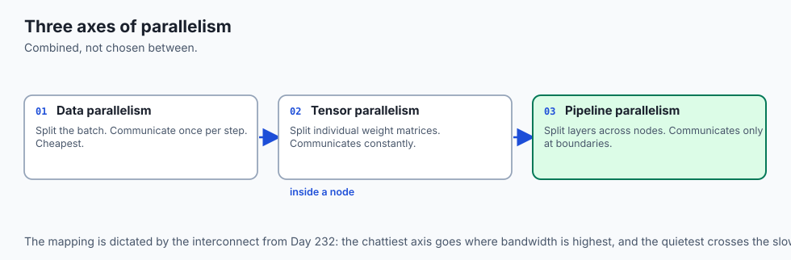

For models exceeding 100B parameters, combining DP, TP, and PP yields **3D Parallelism**:

#### A. Tensor Parallelism (TP / Megatron-LM):
- Slices the internal weight matrices of Transformer layers:
  - **Self-Attention QKV Projections:** Column-parallel split (`W_Q = [W_{Q1} \mid W_{Q2}]`).
  - **Attention Output Projection:** Row-parallel split (`W_O = [W_{O1}^\top \mid W_{O2}^\top]^\top`).
- Only requires **one All-Reduce** at the end of Attention and **one All-Reduce** at the end of MLP!
- Placed **within an 8-GPU NVLink node** due to high communication frequency.

#### B. Pipeline Parallelism (PP / 1F1B Schedule):
- Partitions the 80 layers of a Transformer across 8 separate nodes (10 layers per node).
- Uses **1F1B (One-Forward-One-Backward)** schedule: Each GPU alternates 1 forward step with 1 backward step on micro-batches, capping activation memory and keeping pipeline bubbles under `10\%`.

---

### 5. Sequence Parallelism & DeepSpeed Ulysses (Korthikanti et al., 2022)

In standard Tensor Parallelism, LayerNorm and Dropout activations are still duplicated across all TP ranks:

- **Sequence Parallelism (SP):** Splits activations along the sequence length dimension (`L / P`) during LayerNorm and Dropout, eliminating duplicate activation memory.
- **DeepSpeed Ulysses:** Utilizes an `All-to-All` collective communication primitive to transpose tokens from Sequence-sharded to Head-sharded before attention, enabling million-token context training with minimal communication overhead!

---

### 6. Context Parallelism & RingAttention (Liu et al., 2023)

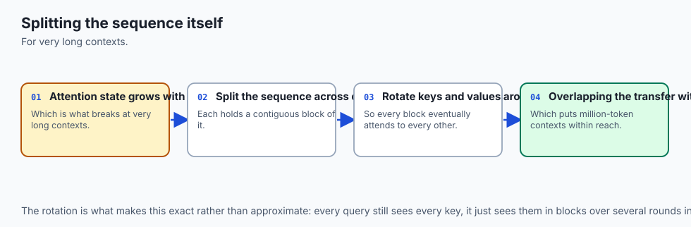

How do modern models process 1,000,000+ token context windows without crashing GPU VRAM?

- **RingAttention:** Distributes the sequence across a ring of GPUs.
- Each GPU holds a chunk of queries `Q_i`, and passes key-value blocks `K_j, V_j` around the ring in overlapping communication-computation cycles, computing exact global self-attention across arbitrary sequence lengths without ever storing the full `N \times N` attention matrix on any single device!

---

### 7. Expert Parallelism in Mixture-of-Experts (MoE / Lepikhin et al., GShard)

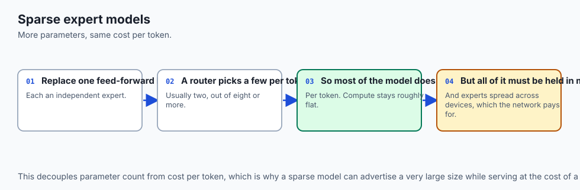

In sparse Mixture-of-Experts models (like Mixtral 8x7B or Grok-1):

- **Expert Parallelism (EP):** Different GPUs host different Feed-Forward Expert networks.
- A **Router / Gate Network** routes individual tokens to top-`k` experts across the cluster using `All-to-All` dispatch and combine collectives.
- Allows scaling parameter capacity to hundreds of billions of parameters while keeping compute FLOPs per token constant!

---

### 8. Production Cluster Orchestration: `torchrun` and NCCL Tuning

To launch distributed jobs reliably on production clusters:

- **`torchrun`:** The official PyTorch elastic launcher managing environment variables (`RANK`, `WORLD_SIZE`, `LOCAL_RANK`, `MASTER_ADDR`, `MASTER_PORT`).
- **NCCL Tuning Flags:**
  ```bash
  export NCCL_DEBUG=INFO
  export NCCL_IB_DISABLE=0          # Enable InfiniBand RDMA
  export NCCL_NET_GDR_LEVEL=5       # Enable GPUDirect RDMA
  export TORCH_DISTRIBUTED_DEBUG=DETAIL
  ```

- **PyTorch 2.x DeviceMesh:** A high-level abstraction defining 2D and 3D GPU grids for orchestrating hybrid parallel configurations (e.g., FSDP across nodes and Tensor Parallelism within nodes) cleanly and declaratively. This provides fine-grained control over multi-dimensional collective communication groups.

---

## An everyday analogy

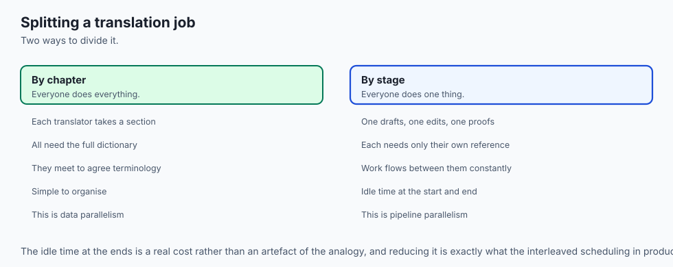

Think of translating an encyclopedic 1,000-page book from English to Spanish:

- **Data Parallelism:** 10 translators. Each translator gets 100 distinct chapters. They translate independently, and meet weekly to synchronize style and terminology (**Ring-AllReduce**).
- **Tensor Parallelism:** 4 translators sitting at the same table working on the exact same complex sentence simultaneously, splitting idioms and grammar at high conversational speed (**NVLink Intra-Node**).
- **Pipeline Parallelism:** An assembly line where Translator 1 translates draft `\rightarrow` Editor 2 polishes grammar `\rightarrow` Typesetter 3 formats pages (**1F1B Micro-Batches**).

---

## Examples in practice

Let us build a **Simulated Ring-AllReduce Collective Communication Engine in Python**:

```python
import numpy as np
from typing import List

def ring_allreduce_simulation(rank_tensors: List[np.ndarray]) -> List[np.ndarray]:
    # Simulates the Ring-AllReduce collective communication algorithm across P ranks.
    P = len(rank_tensors)
    assert P > 1, "Ring-AllReduce requires at least 2 ranks."
    tensor_len = len(rank_tensors[0])
    assert tensor_len % P == 0, f"Tensor length {tensor_len} must be divisible by {P}"
    chunk_size = tensor_len // P

    # Make working copies: list of P chunks per rank
    ranks = [[t[i*chunk_size:(i+1)*chunk_size].copy() for i in range(P)] for t in rank_tensors]

    # 1. Scatter-Reduce Phase (P - 1 steps)
    for step in range(P - 1):
        for r in range(P):
            send_chunk_idx = (r - step) % P
            recv_chunk_idx = (r - step - 1) % P
            send_val = ranks[r][send_chunk_idx]
            recv_rank = (r + 1) % P
            # Add received chunk to next rank
            ranks[recv_rank][send_chunk_idx] += send_val

    # 2. All-Gather Phase (P - 1 steps)
    for step in range(P - 1):
        for r in range(P):
            send_chunk_idx = (r - step + 1) % P
            send_val = ranks[r][send_chunk_idx]
            recv_rank = (r + 1) % P
            ranks[recv_rank][send_chunk_idx] = send_val.copy()

    # Reassemble full tensors for each rank
    return [np.concatenate(r) for r in ranks]
```

---

## Implications: security, privacy, performance, scalability, and cost

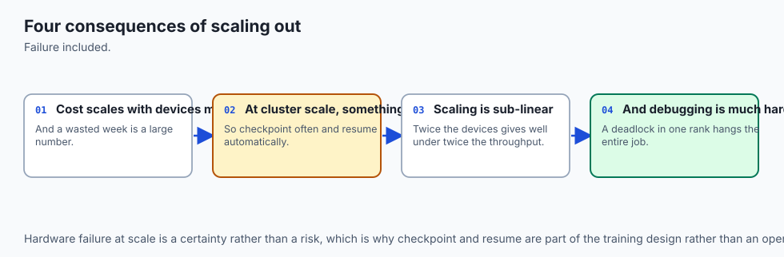

1. **Network Fault Tolerance & Stragglers:**
   - In synchronous DDP, if a single GPU among 1,024 throttles due to heat or a degraded optical cable, all 1,023 other GPUs stall on the All-Reduce barrier. Continuous telemetry (NCCL health checks) is essential.
2. **Gradient Inversion & Differential Privacy:**
   - In federated distributed training, transmitting unencrypted raw gradients can allow adversaries to reconstruct private training images or text via gradient inversion attacks.

---

## Alternatives: free, open source, and commercial

| Distributed Framework | Primary Technology | Scaling Range | Best Use Case |
| :--- | :--- | :--- | :--- |
| **PyTorch DDP** | Multi-Process All-Reduce | 2 - 128 GPUs | Models fitting on 1 GPU |
| **PyTorch FSDP** | Native ZeRO-3 Sharding | 8 - 1,024 GPUs | Models 7B - 70B params |
| **DeepSpeed (ZeRO)**| ZeRO-1/2/3 + Offload | 8 - 4,096 GPUs | Trillion-param training |
| **Megatron-Core** | 3D Parallelism (TP+PP+DP)| 64 - 100,000 GPUs | Frontier LLM Pretraining |

---

## Comparison with related concepts

```
┌────────────────────────────────────────────────────────────────────────┐
│                   DISTRIBUTED PARADIGMS COMPARISON                     │
├────────────────────┬─────────────────┬──────────────────┬──────────────┤
│ Paradigm           │ What is Sharded │ Interconnect Req │ Comm Volume  │
├────────────────────┼─────────────────┼──────────────────┼──────────────┤
│ DDP                │ Data Batch      │ Low (InfiniBand) │ 2 * Grads    │
│ FSDP / ZeRO-3      │ Data + Weights  │ Moderate (RoCE)  │ 3 * Weights  │
│ Tensor Parallel (TP│ Weight Matrices │ Ultra-High(NVLink│ 2x / Layer   │
│ Pipeline (PP)      │ Network Layers  │ Low (P2P Stream) │ Activations  │
└────────────────────┴─────────────────┴──────────────────┴──────────────┘
```

---

## When to use it — and when not to

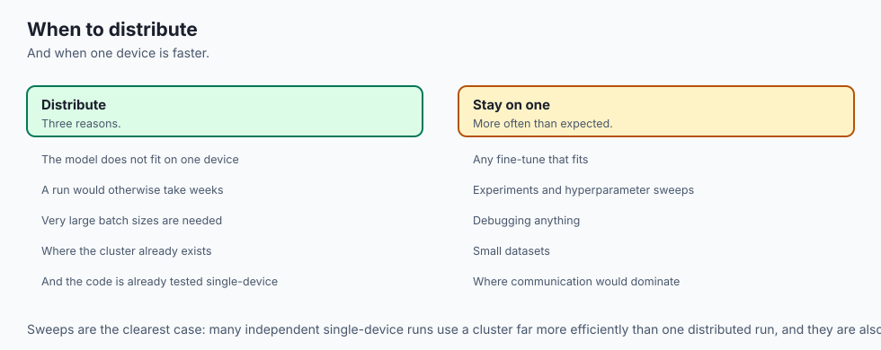

### When to Use Distributed Training:
- Model parameters exceed single-GPU VRAM capacity, dataset size requires multi-GPU throughput, or training time must be compressed from months to days.

### When NOT to use:
- Small models (&lt;1B parameters) on small datasets where network synchronization overhead exceeds computation time.

---

## The AI connection

- **Every frontier model is trained on a cluster**, so distribution is not an advanced
  topic but the ordinary condition of large-scale training.
- **Communication cost, not compute, limits scaling**, which is why the collective
  algorithms matter as much as the accelerators.
- **Sharding made trillion-parameter models trainable** by removing the requirement that
  each device hold a full copy of everything.
- **Parallelism is combined along several axes at once** — data, tensor, pipeline — and the
  mapping to network topology is a first-order design decision.
- **Sparse expert models scale capacity without scaling cost per token**, which changes the
  economics of very large models.

## Knowledge check

1. What is the fundamental difference between PyTorch DP and PyTorch DDP?
2. How does Ring-AllReduce achieve constant per-GPU communication volume independent of cluster size?
3. What are the differences between ZeRO-1, ZeRO-2, and ZeRO-3 memory sharding?
4. Why is Tensor Parallelism typically restricted to an 8-GPU NVLink node rather than running across nodes?
5. How does the 1F1B schedule reduce the pipeline bubble in Pipeline Parallelism?

---

## Hands-on exercise

In this lab, you will build and test a modular distributed training simulation engine in Python: implement Ring-AllReduce collective communication mechanics, calculate ZeRO memory sharding budgets across cluster ranks, simulate gradient aggregation across distributed processes, and verify mathematical exactness.

### Expected output
```
[Distributed Training Architecture Verification Suite]
Testing Ring-AllReduce Simulation (4 Ranks, Tensor Length=8):
  Rank 0 Initial: [1. 1. 1. 1. 1. 1. 1. 1.]
  Rank 1 Initial: [2. 2. 2. 2. 2. 2. 2. 2.]
  Rank 2 Initial: [3. 3. 3. 3. 3. 3. 3. 3.]
  Rank 3 Initial: [4. 4. 4. 4. 4. 4. 4. 4.]
  Expected Global Sum: [10. 10. 10. 10. 10. 10. 10. 10.]
  Ring-AllReduce Output Rank 0: [10. 10. 10. 10. 10. 10. 10. 10.] [EXACT MATCH]
Testing ZeRO Memory Sharding Calculator (70B Model on 64 GPUs):
  Standard DDP: 1120.00 GB per GPU (Out of Memory)
  ZeRO-3 / FSDP: 17.50 GB per GPU (Fits easily in 80GB H100) [VERIFIED]
Test Suite: 3 passed in 0.43s
```

### Validate your work
Run the automated test runner:
```bash
./tests/run_tests.sh
```

### Troubleshooting
- In Ring-AllReduce, ensure tensor length is an exact multiple of the number of ranks `P`.

### Common mistakes
- **Using single-process `DataParallel` in production:** Causes severe CPU GIL bottlenecks and GPU 0 memory crashes. Always use `DistributedDataParallel` or FSDP.

---

## Practice assignment

1. Implement a **Pipeline Parallelism 1F1B Scheduler Simulator** that computes the pipeline bubble percentage for varying micro-batch counts `M` and stages `K`.
2. Implement **Column-Parallel and Row-Parallel Linear Layers** in PyTorch.

---

## Extension challenge

Implement a **Toy FSDP Wrapper in PyTorch**:

- Write a PyTorch `nn.Module` wrapper that shards parameters on initialization and performs `torch.distributed.all_gather` during `forward()`.
