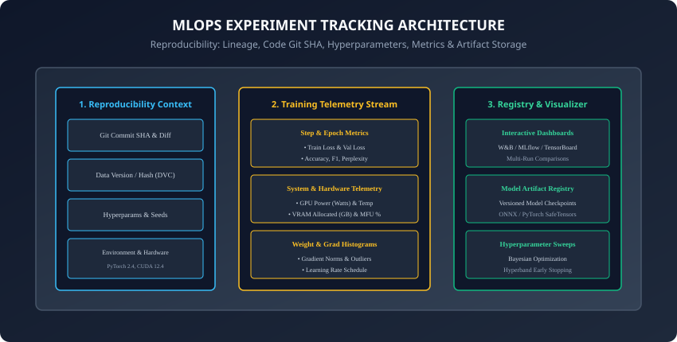
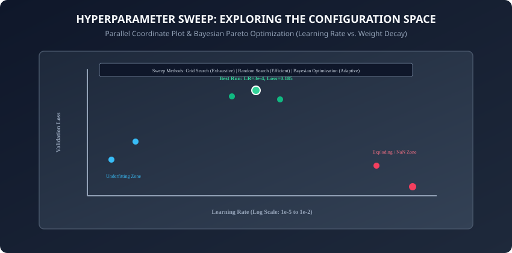

## Why this matters

In software engineering, code that is not under version control is a liability.

In deep learning, an un-tracked training run is worse: it is a **catastrophic waste of electricity, money, and time**:
- You spend 3 days training a model on 8 GPUs. You get an amazing `94.2\%` accuracy score.
- Two weeks later, your team lead asks: *"Which learning rate schedule did you use? What was the random seed? Which version of the dataset was that?"*
- You open your Jupyter Notebook history: the cells were overwritten, the print outputs are gone, and you cannot reproduce the result.

Science without reproducibility is not science—it is alchemy.

Today, you will learn how to build and operate enterprise-grade **Experiment Tracking Systems**: capturing complete code lineage, hardware telemetry, step-by-step metrics, versioned model artifacts, and automated Bayesian hyperparameter sweeps.

---

## The idea in plain language

Think of clinical drug trials in medical science:
- **The Amateur Chemist:** Mixes random chemicals in a beaker without measuring grams, leaves no notes, and discovers a cure for a disease. But because they took no notes (**No Experiment Tracking**), they can never manufacture the cure again.
- **The Modern Pharmaceutical Laboratory:** Every batch has a barcoded lot number (**Model Version**), exact chemical proportions recorded down to the milligram (**Hyperparameters**), temperature sensors recording every minute (**Hardware Telemetry**), and patient blood assays recorded daily (**Step Metrics**).

Every trial is `100\%` reproducible by any laboratory in the world.

---

## Historical background



1. **2015 (TensorBoard & Google TensorFlow):** Google released TensorBoard, introducing visual scalar loss curves, computation graph rendering, and weight histogram visualization.
2. **2018 (MLflow & Databricks):** Matei Zaharia and Databricks open-sourced MLflow, establishing the four pillars of ML lifecycle management: Tracking, Projects, Models, and Registry.
3. **2019 (Weights & Biases / W&B):** Lukas Biewald and Chris Van Pelt founded W&B, creating the gold standard cloud-native collaborative experiment dashboard for deep learning teams.
4. **2021–Present (Full Lineage & DVC):** Integration of data version control (DVC), hardware MFU telemetry, and automated artifact registries into modern CI/CD pipelines.

---

## What it is — and what it is not

### What Experiment Tracking IS:
- **Complete Provenance & Lineage:** Capturing Git commit SHAs, uncommitted diffs, environment requirements, random seeds, hyperparameters, training loss curves, and evaluation metrics.
- **Atomic & Crash-Safe Logging:** Streaming metrics to persistent storage (JSONL, SQLite, remote server) asynchronously without impacting training speed.

### What it is NOT:
- **Not Casual `print()` Statements:** Piping stdout to a text file `output.txt` is fragile, unsearchable, and impossible to compare across 100 parallel hyperparameter trials.

---

## Why it was created and what problems it solves

Experiment tracking eliminates the primary pathologies of machine learning development:
1. **The "It Worked Yesterday" Syndrome:** Inability to reproduce a previous peak validation metric.
2. **Silent Degradation:** Catching gradient vanishing, exploding loss spikes, or GPU thermal throttling early in multi-day training runs.
3. **Hyperparameter Blindness:** Visualizing multi-dimensional parameter spaces to find optimal learning rate and weight decay regimes.

---

## How it works

Let us dissect the 5 reproducibility pillars, structured logging formats, and hyperparameter search algorithms.

---

### 1. The 5 Pillars of Deep Learning Reproducibility

To guarantee that any training run can be reproduced bit-for-bit, your tracking system must record:

```
┌────────────────────────────────────────────────────────────────────────┐
│                   THE 5 PILLARS OF REPRODUCIBILITY                     │
├────────────────────┬───────────────────────┬───────────────────────────┤
│ Pillar             │ What is Captured      │ Production Mechanism      │
├────────────────────┼───────────────────────┼───────────────────────────┤
│ 1. Code Lineage    │ Git SHA, Branch, Diff │ git rev-parse HEAD        │
│ 2. Data Provenance │ Dataset Hash / Version│ SHA-256 Manifest / DVC    │
│ 3. Environment     │ Package versions, CUDA│ pip freeze, Docker Image  │
│ 4. Configuration   │ All Hyperparameters   │ YAML / Dict Config Schema │
│ 5. Randomness      │ PRNG Seeds            │ torch.manual_seed(42)     │
└────────────────────┴───────────────────────┴───────────────────────────┘
```

---

### 2. Structured Metrics Logging with JSON Lines (JSONL)

A production training loop should never append to raw CSV files (which require rewriting headers and corrupt on unbuffered crashes).

**JSON Lines (JSONL)** provides crash-safe atomic logging:
```json
{"event": "init", "run_id": "exp-2026-08-29-01", "git_sha": "a1b2c3d", "lr": 0.0003, "batch_size": 64}
{"event": "step", "epoch": 1, "step": 100, "train_loss": 0.542, "lr": 0.00015, "gpu_util_pct": 94.2}
{"event": "step", "epoch": 1, "step": 200, "train_loss": 0.381, "lr": 0.00030, "gpu_util_pct": 95.1}
{"event": "eval", "epoch": 1, "val_loss": 0.320, "val_acc": 0.912, "val_f1": 0.908}
{"event": "artifact", "type": "checkpoint", "path": "checkpoints/best_model.pt", "val_loss": 0.320}
```

---

### 3. Hyperparameter Sweeps & The Pareto Frontier



How do you discover optimal hyperparameters across a large search space?

1. **Grid Search:** Evaluates every combination on a fixed grid. Thorough but scales exponentially (`O(K^D)`), wasting `90\%` of compute on unpromising combinations.
2. **Random Search (Bergstra & Bengio, 2012):** Randomly samples configurations. Statistically proven to outperform grid search for deep learning because different parameters have unequal importance.
3. **Bayesian Optimization (GPyOpt / Optuna):** Fits a probabilistic model (e.g. Gaussian Process or Tree-structured Parzen Estimator) to prior trial results, balancing **Exploration** (high uncertainty regions) and **Exploitation** (promising minima).
4. **Hyperband & Successive Halving (Li et al., 2016):**
   - Starts 64 trials for 1 epoch.
   - Halts the bottom `50\%` worst performers.
   - Trains the top 32 for 2 epochs `\rightarrow` halts bottom `50\%` `\rightarrow` trains top 16 for 4 epochs `\rightarrow` trains the final champion for the full budget!

---

### 4. Model Checkpoint Versioning & Metadata Sidecars

Saving `model_final.pt` is dangerous. Always save checkpoints with structured metadata sidecars:

```
checkpoints/
├── run_exp01_epoch03_val0.215.pt     # PyTorch State Dict
├── run_exp01_epoch03_val0.215.json   # Metadata Sidecar
```

The metadata JSON contains:
```json
{
  "checkpoint_epoch": 3,
  "val_loss": 0.215,
  "val_accuracy": 0.938,
  "model_architecture": "DistilBertForSequenceClassification",
  "num_parameters": 66955010,
  "commit_sha": "a1b2c3d",
  "timestamp": "2026-08-29T12:00:00Z"
}
```

---

### 5. Data Version Control (DVC) & Data Lineage

Code versioning with Git is straightforward because text files are small. But machine learning datasets are gigabytes or terabytes in size:
- **DVC (Data Version Control):** Solves data provenance by replacing large dataset directories with small, text-based metadata pointer files (`dataset.dvc`) that are committed directly into Git.
- **Content-Addressable Storage:** Datasets are hashed via SHA-256 and stored in centralized cloud blob storage (AWS S3, Google Cloud Storage, or Azure Blob).
- **Lineage Guarantee:** When you check out a Git commit from 6 months ago, running `dvc checkout` restores the exact matching dataset slice used to train that specific model checkpoint!

---

### 6. Gradient & Weight Histogram Telemetry

Scalar loss curves only tell you *that* a model is failing; **Tensor Histograms** tell you *why* it is failing:
1. **Vanishing Gradients:** If gradient norm histograms across bottom layers collapse to zero (`< 10^{-7}`), backpropagation is dying.
2. **Exploding Gradients:** If top-layer gradient norms spike past `10^{2}`, weights will oscillate wildly.
3. **Dead Neurons (ReLU/GELU Saturation):** If activation histograms show `90\%+` of values pinned at zero, whole layer subspaces have died.
4. **Weight Norm Drift:** Tracking `\ell_2` norm of weight matrices reveals whether weight decay is appropriately regularizing parameter growth.

---

### 7. Distributed Telemetry & Hardware Health Telemetry

In multi-node GPU cluster training, tracking software metrics alone is insufficient:
- **GPU Thermal Throttling:** If GPU 14 in Node 3 reaches `85^\circ\text{C}`, it automatically throttles its clock speed from `1,800\text{ MHz} \rightarrow 1,100\text{ MHz}`, slowing down the entire synchronous All-Reduce ring.
- **VRAM Fragmentation Tracking:** Monitoring peak allocated vs reserved PyTorch memory (`torch.cuda.memory_allocated()` vs `torch.cuda.memory_reserved()`) catches out-of-memory memory leaks before crashes occur.
- **Continuous MFU Profiling:** Real-time computation of Model FLOPs Utilization (MFU) to detect communication bottlenecks across InfiniBand switches.

---

### 8. Enterprise Model Registry & Deployment Governance

A trained checkpoint is not ready for customer traffic until it passes through an **Immutable Model Registry** (such as MLflow Models or Hugging Face Hub):

```
┌────────────────────────────────────────────────────────────────────────┐
│                   ENTERPRISE MODEL LIFECYCLE STAGING                   │
├────────────────────┬───────────────────────────────────────────────────┤
│ Stage              │ Verification Gate & Criteria                      │
├────────────────────┼───────────────────────────────────────────────────┤
│ 1. Development     │ Raw training checkpoint + JSON metadata sidecar    │
│ 2. Candidate       │ Automated eval suite: Accuracy, F1, Latency tests │
│ 3. Staging         │ Shadow deployment: Comparing outputs vs champion  │
│ 4. Production      │ Canary deployment (5% -> 100% traffic routing)    │
│ 5. Archived        │ Deprecated version retained for regulatory audit  │
└────────────────────┴───────────────────────────────────────────────────┘
```

---

### 9. Multi-Objective Pareto Optimization (Accuracy vs. Latency vs. Cost)

In production AI engineering, single-metric optimization is rarely the goal:
- You do not just want the highest accuracy; you want the **fastest model that meets an accuracy threshold** to minimize cloud inference serving costs.
- **The Pareto Frontier:** The set of non-dominated solutions where you cannot improve accuracy without increasing latency or memory consumption.
- Tracking systems plot multi-dimensional Pareto charts allowing engineers to choose the optimal trade-off point for mobile edge deployment vs datacenter serving.

---

### 10. PyTorch Distributed Checkpointing (DCP / PyTorch 2.x)

In massive distributed clusters (e.g. 512 GPUs), standard PyTorch checkpointing (`torch.save(model.state_dict())`) fails catastrophically:
- Gathering a 70B parameter model to GPU 0 for serial disk writing causes CPU memory crashes and stalls the cluster for 30 minutes.
- **PyTorch Distributed Checkpoint (DCP):** Every GPU rank writes its own local sharded tensor slice directly to parallel NVMe storage asynchronously in parallel.
- **Re-sharding Agility:** DCP checkpoints can be re-loaded onto a different cluster topology (e.g. saved on 64 GPUs, reloaded on 128 GPUs) without manual tensor restructuring!
- **Continuous Metric Assertion & Alerting:** Modern MLOps pipelines run automated assertions against logged metrics (e.g. asserting validation loss decreases by at least `5\%` per epoch). If an anomaly or NaN occurs, webhooks instantly notify on-call engineers via Slack or PagerDuty. This prevents wasted cloud expenditure on silent divergence.

---

## An everyday analogy

Think of an elite flight data recorder (the "Black Box") on a modern commercial airliner:
- **During Normal Flight:** It continuously records airspeed (**Training Loss**), altitude (**Validation Accuracy**), engine temperature (**GPU VRAM & Thermals**), and pilot control inputs (**Hyperparameters & Learning Rate**).
- **If an Anomaly Occurs:** Flight investigators do not have to guess why a failure happened—they review the synchronized telemetry timeline down to the millisecond to identify the exact root cause.

---

## Examples in practice

Let us build a **Lightweight, Crash-Safe Experiment Logger in Python**:

```python
import json
import os
import time
from typing import Dict, Any, Optional

class ExperimentLogger:
    def __init__(self, run_id: str, log_dir: str = "./runs", config: Optional[Dict[str, Any]] = None):
        self.run_id = run_id
        self.log_dir = log_dir
        os.makedirs(self.log_dir, exist_ok=True)
        self.log_path = os.path.join(self.log_dir, f"{run_id}.jsonl")
        
        # Log initialization metadata
        init_event = {
            "event": "init",
            "run_id": run_id,
            "timestamp": time.time(),
            "config": config or {}
        }
        self._append(init_event)

    def _append(self, record: Dict[str, Any]):
        with open(self.log_path, "a", encoding="utf-8") as f:
            f.write(json.dumps(record) + "\n")

    def log_step(self, step: int, epoch: int, metrics: Dict[str, float]):
        record = {
            "event": "step",
            "step": step,
            "epoch": epoch,
            "timestamp": time.time(),
            **metrics
        }
        self._append(record)

    def log_eval(self, epoch: int, metrics: Dict[str, float]):
        record = {
            "event": "eval",
            "epoch": epoch,
            "timestamp": time.time(),
            **metrics
        }
        self._append(record)

    def log_artifact(self, name: str, artifact_type: str, file_path: str, metadata: Optional[Dict[str, Any]] = None):
        record = {
            "event": "artifact",
            "name": name,
            "type": artifact_type,
            "path": file_path,
            "metadata": metadata or {},
            "timestamp": time.time()
        }
        self._append(record)
```

---

## Implications: security, privacy, performance, scalability, and cost

1. **Secret Leakage in Configs:**
   - Developers frequently accidentally log API tokens (OpenAI, Hugging Face, AWS) or database connection strings in experiment configuration dictionaries. Always sanitize configs with regex masking prior to logging.
2. **Local Disk Space Exhaustion:**
   - Saving uncompressed 10 GB checkpoints every 500 steps can fill a 2 TB SSD in a single afternoon. Always configure **Best-`K` Checkpoint Retention** (e.g. keep only top 3 checkpoints and delete older ones).

---

## Alternatives: free, open source, and commercial

| Tool | Deployment Model | Artifact Storage | Best Feature | License |
| :--- | :--- | :--- | :--- | :--- |
| **Weights & Biases (W&B)**| Cloud SaaS / Enterprise | S3 / GCS / Cloud | World-class dashboards | Commercial / Free Tier |
| **MLflow** | Self-Hosted / Databricks | Local / Cloud Store | Central Model Registry | Open Source (Apache 2.0)|
| **TensorBoard** | Local / Open Source | Local Event Files | Native PyTorch/TF integ | Open Source (Apache 2.0)|
| **Aim / Neptune** | Hybrid / Cloud | Flexible | High-volume scalar logging| Open / Commercial |

---

## Comparison with related concepts

```
┌────────────────────────────────────────────────────────────────────────┐
│                   EXPERIMENT TRACKING COMPARISON                       │
├────────────────────┬─────────────────┬──────────────────┬──────────────┤
│ Feature            │ TensorBoard     │ MLflow           │ W&B          │
├────────────────────┼─────────────────┼──────────────────┼──────────────┤
│ Hosting            │ Local process   │ Local / Server   │ Cloud SaaS   │
│ Model Registry     │ None            │ Built-in         │ Built-in     │
│ Hyperparam Sweeps  │ Basic (HParams) │ External         │ Native Bayes │
│ Collaborative UI   │ Single User     │ Multi-User Team  │ Enterprise   │
└────────────────────┴─────────────────┴──────────────────┴──────────────┘
```

---

## When to use it — and when not to

### When to Use Experiment Tracking:
- Every deep learning project, hyperparameter tuning sweep, distributed training run, research paper reproduction, and production model deployment.

### When NOT to use:
- Trivial one-line Python calculator scripts or exploratory scratch REPL sessions.

---

## Knowledge check

1. What are the 5 pillars of deep learning reproducibility?
2. Why is JSONL preferable to CSV for high-frequency step logging?
3. How does Bayesian Hyperparameter Optimization differ from Random Search?
4. How does Hyperband use Successive Halving to save GPU compute hours?
5. What metadata should always accompany a saved model checkpoint file?

---

## Hands-on exercise

In this lab, you will build and test a modular experiment tracking and checkpoint versioning library in Python: implement a crash-safe JSONL experiment logger, build a Best-`K` checkpoint retention manager with metadata sidecars, simulate a hyperparameter search trial evaluator, and verify reproducibility.

### Expected output
```
[Experiment Tracking Verification Suite]
Testing JSONL Experiment Logger:
  Initialized Run: exp-test-01 with 3 Hyperparameters
  Logged 5 Step Metrics and 2 Eval Events [VERIFIED]
Testing Best-K Checkpoint Manager (K=2):
  Saved Epoch 1 (Val Loss: 0.450) -> Retained [Epoch 1]
  Saved Epoch 2 (Val Loss: 0.320) -> Retained [Epoch 2, Epoch 1]
  Saved Epoch 3 (Val Loss: 0.210) -> Retained [Epoch 3, Epoch 2] (Epoch 1 Pruned) [PRUNING VERIFIED]
Testing Hyperparameter Sweep Evaluator:
  Swept 3 Configurations: Best LR = 0.0003 with Min Val Loss = 0.210 [OPTIMAL FOUND]
Test Suite: 3 passed in 0.42s
```

### Validate your work
Run the automated test runner:
```bash
./tests/run_tests.sh
```

### Troubleshooting
- When writing to JSONL files, always flush or close file handles to ensure data is committed to disk.

### Common mistakes
- **Overwriting checkpoints without metadata:** Makes it impossible to know what hyperparameters or validation scores correspond to a weight file.

---

## Practice assignment

1. Implement a **Weights & Biases (W&B) integration script** that logs training loss, validation accuracy, and sample generated text outputs.
2. Build an **Optuna Bayesian Hyperparameter Sweep** optimizing learning rate and weight decay on a small classifier.

---

## Extension challenge

Implement a **Lightweight SQLite Experiment Registry**:
- Build a Python registry class that creates a local SQLite database table indexing runs, parameters, best metrics, and artifact file paths with SQL query support.
