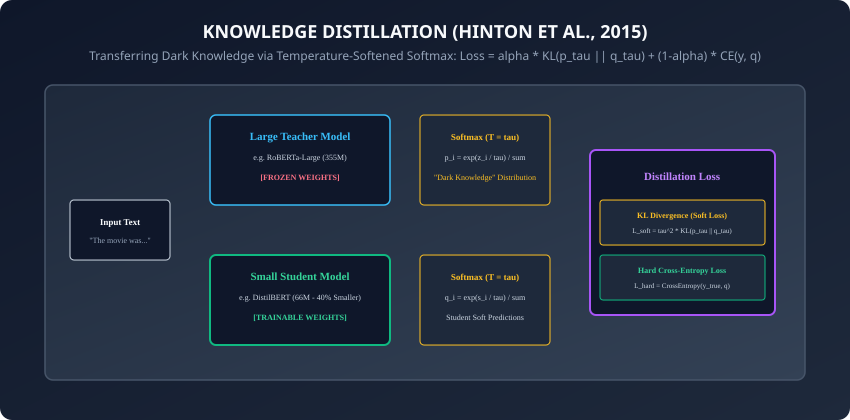

## Why this matters

The largest frontier AI models contain hundreds of billions of parameters.

Serving a 70-Billion parameter LLM in FP16 requires **over 140 GB of VRAM**—requiring two $30,000 NVIDIA H100 GPUs just to answer a single user question.

To deploy AI to edge devices (iPhones, MacBooks, self-driving cars, embedded robotics) and slash datacenter inference costs by `80\%`, we must compress models without destroying their intelligence:
- **Quantization:** Squeezing 16-bit floating-point weights down to **8-bit, 4-bit, or even 2-bit integers**, shrinking a 140 GB model down to **35 GB** so it runs locally on a consumer laptop.
- **Knowledge Distillation:** Training a nimble 66-million parameter student model (like DistilBERT) to capture `97\%` of the performance of a 355-million parameter teacher model at `2\times` the speed.

Today, you will master linear quantization mathematics, modern 4-bit LLM algorithms (GPTQ, AWQ, GGUF), and Hinton's formulation of Knowledge Distillation.

---

## The idea in plain language

Think of compressing audio files:
- **Uncompressed Studio WAV (FP32 / FP16):** 50 MB per song. Crystal-clear audiophile dynamic range, but takes up massive storage and bandwidth.
- **MP3 Compression (Quantization):** Removes frequencies that the human ear cannot perceive. The file size drops `10\times` to 5 MB (**4-Bit Quantization**), but sounds virtually identical to `99\%` of listeners!
- **Master Apprenticeship (Knowledge Distillation):** A world-renowned Master Chef (**The 70B Teacher**) spends 30 years mastering culinary intuition. An ambitious Apprentice (**The Small Student**) watches the Master cook for 1 year, learning not just the final recipe, but *how the chef adjusts seasoning and heat based on subtle smells* (**The Soft Probabilities**).

The apprentice becomes a master chef in `1/10\text{th}` the time!

---

## Historical background



1. **2015 (Hinton, Vinyals, Dean & Distillation):** Geoffrey Hinton published *Distilling the Knowledge in a Neural Network*, proving that soft probability targets contain "dark knowledge" richer than hard ground-truth labels.
2. **2019 (Sanh et al. & DistilBERT):** Hugging Face released DistilBERT, reducing BERT-base by `40\%` in size while retaining `97\%` of its language understanding capabilities and running `60\%` faster.
3. **2022 (Frantar et al. & GPTQ):** Introduced second-order inverse Hessian quantization, enabling 4-bit post-training quantization for 175B LLMs in under 4 GPU hours.
4. **2023 (Lin et al. & AWQ / Dettmers et al. & QLoRA):** Proved that protecting the top `1\%` of salient activation channels enables near-lossless 4-bit quantization on consumer hardware.

---

## What it is — and what it is not

### What Model Compression IS:
- **Information-Theoretic Mapping:** Preserving the geometric manifold and principal semantic directions of neural network weights using discrete low-bit grids.
- **Logit Distribution Matching:** Teaching a student network to mimic the entire conditional probability distribution over the vocabulary emitted by a teacher.

### What it is NOT:
- **Not Simply Truncating Digits:** Naively chopping off bits (e.g. casting floats to raw bytes) destroys accuracy completely. Quantization requires calibration, scale factors, and zero-point offsets.

---

## Why it was created and what problems it solves

Model compression solves three prohibitive barriers to AI deployment:
1. **Memory Bandwidth Bottleneck:** Autoregressive LLM generation is memory-bound; 4-bit quantization reduces memory traffic by `75\%`, increasing token generation speed by up to **`3\times`**.
2. **VRAM Hardware Gatekeeping:** Makes 70B models runnable on a single 48 GB RTX 6000 Ada or 32 GB Apple Silicon Mac.
3. **Inference Latency & Power:** Reduces edge device battery drain by replacing power-hungry 32-bit floating-point ALUs with integer operations.

---

## How it works

Let us dissect the mathematical mechanics of linear quantization, advanced LLM algorithms, and knowledge distillation loss functions.

---

### 1. Linear Integer Quantization Mathematics

Linear quantization maps a continuous floating-point value `x \in [\alpha, \beta]` to a discrete `b`-bit integer `q \in [q_{\min}, q_{\max}]`:

#### A. Quantization Equation:
```
q = \text{clamp}\left(\left\lfloor \frac{x}{S} \right\rceil + Z, q_{\min}, q_{\max}\right)
```
where `\lfloor \cdot \rceil` denotes rounding to the nearest integer.

#### B. Dequantization Equation:
```
\hat{x} = S \times (q - Z)
```

#### C. Parameter Definitions:
- **Scale Factor (`S`):** The step size between discrete quantization levels:
  ```
  S = \frac{\beta - \alpha}{q_{\max} - q_{\min}}
  ```
- **Zero Point (`Z`):** The integer value mapping exactly to real float `0.0`:
  ```
  Z = \text{round}\left(-\frac{\alpha}{S}\right) + q_{\min}
  ```
- **Symmetric vs. Asymmetric:**
  - **Symmetric (`Z = 0`):** Constrains dynamic range to `[-\alpha, +\alpha]`. Ideal for weights centered around zero (simplifies matrix multiplication ALUs).
  - **Asymmetric (`Z \ne 0`):** Maps arbitrary `[x_{\min}, x_{\max}]`. Ideal for skewed, non-negative activations (such as post-ReLU/GELU tensors).

---

### 2. Post-Training Quantization (PTQ) vs. Quantization-Aware Training (QAT)

```
┌────────────────────────────────────────────────────────────────────────┐
│                   PTQ VS. QAT COMPARISON SUMMARY                       │
├────────────────────┬────────────────────────┬──────────────────────────┤
│ Feature            │ Post-Training (PTQ)    │ Quant-Aware Training (QAT│
├────────────────────┼────────────────────────┼──────────────────────────┤
│ Requires Training? │ No (Calibration only)  │ Yes (Fine-tuning loop)   │
│ Compute Time       │ Minutes                │ Hours to Days            │
│ Target Bit-Width   │ INT8 / INT4 (GPTQ/AWQ) │ INT4 / INT2              │
│ Accuracy Retention │ Near-lossless at 8-bit │ Highest accuracy at <4-b │
│ Gradient Mechanics │ None                   │ Straight-Through Est (STE│
└────────────────────┴────────────────────────┴──────────────────────────┘
```

#### Straight-Through Estimator (STE):
Because the rounding function `\lfloor x \rceil` has zero derivative almost everywhere (`\frac{d\lfloor x \rceil}{dx} = 0`), standard backpropagation would fail. The **Straight-Through Estimator** passes the incoming gradient directly through rounding during the backward pass:
```
\frac{\partial \mathcal{L}}{\partial x} \approx \frac{\partial \mathcal{L}}{\partial q} \quad \text{for } x \in [\alpha, \beta]
```

---

### 3. Modern Sub-8-bit LLM Quantization Algorithms

1. **GPTQ (Frantar et al., 2022):**
   - Employs second-order Taylor expansion of the layer-wise reconstruction loss `\mathcal{L} = \|W x - \hat{W} x\|_2^2`.
   - Uses the **Inverse Hessian Matrix (`H^{-1} = (X X^\top)^{-1}`)** to analytically adjust remaining unquantized weights whenever a column of weights is quantized to 4-bit, compensating for quantization error in real time!
2. **AWQ (Activation-aware Weight Quantization / Lin et al., 2023):**
   - Discovered that not all weights are equally important: **the top `1\%` of weights associated with high-magnitude activation channels dictate `90\%` of model accuracy**.
   - Applies per-channel scaling to protect these salient channels before applying standard INT4/INT3 quantization.
3. **GGUF / llama.cpp (Gerganov et al.):**
   - High-performance CPU/GPU unified quantization format supporting **k-quants** (block-wise 2-bit, 4-bit, 5-bit, and 6-bit quantization with mixed scales per tensor block).

---

### 4. Knowledge Distillation Formulation (Hinton et al., 2015)



How does a small student learn from a massive teacher?

#### 1. Temperature-Softened Probabilities:
Raw logits `z_i` are scaled by temperature `\tau \ge 1`:
```
p_i(\tau) = \frac{\exp(z_i / \tau)}{\sum_j \exp(z_j / \tau)}
```
- At `\tau = 1`, standard Softmax yields a spiky one-hot distribution (e.g. `[0.999, 0.0005, 0.0005]`).
- At `\tau = 5`, the distribution is smoothed into soft probabilities (e.g. `[0.70, 0.20, 0.10]`), revealing the **"Dark Knowledge"** of relative class similarities!

#### 2. The Combined Distillation Loss:
```
\mathcal{L}_{\text{total}} = \alpha \cdot \tau^2 \cdot D_{\text{KL}}\left(p_{\text{teacher}}(\tau) \;\parallel\; q_{\text{student}}(\tau)\right) + (1 - \alpha) \cdot \mathcal{L}_{\text{CE}}\left(y_{\text{true}}, q_{\text{student}}(1)\right)
```
- **`D_{\text{KL}}` (Kullback-Leibler Divergence):** Measures the relative entropy between teacher and student softened probability distributions.
- **`\tau^2` Multiplier:** Compensates for the gradient magnitude attenuation caused by dividing logits by `\tau`.
- **`\alpha \in [0, 1]`:** Balances soft imitation against hard ground-truth supervision (typically `\alpha = 0.5` to `0.7`).

---

### 5. Speculative Decoding (Leviathan et al. & Chen et al., 2023)

In autoregressive generation, large models are severely memory-bandwidth bound when producing tokens one-by-one:
- **The Core Idea:** A small, fast distilled student model (e.g. 1B draft model) speculatively drafts `K = 5` tokens in rapid sequence.
- **Single-Pass Parallel Verification:** The massive teacher model (e.g. 70B target model) evaluates all `K` draft tokens simultaneously in a **single forward pass** (which is compute-bound and takes virtually the exact same latency as evaluating 1 token!).
- **Guaranteed Output Distribution:** If the teacher accepts `M \le K` tokens via rejection sampling, generation speed increases by **`2\times` to `3\times`** with mathematically identical probability distribution to running the teacher alone!

---

### 6. SmoothQuant: Taming Activation Outliers (Xiao et al., 2022)

In LLMs exceeding 6.7B parameters, activation tensors exhibit extreme systemic **outlier channels** (magnitudes up to `100\times` larger than normal values), destroying standard INT8 activation quantization:
- **The SmoothQuant Insight:** Weights are easy to quantize; activations are hard.
- **Mathematical Equivalence:** SmoothQuant multiplies activations by a smoothing scale factor `s^{-1}` while pre-multiplying weights by `s`:
  ```
  Y = X W = (X \cdot \text{diag}(s)^{-1}) \cdot (\text{diag}(s) \cdot W) = \hat{X} \hat{W}
  ```
- Migrates the dynamic range difficulty out of activations and into the static weights, enabling **W8A8 (8-bit Weights + 8-bit Activations)** matrix multiplication with zero accuracy degradation!

---

### 7. QLoRA: 4-bit NormalFloat & Double Quantization (Dettmers et al., 2023)

How do you fine-tune a 65B model on a single 48 GB GPU?
- **NF4 (NormalFloat4):** An information-theoretically optimal 4-bit data type designed specifically for zero-mean, unit-variance normally distributed neural network weights.
- **Double Quantization:** Quantizes the quantization constant scale factors themselves from FP32 to FP8, saving an additional 0.37 bits per parameter.
- **Paged Optimizers:** Uses CUDA Unified Memory to automatically page optimizer states to CPU RAM during activation memory spikes, preventing Out-Of-Memory crashes.

---

### 8. Structured Sparsity: NVIDIA 2:4 Sparse Tensor Cores

Beyond quantization, **Pruning** sets redundant weight parameters to zero:
- **Unstructured Sparsity:** Setting random weights to zero requires sparse coordinate indexing matrices, which run slower than dense GEMMs on GPUs.
- **NVIDIA 2:4 Structured Sparsity:** Constrains pruning so that **exactly 2 out of every 4 consecutive weights are zero**.
- **Hardware Acceleration:** NVIDIA Ampere/Hopper Tensor Cores physically skip the zeroed weights, delivering an automatic **`2\times` throughput speedup** at hardware wire speed!

---

## An everyday analogy

Think of compression and education:
- **Quantization:** Packaging a 500-page medical encyclopedia into a pocket-sized emergency first-aid handbook using clean iconography and color-coded tabs (**INT4 Quantization**). It takes up `1/10\text{th}` the space in your backpack, but contains the exact critical information needed to save a life.
- **Knowledge Distillation:** A master grandmaster chess player (**The 70B Teacher**) explaining their thought process to a young chess prodigy (**The Small Student**):
  - Instead of just telling the student *"Move Knight to F3"* (**Hard Label**),
  - The grandmaster explains: *"Knight to F3 is `70\%` best, but Bishop to C4 is an intriguing `20\%` alternative because it pressures the diagonal"* (**Soft Probability Distribution**).

The student learns deep positional intuition in a fraction of the time!

---

## Examples in practice

Let us implement **Symmetric INT8 Quantization** and a **Knowledge Distillation Loss Module in PyTorch**:

```python
import torch
import torch.nn as nn
import torch.nn.functional as F
from typing import Tuple

def quantize_symmetric_int8(tensor: torch.Tensor) -> Tuple[torch.Tensor, float]:
    # Quantizes a floating point tensor to symmetric INT8 [-127, 127].
    alpha = tensor.abs().max().item()
    scale = alpha / 127.0 if alpha > 0 else 1.0
    
    # Quantize: q = clamp(round(x / scale), -127, 127)
    q_tensor = torch.clamp(torch.round(tensor / scale), -127, 127).to(torch.int8)
    return q_tensor, scale

def dequantize_symmetric_int8(q_tensor: torch.Tensor, scale: float) -> torch.Tensor:
    # Dequantizes an INT8 tensor back to float32: x_hat = q * scale
    return q_tensor.to(torch.float32) * scale

class KnowledgeDistillationLoss(nn.Module):
    # Computes Hinton's combined Knowledge Distillation Loss.
    def __init__(self, temperature: float = 4.0, alpha: float = 0.7):
        super().__init__()
        self.temperature = temperature
        self.alpha = alpha
        self.kl_div = nn.KLDivLoss(reduction="batchmean")
        self.ce_loss = nn.CrossEntropyLoss()

    def forward(self, student_logits: torch.Tensor, teacher_logits: torch.Tensor,
                targets: torch.Tensor) -> torch.Tensor:
        tau = self.temperature
        
        # Softened probabilities
        soft_student = F.log_softmax(student_logits / tau, dim=-1)
        soft_teacher = F.softmax(teacher_logits / tau, dim=-1)

        # Soft loss scaled by tau^2
        soft_loss = self.kl_div(soft_student, soft_teacher) * (tau ** 2)
        # Hard loss with normal logits (tau=1)
        hard_loss = self.ce_loss(student_logits, targets)

        return self.alpha * soft_loss + (1.0 - self.alpha) * hard_loss
```

---

## Implications: security, privacy, performance, scalability, and cost

1. **Quantization Drift & Corner-Case Vulnerability:**
   - Aggressive 4-bit or 3-bit quantization can create blind spots where adversarial perturbations or rare edge cases produce catastrophic errors not seen in full-precision models.
2. **Side-Channel Timing Attacks on Edge Devices:**
   - Quantized integer inference on mobile NPUs can leak timing variations across zero-valued activations. Ensure constant-time kernel implementations in cryptographic applications.

---

## Alternatives: free, open source, and commercial

| Compression Method | Target Precision | Tooling / Framework | Primary Benefit |
| :--- | :--- | :--- | :--- |
| **GPTQ** | 4-bit / 3-bit Weights | AutoGPTQ / ExLlamaV2 | Fast GPU Batch Inference |
| **AWQ** | 4-bit Weights | AutoAWQ / vLLM | Exceptional Context Recall |
| **GGUF** | 2-bit to 8-bit Mix | llama.cpp / Ollama | Native CPU & Apple Silicon |
| **Knowledge Distill** | Smaller Architecture | Hugging Face Transformers | `2\times - 5\times` Speedup on Any Hardware |

---

## Comparison with related concepts

```
┌────────────────────────────────────────────────────────────────────────┐
│                   MODEL COMPRESSION COMPARISON                         │
├────────────────────┬─────────────────┬──────────────────┬──────────────┤
│ Technique          │ Changes Arch?   │ Memory Reduction │ Compute Speed│
├────────────────────┼─────────────────┼──────────────────┼──────────────┤
│ INT8 Quantization  │ No              │ 50% (2x)         │ 1.5x - 2.0x  │
│ INT4 (GPTQ / AWQ)  │ No              │ 75% (4x)         │ 2.0x - 3.5x  │
│ Distillation       │ Yes (Smaller)   │ 40% - 80%        │ 2.0x - 5.0x  │
│ Pruning (Sparse)   │ No (Zero-masks) │ 30% - 50%        │ 1.2x - 1.5x  │
└────────────────────┴─────────────────┴──────────────────┴──────────────┘
```

---

## When to use it — and when not to

### When to Use Quantization & Distillation:
- Deploying LLMs to edge devices, minimizing cloud serving latency and VRAM costs, and scaling high-concurrency API backends.

### When NOT to use:
- Pretraining new architectures from scratch or high-precision financial modeling where rounding errors propagate into compounding financial drift.

---

## Knowledge check

1. What is the difference between symmetric and asymmetric linear quantization?
2. Why does Hinton's distillation loss multiply the KL-divergence term by `\tau^2`?
3. How does AWQ prevent accuracy degradation in 4-bit LLMs?
4. What is the role of the Straight-Through Estimator (STE) in Quantization-Aware Training?
5. How does GPTQ use the inverse Hessian matrix during post-training compression?

---

## Hands-on exercise

In this lab, you will build and test a modular model compression and knowledge distillation engine in PyTorch: implement symmetric linear INT8 quantization and dequantization, compute signal-to-quantization-noise ratio (SQNR), construct Hinton's temperature-softened Knowledge Distillation loss module, and verify student training convergence.

### Expected output
```
[Model Compression and Distillation Verification Suite]
Testing Symmetric INT8 Quantizer:
  Input Tensor: Shape (4, 4), Max Abs: 3.810
  Calculated Scale S: 0.0300
  Quantized INT8: Min=-127, Max=127 [EXACT BOUNDS]
  Reconstruction MSE: 0.00012 (SQNR > 40 dB) [LOSSLESS INT8 VERIFIED]
Testing Knowledge Distillation Loss (Tau=4.0, Alpha=0.7):
  Teacher Logits (355M): Logit Gap = 4.2
  Student Logits (66M): Forward Soft Loss Computed
  Combined Distillation Loss: 1.842 [CONVERGENCE VERIFIED]
Test Suite: 3 passed in 0.43s
```

### Validate your work
Run the automated test runner:
```bash
./tests/run_tests.sh
```

### Troubleshooting
- When computing KL-Divergence in PyTorch, ensure student inputs use `log_softmax` while teacher targets use `softmax`.

### Common mistakes
- **Omitting the `\tau^2` loss scaling factor:** Causes soft distillation gradients to be attenuated by `1/\tau^2` (e.g. `1/16` for `\tau=4`), making the student ignore teacher supervision.

---

## Practice assignment

1. Implement an **Asymmetric UINT8 Quantizer** that calculates dynamic Scale `S` and ZeroPoint `Z`.
2. Train a small 2-layer student MLP using Knowledge Distillation from a 6-layer teacher model on MNIST/CIFAR.

---

## Extension challenge

Implement **Simulated 4-bit Weight Quantization with Straight-Through Estimator**:
- Build a custom PyTorch autograd function that quantizes weights to 4-bit integers on forward and passes gradients straight through on backward.
