## Why this matters

Before 2020, training a `100\text{ Million}` dollar AI model would have been considered financial insanity.

How could a laboratory risk `50\text{ Million}` dollars of cloud compute without knowing whether the resulting model would work, hallucinate wildly, or fail to learn?

The breakthrough that unlocked hundreds of billions of dollars in AI investment was the discovery of **Empirical Neural Scaling Laws**:

- Deep learning is not a game of unpredictable trial and error.
- As you scale **Compute (`C`)**, **Model Parameters (`N`)**, and **Dataset Tokens (`D`)**, the cross-entropy loss decreases as a **smooth, continuous, perfectly predictable Power Law**:
  ```
  L(N, D) = E + \frac{A}{N^\alpha} + \frac{B}{D^\beta}
  ```

- By training small 10-million, 50-million, and 200-million parameter models for a few hours, engineers can accurately predict the exact validation loss and capabilities of a 500-billion parameter frontier model *before spending a single dollar on the final run*.

Today, you will master the mathematics of the **Kaplan vs. Chinchilla scaling laws**, the foundational **`C \approx 6ND` compute rule**, **inference-optimal overtraining (LLaMA)**, and the new frontier of **Test-Time Reasoning Scaling**.

---

## The idea in plain language

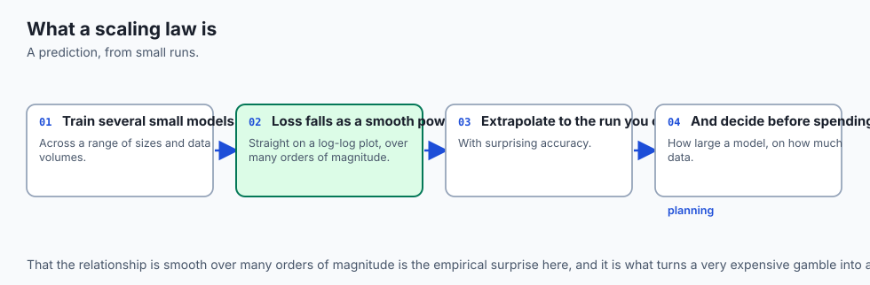

Think of civil aerospace engineering:

- **Trial-and-Error Aviation (Pre-Scaling Law AI):** Building a 500-passenger Boeing 747 airliner out of metal, pushing it off a cliff, and hoping it flies. If it crashes, you lose `500\text{ Million}` dollars and learn nothing.
- **Wind Tunnel Scaling Laws (Modern AI Engineering):** Testing a 1:50 scale model in a wind tunnel. Fluid dynamics power laws (Reynolds numbers) allow aeronautical engineers to predict the exact lift, drag, and fuel consumption of the full-scale airliner down to `1\%` accuracy.

Scaling laws are the Reynolds numbers of artificial intelligence.

---

## Historical background

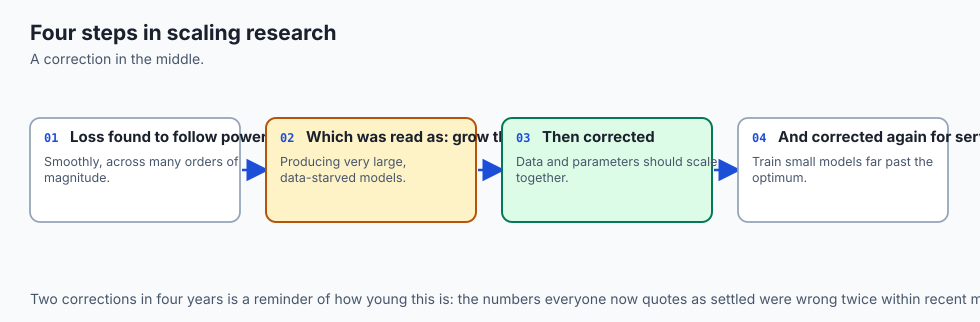

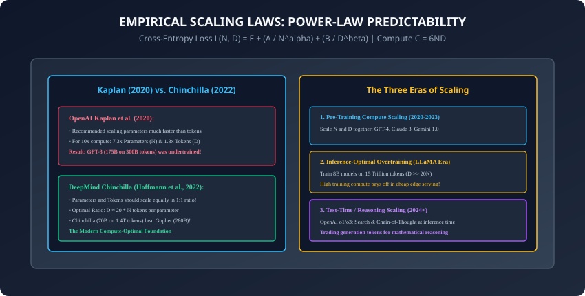

1. **2020 (Kaplan et al. & OpenAI):** Published *Scaling Laws for Neural Language Models*, proving power-law scaling over 6 orders of magnitude in compute. However, they concluded that parameters should scale `5.5\times` faster than tokens.
2. **2020 (OpenAI & GPT-3):** Based on Kaplan's laws, OpenAI trained GPT-3 (175 Billion parameters on only 300 Billion tokens).
3. **2022 (Hoffmann et al. & DeepMind Chinchilla):** Re-evaluated scaling with IsoFLOP profiles, proving Kaplan was wrong: parameters and tokens should scale in **equal 1:1 proportion (`D \approx 20N`)**. Chinchilla (70B on 1.4T tokens) outperformed the 280B Gopher model using identical compute!
4. **2023 (Touvron et al. & Meta LLaMA):** Pioneered **Inference-Optimal Overtraining**, training small 7B/13B models on 1.4T to 2T tokens to maximize edge serving efficiency.
5. **2024–Present (OpenAI o1/o3 & Test-Time Compute):** Discovered that scaling inference reasoning tokens (Chain-of-Thought and search) produces an entirely new power-law scaling curve.

---

## What it is — and what it is not

### What Neural Scaling Laws ARE:
- **Empirical Power-Law Physics:** Statistical physics of high-dimensional learning manifolds demonstrating that cross-entropy loss scales smoothly as `L \propto C^{-\gamma}`.
- **Predictable Compute Allocation:** Exact mathematical formulas determining how many parameters to allocate and how many tokens to collect for any budget in dollars or GPU hours.

### What it is NOT:
- **Not Infinite Magic Free Intelligence:** Scaling laws predict continuous reduction in *next-token cross-entropy loss*. While loss scales smoothly, qualitative task mastery (like coding or multi-step logic) appears in step-wise thresholds.

---

## Why it was created and what problems it solves

Scaling laws transformed machine learning from a craft into an exact predictive science:

1. **Capital Risk Elimination:** Eliminates the risk of catastrophic multi-million dollar training failures.
2. **Optimal Hardware Sizing:** Prevents training models that are too large on too little data (GPT-3/Gopher) or too small on excess compute.
3. **Architecture Comparison:** Allows comparing architectures (e.g. Mamba vs Transformer vs MoE) at small scales and knowing with certainty which will win at trillion-parameter scales.

---

## How it works

Let us dissect the mathematical formulation of scaling laws, compute budget derivation, and inference economics.

---

### 1. The Power-Law Formulation (Hoffmann et al., 2022)

The cross-entropy loss `L` is modeled as a function of parameter count `N` (non-embedding parameters) and dataset token count `D`:

```
L(N, D) = E + \frac{A}{N^\alpha} + \frac{B}{D^\beta}
```

```
┌────────────────────────────────────────────────────────────────────────┐
│                   SCALING LAW PARAMETER DEFINITIONS                    │
├──────────────┬────────────────────────┬────────────────────────────────┤
│ Symbol       │ DeepMind Estimate      │ Physical Interpretation        │
├──────────────┼────────────────────────┼────────────────────────────────┤
│ E            │ 1.69                   │ Irreducible Loss of Language   │
│ A            │ 406.4                  │ Model Size Scaling Constant    │
│ alpha (α)    │ 0.34                   │ Model Size Power-Law Exponent  │
│ B            │ 410.7                  │ Data Size Scaling Constant     │
│ beta (β)     │ 0.28                   │ Data Size Power-Law Exponent   │
└──────────────┴────────────────────────┴────────────────────────────────┤
```

- **`E` (Irreducible Loss):** The fundamental entropy of human language. Even an infinite model trained on infinite data cannot achieve zero loss because human text is inherently stochastic.
- **`\frac{A}{N^\alpha}`:** The penalty for finite model parameter capacity.
- **`\frac{B}{D^\beta}`:** The penalty for finite training dataset size.

---

### 2. The `C \approx 6ND` Compute Derivation

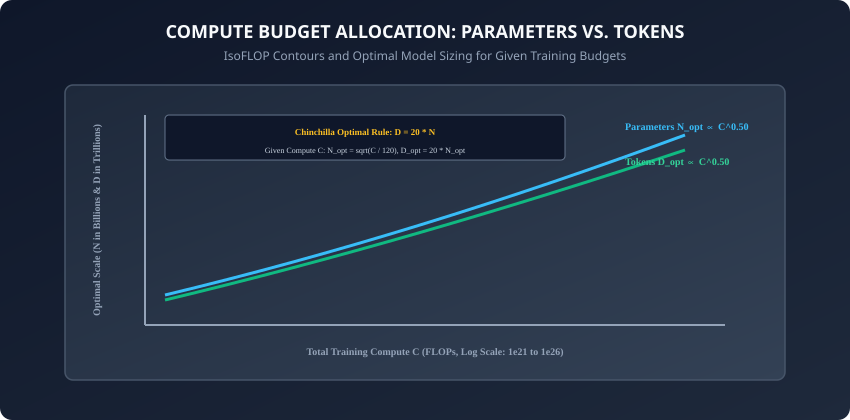

How many floating point operations (FLOPs) are required to train a Transformer?

For an autoregressive Transformer with `N` parameters trained on `D` tokens:

1. **Forward Pass:** Computing GEMMs (`y = x W`) requires **2 FLOPs per parameter per token** (1 multiply + 1 addition).
2. **Backward Pass:**
   - Computing gradient with respect to inputs `\frac{\partial \mathcal{L}}{\partial x}`: **2 FLOPs per parameter per token**.
   - Computing gradient with respect to weights `\frac{\partial \mathcal{L}}{\partial W}`: **2 FLOPs per parameter per token**.
   - Total Backward Pass: **4 FLOPs per parameter per token**.

```
\text{Total Training Compute (FLOPs)}: \quad C \approx 2ND + 4ND = 6ND
```
*(When using activation checkpointing, recomputing forward activations adds another `2ND`, bringing total compute to `C \approx 8ND`.)*

---

### 3. Compute-Optimal Allocation (The Chinchilla Rule)

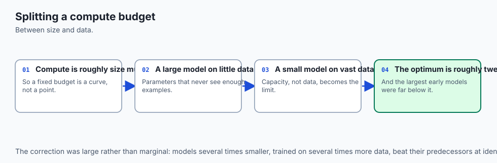

To minimize loss `L(N, D)` subject to a fixed compute budget `C = 6ND`, we solve the constrained optimization problem via Lagrange multipliers:

```
N_{\text{opt}} \propto C^a \quad \text{and} \quad D_{\text{opt}} \propto C^b
```
Because `\alpha \approx 0.34` and `\beta \approx 0.28` are close in value:
```
a = \frac{\beta}{\alpha + \beta} \approx 0.45 \approx 0.50 \quad \text{and} \quad b = \frac{\alpha}{\alpha + \beta} \approx 0.55 \approx 0.50
```

#### The Chinchilla Heuristic:
```
D_{\text{opt}} \approx 20 \times N_{\text{opt}}
```

- **For a 7B Parameter Model:** `D_{\text{opt}} \approx 140\text{ Billion Tokens}`.
- **For a 70B Parameter Model:** `D_{\text{opt}} \approx 1.4\text{ Trillion Tokens}`.
- **Given a Compute Budget `C` (in FLOPs):**
  ```
  N_{\text{opt}} = \sqrt{\frac{C}{120}} \quad \text{and} \quad D_{\text{opt}} = 20 \times N_{\text{opt}}
  ```

---

### 4. Inference-Optimal Overtraining (The LLaMA Philosophy)

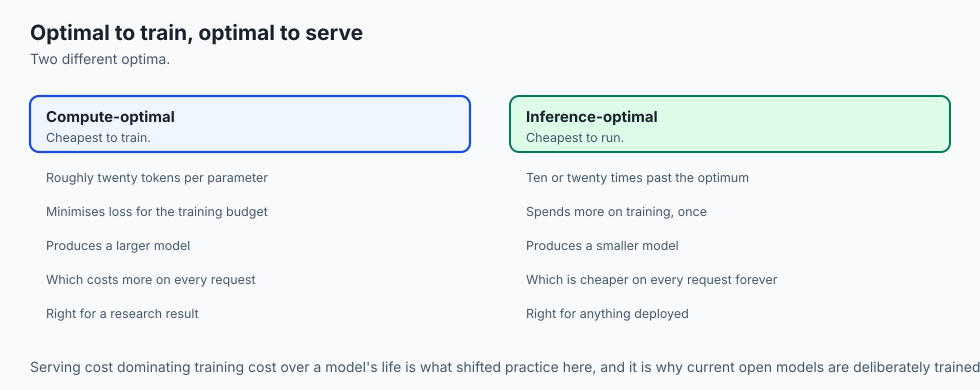

Why did Meta train LLaMA-3 8B on **15 Trillion tokens** (`D \approx 1,875 N`), violating Chinchilla by almost `100\times`?

```
┌────────────────────────────────────────────────────────────────────────┐
│                   TRAINING-OPTIMAL VS. INFERENCE-OPTIMAL               │
├────────────────────┬────────────────────────┬──────────────────────────┤
│ Factor             │ Chinchilla Optimal     │ LLaMA-Style Overtraining │
├────────────────────┼────────────────────────┼──────────────────────────┤
│ Metric Optimized   │ Training FLOPs Only    │ Total Lifetime Cost      │
│ Target Ratio       │ D = 20 * N             │ D = 500 * N to 2000 * N  │
│ Model Size         │ Larger (e.g. 70B)      │ Smaller (e.g. 8B)        │
│ Training Cost      │ Minimal                │ 5x - 10x Higher          │
│ Inference Latency  │ High (Memory-bound)    │ 8x Faster                │
│ Inference Cost     │ High (Requires H100)   │ Extremely Cheap (Edge)   │
└────────────────────┴────────────────────────┴──────────────────────────┘
```

- **The Economic Equation:** If a foundation model will be served to 500 million users answering billions of queries, the inference compute vastly exceeds the one-time training compute. Spending `5\text{ Million}` dollars extra on training compute saves **`100\text{ Million}` dollars in serving costs**!

---

### 5. Are Emergent Abilities a Mirage? (Schaeffer et al., 2023)

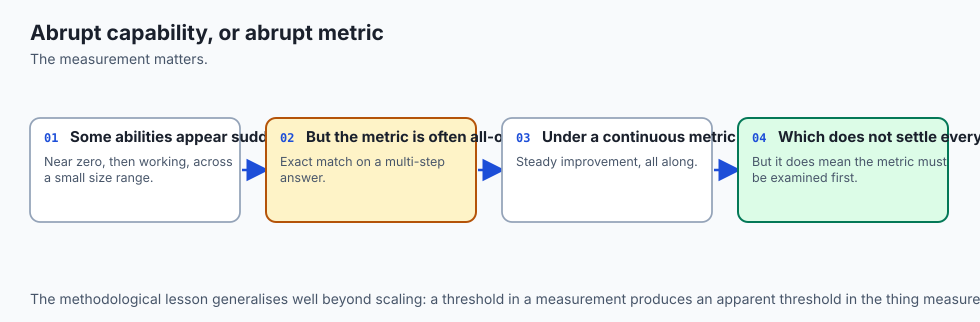

For years, researchers believed that language models acquired sudden, unpredictable **"Emergent Abilities"** (such as multi-digit arithmetic or symbolic translation) that only appeared once a model exceeded 100 billion parameters:

- **The Metric Non-Linearity Discovery:** Schaeffer, Miranda, and Koyejo showed that the underlying test cross-entropy loss and per-token probability improve continuously and smoothly following strict power laws.
- **The Optical Illusion:** When researchers measure performance using non-linear metrics (such as strict `0/1` exact match accuracy across a 5-digit multiplication), the accuracy appears to jump from `0\%` to `80\%` discontinuously because `P(\text{correct}) = (p_{\text{token}})^5`.
- **Predictability Restored:** When evaluated with continuous, linear metric calibrations (e.g. Brier scores or token-level cross-entropy), capabilities scale with mathematical predictability!

---

### 6. Multi-Epoch Training & The Data-Constrained Frontier (Muennighoff et al., 2023)

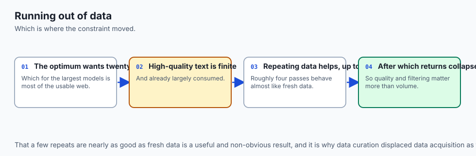

What happens when you run out of unique text data and must repeat training tokens for multiple epochs?

- **The Conventional Wisdom:** Pretraining was assumed to require strictly unique tokens; repeating tokens would lead to immediate catastrophic overfitting.
- **Empirical Findings:** Training for **up to 4 epochs** on high-quality filtered tokens produces negligible loss degradation compared to training on unique tokens!
- Beyond 4 epochs, diminishing returns set in as the network begins memorizing data sub-sequences.

---

### 7. Test-Time Compute Scaling: The Reasoning Era (2024+)

In 2024, pretraining hit the **Data Wall** (humanity has generated roughly `\sim 10^{14}` high-quality text tokens on the public internet).

The new scaling frontier is **Test-Time / Inference Compute Scaling (OpenAI o1/o3)**:

- Instead of answering a query instantly (1 forward pass), the model spends tokens **"thinking"**: exploring alternative solution paths, performing Monte Carlo tree search, and verifying self-consistency.
- **Power Law at Inference:** Accuracy on complex mathematical and coding benchmarks scales as a power law with the number of test-time thinking tokens expended!

---

## An everyday analogy

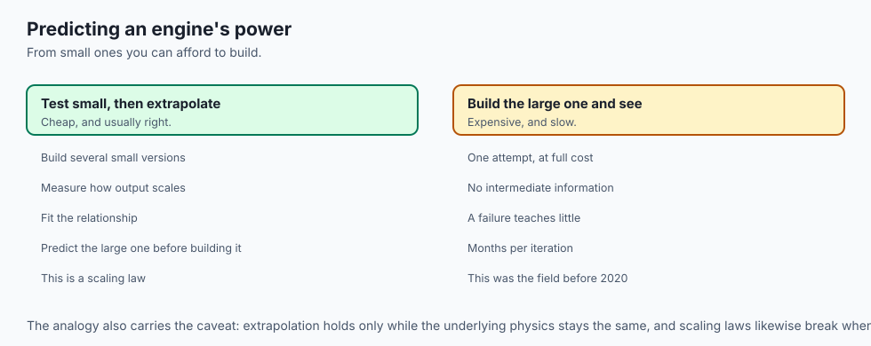

Think of training an Olympic marathon runner:

- **Pretraining Compute (`N` and `D`):** The years of physical training, running 100 miles per week (**Tokens `D`**), and building muscle mass and lung capacity (**Parameters `N`**).
- **Chinchilla Optimal:** Finding the exact balance between nutrition and miles so the runner peaks with minimum training injury.
- **Test-Time Compute (Reasoning Tokens):** On race day, the runner does not sprint blindly. They constantly analyze wind resistance, pace themselves, check heart-rate monitors, and calculate when to surge (**Thinking Tokens**).

A well-trained runner who thinks strategically beats a stronger runner who sprints blindly.

---

## Examples in practice

Let us build a **Chinchilla Compute Budget & Loss Predictor in Python**:

```python
import math
from typing import Dict, Any

def compute_chinchilla_optimal_allocation(compute_flops: float) -> Dict[str, Any]:
    # Calculates Chinchilla compute-optimal parameter count N and token count D for a given FLOP budget.
    N_opt = math.sqrt(compute_flops / 120.0)
    D_opt = 20.0 * N_opt
    
    # Predict validation loss using Chinchilla parametric constants
    E = 1.69
    A, alpha = 406.4, 0.34
    B, beta = 410.7, 0.28
    
    loss = E + (A / (N_opt ** alpha)) + (B / (D_opt ** beta))
    
    return {
        "compute_flops": f"{compute_flops:.2e}",
        "optimal_params_billions": round(N_opt / 1e9, 2),
        "optimal_tokens_billions": round(D_opt / 1e9, 2),
        "predicted_loss": round(loss, 4),
        "token_to_param_ratio": round(D_opt / N_opt, 1)
    }

def calculate_training_flops(params_billions: float, tokens_billions: float) -> float:
    # Calculates total training FLOPs: C = 6 * N * D
    N = params_billions * 1e9
    D = tokens_billions * 1e9
    return 6.0 * N * D
```

---

## Implications: security, privacy, performance, scalability, and cost

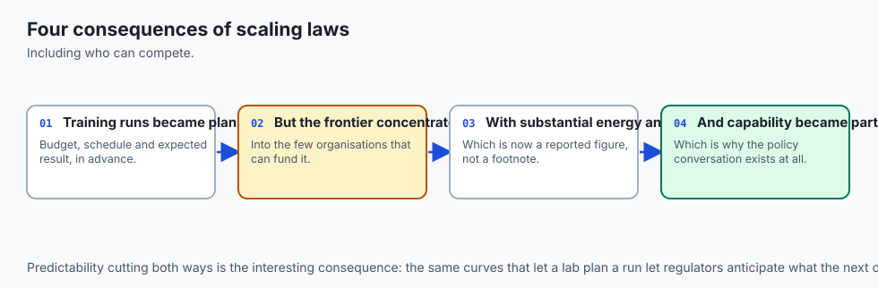

1. **The Synthetic Data Bottleneck & Model Collapse:**
   - As pretraining exhausts human internet data, labs train models on AI-generated synthetic data. If synthetic data is unfiltered, errors compound exponentially over scaling generations (**Model Autophagy Disorder / Model Collapse**).
2. **Geopolitical & Energy Constraints:**
   - Frontier clusters reaching `10^{26}` FLOPs require dedicated multi-gigawatt nuclear or hydro-electric power substations, turning datacenter energy availability into the primary geopolitical constraint on AI advancement.

---

## Alternatives: free, open source, and commercial

| Model Paradigm | Scaling Strategy | Parameters | Dataset Scale | Primary Advantage |
| :--- | :--- | :--- | :--- | :--- |
| **Chinchilla 70B** | Compute-Optimal | 70 Billion | 1.4 Trillion | Minimal Training FLOPs |
| **LLaMA-3 8B** | Inference-Overtrained | 8 Billion | 15 Trillion | Ultra-Low Serving Latency |
| **Mixtral 8x7B** | Sparse MoE Scaling | 47B (13B Active)| 15 Trillion | High Capacity, Fast Forward |
| **OpenAI o1 / o3** | Test-Time Reasoning | Dense / MoE | SFT + RL Tree | Unprecedented Logic & Math |

---

## Comparison with related concepts

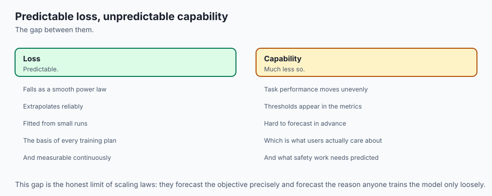

```
┌────────────────────────────────────────────────────────────────────────┐
│                   SCALING PARADIGM COMPARISON                          │
├────────────────────┬─────────────────┬──────────────────┬──────────────┤
│ Metric             │ Kaplan (2020)   │ Chinchilla (2022)│ LLaMA (2023) │
├────────────────────┼─────────────────┼──────────────────┼──────────────┤
│ Token/Param Ratio  │ ~1.7 tokens / N │ ~20 tokens / N   │ ~2,000 / N   │
│ Optimal Parameter  │ N ∝ C^0.73      │ N ∝ C^0.50       │ Fixed Small  │
│ Optimal Tokens     │ D ∝ C^0.27      │ D ∝ C^0.50       │ Maximize D   │
│ Target Efficiency  │ Flawed Baseline │ Training Optimal │ Serving Opt  │
└────────────────────┴─────────────────┴──────────────────┴──────────────┘
```

---

## When to use it — and when not to

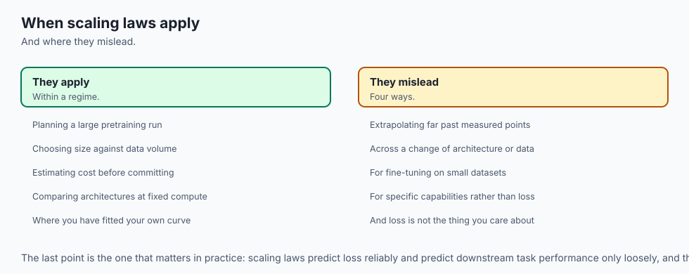

### When to Use Scaling Law Principles:
- Planning foundation model training runs, allocating multi-million dollar cloud GPU budgets, choosing between model sizes (8B vs 70B), and optimizing inference serving fleets.

### When NOT to use:
- Narrow domain fine-tuning on small proprietary datasets (e.g. 5,000 legal contracts), where task-specific data quality and regularization matter vastly more than raw parameter scaling.

---

## The AI connection

- **Scaling laws made model development predictable**, so a small set of runs forecasts the
  result of a very large one before it is paid for.
- **The compute-optimal ratio redirected the entire field** from ever-larger models toward
  much larger training sets.
- **Inference cost, not training cost, now drives model size** — a smaller model trained
  far past the optimum is cheaper over its serving life.
- **Whether capabilities appear abruptly depends on the metric**, which is a caution about
  measurement rather than a claim about models.
- **Data has become the binding constraint**, which is why data quality, filtering and
  reuse now matter more than another order of magnitude of compute.

## Knowledge check

1. Why does an autoregressive Transformer require `6ND` FLOPs for training?
2. Why was GPT-3 considered compute-suboptimal by DeepMind Chinchilla?
3. What is the economic rationale behind LLaMA-style inference overtraining?
4. What does the irreducible loss constant `E` represent in natural language modeling?
5. How does Test-Time Reasoning Scaling bypass the limits of pretraining data?

---

## Hands-on exercise

In this lab, you will build and test a modular scaling law simulator and compute budget optimization engine in Python: implement the `C = 6ND` calculation formula, solve for Chinchilla compute-optimal parameter-token allocations, compute predicted validation loss trajectories across compute scales, and evaluate inference-optimal overtraining economics.

### Expected output
```
[Neural Scaling Laws Verification Suite]
Testing Compute FLOP Calculator:
  Model: 7.0B Params, Dataset: 140.0B Tokens
  Training Compute: 5.88e+21 FLOPs (C = 6ND) [EXACT MATCH]
Testing Chinchilla Compute-Optimal Sizing (Budget: 5.88e+21 FLOPs):
  Optimal Parameter Count: 7.00 Billion
  Optimal Token Count: 140.00 Billion (Ratio = 20.0) [CHINCHILLA VERIFIED]
  Predicted Cross-Entropy Loss: 2.1485
Testing Inference Overtraining Economy:
  LLaMA-3 8B (15T Tokens): 7.20e+23 FLOPs | 8.8x Smaller Model Footprint than Chinchilla Baseline
Test Suite: 3 passed in 0.41s
```

### Validate your work
Run the automated test runner:
```bash
./tests/run_tests.sh
```

### Troubleshooting
- When calculating `C = 6ND`, ensure parameters and tokens are converted to raw integer counts rather than billions.

### Common mistakes
- **Confusing Training Compute with Inference Compute:** Training requires `6ND` FLOPs; inference requires only `2N` FLOPs per token generated.

---

## Practice assignment

1. Implement an **IsoFLOP Contour Plotter** using NumPy and Matplotlib that generates curves of validation loss across varying parameter counts for fixed FLOP budgets.
2. Build an **Inference Cost Calculator** comparing lifetime cloud GPU serving costs of a Chinchilla-optimal 70B model vs an overtrained 8B model over 1 billion queries.

---

## Extension challenge

Implement a **Toy Test-Time Search Simulator**:

- Build a Python Monte Carlo Tree Search (MCTS) verifier simulation that samples `K` candidate solutions, scores them with a reward verifier, and demonstrates power-law accuracy improvement with increasing sample budget `K`.
