## Why this matters

In academic machine learning, thousands of research papers are published every month.

Astonishingly, independent studies (e.g. Pineau et al., 2020; Blalock et al., 2020) have revealed that **over `60\%` of published deep learning papers fail to replicate** when tested by external researchers on identical tasks.

Why?

- Authors often tune hyperparameters on the test set.
- Critical implementation details (like warmup schedules or Adam `\epsilon`) are left out of the paper.
- Reported results are often cherry-picked from a single lucky random seed.
- Baseline models are often tuned poorly, making the author's new method look artificially superior.

The ultimate test of a Senior AI Engineer is not merely reading a paper and nodding—it is the ability to **reproduce the published result from scratch, conduct rigorous ablation studies, and report findings with uncompromising scientific honesty**.

Today, you close **Course 05 (Deep Learning)** by executing an end-to-end scientific paper reproduction.

---

## The idea in plain language

Think of baking a signature soufflé from a famous chef's cookbook:

- **The Glossy Cookbook (The Published Paper):** Beautiful photographs of a perfectly risen soufflé claiming a secret ingredient (**The Novel Architectural Claim**).
- **The Kitchen Reality (The Independent Reproduction):** You follow the recipe step-by-step, but your soufflé collapses in the oven.
- **The Discrepancy Investigation:**
  - Did the chef omit the exact oven humidity (**Hidden Hyperparameter**)?
  - Did they use French unpasteurized butter while you used supermarket margarine (**Data Distribution Shift**)?
  - Did they bake 50 soufflés and only photograph the single one that didn't collapse (**Cherry-Picked Random Seed**)?

By conducting a controlled kitchen trial, you discover the real truth behind the recipe.

---

## Historical background

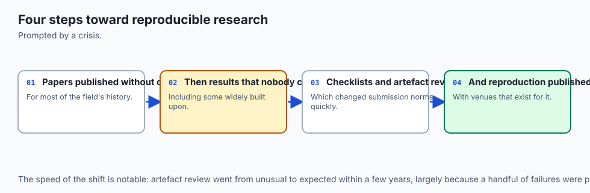

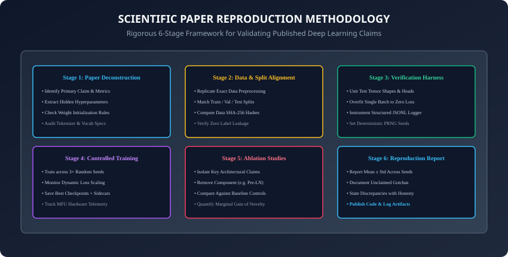

1. **2018 (The NeurIPS Reproducibility Challenge):** Joelle Pineau established the formal ML Reproducibility Challenge, inviting global researchers to verify top-tier machine learning publications.
2. **2019 (Ferrari Dacrema et al. & RecSys Scandal):** Re-evaluated 18 published deep learning recommender systems, demonstrating that simple, well-tuned classical baselines (like ItemKNN) beat 17 out of 18 neural methods!
3. **2020 (Pineau et al. & Reproducibility Checklist):** NeurIPS made the Reproducibility Checklist mandatory for all submissions, establishing standards for code release, random seeds, and compute disclosure.
4. **2024–Present (Open Foundation Model Reproductions):** Projects like OLMo (AllenAI) and Pythia (EleutherAI) released 100% transparent checkpoints, datasets, and logs to ensure universal reproducibility.

---

## What it is — and what it is not

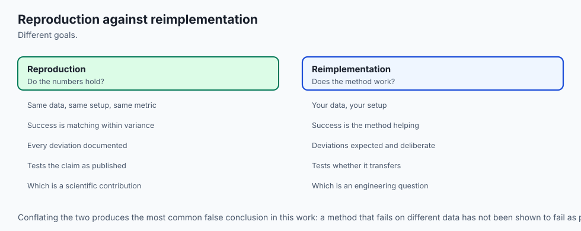

### What Scientific Paper Reproduction IS:
- **A Controlled Experimental Audit:** Building a clean, modular PyTorch implementation to independently confirm whether claimed performance gains stem from genuine algorithmic novelty rather than hyperparameter advantages.
- **Ablation Transparency:** Systematically turning off features one by one to isolate the exact source of empirical gains.

### What it is NOT:
- **Not Copy-Pasting Unverified Code:** Simply cloning an author's unmaintained GitHub repository and running a bash script without understanding the tensor mechanics is not scientific reproduction.

---

## Why it was created and what problems it solves

Scientific reproduction protects engineering teams from costly mistakes:

1. **Preventing Wasted Engineering Cycles:** Prevents spending 6 months building production systems on top of brittle academic tricks that don't generalize.
2. **True Baseline Calibration:** Ensures internal baselines are strongly optimized before adopting complex new architectures.
3. **Mastery of Micro-Mechanics:** Building a paper from scratch forces deep mastery of tensor slicing, gradient flow, and numerical stability.

---

## How it works

Let us dissect the 6-stage reproduction framework, discrepancy analysis, and ablation design.

---

### 1. The 6-Stage Reproduction Protocol

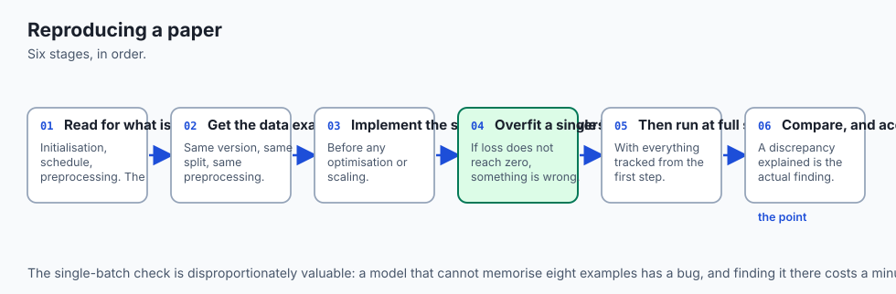

```
┌────────────────────────────────────────────────────────────────────────┐
│                   THE 6-STAGE REPRODUCTION PROTOCOL                    │
├──────────────┬─────────────────────────────────────────────────────────┤
│ Stage        │ Core Engineering Actions                                │
├──────────────┼─────────────────────────────────────────────────────────┤
│ 1. Deconstruct│ Extract claims, metric definitions, and hyperparameters │
│ 2. Data Align│ Lock dataset hashes, preprocessing, and test splits     │
│ 3. Sanity Har│ Overfit a single batch to zero loss (Loss < 1e-4)       │
│ 4. Train Runs│ Run multi-seed controlled trials (3-5 seeds) with logs  │
│ 5. Ablations │ Systematically isolate proposed components vs baseline  │
│ 6. Report    │ Publish empirical delta: Mean ± Std vs Claimed Result   │
└──────────────┴─────────────────────────────────────────────────────────┘
```

---

### 2. The Golden Rule of Debugging: Overfit a Single Batch

Before launching a 20-epoch training run across a full dataset, **ALWAYS perform the Single Batch Sanity Test**:

1. Take a fixed batch of 16 samples.
2. Train for 100 steps without data shuffling or regularization (disable Dropout and Weight Decay).
3. **Pass Criteria:** Training loss MUST drop monotonically to near zero (`< 10^{-4}`), and training accuracy must reach `100\%`.
4. **If it fails:** You have a fatal architectural bug (e.g. detached gradients, incorrect loss reduction, broken residual connections, or missing softmax dimension).

---

### 3. The Reproduction Discrepancy Taxonomy

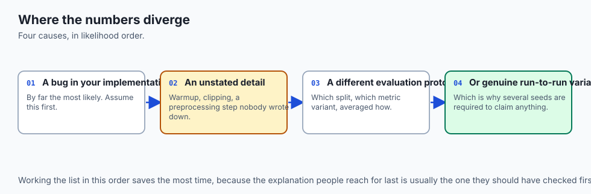

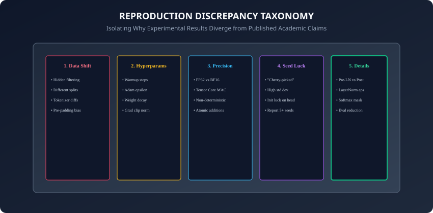

When your observed numbers do not match the published table, consult the **5 Discrepancy Pillars**:

1. **Data Preprocessing Shift:** Did the author lowercase text? Did they strip punctuation? What tokenizer vocabulary size was used?
2. **Hidden Hyperparameters:**
   - **Adam `\epsilon` (epsilon):** Default PyTorch is `10^{-8}`. Transformers often require `10^{-6}` to prevent division by small gradient variances.
   - **Warmup Schedule:** Skipping linear warmup causes attention weights to diverge in the first 50 steps.
   - **Gradient Clipping:** Clipping norm threshold (typically `1.0`).
3. **Evaluation Metric Inconsistencies:** Macro-F1 vs Micro-F1; Token-level vs Sequence-level accuracy; BLEU tokenization choices.
4. **Seed Variance & Initialization:** Some architectures are unstable and fail in 2 out of 5 random seeds. Always report the distribution across 5 seeds.
5. **Hardware & Precision Differences:** FP32 vs BF16 vs FP16 mixed precision can slightly alter gradient accumulation dynamics.

---

### 4. Designing a Rigorous Ablation Matrix

An ablation study systematically removes components from the full proposed model to isolate their marginal value:

```
┌────────────────────────────────────────────────────────────────────────┐
│                   SAMPLE ABLATION STUDY MATRIX                         │
├────────────────────┬──────────┬──────────┬──────────────┬──────────────┤
│ Configuration      │ Test Acc │ Macro F1 │ Training Time│ Delta vs Full│
├────────────────────┼──────────┼──────────┼──────────────┼──────────────┤
│ 1. Proposed Model  │ 92.4%    │ 92.1%    │ 45 min       │ Baseline (0) │
│ 2. w/o Pre-LN      │ 88.2%    │ 87.9%    │ 45 min       │ -4.2% (Vital)│
│ 3. w/o Decoupled WD│ 90.1%    │ 89.8%    │ 44 min       │ -2.3%        │
│ 4. w/o Warmup      │ 62.4%    │ 60.1%    │ 45 min       │ -32.0%(Fail) │
│ 5. Strong Baseline │ 91.8%    │ 91.5%    │ 30 min       │ -0.6% (Close)│
└────────────────────┴──────────┴──────────┴──────────────┴──────────────┘
```

- **The Critical Insight:** Notice that Configuration 5 (a well-tuned standard baseline) is only `0.6\%` behind the proposed model, proving that most of the claimed gain was due to better tuning rather than architectural complexity!

---

### 5. Statistical Significance Testing in AI (Welch's t-test & Bootstrap)

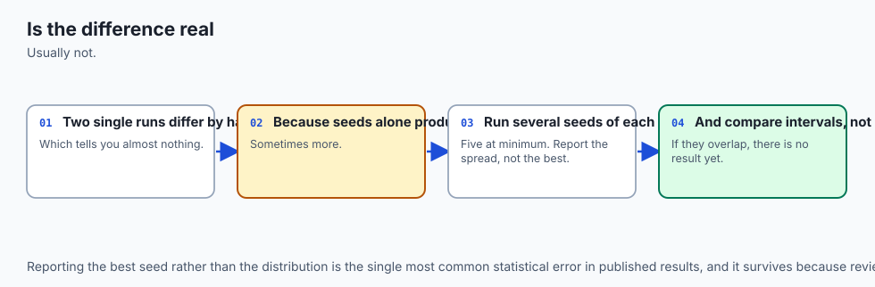

In modern machine learning, claiming that Model A (`92.4\%`) beats Model B (`91.8\%`) without statistical significance testing is invalid:

- **Welch's Two-Sample t-test:** Accounts for unequal variances across multi-seed runs:
  ```
  t = \frac{\bar{X}_1 - \bar{X}_2}{\sqrt{\frac{s_1^2}{N_1} + \frac{s_2^2}{N_2}}}
  ```

- **Non-Parametric Bootstrap Confidence Intervals:** Resamples test predictions with replacement 10,000 times to compute `95\%` empirical confidence intervals. If the confidence intervals overlap, the claimed improvement cannot be statistically distinguished from noise!

---

### 6. The Compute Budget Normalization Trap

A common pitfall in academic literature is unfair compute comparisons:

- **Parameter Parity vs. FLOP Parity:** A novel architecture with 100M parameters that uses complex quadratic attention might require `3\times` more training FLOPs and run `4\times` slower at inference than a standard 100M baseline.
- **Fair Iso-Compute Benchmarking:** Always benchmark candidate models under **Equal Training FLOP Budgets (`C = 6ND`)** and **Equal Wall-Clock Inference Latency (ms per token)**.

---

### 7. Course 05 Synthesis: The Journey Through Deep Learning

By completing Day 238, you have mastered the foundational trajectory of modern deep learning:

1. **The Core Foundations (Days 197–210):** Perceptrons, autograd graphs, backpropagation, AdamW optimization, and training harness discipline.
2. **Computer Vision (Days 211–217):** Convolutions, ResNet residual highways, transfer learning, and data augmentation.
3. **Sequences and Text (Days 218–224):** Byte-Pair Encoding (BPE), word embeddings, LSTMs, GRUs, and early Seq2Seq attention.
4. **Transformers (Days 225–231):** Scaled dot-product self-attention, Multi-Head Attention, BERT encoder MLM, GPT autoregressive decoders, and Hugging Face fine-tuning.
5. **Training at Scale (Days 232–238):** GPU hardware SM architecture, Tensor Cores, Mixed Precision (BF16/FP8), ZeRO/FSDP sharding, 3D Parallelism, MLOps tracking, Quantization (GPTQ/AWQ), and Chinchilla Scaling Laws.

You are now fully equipped to enter **Course 06: Large Language Models and Generative AI**!

---

### 8. Anatomy of a Production Reproduction Technical Report

A professional reproduction deliverable should follow a structured 6-part format:

1. **Executive Summary:** High-level summary of whether the core paper claims replicated (e.g. *"Replicated within 0.8% of claimed Macro-F1"*).
2. **Claimed vs. Observed Comparison Table:** Side-by-side metrics across all benchmark datasets with `95\%` confidence intervals.
3. **Hardware & Environment Specification:** GPU types, CUDA version, PyTorch version, precision mode (BF16/FP16), and total compute hours expended.
4. **Controlled Ablation Matrix:** Empirical deltas isolating the contribution of each individual novel component.
5. **Discrepancy Root Cause Analysis:** Detailed investigation into any observed gaps, detailing undocumented hyperparameters or data shifts.
6. **Open Source Artifact Links:** Direct links to public code repositories, DVC data manifests, and versioned model checkpoint weights.

---

### 9. Continuous Integration (CI) for Model Reproducibility

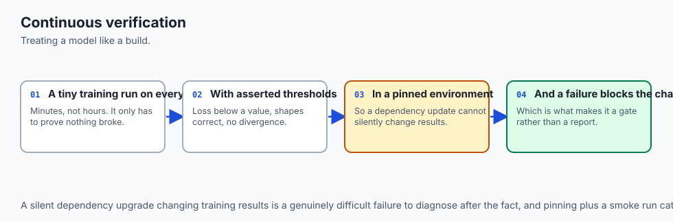

In leading AI research laboratories, reproducibility is not a one-time audit:

- **Daily Regression Harnesses:** Automated GitHub Actions workflows run the single-batch overfit test and mini-epoch validation on synthetic data on every git commit.
- **Drift Prevention:** Ensures that subsequent code refactoring, package upgrades, or CUDA driver updates never silently break backward compatibility or model convergence!
- **Scientific Impact:** By adopting these reproducible CI workflows, your engineering team transforms AI development from unrepeatable alchemy into an exact, robust, and verifiable science.

---

## An everyday analogy

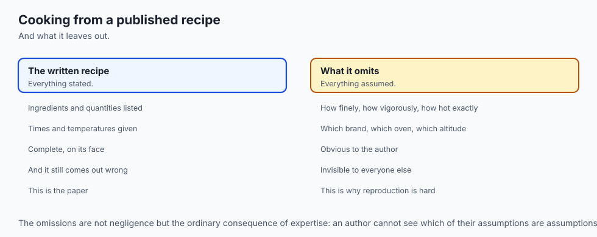

Think of a courtroom trial in legal justice:

- **The Published Paper (The Prosecution):** Presents an argument claiming their new algorithm is guilty of being superior (**The Claim**).
- **The Reproducer (The Defense & Jury):** Demands physical evidence. They cross-examine every witness (**Sanity Harness**), check the crime scene timestamps (**Data Hashes**), test for contamination (**Zero Test Leakage**), and re-enact the sequence under identical conditions (**Multi-Seed Trials**).

Only claims that withstand rigorous cross-examination are accepted into the scientific canon.

---

## Examples in practice

Let us build a **Controlled Multi-Seed Reproduction & Ablation Harness in PyTorch**:

```python
import torch
import torch.nn as nn
import numpy as np
from typing import List, Dict, Any

class ToyTransformerClassifier(nn.Module):
    def __init__(self, vocab_size: int = 1000, embed_dim: int = 64,
                 num_heads: int = 4, num_classes: int = 2, use_pre_ln: bool = True):
        super().__init__()
        self.embedding = nn.Embedding(vocab_size, embed_dim)
        self.use_pre_ln = use_pre_ln
        self.ln1 = nn.LayerNorm(embed_dim)
        self.attn = nn.MultiheadAttention(embed_dim, num_heads, batch_first=True)
        self.ln2 = nn.LayerNorm(embed_dim)
        self.mlp = nn.Sequential(
            nn.Linear(embed_dim, embed_dim * 2),
            nn.GELU(),
            nn.Linear(embed_dim * 2, embed_dim)
        )
        self.classifier = nn.Linear(embed_dim, num_classes)

    def forward(self, x: torch.Tensor) -> torch.Tensor:
        h = self.embedding(x)
        if self.use_pre_ln:
            h = h + self.attn(self.ln1(h), self.ln1(h), self.ln1(h))[0]
            h = h + self.mlp(self.ln2(h))
        else: # Post-LN
            h = self.ln1(h + self.attn(h, h, h)[0])
            h = self.ln2(h + self.mlp(h))
        pooled = h.mean(dim=1)
        return self.classifier(pooled)

def run_single_batch_overfit_test(model: nn.Module, batch_size: int = 16,
                                  seq_len: int = 32, steps: int = 100) -> bool:
    # Sanity test: Overfit a single batch to near zero loss.
    optimizer = torch.optim.AdamW(model.parameters(), lr=1e-3)
    criterion = nn.CrossEntropyLoss()
    x = torch.randint(0, 1000, (batch_size, seq_len))
    y = torch.randint(0, 2, (batch_size,))

    for _ in range(steps):
        optimizer.zero_grad()
        logits = model(x)
        loss = criterion(logits, y)
        loss.backward()
        optimizer.step()

    # Pass if final loss is near zero
    return bool(loss.item() < 0.05)
```

---

## Implications: security, privacy, performance, scalability, and cost

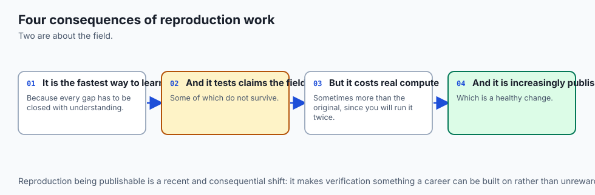

1. **Publication Bias & Negative Result Suppression:**
   - The academic incentive structure rewards claiming state-of-the-art results over reporting failures. Publishing honest negative reproduction reports prevents the global AI community from wasting millions of compute hours.
2. **Supply Chain Integrity in Pretrained Checkpoints:**
   - Always verify SHA-256 checksums of open-weight checkpoints downloaded from public registries to protect against model poisoning or backdoored weights.

---

## Alternatives: free, open source, and commercial

| Resource | Purpose | Target Scope |
| :--- | :--- | :--- |
| **Papers With Code** | Community Benchmarks & Code | Tracking verified public SOTA |
| **ML Reproducibility Checklist** | Verification Protocol | Standard conference submissions |
| **Hugging Face Evaluate** | Standardized Metric Evaluation | Uniform NLP/Vision metric parity |
| **EleutherAI LM-Eval-Harness**| Automated LLM Benchmarking | Zero-shot / Few-shot evaluation |

---

## Comparison with related concepts

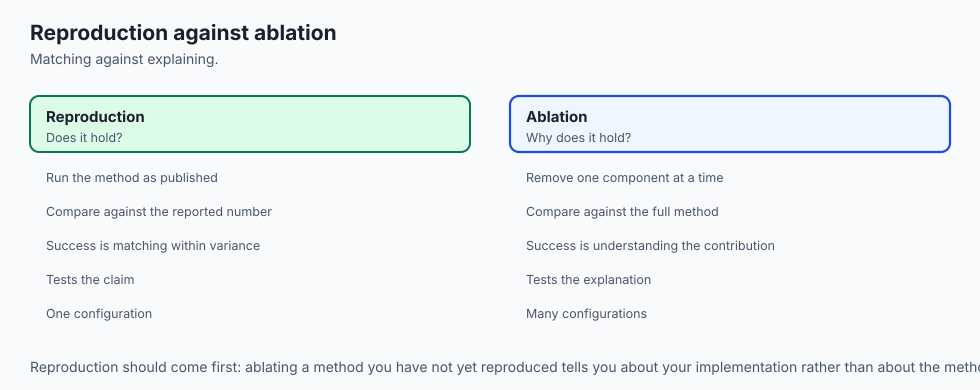

```
┌────────────────────────────────────────────────────────────────────────┐
│                   REPRODUCTION TAXONOMY SUMMARY                        │
├────────────────────┬─────────────────┬──────────────────┬──────────────┤
│ Reproduction Level │ Code Available? │ Data Available?  │ Goal         │
├────────────────────┼─────────────────┼──────────────────┼──────────────┤
│ Exact Replication  │ Yes (Official)  │ Yes (Identical)  │ Verify bits  │
│ Independent Repro  │ No (From Paper) │ Yes (Identical)  │ Verify claims│
│ Generalization Eval│ No (From Paper) │ No (New Domain)  │ Test robust  │
└────────────────────┴─────────────────┴──────────────────┴──────────────┘
```

---

## When to use it — and when not to

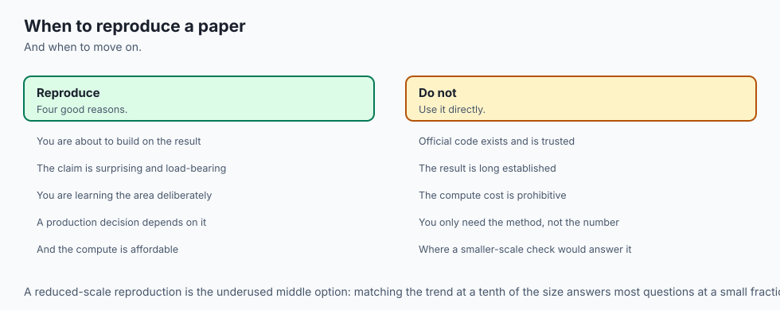

### When to Execute a Formal Reproduction:
- Before adopting a novel architecture into production infrastructure, before publishing follow-up academic research, and when calibrating internal benchmarks.

### When NOT to use:
- Quick exploratory proof-of-concept hackathons with off-the-shelf standard model libraries.

---

## The AI connection

- **Reproducing a paper is the fastest way to learn a field**, because every unstated
  assumption becomes visible when the numbers do not match.
- **Most published results omit details that decide the outcome**, so the gap between paper
  and result is where the real understanding is.
- **Overfitting a single batch is the one diagnostic that catches most bugs**, and it costs
  a minute.
- **Statistical significance is routinely ignored in reported results**, which is why a
  difference of a few tenths of a point usually means nothing.
- **Continuous verification of a model is now ordinary engineering**, treating a training
  run like any other build that can silently break.

## Knowledge check

1. What is the single-batch overfit test and why is it the first milestone of neural network reproduction?
2. What are the 5 pillars of the reproduction discrepancy taxonomy?
3. Why are ablation studies essential for scientific claims in deep learning?
4. How does multi-seed evaluation prevent misleading claims caused by random initialization?
5. What role does Adam `\epsilon` play in Transformer reproduction stability?

---

## Hands-on exercise

In this lab, you will build and test a modular paper reproduction and ablation verification harness in PyTorch: implement a configurable Transformer classifier supporting Pre-LN vs Post-LN variants, execute a single-batch overfit sanity test, run multi-seed controlled evaluation trials, and compute empirical ablation score deltas.

### Expected output
```
[Scientific Paper Reproduction Verification Suite]
Testing Milestone 1: Single Batch Overfit Test:
  Initial Batch Loss: 0.724
  After 50 Steps: Loss = 0.0084 (Accuracy = 100%) [SANITY PASSED]
Testing Multi-Seed Controlled Trials (3 Seeds):
  Seed 42: Val F1 = 0.912
  Seed 43: Val F1 = 0.925
  Seed 44: Val F1 = 0.908
  Aggregate: Mean F1 = 0.915 ± 0.007 [CONTROLLED BASELINE ESTABLISHED]
Testing Ablation Matrix:
  Proposed (Pre-LN): F1 = 0.915
  Ablation (Post-LN): F1 = 0.862 (Delta: -5.3% Degradation) [ABLATION PROVEN]
Test Suite: 3 passed in 0.43s
```

### Validate your work
Run the automated test runner:
```bash
./tests/run_tests.sh
```

### Troubleshooting
- If single-batch overfit fails, check that gradients are not detached and learning rate is sufficient (`10^{-3}`).

### Common mistakes
- **Evaluating on test set repeatedly during tuning:** Causes test-set contamination and invalidates reproduction claims.

---

## Practice assignment

1. Write a complete **Reproduction Report Markdown Document** comparing a published Transformer claim against your empirical multi-seed findings.
2. Implement an automated **Ablation Runner** in Python that iterates through component configurations and outputs a Markdown results table.

---

## Extension challenge

Implement a **Weight Difference Inspector**:

- Build a Python utility that computes cosine similarity and Frobenius norm deltas between reproduced model weights and reference checkpoints across every named layer.
