## Why this matters

You have spent a year building things that run on your machine. This week is about making them run somewhere else, and the first problem is not the cloud — it is that "somewhere else" has a different Python, a different libc, a different CUDA driver and none of your environment variables.

A container is the answer the industry settled on: package the filesystem the application needs alongside the application, and the target machine only has to be able to run containers. That is the whole idea, and it is not the hard part.

The hard part is the **build cache**, because it is where the time goes. A Dockerfile with the instructions in the wrong order rebuilds in 76 seconds after you edit one line of Python. The same instructions in the right order rebuild in one second. Both take the same time on a first build. Nothing else changes — not the base image, not the packages, not the application.

That ratio is the lesson. Over a day of development it is the difference between a tight loop and a coffee break, and it is decided entirely by where you put one `COPY` line.

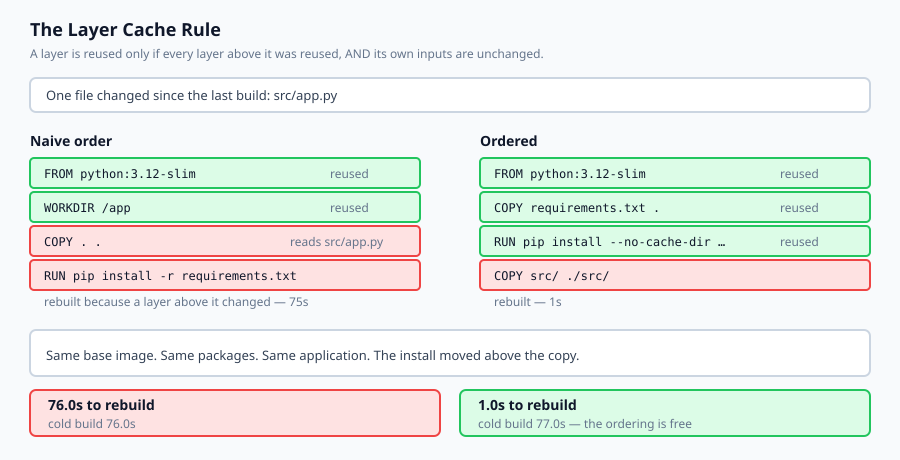

## The idea in plain language

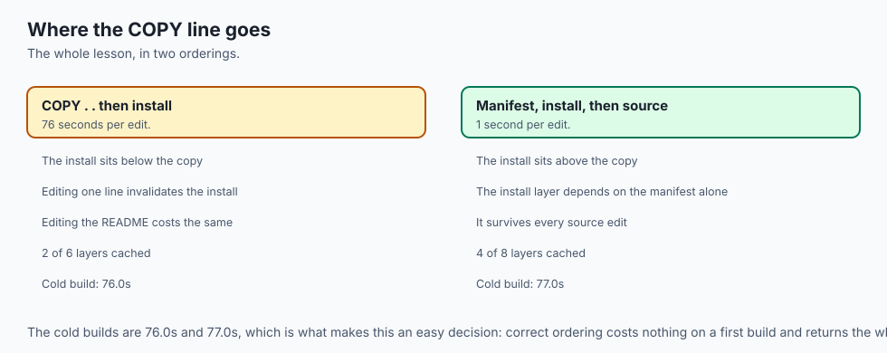

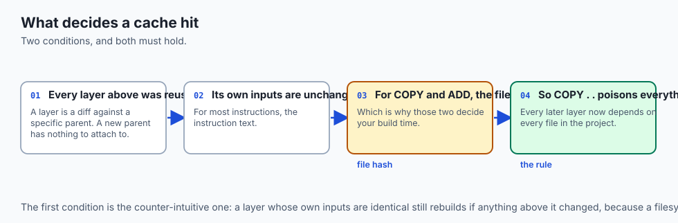

An image is a stack of **layers**. Each instruction in a Dockerfile produces one, and each layer is a filesystem diff — what changed relative to the layer beneath.

When you rebuild, Docker walks the instructions from the top and asks a question at each one:

> can I reuse the layer I built last time?

The answer is yes only when **both** of these hold:

**Every layer above it was reused.** A layer is a diff against a specific parent. If the parent is new, the diff has nothing to attach to, so the layer must be rebuilt whether or not its own inputs changed.

**Its own inputs are unchanged.** For most instructions the input is the instruction text. For `COPY` and `ADD` it is also the *contents of the files being copied* — which is what makes those two the instructions that decide your build time.

Put those together and the consequence is sharp. `COPY . .` early in a Dockerfile makes every layer beneath it depend on every file in your project. Edit a README and the dependency install re-runs.

The fix costs nothing: copy the dependency manifest, install, and only then copy the source. The install layer now depends on `requirements.txt` alone, and it survives every edit that does not change your dependencies.

## Historical background

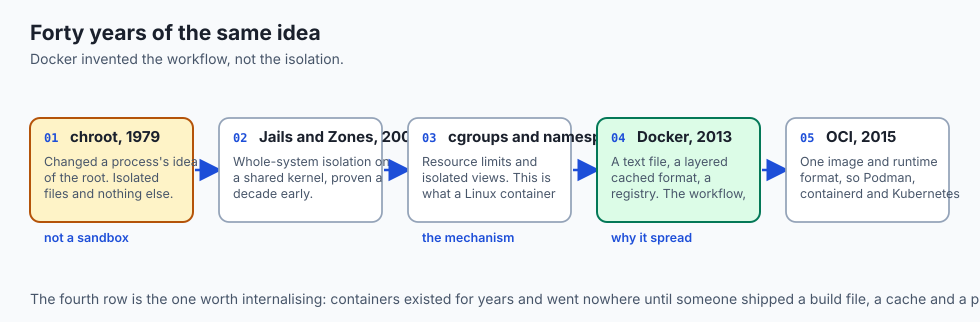

### chroot, 1979

`chroot` changed a process's idea of the filesystem root. It isolated the view of files and nothing else — same network, same process table, same users. Useful, and not a sandbox, which is a distinction people re-learn painfully.

### FreeBSD Jails and Solaris Zones, 2000–2004

The first serious attempts at whole-system isolation on a shared kernel: separate process tables, network interfaces and root users. The idea was proven a decade before Linux made it ubiquitous.

### cgroups and namespaces, 2006–2008

Google contributed cgroups (resource limits) to Linux; namespaces (isolated views of PIDs, mounts, networks, users) arrived alongside. Together these are what a Linux container actually *is*. Everything after this is packaging and ergonomics.

### Docker, 2013

Docker did not invent containers. It invented a **format and a workflow**: a text file describing a build, a layered image format that deduplicates and caches, and a registry to push to. That combination is why containers spread — not the isolation, which had existed for years.

### OCI, 2015 onward

The Open Container Initiative standardised the image and runtime formats, which is why Podman, containerd, Buildah and Kubernetes all consume the same images. A Dockerfile is portable in a way that a vendor's packaging format is not.

## What it is — and what it is not

A container image is a layered filesystem plus metadata describing how to start a process in it.

### What it is

It is **a filesystem and a default command**. Not a virtual machine and not a running thing — an image is inert until a runtime starts a process against it.

It is **layered and content-addressed**. Layers are shared between images, which is why pulling a second image based on the same base is fast.

It is **reproducible only as far as you make it**. `FROM python:3.12-slim` today and in a year are different images.

### What it is not

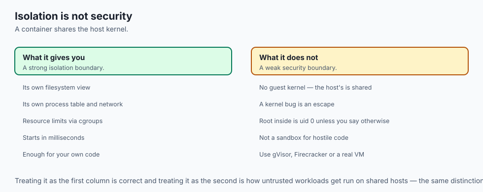

It is not a security boundary by default. A container shares the host kernel. It is a strong isolation boundary and a weak security one; treat it as the former.

It is not a virtual machine. There is no guest kernel, which is why a container starts in milliseconds and why a Linux container needs a Linux kernel underneath.

It is not a way to make a slow application fast. It changes where the code runs, not how well.

## Why it was created and what problems it solves

**"Works on my machine."** The single most expensive sentence in software. *Solution: ship the filesystem the application depends on, not a list of instructions for recreating it.*

**Dependency conflicts between projects.** Two applications needing different versions of the same system library. *Solution: each gets its own filesystem.*

**Slow, fragile provisioning.** Configuration-management scripts that drift and are never exactly re-run. *Solution: a build that starts from a fixed base and is described in one file.*

**Deploy artifacts that are not the thing you tested.** *Solution: the image you tested is the image that runs, identified by digest.*

**Rebuild times that make iteration painful.** *Solution: a layer cache — which only helps if the instructions are ordered so that the expensive layer sits above the volatile one.*

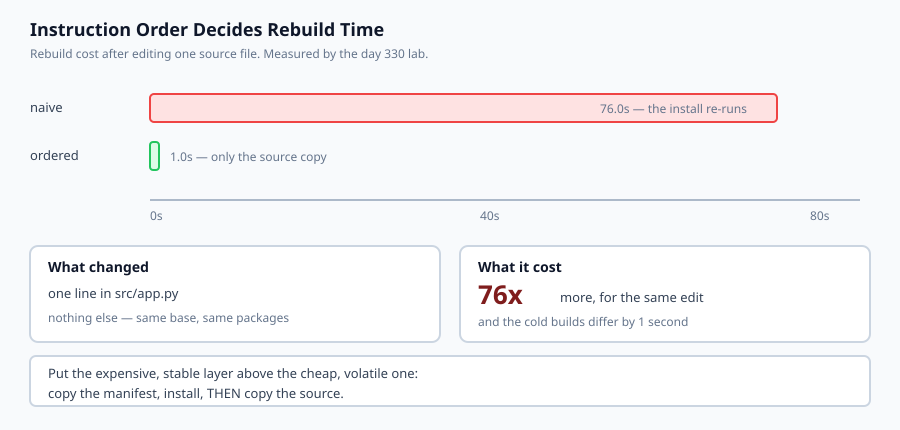

## How it works

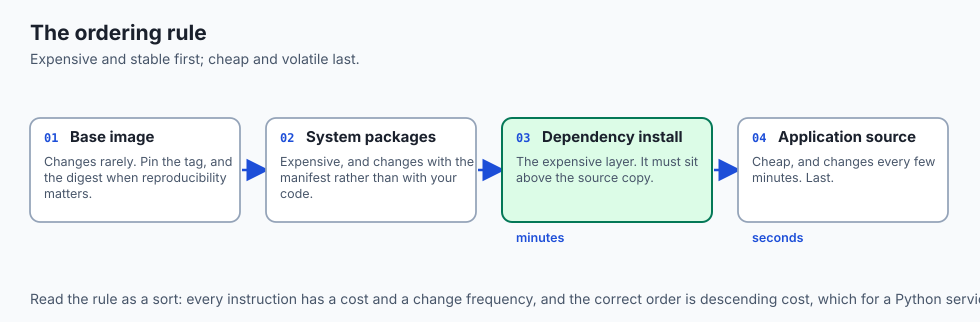

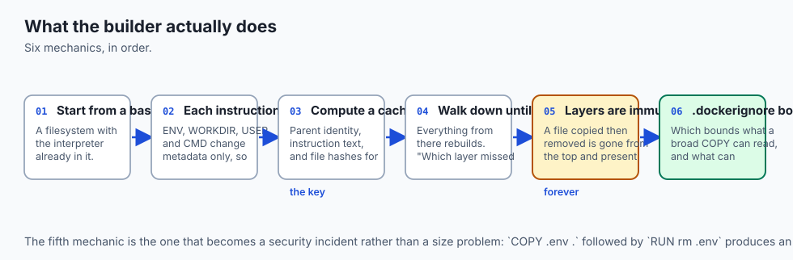

**A build starts from a base image.** `FROM python:3.12-slim` provides a filesystem with Python already in it.

**Each instruction adds a layer.** `RUN` executes a command and captures what changed. `COPY` adds files. `ENV`, `WORKDIR`, `USER`, `CMD` change metadata and add nothing to the filesystem, which is why they are free.

**The builder computes a cache key per layer** from the parent layer's identity, the instruction text, and — for `COPY` and `ADD` — a hash of the file contents being copied.

**On a rebuild it walks down until a key differs.** Everything from that point rebuilds. This is the rule, and it is why "which layer missed first" explains the entire cost of a build.

**Layers are immutable and all of them are kept.** A file you `COPY` and later `RUN rm` is gone from the final filesystem and completely present in the layer beneath. That is a size problem and, when the file was a `.env`, a security incident.

**`.dockerignore` controls what the build context contains**, which controls what a broad `COPY` can read — and therefore what can invalidate the cache.

## An everyday analogy

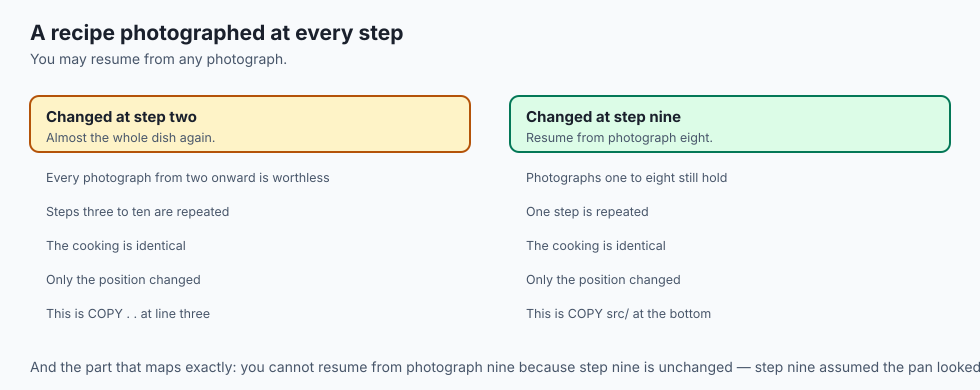

Think of a recipe where each step is photographed, and you may resume from any photograph rather than starting over.

Yesterday you made the dish. Today one ingredient changed. If the changed ingredient goes in at step two, every photograph from step two onward is worthless and you cook almost the whole dish again. If it goes in at step nine, you resume from photograph eight.

The cooking is identical. The **order** decides how much you repeat.

And the part that maps most exactly: you cannot resume from photograph nine just because step nine is unchanged. Step nine assumed the pan looked like photograph eight. If eight is gone, nine is gone, regardless of its own ingredients.

That is the whole cache rule, and it is why a Dockerfile is written expensive-and-stable first, cheap-and-volatile last.

## Examples in practice

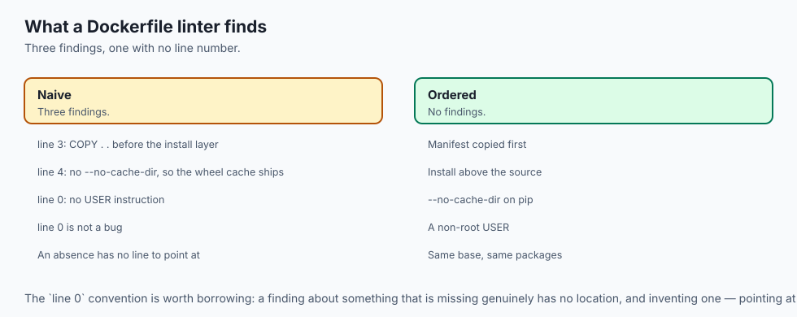

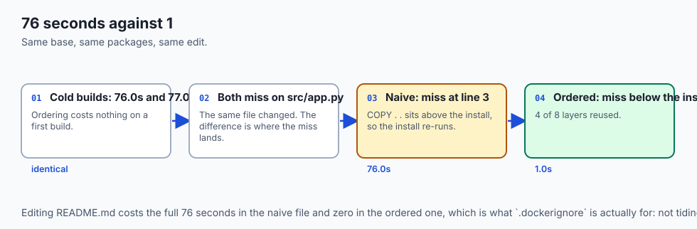

Here is the measured output from today's lab. Two Dockerfiles build the same application from the same base image with the same packages. One line of source code changed.

```text
--- naive: COPY . . then install ---
  cold build   0/6 layers cached  rebuild 76.0s
  after edit   2/6 layers cached  rebuild 76.0s
  first miss   line 3: COPY . .
               reads changed file(s): src/app.py
--- ordered: manifest, install, then source ---
  cold build   0/8 layers cached  rebuild 77.0s
  after edit   4/8 layers cached  rebuild 1.0s
```

**76 seconds against 1.** Both miss on the same file — `src/app.py`. The difference is *where* the miss happens. In the naive file `COPY . .` sits above the install, so the install is downstream and re-runs. In the ordered file the install sits above the copy and is reused.

Read the cold builds too, because that is the part that makes this an easy decision: 76.0s and 77.0s. Ordering the instructions costs nothing on a first build and returns the entire install on every build after it.

```text
--- lint: naive ---
  line  3 [copy-before-install] COPY . . before the install layer
  line  4 [pip-cache-kept]      no --no-cache-dir, so the wheel cache ships
  line  0 [runs-as-root]        no USER instruction
--- lint: ordered ---
  no findings
```

`line 0` is not a bug. The finding is about the *absence* of an instruction, and an absence has no line to point at.

One more result worth knowing, because it surprises people: editing `README.md` costs the full 76 seconds in the naive Dockerfile and zero in the ordered one. `COPY . .` reads the README as readily as the source. That is what `.dockerignore` is actually for — not tidiness, but keeping irrelevant files out of the thing that decides your cache.

## Implications: security, privacy, performance, scalability, and cost

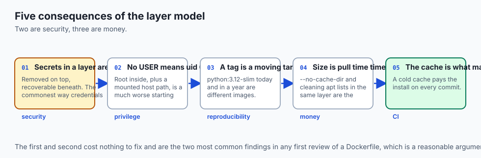

**Security.** Every layer is kept. `COPY .env .` followed by `RUN rm .env` produces an image where the secret is invisible in the final filesystem and fully recoverable with `docker save` and `tar`. This is the most common way credentials reach a public registry. Never copy the secret; use `.dockerignore`, a build secret, or a runtime variable.

**Privilege.** Without `USER`, the process runs as uid 0 inside the container. Combined with a mounted host path or a kernel escape, root inside is a much worse starting point than an unprivileged uid. One line fixes it.

**Reproducibility.** `FROM python:3.12-slim` is a moving target. Pin the tag, and pin the digest when a build must be reproducible months later.

**Performance and cost.** Image size is pull time, multiplied by every node that pulls it. `--no-cache-dir` on pip and removing the apt lists in the *same* layer are the two cheapest wins available.

**Scalability of the practice.** The cache rule is what makes CI affordable. A CI job with a cold cache pays the install on every commit; one with a warm cache and a correctly ordered Dockerfile pays it only when dependencies change.

## Alternatives: free, open source, and commercial

**Docker Engine** — Apache-2.0, the default, and the one every tutorial assumes. Docker Desktop is the commercial packaging and has licence conditions for larger companies; the engine itself does not.

**Podman and Buildah** — Red Hat's daemonless, rootless alternatives. They read the same Dockerfiles and produce the same OCI images. `podman` is close enough to a drop-in that aliasing it usually works.

**BuildKit** — now the default Docker builder. Parallel stages, build secrets that never enter a layer, and cache mounts that persist a package cache across builds without shipping it.

**Nix and Bazel** — reproducible builds taken seriously, at the cost of a much steeper learning curve. Worth it when byte-identical rebuilds matter.

**Buildpacks** — no Dockerfile at all; the platform detects your stack and builds an image. Convenient, and the trade is that you no longer control layer order — which, as today shows, is the thing that decides your build time.

The honest default: a hand-written Dockerfile with BuildKit, ordered manifest-first.

## Comparison with related concepts

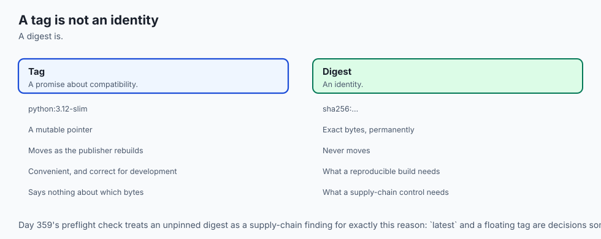

**Container versus virtual machine.** A VM brings its own kernel and boots in seconds; a container shares the host kernel and starts in milliseconds. The VM boundary is stronger; the container boundary is cheaper.

**Image versus container.** The image is the inert filesystem; the container is a process running against a writable layer on top of it. Deleting a container does not delete the image.

**Layer cache versus dependency cache.** The layer cache reuses whole filesystem diffs. A pip or npm cache lives *inside* a layer. BuildKit cache mounts let you keep the second without shipping it in the image — a distinction worth knowing once builds get slow.

**Tag versus digest.** A tag is a mutable pointer; a digest identifies exact bytes. `:3.12-slim` is a promise about compatibility, not identity.

## When to use it — and when not to

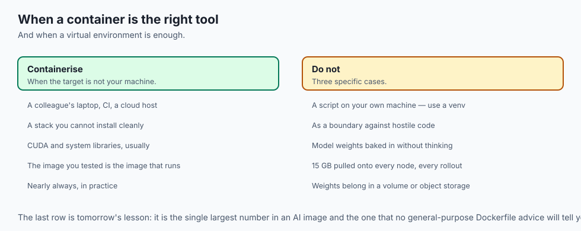

**Use a container when the target machine is not yours** — a colleague's laptop, CI, a cloud host. This is nearly always.

**Use one to pin a stack you cannot install cleanly**, which is the usual case with CUDA and system libraries.

**Do not reach for one to run a script on your own machine.** A virtual environment is smaller, faster and enough.

**Do not treat it as a security boundary against hostile code.** Shared kernel. For untrusted workloads you want a VM boundary — gVisor, Firecracker, or an actual VM.

**Do not put the model weights in the image without thinking.** A 15 GB image is 15 GB pulled onto every node, every rollout. Weights usually belong in a volume or object storage, fetched at start.

## The AI connection

- **AI images are where cache ordering hurts most.** A `pip install torch` layer is
  minutes, not seconds, so a `COPY . .` above it costs a coffee break per edit.

- **Model weights turn a size problem into a rollout problem.** A 15 GB image is
  15 GB pulled onto every node, on every deploy — tomorrow's lesson in full.

- **Reproducibility matters more for training than for serving.** A moving base
  image quietly changes a CUDA or BLAS version, and the result is different numbers.

- **The layer that never disappears is the AI-specific footgun**: a `COPY` of a
  dataset or an `.env` with an API key is recoverable from the image forever.

- **`cuda-devel` versus `cuda-runtime` is a cache-and-size decision** you make once
  in a Dockerfile and pay for on every pull thereafter.

## Knowledge check

1. Why does editing one Python file re-run `pip install` in a Dockerfile that begins `COPY . .`?
2. A layer's own inputs are unchanged, but it still rebuilds. Why?
3. Why do the two Dockerfiles in the lab take almost the same time on a *cold* build, and what does that tell you about the cost of adopting the better order?
4. Why is a secret that you `COPY` and then `RUN rm` still readable in the image?
5. Why does the linter report `runs-as-root` at line 0?

## Hands-on exercise

You will build a Dockerfile parser, a model of the layer cache, and a linter — then measure what one edit costs under two instruction orders.

Open `starter/layer_cache.py` in the lab directory and implement the stubbed functions, then run the tests. Docker is not required.

### Expected output

Running `python3 examples/cache_demo.py` compares two Dockerfiles after one source edit:

```text
--- the cost of one edit ---
  naive 76.0s vs ordered 1.0s
  ordering the same instructions is 76x faster to rebuild
```

Same base image, same packages, same application, different order.

### Validate your work

Run `bash tests/run_tests.sh`. All twenty-eight tests must pass.

Then check three things by inspection. The two **cold** builds must be within a few seconds of each other — if reordering appears to speed up a first build, the model is skipping layers it should run. Editing `README.md` must cost nothing in the ordered Dockerfile and the full install in the naive one. And changing `requirements.txt` must re-run the install in **both**, because there the install genuinely does depend on what changed.

### Troubleshooting

**Everything after the first miss is still marked cached.** That is the rule the lab exists for — set a flag on the first miss and carry it down.

**The two Dockerfiles rebuild identically.** Your path matcher does not treat `.` as covering every file, so `COPY . .` looks harmless.

**A continuation becomes several instructions.** Accumulate while a line ends with a backslash; emit only when it does not.

**`apt-cache-kept` fires on a Dockerfile that does clean up.** The cleanup must be in the same `RUN` — check the continuation was joined.

### Common mistakes

Numbering instructions rather than lines, so the linter sends you to the wrong place.

Treating the last token of a `COPY` as a source; it is the destination.

Using a substring test for path matching, so `src` matches `not-src/app.py`.

Assuming reordering is a trade-off. It is not — the cold builds prove it is free.

## Practice assignment

Add **`.dockerignore` support**. Give `plan_build` a set of ignore patterns and exclude matching files from what a broad `COPY` reads.

Then measure how much of the naive Dockerfile's penalty it removes, and write a test pinning the answer. The result is instructive: ignoring `README.md`, `.git` and `__pycache__` helps, and the naive Dockerfile is still catastrophically slower than the ordered one, because the source files it must copy are exactly the files you edit. `.dockerignore` reduces accidental invalidation; only ordering removes the structural kind.

## Extension challenge

Model **multi-stage builds**, then check your model against reality.

Track stages by their `AS` name, and let `COPY --from=builder` depend on the builder stage's cache state rather than on the project files. Then answer with a test: if a source file changes, does the final stage rebuild when the builder stage did not?

If you have Docker or Podman installed, do the second half. Build both Dockerfiles for real, `touch` one source file, rebuild, and time it. Compare the measured ratio with the 76x the model predicts.

It will not match, and the ways it is wrong are the interesting part: BuildKit parallelises independent stages, your registry may already hold the layers, and the first `pip install` is dominated by network rather than CPU. A model you know the error bars on is worth considerably more than one you have never checked.
