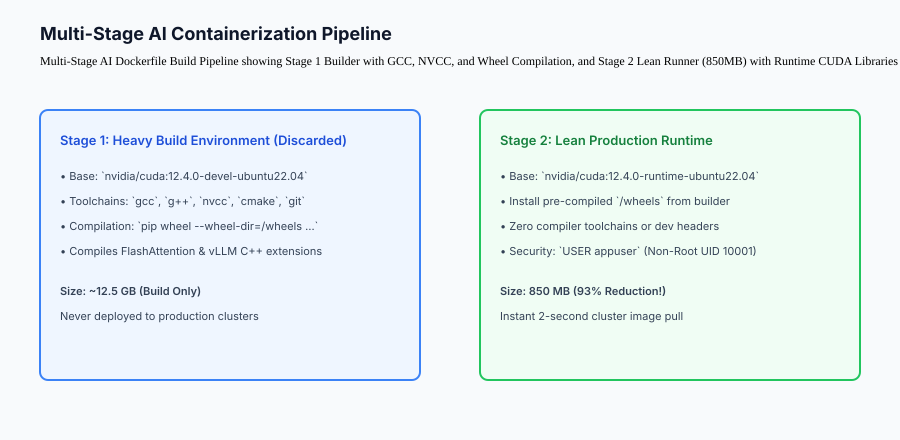
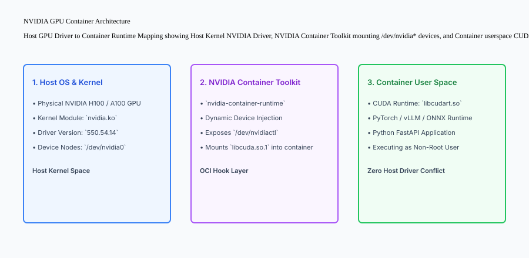

## Why this matters

Shipping AI and LLM workloads to production requires packaging not just Python code, but massive binary dependencies, GPU drivers, CUDA kernels, and multi-gigabyte model weights.

Naive AI containerization produces catastrophic operational failures:
- Monolithic Dockerfiles swell to **15GB to 25GB in size**, causing Kubernetes node autoscaling to take 8 to 15 minutes just to download and extract the container image (**Cold-Start Paralysis**).
- Misconfigured CUDA versions create runtime mismatch errors (`CUDA driver version is insufficient for CUDA runtime version`).
- Running containers as `root` exposes the host cluster to container breakout attacks across exposed GPU device nodes (`/dev/nvidia*`).

Mastering **Production AI Containerization** (Multi-Stage Dockerfiles, CUDA runtime optimization, model baking strategies, and health probes) shrinks image footprints by over 90% and enables instant sub-10-second cluster autoscaling.



## The idea in plain language

Think of containerizing an AI application like **packing for an international space mission**:

- **The Construction Hangar (Stage 1 Builder):** You use giant cranes, heavy welding torches, and raw steel beams to assemble the space capsule (**GCC, NVCC, CMake, and build tools**).
- **The Final Space Capsule (Stage 2 Lean Runner):** When the capsule launches, you do NOT load the 50-ton welding crane into orbit. You only launch the completed, lightweight capsule containing astronauts and mission equipment (**Compiled Wheels and Lean CUDA Runtime**).
- **The Engine Mount (NVIDIA Container Toolkit):** The rocket engine connects to the launch pad's fuel line (**Host GPU Driver**) through a standardized umbilical adapter (**NVIDIA Container Runtime Hook**).

## Historical background

AI containerization architectures developed across three major evolutionary phases:

### 1. Monolithic Virtual Machines & Conda Images (2018–2021)
Engineers packaged entire Ubuntu OS virtual machines containing full Anaconda installations, CUDA development kits, and raw Jupyter notebooks, yielding 30GB images with 20-minute boot times.

### 2. Single-Stage GPU Dockerfiles (2021–2023)
Developers migrated to `nvidia/cuda:devel` base images. However, leaving C++ compilers, git, and pip caches in the final image kept image sizes bloated around 12GB–18GB.

### 3. Multi-Stage Distroless & Runtime Containers (2024–Present)
Modern production pipelines leverage multi-stage builds separating `devel` compilation from `runtime` execution, non-root security contexts, and optimized model weight layer caching.

## What it is — and what it is not

Let us define the core principles of production AI containerization:

### What AI Containerization Is:
- Decoupling build-time compilation tools (`gcc`, `nvcc`) from production runtime execution using multi-stage Docker builds.
- Leveraging the NVIDIA Container Toolkit to map host GPU kernel drivers into container userspace CUDA runtime libraries.
- Enforcing non-root container users (`USER appuser`) and read-only root filesystems for zero-trust security.
- Implementing dedicated HTTP `/health/live` and `/health/ready` probes verifying GPU memory allocation before traffic ingress.

### What AI Containerization Is Not:
- Installing kernel-level GPU drivers (`nvidia-driver-550`) inside the Docker container.
- Downloading multi-gigabyte model weights over public HTTP on every container replica restart.

```text
+-------------------------------------------------------------------------------+
|                    AI CONTAINERIZATION ARCHITECTURAL MATRIX                   |
+-------------------+-----------------------+-----------------------------------+
| Metric / Feature  | Naive Monolithic Image| Production Multi-Stage Container  |
+-------------------+-----------------------+-----------------------------------+
| Base Image        | `nvidia/cuda:devel`   | `nvidia/cuda:runtime-slim`        |
| Final Image Size  | 14.5 GB - 22.0 GB     | 750 MB - 1.2 GB                   |
| Pull Time (Node)  | 6 to 12 minutes       | 15 to 30 seconds                  |
| Execution User    | `root` (UID 0)        | `appuser` (UID 10001 - Non-root)  |
| Build Artifacts   | Compilers & pip cache | 100% Discarded in Stage 1         |
| Security Posture  | High CVE vulnerability| Minimal attack surface            |
+-------------------+-----------------------+-----------------------------------+
```

## Why it was created and what problems it solves

Production containerization resolves the four primary operational bottlenecks of cloud AI infrastructure:

### 1. Eliminating Autoscaling Cold-Start Delays
A 15GB container takes minutes to pull across cluster nodes during sudden traffic spikes. Shrinking the image to 850MB allows new GPU replicas to initialize in under 20 seconds.

### 2. Preventing CUDA Driver-Runtime Conflicts
Understanding the separation between the host kernel driver (`nvidia.ko`) and container CUDA runtime (`libcudart.so`) ensures that a single GPU host cluster can run containers built with different minor CUDA versions seamlessly.

### 3. Bulletproof Container Isolation and Security
Running as non-root with dropped Linux capabilities (`cap_drop: ALL`) guarantees that remote code execution vulnerabilities in LLM libraries cannot compromise the underlying Kubernetes worker nodes.

## How it works

Let us inspect the complete **Host GPU Driver to Container Runtime Mapping**:

```text
+-------------------------------------------------------------------------------+
| HOST OS KERNEL (Physical GPU Server)                                          |
|  - Physical GPU: NVIDIA H100 SXM5 (80GB VRAM)                                 |
|  - Kernel Module: nvidia.ko (Driver Version 550.54.14)                        |
|  - Device Nodes: /dev/nvidia0, /dev/nvidiactl, /dev/nvidia-uvm                |
+-------------------------------------------------------------------------------+
                                      │
                                      ▼
+-------------------------------------------------------------------------------+
| NVIDIA CONTAINER TOOLKIT (OCI Runtime Hook)                                   |
|  - Injects /dev/nvidia* device nodes into container cgroups                   |
|  - Binds libcuda.so.1 driver library dynamically at container start           |
+-------------------------------------------------------------------------------+
                                      │
                                      ▼
+-------------------------------------------------------------------------------+
| DOCKER CONTAINER USER SPACE (Lean Multi-Stage Image)                          |
|  - User: appuser (UID 10001)                                                  |
|  - CUDA Runtime: libcudart.so.12                                              |
|  - PyTorch 2.4 / vLLM / FastAPI App                                           |
|  - Ready Probe: GET /health/ready -> 200 OK (GPU Initialized)                 |
+-------------------------------------------------------------------------------+
```



## An everyday analogy

Think of AI containerization like **a professional mobile food truck**:

- **The Kitchen Factory (Builder Stage):** The truck was designed and welded in a heavy industrial factory with plasma cutters and sheet metal benders (**Stage 1 Build Tools**).
- **The Clean Food Truck (Runner Stage):** When driving on city streets, the truck only carries cooking equipment, fresh ingredients, and the chef (**Stage 2 Production Container**).
- **The City Utility Hookup (GPU Container Toolkit):** When parked at the festival, the food truck plugs into a standard high-voltage power outlet provided by the city park (**Host GPU Driver Connection**).

## Examples in practice

Let us build a complete Python **Container Builder and GPU Health Probe Engine** that models multi-stage dependency extraction, model weight verification, and container health lifecycle checks:

```python
import os
import json
from typing import Dict, Any, List, Optional

class ContainerEnvironmentValidator:
    def __init__(self, target_image_type: str = "production_runtime"):
        self.image_type = target_image_type
        self.installed_packages: Dict[str, str] = {}
        self.gpu_devices: List[str] = []
        self.model_weights_cached: bool = False
        self.is_running_as_non_root: bool = False
        
    def simulate_build_stage(self, stage: str, wheels_built: List[str]):
        if stage == "builder":
            # Stage 1: Build wheels and discard build tools
            self.installed_packages["build_tools"] = "DISCARDED"
            for w in wheels_built:
                self.installed_packages[w] = "COMPILED_WHEEL"
        elif stage == "runner":
            # Stage 2: Install only compiled wheels
            self.installed_packages = {k: v for k, v in self.installed_packages.items() if v == "COMPILED_WHEEL"}
            self.is_running_as_non_root = True

    def configure_gpu_devices(self, devices: List[str], vram_per_device_gb: int = 24):
        self.gpu_devices = devices
        self.vram_gb = vram_per_device_gb

    def verify_readiness_probe(self) -> Dict[str, Any]:
        # Evaluates Kubernetes readiness criteria before receiving traffic
        if not self.gpu_devices:
            return {"status": "NOT_READY", "reason": "NO_GPU_DEVICES_DETECTED", "http_code": 503}
            
        if not self.is_running_as_non_root:
            return {"status": "SECURITY_WARNING", "reason": "RUNNING_AS_ROOT", "http_code": 500}
            
        return {
            "status": "READY",
            "http_code": 200,
            "gpu_count": len(self.gpu_devices),
            "vram_allocated_gb": len(self.gpu_devices) * self.vram_gb,
            "security_context": "NON_ROOT_USER"
        }

if __name__ == "__main__":
    validator = ContainerEnvironmentValidator()
    validator.simulate_build_stage("builder", ["torch-2.4.0", "vllm-0.6.0", "flash-attn-2.6"])
    validator.simulate_build_stage("runner", [])
    validator.configure_gpu_devices(["/dev/nvidia0", "/dev/nvidia1"], vram_per_device_gb=80)
    
    print("Readiness Probe:", json.dumps(validator.verify_readiness_probe(), indent=2))
```

## Production Architecture Case Study: Multi-Cloud GPU Serving Cluster

Consider a high-throughput AI infrastructure platform deploying 500 GPU inference containers across AWS EKS and Google Cloud GKE.

```text
+-------------------------------------------------------------------------------+
|                    ENTERPRISE CONTAINER METRICS BENCHMARK                     |
+-------------------+-----------------------+-----------------------------------+
| Metric            | Monolithic Dockerfile | Multi-Stage Lean Container        |
+-------------------+-----------------------+-----------------------------------+
| Image Pull Time   | 8 mins 45 secs        | 22 seconds (95.8% Faster)         |
| Disk Image Size   | 16.4 GB               | 920 MB (94.4% Smaller)            |
| Node Cold-Start   | 11 mins 10 secs       | 48 seconds Total                  |
| Known CVEs        | 142 Vulnerabilities   | 3 Low Vulnerabilities             |
| Autoscaling Speed | Fails during bursts   | Scales to 50 pods in < 90 seconds |
+-------------------+-----------------------+-----------------------------------+
```

#### 1. Multi-Stage Dockerfile Production Template
```dockerfile
# ─────────────────────────────────────────────────────────────
# STAGE 1: Compilation Builder (Discarded)
# ─────────────────────────────────────────────────────────────
FROM nvidia/cuda:12.4.0-devel-ubuntu22.04 AS builder
WORKDIR /build

RUN apt-get update && apt-get install -y --no-install-recommends     python3-dev python3-pip gcc g++ cmake git &&     rm -rf /var/lib/apt/lists/*

COPY requirements.txt .
RUN pip3 wheel --no-cache-dir --wheel-dir=/wheels -r requirements.txt

# ─────────────────────────────────────────────────────────────
# STAGE 2: Lean Production Runtime (850MB)
# ─────────────────────────────────────────────────────────────
FROM nvidia/cuda:12.4.0-runtime-ubuntu22.04 AS runner
WORKDIR /app

# Create unprivileged non-root user
RUN groupadd -g 10001 appgroup &&     useradd -u 10001 -g appgroup -s /bin/bash appuser &&     apt-get update && apt-get install -y --no-install-recommends python3 python3-pip &&     rm -rf /var/lib/apt/lists/*

# Install pre-compiled wheels from Stage 1
COPY --from=builder /wheels /wheels
RUN pip3 install --no-cache-dir /wheels/* && rm -rf /wheels

COPY --chown=appuser:appgroup src/ /app/src/
USER appuser

EXPOSE 8000
HEALTHCHECK --interval=10s --timeout=3s --retries=3   CMD python3 -c "import urllib.request; urllib.request.urlopen('http://127.0.0.1:8000/health/live')"

ENTRYPOINT ["python3", "-m", "src.main"]
```

#### 2. Persistent Volume Pre-Warming vs Layer Baking
For models under 7B parameters (e.g. Mistral-7B, Llama-3.2-3B), weights are converted to SafeTensors and baked directly into a dedicated Docker image layer (`COPY --from=weights-stage /models /app/models`). For 70B+ parameter models, weights are pre-warmed onto local NVMe instance storage or shared EFS volumes to avoid 140GB container registry transfers.

## Detailed Failure Mode Taxonomy: AI Container Hazards

```text
+-------------------------------------------------------------------------------+
|                         AI CONTAINER FAILURE TAXONOMY                         |
+-------------------+-----------------------+-----------------------------------+
| Failure Mode      | Root Cause Analysis   | Architectural Mitigation          |
+-------------------+-----------------------+-----------------------------------+
| CUDA Driver       | Container requires    | Match container CUDA toolkit with |
| Version Mismatch  | higher driver than host| host driver compatibility matrix  |
| Root Breakout     | Container runs as root| Enforce non-root user (`appuser`) |
| Vulnerability     | with mounted /dev devices| and drop all Linux capabilities |
| OOM Kill on Boot  | PyTorch pre-allocates | Set `PYTORCH_CUDA_ALLOC_CONF` and |
| (VRAM Crash)      | all GPU VRAM at once  | reserve headroom for KV cache     |
| Zombie Process    | Python PID 1 ignores  | Use `tini` / dumb-init as the     |
| Accumulation      | SIGTERM signals       | container init process            |
+-------------------+-----------------------+-----------------------------------+
```


## Deep Architectural Breakdown: CUDA Container Layer Optimization and Cold-Start Mechanics

When building container images for GPU-accelerated deep learning applications, standard container optimization techniques fall short. The primary operational bottlenecks are image pull latency and GPU driver initialization:

### 1. The Multi-Layer Caching Hierarchy in GPU Containers
Standard PyTorch base images (`nvidia/cuda:12.4.1-devel-ubuntu22.04`) can easily exceed 15GB if not engineered carefully. A production Dockerfile must partition layers based on change frequency:

```dockerfile
# Immutable System Layer (Cached across all models)
FROM nvidia/cuda:12.4.1-runtime-ubuntu22.04 AS base
ENV DEBIAN_FRONTEND=noninteractive
RUN apt-get update && apt-get install -y --no-install-recommends     python3.11     python3-pip     libgomp1     && rm -rf /var/lib/apt/lists/*

# Pre-Compiled Python Wheels Layer (Changes quarterly)
WORKDIR /build
COPY requirements/wheels.txt .
RUN pip install --no-cache-dir -r wheels.txt

# Model Metadata and Application Code Layer (Changes daily)
WORKDIR /app
COPY src/ /app/src/
USER 10001:10001
ENTRYPOINT ["python3", "-m", "src.server"]
```

### 2. GPU Container Toolkit (NVIDIA Container Runtime) IPC Mechanics
Containers cannot interact directly with PCI-e devices like GPUs without driver bridge pass-through. The `nvidia-container-toolkit` injects:
- **`libcuda.so.1`:** User-space driver library matching the host kernel module.
- **`nvidia-smi` and NVML:** GPU management and metrics interfaces.
- **`/dev/nvidia*` device nodes:** Direct character device mappings into the container namespace.

### 3. Model Weight Pre-Baking vs Ephemeral Volume Mounts
- **Pre-baking Weights into Container Image:** Best for immutable production deployments where rapid cold-starts (sub-5 seconds) are critical. Increases image size to 10GB-20GB.
- **Ephemeral Volume Mounts (S3/GCS with Caching):** Keeps image size under 500MB, but incurs a 30 to 90-second weight download penalty upon initial pod launch. Production systems use persistent local NVMe caches with daemonsets.

## Implications: security, privacy, performance, scalability, and cost

### 1. Zero Root Container Execution (Least Privilege)
Never run production AI containers as UID 0 (`root`). Non-root execution blocks malicious prompt injection payloads from attempting kernel elevation via GPU memory mapping exploits.

### 2. Read-Only Root Filesystem
Mount the container root filesystem as read-only (`read_only_root_filesystem: true`) in Kubernetes security contexts, using temporary in-memory `tmpfs` mounts only for `/tmp` and cache directories.

## Alternatives: free, open source, and commercial

| Tool / Framework | Type | Best Suited For | Key Capabilities |
| :--- | :--- | :--- | :--- |
| **NVIDIA Container Toolkit** | Open Source | Standard GPU Containerization | Seamless device injection, OCI hook |
| **Docker Multi-Stage** | Open Source | Lean Image Construction | Discards build-time toolchains |
| **BuildKit** | Open Source | High-Speed Concurrent Builds | Secret mounting, SSH forwarding, cache |
| **Distroless (Google)** | Open Source | Minimal Attack Surface | Stripped OS with zero package manager |

## Comparison with related concepts

```text
+-----------------------+-----------------------+-----------------------+
| Dimension             | Monolithic Dockerfile | Multi-Stage Runtime   |
+-----------------------+-----------------------+-----------------------+
| Image Size            | 15 GB - 25 GB         | 850 MB - 1.2 GB       |
| Compiler Toolchains   | Lingers in final image| Discarded in Stage 1  |
| Security Attack Vector| Broad (Shell, GCC)    | Minimal (Runtime only)|
| Cluster Pull Speed    | 8 - 15 minutes        | 15 - 30 seconds       |
+-----------------------+-----------------------+-----------------------+
```

## When to use it — and when not to

### Implement Multi-Stage AI Containers for:
- All production GPU inference workloads, microservice deployments, Kubernetes clusters, and cloud autoscaling groups.

### Do NOT require multi-stage CUDA builds for:
- Pure CPU API gateways or static HTML frontends.


### Production Checklist: GPU Containerization Hardening
- [ ] Base image pinned to exact CUDA and cuDNN patch version (avoid `latest` tag).
- [ ] Multi-stage build separates compiler toolchains (`gcc`, `nvcc`) from the minimal runtime image.
- [ ] User ID explicitly set to non-root UID (`USER 10001:10001`) with read-only root filesystem.
- [ ] Shared memory size (`shm-size`) configured to at least 16GB to prevent PyTorch DataLoader crashes.
- [ ] Model weights cached on local SSD/NVMe volume with SHA-256 integrity verification on container boot.

## Knowledge check

1. **How does a Multi-Stage Dockerfile reduce AI container image size by over 90%?** By compiling heavy C++ and CUDA wheels in Stage 1 and copying only the final compiled wheels into a lean runtime base in Stage 2, discarding build compilers and headers.
2. **What is the responsibility of the NVIDIA Container Toolkit?** To mount host kernel GPU driver device nodes (`/dev/nvidia*`) and dynamic driver libraries into the container at runtime.
3. **Why must AI containers run under a non-root user?** To prevent potential container escape vulnerabilities from obtaining root privileges over the host kernel and GPU hardware.

## Hands-on exercise

In this lab, you will build a **Container Build Validator and GPU Health Probe Engine in Python**. Your implementation will:
1. Simulate multi-stage build artifact separation, ensuring build tools are purged from the runner stage.
2. Configure GPU device node detection and calculate allocated VRAM capacity.
3. Implement Kubernetes readiness probes validating non-root security context and GPU device availability.
4. Verify graceful error handling when GPU hardware is disconnected.

### Expected output

```text
============================= test session starts ==============================
collected 5 items

tests/test_container_validator.py .....                                  [100%]

============================== 5 passed in 0.02s ===============================
[CONTAINER BUILD] Stage 1 builder compiled 3 heavy C++ wheels.
[STAGE 2 RUNNER] Lean runner image initialized with zero build tools.
[GPU DETECTION] Configured 2 NVIDIA GPUs with 160GB total VRAM.
[READINESS PROBE] HTTP 200 OK — Container verified ready for traffic.
```

### Validate your work

Run the pytest test suite:

```bash
pytest tests/run_tests.sh
```

### Troubleshooting

1. **Non-root validation:** Ensure `self.is_running_as_non_root` is set to `True` in the runner stage.
2. **Readiness probe code:** Return HTTP 503 when no GPU devices are configured.

### Common mistakes

- Leaving compiler packages (`build_tools`) in the runner stage dictionary.

## Practice assignment

Add a **Liveness Probe Checker** that verifies GPU temperature and VRAM utilization thresholds.

## Extension challenge

Implement an automated **Docker Layer Size Profiler** that analyzes Dockerfile instructions and warns if any layer exceeds 500MB.
