## Why this matters

Yesterday you learned the rule that decides how long a build takes. Today the question is what ends up *inside* the image, and it is a different problem with a different answer.

Almost every guide to writing a good Dockerfile was written for web applications. Its advice is correct and it is aimed at the wrong target. In a web image the biggest thing is the framework, so a multi-stage build that drops the compiler is a large win. In an AI image the biggest thing is usually the model, and no amount of multi-stage discipline touches it.

Here is the measurement from today's lab, on one service packaged three ways:

```text
multi-stage       21128 ->  18053 MB  (3075 MB, 1.17x)
mount the weights 18053 ->   4553 MB  (13500 MB, 3.97x)
```

The famous optimisation buys 1.17×. The one nobody mentions buys 3.97×. Both are worth doing, and if you only do the famous one you have taken the smaller half and probably believe you are finished.

That matters because image size is not a disk-space problem. A rollout pulls the image onto every node, so 21 GB across twenty nodes is four and a half hours of pulling before anything serves traffic.

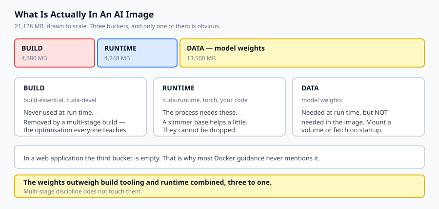

## The idea in plain language

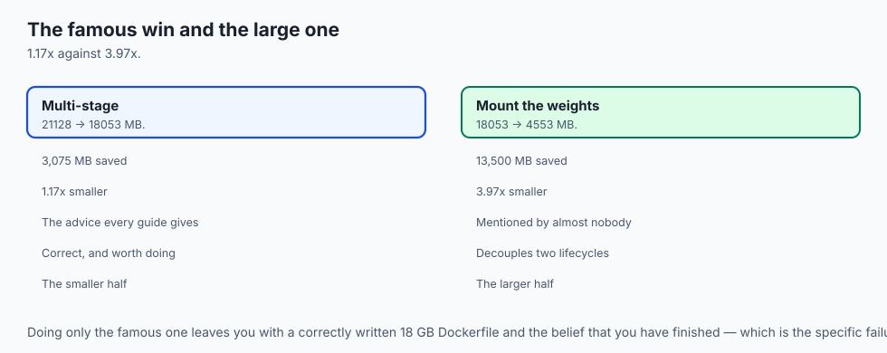

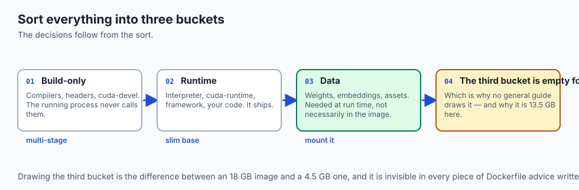

Sort everything that could be in your image into three buckets, and the decisions follow.

**Build-only.** Compilers, headers, `cuda-devel`, anything whose job is to *produce* something. The running process never calls them. These are removed by a **multi-stage build**: do the compiling in one stage, then start a fresh stage from a small base and copy just the artefacts across. The builder is discarded entirely.

**Runtime.** The interpreter, `cuda-runtime`, the framework, your code. The process genuinely needs these, so they ship. You can choose a slimmer base, but you cannot drop them.

**Data.** Model weights, embeddings, static assets. Needed at run time — but unlike runtime code, they do not have to live *in the image*. Mount a volume, or fetch from object storage on start.

That third bucket is the one people do not draw, because in a web application it is empty. Drawing it is the difference between a 18 GB image and a 4.5 GB one.

The reason it works is that weights change on a different schedule from code. Baking them in couples the two: ship a one-line fix and every node re-pulls thirteen gigabytes of unchanged floating point.

## Historical background

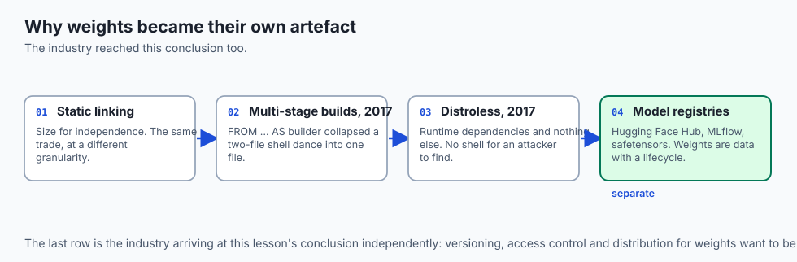

### Static linking and the fat binary

Long before containers, shipping software meant deciding what to bundle. A statically linked binary trades size for independence — the same trade an image makes, at a different granularity.

### Multi-stage builds, Docker 17.05 (2017)

Before them the standard trick was the "builder pattern": two Dockerfiles and a shell script that copied artefacts between them. `FROM ... AS builder` with `COPY --from=` collapsed that into one file, and slim runtime images became the default rather than an advanced technique.

### Distroless, 2017 onward

Google's distroless images contain an application's runtime dependencies and nothing else — no shell, no package manager. The size win is real and the security win is larger: an attacker who achieves execution finds no tools. The cost is that debugging a running container becomes genuinely hard.

### Model registries and weight formats

Hugging Face Hub, MLflow's model registry and formats like safetensors emerged because the industry converged on the same conclusion this lesson reaches: model weights are *data with a lifecycle of their own*, and they want versioning, access control and distribution separate from the code that loads them.

### The GPU base image problem

NVIDIA publishes `cuda:*-devel` and `cuda:*-runtime` variants precisely because the build/runtime split matters so much here — the devel image is roughly 4 GB against the runtime's 1.6 GB. That the vendor ships two images is the clearest possible signal about which one belongs in production.

## What it is — and what it is not

Dockerizing an AI application is deciding what belongs in the image, in which stage, and what belongs outside it entirely.

### What it is

It is **a sorting problem** first and a Dockerfile second. Get the three buckets right and the file writes itself.

It is **about deploy time**, not disk. Nobody minds a large file on a laptop; everybody minds a slow rollout.

It is **a licensing decision** when weights are involved. Pushing an image containing a model you may not redistribute is redistribution.

### What it is not

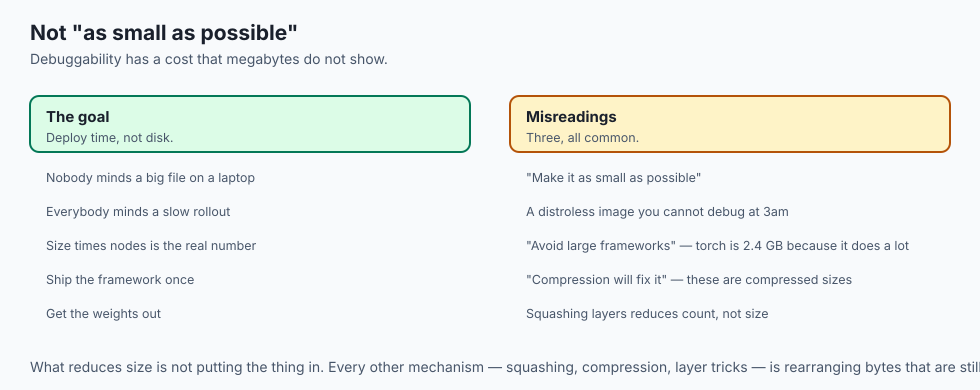

It is not "make the image as small as possible". A distroless image you cannot debug at 3am has costs that do not show up in megabytes.

It is not a reason to avoid large frameworks. Torch is 2.4 GB because it does a great deal; the answer is to ship it once, not to avoid it.

It is not solved by compression. The numbers here are already compressed sizes.

## Why it was created and what problems it solves

**Build toolchains in production images.** Hundreds of megabytes and a compiler for anyone who gets execution. *Solution: multi-stage builds.*

**Rollouts that take hours.** *Solution: get the image small enough that pulling it is not the dominant cost.*

**Code changes that force a weights re-pull.** *Solution: separate their lifecycles — weights on a volume or in object storage.*

**Images that cannot be shared because of what is inside them.** *Solution: keep licensed weights out, so the image can be public and the model private.*

**GPU images that are enormous for no reason.** *Solution: `cuda-runtime`, not `cuda-devel`, in the final stage.*

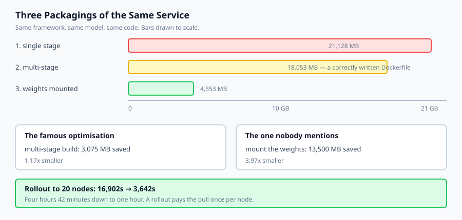

## How it works

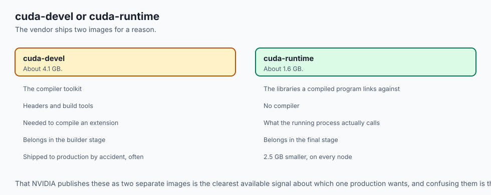

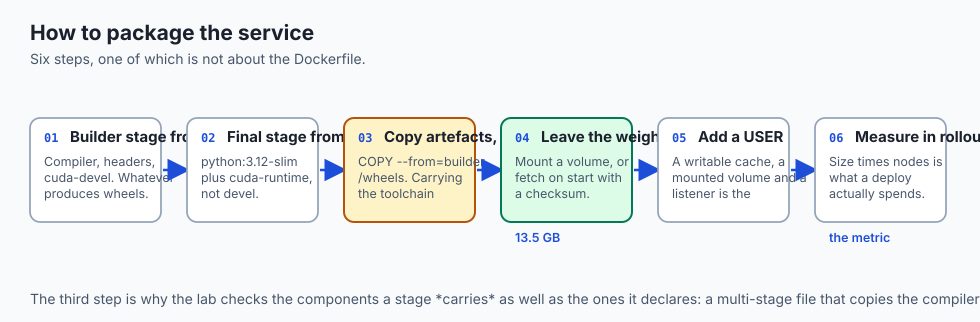

**Declare a builder stage from a full base.** It gets the compiler, the headers, `cuda-devel` — whatever is needed to produce wheels or compile an extension.

**Declare the final stage from a slim base.** `python:3.12-slim` plus `cuda-runtime`, not the devel package.

**Copy artefacts, not tooling.** `COPY --from=builder /wheels /wheels` then install from them. Copying the toolchain forward defeats the whole arrangement — which is why today's lab checks the *carried* components as well as the stage's own.

**Leave the weights out.** Mount a volume, or fetch on startup with a checksum. The image then contains the code that loads a model rather than the model.

**Add a `USER`.** An AI service typically has a writable cache directory, a mounted volume and a network listener. Root inside a container with a writable mount is the combination that turns an escape from theoretical into practical.

**Measure in rollout seconds, not megabytes.** Size × nodes is the number that a deploy actually spends.

## An everyday analogy

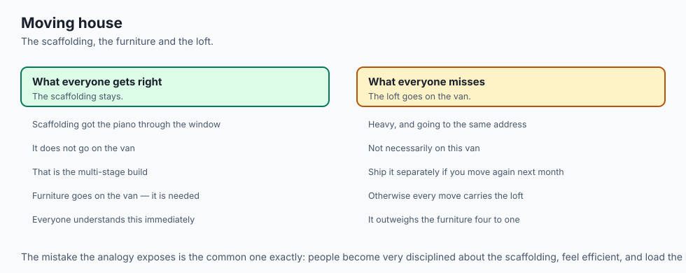

Think about moving house.

**Build-only** is the scaffolding used to get the piano through the window. You do not load it onto the van; you take it down and leave it behind. That is the multi-stage build, and everyone understands it immediately.

**Runtime** is the furniture. It goes on the van because you need it in the new house.

**Data** is the contents of the loft — heavy, and going to the same address, and *not necessarily on this van*. It can be shipped separately, and it should be if you are going to move house again next month, because otherwise every move carries the loft.

The mistake the analogy exposes is the common one: people become very disciplined about the scaffolding, feel efficient, and load the loft onto the van without noticing that it outweighs the furniture four to one.

## Examples in practice

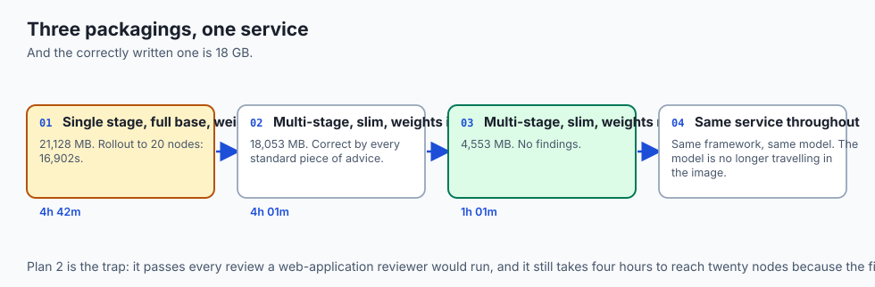

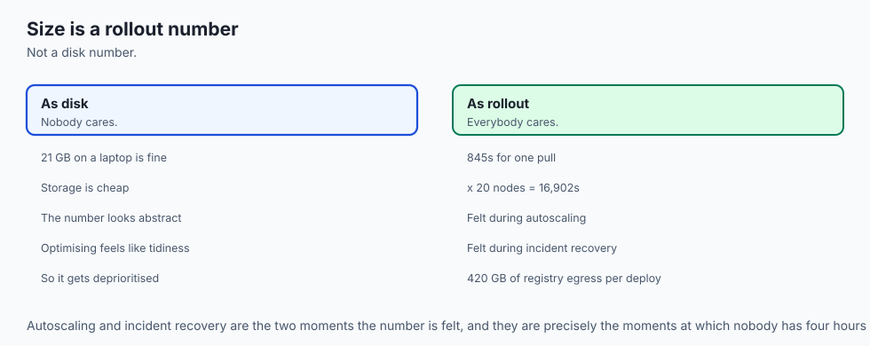

The measured output from today's lab, three packagings of one service:

```text
--- 1. single stage, full base, weights baked in ---
  image  21128 MB   one pull   845.1s   rollout to 20 nodes  16902.0s
  [build-tooling-shipped] saves 4380 MB
  [weights-baked-in]      saves 13500 MB
  [fat-base]              saves 295 MB
--- 2. multi-stage, slim runtime, weights baked in ---
  image  18053 MB   one pull   722.1s   rollout to 20 nodes  14442.0s
  [weights-baked-in]      saves 13500 MB
--- 3. multi-stage, slim runtime, weights mounted ---
  image   4553 MB   one pull   182.1s   rollout to 20 nodes   3642.0s
  no findings
```

Plan 2 is a *correctly written* Dockerfile by every standard piece of advice. Multi-stage, slim base, no build tooling. It is 18 GB, and a rollout to twenty nodes takes four hours.

The finding that remains is the one no web-application guide would have taught you to look for.

```text
  rollout to 20 nodes: 16902s -> 3642s
```

Four hours and 42 minutes to one hour and one minute. Same service, same framework, same model — the model is simply no longer travelling inside the container image.

Note also that plan 1 ships `cuda-devel` at 4.1 GB when the running process needs `cuda-runtime` at 1.6 GB. NVIDIA publishing those as two separate images is the vendor telling you which one production wants.

## Implications: security, privacy, performance, scalability, and cost

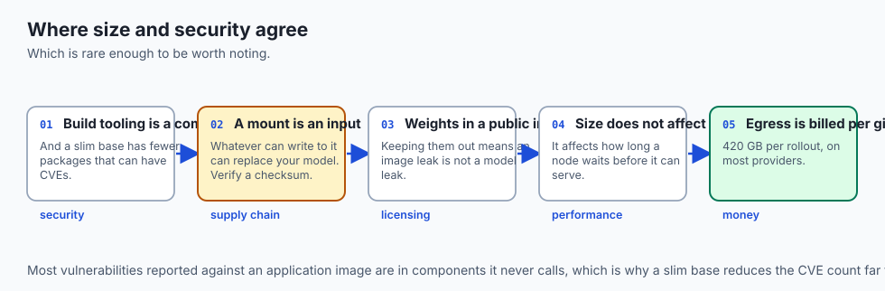

**Security.** The size and security arguments coincide here, which is rare. Build tooling in a runtime image is a compiler available to anyone who achieves execution. A slim base has fewer packages that can have CVEs — most vulnerabilities reported against an application image are in components it never calls.

**Supply chain.** Mounting weights makes the mount an input. Whatever can write to that volume can replace your model. Verify a checksum on load; Day 347 treats this properly.

**Privacy and licensing.** An image containing licensed weights, pushed to a public registry, is publication. Keeping weights out means an image leak is not a model leak.

**Performance.** Image size does not affect inference speed at all. It affects how long a node waits before it can serve, which is felt during rollouts, autoscaling events and incident recovery — precisely the moments you are least willing to wait.

**Cost.** Registry egress is billed per gigabyte on most providers. A 21 GB image pulled by twenty nodes on every deploy is 420 GB of egress per rollout.

## Alternatives: free, open source, and commercial

**Multi-stage Dockerfiles** — free, standard, and what this lesson assumes. The right default.

**Distroless base images** — Google's, Apache-2.0. Smaller still and no shell, which is excellent for security and painful the first time you need to debug a running pod.

**Chainguard Images** — hardened, minimal, continuously rebuilt against current CVEs. Free tier for many images, commercial for the full catalogue and support.

**`docker buildx` cache mounts and build secrets** — free and built in. A cache mount keeps the pip cache across builds without shipping it; a build secret makes a token available during a `RUN` without it entering any layer. Both solve problems people otherwise solve badly.

**Model registries** — Hugging Face Hub, MLflow, or plain object storage with versioned keys. This is where weights belong, and any of them beats baking the model in.

**Buildpacks** — no Dockerfile; the platform decides. Fine for a web service, and a poor fit here precisely because it will make the weights decision for you.

The honest default: a two-stage Dockerfile on a slim base with `cuda-runtime`, a non-root `USER`, and weights fetched at startup from versioned object storage with a checksum.

## Comparison with related concepts

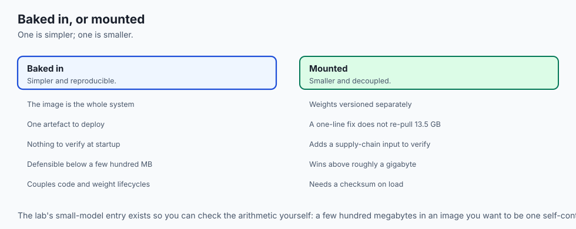

**Multi-stage build versus slim base.** Different mechanisms for different buckets. Multi-stage removes build-only components entirely; a slim base reduces what the runtime bucket costs. Doing one does not do the other.

**`cuda-devel` versus `cuda-runtime`.** Compiler toolkit versus the libraries a compiled program links against. About 4.1 GB versus 1.6 GB. Confusing them is the single most expensive mistake available in a GPU Dockerfile.

**Baked-in versus mounted weights.** Baked-in is simpler and reproducible: the image is the whole system. Mounted is smaller, decouples the lifecycles, and adds a supply-chain input to verify. For anything above a few hundred megabytes, mounted wins.

**Image size versus layer count.** Squashing layers reduces count and rarely reduces size much. What reduces size is not putting the thing in.

## When to use it — and when not to

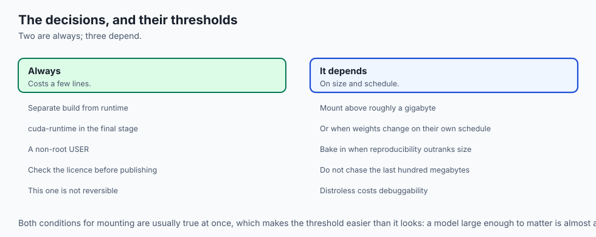

**Always separate build from runtime**, even for a small service. It costs a few lines and it is the difference between shipping a compiler and not.

**Mount the weights once the model is larger than roughly a gigabyte**, or once it changes on a different schedule from the code. Both are usually true at once.

**Bake them in when the model is small and reproducibility matters more than size** — an embedding model of a few hundred megabytes in an image you want to be a single self-contained artefact is a defensible choice, and the lab's `model-weights-small` entry exists to let you check the arithmetic.

**Do not chase the last hundred megabytes.** Once the weights are out, you are usually looking at a framework you cannot remove. Distroless will buy a little more and cost you debuggability.

**Do not put a model in a public image without checking its licence.** This is not an engineering decision and it is not reversible.

## The AI connection

- **The famous optimisation is the smaller half here.** Multi-stage buys 1.17x on
  an AI image; getting the weights out buys 3.97x, and no web guide mentions it.

- **Weights are data with their own lifecycle**, which is why Hugging Face Hub,
  MLflow's registry and safetensors all exist as separate things from the code.

- **A rollout is where image size is actually felt** — during autoscaling and
  incident recovery, precisely the moments nobody is willing to wait.

- **Licensing is an engineering constraint here.** Pushing an image containing
  weights you may not redistribute is redistribution, and it is not reversible.

- **A mounted volume is a supply-chain input.** Whatever can write to it can replace
  your model, which is why Day 347 asks for a checksum on load.

## Knowledge check

1. Why does a multi-stage build save so much less on an AI image than on a web application image?
2. What is the difference between `cuda-devel` and `cuda-runtime`, and which belongs in the final stage?
3. Why is image size a deployment problem rather than a disk-space problem?
4. Mounting weights makes the image far smaller. What does it add that you must then handle?
5. Why does copying a build *artefact* forward preserve the benefit of a multi-stage build, while copying the *toolchain* forward destroys it?

## Hands-on exercise

You will size an image from its stages, work out what is making it big, and convert the answer into rollout time.

Open `starter/image_plan.py` in the lab directory and implement the stubbed functions, then run the tests. Docker is not required and no weights are downloaded.

### Expected output

Running `python3 examples/image_demo.py` sizes three packagings of one service:

```text
--- what each change bought ---
  multi-stage       21128 ->  18053 MB  (3075 MB, 1.17x)
  mount the weights 18053 ->   4553 MB  (13500 MB, 3.97x)
  both              21128 ->   4553 MB  (16575 MB, 4.64x)
  rollout to 20 nodes: 16902s -> 3642s
```

The second line is four times the first. That is the finding.

### Validate your work

Run `bash tests/run_tests.sh`. All twenty tests must pass.

Then check three things by inspection. Only the final stage may count toward the size — if the builder's four gigabytes appear in the total, multi-stage will appear to buy nothing at all. An unknown component must contribute zero rather than raising, because naming a package the table does not know is a normal thing to do. And a `final_stage` that names no existing stage must raise `KeyError` rather than quietly using the first one.

### Troubleshooting

**Multi-stage appears to save nothing.** `ImagePlan.size_mb` is summing every stage. Only the final one ships.

**A clean plan produces a finding.** You are treating `cuda-runtime` as build tooling. It is runtime; only `cuda-devel` is build-only.

**`build-tooling-shipped` misses a case.** Check the carried list as well as the final stage's own components.

**Zero bandwidth crashes.** Return `0.0` rather than dividing.

### Common mistakes

Summing all stages, which silently destroys the entire multi-stage argument.

Confusing the CUDA devel and runtime packages — a 2.5 GB error in either direction.

Reporting savings in megabytes only. Multiply by the fleet; that is what people wait for.

Treating weights as immovable because they are needed at run time. Needed at run time and needed *in the image* are different claims.

## Practice assignment

Add **layer-level granularity**. Model each component as its own layer with an identity, and compute what a *rebuild* transfers when a registry already holds most of the layers.

Then write a test showing the case that matters: changing only `app-code` should transfer three megabytes, not the whole image. This is why the weights argument is even stronger in practice than the first-pull numbers suggest — a node that already has the weights layer does not re-pull it, but a node that has never seen the image does, and autoscaling creates new nodes precisely when you are busiest.

## Extension challenge

Take a **real AI service you have built** and put it through the review.

List every component with an honest purpose: `BUILD`, `RUNTIME` or `DATA`. The exercise is the sorting, not the arithmetic — and the interesting output is not the total. It is the one component you had never considered optional.

For most people that is either a dataset copied in "for testing", a set of `dev` dependencies that came along with the requirements file, or a model that could perfectly well be fetched at startup. Then compute what removing it would save across your actual node count, and decide whether you would have guessed the answer before measuring it.
