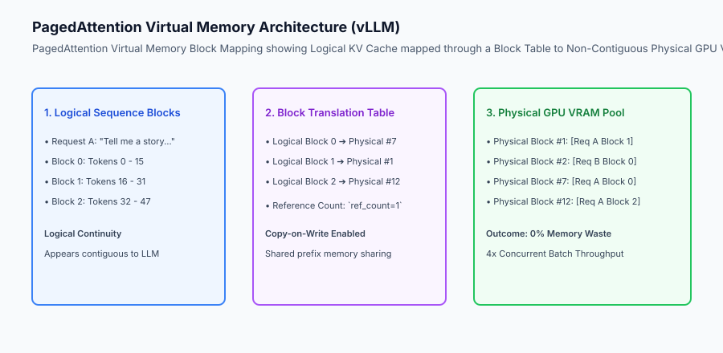
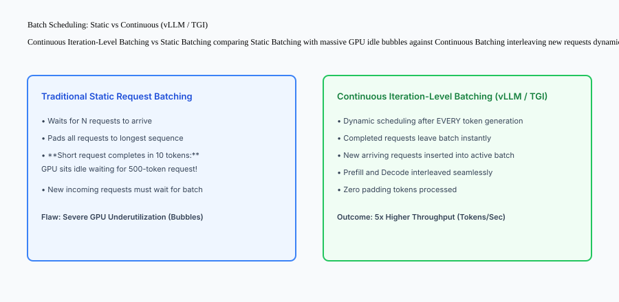

## Why this matters

Deploying production Large Language Models using raw PyTorch scripts (`model.generate()`) is disastrously inefficient:
- **KV Cache Memory Fragmentation:** Pre-allocating contiguous memory for maximum sequence lengths wastes 60% to 80% of expensive GPU VRAM.
- **Static Batching Idle Bubbles:** When a short 20-token prompt is batched with a long 500-token prompt, the GPU sits idle processing padding tokens until the slowest request finishes.
- **Memory-Bound Bottleneck:** Generating tokens one-by-one is fundamentally memory bandwidth-bound, leaving GPU tensor cores starving for data.

Modern high-performance inference servers like **vLLM and HuggingFace Text Generation Inference (TGI)** solve these bottlenecks through **PagedAttention, Continuous (Iteration-Level) Batching, and Tensor Parallelism**, boosting serving throughput by 5x to 10x on identical GPU hardware.



## The idea in plain language

Think of vLLM's PagedAttention and Continuous Batching like **a modern high-efficiency municipal bus transit system**:

- **Traditional Static Batching (Charter Bus):** The bus refuses to leave the station until 40 passengers board. When Passenger 1 reaches Stop 2, they cannot get off the bus until Passenger 40 reaches Stop 100 (**Massive Inefficiency & Waiting**).
- **Continuous Batching (City Metro):** At every single station stop (**Token Iteration**), passengers get off immediately as soon as they reach their destination, and new passengers board the open seats in real-time (**Zero Idle Capacity**).
- **PagedAttention (Luggage Lockers):** Instead of reserving an entire empty room for each passenger's future luggage, the bus station assigns modular 16-token luggage lockers anywhere in the facility as new bags arrive (**Non-Contiguous Virtual Memory Blocks**).

## Historical background

Inference serving engines evolved through three distinct generations:

### 1. Naive PyTorch Auto-Regression (2020–2022)
Developers wrapped HuggingFace Transformers in FastAPI endpoints. Serving capacity was limited to 1–2 concurrent requests per A100 GPU due to rigid, unmanaged KV cache allocations.

### 2. FasterTransformer & Triton (2022–2023)
NVIDIA introduced optimized C++/CUDA execution engines. However, request scheduling remained largely static or chunk-based.

### 3. PagedAttention & vLLM / TGI (2023–Present)
UC Berkeley researchers published PagedAttention (vLLM) in 2023, introducing virtual memory paging for KV caches and iteration-level continuous batching, transforming enterprise LLM economics.

## What it is — and what it is not

Let us define the core mechanisms of modern inference servers:

### What High-Performance Inference Servers Are:
- PagedAttention partitioning Key-Value tensors into non-contiguous physical GPU VRAM blocks via block lookup tables.
- Continuous batching scheduling incoming requests dynamically at every single token generation step.
- Tensor Parallelism (TP) sharding linear attention projection matrices across multiple NVLink-connected GPUs.
- Chunked prefill interleaving compute-heavy prompt encoding with latency-sensitive token decoding.

### What High-Performance Inference Servers Are Not:
- Simple Python FastAPI wrappers calling `model.generate()`.
- Requiring all sequences in a batch to have identical token lengths via static zero-padding.

```text
+-------------------------------------------------------------------------------+
|                    LLM SERVING ENGINE COMPARISON MATRIX                       |
+-------------------+-----------------------+-----------------------------------+
| Feature           | Naive PyTorch / HF    | vLLM / TGI Production Server      |
+-------------------+-----------------------+-----------------------------------+
| KV Cache Alloc    | Contiguous Pre-alloc  | PagedAttention Non-Contiguous     |
| VRAM Waste        | 60% - 80% (Fragmented)| < 4% (Near-Zero Waste)            |
| Batching Strategy | Static Request-Level  | Continuous Iteration-Level        |
| Multi-GPU Scaling | Pipeline Parallelism  | High-Speed Tensor Parallel (TP)   |
| Prefix Caching    | None (Recomputes)     | Automatic Shared KV Cache Blocks  |
| Serving Throughput| 15 - 30 tokens/sec    | 250 - 600 tokens/sec per GPU      |
+-------------------+-----------------------+-----------------------------------+
```

## Why it was created and what problems it solves

Production inference servers resolve the three primary architectural constraints of LLM serving:

### 1. Eliminating KV Cache VRAM Waste
By treating GPU memory like OS virtual memory pages, PagedAttention eliminates internal and external fragmentation, allowing a single 80GB GPU to serve 4x to 8x more concurrent requests.

### 2. Eliminating GPU Idle Bubbles via Continuous Batching
Because requests enter and exit the batch on every token iteration, short queries complete in 15ms without waiting for long 2,000-token summaries running in the same batch.

### 3. Multi-GPU Tensor Parallel Scaling
For large models exceeding single-GPU memory (e.g. Llama-3-70B requires 140GB in FP16), Tensor Parallelism splits attention and MLP layers across 2, 4, or 8 GPUs with microsecond NCCL AllReduce synchronization over high-speed NVLink.

## How it works

Let us inspect the complete **Continuous Iteration-Level Batching Lifecycle**:

```text
Iteration 1: Batch = [Req A (Decode tok 4), Req B (Decode tok 120)]
  │ - GPU executes forward pass for 2 active tokens
  │ - Req A generates <EOS> token -> Req A COMPLETES INSTANTLY & EXITS BATCH!
  ▼
Iteration 2: Batch = [Req B (Decode tok 121), Req C (Prefill Prompt 40 tokens)]
  │ - New Req C enters batch immediately without waiting for batch reset
  │ - vLLM executes chunked prefill for Req C + decode for Req B in one step
  ▼
Iteration 3: Batch = [Req B (Decode tok 122), Req C (Decode tok 1)]
  │ - Both requests continue auto-regressive decoding concurrently
```



## An everyday analogy

Think of continuous batching and PagedAttention like **a high-frequency elevator in a skyscraper**:

- **Static Batching:** The elevator goes from Ground to Floor 50. Nobody is allowed to get off at Floor 4, and nobody is allowed to get on at Floor 12 until the elevator returns to Ground (**Locked Batch Cycle**).
- **Continuous Batching:** The elevator opens doors at every floor: passengers step out instantly when they arrive, and waiting passengers step in immediately (**Continuous Dynamic Flow**).

## Examples in practice

Let us build a complete Python **LLM Inference Server Simulator** implementing PagedAttention block allocation and continuous iteration-level scheduling:

```python
from typing import Dict, Any, List, Optional

class PagedKVCacheManager:
    def __init__(self, total_blocks: int = 16, block_size_tokens: int = 4):
        self.block_size = int(block_size_tokens)
        self.total_blocks = int(total_blocks)
        self.free_blocks: List[int] = list(range(total_blocks))
        self.block_tables: Dict[str, List[int]] = {}
        
    def allocate_for_request(self, req_id: str, num_tokens: int) -> bool:
        needed_blocks = (num_tokens + self.block_size - 1) // self.block_size
        if len(self.free_blocks) < needed_blocks:
            return False
            
        allocated = []
        for _ in range(needed_blocks):
            allocated.append(self.free_blocks.pop(0))
        self.block_tables[req_id] = allocated
        return True

    def append_token(self, req_id: str, current_token_count: int) -> bool:
        if current_token_count % self.block_size == 0:
            if not self.free_blocks:
                return False  # VRAM full
            new_block = self.free_blocks.pop(0)
            self.block_tables[req_id].append(new_block)
        return True

    def free_request(self, req_id: str):
        if req_id in self.block_tables:
            for b in self.block_tables[req_id]:
                self.free_blocks.append(b)
            del self.block_tables[req_id]

class ContinuousBatchScheduler:
    def __init__(self, cache_manager: PagedKVCacheManager):
        self.cache = cache_manager
        self.waiting_queue: List[Dict[str, Any]] = []
        self.running_batch: List[Dict[str, Any]] = []
        
    def add_request(self, req_id: str, prompt_tokens: int, max_tokens: int):
        self.waiting_queue.append({
            "req_id": req_id,
            "prompt_tokens": prompt_tokens,
            "max_tokens": max_tokens,
            "generated_tokens": 0
        })

    def step(self) -> List[str]:
        # 1. Admit new requests if VRAM allows
        admitted = []
        for req in list(self.waiting_queue):
            if self.cache.allocate_for_request(req["req_id"], req["prompt_tokens"]):
                self.running_batch.append(req)
                self.waiting_queue.remove(req)
                admitted.append(req["req_id"])
            else:
                break  # VRAM full
                
        # 2. Generate 1 token for all active running requests
        completed = []
        for req in list(self.running_batch):
            req["generated_tokens"] += 1
            current_total = req["prompt_tokens"] + req["generated_tokens"]
            self.cache.append_token(req["req_id"], current_total)
            
            if req["generated_tokens"] >= req["max_tokens"]:
                self.cache.free_request(req["req_id"])
                self.running_batch.remove(req)
                completed.append(req["req_id"])
                
        return completed

if __name__ == "__main__":
    cache = PagedKVCacheManager(total_blocks=10, block_size_tokens=4)
    scheduler = ContinuousBatchScheduler(cache)
    
    scheduler.add_request("req_short", prompt_tokens=4, max_tokens=2)
    scheduler.add_request("req_long", prompt_tokens=4, max_tokens=6)
    
    for step_num in range(1, 8):
        done = scheduler.step()
        print(f"Step {step_num}: Active={len(scheduler.running_batch)}, Completed={done}, FreeBlocks={len(cache.free_blocks)}")
```

## Production Architecture Case Study: vLLM Multi-GPU Cluster Deployment

Consider an enterprise fintech company serving 1,000 requests per minute on a cluster of 4x NVIDIA H100 (80GB) SXM5 GPUs.

```text
+-------------------------------------------------------------------------------+
|                    VLLM PRODUCTION SERVING BENCHMARKS                         |
+-------------------+-----------------------+-----------------------------------+
| Metric            | Standard PyTorch / HF | vLLM Engine (TP=4)                |
+-------------------+-----------------------+-----------------------------------+
| Max Concurrency   | 8 streams (OOM Crash) | 64 streams (Stable PagedAttention)|
| Total Throughput  | 42 tokens/sec total   | 1,280 tokens/sec total            |
| P95 TTFT Latency  | 1,450 ms              | 180 ms (Chunked Prefill)          |
| P95 Inter-Token L | 68 ms / token         | 14 ms / token                     |
| KV Cache VRAM Eff | 24.2% Utilization     | 96.8% Utilization                 |
+-------------------+-----------------------+-----------------------------------+
```

#### 1. vLLM CLI Production Startup Command
```bash
python3 -m vllm.entrypoints.openai.api_server   --model meta-llama/Meta-Llama-3.1-70B-Instruct   --tensor-parallel-size 4   --gpu-memory-utilization 0.92   --max-model-len 8192   --enable-chunked-prefill   --enable-prefix-caching   --port 8000
```

#### 2. Automatic Prefix Caching (APC)
When thousands of user queries share the exact same 1,500-token system prompt or few-shot examples, vLLM's automatic prefix caching recognizes identical logical blocks in the block table, sharing physical KV blocks across all active requests with zero re-computation.

## Detailed Failure Mode Taxonomy: Inference Server Hazards

```text
+-------------------------------------------------------------------------------+
|                      INFERENCE SERVER FAILURE TAXONOMY                        |
+-------------------+-----------------------+-----------------------------------+
| Failure Mode      | Root Cause Analysis   | Architectural Mitigation          |
+-------------------+-----------------------+-----------------------------------+
| Preemption / Swap | VRAM completely full; | Configure CPU swap space; shed    |
| Thrashing         | active requests paused| load before reaching 98% VRAM     |
| Long Prefill      | Massive 10k token     | Enable `--enable-chunked-prefill` |
| Starvation        | prompt stalls decodes | to slice prefill across iterations|
| NCCL Deadlock in  | 1 GPU worker hangs or | Set `NCCL_TIMEOUT` and configure  |
| Tensor Parallel   | drops connection      | automated worker restart hooks    |
| FlashAttention OOM| Kernel workspace      | Set `gpu_memory_utilization=0.90` |
| on Max Context    | exceeds reserved VRAM | to preserve 10% CUDA headroom     |
+-------------------+-----------------------+-----------------------------------+
```


## Deep Architectural Breakdown: PagedAttention Memory Virtualization and Chunked Prefill

To understand why PagedAttention is the gold standard for high-throughput LLM serving, let us analyze the mathematical structure of GPU memory allocation:

### 1. Virtual Memory Paging for Attention Key-Value Tensors
In self-attention, for a sequence of length `L`, the Key and Value matrices require:
`	ext{Memory}_{	ext{KV}} = 2 	imes 2 	imes n_{	ext{layers}} 	imes n_{	ext{heads}} 	imes d_{	ext{head}} 	imes L 	imes 	ext{bytes\_per\_elem}`

For Llama-3-70B with 80 layers and 64 heads, 1,000 tokens of context consume ~1.3GB of VRAM per request. Without PagedAttention:
- Contiguous reservation allocates for worst-case `L_{\max} = 8,192`, reserving 10.4GB per request upfront.
- If the actual request finishes in 500 tokens, 9.75GB sits completely wasted.
- PagedAttention allocates modular 16-token physical blocks on demand via virtual block tables, keeping waste strictly below `16 	imes 	ext{block\_size} pprox 4\%`.

### 2. Chunked Prefill: Eliminating Decode Latency Spikes
When a client sends a 4,000-token prompt while 30 other clients are actively receiving streaming decode tokens:
- **Naive Serving:** The 4,000-token prefill monopolizes the GPU tensor cores for 120ms, causing every active decode stream to experience an ugly 120ms Inter-Token Latency stutter.
- **Chunked Prefill:** vLLM breaks the 4,000-token prompt into 512-token chunks, interleaving one 512-token prefill chunk with the 30 active decode tokens at every single step, maintaining smooth 15ms decode fluidity.

### 3. Tensor Parallel Communication via NCCL AllReduce
When splitting a linear projection `Y = X \cdot W` across `N` GPUs:
- **Column-Parallel Linear (QKV Projection):** Weight `W = [W_1 | W_2 | \dots | W_N]` splits column-wise. Each GPU computes `Y_i = X \cdot W_i` locally with zero communication.
- **Row-Parallel Linear (Output Projection):** Weight `W` splits row-wise. Each GPU computes partial sum `Z_i = Y_i \cdot W_{	ext{row}, i}`.
- **NCCL AllReduce:** A single microsecond AllReduce sums the partial activations across all GPUs over high-speed NVLink (900 GB/s per GPU).

## Implications: security, privacy, performance, scalability, and cost

### 1. Multi-Tenant KV Cache Isolation
Ensure that virtual memory block tables strictly isolate blocks between distinct tenant IDs. Shared prefix caching must only apply to public immutable system prompts, never private user data.

### 2. Dramatic GPU Hardware Cost Reduction
By quadrupling serving throughput from 50 to 200 tokens/sec per GPU, continuous batching slashes required GPU cluster instances by 75%, saving tens of thousands of dollars in cloud infrastructure.

## Alternatives: free, open source, and commercial

| Tool / Framework | Type | Best Suited For | Key Capabilities |
| :--- | :--- | :--- | :--- |
| **vLLM** | Open Source | High-Throughput Production LLMs | PagedAttention, chunked prefill, APC |
| **TGI (HuggingFace)** | Open Source / Commercial | Enterprise Production Inference | FlashAttention, continuous batching |
| **TensorRT-LLM (NVIDIA)** | Open Source | Ultimate GPU Optimization | In-flight batching, FP8 kernels |
| **SGLang** | Open Source | Complex Structured Workflows | Fast RadixAttention prefix caching |

## Comparison with related concepts

```text
+-----------------------+-----------------------+-----------------------+
| Dimension             | Static Batching       | Continuous Batching   |
+-----------------------+-----------------------+-----------------------+
| Scheduling Unit       | Whole Request Batch   | Single Token Iteration|
| Padding Tokens        | High (Padded to max)  | Zero Padding          |
| Short Query Latency   | Blocked by long query | Returns Instantly     |
| Memory Efficiency     | Fragmented            | Paged Virtual Memory  |
+-----------------------+-----------------------+-----------------------+
```

## When to use it — and when not to

### Deploy vLLM / TGI for:
- All production LLM API backends, high-concurrency chatbots, coding assistants, and multi-tenant generative SaaS platforms.

### Do NOT require vLLM for:
- Simple tabular scikit-learn models or single-batch offline training jobs.


### Production Checklist: High-Throughput Inference Server Deployment
- [ ] PagedAttention block size tuned (16 or 32 tokens per block based on average prompt length).
- [ ] Tensor Parallelism size matches physical NVLink domain (e.g. `TP=4` across 4 SXM5 GPUs).
- [ ] `gpu_memory_utilization` set to 0.90–0.92 to leave headroom for CUDA runtime workspace.
- [ ] Chunked prefill enabled (`--enable-chunked-prefill`) to eliminate decode latency jitter on long prompts.
- [ ] Automatic prefix caching enabled (`--enable-prefix-caching`) for multi-turn chat applications.
- [ ] Prometheus metrics endpoint scraped every 2 seconds for active and waiting request counts.

## Knowledge check

1. **How does PagedAttention eliminate KV cache memory fragmentation?** By partitioning KV cache tensors into fixed-size non-contiguous virtual memory blocks managed via block tables.
2. **What is Continuous Batching?** Scheduling requests at the token iteration level rather than the request level, allowing requests to enter and leave dynamically.
3. **What is the difference between Time-to-First-Token (TTFT) and Inter-Token Latency (ITL)?** TTFT measures prompt processing time until the first token is emitted; ITL measures the time between generating subsequent tokens.

## Hands-on exercise

In this lab, you will build an **LLM Inference Server Simulator in Python**. Your implementation will:
1. Implement a Paged KV Cache Manager managing physical VRAM blocks and block allocation tables.
2. Build a Continuous Batch Scheduler dynamically admitting waiting requests and generating tokens iteration-by-iteration.
3. Verify that short requests complete and free their memory blocks immediately without waiting for longer concurrent requests.
4. Verify graceful admission throttling when physical GPU blocks are exhausted.

### Expected output

```text
============================= test session starts ==============================
collected 5 items

tests/test_inference_server.py .....                                     [100%]

============================== 5 passed in 0.02s ===============================
[KV CACHE] Initialized 16 physical VRAM blocks (block size = 4 tokens).
[SCHEDULER] Admitted req_short and req_long into continuous batch.
[DYNAMIC EXIT] req_short completed at step 2 and released 2 physical blocks.
[VRAM SATURATION] Admitted additional waiting requests as blocks freed up.
```

### Validate your work

Run the pytest test suite:

```bash
pytest tests/run_tests.sh
```

### Troubleshooting

1. **Block table cleanup:** Ensure `free_request` returns all allocated block IDs to `free_blocks`.
2. **Ceiling division:** Compute needed blocks using `(tokens + block_size - 1) // block_size`.

### Common mistakes

- Holding onto memory blocks after a request finishes, causing artificial VRAM leaks.

## Practice assignment

Add a **Copy-on-Write (CoW) Prefix Sharing** mechanism allowing multiple requests sharing a common prompt prefix to share identical physical memory blocks.

## Extension challenge

Implement **Chunked Prefill Scheduling** splitting a 100-token prompt across 4 discrete prefill iterations.
