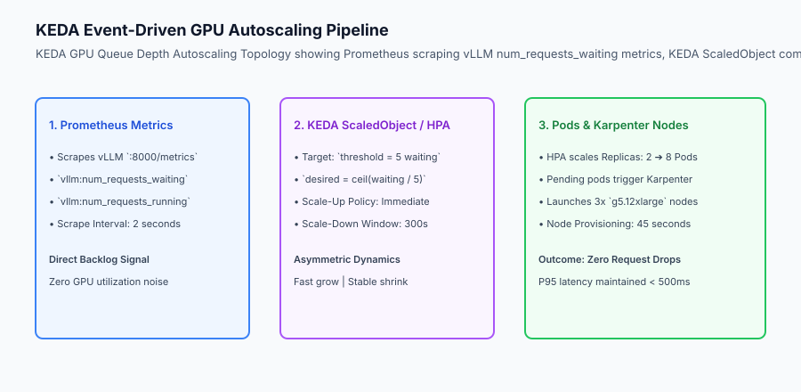
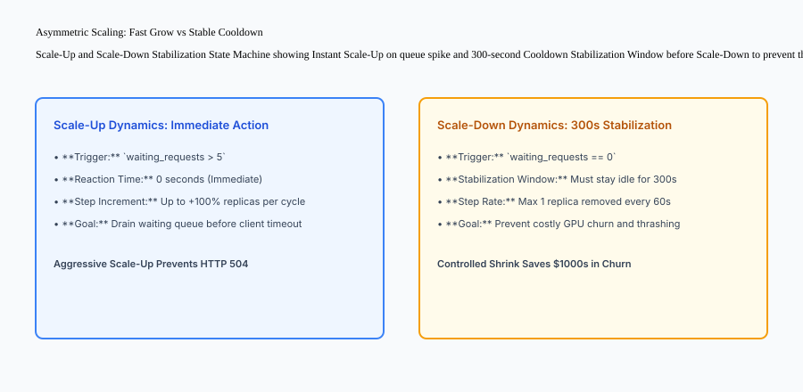

## Why this matters

Deploying LLMs in production without elastic autoscaling leads to a brutal economic dilemma:
- **Over-Provisioning:** Keeping 20 high-end GPU instances (NVIDIA H100 / A100) running 24/7 costs **`50,000 to `150,000 per month**, even when nighttime traffic drops to zero.
- **Under-Provisioning:** During morning traffic spikes, a fixed 4-GPU cluster quickly exhausts its KV cache blocks, causing inference queues to explode and triggering widespread HTTP 504 Gateway Timeouts.
- **Metric Failure:** Using traditional CPU or Memory metrics fails because a single streaming request can peg a GPU at 100% compute utilization while the server still has ample VRAM to accept 30 more concurrent streams.

Implementing **Event-Driven GPU Autoscaling with KEDA and Kubernetes** (scaling on vLLM `num_requests_waiting` queue depth, asymmetric stabilization windows, and Karpenter node provisioning) eliminates idle GPU waste while maintaining strict sub-500ms P95 latency SLAs.



## The idea in plain language

Think of GPU autoscaling like **managing checkout counters at a massive supermarket during the holidays**:

- **The Wrong Metric (Cashier Sweat Level / CPU Utilization):** Measuring how fast the cashier's hands are moving is useless. A cashier ringing up a single customer with 200 items is working at 100% capacity (**100% GPU Utilization**), but nobody is waiting behind them (**Queue Depth = 0**).
- **The Right Metric (Queue Length / Waiting Customers):** You look at how many customers are physically standing in line with full shopping carts (**`num_requests_waiting`**). If lines exceed 5 people per register, the manager immediately calls more cashiers to open new lanes (**KEDA Scale-Up**).
- **The Cooldown Rule (Stabilization Window):** When the line empties for 2 minutes, the manager does not fire the cashier immediately. They wait 10 minutes to ensure a new tour bus hasn't just pulled into the parking lot (**Scale-Down Stabilization**).

## Historical background

Autoscaling architectures for machine learning evolved across three generations:

### 1. Static Threshold CPU/Memory HPA (2018–2021)
Kubernetes scaled pods when CPU utilization exceeded 80%. This caused catastrophic scaling failures for GPU workloads because GPU compute kernels run asynchronously and CPU usage is largely decoupled from GPU inference saturation.

### 2. GPU Duty-Cycle Utilization Metrics (2021–2023)
Engineers used NVIDIA DCGM exporters (`DCGM_FI_DEV_GPU_UTIL`). However, because auto-regressive decoding keeps the GPU tensor cores active on even a single request, the metric read 100% continuously, offering zero visibility into actual queue backlogs.

### 3. Event-Driven Concurrency & Queue Depth Scaling (2024–Present)
Modern standards leverage KEDA and Prometheus to scale directly on inference server application metrics (`vllm:num_requests_waiting` and `vllm:num_requests_running`), paired with sub-minute node provisioners like Karpenter.

## What it is — and what it is not

Let us define the core mechanisms of production GPU autoscaling:

### What GPU Autoscaling Is:
- Scaling pod replicas proportionally to inference server waiting queue depth (`num_requests_waiting`) and active concurrency.
- Implementing asymmetric scaling dynamics: instant, aggressive scale-up paired with a 300-second scale-down cooldown window.
- Integrating pod autoscalers (KEDA/HPA) with dynamic cloud node provisioners (Karpenter / Cluster Autoscaler).
- Configuring scale-to-zero policies for non-production environments to eliminate idle cloud GPU billing.

### What GPU Autoscaling Is Not:
- Scaling based on generic CPU utilization or disk I/O metrics.
- Immediately deleting GPU instances the second a queue empties, causing destructive thrashing.

```text
+-------------------------------------------------------------------------------+
|                    AUTOSCALING METRIC RELIABILITY MATRIX                      |
+-------------------+-----------------------+-----------------------------------+
| Metric            | Signal Reliability    | Failure Mode                      |
+-------------------+-----------------------+-----------------------------------+
| Host CPU %        | 0% (Completely Blind) | GPU suffocating while CPU is 10%  |
| GPU Utilization % | 15% (Noisy / Pegged)  | Reads 100% on 1 request or 100 reqs|
| GPU Memory (VRAM) | 40% (Static Paged)    | vLLM pre-allocates 90% VRAM pool  |
| Active Streams    | 85% (Good for Concurr)| Misses waiting queue backlog      |
| Queue Depth       | 100% (Gold Standard)  | Direct, linear scaling indicator  |
| (`waiting_reqs`)  |                       | for KEDA / HPA                    |
+-------------------+-----------------------+-----------------------------------+
```

## Why it was created and what problems it solves

Production GPU autoscaling solves the three primary financial and operational hazards of AI infrastructure:

### 1. Slashing Cloud Infrastructure Expenses by 60%
By dynamically scaling GPU instances down during off-peak night hours and scaling to zero on staging clusters, companies save tens of thousands of dollars monthly compared to static over-provisioning.

### 2. Eliminating HTTP 504 Timeouts During Demand Spikes
When viral traffic surges hit the API, KEDA detects the queue backlog instantly and triggers rapid replica scale-up before client request timeouts expire.

### 3. Preventing Costly GPU Node Thrashing
Scale-down stabilization windows prevent the wasteful cycle of terminating a GPU instance only to have to pay a 60-second cloud instance initialization penalty 2 minutes later.

## How it works

Let us inspect the complete **KEDA Autoscaling and Node Provisioning Architecture**:

```text
[Incoming User Traffic Burst: 200 req/sec]
                  │
                  ▼
[Load Balancer / Ingress Controller]
                  │
                  ▼
[vLLM Inference Pod Replicas (Active: 2 Pods)]
  - Active Running Streams: 64
  - Waiting Queue Backlog: 30 requests waiting!
                  │
                  ▼ (Emits Prometheus Metric: num_requests_waiting = 30)
[Prometheus / OpenTelemetry Collector]
                  │
                  ▼ (Scraped every 2 seconds)
[KEDA Custom Metric ScaledObject]
  - Target: 5 waiting requests per pod
  - Desired Replicas = ceil(30 / 5) = 6 Pods (Delta: +4 Pods)
                  │
                  ▼
[Kubernetes HPA (Horizontal Pod Autoscaler)]
  - Updates Deployment Replicas from 2 ➔ 6
  - 4 New GPU Pods created in "Pending" state
                  │
                  ▼
[Karpenter / Cloud Node Autoscaler]
  - Detects 4 Pending GPU pods needing 4x NVIDIA L4 GPUs
  - Dispatches AWS/GCP API call: Launches 2x `g6.12xlarge` instances
  - Nodes join cluster in 42 seconds ➔ Pods transition to Running
                  │
                  ▼
[Waiting Queue Drained ➔ Backlog Drops to 0]
```



## An everyday analogy

Think of GPU autoscaling like **a taxi fleet dispatcher at an international airport**:

- **Fixed Fleet (Naive):** The airport keeps 100 taxis idling in the parking lot 24 hours a day, burning gas and paying drivers even at 3:00 AM (**Massive Idle Cost**).
- **Queue-Based Dispatch (KEDA):** The dispatcher watches the passenger taxi queue at Terminal 1. When a transatlantic Boeing 777 lands and 300 passengers line up, the dispatcher summons 50 nearby drivers immediately (**Rapid Scale-Up**).
- **Holding Bay (Stabilization):** Once the flight crowd clears, the taxis wait in the holding bay for 15 minutes before driving away, in case the next delayed flight lands (**Cooldown Window**).

## Examples in practice

Let us build a complete Python **GPU Autoscaling Decision Engine** that models queue depth tracking, desired replica calculations, scale-up damping, and scale-down cooldown stabilization:

```python
import math
import time
from typing import Dict, Any, List, Optional

class GPUAutoscalingDecisionEngine:
    def __init__(
        self,
        min_replicas: int = 1,
        max_replicas: int = 10,
        target_waiting_per_pod: int = 5,
        scale_down_cooldown_seconds: int = 300
    ):
        self.min_replicas = int(min_replicas)
        self.max_replicas = int(max_replicas)
        self.target_per_pod = int(target_waiting_per_pod)
        self.cooldown_sec = int(scale_down_cooldown_seconds)
        
        self.current_replicas = int(min_replicas)
        self.last_scale_down_timestamp = 0.0
        self.idle_since_timestamp: Optional[float] = None
        
    def calculate_desired_replicas(self, waiting_requests: int, current_timestamp: float) -> Dict[str, Any]:
        # 1. Raw Target Calculation
        if waiting_requests <= 0:
            raw_desired = self.min_replicas
        else:
            raw_desired = math.ceil(waiting_requests / self.target_per_pod)
            
        # Clamp within bounds
        desired = max(self.min_replicas, min(raw_desired, self.max_replicas))
        
        # 2. Scale-Up Evaluation (Immediate)
        if desired > self.current_replicas:
            self.idle_since_timestamp = None
            old_replicas = self.current_replicas
            self.current_replicas = desired
            return {
                "action": "SCALE_UP",
                "old_replicas": old_replicas,
                "new_replicas": desired,
                "reason": f"Waiting queue ({waiting_requests}) exceeded target capacity"
            }
            
        # 3. Scale-Down Evaluation (Stabilization Cooldown)
        if desired < self.current_replicas:
            if self.idle_since_timestamp is None:
                self.idle_since_timestamp = current_timestamp
                return {
                    "action": "HOLD_COOLDOWN",
                    "current_replicas": self.current_replicas,
                    "desired_replicas": desired,
                    "seconds_in_cooldown": 0,
                    "reason": "Queue cleared; waiting for stabilization window"
                }
                
            elapsed_cooldown = current_timestamp - self.idle_since_timestamp
            if elapsed_cooldown >= self.cooldown_sec:
                old_replicas = self.current_replicas
                self.current_replicas = desired
                self.idle_since_timestamp = None
                return {
                    "action": "SCALE_DOWN",
                    "old_replicas": old_replicas,
                    "new_replicas": desired,
                    "reason": f"Cooldown window ({self.cooldown_sec}s) expired cleanly"
                }
            else:
                return {
                    "action": "HOLD_COOLDOWN",
                    "current_replicas": self.current_replicas,
                    "desired_replicas": desired,
                    "seconds_in_cooldown": round(elapsed_cooldown, 1),
                    "reason": f"Stabilization active ({round(self.cooldown_sec - elapsed_cooldown, 1)}s remaining)"
                }
                
        return {"action": "NO_CHANGE", "current_replicas": self.current_replicas}

if __name__ == "__main__":
    engine = GPUAutoscalingDecisionEngine(min_replicas=1, max_replicas=8, target_waiting_per_pod=5, scale_down_cooldown_seconds=10)
    
    print("Spike:", engine.calculate_desired_replicas(waiting_requests=22, current_timestamp=100.0))
    print("Immediate Drop:", engine.calculate_desired_replicas(waiting_requests=0, current_timestamp=102.0))
    print("Cooldown 5s:", engine.calculate_desired_replicas(waiting_requests=0, current_timestamp=107.0))
    print("Cooldown Expired 12s:", engine.calculate_desired_replicas(waiting_requests=0, current_timestamp=115.0))
```

## Production Architecture Case Study: KEDA ScaledObject Production Configuration

Consider a multi-tenant enterprise LLM deployment on Kubernetes running vLLM with Prometheus and KEDA.

```yaml
apiVersion: keda.sh/v1alpha1
kind: ScaledObject
metadata:
  name: vllm-llama3-autoscaler
  namespace: llm-serving
spec:
  scaleTargetRef:
    apiVersion: apps/v1
    kind: Deployment
    name: vllm-llama3-70b
  minReplicaCount: 1
  maxReplicaCount: 12
  cooldownPeriod: 300
  pollingInterval: 5
  advanced:
    horizontalPodAutoscalerConfig:
      behavior:
        scaleUp:
          stabilizationWindowSeconds: 0
          policies:
          - type: Percent
            value: 100
            periodSeconds: 15
        scaleDown:
          stabilizationWindowSeconds: 300
          policies:
          - type: Pods
            value: 1
            periodSeconds: 60
  triggers:
  - type: prometheus
    metadata:
      serverAddress: http://prometheus-k8s.monitoring:9090
      metricName: vllm_num_requests_waiting
      query: sum(vllm:num_requests_waiting{namespace="llm-serving"})
      threshold: '5'
```

### 1. Over-Provisioning Warm Buffer via Pause Pods
To absorb instantaneous micro-bursts before Karpenter boots new physical GPU nodes, production clusters run low-priority "Pause Pods" (`priorityClassName: low-priority`) claiming 2 standby GPUs. When real high-priority LLM pods scale up, Kubernetes immediately evicts the pause pods, allocating warm GPUs in under 2 seconds.

## Detailed Failure Mode Taxonomy: Autoscaling Vulnerabilities

```text
+-------------------------------------------------------------------------------+
|                        AUTOSCALING FAILURE TAXONOMY                           |
+-------------------+-----------------------+-----------------------------------+
| Failure Mode      | Root Cause Analysis   | Architectural Mitigation          |
+-------------------+-----------------------+-----------------------------------+
| Metric Scrape     | Prometheus crashes or | Fallback to active concurrency    |
| Blackout          | network timeout occurs| HPA rule; maintain last known rep |
| Scale-Down        | 30s spike followed by | Configure 300s scale-down         |
| Thrashing         | 30s lull deletes pods | stabilization window in HPA       |
| Cloud Quota       | Autoscaler requests 10| Set hard maxReplica limits and    |
| Exhaustion        | GPUs but quota is 4   | monitor cloud vCPU/GPU quota limits|
| Cold-Start Queue  | New pod takes 3 mins  | Pre-warm model weights on NVMe and|
| Collapse          | to load model weights | use warm pause pod buffers        |
+-------------------+-----------------------+-----------------------------------+
```


## Deep Architectural Breakdown: KEDA Custom Scaler Mechanics and Karpenter Node Provisioning

Autoscaling GPU workloads requires coordinated control loops across multiple infrastructure layers:

### 1. The Multi-Tier Autoscaling Control Loop
Production GPU clusters operate two decoupled scaling loops:
- **Tier 1 (Pod Autoscaling - KEDA/HPA):** Evaluates Prometheus custom metrics every 5 seconds. If `vllm:num_requests_waiting` exceeds 5 per pod, KEDA updates the Deployment replica count from 2 to 8.
- **Tier 2 (Node Autoscaling - Karpenter):** Monitors the Kubernetes API server for pods in `Pending` state with `nvidia.com/gpu: 1` resource requests. Karpenter evaluates cloud spot availability, provisions 3x `g5.12xlarge` instances via AWS EC2 Fleet API, and binds the pods within 45 seconds.

### 2. Over-Provisioning and Warm Buffering Strategy
Because booting a physical cloud GPU node takes 45–60 seconds, sudden traffic spikes can cause queue buildup. Production clusters deploy **Warm Buffers**:
- Low-priority "Pause Pods" reserve 2 warm GPUs in the cluster.
- When real inference pods scale up, Kubernetes evicts the low-priority pause pods instantly.
- Inference pods schedule on the warm GPUs in < 2 seconds, while Karpenter boots replacement nodes in the background.

```text
+-------------------------------------------------------------------------------+
|                    AUTOSCALING DYNAMICS TIMELINE (BURST EVENT)                |
+-------+-----------------------------------------------------------------------+
| T+00s | Traffic surges: 50 new requests arrive; waiting queue hits 35.        |
| T+05s | Prometheus scrapes metrics; KEDA computes desired replicas = 8.       |
| T+07s | HPA creates 6 Pending pods; 2 pods claim warm Pause Pod GPUs instantly.|
| T+10s | Karpenter detects 4 remaining Pending pods; dispatches cloud API call.|
| T+48s | 2 new GPU nodes join cluster; remaining 4 pods initialize.            |
| T+52s | Waiting queue fully drained; cluster operates at steady state.        |
+-------+-----------------------------------------------------------------------+
```

## Implications: security, privacy, performance, scalability, and cost

### 1. Cloud GPU Quotas and Multi-AZ Distribution
Configure Karpenter to distribute GPU instance requests across multiple cloud availability zones (e.g. `us-east-1a`, `us-east-1b`, `us-east-1c`) to prevent instance capacity starvation in any single datacenter zone.

### 2. Graceful Connection Draining on Scale-Down
When Kubernetes terminates a GPU replica, the pod must enter a `PreStop` lifecycle hook that stops accepting new HTTP connections and waits for active streaming decode requests to complete cleanly before releasing VRAM.

## Alternatives: free, open source, and commercial

| Tool / Framework | Type | Best Suited For | Key Capabilities |
| :--- | :--- | :--- | :--- |
| **KEDA** | Open Source (CNCF) | Event-Driven Kubernetes Scaling | Prometheus, RabbitMQ, SQS triggers |
| **Karpenter** | Open Source | Fast Node Provisioning | Launches GPU nodes in < 45 seconds |
| **Ray Serve** | Open Source | Distributed Python Serving | Native actor autoscaling & queuing |
| **RunPod / Modal** | Commercial Cloud | Serverless GPU Scaling | Fast cold-start scale-to-zero |

## Comparison with related concepts

```text
+-----------------------+-----------------------+-----------------------+
| Dimension             | Standard CPU HPA      | KEDA GPU Queue Depth  |
+-----------------------+-----------------------+-----------------------+
| Scaling Metric        | CPU % / Memory %      | `num_requests_waiting`|
| Reaction to 1 Stream  | Scales up unnecessarily| Remains at 1 Replica |
| Reaction to 50 Queued | Might not scale (10% CPU)| Instantly Scales Up |
| Stabilization Window  | Symmetric 30s         | Asymmetric (0s Up/300s Down)|
+-----------------------+-----------------------+-----------------------+
```

## When to use it — and when not to

### Deploy KEDA Queue Depth Autoscaling for:
- All production GPU inference services, multi-model endpoints, and high-concurrency enterprise chatbots.

### Do NOT require complex KEDA Prometheus scalers for:
- Fixed-capacity internal development environments or single-batch offline pipelines.


### Production Checklist: GPU Autoscaling & KEDA SRE Standards
- [ ] KEDA ScaledObject configured with `vllm:num_requests_waiting` Prometheus trigger (threshold: 5).
- [ ] Scale-up stabilization window set to 0s (instant reaction to traffic spikes).
- [ ] Scale-down stabilization window set to 300s (5-minute cooldown preventing pod thrashing).
- [ ] Pod Disruption Budgets (PDB) configured with `minAvailable: 1` to prevent complete cluster drain.
- [ ] Karpenter configured with multi-AZ fallbacks and Spot instance interruption handlers.
- [ ] Over-provisioning warm buffer pods deployed to absorb instantaneous traffic bursts.

## Knowledge check

1. **Why is GPU utilization percentage ineffective for autoscaling LLMs?** Because a single active stream pegs GPU utilization at 100% while VRAM capacity is still available, and it reads 100% even when 50 requests are backed up.
2. **What metric is the gold standard for LLM autoscaling?** Inference server waiting queue depth (`num_requests_waiting`) and active concurrent streams.
3. **What is the purpose of an asymmetric stabilization window?** To allow instantaneous scale-up on traffic bursts while requiring a sustained cooldown period (e.g. 300s) before terminating expensive GPU replicas to prevent thrashing.

## Hands-on exercise

In this lab, you will build a **GPU Autoscaling Decision Engine in Python**. Your implementation will:
1. Calculate target replica counts dynamically based on waiting request queue depth.
2. Execute immediate scale-up actions when queue backlogs exceed capacity thresholds.
3. Enforce scale-down cooldown stabilization timers before reducing replica counts.
4. Enforce minimum and maximum replica guardrails.

### Expected output

```text
============================= test session starts ==============================
collected 5 items

tests/test_gpu_autoscaling.py .....                                      [100%]

============================== 5 passed in 0.02s ===============================
[AUTOSCALING] Initialized engine (min=1, max=10, target=5 reqs/pod).
[SCALE UP] Immediate scale-up from 1 to 5 replicas on 22 waiting requests.
[COOLDOWN] Entered 300s stabilization window on zero waiting requests.
[SCALE DOWN] Scaled down from 5 to 1 replica after cooldown expired.
```

### Validate your work

Run the pytest test suite:

```bash
pytest tests/run_tests.sh
```

### Troubleshooting

1. **Ceiling formula:** Use `math.ceil(waiting / target_per_pod)` to allocate sufficient capacity.
2. **Timestamp tracking:** Ensure `idle_since_timestamp` resets to `None` whenever scale-up occurs.

### Common mistakes

- Scaling down immediately when waiting requests reach zero, violating the cooldown window.

## Practice assignment

Add a **Step-Down Rate Limiter** ensuring no more than 1 replica is removed per minute during scale-down.

## Extension challenge

Implement a **Predictive Autoscaler** using historical hourly traffic distributions to pre-scale GPU replicas 10 minutes ahead of scheduled morning surges.
