## Why this matters

An AI application is almost never one container. There is the API, a database for application state, a vector store, a worker for the slow jobs, and usually a cache. Running those by hand means five `docker run` commands with the right flags in the right order, and getting one wrong at 9am on a Monday.

Compose replaces that with a file. That part is easy and is not what this lesson is about.

What this lesson is about is a single word that behaves differently from how everyone reads it. `depends_on` does **not** mean "wait until the database is ready". It means "start that container first". The difference, measured in today's lab:

```text
api      usable at 1.2s
postgres usable at 4.4s
```

The API reports itself up three seconds before the database it queries can accept a connection. Its first query fails.

On your laptop, where Postgres is warm and the page cache is full, it usually does not fail. In CI, where everything is cold, it usually does. That is the worst failure distribution available: it passes where you are looking and fails where you are not, and the resulting bug is filed as "flaky CI" rather than "our startup ordering is wrong".

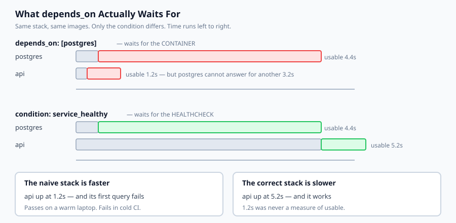

## The idea in plain language

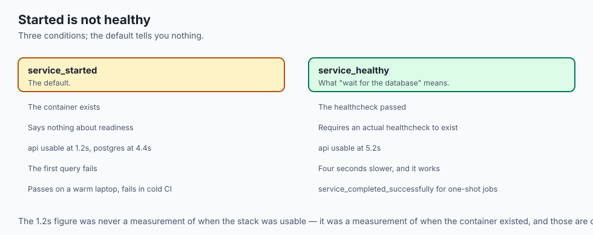

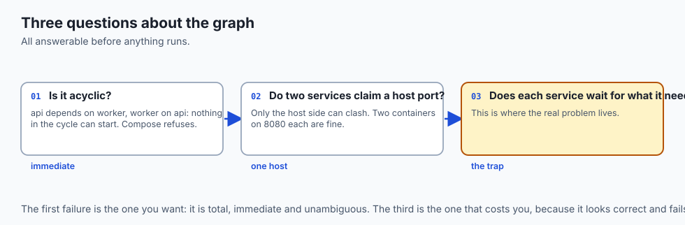

A Compose file describes a graph. The services are nodes, `depends_on` gives the edges, and three properties of that graph decide whether the stack works.

**Is it acyclic?** If `api` depends on `worker` and `worker` depends on `api`, nothing in the cycle can ever start. Compose refuses the file, and the error is clear — this is the failure you *want*, because it happens immediately and unambiguously.

**Do any two services claim the same host port?** Only the host side can clash. Two containers happily listen on 8080 each because they are in separate network namespaces; `ports: ["8000:8080"]` binds 8000 on the host, and there is exactly one host.

**Does each service wait for what it actually needs?** This is where the real problem lives. There are three conditions:

- `service_started` — the container exists. The default, and it tells you almost nothing.
- `service_healthy` — the healthcheck passed. This is what "wait for the database" means.
- `service_completed_successfully` — a one-shot job exited zero. For migrations and seeding.

Writing `depends_on: [postgres]` gets you the first. Writing it with `condition: service_healthy`, plus an actual healthcheck on Postgres, gets you the second. The difference is four seconds of not crashing.

## Historical background

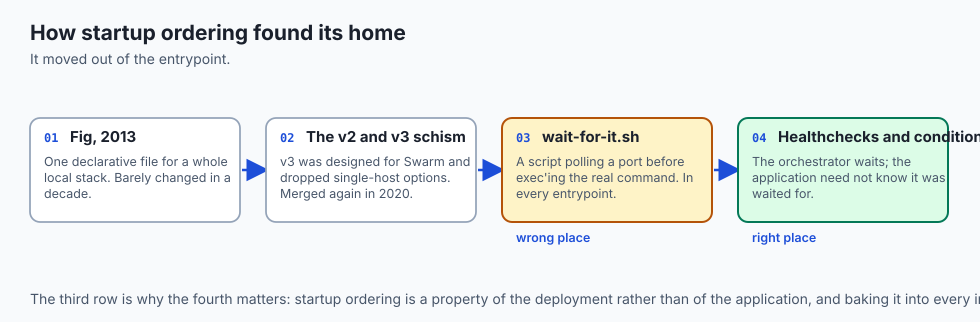

### Fig, 2013

Compose began life as Fig, an independent tool for describing multi-container applications in YAML. Docker acquired it in 2014 and renamed it. The core idea — one declarative file for a whole local stack — has barely changed in a decade, which is unusual and says something about how right it was.

### The v2 and v3 schism

Compose file format v3 was designed with Docker Swarm in mind and dropped several options that only made sense on a single host. For years people chose a version number based on which features they needed. The Compose Specification, from 2020, merged the lines again; modern files omit `version:` entirely.

### `wait-for-it.sh` and the era of shell scripts

Before dependency conditions existed, the standard answer to "wait for the database" was a shell script that polled a TCP port before exec'ing the real command. `wait-for-it.sh` and `dockerize` were everywhere. They worked, and they put startup ordering into every image's entrypoint — which is the wrong place for it, because it is a property of the deployment rather than of the application.

### Healthchecks, Docker 1.12 (2016) and Compose conditions

`HEALTHCHECK` in a Dockerfile, then `condition: service_healthy` in Compose, moved the problem to where it belongs: the orchestrator waits, and the application does not need to know it was waited for. Kubernetes readiness probes are the same idea at a larger scale, which is tomorrow's lesson.

## What it is — and what it is not

Compose is a declarative description of a multi-container application on one host.

### What it is

It is **a local development and small-deployment tool**. One machine, several containers, one file.

It is **a dependency graph** with ordering semantics, which is why graph questions are the useful ones to ask of it.

It is **the readable version of a long `docker run` command**, and its main value is that the flags stop being tribal knowledge.

### What it is not

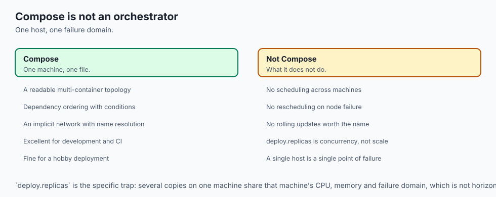

It is not an orchestrator. No scheduling across machines, no rescheduling on node failure, no rolling updates worth the name. That is tomorrow.

It is not a production deployment for anything that must stay up. A single host is a single point of failure.

It is not a way to avoid understanding networking. Services reach each other by name on a shared network, and knowing that is what stops you publishing a database port to the world.

## Why it was created and what problems it solves

**Five `docker run` commands in the right order.** Undocumented, and different on every machine. *Solution: one file, in the repository.*

**Networking assembled by hand.** *Solution: an implicit network where services resolve each other by service name.*

**"It works on my machine" at the stack level.** *Solution: the same file starts the same topology everywhere.*

**Startup ordering by hope.** *Solution: dependency conditions — though only if you use them, which is the point of today.*

**Local environments that drift from each other.** *Solution: a versioned file rather than a wiki page.*


## How it works

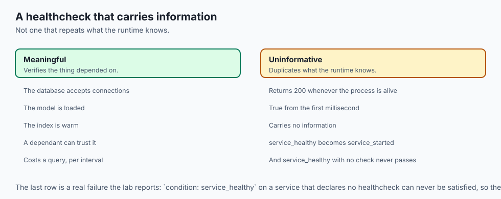

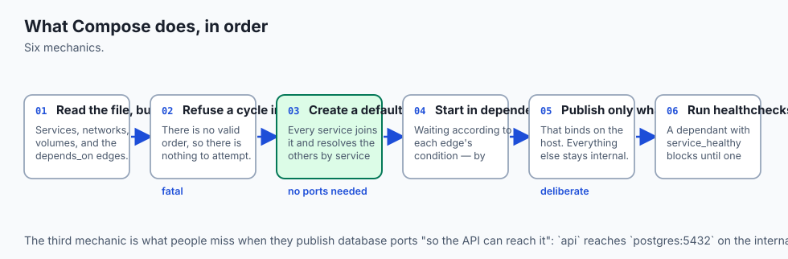

**Compose reads the file and builds a graph.** Services, networks, volumes, and the `depends_on` edges between them.

**It refuses a cycle immediately.** There is no valid order, so there is nothing to attempt.

**It creates a default network.** Every service joins it and is reachable by its service name. `api` connects to `postgres:5432` with no port published at all — this is the part people miss when they publish database ports "so the API can reach it".

**It starts services in dependency order**, waiting according to each edge's condition. With no condition it waits only for the container to be created.

**It publishes only what `ports:` asks for.** That binds on the host. Everything else stays on the internal network.

**Healthchecks run on an interval** and a service is healthy only after one passes. A dependant with `condition: service_healthy` blocks until then, which is exactly the four seconds the naive stack skips.

## An everyday analogy

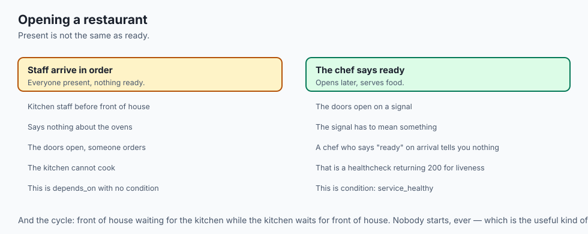

Think of opening a restaurant for the evening.

`depends_on` with no condition is the rule "the kitchen staff arrive before the front of house". Fine, and it says nothing about the ovens being hot. The doors open, someone orders, and the kitchen cannot cook — everybody is *present* and nothing is *ready*.

`condition: service_healthy` is the rule "the doors open when the head chef says the kitchen is ready". The head chef saying so is the healthcheck, and it has to mean something: a chef who says "ready" the moment they walk in has given you a signal that carries no information, which is exactly what a healthcheck returning 200 whenever the process is alive does.

The restaurant opens later under the second rule. It also serves food.

And the cycle: front of house waiting for the kitchen while the kitchen waits for front of house. Nobody starts, ever, and the useful thing about this failure is that it is total and immediate rather than intermittent.

## Examples in practice

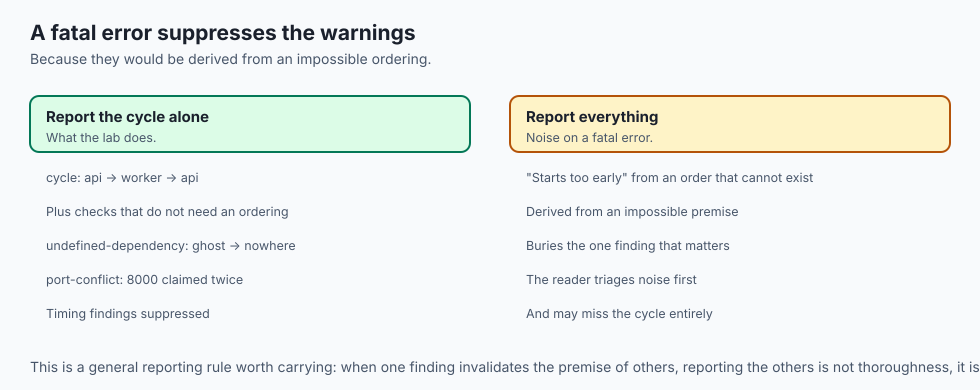

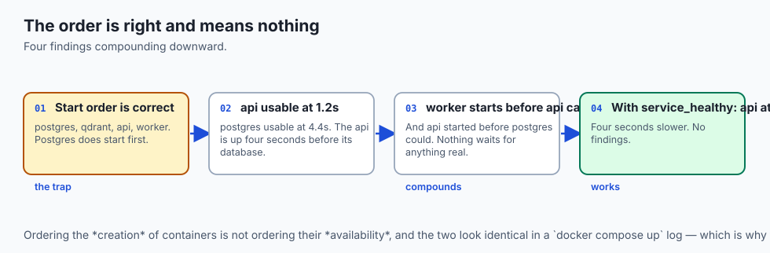

The measured output from today's lab. One stack — `postgres`, `qdrant`, `api`, `worker` — wired two ways:

```text
--- depends_on with no condition ---
  start order  postgres -> qdrant -> api -> worker
  usable at    api 1.2s  postgres 4.4s  qdrant 2.3s  worker 1.2s
  [starts-before-ready] api    starts 4.0s before 'postgres' can answer
  [starts-before-ready] api    starts 1.9s before 'qdrant' can answer
  [starts-before-ready] worker starts 3.8s before 'postgres' can answer
  [starts-before-ready] worker starts 0.6s before 'api' can answer
```

The start *order* is correct. Postgres does start before the api. That is the trap — the ordering looks right and means nothing, because ordering the creation of containers is not ordering their availability.

Look at the fourth finding especially: the worker starts before the api can answer, and the api itself started before Postgres could answer. Nothing in the chain waits for anything real, so the error compounds downward.

```text
--- depends_on: service_healthy ---
  usable at    api 5.2s  postgres 4.4s  qdrant 2.3s  worker 5.8s
  no findings
```

The api is now usable at 5.2s instead of 1.2s. **Four seconds slower, and it works.** The first number was never a measurement of when the stack was usable; it was a measurement of when the container existed.

And the file that cannot start at all:

```text
  cannot start: dependency cycle: api -> worker -> api
  [undefined-dependency] ghost depends on 'nowhere'
  [port-conflict] host port 8000 is claimed by 2 services: api, worker
```

Note that the cycle **suppresses** the timing findings. With no valid start order, "starts too early" is not a meaningful claim, and reporting warnings derived from an impossible ordering would be noise on top of a fatal error.

## Implications: security, privacy, performance, scalability, and cost

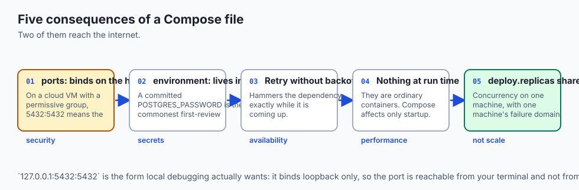

**Security.** `ports:` binds on the host. On a cloud VM with a permissive security group, `ports: ["5432:5432"]` on Postgres means the internet can reach your database. Services on the Compose network already reach each other by name, so a published port is a deliberate decision about outside traffic, not a prerequisite for internal traffic. `127.0.0.1:5432:5432` binds loopback only, which is what local debugging actually wants.

**Secrets.** `environment:` values live in the file, and the file lives in Git. Use `env_file:` with the file gitignored, or Docker secrets. A committed `POSTGRES_PASSWORD` is the most common finding in any first review of a Compose stack.

**Availability.** A service that starts before its dependency is ready does not fail quietly. It retries, and if the retry has no backoff it hammers the dependency exactly while that dependency is trying to come up — turning a slow start into a failed one.

**Performance.** Compose adds nothing at run time; the containers are ordinary containers. What it affects is startup, and only through ordering.

**Scalability and cost.** `deploy.replicas` on a single host shares that host's CPU and memory. It is not horizontal scaling; it is concurrency on one machine, with one machine's failure domain.

## Alternatives: free, open source, and commercial

**Docker Compose** — Apache-2.0, the default, and the right answer for local development. Compose V2 is a Docker CLI plugin rather than a separate Python tool.

**Podman Compose / `podman kube play`** — daemonless and rootless. `podman-compose` reads Compose files; `podman kube play` reads Kubernetes YAML, which makes it a useful stepping stone toward tomorrow.

**Kubernetes with kind or minikube** — a real orchestrator locally. Much heavier, and worth it when local and production should be the same shape.

**Tilt and Skaffold** — development loops on top of Kubernetes, with file watching and live reload. They solve the iteration problem Compose solves, against a cluster.

**Dev Containers** — the VS Code specification, which uses Compose underneath for multi-service setups. A different interface to the same mechanism.

**Managed local stacks** — Supabase CLI, LocalStack and similar ship a curated Compose file for a specific dependency set. Convenient, and worth reading rather than only running.

The honest default: Compose for local development, with `service_healthy` conditions and real healthchecks, and a different tool for production.

## Comparison with related concepts

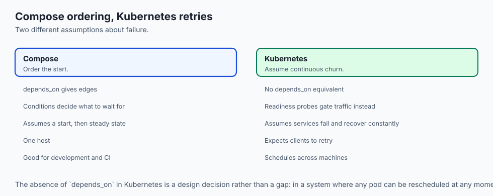

**Compose versus Kubernetes.** Compose describes a topology on one host; Kubernetes schedules across many and keeps them running. Compose's `depends_on` is a startup ordering; Kubernetes has no equivalent, because it assumes services fail and recover continuously and expects clients to retry.

**`depends_on` versus a healthcheck.** They are two halves of one mechanism. The condition says what to wait for; the healthcheck is what makes the answer meaningful. `service_healthy` on a service with no healthcheck can never be satisfied — which is why the lab reports it.

**`ports` versus `expose` versus nothing.** `ports` binds on the host; `expose` documents intent; nothing at all is sufficient for service-to-service traffic. Most services need the third.

**Healthcheck versus liveness.** A healthcheck that returns 200 whenever the process is alive duplicates what the runtime already knows. A useful one verifies the thing a dependant is about to rely on — that the database accepts connections, that the model is loaded.

## When to use it — and when not to

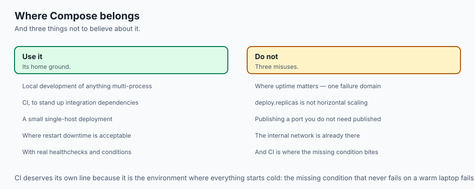

**Use it for local development of anything with more than one process.** This is its home ground and it is very good at it.

**Use it in CI** to stand up dependencies for integration tests — and note that CI is exactly where the missing condition bites, because everything starts cold.

**Use it for a small single-host deployment** where downtime during a restart is acceptable. A hobby project, an internal tool.

**Do not use it where uptime matters.** One host, one failure domain, no rescheduling.

**Do not use `deploy.replicas` and believe you have scaled.** You have several copies on one machine.

**Do not publish a port you do not need published.** The internal network is already there.

## The AI connection

- **AI services have the longest startup in the stack**, because loading a model is
  seconds to minutes — which makes `service_started` a uniquely bad signal here.

- **A useful healthcheck for an AI service verifies the model is loaded**, not that
  the process is alive. The runtime already knows the process is alive.

- **A vector store is the dependency most likely to be reached before it is ready**,
  since index warm-up happens after the port opens.

- **Retry without backoff turns a slow start into a failed one** — the API hammers
  the store exactly while the store is trying to come up.

- **The same idea returns as a Kubernetes readiness probe** tomorrow, which is what
  Day 359's live-but-not-ready failure is built on.

## Knowledge check

1. Why is the correctly wired stack in the lab *slower* to report ready, and why is that the better number?
2. Why do `8000:8080` and `8001:8080` not conflict when both containers listen on 8080?
3. Why does a dependency cycle suppress the "starts before ready" findings rather than being reported alongside them?
4. `condition: service_healthy` on a service that defines no healthcheck — what happens, and why does the lab treat it as an error?
5. Why does publishing a database port not help the API reach it?

## Hands-on exercise

You will build the graph checks — cycles, ports, ordering, readiness — and measure what a dependency condition changes.

Open `starter/compose_graph.py` in the lab directory and implement the stubbed functions, then run the tests. Docker Compose is not required.

### Expected output

Running `python3 examples/compose_demo.py` wires one stack two ways:

```text
--- what the condition changed ---
  api usable at    1.2s  ->  5.2s
  worker usable at 1.2s  ->  5.8s
  premature starts 4  ->  0
```

The numbers get worse and the stack starts working. That is the lesson.

### Validate your work

Run `bash tests/run_tests.sh`. All twenty-six tests must pass.

Then check three things by inspection. Under `service_started`, the api must be usable **before** postgres is — if the two wirings behave identically, `ready_times` is treating `service_started` as though it waited for readiness, and the whole comparison collapses. A three-service cycle must be reported once rather than three times. And a cycle must suppress the timing findings, because there is no order to reason about.

### Troubleshooting

**A cycle is reported once per member.** Rotate each cycle to start at its smallest name and keep a set of what you have emitted.

**`startup_order` loops forever.** Check for a cycle first and raise.

**The two wirings behave identically.** Under `service_started` a dependant may begin at `ready_times[dep] - dep.ready_seconds`, not at `ready_times[dep]`.

**`healthy-without-healthcheck` never fires.** The check is about the target of the dependency, not the service declaring it.

### Common mistakes

Comparing container ports rather than host ports, so nothing ever conflicts.

Treating a self-dependency as acceptable; Compose will not start such a file.

Letting an undefined dependency block the start order — it is a separate finding, and the service is not waiting on anything real.

"Fixing" the correct stack to be as fast as the naive one, which optimises away the entire point.

## Practice assignment

Add **restart policies and client retry** to the model, then answer the question the lesson raises but does not settle: if the client retries with backoff, is `service_healthy` still necessary?

Model a service that retries three times with exponential backoff, count the failed requests during startup under each of the four combinations (condition or not, retry or not), and write a test pinning the result. The answer is more interesting than a flat yes or no — retry recovers, and it recovers *after* emitting errors that will page someone, while the condition prevents them being emitted at all.

## Extension challenge

Point this at a **real `docker-compose.yml`** you already operate.

Parse it with `yaml.safe_load`, build the `Service` graph — `depends_on` appears in both a list form and a mapping form with conditions, so handle both — and run the review over it.

Then do the part that is uncomfortable: for every `starts-before-ready` finding, work out whether it has ever caused a failure you attributed to something else. Flaky integration tests, a service that needs a restart after `compose up`, an error in the logs at boot that "always looks like that". Startup ordering bugs are rarely filed as startup ordering bugs, which is exactly why they survive so long.
