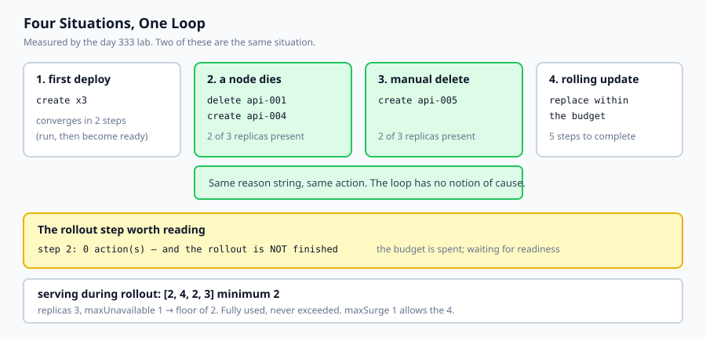

## Why this matters

Kubernetes has a reputation for complexity that is mostly earned by its surface area — hundreds of resource types, a YAML dialect with real depth, and an ecosystem that assumes you already know the vocabulary.

Underneath all of it there is one idea, and it fits in about forty lines of Python:

> a loop compares what you declared against what exists, and takes one step to close the gap

That is it. Every behaviour people find surprising falls out of it. Today's lab implements the loop and then runs four situations through it — a first deploy, a node dying, somebody deleting a pod by hand, and a rolling update. Two of those produce **identical** behaviour, which is the moment the idea lands:

```text
--- 2. a node dies, taking one pod with it ---
    delete api-001      node node-a is gone
    create api-004      2 of 3 replicas present
--- 3. somebody deletes a pod by hand ---
    create api-005      2 of 3 replicas present
```

The loop does not ask how the gap appeared. A hardware failure and a person typing `kubectl delete pod` are the same input. That is why deleting a pod is not a destructive operation, and it is why you cannot fix anything durably by editing a running pod.



## The idea in plain language

You write down what you want. A controller makes it true, continuously.

**Desired state** is a Deployment: this image, this many replicas, this much surge tolerance during an update. It describes an outcome and contains no instructions.

**Actual state** is the set of pods that exist right now, each with a phase and a readiness answer.

**The loop** runs forever. Each pass it computes the difference and issues actions — create these, delete those — then does it again. It is *level-triggered*, not edge-triggered: it responds to the current gap rather than to events. Miss an event and nothing breaks, because the next pass sees the same gap.

The second idea is **readiness**, and it is the one that separates Kubernetes from a restart script. A pod being Running says the container started. A pod being *ready* says its readiness probe passed. A Service routes only to ready pods.

Yesterday's Compose lesson asked that question once, at startup. Kubernetes asks it every few seconds, forever, and removes a pod from the load balancer the moment the answer changes.

## Historical background

### Borg, 2003 onward

Google's internal cluster manager ran essentially everything Google did for a decade before Kubernetes existed. Its central lesson, published in 2015, was that declarative specification plus continuous reconciliation scales in a way that imperative deployment scripts do not.

### Kubernetes, 2014

Released by Google and donated to the newly formed CNCF in 2015. It is Borg's ideas rebuilt in the open, with an API server, a set of controllers and a scheduler — the controllers being the interesting part, because each is just a loop of the kind you will write today.

### The operator pattern, 2016

CoreOS observed that if a controller is only a loop over a resource type, you can write your own for your own resource types. An operator encodes how to run a specific piece of software — a database, a message broker — as a controller. That the idea generalises this cleanly is evidence the core abstraction was right.

### Level-triggered versus edge-triggered

A design decision worth knowing by name. An edge-triggered system reacts to events and breaks when one is lost. A level-triggered system reacts to state and is self-correcting by construction — a missed event costs one pass of the loop, not correctness. Kubernetes is level-triggered throughout, and that choice is why it recovers from its own outages.

### Deployments, 1.2 (2016)

Rolling updates were originally a client-side operation: `kubectl rolling-update` orchestrated it from your laptop, and closing the laptop stopped the rollout. Moving it into a controller made it survive the client, which is the same insight one level up.

## What it is — and what it is not

Kubernetes is a set of controllers that continuously drive a cluster's actual state toward a declared state.

### What it is

It is **declarative**. You describe an outcome; controllers work out the steps.

It is **self-correcting**. Gaps are closed whenever they appear, whatever caused them.

It is **a scheduler plus a control plane**. Where things run and whether they are still running.

### What it is not

It is not a deployment script. There is no sequence of steps, and asking "what does it do first" usually means the model has not landed yet.

It is not a way to make an application reliable. It restarts things. An application that corrupts data when killed will corrupt data more often.

It is not required. A single VM running Compose is a legitimate architecture, and for a service with one instance it is often the better one.

## Why it was created and what problems it solves

**Machines fail and somebody has to notice.** *Solution: a loop that notices continuously and refills the gap.*

**Deployment scripts that must be re-run correctly after a partial failure.** *Solution: declare the outcome; the loop is safe to interrupt at any point.*

**Rolling updates orchestrated from a laptop.** *Solution: a controller with a budget for how much may be unavailable at once.*

**Traffic sent to processes that have not finished starting.** *Solution: readiness probes gating Service membership.*

**Capacity decided by hand.** *Solution: a scheduler that places pods against declared requests.*



## How it works

**You submit a Deployment.** The API server stores it. Nothing has happened yet.

**A controller notices a difference** between the declared replica count and the pods that exist, and creates the missing ones.

**The scheduler assigns each pod to a node** — and to a *live* one. Today's lab makes this explicit for a reason: an earlier version placed replacements on the node that had just died, reaped them, and churned forever. That is a real failure mode when a node filter is wrong.

**The kubelet on that node starts the container.** The pod becomes Running.

**The readiness probe runs.** When it passes, the pod becomes ready and the Service starts routing to it. Between Running and ready, the pod exists and receives nothing.

**A rolling update changes the desired image.** The controller replaces stale pods within two limits: `maxUnavailable` sets the floor of how many must keep serving, `maxSurge` the ceiling of how many may exist temporarily. It then waits for the new pods to become ready before retiring any more.

**That wait is the interesting part.** A reconcile pass during it returns *no actions* while the rollout is plainly unfinished — because the controller has spent its budget and may not spend more until readiness arrives.

## An everyday analogy

Think of a thermostat rather than a heating schedule.

A schedule is imperative: turn the heating on at seven, off at nine. If the power flickers at 06:59 the schedule misses its cue and the house stays cold, because a schedule reacts to *moments*.

A thermostat is declarative: keep it at twenty degrees. It never asks why the room is cold — a window left open, a power cut, someone turning the radiator down — and it does not need to. It compares, acts a little, and compares again.

That is the whole lesson, including the part people find surprising: **you cannot override a thermostat by holding the radiator valve.** Turn it down by hand and the thermostat notices the room is cold and compensates. The only durable way to change the outcome is to change the number on the thermostat.

`kubectl edit` on a running pod is holding the valve. `kubectl edit` on the Deployment is changing the number.

## Examples in practice

The measured output from today's lab. One deployment, four situations:

```text
--- 1. first deploy: nothing exists yet ---
  converged in 2 steps -> 3 alive, 3 serving
```

Two steps, not one. After the first pass three pods exist and **none of them serves** — they are Running and have not yet passed their probe. The spec is satisfied and a Service would route to nothing, which is exactly the distinction the day is built on.

```text
--- 2. a node dies ---
    delete api-001      node node-a is gone
    create api-004      2 of 3 replicas present
--- 3. somebody deletes a pod by hand ---
    create api-005      2 of 3 replicas present
```

Same reason string, same action. The loop has no notion of cause.

```text
--- 4. a rolling update to app:1.5 ---
  step 1: 3 action(s)  -> 4 alive, 2 serving
  step 2: 0 action(s)  -> 4 alive, 4 serving  (waiting for the new pods to become ready)
  step 3: 3 action(s)  -> 3 alive, 2 serving
  step 5: rollout complete — every pod on app:1.5
  serving during rollout: [2, 4, 2, 3]  minimum 2
```

Step 2 deserves a moment. **Zero actions, and the rollout is not finished.** The controller replaced as many pods as `maxUnavailable` permitted and is now blocked until the replacements are ready.

"Nothing to do this pass" and "the work is complete" are different questions, and conflating them makes a half-finished rollout report success — which an earlier version of this lab did, cheerfully declaring victory with two pods still on the old image.

The guarantee holds throughout: with three replicas and `maxUnavailable=1`, at least two must serve at every moment. The observed minimum is exactly two. The budget is fully used and never exceeded.

## Implications: security, privacy, performance, scalability, and cost

**Security.** The loop erases manual changes to running pods. An attacker who modifies a pod has made a change with a short half-life; one who modifies your manifests has made a permanent one. That asymmetry is the argument for treating the manifest repository as production infrastructure, with the review requirements that implies.

**Readiness as a control.** A probe decides whether requests reach a process, which makes it a traffic control rather than diagnostics. A probe that always passes routes traffic to a pod that cannot serve. A probe that checks a *downstream dependency* removes every pod from the Service when that dependency wobbles, turning a partial outage into a total one. Probe what this pod can do.

**Performance.** Reconciliation is not free — a large cluster's control plane is a real workload — but it does not sit in the request path. What does affect latency is scheduling: a pod that cannot be placed stays Pending indefinitely, which is the most common "why is nothing happening".

**Scalability.** Horizontal scaling becomes a number in a spec. The limits move to the things Kubernetes does not manage for you: connection pools, database capacity, per-tenant quotas.

**Cost.** Requests reserve capacity whether used or not. Over-requesting is the most common source of a cluster bill that does not match its utilisation, and it is invisible until someone graphs requested against used.

## Alternatives: free, open source, and commercial

**Docker Compose** — yesterday's tool. One host, no rescheduling. For a single-instance service where a restart is acceptable, it is simpler and sufficient.

**k3s, kind, minikube** — Apache-2.0. Real Kubernetes, small enough for a laptop or a single VM. k3s in particular is a reasonable production choice for a small deployment.

**Nomad** — HashiCorp, BUSL since 2023. A scheduler without Kubernetes' object model. Considerably simpler, with a correspondingly smaller ecosystem.

**Managed Kubernetes** — GKE, EKS, AKS. You stop operating the control plane and start paying for it. Usually the right trade once a cluster matters.

**Serverless containers** — Cloud Run, Fargate, Container Apps. Scale to zero, no cluster to run, and no scheduler to reason about. For a stateless AI inference endpoint with uneven traffic this is frequently the better answer, and tomorrow's lesson prices it.

The honest default for a small AI service: not Kubernetes. Reach for it when you have several services, several machines, and a real need for rescheduling — not before.

## Comparison with related concepts

**Declarative versus imperative.** `kubectl apply -f` states an outcome; `kubectl run` performs an action. The first is repeatable and the second is a one-off, which is why the first is what belongs in a repository.

**Level-triggered versus edge-triggered.** Reacting to state rather than to events. A lost event costs one pass of the loop instead of correctness.

**Readiness versus liveness.** Readiness gates traffic; liveness triggers a restart. Confusing them produces a service that restarts pods for being briefly busy, which is worse than the original problem.

**Deployment versus Pod versus Service.** The Deployment is the declared state, the Pod is the running thing, the Service is the stable address that routes to ready pods. Editing the middle one is the mistake.

**`maxUnavailable` versus `maxSurge`.** A floor on capacity and a ceiling on total pods. The floor protects the service; the ceiling protects the cluster.

## When to use it — and when not to

**Use it when you have more machines than you want to think about**, and things must be rescheduled when one dies.

**Use it when you run many services** and want one uniform way to deploy, roll back and observe them.

**Use it when your organisation already has a cluster.** The marginal cost of one more workload is small; the cost of the first one is not.

**Do not use it for a single service on a single machine.** You have added a control plane to solve a problem you do not have.

**Do not use it to make an unreliable application reliable.** It restarts things, faster and more often.

**Do not adopt it during an incident**, or a week before a deadline. The learning curve is real and it is not front-loaded — the surprises arrive later.

## Knowledge check

1. Why do a node failure and `kubectl delete pod` produce identical behaviour from the controller?
2. Why does a first deploy of three replicas take two reconciliation steps rather than one?
3. A reconcile pass returns no actions during a rolling update that is plainly unfinished. What is happening?
4. Why must replacement pods be scheduled onto a live node, and what happens if they are not?
5. Why is editing a running pod not a durable way to change anything?

## Hands-on exercise

You will implement the reconciliation loop and run four situations through it.

Open `starter/reconcile.py` in the lab directory and implement the stubbed functions, then run the tests. No cluster is required.

### Expected output

Running `python3 examples/reconcile_demo.py` puts one deployment through four situations:

```text
  step 2: 0 action(s)  -> 4 alive, 4 serving  (no action — waiting for the new pods to become ready)
  serving during rollout: [2, 4, 2, 3]  minimum 2
  2 required, 2 observed
```

The minimum equals the floor exactly. The budget is fully used and never exceeded.

### Validate your work

Run `bash tests/run_tests.sh`. All nineteen tests must pass.

Then check three things by inspection. A first deploy must converge in **two** steps — one tick to run, another to become ready. Losing a node and deleting a pod by hand must produce the same kind of action; if they differ, the loop is reasoning about history it should not have. And during the rollout, `serving` must never fall below `replicas - max_unavailable` while `alive` never exceeds `replicas + max_surge`.

### Troubleshooting

**`converge` raises "did not converge".** Almost always replacements being scheduled onto the dead node — filter `dead_nodes` in `schedule`.

**The rollout exceeds the surge ceiling.** Your create step is not counting the stale pods it is keeping. Take the minimum of both limits.

**A half-finished rollout reports success.** `rollout_done` is not a synonym for "no actions this pass".

**Pods never serve.** `tick` advances one state per call; a pod needs two.

### Common mistakes

Treating "no actions" as completion, which is the subtle one and the one that matters.

Deleting stale pods without checking how many are currently serving, which takes the service down during an update.

Checking `phase` rather than `serving` in `rollout_done`, so a cluster routing to nothing looks finished.

Scheduling onto any node in the list rather than a live one.

## Practice assignment

Add **resource requests and node capacity**. Give each node a CPU budget and each pod a request, then make `schedule` refuse to place a pod that does not fit.

Write a test showing what happens when the cluster is full: the Deployment does not fail, it does not error, and it does not converge — pods stay Pending indefinitely while the controller keeps trying. This is the most common "why is nothing happening" in a real cluster, and the reason it confuses people is that nothing is broken. The loop is working exactly as designed, and the answer is simply not reachable.

## Extension challenge

Add a **liveness probe**, then use it to find the trap.

Liveness differs from readiness in consequence: a failed readiness probe removes a pod from the Service, and a failed liveness probe restarts the container. Model both, then construct the scenario worth understanding — a liveness probe that checks a downstream dependency, and a dependency that is briefly slow.

What you should observe is every pod restarting at once, each restart making the dependency slower, and the cluster converting a transient wobble into a self-sustaining outage. Then answer the design question: what should a liveness probe actually check? The rule that survives is that a liveness probe should test only whether *this process* is wedged, and never whether the system around it is healthy.
