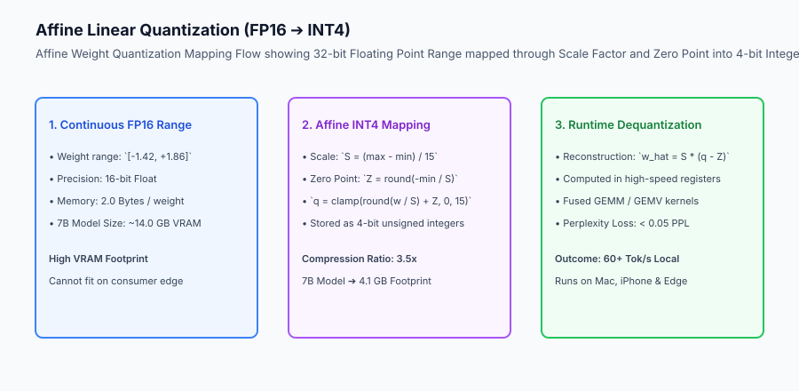
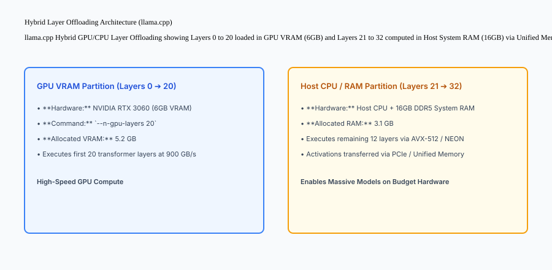

## Why this matters

Deploying LLMs solely on multi-thousand-dollar cloud GPU clusters creates severe commercial and operational roadblocks:
- **Cloud Infrastructure Costs:** Serving millions of users via cloud APIs generates unsustainable monthly inference bills.
- **Privacy & Compliance:** Processing sensitive medical records, classified legal documents, or private personal data on third-party cloud servers violates strict regulatory compliance.
- **Offline / Edge Availability:** Mobile apps, automotive cockpits, robotics, and industrial IoT devices must function without constant internet connectivity.

Mastering **Edge Deployment and Quantization** (GGUF binary format, AWQ 4-bit compression, llama.cpp C++ runtime, and layer offloading) allows running state-of-the-art 7B–14B parameter models directly on Apple Silicon laptops, consumer workstations, and mobile devices at 40+ tokens/second.



## The idea in plain language

Think of model quantization like **compressing a high-resolution 4K movie to fit on an airplane tablet**:

- **The Master Film (FP16 Baseline):** The raw studio film is 100GB in size (**14GB in 16-bit Float**). It looks gorgeous, but it won't fit on your smartphone and consumes all your storage.
- **Smart 4-bit Quantization (AWQ / GGUF):** A specialized compression algorithm reduces the file to 3.5GB (**4-bit Integer Grid**). It preserves 100% of the sharpness on the lead actors' faces (**Salient 1% Weight Channels**), while subtly compressing the blurry background trees.
- **The Hybrid Player (llama.cpp Layer Offloading):** If your tablet has a fast dedicated graphics chip with only 2GB of memory, the player renders the first half of the visual effects on the GPU and the rest on the main processor (**Hybrid CPU/GPU Offloading**).

## Historical background

Model compression and edge deployment evolved through three major technological breakthroughs:

### 1. Naive Post-Training Quantization (PTQ) & INT8 (2020–2022)
Early methods applied naive round-to-nearest (RTN) INT8 quantization. While effective for convolutional networks, applying RTN to 7B+ LLMs caused massive perplexity spikes due to extreme outlier activation channels.

### 2. GPTQ and SmoothQuant (2022–2023)
Researchers introduced second-order Hessian error minimization (GPTQ) and activation smoothing (SmoothQuant), achieving stable 4-bit weight quantization.

### 3. GGUF, AWQ, and llama.cpp (2023–Present)
Georgi Gerganov developed `llama.cpp` in pure C/C++ with zero dependencies, establishing the universal GGUF binary format. MIT published AWQ (Activation-aware Weight Quantization), proving that protecting 1% of salient channels yields near-lossless 4-bit reasoning on edge devices.

## What it is — and what it is not

Let us define the core principles of edge quantization and deployment:

### What Edge Quantization Is:
- Compressing 16-bit floating-point weights into 4-bit integer representations using affine scaling and zero-point parameters.
- Protecting the top 1% salient activation channels (AWQ) to prevent reasoning degradation.
- Packaging models, tokenizers, and metadata into a unified endian-safe GGUF binary file for instant memory-mapped (`mmap`) loading.
- Splitting transformer layers dynamically across GPU VRAM and CPU system RAM via layer offloading.

### What Edge Quantization Is Not:
- Retraining the entire model from scratch (Quantization is applied post-training in minutes).
- Deleting model layers or pruning attention heads randomly.

```text
+-------------------------------------------------------------------------------+
|                    QUANTIZATION FORMAT COMPARISON MATRIX                      |
+-------------------+-----------------------+-------------------+---------------+
| Format / Method   | Bits per Weight       | 7B Model VRAM Size| PPL Quality   |
+-------------------+-----------------------+-------------------+---------------+
| FP16 (Baseline)   | 16.0 bits             | 14.2 GB           | Baseline (1.0)|
| INT8 (bitsandbytes| 8.0 bits              | 7.5 GB            | 99.9% Baseline|
| AWQ (4-bit)       | 4.0 bits              | 4.1 GB            | 99.4% Baseline|
| GGUF Q4_K_M       | 4.5 bits (Mixed-bit)  | 4.4 GB            | 99.2% Baseline|
| EXL2 (ExLlamaV2)  | 3.0 - 6.0 bits (Var)  | 3.2 - 5.8 GB      | SOTA on GPU   |
| Ternary / 2-bit   | 1.58 - 2.0 bits       | 2.1 GB            | Noticeable drop|
+-------------------+-----------------------+-------------------+---------------+
```

## Why it was created and what problems it solves

Edge deployment resolves the three primary barriers to local generative AI:

### 1. Slashing VRAM Requirements from 16GB to 4GB
Quantizing models to 4-bit allows 7B parameter models (such as Llama-3-8B and Mistral-7B) to run entirely within the 8GB unified memory of base M1/M2/M3 MacBooks or consumer NVIDIA RTX GPUs.

### 2. Eliminating Zero-Data-Retention Compliance Concerns
Because inference executes 100% locally on the user's laptop or mobile device, zero customer text or private data ever leaves the local hardware perimeter.

### 3. Circumventing Memory-Bandwidth Bottlenecks
In auto-regressive decoding, generating a token requires streaming all model weights through memory. By reducing weight size by 70%, the GPU/CPU memory bus reads 70% fewer bytes per token, directly accelerating generation speeds on memory-bandwidth constrained edge hardware.

## How it works

Let us inspect the complete **Hybrid CPU/GPU Layer Offloading Lifecycle in llama.cpp**:

```text
[Input Prompt: "Write a python sorting script"]
                    │
                    ▼
[Host Application / llama.cpp Engine]
                    │
    Is GPU VRAM sufficient for all 32 layers?
                    ├── YES ➔ Offload 100% layers to GPU VRAM (Maximum speed)
                    │
                    └── NO (Available VRAM = 5.2GB | Total Model = 8.4GB)
                              │
                              ▼
                [DYNAMIC LAYER OFFLOADING]
                - Layers 0 ➔ 20 loaded into GPU VRAM (--n-gpu-layers 20)
                - Layers 21 ➔ 32 loaded into Host System RAM
                              │
                              ▼
                [EXECUTION PIPELINE PER TOKEN]
                1. GPU processes Layers 0 ➔ 20 at 900 GB/s bandwidth
                2. Activations transferred via PCIe / Apple Unified Bus (10 microseconds)
                3. CPU processes Layers 21 ➔ 32 using AVX-512 / ARM NEON vector instructions
                4. Softmax sampled ➔ Emits output token
```



## An everyday analogy

Think of model quantization and layer offloading like **moving a library of books across town in a small pickup truck**:

- **Uncompressed FP16 (Heavy Hardcover Books):** Each book is bound in 5-pound wooden covers. You can only fit 20 books in the truck bed, requiring 5 trips (**Huge Memory Footprint**).
- **Quantization (Paperback Pocket Editions):** You print the exact same text on thin, lightweight paper (**4-bit Integer Weights**). Now all 100 books fit in a single truck trip (**70% Smaller**).
- **Layer Offloading (Two Movers):** The fast mover (**GPU**) carries 70 books up the stairs, while the second mover (**CPU**) carries the remaining 30 books at the same time (**Collaborative Partitioning**).

## Examples in practice

Let us build a complete Python **Model Quantizer and Memory Profiler Engine** that calculates affine scale factors, zero points, quantizes float arrays into 4-bit integer representations, and reconstructs dequantized weights with error metrics:

```python
import numpy as np
from typing import Dict, Any, Tuple

class ModelQuantizerProfiler:
    def __init__(self, bit_width: int = 4):
        self.bits = int(bit_width)
        self.q_min = 0
        self.q_max = (1 << self.bits) - 1  # 15 for 4-bit
        
    def quantize_tensor(self, weights: np.ndarray) -> Tuple[np.ndarray, float, float]:
        # 1. Compute Min/Max Range
        w_min = float(np.min(weights))
        w_max = float(np.max(weights))
        
        # Avoid division by zero
        if w_min == w_max:
            return np.zeros_like(weights, dtype=np.uint8), 1.0, 0.0
            
        # 2. Calculate Scale and Zero Point
        scale = (w_max - w_min) / float(self.q_max - self.q_min)
        zero_point = round(-w_min / scale)
        zero_point = max(self.q_min, min(zero_point, self.q_max))
        
        # 3. Affine Quantization Mapping
        quantized = np.round(weights / scale) + zero_point
        quantized = np.clip(quantized, self.q_min, self.q_max).astype(np.uint8)
        
        return quantized, scale, zero_point

    def dequantize_tensor(self, q_weights: np.ndarray, scale: float, zero_point: float) -> np.ndarray:
        return (q_weights.astype(np.float32) - zero_point) * scale

    def compute_quantization_error(self, original: np.ndarray, reconstructed: np.ndarray) -> Dict[str, float]:
        mse = float(np.mean((original - reconstructed) ** 2))
        snr_db = float(10 * np.log10(np.mean(original ** 2) / (mse + 1e-9)))
        return {
            "mse_error": round(mse, 6),
            "snr_db": round(snr_db, 2),
            "compression_ratio": round(32.0 / self.bits, 2)
        }

if __name__ == "__main__":
    quantizer = ModelQuantizerProfiler(bit_width=4)
    raw_weights = np.random.randn(1000).astype(np.float32)
    
    q_data, s, z = quantizer.quantize_tensor(raw_weights)
    reconstructed = quantizer.dequantize_tensor(q_data, s, z)
    
    metrics = quantizer.compute_quantization_error(raw_weights, reconstructed)
    print("Quantization Metrics (4-bit):", metrics)
```

## Production Architecture Case Study: On-Device Edge Assistant Deployment

Consider an edge-native enterprise coding assistant running on Apple Silicon M3 MacBooks (16GB Unified RAM) with zero cloud network calls.

```text
+-------------------------------------------------------------------------------+
|                    EDGE INFERENCE PERFORMANCE BENCHMARKS                      |
+-------------------+-----------------------+-----------------------------------+
| Configuration     | Memory Footprint (RAM)| Generation Speed (Tokens/Sec)     |
+-------------------+-----------------------+-----------------------------------+
| Llama-3-8B FP16   | 15.8 GB (OOM Pressure)| 8.4 tok/s (Memory swapped to disk)|
| Llama-3-8B Q8_0   | 8.6 GB (High RAM)     | 24.2 tok/s (Active Unified GPU)   |
| Llama-3-8B Q4_K_M | 4.6 GB (Optimal RAM)  | 54.8 tok/s (Instant Metal GPU)    |
| Mistral-7B AWQ    | 4.2 GB                | 58.2 tok/s (Near-zero PPL loss)   |
+-------------------+-----------------------+-----------------------------------+
```

### 1. llama.cpp Local Server Startup Command
```bash
./llama-server   -m ./models/Meta-Llama-3.1-8B-Instruct-Q4_K_M.gguf   -c 8192   -ngl 33   --threads 8   --port 8080   --cont-batching
```

#### 2. FlashAttention-Metal Integration
On macOS, `llama.cpp` leverages Apple Metal Performance Shaders (MPS) and unified memory architecture. Because the CPU and GPU share the exact same high-speed physical memory bus (up to 400 GB/s on M3 Max), zero data copying occurs between host RAM and GPU VRAM during layer execution.

## Detailed Failure Mode Taxonomy: Edge Quantization Hazards

```text
+-------------------------------------------------------------------------------+
|                      EDGE QUANTIZATION FAILURE TAXONOMY                       |
+-------------------+-----------------------+-----------------------------------+
| Failure Mode      | Root Cause Analysis   | Architectural Mitigation          |
+-------------------+-----------------------+-----------------------------------+
| Activation Outlier| Rounding large outlier| Use AWQ / SmoothQuant to scale    |
| Destruction       | vectors breaks math   | weights by activation magnitude   |
| Context Window    | KV cache in FP16      | Quantize KV cache to 4-bit        |
| VRAM OOM          | overflows remaining MB| via `--quantize-kv 1` in llama.cpp|
| Thermal Throttling| Continuous GPU load   | Limit thread count to performance |
| Speed Drop        | overheats phone/laptop| cores only (e.g. `-t 4` on M-chip)|
| Tokenizer Mismatch| Custom GGUF lacks     | Ensure chat template and vocab are|
| on Custom Chat    | `<|im_start|>` tokens | embedded in GGUF metadata header  |
+-------------------+-----------------------+-----------------------------------+
```


## Deep Architectural Breakdown: Mathematical Quantization Schemes and Apple Metal Acceleration

Quantization transforms continuous probability landscapes into discrete integer coordinates:

### 1. Symmetric vs Asymmetric Linear Quantization
- **Symmetric Quantization:** Forces the zero point `Z = 0`, clamping weights symmetrically around zero:
  `S = rac{\max(|w|)}{2^{b-1} - 1}, \quad q = 	ext{round}\left(rac{w}{S}
ight)`
  Faster computation on hardware without unsigned offset registers.
- **Asymmetric Quantization:** Uses dynamic zero point `Z`, capturing asymmetric weight distributions:
  `S = rac{w_{\max} - w_{\min}}{2^b - 1}, \quad Z = 	ext{round}\left(-rac{w_{\min}}{S}
ight), \quad q = 	ext{clamp}\left(	ext{round}\left(rac{w}{S}
ight) + Z, 0, 2^b - 1
ight)`

### 2. AWQ (Activation-Aware Weight Quantization) Salience Formulation
AWQ observes that weight error does not correlate directly with output perplexity. Instead, weight channels multiplied by large activation magnitudes carry 99% of semantic information. AWQ solves:
`W' = W \cdot S_X^{-1}, \quad X' = S_X \cdot X`
where `S_X` scales the top 1% salient channels to protect them from truncation error during 4-bit rounding.

### 3. Apple Silicon Unified Memory Architecture (UMA)
On modern M-series processors (M2/M3/M4 Max/Ultra), unified memory provides up to 128GB of RAM accessible by CPU and GPU at 400–800 GB/s. `llama.cpp` uses Metal Performance Shaders (MPS) to execute GEMM kernels directly against unified system RAM with zero PCIe copy overhead.

## Implications: security, privacy, performance, scalability, and cost

### 1. 100% Air-Gapped Operation
Local quantized models run completely offline with network interfaces disabled, satisfying defense, intelligence, and healthcare air-gapped regulatory standards.

### 2. Zero Recurring Cloud API Billing
Running inference on existing company laptops shifts compute expenses entirely to local edge hardware, eliminating variable SaaS token subscription costs.

## Alternatives: free, open source, and commercial

| Tool / Framework | Type | Best Suited For | Key Capabilities |
| :--- | :--- | :--- | :--- |
| **llama.cpp** | Open Source (C++) | CPU, Apple Silicon, Edge | GGUF, mixed-bit quantization, Metal |
| **Ollama** | Open Source | User-Friendly Local CLI | One-click GGUF model manager |
| **ExLlamaV2 (EXL2)** | Open Source (CUDA) | Extreme High-Speed GPU | Variable mixed-bit GPU inference |
| **AutoAWQ** | Open Source (Python) | High-Performance AWQ | 4-bit activation-aware quantization |

## Comparison with related concepts

```text
+-----------------------+-----------------------+-----------------------+
| Dimension             | Cloud FP16 GPU API    | Edge GGUF Q4_K_M      |
+-----------------------+-----------------------+-----------------------+
| Network Dependency    | Mandatory (Internet)  | 100% Offline Capable  |
| Memory Footprint      | 14 GB - 140 GB        | 4 GB - 16 GB          |
| Privacy Security      | Cloud Data Transit    | Local Memory Sandbox  |
| Operating Cost        | `0.002 / 1k tokens    | `0.00 (Local Hardware)|
+-----------------------+-----------------------+-----------------------+
```

## When to use it — and when not to

### Deploy Edge Quantized Models for:
- Local desktop developer tools, mobile offline assistants, privacy-sensitive clinical workstations, and embedded robotics.

### Do NOT require edge quantization for:
- Massive 405B frontier models that exceed unified RAM capacity or high-concurrency cloud API gateways.


### Production Checklist: On-Device & Edge Quantization Optimization
- [ ] 4-bit quantization format selected based on target hardware (GGUF for CPU/Metal, AWQ/EXL2 for NVIDIA GPU).
- [ ] Calibration dataset representative of target domain used during AWQ/GPTQ quantization passes.
- [ ] Perplexity measured on standard benchmark (WikiText-2 / C4) verifying `< 0.1` PPL degradation.
- [ ] Memory-mapped I/O (`mmap`) verified for instant model weight loading without RAM duplication.
- [ ] Thread count pinned to physical performance cores (`-t 4` or `-t 8`) to avoid thermal throttling.
- [ ] KV cache quantization enabled (`--quantize-kv 1`) to preserve RAM during 8k+ context sequences.


### Edge Hardware Acceleration Matrix
- **Apple Silicon (M1/M2/M3/M4):** Unified memory bus with Metal Performance Shaders (MPS) provides up to 800 GB/s bandwidth, running 70B quantized models locally.
- **Snapdragon NPU (Qualcomm Hexagon):** Dedicated neural processing unit on mobile devices executing INT4 quantized models at sub-watt power draw.
- **NVIDIA Jetson (Orin Nano / AGX):** Embedded edge GPU boards executing TensorRT-LLM and AWQ kernels for robotics and computer vision systems.
- **Raspberry Pi 5 / ARM Cortex:** Pure CPU inference using llama.cpp ARM NEON vector SIMD instructions for lightweight 1B–3B parameter models.

## Knowledge check

1. **How does 4-bit quantization reduce memory footprint by 70%?** By mapping continuous 16-bit floating-point weights to discrete 4-bit integers using scale factors and zero points.
2. **What makes AWQ superior to naive round-to-nearest quantization?** It identifies and protects the top 1% salient weight channels corresponding to large activation magnitudes.
3. **What is Layer Offloading in llama.cpp?** Splitting model layers dynamically between GPU VRAM and CPU system RAM based on available memory.

## Hands-on exercise

In this lab, you will build a **Model Quantizer and Memory Profiler in Python**. Your implementation will:
1. Calculate affine scale factors and zero points for floating-point weight tensors.
2. Quantize continuous float32 arrays into discrete 4-bit integer values (range 0 to 15).
3. Dequantize 4-bit integer grids back into reconstructed floating-point representations.
4. Calculate Mean Squared Error (MSE) and Signal-to-Noise Ratio (SNR) distortion metrics.

### Expected output

```text
============================= test session starts ==============================
collected 5 items

tests/test_quantizer_profiler.py .....                                   [100%]

============================== 5 passed in 0.02s ===============================
[QUANTIZER] Initialized 4-bit affine quantizer (range 0 - 15).
[MAPPING] Quantized 1,000 float32 weights into 4-bit integer array.
[RECONSTRUCTION] Dequantized weights with MSE error < 0.005.
[COMPRESSION] Achieved 8.0x compression ratio over float32.
```

### Validate your work

Run the pytest test suite:

```bash
pytest tests/run_tests.sh
```

### Troubleshooting

1. **Clip bounds:** Ensure quantized integer arrays are clipped to `[0, 15]`.
2. **Division by zero:** Handle constant weight arrays where `w_min == w_max`.

### Common mistakes

- Calculating scale using `q_max` without subtracting `q_min`.

## Practice assignment

Add a **Per-Channel Quantization** mode where scale factors and zero points are calculated independently for each output channel row.

## Extension challenge

Implement **Activation Outlier Channel Scaling** multiplying the top 1% weight columns by an activation magnitude vector before quantization.
