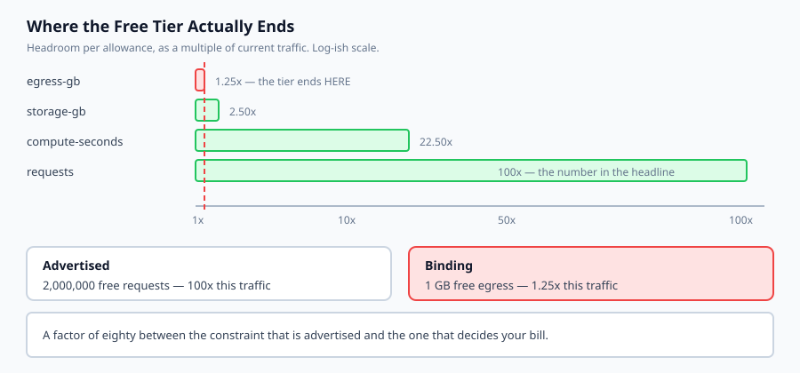
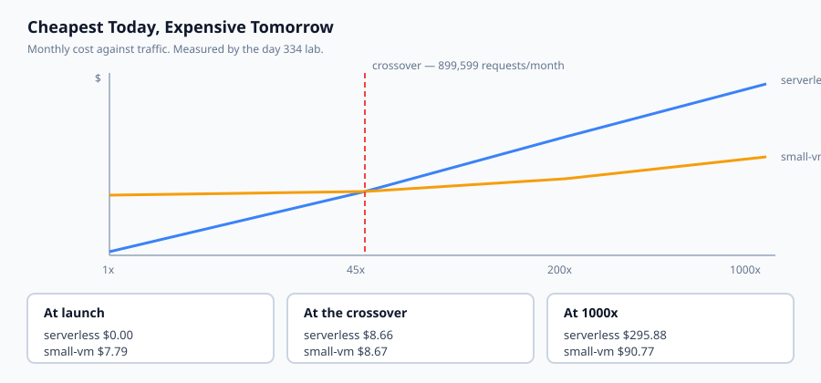

## Why this matters

You have a container and you know how to orchestrate it. The remaining question is where it runs and what that costs, and the honest answer is that the cheapest option today is frequently the wrong one, because "cheapest" changes with traffic and the crossover arrives sooner than anyone expects.

Here is the measurement from today's lab, on one small AI endpoint:

```text
launch (20k/mo)      serverless $0.00     small-vm $7.79
1000x (20M/mo)       serverless $295.88   small-vm $90.77
```

Free against $7.79 at launch. Three times more expensive at scale. The ranking changes at **899,599 requests a month**, which is a small service — a few thousand users being mildly enthusiastic.

And the free tier itself is not where the marketing says. It advertises two million free requests, a hundred times this workload's traffic. It ends at **1.25x**, because the egress allowance is a single gigabyte. The advertised constraint and the binding constraint differ by a factor of eighty, and no pricing page prints the second one.

That is the shape of nearly every free tier: generous on the dimension in the headline, tight on one that is not.



## The idea in plain language

Four things decide a hosting bill, and only the first appears on the front page.

**Compute**, billed one of two ways. An **always-on** option — a VM — bills by the hour whether or not anyone is using it. A **per-request** option bills for compute actually consumed and costs *nothing* at zero traffic. That difference is the whole decision, because it means the ranking is a function of traffic rather than a fixed preference.

**Egress**, per gigabyte leaving the provider. This is the line that surprises people. At scale it frequently exceeds compute, and free tiers rarely include much of it.

**Idle**, which is not a line item but a property. A VM at 3am with no users costs exactly what it costs at noon. Scale-to-zero is the only thing that makes idle free, and it is why serverless wins so decisively at launch.

**Storage**, small and steady and forgotten entirely until someone reads a bill line by line.

The useful question is not "which is cheapest". It is **"at what traffic does the ranking change"** — and, for a free tier, **"which allowance runs out first"**. Both are computable from published rate cards with arithmetic, which is what today's lab does.

## Historical background

### Hourly billing, EC2 2006

Amazon's original insight was renting a machine by the hour rather than the year. Utility pricing turned a capital purchase into an operating cost, and made a startup's infrastructure spend proportional to its ambition rather than its funding round.

### Per-second billing, 2017

Providers moved from hourly to per-second granularity within months of each other. It mattered most for short-lived and bursty workloads, and it was the pricing change that made autoscaling economically sensible rather than merely possible.

### Scale-to-zero, AWS Lambda 2014 onward

The genuinely new idea: pay nothing when nothing is happening. For a service with uneven traffic — which describes most AI side projects and a great many internal tools — this is a categorical change rather than a discount.

### Egress pricing, and the pressure on it

Egress has been priced far above its marginal cost for two decades, and it is the primary mechanism of cloud lock-in: moving data out is expensive by design. Cloudflare's R2 launched with zero egress in 2021, the EU's Data Act obliged providers to remove switching charges, and in 2024 the major providers began waiving egress for customers leaving entirely. The pricing is under pressure and has not collapsed.

### The free tier as an acquisition channel

Free tiers are marketing with a budget, and they are shaped accordingly: generous where a developer will notice, tight where a growing service will hit them. Understanding that is not cynicism, it is how to read the offer accurately.

## What it is — and what it is not

Choosing a hosting option is a cost, capacity and blast-radius decision made under uncertainty about growth.

### What it is

It is **traffic-dependent**. Any answer that does not name a traffic level is incomplete.

It is **reversible, at a price**. Moving is work, and egress charges make moving data the expensive part.

It is **a decision with a horizon**. Cheapest for the next three months and cheapest for the next three years are frequently different options.

### What it is not

It is not a permanent commitment. The crossover analysis exists so you can plan the move rather than be surprised by it.

It is not decided by price alone. A cheap option that cannot serve your load is not cheap, which is why today's model is explicit about what it does not check.

It is not a free tier's headline number. That is the one dimension chosen to be generous.

## Why it was created and what problems it solves

**Capital expenditure for uncertain demand.** *Solution: rent by the hour.*

**Paying for idle capacity overnight.** *Solution: scale-to-zero billing.*

**Bills that arrive as a single number.** *Solution: separate compute, egress and storage, because they scale differently and only one of them is on the front page.*

**Free tiers that end without warning.** *Solution: compute headroom per dimension and find the binding constraint before you deploy.*

**Choosing a host once and discovering the mistake at scale.** *Solution: find the crossover, and treat it as a planned migration rather than a surprise.*



## How it works

**Describe the workload**, not the machine: requests per month, seconds of compute each, bytes out each, gigabytes stored.

**Price compute according to the billing model.** Always-on is `hourly × 730` and ignores the workload entirely. Per-request is billed seconds plus billed requests, each after its own free allowance.

**Price egress**, deducting the free allowance, then multiplying the remainder.

**Price storage**, the same way.

**Compute headroom per dimension** — the free allowance divided by current usage. A dimension you do not use at all has infinite headroom.

**Take the minimum.** The free tier ends when the *first* allowance runs out, not the advertised one. This single step is the difference between reading a pricing page and understanding it.

**Bisect for the crossover.** Scale the workload and find where two options change places. `None` is a legitimate answer meaning the ordering never changes, which tells you the choice is insensitive to growth.

## An everyday analogy

Think about a gym membership against paying per visit.

Pay-per-visit costs nothing in a month you do not go. The membership costs the same whether you attend twenty times or none, including in August when you are away — that is the always-on VM at 3am.

Nobody argues about which is *better*; they ask **how many visits a month makes the membership worth it**. That number is the crossover, and it is the only useful form the question takes.

Now the free tier. The gym offers a free trial advertising *unlimited classes* — the headline, and genuinely generous. What it does not advertise is that the free trial includes two towels. You are a person who showers twice a visit. Your trial ends on towels, at a fraction of the class limit, and the leaflet does not mention towels at all.

That is the egress allowance, exactly.

## Examples in practice

The measured output from today's lab. One AI endpoint, four hosting options, three traffic levels:

```text
--- launch: 20,000 requests/month ---
  serverless-free-tier   $     0.00   compute $  0.00  egress $  0.00  FREE
  small-vm               $     7.79   compute $  7.59  egress $  0.00
--- 1000x: 20,000,000 requests/month ---
  serverless-free-tier   $   295.88   compute $194.88  egress $ 95.88
  small-vm               $    90.77   compute $  7.59  egress $ 63.00
```

Look at the VM's compute column: `$7.59` at both traffic levels. That is the definition of always-on billing, and it is why the VM wins at scale — its compute cost does not move.

Look at the egress column at 1000x: `$63.00` against `$7.59` of compute. **Egress is eight times compute**, on a service whose responses are forty kilobytes. Nobody chooses a host on egress and almost everybody should look at it.

```text
--- where the free tier ends, and why ---
  serverless-free-tier   free until 1.30x  binds on egress-gb at 1.25x

  the headline allowance is rarely the one that runs out first:
      egress-gb          1.25x current load
      storage-gb         2.50x current load
      compute-seconds   22.50x current load
      requests         100.00x current load
```

This is the table worth carrying away. Two million free requests sounds enormous and *is* enormous — a hundred times current traffic. The tier ends at 1.25x on a dimension the marketing never mentions.

```text
--- where the ranking changes ---
  serverless-free-tier stops beating small-vm at 45.0x (899,599 requests/month)
    at that point: serverless $8.66 vs vm $8.67
```

Under a million requests a month. If your service works at all, you will pass this, and the right response is not regret — it is to know the number in advance and treat the move as scheduled work.

One honest note: the demo reports the tier free until 1.30x while the binding constraint is 1.25x. The gap is rounding — a fraction of a gigabyte of egress costs under a cent and displays as `$0.00`. The binding constraint is the figure to trust.

## Implications: security, privacy, performance, scalability, and cost

**Security.** The risk of this day is not in the code, it is the account you create twenty minutes later. Enable MFA before anything else; create a budget alert before you deploy anything; and never leave a long-lived access key on a laptop. An account with a free tier and a card attached is an attractive target precisely because the attacker's spending is capped by your card rather than by the free allowance.

**Egress has a security dimension.** An attacker who can make your service return large responses is spending your egress budget, and rate limits usually count requests rather than bytes. If a response size can be influenced by input, cap the bytes too.

**Privacy and jurisdiction.** Where the region is decides which law applies. This is a compliance question that looks like a dropdown, and it is much cheaper to answer before the data exists.

**Performance.** Serverless platforms have cold starts, which for a model that must be loaded can be seconds rather than milliseconds. That is a latency decision the cost model says nothing about.

**Capacity, which this model does not check.** The lab will happily quote a single 1 vCPU VM at $90.77 for twenty million requests a month, which that machine could not deliver. Cost is one input; capacity, reliability and blast radius are others.

## Alternatives: free, open source, and commercial

**Serverless containers** — Cloud Run, Fargate, Container Apps, Fly Machines. Scale to zero, per-request billing, no cluster. The right default for a stateless inference endpoint with uneven traffic.

**Function platforms** — Lambda, Cloudflare Workers, Deno Deploy. Generous free tiers and tight limits on execution time and memory. Cloudflare's zero-egress pricing changes the arithmetic above materially.

**A small VM** — Hetzner, DigitalOcean, Lightsail, or a cloud instance. Predictable, cheap past the crossover, and yours to maintain. k3s on one of these is a legitimate production architecture for a small service.

**Managed Kubernetes** — GKE, EKS, AKS. Correct once you have several services and a team; expensive as a first deployment.

**Hugging Face Spaces** — free CPU tiers, paid GPU. The shortest path from a model to a URL, and worth knowing for demos.

**Self-hosting on hardware you own.** Zero marginal cost and all the operational burden. Sensible for a stable, known workload; a poor fit for anything spiky.

The honest default for a new AI service: a serverless container with a budget alert, and the crossover written down so the migration is planned rather than discovered.

## Comparison with related concepts

**Always-on versus per-request.** The former is predictable and pays for idle; the latter is proportional and has no ceiling. Neither is better — they are different shapes, and traffic decides which fits.

**Free tier versus free trial.** A tier is a permanent allowance; a trial is credit with an expiry date. Building on a trial produces a bill on a date you did not choose.

**Reserved versus on-demand versus spot.** Commitment for a discount, flexibility at full price, or a large discount with the risk of interruption. All three change the crossover, and none changes egress.

**Egress versus ingress.** Data in is usually free; data out is not. That asymmetry is deliberate and it is what lock-in is made of.

## When to use it — and when not to

**Start serverless when traffic is unknown or spiky.** Free at zero, and the cost of being wrong is small.

**Move to a VM once you pass the crossover** — and know the number before you pass it.

**Choose predictable billing when a surprise bill would be a real problem.** A capped VM is worse value on average and better at the tail, and for a student project that trade is usually right.

**Do not choose on the free tier's headline number.** Compute the binding constraint.

**Do not deploy anything without a budget alert.** A runaway loop against a paid API is Day 327's lesson; a runaway autoscaler is this one's.

**Do not treat the choice as permanent.** It is a decision with a horizon, and the horizon is computable.

## Knowledge check

1. Why does an always-on option's compute cost stay at $7.59 whether the service handles 20,000 or 20,000,000 requests a month?
2. The free tier advertises two million requests and ends at 1.25x current traffic. What happened?
3. At 1000x traffic the VM's egress is $63.00 against $7.59 of compute. What does that suggest about how hosting options should be compared?
4. Why is `None` a useful answer from `crossover` rather than a failure?
5. The model quotes a single 1 vCPU VM for twenty million requests a month. What is it not telling you?

## Hands-on exercise

You will price four hosting options against one workload, find each free tier's binding constraint, and bisect for the crossover.

Open `starter/hosting_cost.py` in the lab directory and implement the stubbed functions, then run the tests. No cloud account is used and nothing is spent.

### Expected output

Running `python3 examples/cost_demo.py` prices the options at three traffic levels:

```text
  the headline allowance is rarely the one that runs out first:
      egress-gb          1.25x current load
      requests         100.00x current load
--- where the ranking changes ---
  serverless-free-tier stops beating small-vm at 45.0x (899,599 requests/month)
```

Eighty times' difference between the advertised constraint and the binding one.

### Validate your work

Run `bash tests/run_tests.sh`. All twenty-four tests must pass.

Then check three things by inspection. An always-on option must cost the same at zero traffic as at full traffic — if it scales with usage, the entire comparison collapses. A per-request option must cost exactly zero at zero traffic, because that is what scale-to-zero means. And `binding_constraint` must return `egress-gb` rather than `requests`; returning the advertised allowance means `headroom` is not taking a minimum.

### Troubleshooting

**Free allowances go negative.** Clamp with `max(0.0, used - allowance)`, or an option under its free tier earns you money.

**`binding_constraint` returns the wrong dimension.** It must take the smallest headroom, not the largest or the first.

**`crossover` returns `None` unexpectedly.** Check you compare the ordering at the far end before bisecting.

**A dimension with no usage raises.** Zero usage means infinite headroom, not a division error.

### Common mistakes

Scaling an always-on cost by traffic, which is the one error that destroys the lesson.

Deducting a free allowance from the wrong quantity — seconds and requests are separate.

Comparing totals only. The breakdown is where egress becomes visible.

Believing the free tier's headline. It is the dimension chosen to be generous.

## Practice assignment

Add **capacity** to the model. Give each option a requests-per-second ceiling and make pricing refuse a workload the option cannot serve.

Then write a test showing what changes: the 1000x row should no longer quote `small-vm` at $90.77, because one vCPU cannot deliver twenty million requests a month. This removes the model's most misleading output.

The wider point is worth writing down while you do it. A model that answers confidently outside its valid range is more dangerous than one that refuses, because the confident wrong answer gets pasted into a decision document and nobody re-derives it.

## Extension challenge

Price **your own workload** with your provider's current rate card, and find your own binding constraint.

Measure rather than estimate: requests per month from your logs, response size from a real sample, compute time from a percentile rather than a mean. Then put in today's published prices — not the ones in this lab, which are representative and already ageing.

The output to look for is not the total. It is which allowance binds first, because that is the number that decides when your costs start, and it is almost never the one you would have guessed. Then compute your crossover and put the date you expect to reach it in a calendar, so that the migration is a scheduled piece of work rather than a surprise discovered in a billing alert.
