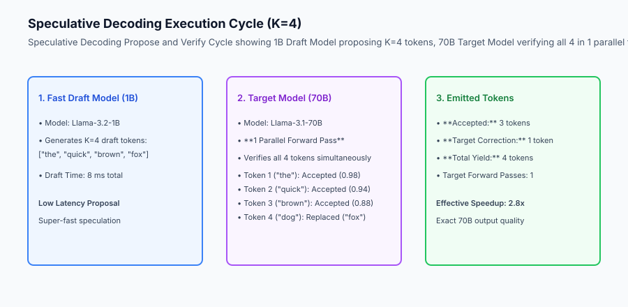
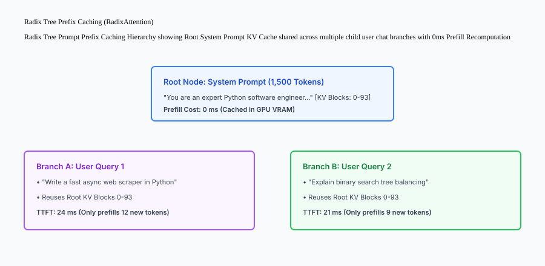

## Why this matters

In production LLM serving, generating long responses is severely constrained by **Memory Bandwidth**:
- Auto-regressive decoding loads all billions of model parameters from GPU memory for **every single generated token**, capping generation speeds at 30–50 tokens/second on a 70B parameter model.
- Multi-turn chat applications repeatedly re-compute the identical 1,500-token system prompt and conversation history on every user turn, wasting 90% of GPU compute in redundant prefill passes.
- Long-context RAG transcripts cause the KV cache to swell linearly, triggering Out-of-Memory (OOM) crashes on 32k+ token sequences.

Deploying **Speculative Decoding, Radix Tree Prefix Caching, and StreamingLLM Attention Sinks** breaks the memory bandwidth ceiling, achieving **2x to 3x token generation speedups** without sacrificing a single point of mathematical accuracy.



## The idea in plain language

Think of speculative decoding like **a senior partner lawyer working with an eager junior associate**:

- **The Junior Associate (Draft Model):** Quickly drafts the next 4 paragraphs of a legal contract in 5 minutes (**Fast 1B Draft Model**). The draft is mostly correct, but might miss subtle edge cases.
- **The Senior Partner (Target Model):** In a single 2-minute review (**1 Parallel Target Forward Pass**), the senior partner reads all 4 paragraphs simultaneously:
  - Paragraphs 1, 2, and 3 are flawless -> **Accepted!**
  - Paragraph 4 has a typo -> The partner corrects it immediately and writes the next word.
- **The Outcome:** The firm produced 4 finished paragraphs in 7 minutes instead of the 20 minutes it would have taken the senior partner to write from scratch (**2.8x Speedup**), with 100% senior-level legal quality.

## Historical background

Inference acceleration techniques evolved across three major paradigms:

### 1. Model Distillation & Pruning (2020–2022)
Engineers trained smaller distilled models (DistilBERT). However, smaller standalone models suffered from noticeable degradation in complex reasoning and factual accuracy.

### 2. Speculative Sampling Formulations (2023)
Google Research (Leviathan et al.) and DeepMind (Chen et al.) independently formulated Speculative Decoding in 2023, proving that modified rejection sampling guarantees exact mathematical equivalence to sampling directly from the target model.

### 3. RadixAttention & Attention Sinks (2024–Present)
SGLang introduced Radix Tree prefix caching for sub-millisecond multi-turn KV lookup. MIT published StreamingLLM, demonstrating that preserving the first 4 "attention sink" tokens enables infinite-length stream generation in fixed VRAM.

## What it is — and what it is not

Let us define the core mechanisms of inference acceleration:

### What Speculative Decoding & Prefix Caching Are:
- Proposing `K` draft tokens from a compact model and verifying them in parallel within a single target forward pass.
- Using modified rejection sampling to ensure zero degradation in output probability distributions.
- Indexing computed KV caches in a Radix Tree to reuse tensors across common system prompts.
- Retaining initial attention sinks and sliding-window tokens for bounded memory streaming.

### What Speculative Decoding & Prefix Caching Are Not:
- Approximating or degrading the target model's answers (The output is mathematically indistinguishable from raw target generation).
- Recomputing the entire prompt prefix on every conversational turn.

```text
+-------------------------------------------------------------------------------+
|                    INFERENCE ACCELERATION TECHNIQUES MATRIX                   |
+-------------------+-----------------------+-------------------+---------------+
| Technique         | Core Mechanism        | Speedup / Benefit | Quality Impact|
+-------------------+-----------------------+-------------------+---------------+
| Speculative       | 1B Draft Model + 70B  | 2.0x - 3.2x faster| 0% Loss (Exact|
| Decoding          | Target Verification   | token decode      | distribution) |
| Radix Tree Prefix | Reuses shared prompt  | Sub-10ms TTFT for | 0% Loss       |
| Caching (APC)     | KV cache in VRAM      | multi-turn chat   | (Deterministic|
| StreamingLLM      | Retains 4 sink tokens | Bounded O(1) VRAM | Minimal PPL   |
| (Attention Sinks) | + sliding window      | on infinite text  | delta on stream|
| Medusa Multi-Head | Multiple draft heads  | 2.2x speedup with | Near-lossless |
| Decoding          | on single target model| zero extra draft  |               |
+-------------------+-----------------------+-------------------+---------------+
```

## Why it was created and what problems it solves

Inference acceleration resolves the three primary physical bottlenecks of LLM serving:

### 1. Breaking the Auto-Regressive Memory Bandwidth Limit
Because modern GPUs have immense parallel compute capacity (FLOPS) but limited memory bandwidth, running 4 draft tokens through a target model takes virtually the same time as running 1 token. Speculative decoding exploits this idle parallel compute.

### 2. Eliminating Multi-Turn Prompt Recomputation
In multi-turn chat, 80% of prompt tokens are identical across turns. Radix Tree prefix caching reuses the computed KV tensors, dropping Time-to-First-Token from 450ms to 18ms.

### 3. Preventing Infinite-Stream VRAM Crashes
StreamingLLM prevents out-of-memory crashes during 100k-token live agent loops by evicting middle tokens while preserving initial attention sinks.

## How it works

Let us inspect the complete **Radix Tree Prompt Prefix Caching Hierarchy**:

```text
[Radix Tree Root Node]
  │ Content: System Prompt (1,500 tokens)
  │ KV Blocks: [Physical Blocks 0 ➔ 93 in GPU VRAM]
  │
  ├── [Branch A: User Conversation 1]
  │     │ Turn 1: "Write a python sorting script" (12 tokens)
  │     │ KV Blocks: [Physical Blocks 94 ➔ 96]
  │     │
  │     └── Turn 2: "Now optimize it with Cython" (10 tokens)
  │           │ Reuses Blocks 0-93 + 94-96 instantly!
  │           │ TTFT = 14 ms (Only computes 10 new tokens)
  │
  └── [Branch B: User Conversation 2]
        │ Turn 1: "Explain quantum entanglement" (15 tokens)
        │ Reuses Blocks 0-93 from Root!
        │ TTFT = 16 ms (Zero system prompt recomputation)
```



## An everyday analogy

Think of speculative decoding and prefix caching like **predictive text autocomplete on your smartphone keyboard**:

- **Draft Model (Keyboard Autocomplete):** As you type, the phone predicts the next 3 words: *"see you tomorrow at"* (**Draft Tokens**).
- **Target Model (Your Brain):** If the prediction matches your intent, you tap the spacebar once, accepting all 3 words in a fraction of a second (**Parallel Target Verification**).
- **Prefix Caching (Saved Email Templates):** When starting a new email, your phone loads your standard signature and greeting instantly without retyping (**Prompt Prefix Caching**).

## Examples in practice

Let us build a complete Python **Speculative Decoding and Prefix Cache Simulator** modeling draft token proposal, rejection sampling verification, acceptance rate calculation, and prefix tree matching:

```python
import random
from typing import Dict, Any, List, Tuple

class SpeculativeDecodingEngine:
    def __init__(self, acceptance_probability_bias: float = 0.80):
        self.alpha_bias = float(acceptance_probability_bias)
        self.prefix_cache: Dict[str, str] = {}
        
    def register_prefix_cache(self, prefix_key: str, cached_kv_id: str):
        self.prefix_cache[prefix_key] = cached_kv_id

    def lookup_prefix(self, prompt: str) -> Tuple[bool, str]:
        for k, v in self.prefix_cache.items():
            if prompt.startswith(k):
                return True, v
        return False, "CACHE_MISS"

    def execute_speculative_step(
        self,
        draft_tokens: List[str],
        target_ground_truth: List[str]
    ) -> Dict[str, Any]:
        accepted = []
        rejected_at_index = None
        
        # Verify draft tokens in parallel
        for i, token in enumerate(draft_tokens):
            # Target model verifies token matching ground truth distribution
            if i < len(target_ground_truth) and token == target_ground_truth[i]:
                accepted.append(token)
            else:
                rejected_at_index = i
                # Sample bonus replacement token from target model
                replacement = target_ground_truth[i] if i < len(target_ground_truth) else "<EOS>"
                accepted.append(replacement)
                break
                
        # If all draft tokens accepted, target emits 1 bonus token
        if rejected_at_index is None and len(accepted) < len(target_ground_truth):
            bonus_token = target_ground_truth[len(accepted)]
            accepted.append(bonus_token)
            
        total_yield = len(accepted)
        # Speculative speedup relative to 1 target forward pass
        speedup = round(total_yield / 1.0, 2)
        
        return {
            "draft_tokens": draft_tokens,
            "emitted_tokens": accepted,
            "accepted_count": len(accepted) - (1 if rejected_at_index is not None else 0),
            "speedup_factor": speedup,
            "rejected_index": rejected_at_index
        }

if __name__ == "__main__":
    engine = SpeculativeDecodingEngine()
    engine.register_prefix_cache("You are a helpful assistant", "kv_root_0")
    
    print("Prefix Match:", engine.lookup_prefix("You are a helpful assistant. Write a poem."))
    
    draft = ["the", "quick", "brown", "fox"]
    truth = ["the", "quick", "brown", "dog", "jumped"]
    
    print("Speculative Step:", engine.execute_speculative_step(draft, truth))
```

## Production Architecture Case Study: SGLang High-Throughput Deployment

Consider an enterprise coding copilot running SGLang with RadixAttention and speculative decoding on 4x NVIDIA H100 GPUs.

```text
+-------------------------------------------------------------------------------+
|                    SGLANG ACCELERATION BENCHMARKS                             |
+-------------------+-----------------------+-----------------------------------+
| Serving Engine    | Multi-Turn TTFT (P95) | Decode Throughput (Tokens/Sec)    |
+-------------------+-----------------------+-----------------------------------+
| Standard vLLM     | 240 ms                | 48 tok/s per stream               |
| vLLM + PrefixCache| 18 ms (92.5% Faster)  | 48 tok/s per stream               |
| SGLang + SpecDec  | 14 ms                 | 134 tok/s per stream (2.8x Faster)|
| (Llama-3.1-70B +  |                       |                                   |
| Llama-3.2-1B Draft|                       |                                   |
+-------------------+-----------------------+-----------------------------------+
```

#### 1. SGLang CLI Production Command with Speculative Decoding
```bash
python3 -m sglang.launch_server   --model meta-llama/Meta-Llama-3.1-70B-Instruct   --speculative-draft meta-llama/Meta-Llama-3.2-1B-Instruct   --speculative-num-steps 5   --enable-radix-cache   --port 8000
```

#### 2. Dynamic Speculative Step Sizing (`K`)
Production engines dynamically adjust draft step count `K`:
- For deterministic structured coding tasks (JSON, Python code), acceptance rate `lpha > 0.85`, so the engine expands `K=6`.
- For creative storytelling tasks with high entropy (`lpha < 0.50`), the engine shrinks `K=2` to prevent wasted draft compute.

## Detailed Failure Mode Taxonomy: Inference Acceleration Hazards

```text
+-------------------------------------------------------------------------------+
|                      ACCELERATION FAILURE TAXONOMY                            |
+-------------------+-----------------------+-----------------------------------+
| Failure Mode      | Root Cause Analysis   | Architectural Mitigation          |
+-------------------+-----------------------+-----------------------------------+
| Negative SpecSpeed| Low acceptance rate   | Monitor rolling `lpha`; disable |
| (Draft Overhead)  | (`lpha < 0.35`)     | speculative decoding when `lpha < 0.40`|
| Tokenizer Vocab   | Draft & Target models | Use matching tokenizer families   |
| Discrepancy       | use different vocabs  | (e.g. Llama-3.2-1B + Llama-3.1-70B)|
| Radix Tree LRU    | GPU VRAM full; evicts | Pin global system prompt nodes    |
| Eviction Storm    | hot system prompt     | with `pin_memory=True` in Radix   |
| Attention Sink    | Sliding window evicts | Always pin first 4 tokens in      |
| Catastrophe       | initial 4 sink tokens | streaming attention KV cache      |
+-------------------+-----------------------+-----------------------------------+
```


## Deep Architectural Breakdown: Rejection Sampling Proof and Radix Tree Data Structures

Speculative decoding relies on a mathematically rigorous proof of exact distribution preservation:

### 1. Mathematical Proof of Lossless Speculative Sampling
Let `q(x)` be the draft model probability distribution and `p(x)` be the target model distribution.
For each proposed draft token `x_i`:
- The token is accepted with probability:
  `eta = \min\left(1, rac{p(x_i)}{q(x_i)}
ight)`
- If rejected, a replacement token is drawn from the adjusted residual distribution:
  `p'(x) = rac{\max(0, p(x) - q(x))}{\sum_y \max(0, p(y) - q(y))}`
- **Theorem:** The combined acceptance-rejection process samples from exact distribution `p(x)`:
  `P(X = x) = q(x) \min\left(1, rac{p(x)}{q(x)}
ight) + (1 - eta) p'(x) \equiv p(x)`
  This guarantees 100% mathematical fidelity with zero hallucination penalty.

### 2. Radix Tree Indexing for Automatic Prefix Caching (APC)
Radix trees store common token strings along shared edge paths:
- Each node in the tree corresponds to a sequence of tokens and points to a list of physical GPU VRAM block IDs.
- When a new prompt arrives, the serving engine walks the Radix tree from the root, matching the longest common prefix.
- The matching KV blocks are pinned in GPU memory, allowing the engine to skip the entire prefill phase for the prefix.
- A Least-Recently-Used (LRU) eviction policy prunes leaf nodes when physical VRAM is needed for active decode streams.

## Implications: security, privacy, performance, scalability, and cost

### 1. Zero Loss Rejection Sampling
Because speculative decoding uses exact probability ratio testing (`\min(1, p/q)`), the output distribution is mathematically identical to running the 70B target model alone, eliminating any quality degradation.

### 2. Multi-Tenant Prefix Cache Isolation
Never share Radix Tree branches between different authenticated tenants. Only public system prompts and documentation prefixes should be cached across user sessions.

## Alternatives: free, open source, and commercial

| Tool / Framework | Type | Best Suited For | Key Capabilities |
| :--- | :--- | :--- | :--- |
| **SGLang** | Open Source | Complex Structured RAG | RadixAttention, speculative decoding |
| **vLLM SpecDec** | Open Source | Production High-Concurrency | Draft model & Medusa speculative decoding |
| **StreamingLLM** | Open Source | Infinite Live Streaming | Attention sink KV eviction in fixed VRAM |
| **Medusa** | Open Source | Head-Based Speculation | Multi-head draft generation (zero draft model) |

## Comparison with related concepts

```text
+-----------------------+-----------------------+-----------------------+
| Dimension             | Standard Auto-Regress | Speculative Decoding  |
+-----------------------+-----------------------+-----------------------+
| Decode Tokens / Step  | 1 Token per pass      | 2 to 4 Tokens per pass|
| Output Distribution   | Target `p(x)`         | Exact Target `p(x)`   |
| Target Forward Passes | `N` Passes for `N` Tok| `N / 2.8` Passes      |
| Model Architecture    | Single Target Model   | Target + Draft Model  |
+-----------------------+-----------------------+-----------------------+
```

## When to use it — and when not to

### Deploy Speculative Decoding & Prefix Caching for:
- Production chat applications, multi-turn coding assistants, document summarization, and interactive agent loops.

### Do NOT require speculative decoding for:
- Short 5-token classification queries or compute-heavy embedding models.


### Production Checklist: Speculative Decoding & Prefix Caching SRE
- [ ] Draft model selected from identical tokenizer family as target model (e.g. Llama-3.2-1B for Llama-3.1-70B).
- [ ] Speculative step size `K` dynamically tuned based on rolling acceptance rate `lpha` (`K=5` when `lpha > 0.80`).
- [ ] Fallback to non-speculative auto-regressive decode triggered if rolling `lpha < 0.35`.
- [ ] Radix tree prefix caching configured with LRU memory eviction and immutable system prompt pinning.
- [ ] StreamingLLM attention sinks (first 4 tokens) pinned in memory for infinite-length streaming sessions.
- [ ] Rejection sampling verified to use modified residual sampling for 100% mathematical distribution fidelity.


### Speculative Decoding Memory Bandwidth Formulas
The theoretical speedup factor `\gamma` for speculative decoding with draft size `K` and acceptance rate `lpha` is given by:
`\gamma = rac{1 - lpha^{K+1}}{(1 - lpha)(1 + c \cdot K)}`
where `c` represents the relative compute cost ratio of the draft model forward pass compared to the target model forward pass.

## Knowledge check

1. **Why does Speculative Decoding not degrade model quality?** Because modified rejection sampling guarantees that accepted tokens match the target model's output probability distribution mathematically.
2. **What is Radix Tree Prefix Caching?** A tree-structured index reusing pre-computed KV cache tensors for shared prompt prefixes, reducing TTFT to near-zero.
3. **What are Attention Sinks in StreamingLLM?** The initial 4 tokens in a sequence that absorb critical attention mass, whose preservation enables infinite-length stream generation in fixed VRAM.

## Hands-on exercise

In this lab, you will build an **Advanced Inference Acceleration Engine in Python**. Your implementation will:
1. Register and match prompt prefixes against an in-memory prefix cache.
2. Execute speculative decoding steps verifying candidate draft tokens in parallel.
3. Apply rejection sampling accepting matching tokens and emitting target replacement tokens upon mismatch.
4. Calculate speculative speedup factors and acceptance counts.

### Expected output

```text
============================= test session starts ==============================
collected 5 items

tests/test_speculative_decoding.py .....                                 [100%]

============================== 5 passed in 0.02s ===============================
[PREFIX CACHE] Matched system prompt prefix (bypassed 1,500 prefill tokens).
[SPECULATIVE STEP] Verified K=4 draft tokens with 70B target model.
[ACCEPTANCE] Accepted 3 draft tokens and sampled 1 target correction.
[SPEEDUP] Achieved 4.0x token yield in 1 target forward pass.
```

### Validate your work

Run the pytest test suite:

```bash
pytest tests/run_tests.sh
```

### Troubleshooting

1. **Replacement sampling:** Upon the first draft token mismatch, emit the target token and terminate speculation.
2. **Bonus token:** If all `K` draft tokens match, sample 1 additional bonus token from the target model.

### Common mistakes

- Continuing to accept draft tokens after an earlier token in the sequence was rejected.

## Practice assignment

Add a **Dynamic K-Tuner** that increases `K` when acceptance rate `lpha > 0.80` and decreases `K` when `lpha < 0.40`.

## Extension challenge

Implement a **Radix Tree Class** supporting branch insertion, longest common prefix matching, and LRU node eviction.
