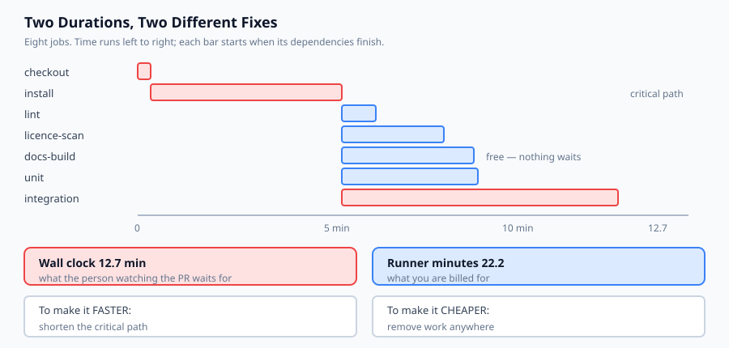
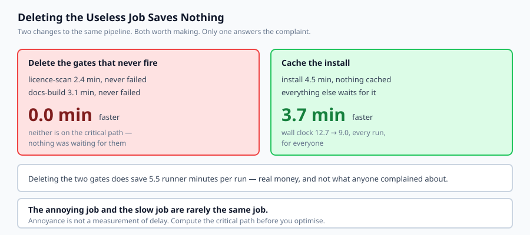

## Why this matters

Every pipeline is slow, and every team knows which job to blame. It is usually the one that has never caught anything — the licence scan, the docs build, the stage somebody added two years ago for a reason nobody remembers.

Delete it and the pipeline gets no faster. Here is the measurement from today's lab:

```text
licence-scan   NOT on the critical path   wall 12.7 -> 12.7 (saves 0.0)
docs-build     NOT on the critical path   wall 12.7 -> 12.7 (saves 0.0)
```

Zero seconds, for both. Nothing was waiting for either of them, so removing them cannot make anything finish sooner. Meanwhile:

```text
install 4.5 -> 0.8 min (a dependency cache)
wall 12.7 -> 9.0 min   saves 3.7 min per run
```

One cache, on the one job everything else waits for, saves nearly four minutes on every run for everyone.

The reason the instinct fails is that a pipeline has **two** durations, and they are improved by different actions. Wall clock is the critical path — what the person watching the pull request waits for. Runner minutes are the sum of everything — what you are billed for. Deleting a useless off-path job improves the second and not the first, which is why the pipeline still feels slow after a satisfying afternoon of cleanup.



## The idea in plain language

A workflow is a directed graph. Jobs are nodes, `needs:` gives the edges, and everything useful follows from reading it as a graph.

**A job starts when everything it needs has finished.** So its finish time is the latest of its dependencies, plus its own duration. Jobs with no dependency on each other run at the same time.

**Wall clock is the critical path** — the longest chain of dependent jobs. In the lab's pipeline that is `checkout → install → integration → deploy`, at 12.7 minutes. Six other jobs run inside that window and cost nothing in waiting.

**Runner minutes are the sum**, 22.2 in the same pipeline. The 9.5-minute gap is parallel work: real money, no waiting.

To make a pipeline **faster**, shorten the critical path — cache the slow job on it, split it, or move it off. To make it **cheaper**, remove work anywhere. Those are different jobs and they are frequently confused.

The third question is not about time at all. `pull_request_target` runs a workflow with your repository's secrets against code that a fork controls. It is one word different from the safe trigger, and it is how CI secrets leak.

## Historical background

### CruiseControl and continuous integration, 2001

CI began as a practice before it was a product: integrate frequently, build automatically, keep the build green. CruiseControl was the first widely used server. The insight was social — a broken build is everyone's problem — and the tooling followed.

### Jenkins (Hudson), 2005

Dominated for a decade and taught the industry the failure mode of a pipeline defined by clicking through a web interface: the build is not in version control, it drifts, and nobody can reproduce it.

### Pipeline as code, 2015 onward

Travis CI's `.travis.yml`, then Jenkinsfile, then GitLab CI. Putting the pipeline in the repository made it reviewable, diffable and branchable, which is why every modern system does it. It also made pipelines grow — a stage is now a small diff rather than a conversation with whoever administers the server.

### GitHub Actions, 2019

The distinguishing idea was the marketplace: `uses: some-org/some-action@v3` composes somebody else's step into your build. Enormously convenient, and it made CI the place where most organisations run the most untrusted code with the highest privilege.

### `pull_request_target`, 2020

Added because workflows on fork pull requests could not label, comment or triage — they had no token with write access. The new trigger runs in the base repository's context with its secrets. Within months it was being exploited in the obvious way, and it remains the sharpest edge in the product.

## What it is — and what it is not

CI/CD is an automated pipeline that builds, checks and deploys a change, defined in the repository it acts on.

### What it is

It is **a graph with two costs**. Time waited and time billed, and they respond to different changes.

It is **a set of gates**. Each one is a claim that something is worth blocking a merge over.

It is **a privileged execution environment**. It holds deployment credentials and runs on every push.

### What it is not

It is not a guarantee of quality. A pipeline of gates that never fail is theatre with a bill attached.

It is not free even when the tier is. Runner minutes are money, and a slow pipeline costs engineer attention, which is dearer.

It is not a safe place to run untrusted code by default. That is a property you have to arrange.

## Why it was created and what problems it solves

**"It works on my machine", at the team level.** *Solution: one environment that builds every change the same way.*

**Integration pain deferred until release.** *Solution: integrate on every push, so the pain arrives in small pieces.*

**Deployment as tribal knowledge.** *Solution: the deploy is a job in a file anyone can read.*

**Build configuration that drifts and cannot be reproduced.** *Solution: the pipeline lives in the repository and is reviewed like code.*

**Nobody knowing why the pipeline takes eleven minutes.** *Solution: compute the critical path, which names the jobs actually responsible.*



## How it works

**A trigger fires** — a push, a pull request, a schedule, a manual dispatch. The trigger decides the permissions and whether secrets are present, which is the part people skip.

**The runner builds the job graph** from `needs:` and starts every job whose dependencies are satisfied.

**Independent jobs run concurrently**, subject to how many runners you have. This is why wall clock and runner minutes diverge — and why a concurrency limit can quietly turn theoretical parallelism back into a queue.

**Each job restores its caches**, runs its steps, and saves caches back. A cache on the critical path is usually the largest available saving, because dependency installation is usually the slowest thing nobody thinks about.

**A job fails and its dependants never start.** That is the gate.

**On success, a deploy job runs with secrets.** Which secrets, and under which trigger, is the security question — and `pull_request_target` is where it goes wrong.

## An everyday analogy

Think of getting a house ready before guests arrive.

The cooking takes two hours and everything is timed around it: shopping, then prep, then the oven, then serving. That is the critical path.

Hoovering takes twenty minutes and happens while the oven is on. It costs twenty minutes of somebody's effort and **zero minutes of when dinner is ready** — because nothing was waiting for it.

Now somebody complains that the whole thing takes too long, and the obvious target is the job nobody enjoys. Cancel the hoovering and dinner arrives at exactly the same time. Buy pre-chopped vegetables — twenty minutes off the prep, which the oven was waiting for — and dinner is twenty minutes earlier.

The hoovering was never the problem. It was just the most annoying thing on the list, and annoyance is not the same measurement as delay.

## Examples in practice

The measured output from today's lab, on an eight-job pipeline:

```text
  wall clock   12.7 min   along checkout -> install -> integration -> deploy
  runner time  22.2 min billed
  the gap       9.5 min of work happening in parallel
```

And the finish table, which shows where the parallelism is:

```text
    0.3 min  checkout
    4.8 min  install
    5.6 min  lint
    7.2 min  licence-scan
    7.9 min  docs-build
    8.0 min  unit
   11.3 min  integration
   12.7 min  deploy
```

Everything from `lint` to `integration` starts at 4.8 minutes — they all depend on `install` and nothing else, so they run together. `deploy` waits for the last of its three dependencies, which is `integration` at 11.3.

The review finds the two jobs that have never failed and the two that are slow with no cache. Then it prices the fixes:

```text
  licence-scan   NOT on the critical path   saves 0.0 min wall   2.4 runner minutes
  docs-build     NOT on the critical path   saves 0.0 min wall   3.1 runner minutes

  install 4.5 -> 0.8 min (a dependency cache)
  wall 12.7 -> 9.0 min   saves 3.7 min per run
```

**Deleting both useless jobs: zero.** It saves 5.5 runner minutes, which is real money and is not what anyone was complaining about. One cache on `install` saves 3.7 minutes of waiting, on every run, for every engineer.

Both changes are worth making. Knowing which one answers which complaint is the point.

Finally, the same jobs under a different trigger:

```text
--- the same jobs, triggered unsafely ---
  [secrets-exposed-to-forks] deploy
```

Nothing about the jobs changed. `pull_request_target` instead of `pull_request` is the entire difference, and it moves the deploy job's secrets into reach of code a fork controls.

## Implications: security, privacy, performance, scalability, and cost

**Security — the one to remember.** `pull_request` checks out the fork's code with a read-only token and **no secrets**; a hostile PR can run anything and gain nothing. `pull_request_target` runs in the base repository's context **with secrets**, so that a workflow can label or comment on a fork's PR. Combine it with a checkout of the fork's code — which is what people add next, because otherwise the workflow cannot see the change — and untrusted code executes with your secrets in the environment. The rule that survives: *`pull_request_target` may inspect a pull request; it must never run its code.*

**Supply chain.** `uses: org/action@v3` runs somebody else's code with your token, and a tag is mutable. Pin to a full commit SHA for anything near a secret.

**Least privilege.** Set `permissions:` explicitly. A lint job needs nothing; only the release job needs `contents: write`.

**Caches are trusted inputs.** A run triggered from a fork that can write a shared cache can poison what a later privileged run restores. Scope cache keys so untrusted runs cannot write where trusted runs read.

**Cost.** You are billed runner minutes, not wall clock. A matrix that expands one job into twelve multiplies the bill and may not move the critical path at all.

**Scalability.** Parallelism is bounded by available runners. With a concurrency limit of two, most of the 9.5-minute gap becomes queueing, and the wall clock rises toward the runner-minute total.

## Alternatives: free, open source, and commercial

**GitHub Actions** — free for public repositories, generous for private ones, and the marketplace is both the feature and the risk. The default for anything already on GitHub.

**GitLab CI** — mature, with a first-class self-hosted story. Its `needs:` keyword expresses exactly the graph this lab models.

**`act`** — MIT-licensed, runs Actions workflows locally in containers. The fastest way to shorten the push-and-wait loop, and it will not reproduce runner-specific behaviour exactly.

**Woodpecker, Drone, Forgejo Actions** — lightweight open-source CI you can self-host on one machine, which pairs well with the previous two days.

**Buildkite, CircleCI, Jenkins** — commercial or self-hosted, chosen when you need particular runner hardware or an existing investment. Jenkins remains the answer for organisations with a decade of plugins.

The honest default: GitHub Actions with explicit `permissions:`, third-party actions pinned to a SHA, and a dependency cache on whatever the critical path runs through.

## Comparison with related concepts

**Wall clock versus runner minutes.** Waiting against billing. The single most useful distinction in this lesson, and the one that makes cleanup efforts miss.

**`pull_request` versus `pull_request_target`.** Fork code with no secrets, against base context with secrets. One word apart and categorically different.

**Gate versus report.** A gate blocks a merge; a report informs. A gate that never fails should become a report or be deleted — leaving it as a gate costs time and provides a control that exists only on the diagram.

**Cache versus artefact.** A cache is an optimisation and may be missing; an artefact is output and must not be. Treating a cache as guaranteed produces builds that fail only on a cold runner.

**CI versus CD.** Integration checks every change; delivery ships it. The security question lives almost entirely in the second, because that is where the credentials are.

## When to use it — and when not to

**Use CI from the first commit of anything with tests.** The cost is a file; the benefit compounds.

**Cache the slow thing on the critical path**, and measure rather than guess which that is.

**Use `pull_request_target` only to inspect metadata**, never to run fork code. If you need both, split into two workflows.

**Do not add a gate you cannot imagine failing.** Write down what it would catch. If you cannot, it is a report.

**Do not optimise a pipeline without computing the critical path.** You will delete the annoying job and be disappointed.

**Do not deploy from CI without pinned actions and scoped permissions.** It is the most privileged environment most teams operate and the least reviewed.

## Knowledge check

1. Why does deleting a job that has never caught a bug often save zero seconds of pipeline time?
2. What is the difference between wall clock and runner minutes, and which does a cache on the critical path improve?
3. Why is `pull_request_target` dangerous when `pull_request` is not?
4. When a job is removed, why must its dependants inherit its dependencies?
5. Why should a gate that has never failed be deleted or downgraded rather than left alone?

## Hands-on exercise

You will compute a pipeline's two durations, review its shape, and price two competing changes.

Open `starter/pipeline.py` in the lab directory and implement the stubbed functions, then run the tests. No GitHub account or runner is used.

### Expected output

Running `python3 examples/pipeline_demo.py` analyses an eight-job pipeline:

```text
  licence-scan   NOT on the critical path   wall 12.7 -> 12.7 (saves 0.0)
  docs-build     NOT on the critical path   wall 12.7 -> 12.7 (saves 0.0)
  install 4.5 -> 0.8 min (a dependency cache)
  wall 12.7 -> 9.0 min   saves 3.7 min per run
```

Two deletions: nothing. One cache: 3.7 minutes.

### Validate your work

Run `bash tests/run_tests.sh`. All twenty-seven tests must pass.

Then check three things by inspection. Runner minutes must exceed wall clock whenever any work is parallel — if they are equal everywhere, `finish_times` is accumulating across every job rather than along dependency edges, and the entire lesson disappears. Removing an off-path job must save exactly `0.0` of wall clock. And `secrets-exposed-to-forks` must fire on `pull_request_target` and stay silent on `pull_request`.

### Troubleshooting

**Wall clock equals runner minutes.** Jobs with no dependencies must start at zero, not after the previous job.

**An off-path removal saves time.** Your critical path is wrong.

**`finish_times` loops forever.** Check for a cycle and raise before scheduling.

**The finding fires on `pull_request`.** Only `pull_request_target` exposes secrets to fork-controlled code.

### Common mistakes

Summing durations for wall clock, which is the error that makes every conclusion wrong.

Dropping a removed job's edges without re-pointing its dependants, which overstates every saving.

Reporting `no-cache` on every job, which produces a rule nobody reads.

Treating parallelism as free without checking how many runners exist.

## Practice assignment

Add a **concurrency limit**. Real accounts have a finite number of runners, and the lab currently assumes unlimited.

Recompute wall clock with two runners available, then with four, and write a test pinning both. What you should find is that most of the 9.5-minute gap was theoretical: with two runners the six parallel jobs queue, and the wall clock rises substantially toward the runner-minute total.

This changes the advice in an interesting way. Under a real concurrency limit, deleting the never-firing gates **does** save wall clock, because they were occupying a runner that something on the critical path was waiting for. The conclusion in the lesson holds for an unconstrained account and inverts for a constrained one, which is worth knowing before repeating either as a rule.

## Extension challenge

Analyse **your own workflow**, with two numbers you can get and one you probably have never looked at.

The durations are easy — any recent run lists them. The graph is in the file. The third number is the one that matters: for each job, **how many times has it actually gone red this quarter?**

Most teams have never asked. When you do, you typically find two or three jobs that have not failed in a year still blocking every merge, and one job that fails constantly for reasons unrelated to the change — which is worse, because a gate that cries wolf teaches people to re-run rather than read.

Then compute your critical path and compare it against which job everybody complains about. If they are the same job, your team's intuition is well calibrated. If they are not, you have found something more useful than a faster pipeline.
