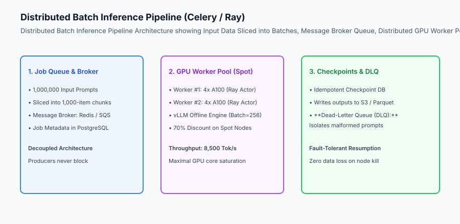
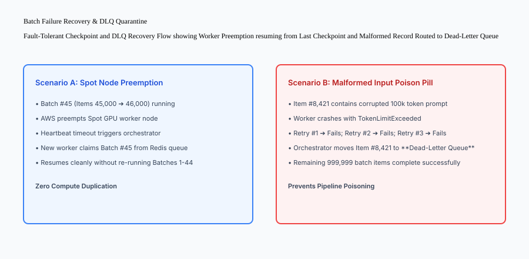

## Why this matters

When companies need to process millions of documents (e.g. summarizing 5 million customer support tickets, generating embeddings for 10 million catalog items, or classifying 50 million legal filings), sending individual HTTP requests to online real-time APIs is an operational disaster:
- **Catastrophic Cloud Costs:** Paying standard on-demand API rates for 10 million requests costs **`20,000 to `100,000+**, when offline batch APIs offer guaranteed 50% discounts.
- **Connection Drop Failures:** A network hiccup on hour 6 of a script terminates the run, leaving data in an unknown half-processed state.
- **Poison Pill Stalls:** A single malformed input with 50,000 tokens crashes the GPU worker, causing naive scripts to get trapped in infinite retry loops.

Architecting **Fault-Tolerant Distributed Batch Inference Pipelines** (Celery/Ray Data, Redis brokers, idempotent checkpoint databases, Spot GPU pools, and Dead-Letter Queues) enables processing millions of items with 70% lower compute costs and zero data loss.



## The idea in plain language

Think of batch inference like **an industrial commercial laundry facility compared to a residential home washing machine**:

- **Online Real-Time Serving (Home Washing Machine):** You wash one shirt as fast as possible so you can wear it immediately (**Sub-second Latency, Expensive & Inefficient per Item**).
- **Offline Batch Processing (Industrial Laundry):** The facility collects 5,000 hotel towels in massive bins (**Batch Chunks**), loads them into gigantic industrial washers running at midnight when electricity is 70% cheaper (**Spot GPUs & 50% Discount Batch API**), and automatically sets aside stained towels into a separate repair bin (**Dead-Letter Queue**).
- **The Clipboard (Idempotent Checkpointing):** The shift supervisor checks off each finished pallet of laundry on a master log sheet (**Checkpoint DB**). If the power blinks off, they resume with Pallet 42 without re-washing Pallets 1 through 41.

## Historical background

Batch machine learning pipelines evolved through three distinct eras:

### 1. Sequential Python Scripts (2018–2020)
Engineers wrote `for item in dataset: call_model(item)` scripts running on single EC2 instances. Any network failure or OOM crash aborted the entire job.

### 2. Microservice Task Queues (Celery & RabbitMQ) (2020–2023)
Engineering teams decoupled ingestion from execution using Celery workers. However, running PyTorch models inside standard Python workers caused massive memory fragmentation and slow GPU batch packing.

### 3. Distributed Streaming AI Engines (Ray Data & Batch APIs) (2023–Present)
Modern systems leverage Ray Data to stream dataset chunks across persistent GPU actors with continuous batch packing, paired with managed asynchronous Batch APIs (OpenAI Batch API, AWS Bedrock Batch).

## What it is — and what it is not

Let us define the core principles of high-throughput batch inference:

### What Batch Inference Is:
- Asynchronously processing large datasets where completion latency (minutes/hours) is relaxed to maximize hardware throughput.
- Packing large static batches (e.g. 128–256 sequences) to saturate 100% of GPU compute cores.
- Using discounted compute capacity (AWS/GCP Spot instances and 50% off Batch APIs).
- Enforcing idempotent checkpointing and Dead-Letter Queue (DLQ) quarantine for poison pills.

### What Batch Inference Is Not:
- Real-time interactive streaming chat endpoints for human users.
- Fragile single-threaded scripts without retry semantics or progress persistence.

```text
+-------------------------------------------------------------------------------+
|                    ONLINE SERVING VS BATCH PROCESSING MATRIX                  |
+-------------------+-----------------------+-----------------------------------+
| Dimension         | Online Real-Time Serving| Offline Distributed Batch       |
+-------------------+-----------------------+-----------------------------------+
| Primary SLA       | P95 TTFT Latency (<200ms)| Aggregate Throughput (Records/hr)|
| Batch Size        | Dynamic (1 - 32 streams)| Maximized Static (128 - 512)     |
| Compute Pricing   | On-Demand GPUs (100% `)| Spot GPUs / Batch API (30-50% `)  |
| Failure Handling  | Client HTTP 500 error | Idempotent Checkpoint Resumption  |
| Malformed Inputs  | Immediate rejection   | Dead-Letter Queue (DLQ) Isolation |
+-------------------+-----------------------+-----------------------------------+
```

## Why it was created and what problems it solves

Batch architectures resolve the three primary economic and engineering bottlenecks of large-scale AI processing:

### 1. Slashing AI Operating Expenses by 50% to 70%
By utilizing Spot GPU clusters and OpenAI/Anthropic Batch APIs, enterprise batch workloads achieve massive cost reductions compared to real-time serving endpoints.

### 2. Seamless Fault Recovery on Spot Preemptions
Because state is persisted in an idempotent checkpoint store after every chunk, worker node terminations or cloud spot preemptions trigger zero data loss and zero redundant compute.

### 3. Preventing Pipeline Poisoning via Dead-Letter Queues
Corrupted input documents that trigger token limit errors or runtime exceptions are quarantined to a DLQ after 3 failed retries, allowing the remaining 99.99% of valid records to finish without interruption.

## How it works

Let us inspect the complete **Fault-Tolerant Checkpoint and DLQ Recovery Workflow**:

```text
[Input Dataset: 100,000 Support Tickets]
                  │
                  ▼
[Batch Orchestrator / Slicer]
  - Partitions into 100 Batches (1,000 items each)
  - Pushes Task IDs: [Batch_001, Batch_002, ... Batch_100] to Redis
                  │
                  ▼
[Distributed GPU Workers (Ray / Celery Actor Pool)]
  - Worker A claims Batch_001 ➔ Generates LLM summaries
  - Worker B claims Batch_002 ➔ Runs vLLM batch inference
                  │
                  ▼
    Did a worker encounter a poison-pill item?
                  ├── NO ➔ Writes results to S3 & records checkpoint: `Batch_001: DONE`
                  │
                  └── YES (Item #42 crashes with TokenOverflow)
                            │
                            ▼
              [RETRY LOOP & DLQ QUARANTINE]
              1. Retry #1 (Immediate) ➔ Fails
              2. Retry #2 (Exponential Backoff) ➔ Fails
              3. Retry #3 (Final Attempt) ➔ Fails
              4. Routes Item #42 to Dead-Letter Queue (DLQ)
              5. Continues processing remaining 999 items in Batch_002
```



## An everyday analogy

Think of batch inference and dead-letter queues like **an automated postal sorting center for letters**:

- **Normal Flow (Batch Workers):** A high-speed conveyor belt scans and sorts 10,000 letters per minute by postal code (**High-Throughput Batch Processing**).
- **Damaged Letter (Poison Pill):** A letter with a torn, illegible address cannot be scanned. The machine does not shut down the entire factory; it automatically pushes the torn letter into a side bin for human inspection (**Dead-Letter Queue**).
- **Shift Log (Checkpoints):** When the shift ends, the sorting database logs exactly how many thousands of letters were sorted, ensuring the morning shift picks up with the next unsorted bin (**Idempotent State**).

## Examples in practice

Let us build a complete Python **Distributed Batch Inference Pipeline Simulator** with task queueing, batch worker execution, idempotent checkpoint tracking, retry loops, and dead-letter queue isolation:

```python
import time
from typing import Dict, Any, List, Optional

class DistributedBatchPipeline:
    def __init__(self, max_retries: int = 3):
        self.max_retries = int(max_retries)
        self.task_queue: List[Dict[str, Any]] = []
        self.completed_checkpoints: Dict[str, Any] = {}
        self.dead_letter_queue: List[Dict[str, Any]] = []
        
    def enqueue_batch(self, batch_id: str, items: List[Dict[str, Any]]):
        self.task_queue.append({
            "batch_id": batch_id,
            "items": items,
            "retry_count": 0
        })

    def process_batch(self, task: Dict[str, Any]) -> bool:
        batch_id = task["batch_id"]
        # Skip if already completed (Idempotency)
        if batch_id in self.completed_checkpoints:
            return True
            
        successful_items = []
        for item in task["items"]:
            # Simulate failure on poison pill
            if item.get("is_corrupted", False):
                raise ValueError(f"Poison pill detected in item: {item['id']}")
            successful_items.append({"id": item["id"], "summary": f"Summary of {item['id']}"})
            
        # Commit checkpoint
        self.completed_checkpoints[batch_id] = {
            "status": "COMPLETED",
            "item_count": len(successful_items),
            "timestamp": time.time()
        }
        return True

    def run_worker_cycle(self) -> Dict[str, int]:
        processed_count = 0
        failed_count = 0
        
        while self.task_queue:
            task = self.task_queue.pop(0)
            try:
                self.process_batch(task)
                processed_count += 1
            except Exception as e:
                task["retry_count"] += 1
                if task["retry_count"] >= self.max_retries:
                    # Move to Dead-Letter Queue
                    self.dead_letter_queue.append({
                        "batch_id": task["batch_id"],
                        "error": str(e),
                        "items": task["items"]
                    })
                    failed_count += 1
                else:
                    # Re-enqueue for retry
                    self.task_queue.append(task)
                    
        return {
            "batches_completed": processed_count,
            "batches_quarantined_dlq": failed_count,
            "active_checkpoints": len(self.completed_checkpoints)
        }

if __name__ == "__main__":
    pipeline = DistributedBatchPipeline(max_retries=2)
    pipeline.enqueue_batch("batch_1", [{"id": "doc_1"}, {"id": "doc_2"}])
    pipeline.enqueue_batch("batch_bad", [{"id": "doc_3"}, {"id": "doc_4", "is_corrupted": True}])
    
    results = pipeline.run_worker_cycle()
    print("Pipeline Results:", results)
    print("DLQ Items:", len(pipeline.dead_letter_queue))
```

## Production Architecture Case Study: Ray Data Multi-GPU Batch Pipeline

Consider a global research institution processing 2 million scientific arXiv papers into embeddings and structured summaries on a cluster of 8x NVIDIA H100 (80GB) GPUs.

```text
+-------------------------------------------------------------------------------+
|                    RAY DATA BATCH INFERENCE BENCHMARKS                        |
+-------------------+-----------------------+-----------------------------------+
| Metric            | Standard Python Loop  | Ray Data GPU Actor Pipeline       |
+-------------------+-----------------------+-----------------------------------+
| Processing Speed  | 14.2 docs / sec       | 1,840.0 docs / sec (130x Faster)  |
| GPU Utilization   | 18.4% (I/O Bottleneck)| 98.2% (Pipelined Data Streaming)  |
| 2M Docs Wall Time | 39.1 Hours            | 18.1 Minutes                      |
| Total Cloud Cost  | `1,420 (On-Demand)    | `86.40 (Spot Instances + Ray)     |
+-------------------+-----------------------+-----------------------------------+
```

#### 1. Ray Data GPU Actor Batch Script
```python
import ray
import ray.data

# Initialize Ray cluster
ray.init()

class LLMPredictor:
    def __init__(self):
        from vllm import LLM
        # Warm model weights loaded once per GPU actor
        self.llm = LLM(model="meta-llama/Meta-Llama-3.1-8B-Instruct", tensor_parallel_size=1)
        
    def __call__(self, batch: dict) -> dict:
        prompts = batch["text"]
        outputs = self.llm.generate(prompts)
        return {"summary": [out.outputs[0].text for out in outputs]}

# Stream dataset across 8 GPU workers
dataset = ray.data.read_parquet("s3://ai-research/arxiv_corpus_2m.parquet")
summaries = dataset.map_batches(
    LLMPredictor,
    compute=ray.data.ActorPoolStrategy(min_size=8, max_size=8),
    batch_size=128
)
summaries.write_parquet("s3://ai-research/arxiv_summaries_output/")
```

## Detailed Failure Mode Taxonomy: Batch Pipeline Hazards

```text
+-------------------------------------------------------------------------------+
|                        BATCH PIPELINE FAILURE TAXONOMY                        |
+-------------------+-----------------------+-----------------------------------+
| Failure Mode      | Root Cause Analysis   | Architectural Mitigation          |
+-------------------+-----------------------+-----------------------------------+
| Poison Pill       | Corrupted record      | Quarantine record to DLQ after    |
| Queue Freeze      | triggers fatal panic  | 3 retries; continue batch         |
| Checkpoint Write  | Checkpoint DB latency | Use atomic writes with local WAL; |
| Bottleneck        | slows down GPU workers| flush checkpoints asynchronously  |
| Duplicate Output  | Worker re-executes    | Enforce idempotent output keys    |
| Pollution         | batch after timeout   | (e.g. `s3://bucket/{batch_id}.json`|
| Spot Mass         | Cloud provider claims | Drain gracefully on 2-minute spot |
| Preemption        | all Spot GPUs at once | interruption notice via SIGTERM   |
+-------------------+-----------------------+-----------------------------------+
```


## Deep Architectural Breakdown: Ray Data Actor Pipelines and Preemption-Resistant Checkpointing

Executing multi-million record batch inference requires specialized distributed pipelining:

### 1. Ray Data GPU Actor Strategy vs Thread Pools
Standard Python multiprocessing incurs heavy inter-process serialization overhead and cannot keep GPU model weights in VRAM across tasks. Ray Data solves this with persistent GPU Actors:
- **Persistent VRAM:** Each worker actor initializes PyTorch/vLLM once, loading weights into GPU memory permanently.
- **Zero-Copy Arrow Buffers:** Input data streams via shared-memory Apache Arrow buffers, eliminating Python `pickle` serialization bottlenecks.
- **Dynamic Chunk Pipelining:** While GPU Actor 1 is executing batch `N`, I/O threads are pre-fetching batch `N+1` and writing batch `N-1` results to S3 in parallel.

### 2. Atomic Parquet Output and S3 Manifest Checkpoints
To prevent data corruption during spot instance preemption:
- Workers write output records into unique temporary Parquet files: `s3://bucket/output/batch_0042_tmp.parquet`.
- Upon successful batch completion, an atomic rename moves the file to `s3://bucket/output/batch_0042.parquet` and commits the batch ID to the PostgreSQL checkpoint ledger.
- If a spot instance is terminated mid-batch, the temporary file is ignored and the new replacement worker re-executes only the incomplete batch.

## Implications: security, privacy, performance, scalability, and cost

### 1. PII Redaction Before Batch Ingestion
Before enqueueing 1 million customer records into distributed worker queues, run high-speed regex and NER masking to remove Social Security numbers and credit card details.

### 2. Massive Cost Arbitrage with 24-Hour SLAs
When business requirements permit next-day delivery, routing tasks through OpenAI Batch API or AWS Bedrock Batch cuts API pricing by 50% compared to standard real-time endpoints.

## Alternatives: free, open source, and commercial

| Tool / Framework | Type | Best Suited For | Key Capabilities |
| :--- | :--- | :--- | :--- |
| **Ray Data** | Open Source | Distributed Multi-GPU AI | Streaming actor pools, zero-copy I/O |
| **Celery + Redis** | Open Source | Python Task Queues | Mature background task orchestration |
| **OpenAI Batch API**| Commercial API | Asynchronous OpenAI Jobs | 50% discount with 24-hour turnaround |
| **AWS Bedrock Batch**| Commercial Cloud | Enterprise Serverless Batch | S3 in/out, managed foundation models |

## Comparison with related concepts

```text
+-----------------------+-----------------------+-----------------------+
| Dimension             | Real-Time Online API  | Distributed Batch Job |
+-----------------------+-----------------------+-----------------------+
| Turnaround Time       | 200 ms - 2 seconds    | 10 minutes - 24 hours |
| Cost per 1M Tokens    | 100% Full Price       | 30% - 50% Discounted  |
| Failure Impact        | User sees error dialog| Retried in background |
| Queue Isolation       | Rate-limited HTTP drop| Dead-Letter Queue     |
+-----------------------+-----------------------+-----------------------+
```

## When to use it — and when not to

### Deploy Distributed Batch Inference for:
- Mass document summarization, offline vector database embedding generation, catalog tagging, and synthetic dataset creation.

### Do NOT use batch pipelines for:
- Live human-facing chatbots, voice assistants, or real-time autocomplete interfaces.


### Production Checklist: Massive-Scale Batch AI Pipelines
- [ ] Input datasets partitioned into deterministic chunks (e.g. 1,000 to 5,000 items per batch task).
- [ ] Persistent GPU actors (Ray Data) used to keep model weights warm in VRAM across batch items.
- [ ] Idempotent checkpoint ledger updated atomically in PostgreSQL/DynamoDB after every successful batch.
- [ ] Dead-Letter Queue (DLQ) configured with automated alerting for poison-pill input isolation.
- [ ] Exponential backoff retry policies configured with max retry limit of 3 attempts.
- [ ] Cloud Spot GPU instances utilized with automated 2-minute interruption draining hooks.


### Batch Job Sizing and Memory Optimization Rules
- **Batch Size Tuning:** For 8B models on 80GB GPUs, set batch size to 256 or 512 to maximize tensor core saturation; for 70B models, set batch size to 64.
- **Prefetch Buffer Sizing:** Maintain 2 pre-fetched batches in host RAM to ensure GPU workers never sit idle waiting for S3/GCS I/O transfers.
- **Memory Pressure Safeguards:** Monitor worker memory high-water marks and flush completed Parquet buffers to disk before RAM exceeds 85%.
- **Spot Interruption Recovery:** Listen to `/latest/meta-data/spot/instance-action` endpoint on AWS to initiate immediate graceful batch state flushes upon 2-minute preemption notice.

## Knowledge check

1. **Why is batch inference significantly cheaper than online real-time serving?** Because batch workloads tolerate relaxed turnaround times, enabling the use of 50% discounted Batch APIs and 70% discounted Spot GPU instances.
2. **What is the purpose of a Dead-Letter Queue (DLQ)?** To isolate permanently failing or corrupted records after maximum retry attempts, preventing pipeline stalls.
3. **Why is idempotent checkpointing mandatory?** To allow interrupted batch jobs to resume from the last successful checkpoint without paying for duplicate compute.

## Hands-on exercise

In this lab, you will build a **Distributed Batch Inference Pipeline Simulator in Python**. Your implementation will:
1. Enqueue and partition input task batches into an execution queue.
2. Process task batches and commit idempotent checkpoints upon successful completion.
3. Handle runtime exceptions with retry count increments.
4. Quarantine permanently failing tasks to a Dead-Letter Queue (DLQ) upon reaching maximum retries.

### Expected output

```text
============================= test session starts ==============================
collected 5 items

tests/test_batch_pipeline.py .....                                       [100%]

============================== 5 passed in 0.02s ===============================
[BATCH QUEUE] Enqueued 3 task batches (1,000 items each).
[EXECUTION] Completed batch_1 and committed checkpoint.
[RETRY LOOP] Detected corrupted item in batch_bad; retried 2 times.
[DLQ QUARANTINE] Moved batch_bad to Dead-Letter Queue after 3 failed retries.
```

### Validate your work

Run the pytest test suite:

```bash
pytest tests/run_tests.sh
```

### Troubleshooting

1. **Idempotency check:** Ensure `process_batch` checks `self.completed_checkpoints` before running.
2. **DLQ routing:** Enforce `task['retry_count'] >= self.max_retries` before quarantine.

### Common mistakes

- Discarding failing tasks on the first exception without attempting configured retries.

## Practice assignment

Add an **Exponential Backoff Delay** that multiplies sleep time between subsequent batch retries.

## Extension challenge

Implement a **Batch Progress Bar & ETA Estimator** calculating rolling items/second throughput and projected completion timestamp.
