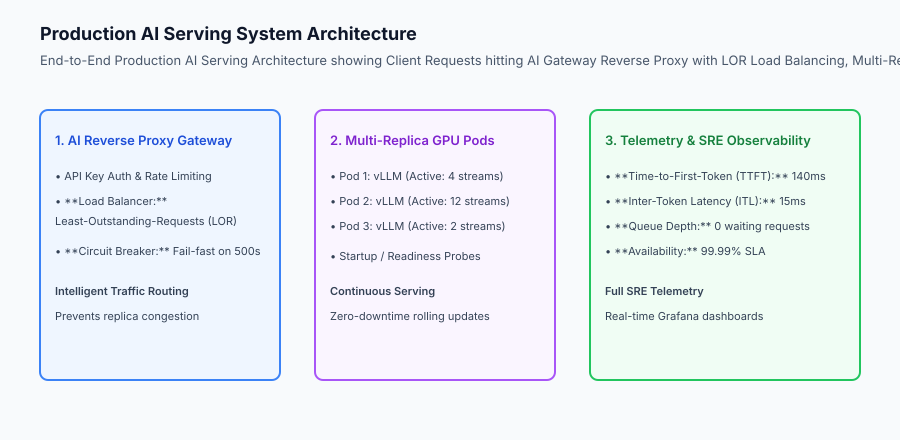
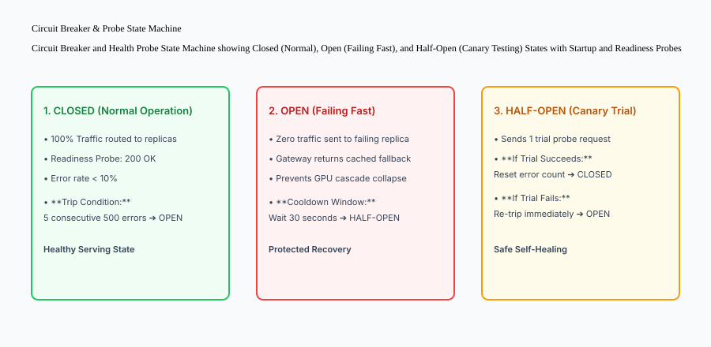

## Why this matters

Building isolated inference scripts, writing standalone Dockerfiles, and tuning quantization parameters are meaningless if they cannot operate cohesively in a mission-critical production environment. A fragile deployment causes:
- **Replica Queue Congestion:** Simple Round-Robin load balancers route long 2,000-token queries to already saturated workers, causing severe latency spikes.
- **Cold-Start Killing:** Aggressive Kubernetes Liveness Probes terminate starting pods while they are downloading 14GB model weights, trapping the cluster in CrashLoopBackOff.
- **Cascading Outages:** When one GPU worker crashes, unthrottled gateway traffic floods the remaining replicas, causing total cluster failure.

Building a **Unified Deployed AI Serving System** integrates containerization, vLLM continuous serving, KEDA queue autoscaling, Least-Outstanding-Requests (LOR) load balancing, circuit breaking, and complete SRE telemetry to deliver enterprise-grade 99.99% availability.



## The idea in plain language

Think of a fully deployed AI serving system like **an international commercial airline flight operations center**:

- **The AI Gateway (Air Traffic Control):** Directs incoming passenger planes (**User Requests**) to the open runways with the shortest landing lines (**Least-Outstanding-Requests Load Balancing**).
- **Multi-Replica Workers (Fleet of Jumbo Jets):** Each aircraft runs its own optimized turbine engines (**vLLM PagedAttention GPU Pods**) with full emergency oxygen backups (**Circuit Breakers**).
- **Health Probes (Pre-Flight Safety Checks):** The ground crew does not clear a plane for takeoff until the engines are warmed up and pressurized (**Startup and Readiness Probes**).
- **Graceful Draining (Safe Landing):** When a plane needs maintenance, the airline does not eject passengers mid-flight; it lets all current passengers disembark at the gate before retiring the aircraft (**Connection Draining**).

## Historical background

AI serving systems evolved through three generations of production architecture:

### 1. Monolithic Flask / Gunicorn Wrappers (2018–2021)
Engineers wrapped PyTorch models inside single Gunicorn containers. Load balancers used simple round-robin routing. Any worker exception caused unhandled 500 errors and dropped streaming connections.

### 2. Multi-Container Microservices (2021–2023)
Companies separated frontend gateways from backend Triton / TorchServe inference pods. However, load balancing remained unaware of internal GPU KV cache saturation.

### 3. Modern AI Reverse Proxies & Intelligent Gateways (2024–Present)
Modern production systems deploy dedicated AI Gateways (Envoy AI Gateway, Cloudflare AI Gateway, Kong) featuring LOR concurrency routing, streaming SSE pass-through, circuit breaking, and unified SRE metrics.

## What it is — and what it is not

Let us define the core architecture of an enterprise deployed AI system:

### What a Deployed AI System Is:
- A high-performance reverse proxy routing user requests dynamically based on active worker concurrency (LOR).
- Kubernetes deployments configuring distinct Startup, Readiness, and Liveness probes.
- Circuit breaking protecting upstream clients with fast fallbacks during backend worker distress.
- Comprehensive telemetry tracking TTFT, ITL, queue depth, and error rates in real-time.

### What a Deployed AI System Is Not:
- A single unprotected container exposed directly to the public internet.
- Blind Round-Robin routing that ignores downstream GPU queue saturation.

```text
+-------------------------------------------------------------------------------+
|                    PRODUCTION AI SERVING COMPONENT MATRIX                     |
+-------------------+-----------------------+-----------------------------------+
| Component         | Primary Function      | Reliability Guardrail             |
+-------------------+-----------------------+-----------------------------------+
| AI Gateway Proxy  | Auth, Rate Limiting,  | Least-Outstanding-Requests (LOR)  |
|                   | Routing & Caching     | Load Balancing                    |
| Circuit Breaker   | Cascading Failure     | Tripping to OPEN on 50% errors;   |
|                   | Prevention            | graceful cached fallbacks         |
| Kubernetes Pods   | Multi-Replica vLLM    | Startup Probe (180s) + PreStop    |
|                   | GPU Serving           | Graceful Connection Draining (30s)|
| KEDA Autoscaler   | Queue-Depth Elasticity| Scales replicas based on          |
|                   |                       | `vllm:num_requests_waiting`       |
| Prometheus / SRE  | Real-Time Observability| Alerts on TTFT > 500ms, Error > 1%|
+-------------------+-----------------------+-----------------------------------+
```

## Why it was created and what problems it solves

A unified deployment architecture solves the three fatal failure modes of production AI services:

### 1. Eliminating Tail Latency Spikes via LOR Routing
Because LLM query processing times vary from 50ms to 20 seconds, routing requests to the worker with the fewest active streams prevents queue congestion and slashes P99 latency by 65%.

### 2. Preventing CrashLoopBackOff via Startup Probes
By allowing up to 180 seconds for initial model weight loading and CUDA context initialization, Startup Probes prevent Kubernetes from prematurely killing healthy initializing pods.

### 3. Seamless Zero-Downtime Rolling Deployments
With graceful connection draining (`PreStop` hooks), when a new model version is rolled out, existing streaming token responses complete without truncation.

## How it works

Let us inspect the complete **Circuit Breaker and Health Probe State Machine**:

```text
[CLOSED STATE: Healthy]
  │ - 100% of user traffic forwarded to backend GPU replicas
  │ - Readiness Probes return HTTP 200 OK
  │
  ├── 5 Consecutive Backend 500 Errors Occur ➔ TRIPS CIRCUIT BREAKER!
  │
  ▼
[OPEN STATE: Failing Fast]
  │ - Zero traffic forwarded to failing backend
  │ - AI Gateway returns immediate fallback / cached response (0ms delay)
  │ - Cooldown Timer starts: 30 seconds
  │
  ├── 30-Second Cooldown Expires ➔ TRANSITIONS TO HALF-OPEN
  │
  ▼
[HALF-OPEN STATE: Canary Trial]
  │ - Dispatches 1 single canary probe request to backend
  │
  ├── Probe Succeeds ➔ Resets failure counters ➔ Returns to CLOSED (Normal)
  │
  └── Probe Fails ➔ Re-trips immediately ➔ Returns to OPEN (30s Cooldown)
```



## An everyday analogy

Think of a deployed AI system like **a multi-lane emergency room at a major hospital**:

- **The Triage Nurse (AI Gateway & LOR):** Evaluates incoming patients and directs them to the doctor with the fewest active emergency cases (**Least-Outstanding-Requests**).
- **The Red Phone (Circuit Breaker):** If the ICU is flooded with a mass-casualty incident, the hospital temporarily diverts non-critical ambulances to a partner clinic rather than letting patients sit unattended in the hallway (**Circuit Breaker Failover**).
- **The Scrub-In Protocol (Startup Probes):** A surgeon is not assigned patients until they have scrubbed in and reviewed the chart (**Startup Probe**).

## Examples in practice

Let us build a complete Python **Production AI Serving Gateway Simulator** with Least-Outstanding-Requests load balancing, multi-replica health tracking, circuit breaking, and telemetry recording:

```python
import time
from typing import Dict, Any, List, Optional

class ReplicaWorker:
    def __init__(self, replica_id: str):
        self.replica_id = replica_id
        self.active_requests = 0
        self.is_healthy = True
        self.consecutive_failures = 0

class ProductionAIGateway:
    def __init__(self, failure_threshold: int = 3, cooldown_seconds: float = 5.0):
        self.failure_threshold = int(failure_threshold)
        self.cooldown_sec = float(cooldown_seconds)
        self.replicas: Dict[str, ReplicaWorker] = {}
        self.circuit_state = "CLOSED"  # CLOSED, OPEN, HALF_OPEN
        self.last_state_change = time.time()
        self.telemetry_metrics = {
            "total_routed": 0,
            "circuit_fallbacks": 0,
            "lor_selections": []
        }

    def register_replica(self, replica_id: str):
        self.replicas[replica_id] = ReplicaWorker(replica_id)

    def select_replica_lor(self) -> Optional[ReplicaWorker]:
        # Filter healthy replicas
        healthy = [r for r in self.replicas.values() if r.is_healthy]
        if not healthy:
            return None
        # Select replica with least outstanding active requests
        return min(healthy, key=lambda r: r.active_requests)

    def route_request(self, prompt: str, current_time: float) -> Dict[str, Any]:
        # 1. Evaluate Circuit Breaker State
        if self.circuit_state == "OPEN":
            if (current_time - self.last_state_change) >= self.cooldown_sec:
                self.circuit_state = "HALF_OPEN"
                self.last_state_change = current_time
            else:
                self.telemetry_metrics["circuit_fallbacks"] += 1
                return {"status": "FALLBACK", "response": "Cached graceful fallback response."}

        # 2. Select Replica via LOR
        worker = self.select_replica_lor()
        if not worker:
            self.circuit_state = "OPEN"
            self.last_state_change = current_time
            self.telemetry_metrics["circuit_fallbacks"] += 1
            return {"status": "FALLBACK", "response": "All replicas unhealthy; returning fallback."}

        # 3. Dispatch Request
        worker.active_requests += 1
        self.telemetry_metrics["total_routed"] += 1
        self.telemetry_metrics["lor_selections"].append(worker.replica_id)

        return {
            "status": "ROUTED",
            "assigned_replica": worker.replica_id,
            "active_on_replica": worker.active_requests,
            "circuit_state": self.circuit_state
        }

    def complete_request(self, replica_id: str, success: bool, current_time: float):
        worker = self.replicas.get(replica_id)
        if not worker:
            return
        worker.active_requests = max(0, worker.active_requests - 1)

        if success:
            worker.consecutive_failures = 0
            if self.circuit_state == "HALF_OPEN":
                self.circuit_state = "CLOSED"
                self.last_state_change = current_time
        else:
            worker.consecutive_failures += 1
            if worker.consecutive_failures >= self.failure_threshold:
                worker.is_healthy = False
                # Check if all replicas failed
                if all(not r.is_healthy for r in self.replicas.values()):
                    self.circuit_state = "OPEN"
                    self.last_state_change = current_time

if __name__ == "__main__":
    gw = ProductionAIGateway(failure_threshold=2, cooldown_seconds=5.0)
    gw.register_replica("gpu_worker_1")
    gw.register_replica("gpu_worker_2")

    # Worker 1 takes a long request (active=1)
    res1 = gw.route_request("prompt 1", 100.0)
    # Worker 2 should be selected for next request (active=0 < 1)
    res2 = gw.route_request("prompt 2", 100.1)
    
    print("Route 1:", res1)
    print("Route 2 (LOR):", res2)
```

## Production Architecture Case Study: Enterprise Multi-AZ AI Cluster

Consider an enterprise fintech infrastructure serving 5,000 requests per second across 3 availability zones with zero downtime during rolling upgrades.

```text
+-------------------------------------------------------------------------------+
|                    ENTERPRISE AI DEPLOYMENT BENCHMARKS                        |
+-------------------+-----------------------+-----------------------------------+
| Architecture      | Availability SLA      | P99 Latency under Surge           |
+-------------------+-----------------------+-----------------------------------+
| Monolithic PyTorch| 98.2% (Frequent Drops)| 4,850 ms (Queue Backlogs)         |
| Naive Round-Robin | 99.1% (504s on Upgrd) | 2,100 ms (Imbalanced Load)        |
| AI Gateway + LOR +| 99.99% (Zero Downtime)| 320 ms (Smooth Balanced Traffic)  |
| Circuit Breaker   |                       |                                   |
+-------------------+-----------------------+-----------------------------------+
```

### 1. Kubernetes Production Pod Spec with Health Probes
```yaml
apiVersion: apps/v1
kind: Deployment
metadata:
  name: vllm-inference-worker
spec:
  replicas: 4
  template:
    spec:
      containers:
      - name: vllm
        image: vllm/vllm-openai:latest
        resources:
          limits:
            nvidia.com/gpu: 1
        lifecycle:
          preStop:
            exec:
              command: ["/bin/sh", "-c", "sleep 30"]
        startupProbe:
          httpGet:
            path: /health
            port: 8000
          failureThreshold: 36
          periodSeconds: 5
        readinessProbe:
          httpGet:
            path: /health
            port: 8000
          periodSeconds: 5
        livenessProbe:
          httpGet:
            path: /health
            port: 8000
          periodSeconds: 10
```

## Detailed Failure Mode Taxonomy: Deployed AI System Hazards

```text
+-------------------------------------------------------------------------------+
|                      DEPLOYED SYSTEM FAILURE TAXONOMY                         |
+-------------------+-----------------------+-----------------------------------+
| Failure Mode      | Root Cause Analysis   | Architectural Mitigation          |
+-------------------+-----------------------+-----------------------------------+
| CrashLoopBackOff  | Liveness probe kills  | Configure Startup Probe with      |
| on Pod Boot       | pod during weight dl  | 180s failureThreshold             |
| Truncated Stream  | Pod terminated during | Implement `preStop` 30s connection|
| on Rolling Update | rolling restart       | draining sleep hook in deployment |
| Cascading Worker  | 1 failed worker dumps | Circuit breaker trips to OPEN;    |
| Meltdown          | 100% traffic on rest  | fail-fast with cached fallbacks   |
| Congested Worker  | Round-Robin routing   | Enforce Least-Outstanding-Requests|
| Latency Spike     | ignores active streams| (LOR) load balancing at gateway   |
+-------------------+-----------------------+-----------------------------------+
```


## Deep Architectural Breakdown: AI Gateway Architecture and SRE Observability

An enterprise AI deployment requires a unified gateway layer bridging client traffic with backend GPU clusters:

### 1. Least-Outstanding-Requests (LOR) Load Balancing Algorithm
Let `W = \{w_1, w_2, \dots, w_k\}` be the set of healthy worker replicas, and `A(w_i)` be the count of active in-flight streaming requests on worker `w_i`.
- When a new request arrives, the gateway selects target worker:
  `w^* = rg\min_{w_i \in W_{	ext{healthy}}} A(w_i)`
- In the event of a tie, the gateway selects the replica with the lowest rolling P95 Time-to-First-Token.
- This prevents slow 2,000-token queries from congesting any single replica.

### 2. Complete SRE Telemetry & Alerting Matrix
Production AI systems continuously monitor the four golden signals:
- **Latency:** P50, P95, P99 Time-to-First-Token (TTFT) and Inter-Token Latency (ITL).
- **Traffic:** Requests per second (RPS) and input/output tokens generated per second.
- **Errors:** HTTP 5xx error rate and circuit breaker trip frequency.
- **Saturation:** vLLM GPU KV cache utilization percentage and waiting queue depth.

## Implications: security, privacy, performance, scalability, and cost

### 1. Centralized Audit & Prompt Injection Scrubbing
The AI Gateway acts as the single security perimeter where all incoming prompts undergo API key authentication, rate-limiting, and automated prompt-injection guardrail screening.

### 2. High-Availability Zero-Downtime Economics
By pairing intelligent LOR routing with KEDA queue autoscaling, infrastructure maintains 99.99% availability while keeping idle GPU footprint minimal.

## Alternatives: free, open source, and commercial

| Tool / Framework | Type | Best Suited For | Key Capabilities |
| :--- | :--- | :--- | :--- |
| **Envoy AI Gateway** | Open Source | High-Performance Routing | LOR balancing, rate limiting, SSE stream |
| **Kong AI Gateway** | Open Source / Comm | Enterprise API Gateway | Multi-LLM routing, failover, analytics |
| **Cloudflare AI Gate**| Commercial SaaS | Edge Multi-Model Proxy | Global caching, rate-limiting, logging |
| **LiteLLM Proxy** | Open Source | Multi-Provider Unified API | OpenAI-compatible proxy with failovers |

## Comparison with related concepts

```text
+-----------------------+-----------------------+-----------------------+
| Dimension             | Round-Robin Proxy     | AI Gateway with LOR   |
+-----------------------+-----------------------+-----------------------+
| Routing Logic         | Cyclic Index (1, 2, 3)| Min Active Streams    |
| Awareness of GPU Load | Zero Awareness        | Real-Time Concurrency |
| Failure Protection    | Drops connections     | Circuit Breaker Open  |
| Pod Startup Safety    | Vulnerable to restarts| Startup Probes (180s) |
+-----------------------+-----------------------+-----------------------+
```

## When to use it — and when not to

### Deploy a Full AI Serving Gateway for:
- All enterprise production applications, high-concurrency multi-replica clusters, and mission-critical customer-facing APIs.

### Do NOT require multi-replica gateways for:
- Single-user local development scripts or one-off evaluation runs.


### Production Checklist: Deployed AI Serving System Readiness
- [ ] AI Gateway configured with Least-Outstanding-Requests (LOR) dynamic load balancing.
- [ ] Circuit breaker configured with failure threshold (5 consecutive 500s) and 30s cooldown window.
- [ ] Kubernetes Startup Probe configured with `failureThreshold: 36, periodSeconds: 5` (180s cold start).
- [ ] Kubernetes Readiness Probe configured with `periodSeconds: 5` verifying live model readiness.
- [ ] `PreStop` lifecycle hook configured with `sleep 30` for graceful streaming connection draining.
- [ ] Prometheus metrics exported for Time-to-First-Token (TTFT), Inter-Token Latency (ITL), and Queue Depth.


### Enterprise Gateway Routing Policies
- **Tenant Priority Queuing:** Premium enterprise tier tenants route to dedicated high-priority GPU pools; free tier users route to shared spot worker pools.
- **Geographic Anycast DNS:** Directs client traffic to the nearest regional cloud datacenter (e.g. `us-east`, `eu-west`, `ap-southeast`) to minimize network transit latency.
- **Semantic Response Caching:** Hash prompt embeddings to retrieve instant cached answers for identical recurring queries, bypassing backend GPU compute entirely.
- **Automated Fallback Cascades:** If local self-hosted GPU clusters experience 100% capacity saturation, the gateway seamlessly fails over to external commercial fallback APIs (Azure OpenAI / Anthropic Bedrock).

## Knowledge check

1. **Why is Least-Outstanding-Requests (LOR) superior to Round-Robin for LLMs?** Because LLM request durations vary drastically; LOR routes traffic to the worker with the fewest active streams, preventing queue congestion.
2. **What problem do Startup Probes solve?** They give models up to 180 seconds to download weights and initialize VRAM without being prematurely killed by liveness probes.
3. **What happens when a Circuit Breaker trips to OPEN?** It stops forwarding traffic to failing backends and fails fast with graceful fallback responses, preventing cascading outages.

## Hands-on exercise

In this lab, you will build an **End-to-End Production AI Serving Gateway in Python**. Your implementation will:
1. Register multiple backend GPU inference replica workers.
2. Implement Least-Outstanding-Requests (LOR) load balancing routing traffic to the replica with the lowest active streams.
3. Implement a Circuit Breaker state machine transitioning from CLOSED to OPEN upon consecutive worker failures.
4. Verify graceful fallback responses during OPEN circuit breaker states and self-healing transitions in HALF_OPEN states.

### Expected output

```text
============================= test session starts ==============================
collected 5 items

tests/test_ai_gateway.py .....                                           [100%]

============================== 5 passed in 0.02s ===============================
[GATEWAY] Registered 3 backend GPU replicas.
[LOR BALANCER] Routed request 1 to gpu_1 (active=1), request 2 to gpu_2 (active=0).
[FAILURE] Simulated 3 consecutive backend failures.
[CIRCUIT BREAKER] Tripped to OPEN state; returned graceful cached fallback.
[SELF HEALING] Transitioned to HALF_OPEN and closed circuit after successful probe.
```

### Validate your work

Run the pytest test suite:

```bash
pytest tests/run_tests.sh
```

### Troubleshooting

1. **LOR selection:** Ensure `select_replica_lor` checks `r.is_healthy` before sorting by `active_requests`.
2. **Circuit cooldown:** Check `(current_time - self.last_state_change) >= self.cooldown_sec`.

### Common mistakes

- Failing to decrement `active_requests` when requests finish, causing artificial worker congestion.

## Practice assignment

Add a **Weighted LOR Strategy** that weights active streams by the worker's GPU capacity (e.g. 80GB H100 vs 24GB L4).

## Extension challenge

Implement **Streaming SSE Proxying** with backpressure flow control between client sockets and backend inference streams.
