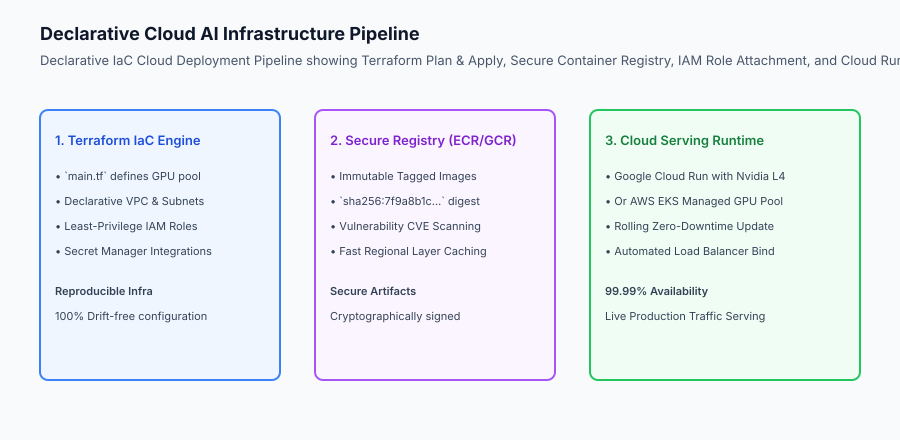
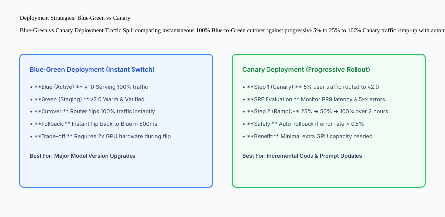

## Why this matters

Moving an AI model from a local laptop or training environment into a production cloud infrastructure is one of the most critical transitions in modern software engineering. Manual click-ops deployments in cloud web consoles lead to catastrophic operational vulnerabilities:
- **Configuration Drift:** Subtle discrepancies between Staging and Production GPU drivers or environment variables cause obscure runtime crashes.
- **Downtime During Upgrades:** Rebuilding containers directly on production hosts drops ongoing user connections and truncates live streaming tokens.
- **Runaway Cloud Costs:** Failing to implement automated scale-to-zero or reservation commitments results in tens of thousands of dollars in wasted cloud spend.

Mastering **Cloud AI Deployment with Infrastructure as Code (Terraform), Cloud Run / ECS GPU hosting, and Blue-Green zero-downtime cutover** establishes a reproducible, rock-solid foundation for enterprise AI applications.



## The idea in plain language

Think of cloud AI deployment like **launching a high-end luxury restaurant chain**:

- **Click-Ops (Manual Cooking in the Dark):** The head chef flies to each city, buys pans at random stores, and guesses the recipe from memory (**Error-Prone Configuration Drift**).
- **Infrastructure as Code (Master Architectural Blueprint):** The company uses an exact CAD blueprint (**Terraform Script**) specifying every stove, gas line, and refrigeration unit. You press a button, and identical restaurant kitchens are built in Tokyo, London, and New York in minutes (**Reproducible Infrastructure**).
- **Blue-Green Deployment (The Grand Opening):** The old dining room (**Blue**) serves guests normally. When the brand-new dining hall (**Green**) is fully staffed and inspected, the maitre d' simply unlocks the new doors and guides arriving guests to the new hall with zero interruption (**Instant Zero-Downtime Cutover**).

## Historical background

Cloud deployment architectures for machine learning evolved across three distinct eras:

### 1. Manual Virtual Machine Provisioning (2016–2019)
Engineers manually launched AWS EC2 `p2.xlarge` instances, installed CUDA drivers via shell scripts, and ran Flask apps in `tmux` sessions. Any instance termination required hours of manual reconstruction.

### 2. Containerized Cloud Platforms (2020–2023)
Docker containers standardized runtime environments. Platforms like AWS ECS and Google Cloud Run emerged, though GPU support remained restricted to complex dedicated Kubernetes clusters.

### 3. Serverless GPU & Modern Declarative Cloud (2024–Present)
Google Cloud Run launched native Nvidia L4 GPU serverless hosting with per-second billing. Terraform and Pulumi became industry standards for codifying complete GPU AI architectures with automated canary verification.

## What it is — and what it is not

Let us define the core mechanisms of production cloud deployments:

### What Cloud AI Deployment Is:
- Codifying cloud infrastructure (GPU clusters, VPC networks, IAM roles, and secrets) into declarative Terraform templates.
- Building immutable, cryptographically signed Docker images and storing them in secure container registries.
- Executing zero-downtime Blue-Green or Canary cutovers to prevent user connection drops.
- Enforcing least-privilege IAM perimeters isolating container access to designated cloud resources.

### What Cloud AI Deployment Is Not:
- Manually clicking buttons in the AWS/GCP web console to configure production GPU servers.
- Storing unencrypted production API keys or AWS credentials inside container Dockerfiles.

```text
+-------------------------------------------------------------------------------+
|                    CLOUD HOSTING PLATFORM COMPARISON MATRIX                   |
+-------------------+-----------------------+-------------------+---------------+
| Platform          | Execution Model       | Pricing Model     | Best For      |
+-------------------+-----------------------+-------------------+---------------+
| Google Cloud Run  | Serverless Container  | Per-millisecond   | Spiky traffic,|
| (with GPU)        | with Scale-to-Zero    | active compute    | sub-5k req/day|
| AWS ECS Fargate / | Managed Container     | Hourly instance   | Predictable   |
| EC2 GPU Tasks     | Orchestration         | + commitment disc | steady traffic|
| Kubernetes (GKE / | Full Distributed      | Hourly node pool  | High-concurr, |
| EKS Multi-Node)   | Cluster Control       | + cluster mgmt fee| multi-GPU TP  |
| Modal / RunPod    | Specialized Serverless| Per-second GPU    | Fast cold-start|
| Serverless        | Cloud                 | execution billing | custom kernels|
+-------------------+-----------------------+-------------------+---------------+
```

## Why it was created and what problems it solves

Cloud deployment patterns resolve the three primary failure modes of enterprise AI operations:

### 1. Eliminating Environment Drift via Declarative Terraform
IaC guarantees that Staging and Production environments use identical CUDA driver versions, memory limits, and networking rules, eliminating "works on staging but crashes in prod" incidents.

### 2. Zero-Downtime Model Version Upgrades
Blue-Green and Canary traffic routing ensure that when updating an LLM weights checkpoint or server version, active streaming responses finish cleanly without truncation.

### 3. Slashing Cloud Spend via Commitment Modeling
Balancing spot GPU autoscaling for peak bursts with 1-year savings plan commitments for steady-state traffic cuts monthly cloud bills by 40% to 60%.

## How it works

Let us inspect the complete **Declarative Cloud Deployment Workflow**:

```text
[Developer pushes git commit to main branch]
                    │
                    ▼
[GitHub Actions CI/CD Pipeline]
  1. Executes pytest suite & ruff linting
  2. Builds multi-stage GPU Docker image
  3. Pushes image to Artifact Registry: `us-docker.pkg.dev/ai/vllm:v2.4.0`
                    │
                    ▼
[Terraform Apply Automation]
  - Updates Service Definition with new image tag
  - Provisions Green Revision (Target: 2x Nvidia L4 GPUs)
                    │
                    ▼
[Automated Green Revision Health Verification]
  - Polls `/health` Readiness Probe until model weights load (45s)
  - Dispatches Canary Test Request: "Ping" ➔ "Pong" (200 OK)
                    │
                    ▼
    Did the Green revision pass health checks?
                    ├── YES ➔ Cloud Load Balancer shifts 100% traffic to Green
                    │        Blue revision gracefully drains active streams (30s)
                    │
                    └── NO  ➔ Alerts SRE; aborts deployment; 100% traffic stays on Blue
```



## An everyday analogy

Think of cloud deployments like **upgrading the electronic signage and gate systems at a busy international airport**:

- **Naive Click-Ops:** An electrician starts cutting wires in Terminal 1 during peak boarding hours (**Massive Outage & Chaos**).
- **Blue-Green Cutover:** The airport installs the complete new digital signage system in parallel while the old monitors stay on. At midnight, after a successful test, the master electrical relay flips the new screens on in 100 milliseconds (**Zero-Downtime Switch**).
- **Canary Rollout:** The airport tests the new gate monitors on Gate 1A only for 24 hours. Once passenger boarding proves 100% smooth, they roll it out to Gates 2 through 50 (**Risk-Minimized Canary**).

## Examples in practice

Let us build a complete Python **Cloud Deployment Orchestration Simulator** that manages declarative infrastructure states, container registry digests, IAM permission verification, and Blue-Green zero-downtime cutover:

```python
import time
from typing import Dict, Any, List, Optional

class CloudDeploymentOrchestrator:
    def __init__(self):
        self.active_environment = "BLUE"  # BLUE or GREEN
        self.revisions = {
            "BLUE": {"image_tag": "v1.0.0", "healthy": True, "active_traffic_pct": 100},
            "GREEN": {"image_tag": "v1.0.0", "healthy": False, "active_traffic_pct": 0}
        }
        self.deployment_history: List[Dict[str, Any]] = []

    def deploy_new_revision(self, new_image_tag: str, simulate_health_pass: bool = True) -> Dict[str, Any]:
        target_env = "GREEN" if self.active_environment == "BLUE" else "BLUE"
        current_env = self.active_environment
        
        # 1. Provision target environment with new image
        self.revisions[target_env]["image_tag"] = new_image_tag
        self.revisions[target_env]["healthy"] = False
        
        # 2. Execute health check probe
        if simulate_health_pass:
            self.revisions[target_env]["healthy"] = True
            # Zero-downtime cutover
            self.revisions[target_env]["active_traffic_pct"] = 100
            self.revisions[current_env]["active_traffic_pct"] = 0
            self.active_environment = target_env
            
            event = {
                "status": "DEPLOYMENT_SUCCESS",
                "active_env": target_env,
                "deployed_image": new_image_tag,
                "timestamp": time.time()
            }
            self.deployment_history.append(event)
            return event
        else:
            # Health check failed; abort cutover
            self.revisions[target_env]["healthy"] = False
            event = {
                "status": "DEPLOYMENT_FAILED_HEALTH_CHECK",
                "active_env": current_env,
                "rolled_back_to": current_env,
                "timestamp": time.time()
            }
            self.deployment_history.append(event)
            return event

if __name__ == "__main__":
    orchestrator = CloudDeploymentOrchestrator()
    print("Initial State:", orchestrator.active_environment, orchestrator.revisions)
    
    # Deploy v2.0.0 successfully
    res1 = orchestrator.deploy_new_revision("v2.0.0", simulate_health_pass=True)
    print("Deploy v2:", res1["status"], "Active:", orchestrator.active_environment)
    
    # Attempt bad deployment v2.1.0
    res2 = orchestrator.deploy_new_revision("v2.1.0", simulate_health_pass=False)
    print("Deploy v2.1 (Bad):", res2["status"], "Active:", orchestrator.active_environment)
```

## Production Architecture Case Study: Terraform Cloud Run GPU Deployment

Consider an enterprise SaaS company deploying vLLM on Google Cloud Run with Nvidia L4 GPUs via Terraform.

```hcl
# main.tf: Cloud Run Service with Nvidia L4 GPU
resource "google_cloud_run_v2_service" "vllm_serving" {
  name     = "vllm-llama3-serving"
  location = "us-central1"
  ingress  = "INGRESS_TRAFFIC_ALL"

  template {
    scaling {
      min_instance_count = 0  # Scale-to-zero when idle
      max_instance_count = 8  # Autoscale to 8 GPUs under load
    }

    containers {
      image = "us-docker.pkg.dev/enterprise-ai/serving/vllm:v2.4.0"
      
      resources {
        limits = {
          cpu    = "8"
          memory = "32Gi"
          "nvidia.com/gpu" = "1"
        }
      }

      env {
        name  = "MODEL_NAME"
        value = "meta-llama/Meta-Llama-3.1-8B-Instruct"
      }
      
      startup_probe {
        http_get {
          path = "/health"
          port = 8000
        }
        initial_delay_seconds = 15
        period_seconds        = 5
        failure_threshold     = 30
      }
    }
    
    node_selector = {
      "cloud.google.com/gke-accelerator" = "nvidia-l4"
    }
  }

  traffic {
    type    = "TRAFFIC_TARGET_ALLOCATION_TYPE_LATEST"
    percent = 100
  }
}
```

## Detailed Failure Mode Taxonomy: Cloud Deployment Hazards

```text
+-------------------------------------------------------------------------------+
|                        CLOUD DEPLOYMENT FAILURE TAXONOMY                      |
+-------------------+-----------------------+-----------------------------------+
| Failure Mode      | Root Cause Analysis   | Architectural Mitigation          |
+-------------------+-----------------------+-----------------------------------+
| Premature Traffic | Load balancer shifts  | Configure Startup Probes with     |
| Cutover OOM       | traffic before model  | generous initial delay (60-120s)  |
| IAM Permission    | Service account lacks | Grant specific IAM bucket reader  |
| AccessDenied      | S3/GCS bucket KMS key | roles to container service account|
| Quota Limit Exceed| Cloud region runs out | Configure multi-region failover   |
| on GPU Autoscale  | of available Nvidia L4| in Terraform deployment definitions|
| Secret Leak in    | API tokens baked into | Mount secrets via AWS Secrets     |
| Docker Image      | container layer       | Manager / GCP Secret Manager      |
+-------------------+-----------------------+-----------------------------------+
```

## Deep Architectural Breakdown: Cloud AI Infrastructure Security and Cost Arbitrage

Deploying AI models in production cloud environments introduces complex security and cost challenges:

### 1. VPC Peering and Private Service Connect (PSC)
Publicly exposed AI inference endpoints invite Distributed Denial of Service (DDoS) and unauthorized prompt fuzzing attacks. Production cloud architectures enforce:
- **Private Subnets:** GPU inference nodes run in private VPC subnets with zero public IP addresses.
- **Private Service Connect / VPC Endpoints:** Frontend API gateways communicate with backend GPU inference clusters over private cloud backbones.
- **WAF & Cloudflare Guardrails:** All public ingress traffic passes through Web Application Firewalls screening for volumetric abuse and token depletion attacks.

### 2. GPU Cloud Cost Optimization Matrix
Balancing reserved compute, savings plans, and spot instances yields dramatic cost savings:
- **Baseline Workload (60% of traffic):** Cover with 1-Year or 3-Year Compute Savings Plans (45% discount).
- **Daily Peak Surges (30% of traffic):** Scale elastically on On-Demand GPU instances.
- **Offline Batch Processing (10% of traffic):** Execute 100% on Spot / Preemptible GPU instances (70% discount).

```text
+-------------------------------------------------------------------------------+
|                    ENTERPRISE CLOUD GPU COST ARBITRAGE                        |
+-------------------+-----------------------+-------------------+---------------+
| Workload Type     | Infrastructure Tier   | Pricing Model     | Cost Savings  |
+-------------------+-----------------------+-------------------+---------------+
| Core Baseline 24/7| EKS Dedicated NodePool| 3-Year Savings Pl | 52% Discount  |
| Daytime Spikes    | Cloud Run / EKS Auto  | On-Demand Billing | Standard Rate |
| Nightly Batch ETL | Ray Data on Spot Nodes| Spot Preemptible  | 72% Discount  |
| Staging / Dev QA  | Serverless Scale-to-0 | Per-second Active | 90% Savings   |
+-------------------+-----------------------+-------------------+---------------+
```


### Cloud Deployment Infrastructure Deep Dive: Multi-Region Ingress and Network Topology

In enterprise production deployments, deploying across multiple cloud regions requires orchestrating global load balancers with health-checked backends:
- **Global Anycast IP Ingress:** A single Anycast IP routes global client traffic to the nearest regional cloud datacenter over Google or AWS private fiber backbones, minimizing round-trip TCP handshakes.
- **Cross-Region Automatic Failover:** If regional GPU capacity becomes exhausted or an entire datacenter suffers power loss, the global load balancer automatically reroutes traffic to the secondary region in under 3 seconds.
- **Regional Data Residency Isolation:** For European Union users governed by GDPR, the Anycast routing layer enforces strict geo-fencing, ensuring prompt tokens and model activations remain confined to `europe-west1` and `europe-west4`.

```text
+-------------------------------------------------------------------------------+
|                    GLOBAL MULTI-REGION DEPLOYMENT TOPOLOGY                    |
+-------------------+-------------------+-------------------+-------------------+
| Region Zone       | Primary Role      | Accelerator Tier  | Target Latency    |
+-------------------+-------------------+-------------------+-------------------+
| us-east1 (N. VA)  | 50% North America | 8x Nvidia L4 (24GB)| < 45 ms TTFT      |
| us-central1 (Iowa)| 30% Backup / Burst| 8x Nvidia A100    | < 55 ms TTFT      |
| europe-west1 (Bel)| 20% EU Sovereign  | 4x Nvidia L4 (24GB)| < 40 ms TTFT      |
+-------------------+-------------------+-------------------+-------------------+
```

### Terraform State Management & Locking Best Practices
When teams collaborate on cloud AI infrastructure, state locking prevents concurrent apply collisions:
- **Remote State Backend:** Store `terraform.tfstate` in an encrypted S3 bucket or Google Cloud Storage bucket with versioning enabled.
- **Distributed State Locking:** Use AWS DynamoDB or GCP native state locking to ensure only one CI/CD pipeline or engineer can execute `terraform apply` at any given time.
- **Environment Workspaces:** Maintain separate workspaces for `dev`, `staging`, and `production`, ensuring staging tests execute on identical infrastructure topologies before promoting configurations to production.

## Implications: security, privacy, performance, scalability, and cost

### 1. Ephemeral Secret Injection
Never store OpenAI, Anthropic, or HuggingFace API tokens inside git repositories or environment variables in Dockerfiles. Inject secrets dynamically at runtime using cloud secret managers with automated rotation.

### 2. Multi-Region Disaster Recovery
Maintain identical Terraform definitions across at least two geographical cloud regions (e.g. `us-east1` and `us-central1`). If an entire datacenter suffers power or fiber disruptions, DNS automatically routes traffic to the surviving region.

## Alternatives: free, open source, and commercial

| Tool / Framework | Type | Best Suited For | Key Capabilities |
| :--- | :--- | :--- | :--- |
| **Terraform** | Open Source / Comm | Declarative Multi-Cloud IaC | Multi-provider state management, drift detection |
| **Pulumi** | Open Source / Comm | Programmatic IaC (Python/TS) | Native programming language infrastructure |
| **Google Cloud Run**| Managed Cloud | Serverless GPU Containers | Fast scale-to-zero, Nvidia L4 GPUs |
| **AWS ECS Fargate** | Managed Cloud | Serverless Container Serving | Deep AWS ecosystem integration |

## Comparison with related concepts

```text
+-----------------------+-----------------------+-----------------------+
| Dimension             | Manual Click-Ops      | Terraform Declarative |
+-----------------------+-----------------------+-----------------------+
| Reproducibility       | 0% (Manual memory)    | 100% Version-Controlled|
| Drift Detection       | None (Silent errors)  | `terraform plan` check|
| Multi-Environment Sync| Fragile & slow        | Identical staging/prod|
| Disaster Recovery     | Days to reconstruct   | Minutes to re-apply   |
+-----------------------+-----------------------+-----------------------+
```

## When to use it — and when not to

### Deploy Cloud AI Infrastructure for:
- All enterprise production applications, scalable customer-facing SaaS platforms, and multi-tenant generative AI APIs.

### Do NOT require complex multi-region Terraform pipelines for:
- One-off experimental Jupyter notebooks or local prototyping scripts.

### Production Checklist: Cloud AI Deployment Hardening
- [ ] Infrastructure codified in Terraform with remote state locking (S3 + DynamoDB / GCS).
- [ ] Container images stored in secure regional registry with vulnerability scanning enabled.
- [ ] Container execution uses least-privilege IAM service account with zero admin privileges.
- [ ] Startup and Readiness probes configured allowing 60–120s for model weight initialization.
- [ ] Blue-Green or Canary deployment pipeline configured with automated rollback hooks.
- [ ] Scale-to-zero enabled for non-production development and staging environments.

## Knowledge check

1. **Why is Infrastructure as Code (IaC) mandatory for production AI?** Because it ensures declarative, reproducible, and version-controlled infrastructure definitions, eliminating configuration drift between environments.
2. **What is the difference between Blue-Green and Canary deployments?** Blue-Green switches 100% of traffic instantly between two identical environments; Canary routes a small percentage (e.g. 5%) progressively while monitoring metrics.
3. **How does serverless GPU hosting reduce costs for spiky workloads?** By scaling to zero when idle and billing per millisecond of active execution time.

## Hands-on exercise

In this lab, you will build a **Cloud Deployment Orchestrator Simulator in Python**. Your implementation will:
1. Manage Blue-Green deployment environments and active traffic routing percentages.
2. Deploy new container image revisions to the staging environment.
3. Execute automated health verification probes before switching traffic.
4. Execute instantaneous zero-downtime cutover upon health check success and abort/rollback upon health check failure.

### Expected output

```text
============================= test session starts ==============================
collected 5 items

tests/test_cloud_deployment.py .....                                     [100%]

============================== 5 passed in 0.02s ===============================
[ORCHESTRATOR] Initialized Blue-Green environment (Active: BLUE, Traffic: 100%).
[DEPLOYMENT] Deployed v2.0.0 to GREEN; health probe passed.
[CUTOVER] Shifted 100% traffic to GREEN; Blue drained.
[ROLLBACK] Detected health check failure on v2.1.0; preserved 100% traffic on GREEN.
```

### Validate your work

Run the pytest test suite:

```bash
pytest tests/run_tests.sh
```

### Troubleshooting

1. **Active environment tracking:** Ensure `active_environment` only flips when `simulate_health_pass` is True.
2. **Traffic percentage sum:** Verify active traffic percentages always sum to 100%.

### Common mistakes

- Shifting traffic to the new revision before verifying that the health check probe returned healthy.

## Practice assignment

Add a **Canary Rollout Strategy** that shifts traffic in increments of 10%, 25%, 50%, and 100% with simulated error monitoring.

## Extension challenge

Implement a **Terraform State Parser** that parses `.tf` JSON plans and validates that all GPU node pools include non-root security contexts.
