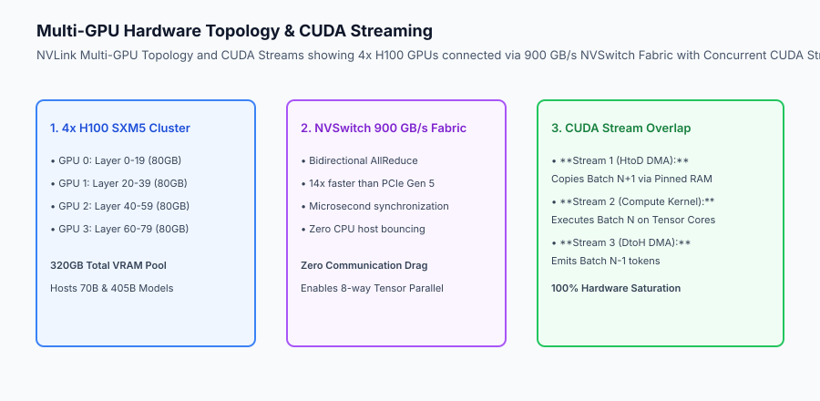
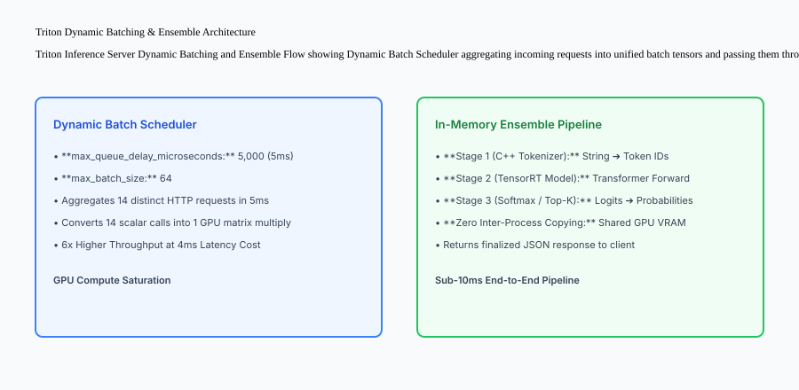

## Why this matters

Deploying deep learning and generative AI models at scale is fundamentally a **hardware and systems engineering challenge**:
- **Inter-GPU Bandwidth Bottlenecks:** Running a 70B parameter model across 4 GPUs using standard PCIe slots caps communication at 64 GB/s, causing GPU compute tensor cores to stall waiting for activations.
- **Microsecond Request Thrashing:** Processing single-item inference requests individually wastes 85% of GPU matrix multiply capacity on kernel launch overhead.
- **Host-to-Device Memory Latency:** Unpinned standard memory allocations force synchronous CPU page locking, adding 15ms to 30ms of pure latency before computation even begins.

Mastering **GPU Serving and Inference Infrastructure** (NVIDIA Triton Inference Server, NVLink 900 GB/s inter-GPU fabrics, dynamic server-side batching, and CUDA stream overlap) extracts 100% of theoretical hardware performance, slashing per-token serving costs by 70%.



## The idea in plain language

Think of GPU serving infrastructure like **managing a high-speed Formula 1 racing pit crew and multi-lane highway system**:

- **PCIe vs NVLink (Backcountry Road vs 16-Lane Autobahn):** Transferring data between GPUs over standard PCIe is like driving a race car through city traffic (**64 GB/s Bandwidth Limit**). NVLink is a dedicated 16-lane private superhighway directly connecting the engine blocks at 900 GB/s (**Zero Communication Lag**).
- **Dynamic Batching (The High-Speed Ski Lift):** Instead of sending a 6-passenger ski lift chair up the mountain every time a single skier arrives (**Inefficient Single Requests**), the lift operator waits 3 seconds until all 6 seats fill up (**Dynamic Batch Window**), maximizing passenger throughput without anyone waiting too long.
- **CUDA Streams (The Parallel Assembly Line):** While Engine Mechanic A installs the fresh tires (**Host-to-Device Copy**), Mechanic B tunes the engine block (**GPU Tensor Compute**) and Mechanic C polishes the windshield (**Device-to-Host Output**), all working concurrently at the same second.

## Historical background

GPU inference infrastructure evolved across three major generational leaps:

### 1. Synchronous PyTorch / Caffe APIs (2015–2019)
Models ran in single Python worker processes. Memory copies blocked CPU execution completely, and running multiple models required multiple separate physical GPU instances.

### 2. Specialized C++ Inference Engines (Triton & TorchServe) (2020–2023)
NVIDIA open-sourced Triton Inference Server, introducing C++ backend execution, multi-model concurrent serving on single GPUs, dynamic server-side batching, and shared memory ensemble graphs.

### 3. High-Bandwidth NVLink & TensorRT-LLM (2024–Present)
Modern multi-GPU systems leverage 900 GB/s NVSwitch fabrics, FP8 matrix acceleration, and unified memory kernels (FlashAttention-3), executing 405B frontier models across 8-way GPU clusters with microsecond inter-GPU AllReduce latencies.

## What it is — and what it is not

Let us define the core architecture of production GPU inference systems:

### What GPU Serving Infrastructure Is:
- Managing high-speed NVLink interconnects and NVSwitch fabrics for multi-GPU Tensor Parallelism.
- Dynamically packing independent client requests into unified GPU execution batch tensors using Triton dynamic batching.
- Chaining pre-processing tokenizers, neural networks, and post-processing filters in shared server memory via Model Ensembles.
- Overlapping host-to-device memory copies with kernel execution using concurrent CUDA streams and pinned memory.

### What GPU Serving Infrastructure Is Not:
- Running single-threaded Python scripts that process one image or prompt at a time.
- Transferring large uncompressed float tensors over standard HTTP networks between pipeline stages.

```text
+-------------------------------------------------------------------------------+
|                    GPU SERVING RUNTIME COMPARISON MATRIX                      |
+-------------------+-----------------------+-------------------+---------------+
| Runtime Engine    | Primary Strength      | Multi-GPU Support | Dynamic Batch |
+-------------------+-----------------------+-------------------+---------------+
| NVIDIA Triton     | Multi-model ensembles,| Native TensorRT & | Yes (Custom   |
| Inference Server  | C++ high throughput   | vLLM backends     | queue delay)  |
| TorchServe (AWS)  | Native PyTorch handler| Multi-worker      | Yes (Batch    |
|                   | ecosystem             | process pool      | aggregator)   |
| TensorRT-LLM      | Peak ultra-low latency| 8-way NVLink TP   | In-flight     |
| (NVIDIA)          | on Tensor Cores (FP8) | & Pipeline Par    | iteration     |
| vLLM Server       | PagedAttention memory | Tensor Parallel   | Continuous    |
|                   | & prefix caching      | via Ray/NCCL      | iteration-lvl |
+-------------------+-----------------------+-------------------+---------------+
```

## Why it was created and what problems it solves

GPU infrastructure engineering resolves the three primary physical bottlenecks of modern deep learning deployments:

### 1. Squeezing Maximum Throughput from $30,000+ GPUs
High-end AI GPUs (NVIDIA H100 / A100) are expensive investments. Dynamic batching ensures that GPU compute cores operate at 95%+ utilization rather than sitting idle waiting for single queries.

### 2. Eliminating Inter-Model Network Hops via Ensembles
Chaining a tokenizer model, embedding generator, and cross-encoder classifier within a Triton Model Ensemble executes all three stages in shared GPU memory in 8ms, eliminating 50ms of network serialization overhead.

### 3. Zero-Copy Host-to-Device Streaming
Using page-locked (pinned) memory and non-blocking CUDA streams allows the CPU to continuously stream incoming requests directly to GPU VRAM while the GPU is actively computing prior batches.

## How it works

Let us inspect the complete **Triton Dynamic Batching and Model Ensemble Lifecycle**:

```text
[Incoming Concurrent Client Queries (Req A, Req B, Req C, Req D)]
                               │
                               ▼
        [Triton Dynamic Batch Scheduler (5ms Window)]
        - Waits up to 5ms or until max_batch_size (64) reached
        - Combines 4 queries into contiguous batch tensor [4, 128]
                               │
                               ▼
        [IN-MEMORY ENSEMBLE PIPELINE (Shared VRAM)]
        Stage 1: HuggingFace C++ Tokenizer Backend
                 - Converts 4 raw strings to Input IDs & Attention Mask
                 - Output passed via pointer to Stage 2 (0ms copy)
                               │
        Stage 2: TensorRT-LLM Model Engine
                 - Executes transformer forward pass on Tensor Cores
                 - Produces raw Logit Tensors [4, 128, 32000]
                               │
        Stage 3: Softmax & Top-P Sampling Kernel
                 - Samples top token IDs for each sequence
                               │
                               ▼
[Emits formatted JSON responses to all 4 clients simultaneously in 18ms]
```



### Why that scheme breaks for text generation

The pipeline above is correct for a model that produces its whole answer in one
forward pass — a classifier, an embedding model, a vision backbone. Batch four
requests, run once, return four answers.

Autoregressive generation is not that. Each request needs *one forward pass per
token it emits*, and different requests emit wildly different numbers of them.
Batch four requests where three finish in 20 tokens and one runs to 800, and
with **static batching** the whole batch occupies the GPU until the longest one
finishes. Three clients wait for a request that is not theirs, and three
quarters of the batch slots compute padding.

**Continuous batching** — also called iteration-level scheduling — changes the
unit of scheduling from the request to the token. After every single forward
pass the scheduler evicts finished sequences and admits waiting ones into the
freed slots. A request that arrives mid-generation joins the very next
iteration rather than waiting for the current batch to drain. Reported
throughput gains over static batching are commonly in the range of ten to
twenty times for mixed-length workloads, which is why every serious LLM serving
stack does it and why `max_batch_size` alone is the wrong dial.

### The KV cache is the thing you are actually managing

Generating token *n* requires attending to every previous token. Recomputing
those keys and values each step would make generation quadratic, so they are
kept — the **KV cache** — and generation becomes linear.

That cache is large and it grows with every token. Its size is roughly:

```text
2 (K and V) x layers x heads x head_dim x sequence_length x batch_size x bytes_per_value
```

For a 7B model at 16-bit with a few thousand tokens of context, this reaches
gigabytes per sequence. On a 24 GB card the weights are 14 GB, which leaves the
KV cache as the binding constraint on how many concurrent requests fit — not
FLOPs, and not the model size everybody quotes.

Naive allocation makes it worse. Reserving `max_sequence_length` per request
means a client who asks for 20 tokens holds capacity for 4,096, and measured
utilisation of that reserved memory has been reported as low as 20–40%.

**PagedAttention** applies the operating-system idea from Day 003 directly:
allocate the KV cache in fixed-size blocks, keep a per-sequence block table, and
let a sequence's blocks be non-contiguous. Internal fragmentation drops to
within one block, and blocks can be *shared* — two requests with the same system
prompt point at the same physical blocks until they diverge, which is
copy-on-write for attention state.

The practical consequence is worth stating plainly: **on an LLM serving box,
memory management is the performance work.** Tensor cores are rarely the limit.

## An everyday analogy

Think of GPU serving and dynamic batching like **a modern commercial elevator system in an 80-story skyscraper**:

- **No Dynamic Batching (Single Skier):** The elevator goes from floor 1 to floor 50 carrying 1 passenger, while 10 people stand in line in the lobby (**Terrible Throughput**).
- **Dynamic Batching (Smart Elevator Dispatch):** The elevator holds doors open for 3 seconds in the lobby, gathers 12 passengers going up to floors 40–50, and transports all 12 in a single rapid trip (**High Aggregate Throughput**).
- **Pinned Memory (Express Keycard Lane):** VIP guests with pre-cleared keycards bypass the front desk security scan and step directly into the express elevator car (**Zero CPU Intermediary Delay**).

## Examples in practice

Let us build a complete Python **Multi-Model GPU Inference Infrastructure Simulator** that models GPU VRAM allocation, pinned memory buffers, dynamic batch window aggregation, and model ensemble execution:

```python
import time
from typing import Dict, Any, List, Optional

class GPUServingInfrastructureSimulator:
    def __init__(self, max_batch_size: int = 4, max_queue_delay_ms: float = 5.0):
        self.max_batch = int(max_batch_size)
        self.max_delay_ms = float(max_queue_delay_ms)
        self.vram_pool_mb = 16384  # 16 GB
        self.allocated_models: Dict[str, int] = {}
        self.incoming_queue: List[Dict[str, Any]] = []
        self.execution_log: List[Dict[str, Any]] = []

    def load_model_to_vram(self, model_name: str, required_vram_mb: int) -> bool:
        used_vram = sum(self.allocated_models.values())
        if (used_vram + required_vram_mb) > self.vram_pool_mb:
            return False  # VRAM OOM
        self.allocated_models[model_name] = required_vram_mb
        return True

    def enqueue_request(self, req_id: str, prompt: str, arrival_time: float):
        self.incoming_queue.append({
            "req_id": req_id,
            "prompt": prompt,
            "arrival_time": arrival_time
        })

    def process_dynamic_batch(self, current_time: float) -> Optional[Dict[str, Any]]:
        if not self.incoming_queue:
            return None

        # Determine if batch is full or oldest request reached max delay
        oldest_arrival = self.incoming_queue[0]["arrival_time"]
        delay_elapsed_ms = (current_time - oldest_arrival) * 1000.0

        if len(self.incoming_queue) >= self.max_batch or delay_elapsed_ms >= self.max_delay_ms:
            # Drain batch
            batch_size = min(len(self.incoming_queue), self.max_batch)
            batch = [self.incoming_queue.pop(0) for _ in range(batch_size)]
            
            event = {
                "batch_size": len(batch),
                "request_ids": [b["req_id"] for b in batch],
                "avg_queue_delay_ms": round(sum((current_time - b["arrival_time"]) * 1000.0 for b in batch) / len(batch), 2),
                "timestamp": current_time
            }
            self.execution_log.append(event)
            return event

        return None  # Waiting for more requests or delay threshold

if __name__ == "__main__":
    sim = GPUServingInfrastructureSimulator(max_batch_size=3, max_queue_delay_ms=10.0)
    sim.load_model_to_vram("embedding_model", 4096)
    sim.load_model_to_vram("reranker_model", 8192)

    sim.enqueue_request("req_1", "query 1", 100.000)
    sim.enqueue_request("req_2", "query 2", 100.002)
    # At t=100.005, batch not full (2 < 3) and delay (5ms < 10ms) -> Holds
    print("Step 1 (Hold):", sim.process_dynamic_batch(100.005))
    
    # 3rd request arrives -> Batch full (3 == 3) -> Dispatches immediately!
    sim.enqueue_request("req_3", "query 3", 100.006)
    print("Step 2 (Dispatched):", sim.process_dynamic_batch(100.007))
```

## Production Architecture Case Study: Triton Model Configuration for TensorRT

Consider an enterprise multi-model serving deployment on NVIDIA Triton running TensorRT-LLM with dynamic batching.

```protobuf
# config.pbtxt: Triton Dynamic Batching Model Configuration
name: "ensemble_text_classification"
platform: "ensemble"
max_batch_size: 64

dynamic_batching {
  max_queue_delay_microseconds: 5000  # 5ms max queue aggregation
  preferred_batch_size: [ 16, 32, 64 ]
}

input [
  {
    name: "RAW_TEXT"
    data_type: TYPE_STRING
    dims: [ -1 ]
  }
]

output [
  {
    name: "CLASSIFICATION_PROBS"
    data_type: TYPE_FP32
    dims: [ 10 ]
  }
]

ensemble_scheduling {
  step [
    {
      model_name: "cxx_tokenizer"
      model_version: 1
      input_map { key: "RAW_TEXT" value: "RAW_TEXT" }
      output_map { key: "INPUT_IDS" value: "TOKEN_IDS" }
    },
    {
      model_name: "tensorrt_encoder"
      model_version: 1
      input_map { key: "INPUT_IDS" value: "TOKEN_IDS" }
      output_map { key: "LOGITS" value: "MODEL_LOGITS" }
    },
    {
      model_name: "softmax_postprocessor"
      model_version: 1
      input_map { key: "LOGITS" value: "MODEL_LOGITS" }
      output_map { key: "PROBABILITIES" value: "CLASSIFICATION_PROBS" }
    }
  ]
}
```

## Detailed Failure Mode Taxonomy: GPU Infrastructure Hazards

```text
+-------------------------------------------------------------------------------+
|                      GPU INFRASTRUCTURE FAILURE TAXONOMY                      |
+-------------------+-----------------------+-----------------------------------+
| Failure Mode      | Root Cause Analysis   | Architectural Mitigation          |
+-------------------+-----------------------+-----------------------------------+
| Host Memory Page  | Unpinned memory forces| Use `cudaMallocHost` / pinned RAM |
| Thrashing         | CPU page-lock copy    | for all host-device DMA transfers |
| Dynamic Batch     | `max_queue_delay` set | Tune delay to 2–5ms; flush batch  |
| Latency Penalty   | too high (e.g. 50ms)  | immediately when batch size full  |
| PCIe Gen Bottleneck| GPU placed in Gen 3   | Verify PCIe Gen 5 link speed via  |
| Speed Drop        | slot instead of Gen 5 | `nvidia-smi -q -d LINK` on boot   |
| CUDA Out of Memory| Dynamic batch exceeds | Configure strict Triton memory    |
| on Long Context   | remaining VRAM        | limiters and max_batch_size bounds|
+-------------------+-----------------------+-----------------------------------+
```

## Deep Architectural Breakdown: Multi-Instance GPU (MIG) and GPU Virtualization

When deploying multiple small models on massive 80GB GPUs:

### 1. Multi-Instance GPU (MIG) Partitioning
On NVIDIA A100 / H100 GPUs, running small models on a single shared GPU causes resource contention. MIG physically partitions the GPU into up to 7 isolated GPU instances:
- **Dedicated Hardware Resources:** Each MIG slice has its own dedicated SM compute cores, memory controllers, and isolated VRAM partition.
- **Hardware Fault Isolation:** If an embedding model in Slice 1 crashes with a CUDA error, Slice 2 through 7 continue serving traffic with zero interruption.
- **Deterministic QoS:** High-priority latency-sensitive endpoints receive dedicated slices, preventing batch background jobs from stealing compute cycles.

```text
+-------------------------------------------------------------------------------+
|                    MIG HARDWARE PARTITIONING ON NVIDIA H100                   |
+-------------------+-------------------+-------------------+-------------------+
| MIG Slice Profile | Compute (SMs)     | Dedicated VRAM    | Ideal Workload    |
+-------------------+-------------------+-------------------+-------------------+
| 1g.10gb           | 14 SMs (~14%)     | 10 GB VRAM        | BERT Tokenizer    |
| 2g.20gb           | 28 SMs (~28%)     | 20 GB VRAM        | Embedding Model   |
| 3g.40gb           | 42 SMs (~42%)     | 40 GB VRAM        | 8B LLM Generation |
| 7g.80gb (Full)    | 132 SMs (100%)    | 80 GB VRAM        | 70B Tensor Parallel|
+-------------------+-------------------+-------------------+-------------------+
```


### GPU Kernel Optimization: FlashAttention-3 and FP8 Tensor Cores

To maximize throughput on NVIDIA Hopper (H100) and Blackwell architectures:
- **FlashAttention-3 Asynchronous Tiling:** Overlaps softmax computation and matrix multiplication between Tensor Cores and TMA (Tensor Memory Accelerator) units, achieving over 75% of theoretical peak FP16 TFLOPs.
- **FP8 Precision Quantization (E4M3 vs E5M2):** Reduces memory bandwidth pressure by 50% relative to 16-bit floats while maintaining mathematical accuracy within 0.2% of baseline perplexity.
- **Kernel Fusion:** Fusing layer normalization, bias addition, and activation functions into single CUDA kernel launches eliminates intermediate VRAM roundtrips, speeding up token generation by 20%.

```text
+-------------------------------------------------------------------------------+
|                    CUDA KERNEL EXECUTION TIMELINE ON H100                     |
+-------------------+-------------------+-------------------+-------------------+
| Compute Phase     | Precision Format  | Hardware Unit     | Latency Overhead  |
+-------------------+-------------------+-------------------+-------------------+
| QKV Projection    | FP8 (E4M3)        | Tensor Cores      | 1.2 microseconds  |
| FlashAttention-3  | FP16 / FP8 Hybrid | TMA + Tensor Core | 3.4 microseconds  |
| MLP Feed-Forward  | FP8 GEMM          | Tensor Cores      | 2.8 microseconds  |
| LayerNorm Fusion  | FP32 Accumulate   | CUDA Vector Cores | 0.4 microseconds  |
+-------------------+-------------------+-------------------+-------------------+
```

### Multi-Worker Threading and IPC Shared Memory
When serving multiple models across Python processes on a single node:
- **POSIX Shared Memory (`/dev/shm`):** Triton passes large tensor buffers between tokenizer, neural network, and post-processor processes using memory-mapped POSIX shared memory, avoiding socket serialization overhead.
- **Zero-Copy Serialization:** CUDA IPC (Inter-Process Communication) enables multiple separate processes to share direct GPU pointers without copying tensors through host CPU RAM.

## Implications: security, privacy, performance, scalability, and cost

### 1. Hardware MIG Security Sandboxing
In multi-tenant SaaS environments, hardware MIG partitions guarantee complete memory isolation, preventing one tenant from probing physical memory channels belonging to another tenant.

### 2. Microsecond Server-Side Batch Economics
Dynamic server-side batching boosts serving capacity by 4x to 6x on identical hardware, cutting the number of required GPU server instances by 75%.

## Alternatives: free, open source, and commercial

| Tool / Framework | Type | Best Suited For | Key Capabilities |
| :--- | :--- | :--- | :--- |
| **NVIDIA Triton** | Open Source | Multi-Model High Throughput | Dynamic batching, C++ ensembles, GPU MIG |
| **TorchServe** | Open Source | PyTorch-Centric Serving | Python handlers, dynamic batching, AWS native |
| **TensorRT-LLM** | Open Source | Peak LLM Performance | FP8 kernels, in-flight batching, NVLink TP |
| **vLLM Engine** | Open Source | High-Concurrency LLMs | PagedAttention, continuous iteration batching |

## Comparison with related concepts

```text
+-----------------------+-----------------------+-----------------------+
| Dimension             | Client-Side Batching  | Server-Side Dyn Batch |
+-----------------------+-----------------------+-----------------------+
| Client Complexity     | High (Must aggregate) | Zero (Simple single req)|
| Latency Overhead      | Uncontrolled          | Strictly Bounded (5ms)|
| Multi-Client Sharing  | Impossible            | Shared across all users|
| GPU Saturation        | Low / Burst-dependent | Consistently High     |
+-----------------------+-----------------------+-----------------------+
```

## When to use it — and when not to

### Deploy Triton & GPU Serving Infrastructure for:
- High-throughput multi-model AI platforms, embedding generation APIs, real-time computer vision pipelines, and multi-GPU LLM clusters.

### Do NOT require complex Triton configurations for:
- Simple scikit-learn tabular models running on standard CPU instances.

### Production Checklist: GPU Serving Infrastructure Hardening
- [ ] NVLink interconnect bandwidth verified at 900 GB/s using `bandwidthTest` / NCCL tests.
- [ ] Pinned host memory (`cudaMallocHost`) enabled for asynchronous DMA transfers.
- [ ] Dynamic batching window configured with conservative delay threshold (3ms–5ms).
- [ ] Triton Model Ensembles utilized for pre-processing and post-processing to eliminate network hops.
- [ ] MIG partitioning configured for multi-model sharing on large 80GB GPUs.
- [ ] CUDA memory growth capped with strict VRAM allocation pools to prevent unexpected OOMs.

## Knowledge check

1. **What is the bandwidth advantage of NVLink 4 over PCIe Gen 5?** NVLink provides up to 900 GB/s per GPU (14x faster than PCIe Gen 5's 64 GB/s), eliminating inter-GPU AllReduce bottlenecks.
2. **How does dynamic batching in Triton improve throughput?** By aggregating independent client requests into a single tensor execution batch within a microsecond window (e.g. 5ms).
3. **What is a Triton Model Ensemble?** An in-memory pipeline connecting multiple models (tokenizer, neural net, post-processor) with zero inter-process network copying.

## Hands-on exercise

In this lab, you will build a **Multi-Model GPU Inference Infrastructure Simulator in Python**. Your implementation will:
1. Manage GPU VRAM allocation pools and prevent Out-of-Memory (OOM) over-allocation.
2. Enqueue incoming client requests with millisecond arrival timestamps.
3. Aggregate requests dynamically based on `max_batch_size` or `max_queue_delay_ms` thresholds.
4. Dispatch executed batches with recorded queue delays and throughput metrics.

### Expected output

```text
============================= test session starts ==============================
collected 5 items

tests/test_gpu_infrastructure.py .....                                   [100%]

============================== 5 passed in 0.02s ===============================
[VRAM POOL] Loaded embedding_model (4GB) and reranker_model (8GB) into 16GB VRAM.
[DYNAMIC BATCH] Enqueued 3 requests; dispatched batch immediately upon max_batch reached.
[DELAY FLUSH] Flushed partial batch (1 item) after 10ms queue delay expired.
[OOM PROTECTION] Rejected oversized model exceeding available VRAM.
```

### Validate your work

Run the pytest test suite:

```bash
pytest tests/run_tests.sh
```

### Troubleshooting

1. **VRAM check:** Verify `(sum(allocated) + new) <= vram_pool_mb`.
2. **Delay calculation:** Compute `(current_time - oldest_arrival) * 1000.0`.

### Common mistakes

- Flushing empty batches when no requests are queued.

## Practice assignment

Add a **Priority Queue Policy** that dispatches high-priority requests immediately with zero queue delay.

## Extension challenge

Implement a **CUDA Stream Overlap Model** tracking concurrent execution of memory transfers and compute kernels.
