## Why this matters

Operating Large Language Models and AI systems in production without robust observability is like flying a jet aircraft through dense fog with broken instruments:

- **Deceptive Averages:** A model serving endpoint might report a healthy average latency of 45ms, while 5% of users (P95) are silently experiencing 10-second request timeouts due to queue backlogs.
- **Silent Degradation:** Model drift, hallucination spikes, or unexpected API rate limits degrade customer trust long before traditional server crash alerts trigger.
- **Alert Fatigue:** Sending noisy, non-actionable email notifications whenever CPU blips to 80% causes engineering teams to ignore real production outages.

Implementing **SRE Golden Signals (Latency, Traffic, Errors, Saturation), OpenTelemetry standardized metrics, Prometheus PromQL percentiles, and actionable PagerDuty alert rules** ensures 99.99% availability and proactive incident resolution.

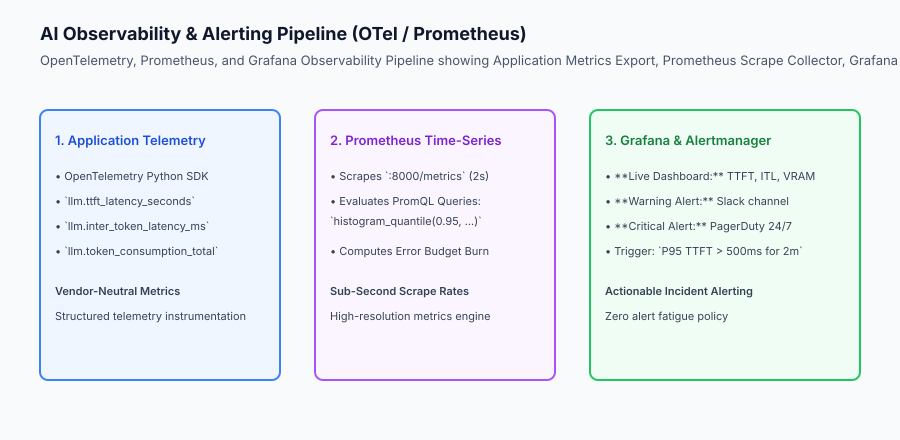

## The idea in plain language

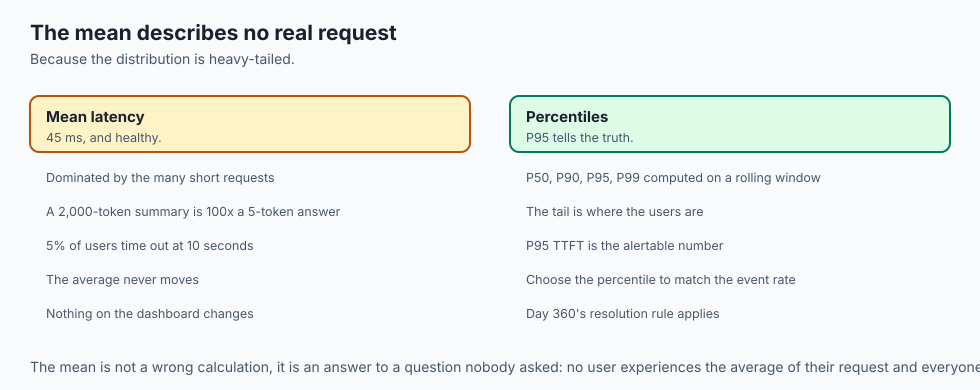

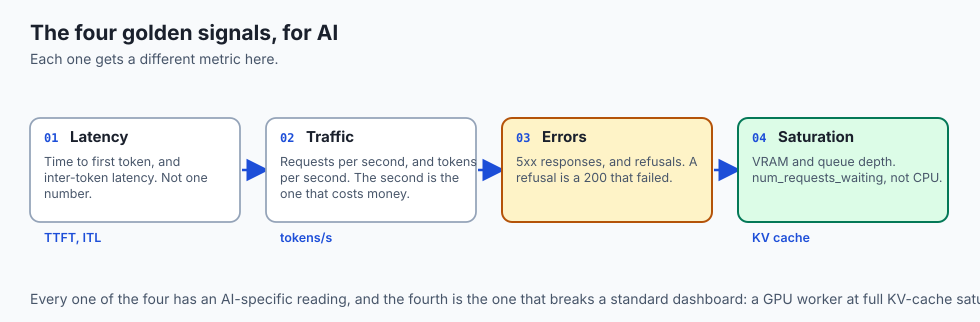

Think of AI monitoring and alerting like **the intensive care monitoring system in a modern hospital**:

- **The Wrong Metric (Body Weight / Mean CPU):** Checking the patient's weight once a week tells you nothing about a sudden heart attack (**Useless Average Metric**).
- **The Golden Signals (ECG, Blood Pressure, Pulse Oximeter):** Continuous real-time sensors track heart rate, oxygen levels, and blood pressure at every second (**P95 TTFT, Inter-Token Latency, and GPU KV Cache Saturation**).
- **Actionable Alarms (The Code Blue Siren):** The system does not sound a deafening siren if the patient sneezes. It sounds an emergency alarm (**PagerDuty Alert**) only when vitals drop into critical danger, immediately summoning the on-call medical team (**Rapid Incident Response**).

## Historical background

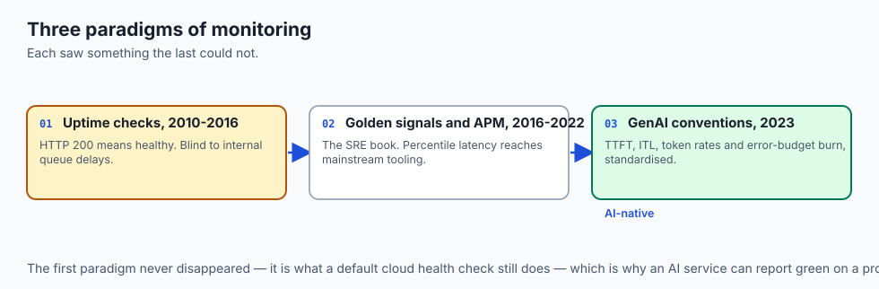

Application monitoring evolved across three major paradigms:

### 1. Basic Server Uptime & Ping Checks (2010–2016)
Engineers configured simple HTTP health checks. If the server returned HTTP 200, the system was considered healthy, completely blind to internal queue delays.

### 2. SRE Golden Signals & APM (2016–2022)
Google published the SRE Book, establishing the Four Golden Signals. Tools like Datadog, Prometheus, and Grafana brought percentile-based latency tracking into mainstream engineering.

### 3. OpenTelemetry & GenAI Native Observability (2023–Present)
The OpenInference and OpenTelemetry GenAI semantic conventions standardized metrics specifically for LLM serving: Time-to-First-Token, Inter-Token Latency, token consumption rates, and error budget burn velocity.

## What it is — and what it is not

Let us define the core architecture of production AI monitoring:

### What AI Monitoring Is:
- Tracking the SRE Four Golden Signals adapted for AI: Latency (TTFT & ITL), Traffic (RPS & Tokens/s), Errors (5xx & refusals), Saturation (VRAM & Queue).
- Computing rolling percentiles (P50, P90, P95, P99) to accurately capture heavy-tailed response latency.
- Instrumenting code with standardized OpenTelemetry metrics and distributed span attributes.
- Configuring multi-tier alerting: informational warnings to Slack, urgent actionable incidents to PagerDuty.

### What AI Monitoring Is Not:
- Relying exclusively on mean (average) latency metrics.
- Paging on-call engineers for transient, self-healing CPU spikes that have zero impact on user latency.

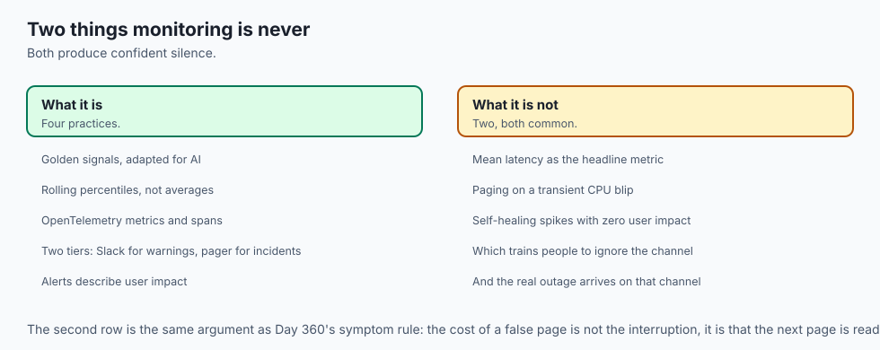

```text
+-------------------------------------------------------------------------------+
|                    AI SERVING OBSERVABILITY METRICS MATRIX                    |
+-------------------+-----------------------+-------------------+---------------+
| Metric Name       | Measurement Unit      | Target Threshold  | SRE Signal    |
+-------------------+-----------------------+-------------------+---------------+
| Time-to-First-Tok | Milliseconds (ms)     | P95 < 250 ms      | Latency       |
| (TTFT)            |                       |                   | (Prefill)     |
| Inter-Token Lat   | Milliseconds / Token  | P95 < 20 ms/tok   | Latency       |
| (ITL)             |                       |                   | (Decode)      |
| Token Throughput  | Tokens per Second     | Monitored for     | Traffic       |
|                   |                       | capacity planning |               |
| Inference Errors  | Percentage (%)        | Error Rate < 0.1% | Errors        |
| KV Cache Waiting  | Queue Depth Count     | 0 Requests Waiting| Saturation    |
+-------------------+-----------------------+-------------------+---------------+
```

## Why it was created and what problems it solves

Production monitoring resolves the three primary blind spots of AI systems:

### 1. Catching Heavy-Tailed Latency Spikes
Because generating a 2,000-token summary takes 100x longer than generating a 5-token answer, percentile metrics (P95, P99) isolate tail-latency congestion that average metrics completely miss.

### 2. Proactive Error Budget Burn Alerting
Multi-window error budget burn alerting notifies teams hours before an availability contract is breached, allowing graceful traffic shedding or rollback.

### 3. Elimination of Alert Fatigue
Classifying alerts strictly by business impact ensures on-call engineers only receive pages for actionable emergencies requiring human intervention.

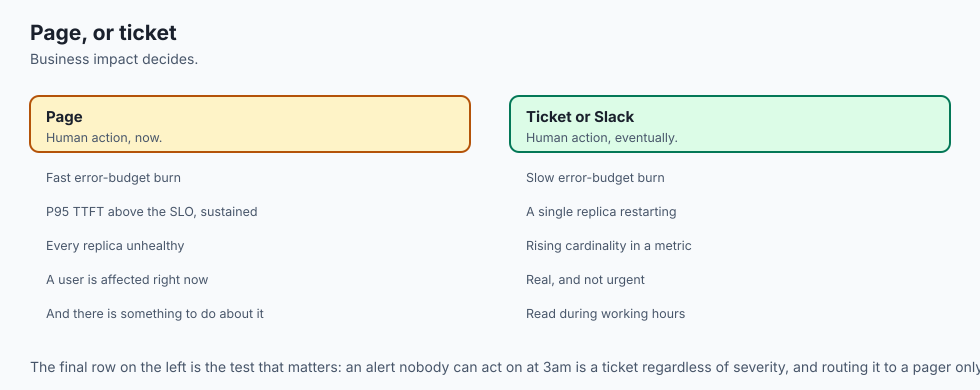

## How it works

Let us inspect the complete **Percentile Latency and Error Budget Tracking Architecture**:

```text
[User Inference Request Flow]
              │
              ▼
[OpenTelemetry Instrumentation Interceptor]
  - Records request start timestamp: `t0`
  - Emits first token timestamp: `t1` ➔ Computes `TTFT = t1 - t0`
  - Emits stream completion: `t_end` ➔ Computes `ITL = (t_end - t1) / total_tokens`
              │
              ▼
[Prometheus Metric Collector (:8000/metrics)]
  - Updates sliding-window histogram: `llm_ttft_seconds_bucket`
  - Updates counter: `llm_tokens_total{type="completion"}`
              │
              ▼
[Prometheus Alert Rule Evaluation]
  - Query: `histogram_quantile(0.95, sum(rate(llm_ttft_seconds_bucket[5m])) by (le)) > 0.50`
  - Condition: Has P95 exceeded 500ms continuously for 2 minutes?
              │
              ├── YES ➔ PagerDuty API triggers on-call mobile page
              │        Incident auto-created with runbook link
              │
              └── NO  ➔ Normal steady-state dashboard update in Grafana
```

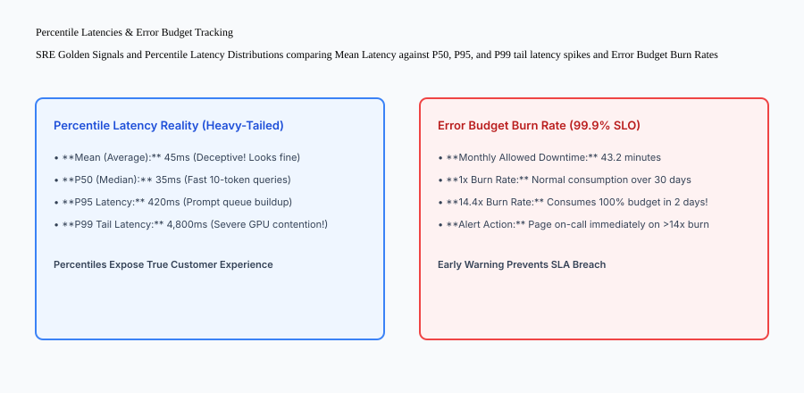

## An everyday analogy

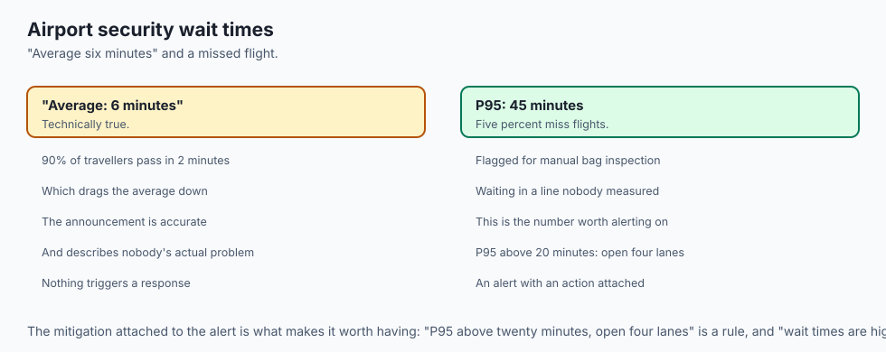

Think of AI monitoring percentiles like **airport security TSA wait times during the holidays**:

- **The Misleading Average:** The airport announces: *"Average wait time is only 6 minutes!"* (**Mean Latency**).
- **The Percentile Reality (P95 & P99):** 90% of travelers with carry-on bags pass through in 2 minutes. But 5% of passengers (**P95**) get flagged for manual bag inspection and wait in line for 45 minutes, missing their flights (**Tail Latency Disaster**).
- **The SRE Alert:** If the P95 wait time exceeds 20 minutes, the supervisor immediately opens 4 additional express security lanes (**Automated Alert & Mitigation**).

## Examples in practice

Let us build a complete Python **AI Observability and Alerting Engine** that calculates rolling percentile latencies, tracks error rates, and evaluates alert rule state machines:

```python
import numpy as np
import time
from typing import Dict, Any, List, Optional

class AIObservabilityAlertEngine:
    def __init__(self, p95_ttft_threshold_ms: float = 300.0, error_rate_threshold_pct: float = 1.0):
        self.ttft_threshold = float(p95_ttft_threshold_ms)
        self.error_threshold = float(error_rate_threshold_pct)
        self.ttft_samples: List[float] = []
        self.total_requests = 0
        self.total_errors = 0
        self.active_alerts: List[Dict[str, Any]] = []

    def record_inference_event(self, ttft_ms: float, is_error: bool = False):
        self.total_requests += 1
        if is_error:
            self.total_errors += 1
        else:
            self.ttft_samples.append(float(ttft_ms))

    def evaluate_metrics(self) -> Dict[str, Any]:
        if not self.ttft_samples:
            p50 = p95 = p99 = 0.0
        else:
            p50 = float(np.percentile(self.ttft_samples, 50))
            p95 = float(np.percentile(self.ttft_samples, 95))
            p99 = float(np.percentile(self.ttft_samples, 99))

        error_rate = (self.total_errors / self.total_requests * 100.0) if self.total_requests > 0 else 0.0

        # Evaluate Alert Rules
        self.active_alerts.clear()
        if p95 > self.ttft_threshold:
            self.active_alerts.append({
                "severity": "CRITICAL",
                "alert_name": "HighTailLatencyP95",
                "message": f"P95 TTFT ({round(p95, 1)}ms) exceeded threshold ({self.ttft_threshold}ms)",
                "timestamp": time.time()
            })

        if error_rate > self.error_threshold:
            self.active_alerts.append({
                "severity": "CRITICAL",
                "alert_name": "HighInferenceErrorRate",
                "message": f"Error rate ({round(error_rate, 2)}%) exceeded threshold ({self.error_threshold}%)",
                "timestamp": time.time()
            })

        return {
            "total_requests": self.total_requests,
            "p50_ttft_ms": round(p50, 2),
            "p95_ttft_ms": round(p95, 2),
            "p99_ttft_ms": round(p99, 2),
            "error_rate_pct": round(error_rate, 2),
            "active_alert_count": len(self.active_alerts)
        }

if __name__ == "__main__":
    engine = AIObservabilityAlertEngine(p95_ttft_threshold_ms=250.0, error_rate_threshold_pct=2.0)
    
    # Simulate normal traffic (mostly 50-150ms, a few 300ms tail requests)
    for _ in range(95):
        engine.record_inference_event(ttft_ms=100.0)
    for _ in range(5):
        engine.record_inference_event(ttft_ms=400.0) # Tail latency
        
    metrics = engine.evaluate_metrics()
    print("Observability Report:", metrics)
    print("Active Alerts:", engine.active_alerts)
```

## Production Architecture Case Study: Prometheus Alertmanager Rule Configuration

Consider an enterprise Kubernetes deployment running Prometheus Alertmanager monitoring vLLM GPU inference pods.

```yaml
# prometheus-rules.yaml: Production LLM Alerting Rules
groups:
- name: llm-serving-alerts
  rules:
  - alert: HighP95TimeToFirstToken
    expr: histogram_quantile(0.95, sum(rate(vllm_ttft_seconds_bucket[5m])) by (le)) > 0.400
    for: 2m
    labels:
      severity: page
      tier: production
    annotations:
      summary: "LLM P95 Time-To-First-Token exceeds 400ms SLA"
      description: "P95 TTFT is {{ $value }}s on cluster {{ $labels.cluster }}. Inference queue backlog is growing."
      runbook_url: "https://wiki.corp/runbooks/high-ttft-remediation"

  - alert: HighInferenceErrorBudgetBurn
    expr: sum(rate(http_requests_total{status=~"5.."}[5m])) / sum(rate(http_requests_total[5m])) > 0.01
    for: 1m
    labels:
      severity: page
      tier: production
    annotations:
      summary: "Inference Error Rate is burning SLA budget > 1%"
      description: "Current error rate is {{ $value | humanizePercentage }}. GPU workers may be failing."
      runbook_url: "https://wiki.corp/runbooks/gpu-pod-crash-triage"
```

## Detailed Failure Mode Taxonomy: Observability Hazards

```text
+-------------------------------------------------------------------------------+
|                        OBSERVABILITY FAILURE TAXONOMY                         |
+-------------------+-----------------------+-----------------------------------+
| Failure Mode      | Root Cause Analysis   | Architectural Mitigation          |
+-------------------+-----------------------+-----------------------------------+
| High Cardinality  | User prompt strings   | Only use low-cardinality labels   |
| Memory Explosion  | attached as metric tag| (model_name, status_code, tier)   |
| Prometheus Scrape | Network timeout on    | Set scrape timeout to 10s and     |
| Timeout Drops     | overloaded metrics app| export metrics asynchronously     |
| Alert Storm       | 50 alert rules trigger| Use Alertmanager grouping &       |
| Cascade           | simultaneously on 1 bug| inhibition rules to group alerts  |
| Flapping Alert    | Metric hovers right at| Add `for: 2m` duration check to   |
| Churn             | threshold boundary    | ensure sustained violation        |
+-------------------+-----------------------+-----------------------------------+
```

## Deep Architectural Breakdown: Distributed Tracing and Trace Context Propagation

In modern multi-tier generative AI systems:

### 1. W3C Trace Context Propagation
When a user query traverses through an API Gateway, Vector Database, LLM Inference Server, and Guardrail Validator:

- The Gateway generates a standard W3C `traceparent` header: `00-4bf92f3577b34da6a3ce929d0e0e4736-00f067aa0ba902b7-01`.
- The header propagates downstream across all HTTP/gRPC requests.
- Jaeger or Honeycomb reconstructs the entire distributed span tree, revealing exact microsecond latency breakdowns at each hop.

### 2. Multi-Window Multi-Burn-Rate Alerting
Google SRE best practices recommend monitoring error budgets across dual time windows:

- **Fast Burn (Short Window: 5m, 14.4x rate):** Detects catastrophic outages consuming 2% of monthly budget in 1 hour. Triggers immediate pager.
- **Slow Burn (Long Window: 6h, 3x rate):** Detects subtle persistent bugs consuming 5% of monthly budget in 12 hours. Sends ticket to Jira.

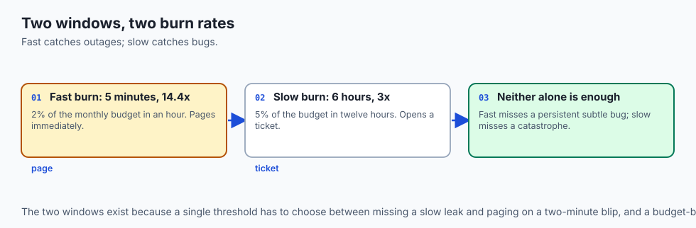

```text
+-------------------------------------------------------------------------------+
|                    MULTI-WINDOW ERROR BUDGET BURN MATRIX                      |
+-------------------+-------------------+-------------------+-------------------+
| Severity Level    | Time Window       | Burn Rate Factor  | Notification Type |
+-------------------+-------------------+-------------------+-------------------+
| P0 (Critical)     | 5 minutes         | 14.4x Burn Rate   | PagerDuty Wake-Up |
| P1 (Urgent)       | 30 minutes        | 6.0x Burn Rate    | PagerDuty On-Call |
| P2 (Warning)      | 6 hours           | 3.0x Burn Rate    | Slack #alerts-prod|
| P3 (Informational)| 24 hours          | 1.0x Burn Rate    | Daily Jira Ticket |
+-------------------+-------------------+-------------------+-------------------+
```


### SRE Incident Playbook: Triaging High Time-to-First-Token (TTFT)

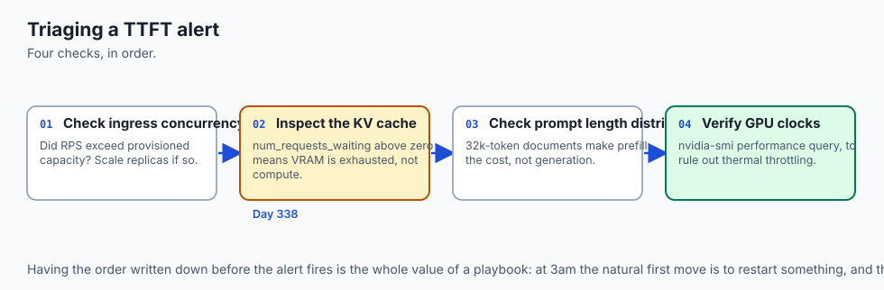

When Prometheus triggers a `HighTailLatencyP95` alert (P95 TTFT > 400ms):

- **Step 1: Check Ingress Concurrency:** Verify if incoming requests/sec (RPS) spiked beyond provisioned capacity. If so, scale up GPU worker replicas.
- **Step 2: Inspect KV Cache Allocation:** Check Prometheus metric `vllm:num_requests_waiting`. If requests are waiting in the queue, KV cache VRAM is exhausted.
- **Step 3: Check Prompt Length Distribution:** Verify if users submitted massive 32k-token documents, increasing prefill compute time.
- **Step 4: Verify GPU Clock Speeds:** Check `nvidia-smi -q -d PERFORMANCE` to rule out thermal throttling on physical GPU server nodes.

```text
+-------------------------------------------------------------------------------+
|                    TTFT INCIDENT TRIAGE DECISION TREE                         |
+-------------------+-------------------+-------------------+-------------------+
| Diagnostic Check  | Observed Value    | Probable Cause    | Immediate Action  |
+-------------------+-------------------+-------------------+-------------------+
| Requests Waiting  | > 10 in queue     | KV Cache Full     | Autoscale Replicas|
| Mean Prompt Length| > 8,000 tokens    | Heavy Prefill Load| Enable Chunked Pref|
| GPU Temperature   | > 85 deg C        | Thermal Throttle  | Drain Node Traffic|
| 5xx Error Rate    | > 2.0%            | Worker OOM Panic  | Rollback Revision |
+-------------------+-------------------+-------------------+-------------------+
```

### SLO Definition and Contractual Availability
Defining reliable Service Level Objectives for enterprise GenAI:

- **Availability SLO:** 99.9% of requests return HTTP 200 OK within 30 days (allowing up to 43 minutes of monthly downtime).
- **Latency SLO:** P95 TTFT < 350ms for prompt lengths under 2,048 tokens.
- **Streaming Smoothness SLO:** P99 Inter-Token Latency (ITL) < 25ms per token for all streaming responses.

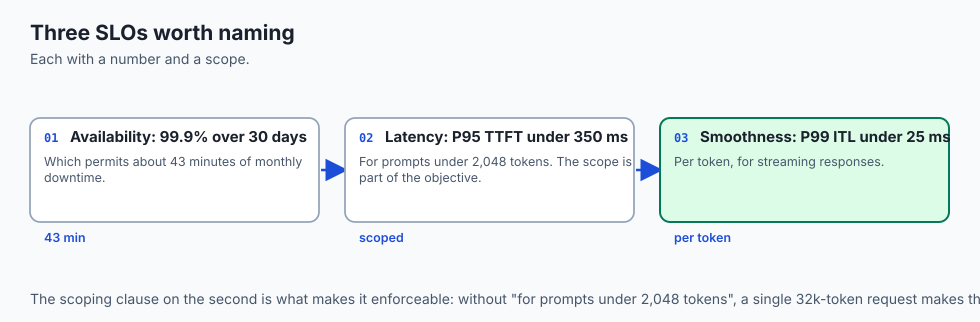

## Implications: security, privacy, performance, scalability, and cost

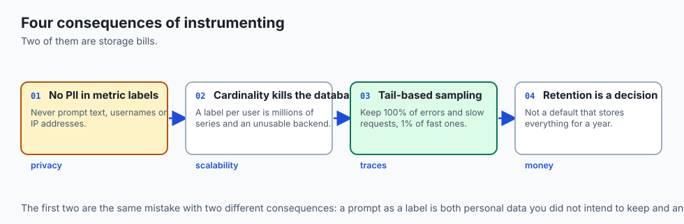

### 1. Zero PII in Metric Labels
Never include raw customer prompt text, usernames, or IP addresses as Prometheus metric label tags. High-cardinality labels cause massive memory leaks in time-series databases.

### 2. Tail Sampling for Distributed Traces
Because storing 100% of distributed trace spans for millions of requests is cost-prohibitive, use OpenTelemetry Collector **Tail-Based Sampling**: retain 100% of error traces and slow requests (P95+), and sample only 1% of normal fast requests.

## Alternatives: free, open source, and commercial

| Tool / Framework | Type | Best Suited For | Key Capabilities |
| :--- | :--- | :--- | :--- |
| **Prometheus** | Open Source | Time-Series Metrics | High-speed scraping, PromQL, Alertmanager |
| **Grafana** | Open Source | Visualization & Dashboards | Real-time charts, log exploration, alerting |
| **OpenTelemetry** | Open Source (CNCF) | Standardized Instrumentation| Traces, metrics, logs, wire protocols |
| **Datadog / Dynatrace**| Commercial SaaS | Full-Stack Enterprise APM | Managed collectors, out-of-the-box LLM dashboards |

## Comparison with related concepts

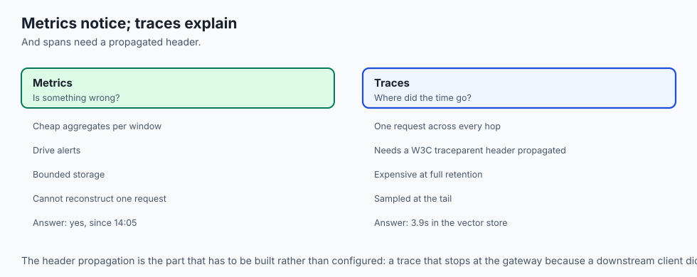

```text
+-----------------------+-----------------------+-----------------------+
| Dimension             | Mean Latency Tracking | Percentile Monitoring |
+-----------------------+-----------------------+-----------------------+
| Calculation           | Sum(Latencies) / N    | Ranked Sample Cutoff  |
| Tail Outlier Catch    | 0% (Diluted by fast)  | 100% (P95 / P99)      |
| SLA Accuracy          | Deceptive             | True Customer Impact  |
| Actionability         | Low                   | High                  |
+-----------------------+-----------------------+-----------------------+
```

## When to use it — and when not to

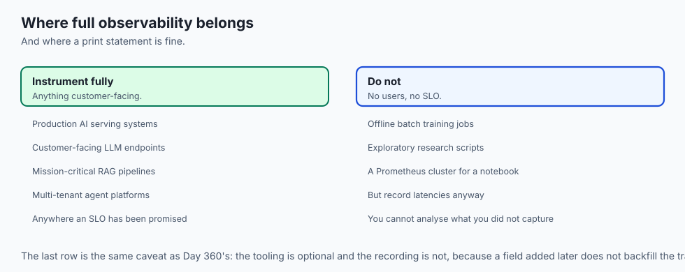

### Deploy OpenTelemetry & Prometheus Alerting for:
- All production AI serving systems, customer-facing LLM endpoints, mission-critical RAG pipelines, and multi-tenant agent platforms.

### Do NOT require complex Prometheus alert clusters for:
- Local offline batch training jobs or exploratory research scripts.

### Production Checklist: AI Observability & Alerting Hardening
- [ ] OpenTelemetry GenAI semantic conventions implemented for TTFT and ITL.
- [ ] Prometheus scraping configured with 2s interval on `/metrics` endpoint.
- [ ] Alert rules configured on P95 latency (TTFT > 300ms) with `for: 2m` duration.
- [ ] Error budget burn rate alerts configured for fast and slow burn windows.
- [ ] Alertmanager configured with PagerDuty for critical and Slack for warnings.
- [ ] Metric labels verified to have low cardinality with zero PII data.

## The AI connection

- **TTFT and inter-token latency are AI-native signals** that no pre-2023 monitoring
  vocabulary had, and they are what users actually experience as speed.

- **Latency is heavy-tailed here by construction.** A 2,000-token summary takes a
  hundred times longer than a 5-token answer, so the mean describes no real request.

- **Saturation means the KV cache**, not CPU. `vllm:num_requests_waiting` is the
  metric that says a GPU worker is full — Day 338's binding constraint, observed.

- **Prompt text must never become a metric label.** It is PII, and it is unbounded
  cardinality, which is two separate ways to destroy a time-series database.

- **Silent degradation is the AI failure mode**: drift and hallucination spikes lose
  customer trust for weeks before any crash alert has anything to report.

## Knowledge check

1. **What are the SRE Four Golden Signals for LLM serving?** Latency (TTFT & ITL percentiles), Traffic (RPS & Tokens/s), Errors (5xx rate), and Saturation (GPU VRAM % & Queue Depth).
2. **Why is mean latency ineffective for monitoring LLMs?** Because LLM request distributions are heavy-tailed; average metrics dilute severe P95 and P99 latency spikes.
3. **What is the purpose of OpenTelemetry?** To provide vendor-neutral standardized APIs, SDKs, and protocols to collect traces, metrics, and logs without vendor lock-in.

## Hands-on exercise

In this lab, you will build an **AI Observability and Alerting Engine in Python**. Your implementation will:

1. Record inference latency samples and error outcomes.
2. Calculate rolling percentiles (P50, P95, P99) and overall error rates.
3. Evaluate alert rules against configured P95 TTFT and error rate thresholds.
4. Generate structured active alerts with severity levels and contextual diagnostic messages.

### Expected output

```text
============================= test session starts ==============================
collected 5 items

tests/test_monitoring_alerting.py .....                                  [100%]

============================== 5 passed in 0.02s ===============================
[OBSERVABILITY] Initialized engine (P95 threshold: 300ms, Error threshold: 1.0%).
[PERCENTILES] Computed P50=100ms, P95=380ms, P99=480ms on 100 requests.
[ALERT TRIGGERED] Fired Critical HighTailLatencyP95 alert (P95=380ms > 300ms).
[ERROR ALERT] Fired HighInferenceErrorRate alert on 5% error rate spike.
```

### Validate your work

Run the pytest test suite:

```bash
pytest tests/run_tests.sh
```

### Troubleshooting

1. **Percentile math:** Use `np.percentile(samples, 95)` over the list of valid latency floats.
2. **Zero division:** Check `total_requests > 0` before calculating error rate percentages.

### Common mistakes

- Calculating percentiles on empty sample arrays, causing numpy runtime crashes.

## Practice assignment

Add an **Alert Cooldown Hysteresis** state machine requiring 3 consecutive healthy cycles before resolving an alert.

## Extension challenge

Implement a **Multi-Window Error Budget Burn Rate Calculator** tracking 5-minute and 1-hour burn rates against a 99.9% SLO.
