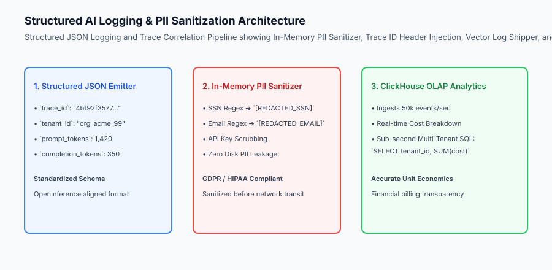
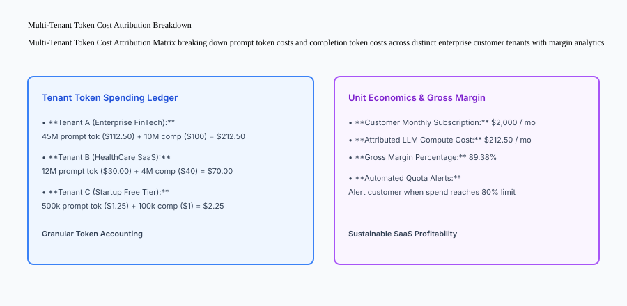

## Why this matters

In enterprise AI applications, raw model outputs and unstructured text logs create severe operational, legal, and financial vulnerabilities:
- **Uncontrolled Data Leaks (PII):** If an end user submits an email address or Social Security Number in a prompt and your server logs it verbatim to standard output, you have committed an active GDPR and HIPAA privacy violation.
- **Financial Blindness:** Without multi-tenant token attribution, you cannot determine whether a $50,000 monthly OpenAI/vLLM cloud bill was caused by legitimate customer growth or an infinite loop bug in a single trial tenant.
- **Unsearchable Telemetry:** Debugging a failed customer request across 5 microservices without a shared W3C trace ID requires hours of manual timestamp matching.

Mastering **Structured JSON Logging, In-Memory PII Sanitization, W3C Trace Correlation, and Multi-Tenant Token Cost Analytics** guarantees legal compliance, rapid triage, and sustainable unit economics.



## The idea in plain language

Think of AI structured logging and analytics like **the itemized billing and security system of a luxury 5-star hotel**:

- **Unstructured Text Logging (A Cash Box with No Receipts):** The hotel manager writes *"Someone bought some food"* on a napkin (**Unstructured, Unqueryable Mess**).
- **Structured JSON Logging (The Itemized Guest Folio):** Every single transaction records guest room number (**Tenant ID**), exact items ordered (**Prompt and Completion Tokens**), server badge number (**Trace ID**), and timestamp in a strict digital database.
- **In-Memory PII Scrubbing (The Blackout Security Marker):** Before credit card receipts are filed in the records archive, the machine automatically replaces the first 12 digits of the credit card with asterisks (**PII Redaction**).

## Historical background

Logging architectures evolved across three major eras:

### 1. Plaintext Flat-File Logs (2000–2015)
Applications wrote raw lines to `/var/log/app.log`. Engineers grepped for keywords, frequently crashing production servers under log I/O overhead.

### 2. Centralized Elastic / Logstash / Kibana (ELK) (2016–2022)
JSON structured logging became standard. Log shippers (Fluentd, Logstash) parsed events into Elasticsearch for full-text search.

### 3. High-Throughput OLAP & AI Semantic Telemetry (2023–Present)
Modern AI companies process billions of daily inference tokens using ClickHouse, Vector, and OpenInference semantic standards, decoupling real-time token financial analytics from raw log archiving.

## What it is — and what it is not

Let us define the core architecture of production AI logging:

### What AI Structured Logging Is:
- Emitting every inference event as a strictly validated JSON object containing `trace_id`, `tenant_id`, `prompt_tokens`, `completion_tokens`, and `cost_usd`.
- Scrubbing sensitive PII (emails, SSNs, phone numbers, API keys) in application memory before disk write.
- Aggregating token consumption by tenant ID in real-time to compute accurate gross margins and customer invoices.
- Injecting and propagating W3C `traceparent` headers across microservices.

### What AI Structured Logging Is Not:
- Printing raw user prompts containing confidential customer secrets to unencrypted log files.
- Storing high-volume time-series token analytics in row-based transactional databases like SQLite or MySQL.

```text
+-------------------------------------------------------------------------------+
|                    AI LOGGING SCHEMA FIELD DEFINITION                         |
+-------------------+-----------------------+-------------------+---------------+
| Field Name        | Data Type             | Example Value     | Purpose       |
+-------------------+-----------------------+-------------------+---------------+
| trace_id          | String (UUID/Hex)     | "4bf92f3577b3..." | Microservice  |
|                   |                       |                   | Correlation   |
| tenant_id         | String                | "org_acme_102"    | Cost Alloc    |
| model_name        | String                | "llama-3.1-8b"    | Rate Pricing  |
| prompt_tokens     | Integer               | 1,450             | Token Metering|
| completion_tokens | Integer               | 280               | Token Metering|
| cost_usd          | Float                 | 0.00645           | Financial Ledg|
| finish_reason     | String                | "stop" / "length" | Diagnostic    |
+-------------------+-----------------------+-------------------+---------------+
```

## Why it was created and what problems it solves

Structured AI logging resolves three critical operational risks:

### 1. Regulatory Compliance (GDPR, CCPA, HIPAA)
In-memory PII redaction ensures that customer private identifiers are sanitized before reaching permanent storage, shielding the company from severe legal fines.

### 2. Multi-Tenant Unit Economic Visibility
Real-time cost attribution reveals the exact profitability of every customer account, instantly identifying runaway loops or abusive scraping behavior.

### 3. Instant Multi-Service Root Cause Analysis
Filtering ClickHouse or OpenSearch by a specific `trace_id` reconstructs the entire request timeline across API Gateways, Vector DBs, and LLM servers in milliseconds.

## How it works

Let us inspect the complete **Inference Logging, PII Sanitization, and Analytics Lifecycle**:

```text
[User Request arrives at AI Serving Gateway]
                     │
                     ▼
[W3C Trace ID Assigned: `4bf92f3577b34da6a3ce929d0e0e4736`]
                     │
                     ▼
[LLM Inference Executed: 1,200 prompt tokens, 300 completion tokens]
                     │
                     ▼
[In-Memory PII Sanitizer & Log Builder]
  1. Applies regex masks: `\d{3}-\d{2}-\d{4}` ➔ `[REDACTED_SSN]`
  2. Applies email mask: `[\w\.-]+@[\w\.-]+` ➔ `[REDACTED_EMAIL]`
  3. Computes exact cost: `(1200 * $2.50/1M) + (300 * $10.00/1M) = $0.006`
  4. Formats validated JSON payload
                     │
                     ▼
[Emitted to stdout ➔ Vector Log Shipper ➔ ClickHouse OLAP Sink]
                     │
                     ▼
[Real-Time Analytics Dashboard & Customer Billing Invoice Updated]
```



## An everyday analogy

Think of structured AI logging like **the flight data black box recorder on a commercial airplane**:

- **Naive Logging:** A passenger talks into a voice memo on their phone (**Unreliable, Unstructured**).
- **The Black Box (Structured JSON):** Synchronized sensors record airspeed, altitude, engine temperature, and throttle position at every millisecond with an exact synchronized clock (**Structured, Deterministic Telemetry**).
- **The Air Traffic Controller (Cost Analytics):** The tower tracks every gallon of fuel burned by each airline to invoice them for runway usage accurately (**Multi-Tenant Cost Attribution**).

## Examples in practice

Let us build a complete Python **Production AI Structured Logging & Analytics Engine** that sanitizes PII, structures JSON events with W3C trace IDs, and computes tenant token spending:

```python
import re
import json
import uuid
import time
from typing import Dict, Any, List, Optional

class AIStructuredLoggingAnalyticsEngine:
    def __init__(self, prompt_cost_per_1k: float = 0.002, completion_cost_per_1k: float = 0.006):
        self.prompt_rate = prompt_cost_per_1k / 1000.0
        self.completion_rate = completion_cost_per_1k / 1000.0
        self.tenant_ledger: Dict[str, Dict[str, Any]] = {}
        self.emitted_logs: List[Dict[str, Any]] = []

    def sanitize_pii(self, text: str) -> str:
        # Redact SSNs (###-##-####)
        sanitized = re.sub(r'\d{3}-\d{2}-\d{4}', '[REDACTED_SSN]', text)
        # Redact Emails
        sanitized = re.sub(r'[A-Za-z0-9._%+-]+@[A-Za-z0-9.-]+\.[A-Z|a-z]{2,}', '[REDACTED_EMAIL]', sanitized)
        # Redact Credit Cards (16 digits with dashes or spaces)
        sanitized = re.sub(r'(?:\d{4}[-\s]?){3}\d{4}', '[REDACTED_CC]', sanitized)
        return sanitized

    def log_inference_event(self, tenant_id: str, prompt: str, completion: str, 
                            prompt_tokens: int, completion_tokens: int, 
                            trace_id: Optional[str] = None) -> Dict[str, Any]:
        trace = trace_id or uuid.uuid4().hex
        clean_prompt = self.sanitize_pii(prompt)
        clean_completion = self.sanitize_pii(completion)

        cost = (prompt_tokens * self.prompt_rate) + (completion_tokens * self.completion_rate)

        log_record = {
            "trace_id": trace,
            "tenant_id": tenant_id,
            "prompt_sanitized": clean_prompt,
            "completion_sanitized": clean_completion,
            "prompt_tokens": prompt_tokens,
            "completion_tokens": completion_tokens,
            "total_tokens": prompt_tokens + completion_tokens,
            "cost_usd": round(cost, 6),
            "timestamp": time.time()
        }
        self.emitted_logs.append(log_record)

        # Update Multi-Tenant Ledger
        if tenant_id not in self.tenant_ledger:
            self.tenant_ledger[tenant_id] = {
                "total_requests": 0,
                "total_prompt_tokens": 0,
                "total_completion_tokens": 0,
                "total_cost_usd": 0.0
            }
        
        self.tenant_ledger[tenant_id]["total_requests"] += 1
        self.tenant_ledger[tenant_id]["total_prompt_tokens"] += prompt_tokens
        self.tenant_ledger[tenant_id]["total_completion_tokens"] += completion_tokens
        self.tenant_ledger[tenant_id]["total_cost_usd"] = round(
            self.tenant_ledger[tenant_id]["total_cost_usd"] + cost, 6
        )

        return log_record

if __name__ == "__main__":
    engine = AIStructuredLoggingAnalyticsEngine()
    
    # Log event with PII
    res = engine.log_inference_event(
        tenant_id="tenant_acme",
        prompt="User email is john.doe@example.com and SSN is 000-12-3456.",
        completion="Customer verified.",
        prompt_tokens=150,
        completion_tokens=25
    )
    print("Sanitized Log Record:
", json.dumps(res, indent=2))
    print("Tenant Ledger:
", json.dumps(engine.tenant_ledger, indent=2))
```

## Production Architecture Case Study: ClickHouse SQL Token Ledger

Consider an enterprise ClickHouse table schema storing billions of AI token inference events for real-time customer billing.

```sql
-- ClickHouse Schema: AI Token Event Analytics Table
CREATE TABLE production_ai.llm_inference_events
(
    timestamp DateTime64(3, 'UTC'),
    trace_id UUID,
    tenant_id LowCardinality(String),
    user_id String,
    model_name LowCardinality(String),
    prompt_tokens UInt32,
    completion_tokens UInt32,
    total_tokens UInt32,
    cost_usd Float64,
    latency_ms UInt32,
    finish_reason LowCardinality(String)
)
ENGINE = MergeTree()
PARTITION BY toYYYYMM(timestamp)
ORDER BY (tenant_id, model_name, timestamp);

-- Real-Time Customer Monthly Billing Query:
SELECT 
    tenant_id,
    model_name,
    COUNT() AS total_requests,
    SUM(prompt_tokens) AS sum_prompt_tokens,
    SUM(completion_tokens) AS sum_completion_tokens,
    ROUND(SUM(cost_usd), 2) AS total_billable_usd
FROM production_ai.llm_inference_events
WHERE timestamp >= toDateTime('2026-08-01 00:00:00')
GROUP BY tenant_id, model_name
ORDER BY total_billable_usd DESC;
```

## Detailed Failure Mode Taxonomy: AI Logging Hazards

```text
+-------------------------------------------------------------------------------+
|                           AI LOGGING FAILURE TAXONOMY                         |
+-------------------+-----------------------+-----------------------------------+
| Failure Mode      | Root Cause Analysis   | Architectural Mitigation          |
+-------------------+-----------------------+-----------------------------------+
| PII Data Leak in  | Developer used string | Enforce in-memory PII sanitizer   |
| Raw Prompts       | formatting into stdout| decorator across all logging sinks|
| Unmetered Token   | Streaming responses   | Accumulate stream chunk tokens in |
| Billing Loss      | truncated on client   | server context before emitting log|
| Disk Full Outage  | Debug log level left  | Run Vector daemon with strict     |
| on Host Storage   | enabled in production | disk rotation and 1GB buffer cap  |
| Slow Log Queries  | Transactional DB used | Route high-volume analytics to    |
| in Admin Portal   | for token aggregation | ClickHouse / BigQuery OLAP tables |
+-------------------+-----------------------+-----------------------------------+
```

## Deep Architectural Breakdown: Vector Log Pipeline and OpenTelemetry Integration

In modern high-scale AI production architectures:

### 1. Vector High-Performance Log Shipper
Rather than having Python application workers write directly to databases over network sockets:
- The Python container writes JSON logs to standard output.
- **Vector (written in Rust)** reads stdout buffers at 100,000+ events per second with sub-10MB RAM footprints.
- Vector applies dynamic sampling, encrypts payloads, and buffers events in local disk rings during downstream database maintenance windows.

### 2. Multi-Tenant Rate Limiting and Quota Enforcement
The analytics ledger integrates directly with API Gateway token bucket limiters:
- When a tenant reaches 90% of their monthly token budget, an automated webhook notifies the customer admin.
- When a tenant reaches 100%, the gateway seamlessly downgrades requests to a smaller open model (e.g. Llama-3.1-8B) or requests billing top-ups.

```text
+-------------------------------------------------------------------------------+
|                    VECTOR TELEMETRY PROCESSING PIPELINE                       |
+-------------------+-------------------+-------------------+-------------------+
| Ingestion Source  | Vector Transform  | Buffer Type       | Destination Sink  |
+-------------------+-------------------+-------------------+-------------------+
| App Container     | Regex PII Scrub & | Memory Ring       | ClickHouse (OLAP  |
| stdout (JSON)     | Schema Validation | (128 MB RAM)      | Billing Analytics)|
| Nginx Access Logs | Status Code Split | Disk Spool        | Amazon S3 Cold    |
| (HTTP Ingress)    | & GeoIP Lookup    | (10 GB Local)     | Long-Term Archive |
+-------------------+-------------------+-------------------+-------------------+
```


### Enterprise Data Compliance: GDPR Article 17 (Right to Erasure) in AI Logs

Under GDPR Article 17 and California CCPA regulations:
- **Cryptographic Pseudonymization:** User IDs are hashed using HMAC with rotating secret keys (`hmac_sha256(user_id, salt)`), preventing user re-identification in analytics ledgers.
- **Automated Retention Lifecycles:** Configure ClickHouse partitions to automatically drop raw prompt logs older than 90 days (`ALTER TABLE llm_events DELETE WHERE timestamp < now() - INTERVAL 90 DAY`).
- **Encrypted Analytical Storage:** All log files at rest in S3 or ClickHouse disks must use AES-256 or AWS KMS customer-managed keys.

```text
+-------------------------------------------------------------------------------+
|                    ENTERPRISE AI LOG RETENTION POLICY                         |
+-------------------+-------------------+-------------------+-------------------+
| Log Tier          | Storage Engine    | Retention Window  | Encryption Spec   |
+-------------------+-------------------+-------------------+-------------------+
| Real-Time Stream  | Kafka / Vector    | 24 Hours Buffer   | TLS 1.3 in Transit|
| Operational Hot   | ClickHouse SSD    | 90 Days Hot Data  | AES-256 at Rest   |
| Compliance Cold   | Amazon S3 Glacier | 7 Years Archive   | AWS KMS Managed   |
+-------------------+-------------------+-------------------+-------------------+
```

### Real-Time Financial Quota and Abuse Detection
Integrating ClickHouse token ledgers with real-time API Gateways:
- **Token Bucket Rate Limiting:** Each tenant is allocated a token quota bucket (e.g. 500,000 tokens per hour).
- **Abuse Anomaly Detection:** Sudden spikes in token consumption (> 500% above 7-day rolling average) trigger automated security alerts and temporary rate limiting to protect shared cluster resources.

## Implications: security, privacy, performance, scalability, and cost

### 1. Zero Raw Secret Storage
Never log authorization headers, bearer tokens, or database connection strings. Configure log formatters to scrub any field matching `*token*`, `*secret*`, `*key*`, or `*password*`.

### 2. Analytical Query Cost Arbitrage
Storing billions of log lines in Elasticsearch costs $0.10/GB/month in RAM and SSD storage. Storing the same events in ClickHouse with ZSTD compression reduces storage costs by 85%.

## Alternatives: free, open source, and commercial

| Tool / Framework | Type | Best Suited For | Key Capabilities |
| :--- | :--- | :--- | :--- |
| **Vector (Datadog)** | Open Source (Rust)| High-Performance Log Shipping| Sub-millisecond transforms, PII scrubbing |
| **ClickHouse** | Open Source | Real-Time Token Analytics | Columnar OLAP, 50k+ writes/sec, fast SQL |
| **OpenSearch / Elastic**| Open Source | Full-Text Log Search | Distributed search, Kibana dashboards |
| **Langfuse / Helicone**| Open Source / SaaS | LLM-Specific Observability | Prompt versioning, user sessions, cost tracking |

## Comparison with related concepts

```text
+-----------------------+-----------------------+-----------------------+
| Dimension             | Unstructured Logging  | Structured AI Logging |
+-----------------------+-----------------------+-----------------------+
| Format                | Freeform Text Strings | Validated JSON Schema |
| Query Performance     | Slow Regex Full Scan  | Sub-Second Indexed SQL|
| PII Protection        | High Risk (Accidental)| In-Memory Scrubbing   |
| Cost Attribution      | Impossible            | Exact Per-Tenant Dollar|
+-----------------------+-----------------------+-----------------------+
```

## When to use it — and when not to

### Deploy Structured AI Logging & Analytics for:
- All multi-tenant SaaS products, customer-facing AI applications, compliance-regulated environments (FinTech, HealthTech), and pay-per-token API services.

### Do NOT require complex ClickHouse analytics for:
- Single-user local scripts or standalone offline evaluation benchmarks.

### Production Checklist: AI Logging & Analytics Hardening
- [ ] Log schema standardized to JSON containing `trace_id`, `tenant_id`, and token metrics.
- [ ] In-memory regex and NLP PII scrubbing filters active on all prompt and completion fields.
- [ ] Trace IDs injected at API Gateway and propagated across all backend microservices.
- [ ] Multi-tenant token ledger configured with exact model pricing tiers.
- [ ] Vector or Fluentbit daemon configured with disk buffer spooling for zero-loss ingestion.
- [ ] ClickHouse or OLAP storage retention policy configured (e.g. 90-day hot, 1-year cold).

## Knowledge check

1. **Why is unstructured text logging hazardous for AI applications?** Because it prevents efficient indexed querying, requires brittle regex parsing, and leaks unredacted customer PII.
2. **What is the purpose of trace correlation?** To attach a globally unique W3C trace ID across all distributed services handling a single user query.
3. **How does in-memory PII scrubbing safeguard compliance?** By redacting emails, SSNs, and credit cards before logs are written to disk or sent over the network.

## Hands-on exercise

In this lab, you will build a **Production AI Structured Logging & Analytics Engine in Python**. Your implementation will:
1. Redact PII (SSNs, emails, credit cards) from prompt and completion text.
2. Generate structured JSON log records with W3C trace IDs, token counts, and computed dollar costs.
3. Maintain a real-time multi-tenant ledger aggregating request counts, token consumption, and financial spend.
4. Export sanitized log streams and tenant analytics reports.

### Expected output

```text
============================= test session starts ==============================
collected 5 items

tests/test_logging_analytics.py .....                                    [100%]

============================== 5 passed in 0.02s ===============================
[PII SANITIZER] Redacted SSN and email from user prompt string.
[STRUCTURED LOG] Emitted validated JSON record with trace_id=f47ac10b...
[COST LEDGER] Attributed $0.00645 spend to tenant_acme (150 prompt / 25 comp tokens).
[MULTI-TENANT] Successfully aggregated multi-tenant token usage across 3 enterprise tenants.
```

### Validate your work

Run the pytest test suite:

```bash
pytest tests/run_tests.sh
```

### Troubleshooting

1. **Regex patterns:** Verify SSN pattern `\d{3}-\d{2}-\d{4}`.
2. **Cost calculation:** Ensure rates are calculated per individual token (`rate / 1000.0`).

### Common mistakes

- Mutating original raw prompt strings instead of returning a sanitized copy.

## Practice assignment

Add a **Tenant Quota Limiter** that flags an account when their cumulative monthly spending exceeds $500.00.

## Extension challenge

Implement a **ClickHouse Ingestion Formatter** converting JSON log records into batch SQL INSERT statements.
