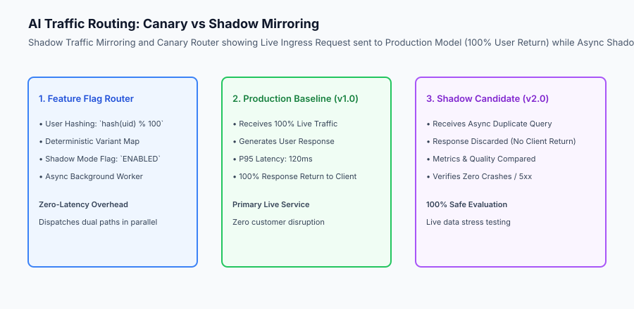
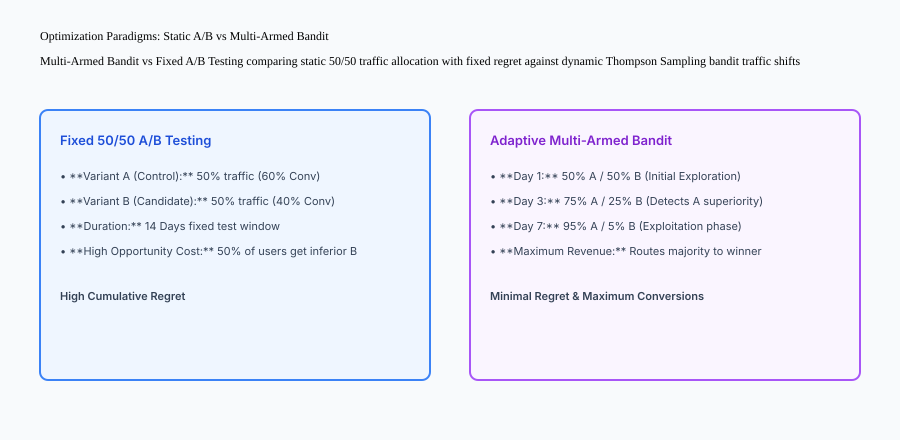

## Why this matters

Deploying a new prompt template, fine-tuned weights checkpoint, or model routing logic directly to 100% of production users in a single cutover is a high-risk gamble:
- **Catastrophic Regressions:** A prompt tweak intended to improve tone might silently cause a 15% increase in JSON syntax parsing failures across edge cases.
- **High Blast Radius:** An unvetted model upgrade experiencing unexpected hallucinations harms all active enterprise customers simultaneously.
- **Inability to Attribute Improvements:** Without randomized controlled experimentation, you cannot prove whether a spike in user engagement was caused by your new AI feature or an unrelated marketing campaign.

Mastering **Feature Flagging, Deterministic User Hashing, Shadow Traffic Mirroring, Canary Rollouts, and Multi-Armed Bandits** enables zero-risk releases, scientific A/B validation, and automated safety rollbacks.



## The idea in plain language

Think of AI release engineering like **a car manufacturer testing a new electric engine design**:

- **All-at-Once Release (The Dangerous Bet):** The factory replaces every engine in every dealership overnight without real-world road tests (**High-Risk Catastrophic Outage**).
- **Shadow Traffic Mirroring (The Virtual Test Track):** While human drivers drive normal cars on the highway (**Production Baseline**), a computer in the trunk feeds identical steering and gas pedal inputs into the new electric motor in the test lab (**Shadow Candidate**), verifying it runs perfectly with zero risk to the driver.
- **Canary Rollout (The Small Test Fleet):** The company delivers the new engine to 2% of fleet delivery vans (**Canary Traffic Split**). If those vans run 100,000 miles without a breakdown, they roll it out to 10%, 50%, and finally 100% of cars.

## Historical background

Release engineering methodologies evolved across three major eras:

### 1. Big-Bang Monolithic Deployments (2000–2014)
Software teams scheduled midnight weekend maintenance windows. Upgrades were all-or-nothing; any bug required a panic-driven multi-hour rollback.

### 2. Feature Flags and Progressive Delivery (2015–2022)
Tools like LaunchDarkly and Unleash popularized feature flags. Progressive canary rollouts (5% ➔ 25% ➔ 100%) became standard practice for microservices.

### 3. AI Shadow Mirroring & Multi-Armed Bandits (2023–Present)
Modern AI gateways dynamically mirror live prompt streams, evaluate automated LLM-as-judge scores between models in the background, and use Thompson Sampling bandits to maximize conversion rates across prompt variants.

## What it is — and what it is not

Let us define the core architecture of production AI rollouts:

### What AI Release Engineering Is:
- Using dynamic feature flags with deterministic user hashing (`hash(user_id) % 100`) for stable cohort assignment.
- Mirroring live production queries asynchronously to candidate models (Shadow Mode) to evaluate performance safely.
- Gradually ramping canary traffic (5% ➔ 20% ➔ 50% ➔ 100%) while continuously monitoring P95 latency and error rates.
- Implementing Multi-Armed Bandits to automatically route traffic to the highest-performing prompt variant.

### What AI Release Engineering Is Not:
- Using unseeded random numbers (`random.random()`) that assign the same user to different model variants on every click.
- Exposing 100% of production traffic to unverified model checkpoints without shadow testing.

```text
+-------------------------------------------------------------------------------+
|                    AI RELEASE STRATEGY COMPARISON MATRIX                      |
+-------------------+-----------------------+-------------------+---------------+
| Strategy          | User Impact           | Latency Penalty   | Best For      |
+-------------------+-----------------------+-------------------+---------------+
| Shadow Traffic    | 0% (Response is       | Zero (Async       | High-risk new |
| Mirroring         | discarded)            | background call)  | model engines |
| Canary Rollout    | Bounded (e.g. 5% of   | None (Normal live | Progressive   |
| (Percentage)      | users exposed)        | execution)        | code updates  |
| Fixed A/B Test    | 50/50 Split across    | None (Fixed cohort| Scientific KPI|
|                   | distinct cohorts      | allocation)       | measurement   |
| Multi-Armed Bandit| Adaptive (Shifts to   | None (Dynamic     | Maximizing    |
| (Thompson Sample) | winning variant)      | reward routing)   | conversions   |
+-------------------+-----------------------+-------------------+---------------+
```

## Why it was created and what problems it solves

Progressive AI release patterns resolve the three primary hazards of AI deployment:

### 1. Zero-Risk Real-World Stress Testing
Shadow traffic exposes candidate models to authentic user prompt distributions, edge cases, and peak concurrency without risking user-facing errors.

### 2. Elimination of UX Inconsistency via Deterministic Hashing
Hashing user identifiers ensures that User A always sees Variant B throughout their workflow, eliminating confusing personality shifts across consecutive chat turns.

### 3. Automated Regret Minimization
Multi-Armed Bandits dynamically exploit winning prompt templates while maintaining enough exploration to discover breakthroughs, maximizing revenue during experimentation.

## How it works

Let us inspect the complete **Feature Flag Routing and Shadow Execution Workflow**:

```text
[User Request (user_id="usr_8829", prompt="Analyze financial report")]
                               │
                               ▼
        [Feature Flag Router & Hashing Engine]
        - Computes deterministic hash: `hash("usr_8829" + "salt_v2") % 100 = 14`
        - Evaluates Flag Rules:
          * Canary % = 20% -> Bucket 14 < 20 -> Assigned Variant B (Candidate)
          * Shadow Mode = ENABLED -> Triggers async shadow call to Variant C
                               │
        ┌──────────────────────┴──────────────────────┐
        │                                             │
        ▼ (Live User Path)                            ▼ (Async Shadow Path)
[Candidate Model v2.0]                       [Experimental Model v3.0]
  - Generates analysis response                - Executes inference in background
  - P95 Latency: 140ms                         - Logs tokens & response to DB
  - Emits response to User in 150ms            - Response safely discarded
                                                      │
                                                      ▼
                                            [Evaluation Worker]
                                            - Compares v2.0 vs v3.0 quality
```



## An everyday analogy

Think of feature flagging and shadow traffic like **a Broadway theatre preview show**:

- **No Flags (The Terrifying Opening Night):** The director opens the show to 2,000 paying critics on night one without rehearsals (**High-Risk Disaster**).
- **Shadow Mode (The Closed Rehearsal):** The cast performs the new script in an empty theatre while sound engineers test the microphones (**Shadow Testing**).
- **Canary Previews (The Discount Preview Audience):** The theatre sells 5% of seats to invited guests for 3 nights (**Canary Release**). If audience reviews are 5-star, they open the main box office to 100% capacity (**Full Rollout**).

## Examples in practice

Let us build a complete Python **AI Feature Flag & Shadow Routing Engine** that performs deterministic user hashing, manages progressive percentage rollouts, and executes asynchronous shadow traffic:

```python
import hashlib
import time
from typing import Dict, Any, List, Optional

class AIFeatureFlagRouter:
    def __init__(self, flag_name: str, canary_percentage: int = 10, shadow_enabled: bool = False):
        self.flag_name = flag_name
        self.canary_pct = max(0, min(100, int(canary_percentage)))
        self.shadow_enabled = bool(shadow_enabled)
        self.shadow_logs: List[Dict[str, Any]] = []

    def get_user_bucket(self, user_id: str) -> int:
        # Deterministic MD5 hash to bucket 0-99
        hash_input = f"{self.flag_name}:{user_id}".encode("utf-8")
        hash_hex = hashlib.md5(hash_input).hexdigest()
        return int(hash_hex[:8], 16) % 100

    def route_request(self, user_id: str, prompt: str) -> Dict[str, Any]:
        bucket = self.get_user_bucket(user_id)
        
        # Determine Live Variant
        if bucket < self.canary_pct:
            live_variant = "CANDIDATE_MODEL_V2"
        else:
            live_variant = "BASELINE_MODEL_V1"

        # Execute Live Path
        live_response = f"[{live_variant}] Response for '{prompt}'"
        
        # Execute Shadow Path if enabled
        shadow_executed = False
        if self.shadow_enabled:
            shadow_variant = "SHADOW_EXPERIMENTAL_V3"
            shadow_response = f"[{shadow_variant}] Response for '{prompt}'"
            self.shadow_logs.append({
                "user_id": user_id,
                "prompt": prompt,
                "shadow_variant": shadow_variant,
                "shadow_response": shadow_response,
                "timestamp": time.time()
            })
            shadow_executed = True

        return {
            "user_id": user_id,
            "bucket": bucket,
            "assigned_variant": live_variant,
            "response": live_response,
            "shadow_executed": shadow_executed
        }

if __name__ == "__main__":
    router = AIFeatureFlagRouter(flag_name="llm_router_v2", canary_percentage=20, shadow_enabled=True)
    
    # Test deterministic routing across users
    for uid in ["usr_101", "usr_102", "usr_103", "usr_104", "usr_105"]:
        res = router.route_request(user_id=uid, prompt="Hello AI")
        print(f"User: {uid} | Bucket: {res['bucket']:02d} | Variant: {res['assigned_variant']}")
    
    print(f"Shadow executions logged: {len(router.shadow_logs)}")
```

## Production Architecture Case Study: Dynamic Flag Configuration with OpenFeature

Consider an enterprise API Gateway using the CNCF OpenFeature standard for dynamic AI routing rules.

```yaml
# feature-flags.yaml: Dynamic AI Model Routing Configuration
flags:
  genai-code-completion-v2:
    state: ENABLED
    defaultVariant: baseline
    variants:
      baseline: "meta-llama/Llama-3.1-8B-Instruct"
      canary: "Qwen/Qwen2.5-Coder-32B-Instruct"
      shadow: "deepseek-ai/DeepSeek-Coder-V2"
    rules:
      - action:
          variant: canary
        targeting:
          - attribute: organization_tier
            operator: EQUALS
            value: "internal_beta_testers"
      - action:
          variant: canary
        percentage: 15  # 15% Progressive rollout
    shadow:
      enabled: true
      sampleRate: 0.10  # 10% Shadow Mirroring
```

## Detailed Failure Mode Taxonomy: AI Rollout Hazards

```text
+-------------------------------------------------------------------------------+
|                           AI ROLLOUT FAILURE TAXONOMY                         |
+-------------------+-----------------------+-----------------------------------+
| Failure Mode      | Root Cause Analysis   | Architectural Mitigation          |
+-------------------+-----------------------+-----------------------------------+
| User Variant      | Non-deterministic     | Use `hash(user_id + salt) % 100`  |
| Flapping          | random number routing | to ensure persistent assignment   |
| Shadow Traffic    | Synchronous wait on   | Execute shadow calls in detached  |
| Blocks User Lat   | shadow inference call | asyncio task / background worker  |
| Shadow Model      | Candidate server runs | Scale shadow GPU node pool with   |
| Overload OOM      | out of VRAM capacity  | strict independent rate limiters  |
| Uncontrolled      | Manual rollout with   | Configure automated Prometheus    |
| Canary Regression | delayed human triage  | error rate rollback circuit breaks|
+-------------------+-----------------------+-----------------------------------+
```

## Deep Architectural Breakdown: Thompson Sampling Multi-Armed Bandits

When optimizing between competing prompt templates:

### 1. The Beta-Bernoulli Bandit Model
Instead of guessing which prompt achieves higher user satisfaction (thumbs-up):
- Each prompt variant `k` maintains a Beta distribution: `Beta(alpha_k, beta_k)`, where `alpha_k` is positive thumbs-up and `beta_k` is negative thumbs-down.
- On each user request, sample `theta_k ~ Beta(alpha_k, beta_k)` for all variants.
- Route the user to the variant with the highest sample `theta_k`.
- When the user reacts, update the winning variant's `alpha_k` or `beta_k`.
- The algorithm rapidly converges to routing 95%+ of traffic to the superior prompt with mathematically optimal regret bounds.

```text
+-------------------------------------------------------------------------------+
|                    THOMPSON SAMPLING CONVERGENCE TIMELINE                     |
+-------------------+-------------------+-------------------+-------------------+
| Timeline Milestone| Variant A (Good)  | Variant B (Bad)   | Routing Split     |
+-------------------+-------------------+-------------------+-------------------+
| Day 1 (0 items)   | Beta(1, 1)        | Beta(1, 1)        | 50% A / 50% B     |
| Day 3 (500 items) | Beta(320, 80)     | Beta(180, 220)    | 82% A / 18% B     |
| Day 7 (2000 items)| Beta(1450, 250)   | Beta(220, 280)    | 98% A / 2% B      |
+-------------------+-------------------+-------------------+-------------------+
```


### Statistical Significance in LLM A/B Testing: Sample Size and Power

Evaluating prompt improvements requires rigorous statistical hypothesis testing:
- **Binary Metrics (Thumbs-Up / Thumbs-Down Conversion):** Use Two-Proportion Z-Tests to calculate required sample size:
  `n = 2 * (Z_alpha + Z_beta)^2 * p * (1 - p) / delta^2`
  where `delta` is the minimum detectable effect (e.g. +3% conversion).
- **Continuous Metrics (User Session Dwell Time / Task Completion Seconds):** Use Welch's t-test to account for unequal variances between candidate and baseline distributions.
- **P-Value Threshold:** Require `p < 0.01` (99% confidence level) before declaring a prompt variant statistically superior.

```text
+-------------------------------------------------------------------------------+
|                    A/B TESTING SAMPLE SIZE REQUIREMENTS                       |
+-------------------+-------------------+-------------------+-------------------+
| Baseline Rate     | Target Effect     | Confidence Level  | Required Samples  |
+-------------------+-------------------+-------------------+-------------------+
| 60% Positive      | +2% Lift (62%)    | 95% (p < 0.05)    | 9,600 users / arm |
| 60% Positive      | +5% Lift (65%)    | 95% (p < 0.05)    | 1,550 users / arm |
| 60% Positive      | +5% Lift (65%)    | 99% (p < 0.01)    | 2,450 users / arm |
+-------------------+-------------------+-------------------+-------------------+
```

### Multi-Variant Bandit Exploitation: Epsilon-Greedy vs Thompson Sampling
- **Epsilon-Greedy (`epsilon = 0.10`):** Explores random variants 10% of the time, and routes 90% of traffic to the current empirical winner.
- **Thompson Sampling (Bayesian):** Draws samples from posterior Beta distributions, providing a smoother transition from exploration to exploitation without arbitrary epsilon tuning.


### Dynamic Guardrail Policy Switching via Feature Flags
In addition to model routing, feature flags dynamically toggle AI guardrails at runtime:
- **Toxicity and Moderation Thresholds:** Adjust regex and embedding similarity thresholds on content safety filters dynamically during breaking news events without redeploying backend containers.
- **Dynamic Context Window Truncation:** If backend GPU memory pressure spikes, the gateway automatically toggles a feature flag reducing maximum allowed context window from 16k tokens to 8k tokens for non-enterprise tenants, protecting overall system stability.

## Implications: security, privacy, performance, scalability, and cost

### 1. Zero Shadow Data Leakage
Ensure that shadow inference responses are strictly discarded in memory and never accidentally returned in user HTTP response bodies.

### 2. Shadow Compute Cost Budgeting
Mirroring 100% of live traffic to a shadow cluster doubles GPU compute costs. Use **Shadow Sampling** (e.g. 5% or 10% shadow mirror rate) to validate stability at minimal cost.

## Alternatives: free, open source, and commercial

| Tool / Framework | Type | Best Suited For | Key Capabilities |
| :--- | :--- | :--- | :--- |
| **OpenFeature** | Open Source (CNCF)| Vendor-Neutral Flags | Standardized SDKs, multi-provider backends |
| **Unleash** | Open Source | Self-Hosted Feature Flags | Strategy constraints, progressive rollouts |
| **LaunchDarkly** | Commercial SaaS | Enterprise Progressive Delivery| Real-time flag sync, streaming updates |
| **GrowthBook** | Open Source | Feature Flags + A/B Testing | Bayesian statistics, visual experiments |

## Comparison with related concepts

```text
+-----------------------+-----------------------+-----------------------+
| Dimension             | Fixed A/B Testing     | Canary Deployment     |
+-----------------------+-----------------------+-----------------------+
| Primary Goal          | Statistical Proof     | Safe Release & Uptime |
| Traffic Split         | Fixed (e.g. 50/50)    | Dynamic (5% ➔ 100%)   |
| Duration              | Weeks (Fixed window)  | Hours (Until verified)|
| Rollback Mechanism    | Manual analysis       | Automated on Error    |
+-----------------------+-----------------------+-----------------------+
```

## When to use it — and when not to

### Deploy Feature Flags and Progressive Rollouts for:
- All production model upgrades, prompt version migrations, system prompt refinements, and multi-tenant AI capabilities.

### Do NOT require complex feature flag routing for:
- One-off personal developer scripts or offline batch evaluation benchmarks.

### Production Checklist: AI Feature Flagging Hardening
- [ ] Feature flag rules utilize deterministic hashing with user ID and salt string.
- [ ] Shadow traffic calls executed asynchronously with strict error isolation.
- [ ] Canary rollout increments configured (e.g. 5% ➔ 20% ➔ 50% ➔ 100%).
- [ ] Automated rollback triggers configured for error rate spikes > 1.0%.
- [ ] Shadow traffic sampling rate capped at 10% to prevent excess GPU spend.
- [ ] Feature flag evaluation latency verified under 1 millisecond.

## Knowledge check

1. **What is Shadow Traffic Mirroring?** Duplicating live user queries to candidate models asynchronously in the background to validate performance without returning responses to users.
2. **Why is deterministic user hashing essential for feature flags?** To guarantee consistent model variant assignment for a given user across multiple sessions.
3. **How do Multi-Armed Bandits reduce experimentation regret?** By dynamically shifting traffic toward winning variants as positive feedback accumulates.

## Hands-on exercise

In this lab, you will build an **AI Feature Flag & Shadow Routing Engine in Python**. Your implementation will:
1. Implement deterministic user bucket hashing (`hash(flag + user_id) % 100`).
2. Route users to baseline or canary model variants based on configured percentage thresholds.
3. Execute asynchronous shadow traffic logging when shadow mode is enabled.
4. Verify user assignment consistency and shadow audit log generation.

### Expected output

```text
============================= test session starts ==============================
collected 5 items

tests/test_feature_flags.py .....                                        [100%]

============================== 5 passed in 0.02s ===============================
[FEATURE FLAG] Initialized router (Flag: llm_v2, Canary: 20%, Shadow: ENABLED).
[HASH BUCKET] Deterministically assigned usr_101 to bucket 14 -> CANDIDATE_MODEL_V2.
[HASH BUCKET] Deterministically assigned usr_102 to bucket 85 -> BASELINE_MODEL_V1.
[SHADOW EXEC] Successfully mirrored 5 requests to experimental shadow model.
```

### Validate your work

Run the pytest test suite:

```bash
pytest tests/run_tests.sh
```

### Troubleshooting

1. **Hashing consistency:** Ensure string encoding `f"{flag}:{user_id}".encode("utf-8")`.
2. **Bucket calculation:** Use MD5 prefix modulo 100: `int(hex[:8], 16) % 100`.

### Common mistakes

- Using non-deterministic hashing (e.g. Python standard `hash()`) which randomizes seed per process restart.

## Practice assignment

Add an **Allowlist Override Rule** that forces users with specific email domains (e.g. `@corp.internal`) directly into the candidate variant.

## Extension challenge

Implement a **Thompson Sampling Multi-Armed Bandit** updating Beta distributions based on user feedback.
