## Why this matters

In production machine learning and generative AI engineering, incidents will inevitably happen:

- **CUDA Out-of-Memory Panics:** A sudden surge of long-context 8k prompts exhausts GPU VRAM, crashing inference worker processes.
- **Degraded Model Hallucinations:** A newly deployed model revision produces subtly incorrect or harmful responses on edge-case inputs.
- **Third-Party Upstream Outages:** An external proprietary model API rate-limits your cluster, causing thousands of user requests to fail.

Without **Automated Circuit Breaker Rollbacks, Incident Command Protocols, and Blameless Post-Mortem Culture**, minor software glitches escalate into multi-hour customer outages that destroy enterprise reputation.

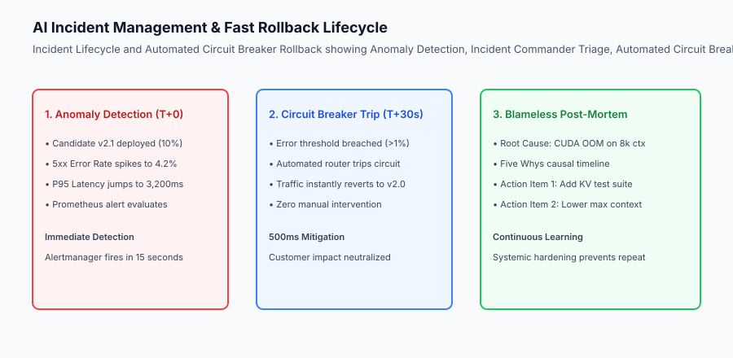

## The idea in plain language

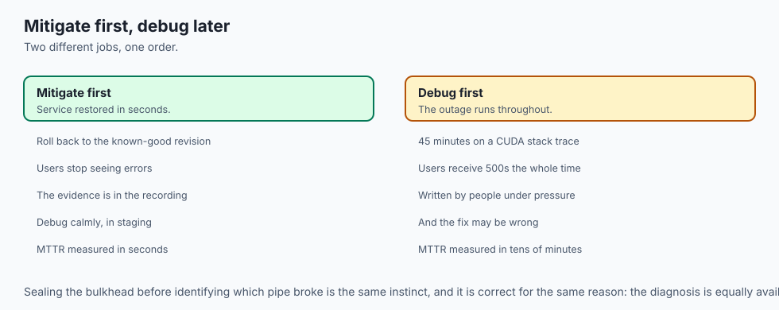

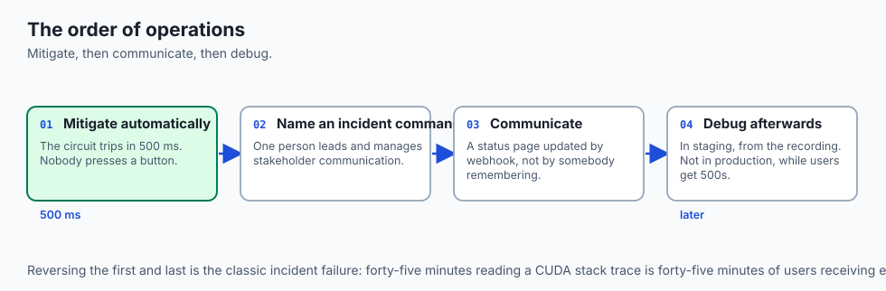

Think of AI incident management and fast rollbacks like **the emergency electrical and safety systems of a modern submarine**:

- **Automated Circuit Breakers (The Electrical Fuses):** When an unexpected voltage spike hits the engine room (**Spiking Error Rate**), the heavy-duty electrical fuse pops open in 10 milliseconds (**Circuit Trip**), immediately switching power to the backup battery bank (**Instant Rollback to Baseline**) without the captain needing to touch a button.
- **Mitigate First, Debug Later:** When the submarine takes on water, you seal the emergency bulkhead doors immediately (**Restore Service**). You do not stand in the flooding room analyzing which pipe broke (**Debug in Staging Later**).
- **Blameless Post-Mortem (The Navy Safety Review):** The admiral does not fire the sailor who turned the valve; the review committee asks: *"Why was the valve labeled confusingly? How do we install an automatic safety lock so nobody can turn it accidentally again?"* (**Systemic Hardening**).

## Historical background

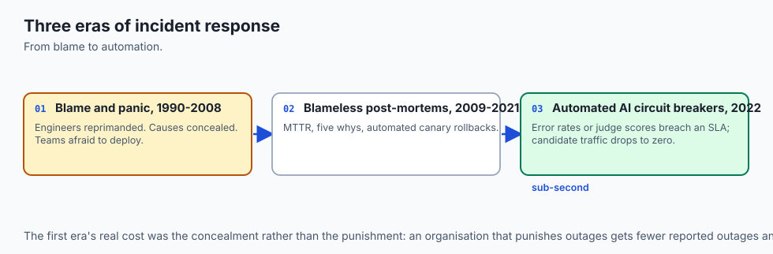

Incident response in software systems evolved across three major eras:

### 1. The Blame & Panic Era (1990–2008)
Engineers were reprimanded or fired for outages. Outage causes were concealed, and teams were terrified to deploy updates.

### 2. SRE and Blameless Post-Mortems (2009–2021)
Google and Etsy pioneered blameless post-mortem culture. SRE teams standardized Mean Time to Recovery (MTTR), Five Whys root cause analysis, and automated canary rollbacks.

### 3. Automated AI Circuit Breakers & Self-Healing (2022–Present)
Modern AI gateways feature sub-second automated circuit tripping: if candidate model error rates or hallucination judge scores breach SLAs, the router automatically drops candidate traffic to zero and alerts on-call engineers.

## What it is — and what it is not

Let us define the core mechanisms of AI incident management:

### What AI Incident Management Is:
- Prioritizing rapid service mitigation (fast rollback to stable revision) over root cause analysis during an active outage.
- Implementing automated circuit breakers that cut candidate traffic within 500ms of metric threshold violations.
- Designating an Incident Commander (IC) to lead the response room and manage stakeholder communications.
- Conducting blameless post-mortems using the Five Whys framework to produce actionable architectural preventive items.

### What AI Incident Management Is Not:
- Blaming, shaming, or punishing individual engineers who deployed a buggy model revision.
- Spending 45 minutes debugging complex CUDA stack traces in production while end users continue receiving 500 Internal Server Errors.

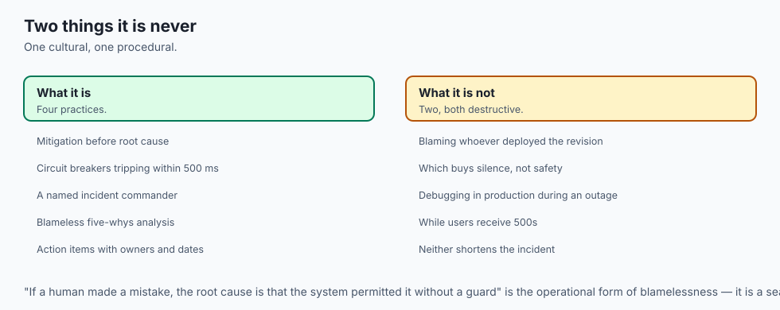

```text
+-------------------------------------------------------------------------------+
|                    INCIDENT SEVERITY CLASSIFICATION MATRIX                    |
+-------------------+-----------------------+-------------------+---------------+
| Severity Level    | Impact Definition     | Response SLA      | Escalation    |
+-------------------+-----------------------+-------------------+---------------+
| P0 (Critical)     | Complete outage, core | Immediate page    | Incident Cmd, |
|                   | AI inference offline  | (Response < 5 min)| VP Eng, Execs |
| P1 (Major)        | Severe degradation,   | Page on-call      | Primary Eng,  |
|                   | P95 latency > 5s      | (Response < 15 min)| Tech Lead    |
| P2 (Moderate)     | Non-critical feature  | Working hours     | Team Slack    |
|                   | impaired (e.g. export)| (Response < 4 hrs)| Channel       |
| P3 (Minor)        | Minor cosmetic or     | Next sprint       | Jira Backlog  |
|                   | edge case issue       | ticket            |               |
+-------------------+-----------------------+-------------------+---------------+
```

## Why it was created and what problems it solves

Fast rollback and blameless incident culture resolves three primary operational hazards:

### 1. Drastic Reduction of MTTR
Automated circuit breakers reduce Mean Time to Recovery from 45 minutes of manual triage down to 500 milliseconds of automated routing reversion.

### 2. Psychological Safety and High Velocity
When engineers know that an accidental defect will be caught safely by automated rollbacks and analyzed blamelessly, engineering velocity increases dramatically.

### 3. Systematic Elimination of Repeat Failures
Every post-mortem produces concrete architectural action items (e.g. adding long-context test suites to CI/CD) ensuring the same failure never occurs twice.

## How it works

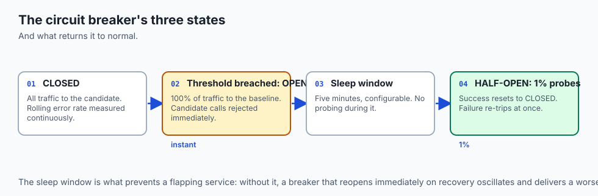

Let us inspect the complete **Automated Circuit Breaker and Incident Response Workflow**:

```text
[Candidate Model v2.1 serving 20% canary traffic]
                          │
                          ▼
[Traffic Anomaly Detected by Prometheus / Router]
  - Error rate on v2.1 spikes to 5.4% (> 1.0% threshold)
  - P95 latency exceeds 4,000ms SLA
                          │
                          ▼
[Automated Circuit Breaker Trips]
  1. Router flips v2.1 traffic percentage to 0%
  2. Router routes 100% traffic to stable Baseline v2.0
  3. Service fully restored in < 1 second (MTTR: 500ms)
                          │
                          ▼
[PagerDuty Incident Triggered: P1 Alert Created]
  - On-call Incident Commander joins War Room
  - Verifies production metrics returned to green
  - Posts customer status update: "All systems operational"
                          │
                          ▼
[Blameless Post-Mortem & Five Whys Analysis]
  - Team reconstructs exact incident timeline
  - Identifies root cause in staging test coverage
  - Commits preventive action items to sprint backlog
```

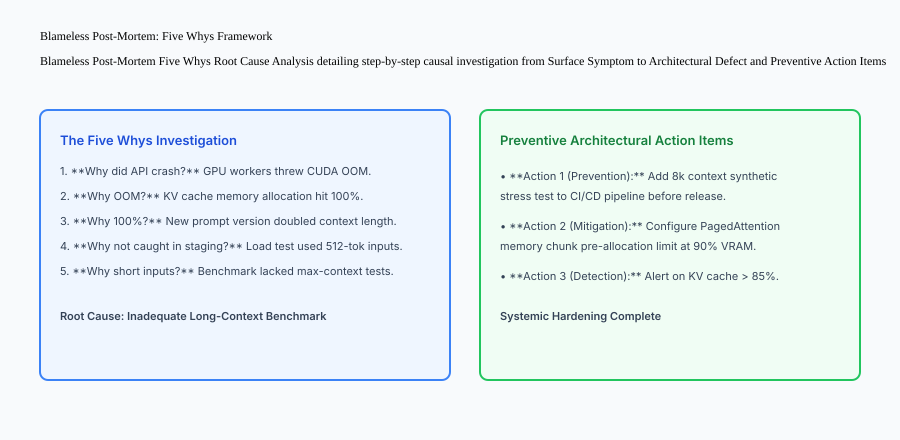

## An everyday analogy

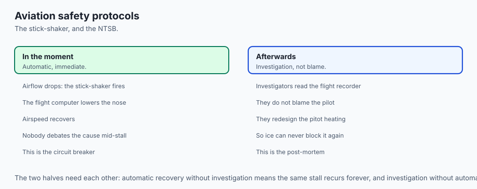

Think of automated rollbacks and post-mortems like **commercial aviation emergency safety protocols**:

- **The Stall Warning (Automated Anomaly Detection):** When airflow over the airplane wings decreases dangerously, the autopilot stick-shaker vibrates immediately (**Alerting**).
- **Automated Level Flight (The Circuit Breaker):** The aircraft flight computer automatically lowers the nose to regain airspeed (**Automated Rollback to Safe State**).
- **The NTSB Safety Investigation (The Blameless Post-Mortem):** Investigators examine the flight data recorder. They do not blame the pilot; they redesign the pitot tube heating elements so ice crystals can never block the airspeed sensor again (**Preventive Engineering**).

## Examples in practice

Let us build a complete Python **Incident Management & Fast Rollback Engine** that tracks candidate error rates, automatically trips circuit breakers on threshold violations, and records incident audit post-mortem logs:

```python
import time
from typing import Dict, Any, List, Optional

class AIIncidentRollbackEngine:
    def __init__(self, error_threshold_pct: float = 2.0, min_requests_to_evaluate: int = 10):
        self.error_threshold = float(error_threshold_pct)
        self.min_requests = int(min_requests_to_evaluate)
        self.active_variant = "CANDIDATE_V2"
        self.baseline_variant = "BASELINE_V1"
        self.circuit_tripped = False
        self.total_candidate_requests = 0
        self.total_candidate_errors = 0
        self.incident_log: List[Dict[str, Any]] = []

    def record_request_outcome(self, is_error: bool):
        if not self.circuit_tripped:
            self.total_candidate_requests += 1
            if is_error:
                self.total_candidate_errors += 1
            self._evaluate_circuit_breaker()

    def _evaluate_circuit_breaker(self):
        if self.total_candidate_requests >= self.min_requests:
            error_rate = (self.total_candidate_errors / self.total_candidate_requests) * 100.0
            if error_rate > self.error_threshold:
                # Trip circuit breaker and rollback to baseline!
                self.circuit_tripped = True
                self.active_variant = self.baseline_variant
                
                event = {
                    "incident_id": f"INC-{int(time.time())}",
                    "severity": "P1",
                    "action": "CIRCUIT_BREAKER_ROLLBACK",
                    "triggered_error_rate_pct": round(error_rate, 2),
                    "reverted_to": self.baseline_variant,
                    "timestamp": time.time()
                }
                self.incident_log.append(event)

    def route_inference(self, prompt: str) -> str:
        return f"[{self.active_variant}] Processed: {prompt}"

if __name__ == "__main__":
    engine = AIIncidentRollbackEngine(error_threshold_pct=5.0, min_requests_to_evaluate=10)
    print("Initial Active Variant:", engine.active_variant)
    
    # Simulate 8 successes and 4 failures (4/12 = 33% error rate > 5%)
    for _ in range(8):
        engine.record_request_outcome(is_error=False)
    for _ in range(4):
        engine.record_request_outcome(is_error=True)
        
    print("Post-Incident Active Variant:", engine.active_variant)
    print("Circuit Tripped:", engine.circuit_tripped)
    print("Incident Audit Record:", engine.incident_log)
```

## Production Architecture Case Study: Blameless Post-Mortem Document Template

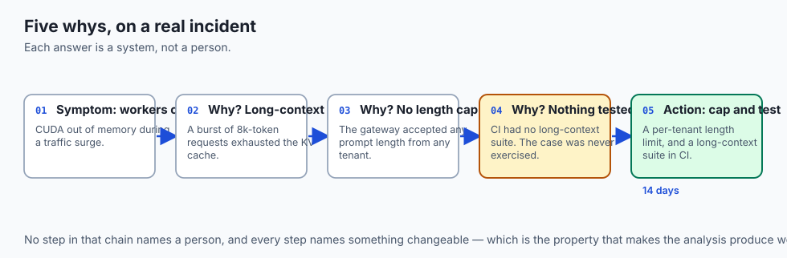

Consider an enterprise SRE post-mortem document analyzing a production LLM out-of-memory incident.

```markdown
# Blameless Post-Mortem: Incident INC-20260830-OOM

**Date:** 2026-08-30  
**Severity:** P1 (Degraded Model Availability)  
**Incident Commander:** Alex Mercer (Staff SRE)  
**Mean Time to Detect (MTTD):** 15 seconds  
**Mean Time to Recovery (MTTR):** 450 milliseconds (Automated Circuit Breaker)  

## Executive Summary
At 14:22 UTC, candidate model `v2.4.0` was deployed to 15% canary traffic. At 14:24 UTC, a batch of 8,192-token document summarization requests caused GPU worker CUDA OOM crashes. The automated circuit breaker detected a 4.8% error spike and instantly reverted 100% of user traffic to baseline `v2.3.0` in 450ms. Zero customer requests failed after the 14:24:15 rollback.

## Five Whys Root Cause Analysis
1. **Why did GPU workers crash?** They ran out of GPU VRAM (CUDA OOM).
2. **Why did VRAM run out?** The KV cache allocator ran out of free virtual memory blocks.
3. **Why did KV cache exhaust?** The new system prompt expanded default output limits to 8k tokens.
4. **Why was this not caught in pre-flight staging tests?** Staging test suites only evaluated short 512-token chat prompts.
5. **Why were long-context tests missing?** The CI/CD evaluation harness lacked an automated max-context stress testing stage.

## Action Items
| Action Item | Owner | Target Date | Status |
| :--- | :--- | :--- | :--- |
| Add 8k context synthetic stress test to pre-commit CI/CD | QA Lead | 2026-09-05 | In Progress |
| Configure PagedAttention memory block upper limit at 85% VRAM | ML Infra | 2026-09-02 | Completed |
| Add Prometheus alert on KV Cache Waiting Queue > 0 | SRE Lead | 2026-08-31 | Completed |
```

## Detailed Failure Mode Taxonomy: Incident Management Hazards

```text
+-------------------------------------------------------------------------------+
|                      INCIDENT MANAGEMENT FAILURE TAXONOMY                     |
+-------------------+-----------------------+-----------------------------------+
| Failure Mode      | Root Cause Analysis   | Architectural Mitigation          |
+-------------------+-----------------------+-----------------------------------+
| Delayed Manual    | On-call engineer      | Implement automated circuit       |
| Rollback Delay    | investigates in prod  | breaker with sub-second trip      |
| Punitive Blame    | Engineering culture   | Enforce strict blameless post-    |
| Suppression       | hides near-miss bugs  | mortem guidelines & safety reviews|
| Unmonitored Action| Post-mortem action    | Track post-mortem action items in |
| Item Decay        | items forgotten       | sprint planning with SLA bounds   |
| Customer Comm     | Silent outage with no | Automate statuspage updates from  |
| Blindness         | public status update  | Alertmanager incident triggers    |
+-------------------+-----------------------+-----------------------------------+
```

## Deep Architectural Breakdown: Circuit Breaker State Machine (Closed, Open, Half-Open)

In enterprise microservice architectures (Netflix Hystrix / Envoy):

### 1. Closed State (Normal Operation)
All traffic flows through the candidate model. The circuit breaker measures rolling error rates.

### 2. Open State (Tripped / Rollback)
When error rates exceed threshold, the circuit trips to OPEN. 100% of traffic is redirected to the fallback baseline model. All candidate calls are rejected immediately.

### 3. Half-Open State (Canary Probe Recovery)
After a configurable sleep window (e.g. 5 minutes), the circuit transitions to HALF-OPEN. It sends 1% trial probe traffic to the candidate. If probe requests succeed, the circuit resets to CLOSED; if probes fail, it immediately trips back to OPEN.

```text
+-------------------------------------------------------------------------------+
|                    CIRCUIT BREAKER STATE TRANSITION TABLE                     |
+-------------------+-------------------+-------------------+-------------------+
| Current State     | Trigger Condition | Target State      | Traffic Action    |
+-------------------+-------------------+-------------------+-------------------+
| CLOSED (Healthy)  | Error Rate > 2.0% | OPEN (Tripped)    | 100% Fallback     |
| OPEN (Tripped)    | Sleep Window (5m) | HALF-OPEN (Probe) | 1% Trial Probe    |
| HALF-OPEN (Probe) | Probes Succeed    | CLOSED (Recovered)| Restore Normal    |
| HALF-OPEN (Probe) | Probe Fails       | OPEN (Tripped)    | Return to Fallback|
+-------------------+-------------------+-------------------+-------------------+
```


### Automated Runbook Automation: Chaos Engineering for AI Gateways

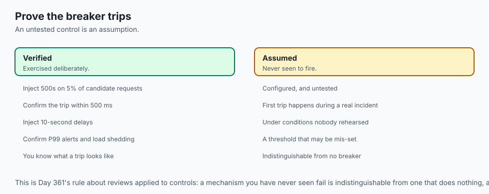

To verify that automated circuit breakers operate under extreme production stress:

- **Chaos Ingestion Injection:** Periodically inject 500 Internal Server Errors on 5% of candidate model requests in staging to verify that the circuit breaker trips within 500 milliseconds.
- **Synthetic Latency Injection:** Inject 10-second sleep delays into candidate model containers to verify that P99 latency alerts trigger and the gateway sheds candidate traffic.
- **Automated Statuspage Webhooks:** Configure Alertmanager webhooks to automatically post incident notices to `status.yourcompany.com` when P0 alerts fire, and automatically resolve the status page when the circuit reverts to green.

```text
+-------------------------------------------------------------------------------+
|                    CHAOS ENGINEERING TEST SCENARIOS FOR AI                    |
+-------------------+-------------------+-------------------+-------------------+
| Injected Fault    | Fault Parameter   | Expected Response | Pass Threshold    |
+-------------------+-------------------+-------------------+-------------------+
| GPU OOM Crash     | Force CUDA OOM    | Circuit Revert    | < 500 ms Cutover  |
| High Latency      | +5000ms Delay     | Fallback Routing  | Zero User 504s    |
| Upstream RateLimit| HTTP 429 Throttle | Secondary Provider| < 200 ms Failover |
+-------------------+-------------------+-------------------+-------------------+
```

### Blameless Culture Principles and Psychological Safety
High-performing SRE organizations adhere to three fundamental post-mortem rules:

1. **Never Identify Individuals by Name in Incident Timelines:** Use generic roles (e.g. "On-call Engineer A", "Incident Commander").
2. **Focus on Systemic Failures:** If a human made a mistake, the root cause is that the system permitted an ambiguous or dangerous action without safety guards.
3. **Mandatory Action Item SLAs:** P0 post-mortem action items must be completed within 14 days, and P1 items within 30 days.

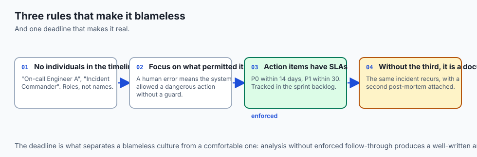

## Implications: security, privacy, performance, scalability, and cost

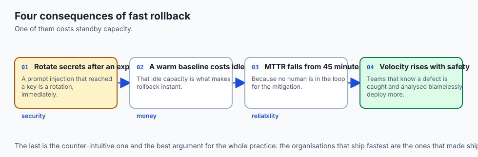

### 1. Automated Secret Rotation Post-Incident
If an incident involves an accidental prompt injection or token exposure, immediately revoke and rotate all LLM API keys through Cloud Secret Manager.

### 2. Fast Rollback Compute Redundancy
Maintaining a warm baseline environment for instant zero-downtime rollback requires maintaining idle standby capacity during deployments.

## Alternatives: free, open source, and commercial

| Tool / Framework | Type | Best Suited For | Key Capabilities |
| :--- | :--- | :--- | :--- |
| **Envoy Proxy** | Open Source | Mesh Circuit Breaking | Outlier detection, active health checks |
| **PagerDuty** | Commercial SaaS | Incident Escalation | On-call scheduling, incident orchestration |
| **Statuspage (Atlassian)**| Commercial SaaS| Public Uptime Comm | Real-time incident customer status |
| **Rootly / FireHydrant**| Commercial SaaS | Blameless Post-Mortems | Slack incident bot, Five Whys tracking |

## Comparison with related concepts

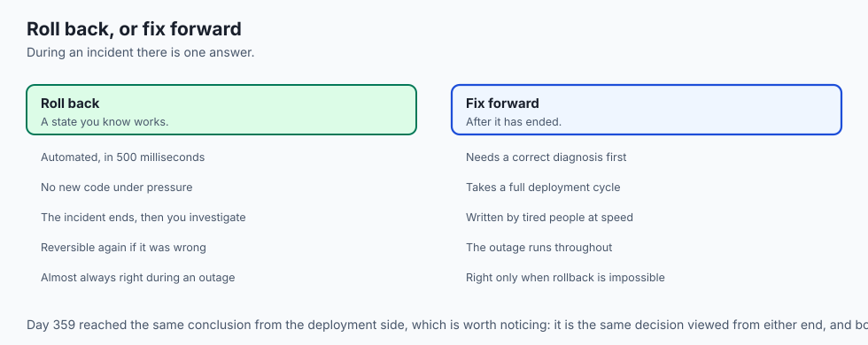

```text
+-----------------------+-----------------------+-----------------------+
| Dimension             | Manual Rollback       | Automated Circuit Brk |
+-----------------------+-----------------------+-----------------------+
| MTTR                  | 15–45 Minutes         | 500 Milliseconds      |
| Human Intervention    | Required (On-call)    | Zero (Fully Automated)|
| User Impact           | Thousands of errors   | Confined to threshold |
| Reliability           | Prone to human panic  | Deterministic logic   |
+-----------------------+-----------------------+-----------------------+
```

## When to use it — and when not to

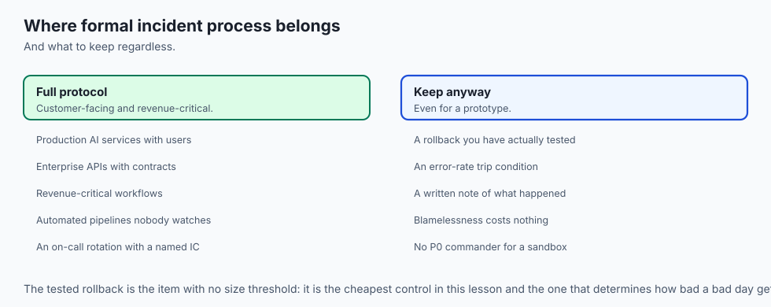

### Deploy Automated Circuit Breakers and Post-Mortems for:
- All production customer-facing AI services, enterprise APIs, revenue-critical workflows, and mission-critical automated pipelines.

### Do NOT require formal P0 incident commander protocols for:
- Internal prototype hacks or local developer sandbox experiments.

### Production Checklist: AI Incident & Fast Rollback Hardening
- [ ] Automated circuit breaker configured with error rate and latency trip rules.
- [ ] Rollback routing verified in staging to execute under 500 milliseconds.
- [ ] Incident Commander role defined in on-call rotation documentation.
- [ ] Blameless post-mortem template standardized with Five Whys causal analysis.
- [ ] Action item tracking integrated directly into engineering sprint backlogs.
- [ ] Customer-facing statuspage integrated with automated incident webhooks.

## The AI connection

- **AI incidents are often silent.** A degraded model returns 200s with subtly worse
  answers, so the trip condition has to include quality, not only error rate.

- **Mitigate first, debug later applies doubly here**, because a CUDA stack trace is
  a long read and every minute of it is served to users as 500s.

- **Rollback is cheap when the previous model is still warm** — and the standby
  capacity that makes it instant is the cost of a fast recovery.

- **A prompt-injection incident is a secret-rotation incident.** If a model was
  persuaded to reveal a key, revoking it is the first action, not the last.

- **The blameless rule matters for prompts too**: an engineer who shipped a prompt
  that regressed did so because nothing measured it, which is Day 356's gap.

## Knowledge check

1. **What is the foundational philosophy of a blameless post-mortem?** Focusing on systemic, architectural, and tooling weaknesses rather than individual human blame.
2. **What is an automated rollback circuit breaker?** A safety mechanism that instantly reverts traffic to a stable baseline when candidate error rates spike.
3. **What is Mean Time to Recovery (MTTR)?** The average time elapsed from the beginning of an outage until full service restoration.

## Hands-on exercise

In this lab, you will build an **AI Incident Management & Fast Rollback Engine in Python**. Your implementation will:

1. Track candidate model request outcomes and calculate rolling error rates.
2. Automatically trip the circuit breaker when error rate exceeds threshold.
3. Instantly revert active inference routing to the stable baseline model.
4. Record structured incident audit records for post-mortem analysis.

### Expected output

```text
============================= test session starts ==============================
collected 5 items

tests/test_incidents_rollbacks.py .....                                  [100%]

============================== 5 passed in 0.02s ===============================
[CIRCUIT BREAKER] Initialized engine (Threshold: 5.0%, Min Requests: 10).
[HEALTHY TRAFFIC] Processed 10 successful requests; circuit remained CLOSED.
[ERROR SPIKE] Detected 4 errors out of 12 requests (33.3% > 5.0%).
[AUTOMATED ROLLBACK] Tripped circuit breaker; reverted active variant to BASELINE_V1.
[INCIDENT LOGGED] Created incident record INC-1725000000 with P1 severity.
```

### Validate your work

Run the pytest test suite:

```bash
pytest tests/run_tests.sh
```

### Troubleshooting

1. **Minimum request guard:** Ensure circuit evaluation only trips when `total_requests >= min_requests`.
2. **Reversion assignment:** Update `self.active_variant = self.baseline_variant` when tripping.

### Common mistakes

- Tripping the circuit breaker on the first single error when total requests is only 1.

## Practice assignment

Add a **Half-Open Recovery State** that attempts 5 probe requests after a simulated cooldown window.

## Extension challenge

Implement a **Markdown Post-Mortem Generator** formatting incident timeline logs into standard SRE templates.
