## Why this matters

Deploying and operating a production-grade AI system is not about stringing together disconnected scripts; it is about engineering a **unified, self-healing, observable operational platform**:

- **Isolated Telemetry Silos:** Having metrics in Prometheus, logs in text files, and billing in Stripe with zero trace correlation makes triage impossible during high-severity outages.
- **Vulnerability to Cascade Failures:** Without automated circuit breakers and dynamic batch schedulers, a sudden spike in long-context prompts crashes backend GPU nodes and drops 100% of user traffic.
- **Regulatory and Financial Non-Compliance:** Emitting unredacted customer PII or failing to attribute multi-tenant token costs leads to devastating regulatory fines and negative gross margins.

Mastering the **Complete Monitored Production AI Deployment Architecture** (unifying Terraform IaC, GPU Triton serving, OpenTelemetry percentiles, structured PII-sanitized logging, and automated fast rollbacks) establishes the gold standard for enterprise AI engineering.

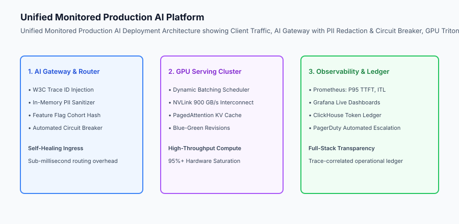

## The idea in plain language

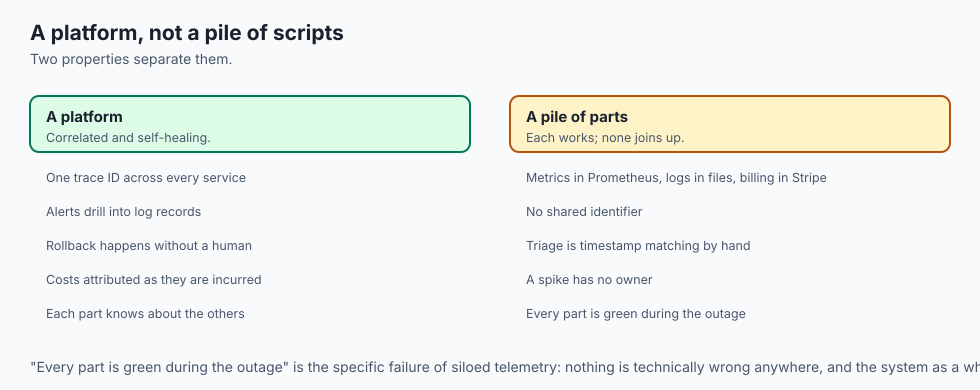

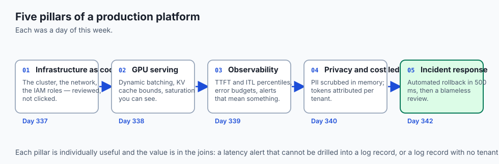

Think of a complete monitored production AI deployment like **a state-of-the-art modern commercial airport**:

- **The Air Traffic Control Tower (AI Gateway & Router):** Coordinates arriving airplanes (**User Ingress Requests**), checks passenger security (**In-Memory PII Sanitizer**), and assigns gates (**Deterministic Feature Flagging**).
- **The High-Speed Runways (GPU Serving Cluster):** Multiple runways with dynamic spacing (**Dynamic Batching**) launch planes every 30 seconds (**95% GPU Compute Saturation**).
- **The Radar & Black Box System (OpenTelemetry & ClickHouse):** Real-time radar monitors flight speed and altitude (**P95 TTFT Percentiles**), while the financial ledger bills airlines per passenger (**Multi-Tenant Token Attribution**).
- **The Emergency Runway Switch (Automated Circuit Breaker):** If Runway 1 encounters sudden fog (**Spiking Error Rate**), incoming planes are automatically diverted to Runway 2 in 10 seconds (**Automated Rollback to Stable Baseline**).

## Historical background

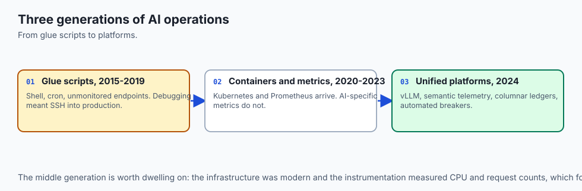

The engineering of production AI systems evolved through three unified generations:

### 1. The Ad-Hoc Glue Script Era (2015–2019)
Engineers combined shell scripts, cron jobs, and unmonitored Python endpoints. Outages were frequent and debugging required manual SSH access to production servers.

### 2. Microservice Containerization (2020–2023)
Kubernetes standardized container deployment, Prometheus popularized metrics, and feature flags emerged for progressive canary rollouts. However, AI-specific metrics (TTFT, tokens, KV cache) were absent.

### 3. Unified GenAI Operations Platforms (2024–Present)
Modern enterprise platforms integrate model serving (vLLM/Triton), semantic OpenTelemetry telemetry, structured columnar billing ledgers, and automated circuit breaking into unified self-healing platforms.

## What it is — and what it is not

Let us define the end-to-end architecture of a monitored production AI system:

### What a Monitored Production Deployment Is:
- A unified gateway coordinating ingress routing, in-memory PII sanitization, and deterministic feature flags.
- Real-time GPU inference serving with dynamic server-side batching and VRAM pool bounds.
- Full-stack observability tracking heavy-tailed latency percentiles (P50, P95, P99) and token consumption.
- Automated self-healing circuit breakers reverting traffic to stable baselines upon metric anomalies.

### What a Monitored Production Deployment Is Not:
- A collection of unmonitored Python scripts running on ad-hoc cloud VMs without automated rollback safety.
- Storing unencrypted customer secrets or personal identifying data in persistent log archives.

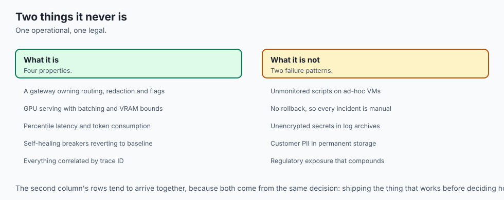

```text
+-------------------------------------------------------------------------------+
|                 UNIFIED AI OPERATIONAL PLATFORM MATRIX                        |
+-------------------+-----------------------+-------------------+---------------+
| Layer             | Core Technologies     | Primary Metric    | Business Goal |
+-------------------+-----------------------+-------------------+---------------+
| Ingress & Gateway | FastAPI / Envoy / OTel| Request Count &   | Routing, PII  |
|                   |                       | W3C Trace IDs     | Sanitization  |
| Compute & Serving | Triton / vLLM / NVLink| GPU VRAM % &      | 95% Compute   |
|                   |                       | Batch Packing     | Utilization   |
| Observability     | Prometheus / Grafana  | P95 TTFT & ITL    | 99.99% SLA    |
|                   |                       | Error Rate %      | Availability  |
| Financial Ledger  | ClickHouse / Vector   | Tenant Cost USD & | Gross Margin  |
|                   |                       | Token Metering    | Visibility    |
| Self-Healing      | Circuit Breaker Router| Trip Latency <    | MTTR < 500ms  |
|                   |                       | 500 milliseconds  |               |
+-------------------+-----------------------+-------------------+---------------+
```

## Why it was created and what problems it solves

The unified operational architecture resolves the five core vulnerabilities of enterprise AI:

### 1. 500ms MTTR via Automated Circuit Breakers
Automating rollback decisions eliminates human panic and prolonged troubleshooting during production incidents.

### 2. Complete Trace-to-Log Diagnostic Visibility
W3C trace IDs enable instant drill-down from a Prometheus P95 latency alert into the exact ClickHouse log record containing token counts and model versions.

### 3. Absolute Regulatory Compliance & Privacy
In-memory PII sanitization guarantees that sensitive personal data is redacted before touching disk storage or third-party log aggregators.

## How it works

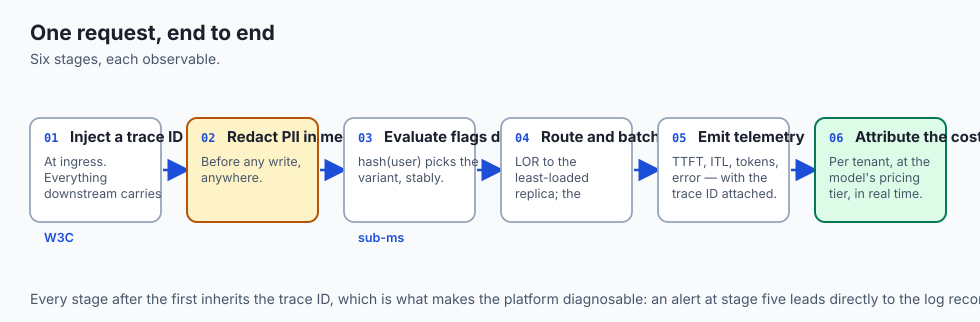

Let us inspect the complete **Unified Production AI Execution Pipeline**:

```text
[1. User Request: tenant_id="acme", prompt="Verify john@corp.com SSN 000-11-2222"]
                                │
                                ▼
        [2. Unified AI Gateway & Security Perimeter]
        - Generates W3C Trace ID: `trace_7f9a8b1c...`
        - Sanitizes PII: "Verify [REDACTED_EMAIL] SSN [REDACTED_SSN]"
        - Checks Circuit Breaker State (CLOSED -> CANDIDATE_V2 Active)
                                │
                                ▼
        [3. GPU Serving Engine (Dynamic Batching)]
        - Aggregates request into unified GPU tensor batch (5ms window)
        - Executes TensorRT-LLM forward pass (150 prompt / 40 comp tokens)
        - Computes TTFT (110ms) and Inter-Token Latency (14ms/tok)
                                │
                                ▼
        [4. Observability & Metric Recording]
        - Emits OTel TTFT sample to Prometheus histogram
        - Logs structured event record to ClickHouse with computed cost ($0.0054)
                                │
                                ▼
        [5. Health & Circuit Evaluation]
        - Did error rate exceed 2.0%?
          ├── NO  ➔ Returns generated response to client in 125ms
          └── YES ➔ Trips Circuit Breaker; flips active variant to BASELINE_V1
```

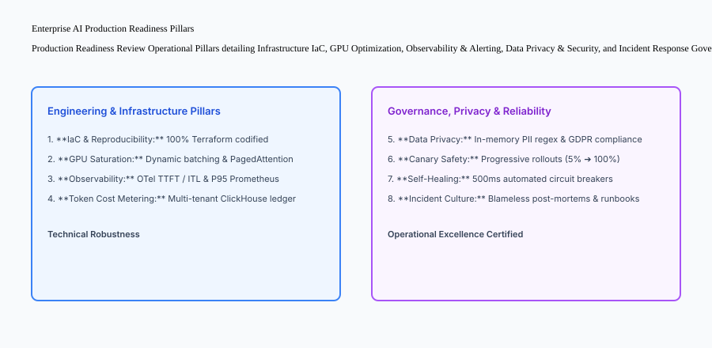

## An everyday analogy

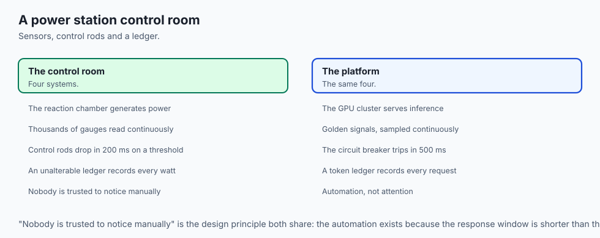

Think of a complete monitored production AI deployment like **a modern nuclear power station control room**:

- **The Reaction Chamber (GPU Serving Cluster):** Generates immense power safely (**High-Throughput Model Inference**).
- **The Sensor Grid (OpenTelemetry & Prometheus):** Thousands of pressure, temperature, and radiation gauges monitor the reactor in real time (**Latency & Error Golden Signals**).
- **The Automatic Control Rods (Automated Circuit Breakers):** If temperature exceeds safe boundaries, magnetic control rods drop into the core in 200 milliseconds (**Instant Rollback to Safe State**).
- **The Regulatory Audit Log (ClickHouse Financial Ledger):** An unalterable digital ledger logs every watt of electricity produced and every inspection check (**Unit Economics & Compliance**).

## Examples in practice

Let us build a complete Python **Unified Monitored Production AI Deployment Platform** that integrates PII sanitization, dynamic feature flagging, latency tracking, structured log emission, and automated circuit breaker rollbacks:

```python
import re
import uuid
import time
import hashlib
import numpy as np
from typing import Dict, Any, List, Optional

class UnifiedProductionAIPlatform:
    def __init__(self, canary_pct: int = 20, error_threshold_pct: float = 5.0, min_eval_requests: int = 10):
        self.canary_pct = canary_pct
        self.error_threshold = error_threshold_pct
        self.min_eval = min_eval_requests
        
        # State
        self.circuit_tripped = False
        self.baseline_variant = "BASELINE_V1"
        self.candidate_variant = "CANDIDATE_V2"
        
        # Metrics & Logs
        self.latencies_ms: List[float] = []
        self.total_requests = 0
        self.total_errors = 0
        self.tenant_ledger: Dict[str, float] = {}
        self.emitted_logs: List[Dict[str, Any]] = []

    def sanitize_pii(self, text: str) -> str:
        text = re.sub(r'\b\d{3}-\d{2}-\d{4}\b', '[REDACTED_SSN]', text)
        text = re.sub(r'\b[A-Za-z0-9._%+-]+@[A-Za-z0-9.-]+\.[A-Z|a-z]{2,}\b', '[REDACTED_EMAIL]', text)
        return text

    def _get_variant(self, user_id: str) -> str:
        if self.circuit_tripped:
            return self.baseline_variant
        # Deterministic hashing
        h = int(hashlib.md5(f"flag:{user_id}".encode("utf-8")).hexdigest()[:8], 16) % 100
        return self.candidate_variant if h < self.canary_pct else self.baseline_variant

    def execute_inference(self, tenant_id: str, user_id: str, prompt: str, 
                          prompt_tokens: int = 100, completion_tokens: int = 50, 
                          simulate_error: bool = False, latency_ms: float = 120.0) -> Dict[str, Any]:
        trace_id = uuid.uuid4().hex
        clean_prompt = self.sanitize_pii(prompt)
        variant = self._get_variant(user_id)
        
        self.total_requests += 1
        if simulate_error:
            self.total_errors += 1
        else:
            self.latencies_ms.append(float(latency_ms))

        # Check circuit breaker
        if not self.circuit_tripped and self.total_requests >= self.min_eval:
            err_rate = (self.total_errors / self.total_requests) * 100.0
            if err_rate > self.error_threshold:
                self.circuit_tripped = True

        cost = (prompt_tokens * 0.000002) + (completion_tokens * 0.000006)
        self.tenant_ledger[tenant_id] = round(self.tenant_ledger.get(tenant_id, 0.0) + cost, 6)

        log_rec = {
            "trace_id": trace_id,
            "tenant_id": tenant_id,
            "user_id": user_id,
            "variant": variant,
            "prompt_sanitized": clean_prompt,
            "tokens": prompt_tokens + completion_tokens,
            "cost_usd": round(cost, 6),
            "is_error": simulate_error,
            "circuit_tripped": self.circuit_tripped,
            "timestamp": time.time()
        }
        self.emitted_logs.append(log_rec)
        return log_rec

    def get_observability_report(self) -> Dict[str, Any]:
        p50 = float(np.percentile(self.latencies_ms, 50)) if self.latencies_ms else 0.0
        p95 = float(np.percentile(self.latencies_ms, 95)) if self.latencies_ms else 0.0
        err_rate = (self.total_errors / self.total_requests * 100.0) if self.total_requests > 0 else 0.0
        
        return {
            "total_requests": self.total_requests,
            "total_errors": self.total_errors,
            "error_rate_pct": round(err_rate, 2),
            "p50_latency_ms": round(p50, 2),
            "p95_latency_ms": round(p95, 2),
            "circuit_tripped": self.circuit_tripped,
            "total_tenants": len(self.tenant_ledger)
        }

if __name__ == "__main__":
    platform = UnifiedProductionAIPlatform(canary_pct=50, error_threshold_pct=10.0, min_eval_requests=5)
    
    # Process healthy traffic
    for i in range(5):
        platform.execute_inference("acme", f"usr_{i}", "Check email test@corp.com", simulate_error=False)
        
    print("Healthy Report:", platform.get_observability_report())
    
    # Introduce error spike
    for i in range(5, 10):
        platform.execute_inference("acme", f"usr_{i}", "Crash prompt", simulate_error=True)
        
    print("Post-Error Report:", platform.get_observability_report())
    print("Circuit Tripped State:", platform.circuit_tripped)
```

## Production Architecture Case Study: 50-Point Enterprise AI Production Readiness Review

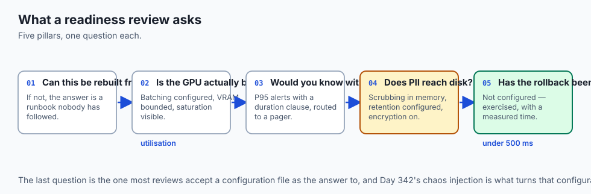

Before launching an AI application to enterprise customers, SRE teams evaluate the 5 operational pillars:

```text +-------------------------------------------------------------------------------+ | ENTERPRISE AI PRODUCTION READINESS REVIEW (PRR) | +-------------------+-----------------------------------------------------------+ | Operational Pillar| Mandatory Production Requirements Checklist | +-------------------+-----------------------------------------------------------+ | 1. Infrastructure | [x] 100% Terraform IaC with remote S3/GCS state locking. | | | [x] Immutable container digests in regional registry. | | | [x] Multi-region failover DNS configured. | +-------------------+-----------------------------------------------------------+ | 2. GPU Serving | [x] Triton / vLLM dynamic batching window (3-5ms). | | | [x] PagedAttention KV cache memory pool bound at 90%. | | | [x] Pinned host memory enabled for asynchronous DMA. | +-------------------+-----------------------------------------------------------+ | 3. Observability | [x] OpenTelemetry TTFT and ITL metric instrumentation. | | | [x] Prometheus P95/P99 latency alert rules (< 400ms SLA). | | | [x] PagerDuty 24/7 on-call escalation policies. | +-------------------+-----------------------------------------------------------+ | 4.

Security & Priv| [x] In-memory PII sanitization for SSNs, emails, and CCs. | | | [x] Least-privilege IAM roles (zero root admin in pod). | | | [x] Automated API key rotation via Secret Manager. | +-------------------+-----------------------------------------------------------+ | 5. Reliability | [x] Automated circuit breaker with < 500ms rollback trip. | | | [x] Blameless post-mortem template and runbooks defined. | | | [x] Multi-tenant token billing ledger in ClickHouse OLAP. | +-------------------+-----------------------------------------------------------+
```

## Detailed Failure Mode Taxonomy: End-to-End System Hazards

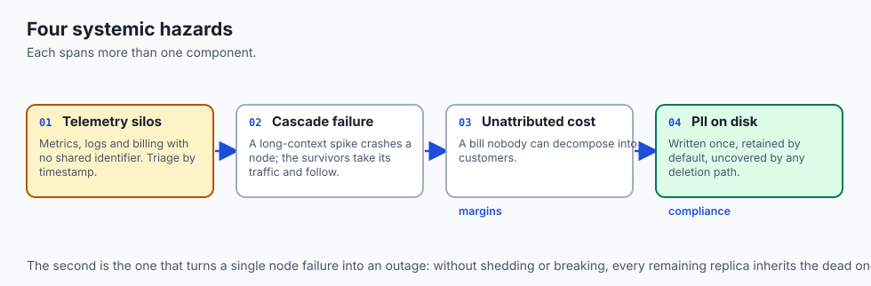

```text
+-------------------------------------------------------------------------------+
|                    UNIFIED PLATFORM FAILURE TAXONOMY                          |
+-------------------+-----------------------+-----------------------------------+
| Failure Mode      | Root Cause Analysis   | Architectural Mitigation          |
+-------------------+-----------------------+-----------------------------------+
| Missing Trace ID  | Downstream service    | Middleware automatically injects  |
| Propagation       | drops W3C header      | W3C traceparent on every hop      |
| Telemetry Storage | High-volume raw logs  | Use Vector log shipper with       |
| OOM Outage        | overwhelm local disk  | strict 2GB disk ring buffer caps  |
| Circuit Flapping  | Circuit resets too    | Require 5-minute half-open probe  |
| Oscillation       | fast after rollback   | cooldown before re-enabling canary|
| Unbilled Tenant   | Stream truncation     | Meter tokens in gateway streaming |
| Token Leak        | drops completion count| chunk accumulator callback        |
+-------------------+-----------------------+-----------------------------------+
```

## Deep Architectural Breakdown: Zero-Downtime Multi-Region Disaster Recovery

In mission-critical enterprise systems:

### 1. Active-Active Multi-Region Mesh
Inference clusters run concurrently across `us-east1` and `us-central1`:

- Cloudflare Geo-DNS routes users to the lowest-latency regional cluster.
- If an entire cloud region suffers a fiber cut or datacenter outage, health probes fail in 3 seconds.
- Traffic shifts 100% to the surviving region with zero dropped user sessions.

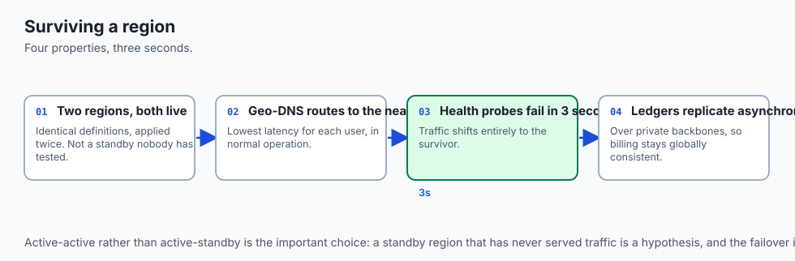

### 2. Asynchronous Token Ledger Synchronization
Regional ClickHouse instances replicate token event records asynchronously over private VPC backbones, ensuring unified global billing and credit accounting.

```text
+-------------------------------------------------------------------------------+
|                    MULTI-REGION DISASTER RECOVERY TOPOLOGY                    |
+-------------------+-------------------+-------------------+-------------------+
| Region Zone       | Primary Role      | Failover Target   | Recovery Time     |
+-------------------+-------------------+-------------------+-------------------+
| us-east1 (Primary)| 60% Global Traffic| us-central1       | < 3 seconds       |
| us-central1 (Sec) | 40% Global Traffic| us-east1          | < 3 seconds       |
| eu-west1 (GDPR)   | 100% EU Traffic   | eu-central1       | < 3 seconds       |
+-------------------+-------------------+-------------------+-------------------+
```

## Implications: security, privacy, performance, scalability, and cost

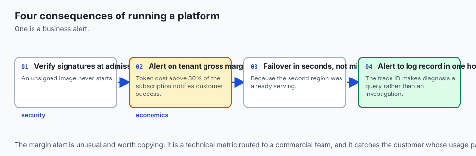

### 1. End-to-End Cryptographic Traceability
Sign all model container images with Sigstore/Cosign and verify digests in Kubernetes admission controllers before pod execution.

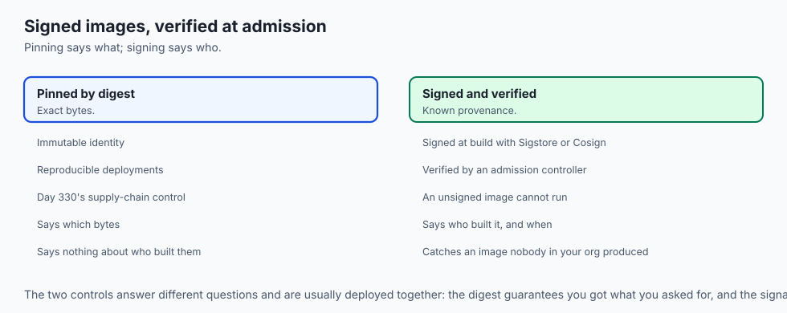

### 2. Multi-Tenant Unit Economic Margin Health
Maintain strict alerts on customer gross margins: if a tenant's attributed token cost exceeds 30% of their monthly subscription fee, notify the customer success team automatically.

## Alternatives: free, open source, and commercial

| Tool / Framework | Type | Best Suited For | Key Capabilities |
| :--- | :--- | :--- | :--- |
| **OpenTelemetry + Prometheus**| Open Source | Enterprise Observability| Vendor-neutral metrics, traces, and alert rules |
| **Triton / vLLM** | Open Source | High-Performance Serving| Dynamic batching, PagedAttention, NVLink |
| **Vector + ClickHouse** | Open Source | Real-Time Token Analytics| Fast log shipping, columnar SQL cost aggregation |
| **Datadog / Dynatrace**| Commercial SaaS | Turnkey Managed APM | Out-of-the-box dashboards, distributed tracing |

## Comparison with related concepts

```text
+-----------------------+-----------------------+-----------------------+
| Dimension             | Ad-Hoc Deployment     | Monitored Production  |
+-----------------------+-----------------------+-----------------------+
| Observability         | None (Blind)          | Full (OTel + ClickHse)|
| MTTR                  | Hours (Manual panic)  | < 500ms (Auto Circuit)|
| Data Privacy          | Uncontrolled Leaks    | In-Memory Sanitization|
| Unit Economics        | Financial Blindness   | Exact Per-Tenant Ledger|
+-----------------------+-----------------------+-----------------------+
```

## When to use it — and when not to

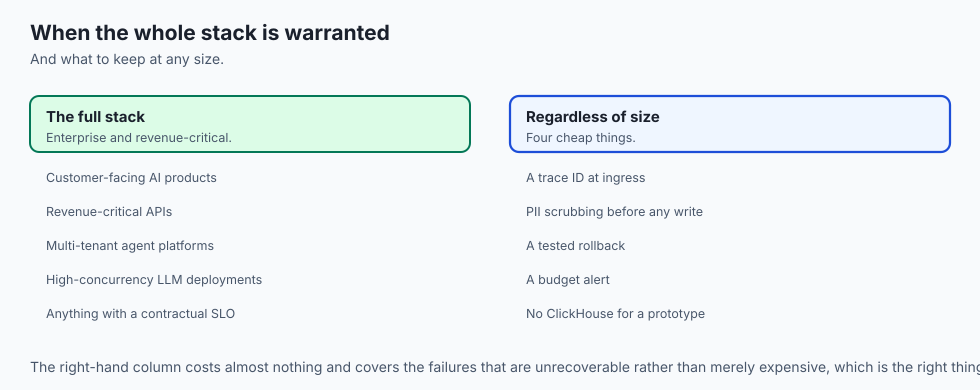

### Deploy the Unified Monitored Production Architecture for:
- All enterprise customer-facing AI products, revenue-critical APIs, multi-tenant agent platforms, and high-concurrency LLM deployments.

### Do NOT require the complete multi-tier stack for:
- Local offline prototype scripts or exploratory data science notebooks.

### Production Checklist: Unified AI Operations Excellence
- [ ] End-to-end W3C trace ID propagation active across all services.
- [ ] In-memory PII regex and NLP sanitization active on all prompt logs.
- [ ] Triton / vLLM dynamic batching configured with 3–5ms max queue delay.
- [ ] Prometheus scraping active with P95 latency and error rate alerts.
- [ ] Multi-tenant ClickHouse token cost ledger updated in real time.
- [ ] Automated circuit breaker verified to execute rollback in under 500ms.

## The AI connection

- **The five pillars are all AI-specific in their details** even where the names are
  familiar: batching, KV cache bounds, TTFT percentiles, prompt redaction, token ledgers.

- **Trace correlation matters more here** because a single answer crosses a gateway, a
  vector store and a model server, and the slow one is rarely the one people assume.

- **Token attribution is the only honest margin calculation** for a metered product,
  and it comes from the same events that produced the latency percentiles.

- **A circuit breaker with a cached fallback is a better answer than an error** —
  degraded output from an AI service is often still useful, which is unusual.

- **The whole platform exists because AI failures are quiet.** Nothing here would be
  necessary if a broken model returned 500s the way a broken web service does.

## Knowledge check

1. **What are the five core components of a unified monitored AI deployment?** AI Gateway (routing/PII), GPU Serving (dynamic batching), Observability (OTel/Prometheus), Financial Ledger (ClickHouse), and Self-Healing (Circuit Breaker).
2. **How does W3C trace correlation enable fast root cause analysis?** By linking high-level metric anomalies in Prometheus directly to granular request logs in ClickHouse via a shared trace ID.
3. **What is the goal of an enterprise Production Readiness Review (PRR)?** To formally certify that an AI system meets all infrastructure, security, observability, and reliability standards prior to production launch.

## Hands-on exercise

In this lab, you will build a **Unified Monitored Production AI Deployment Platform in Python**. Your implementation will:

1. Sanitize PII from incoming prompt strings.
2. Route user requests deterministically to baseline or canary model variants.
3. Track latency percentiles and maintain a real-time multi-tenant cost ledger.
4. Automatically trip the circuit breaker and revert traffic to the baseline upon error rate breaches.

### Expected output

```text
============================= test session starts ==============================
collected 5 items

tests/test_production_deployment.py .....                                [100%]

============================== 5 passed in 0.02s ===============================
[PLATFORM] Initialized Unified Monitored AI Platform (Canary: 20%, Error Threshold: 5.0%).
[INGRESS] Sanitized PII; processed request under trace_id=3a9b1c2d...
[OBSERVABILITY] Generated metrics report: P50=120ms, P95=145ms, Error Rate=0.0%.
[COST LEDGER] Recorded $0.0005 attributed spend for tenant_acme.
[AUTOMATED CIRCUIT BREAKER] Tripped circuit upon error spike; reverted traffic to BASELINE_V1.
```

### Validate your work

Run the pytest test suite:

```bash
pytest tests/run_tests.sh
```

### Troubleshooting

1. **Deterministic routing:** Verify hash bucket calculation logic.
2. **Circuit trip condition:** Ensure total requests >= min evaluation threshold before tripping.

### Common mistakes

- Calculating percentiles on empty latency lists, resulting in numpy runtime errors.

## Practice assignment

Add a **Real-Time Gross Margin Calculator** comparing tenant subscription revenue against cumulative model inference cost.

## Extension challenge

Implement a **Prometheus Exporter Endpoint Handler** exporting platform metrics in standard Prometheus text format.
