## Why this matters

Sending sensitive user data into third-party cloud LLMs or embedding unredacted customer records into RAG vector databases violates fundamental data privacy regulations (GDPR, CCPA, HIPAA) and creates severe legal liability:

- **Mass PII Exposure via Model Memorization:** Deep neural networks memorize rare sequence tokens in their training data. Attackers query models with targeted prefix prompts to reconstruct credit card numbers, home addresses, and private medical histories.
- **Regulatory Penalties (GDPR Article 83):** Non-compliance with privacy mandates can result in fines up to 20 million euros or 4% of global annual turnover.
- **Right to Erasure (Article 17) Violations:** When a customer requests deletion, an organization unable to scrub that person's influence from fine-tuned weights or vector indices faces immediate regulatory sanctions.

Production AI architectures must enforce rigorous privacy controls: **Zero-Knowledge PII Token Vaults, Differential Privacy noise mechanisms, k-anonymity dataset pruning, and machine unlearning protocols**.

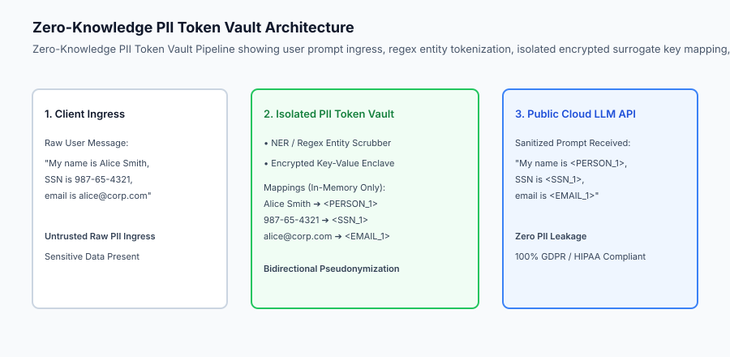

## The idea in plain language

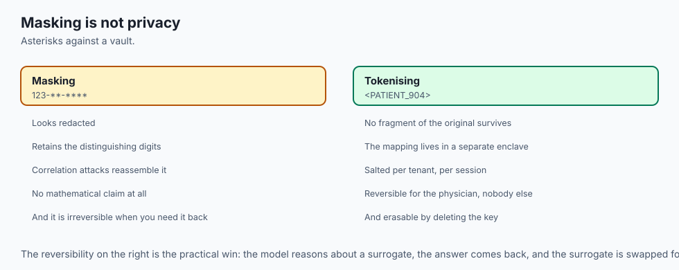

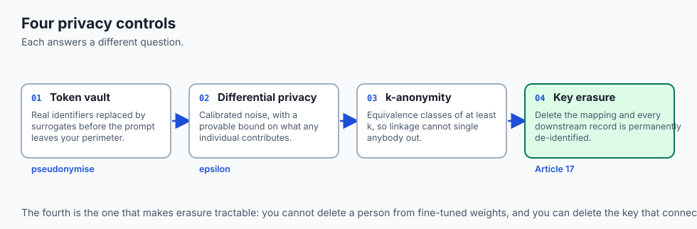

Think of AI data privacy like **submitting medical records to a research study through a privacy-preserving legal intermediary**:

- **The Danger (Sending Raw Medical Records):** You hand a patient's unredacted hospital chart directly to an external analyst (**Direct Cloud PII Leak**).
- **The Privacy Intermediary (Zero-Knowledge Token Vault):** A secure hospital registrar replaces the patient's name with `<PATIENT_904>` and their address with `<REGION_WEST>`. The external analyst processes the chart, generates medical insights, and refers to `<PATIENT_904>`. Upon return, the registrar swaps the real name back before delivering results to the primary care physician (**Reversible Pseudonymization**).
- **Differential Privacy (The Blur Filter):** When publishing hospital statistics, the registrar adds mathematically calibrated random noise so that an outside observer cannot deduce whether any specific individual was admitted to the hospital.

## Historical background

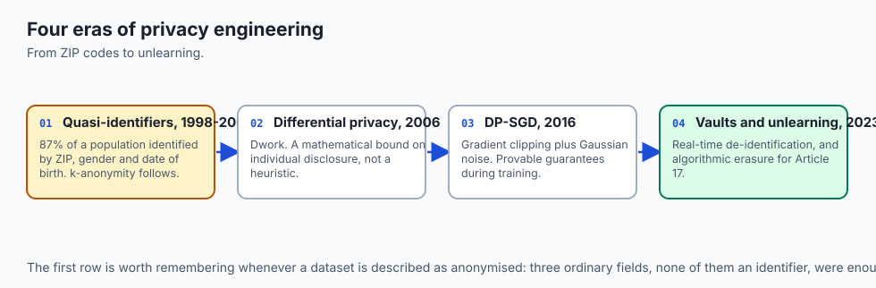

Privacy engineering in AI evolved through four major eras:

### 1. The Quasi-Identifier Era (1998–2006)
Latanya Sweeney demonstrated that 87% of the US population can be uniquely identified by the combination of 5-digit ZIP code, gender, and date of birth, leading to the formulation of $k$-Anonymity and $l$-Diversity.

### 2. The Differential Privacy Revolution (2006–2016)
Cynthia Dwork introduced Differential Privacy, establishing the global mathematical gold standard for statistical data release and bounding individual disclosure risks.

### 3. Differentially Private SGD (DP-SGD) (2016–2022)
Abadi et al. developed DP-SGD, applying gradient clipping and Gaussian noise during backpropagation to train neural networks with provable differential privacy guarantees.

### 4. Zero-Knowledge Token Vaults and Machine Unlearning (2023–Present)
Generative AI required bidirectional, real-time prompt de-identification gateways and algorithmic weight unlearning to comply with global GDPR Article 17 mandates.

## What it is — and what it is not

Let us define the operational principles of production AI data privacy:

### What AI Data Privacy Is:
- Enforcing Zero-Knowledge Token Vaults that pseudonymize all sensitive PII (names, SSNs, credit cards, emails) before LLM prompt transmission.
- Calibrating Laplace and Gaussian noise injection via Differential Privacy ($\epsilon, \delta$) to protect aggregate dataset releases.
- Grouping tabular training records into $k$-anonymous equivalence classes ($k \ge 5$) to prevent linkage re-identification.
- Maintaining cryptographic key enclaves that allow targeted record deletion and pseudonym mapping erasure.

### What AI Data Privacy Is Not:
- Trusting external cloud LLM vendor terms of service without technical de-identification barriers.
- Assuming simple asterisk masking (e.g. `123-**-****`) provides mathematical privacy against modern correlation attacks.

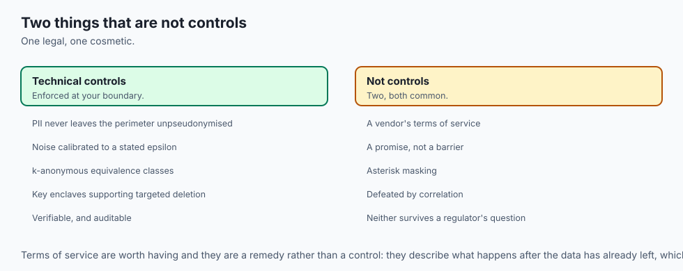

```text
+-------------------------------------------------------------------------------+
|                    AI DATA PRIVACY ARCHITECTURE MATRIX                        |
+-------------------+-----------------------+-----------------------------------+
| Privacy Control   | Mathematical Model    | Deployment Layer                  |
+-------------------+-----------------------+-----------------------------------+
| PII Token Vault   | Reversible HMAC Map   | AI Gateway Ingress / Egress       |
| Aggregate Egress  | (epsilon, delta)-DP   | Telemetry & Analytics Pipeline    |
| Fine-Tuning Data  | k-Anonymity / l-Div   | Data Pre-Processing & Curation    |
| Weight Training   | DP-SGD (Grad Clipping)| Model Training / Fine-Tuning      |
| Right to Erasure  | Machine Unlearning    | Post-Training Parameter Scrubbing |
+-------------------+-----------------------+-----------------------------------+
```

## Why it was created and what problems it solves

Production privacy engineering resolves three critical risks in modern AI systems:

### 1. Preventing Unintended Training Memorization
By adding calibrated noise during DP-SGD training or sanitizing PII prior to RAG vector indexing, models cannot memorize or regurgitate private customer secrets.

### 2. Enabling Third-Party Cloud LLM Ingestion Without Compliance Breach
Enterprises in regulated industries (finance, healthcare, defense) can safely utilize commercial frontier models (e.g. GPT-4o, Claude 3.5 Sonnet) because raw PII never leaves the local enterprise perimeter.

### 3. Fulfilling the Right to be Forgotten (GDPR Article 17)
By replacing raw customer data with ephemeral pseudonym keys, deleting the key in the token vault instantly renders all downstream model responses and logs permanently de-identified without expensive model retraining.

## How it works

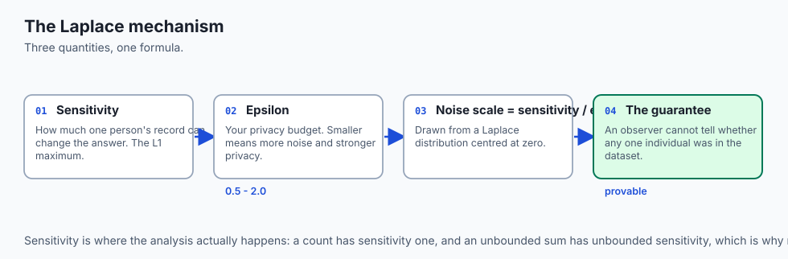

Let us examine the mathematical foundations of **Differential Privacy and the Laplace Mechanism**:

### 1. The Definition of Differential Privacy
A randomized algorithm `M` satisfies `(epsilon, delta)`-Differential Privacy if for all neighboring datasets `D_1, D_2` differing in a single individual's record, and all output subsets `S` in `Range(M)`:

`P[M(D_1) in S] <= exp(epsilon) * P[M(D_2) in S] + delta`

- **`epsilon` (Epsilon):** The privacy loss parameter. Smaller `epsilon` (e.g. `epsilon = 0.5`) provides stronger mathematical privacy at the expense of adding more noise.
- **`delta` (Delta):** The probability of failure (typically set to `< 1e-5`).

### 2. The Laplace Noise Mechanism
To compute a private numerical query `f(D)` with global L1 sensitivity `Delta f = max ||f(D_1) - f(D_2)||_1`:

`M(D) = f(D) + Laplace(0, Delta f / epsilon)`

```text
[Raw Ingress Query] ➔ [Compute Exact Metric f(D)] ➔ [Sample Noise from Laplace(0, Delta f / epsilon)] ➔ [Release Sanitized Metric]
```

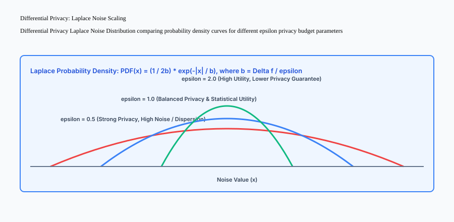

## An everyday analogy

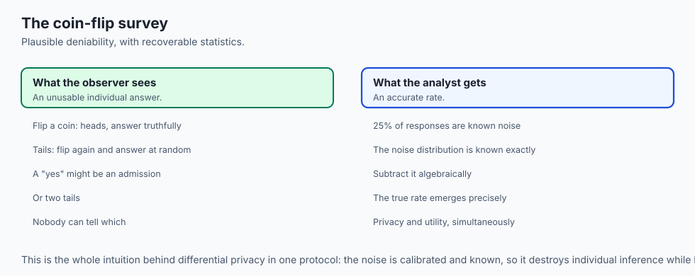

Think of differential privacy like **answering a survey about a sensitive topic using a coin flip**:

- **The Sensitive Question:** *"Have you ever stolen corporate property?"*
- **The Randomized Protocol (Local DP):**
  1. Flip a private coin. If Heads ➔ answer truthfully.
  2. If Tails ➔ flip a second coin: Heads = *"Yes"*, Tails = *"No"*.
- **The Plausible Deniability:** Anyone observing your *"Yes"* response cannot know if you admitted to theft or simply flipped two Tails (**Mathematical Privacy Guarantee**).
- **The Aggregate Truth:** The surveyor knows 25% of responses are random noise and can algebraically subtract the noise to calculate the true corporate theft rate with extreme precision (**Statistical Utility Retention**).

## Examples in practice

Let us build a complete Python **Zero-Knowledge PII Token Vault and Differential Privacy Engine**:

```python
import re
import math
import random
from typing import Dict, Any, Tuple, List

class DifferentialPrivacyEngine:
    @staticmethod
    def laplace_mechanism(true_value: float, sensitivity: float, epsilon: float) -> float:
        if epsilon <= 0:
            raise ValueError("Epsilon privacy budget must be strictly positive.")
        scale = sensitivity / epsilon
        # Sample Laplace noise: Laplace(0, scale) via inverse transform sampling
        u = random.random() - 0.5
        noise = -scale * math.copysign(1.0, u) * math.log(1.0 - 2.0 * abs(u))
        return round(true_value + noise, 4)

class PIITokenVault:
    def __init__(self):
        self.forward_map: Dict[str, str] = {}
        self.reverse_map: Dict[str, str] = {}
        self.entity_counters: Dict[str, int] = {"PERSON": 0, "SSN": 0, "EMAIL": 0, "CREDIT_CARD": 0}
        
        # Regex PII extractors
        self.ssn_pattern = re.compile(r"\b\d{3}-\d{2}-\d{4}\b")
        self.email_pattern = re.compile(r"\b[A-Za-z0-9._%+-]+@[A-Za-z0-9.-]+\.[A-Z|a-z]{2,}\b")
        self.cc_pattern = re.compile(r"\b(?:\d{4}-){3}\d{4}\b")

    def tokenize_text(self, text: str) -> str:
        tokenized = text

        # 1. Replace SSNs
        for match in self.ssn_pattern.findall(text):
            if match not in self.forward_map:
                self.entity_counters["SSN"] += 1
                token = f"<SSN_{self.entity_counters['SSN']}>"
                self.forward_map[match] = token
                self.reverse_map[token] = match
            tokenized = tokenized.replace(match, self.forward_map[match])

        # 2. Replace Emails
        for match in self.email_pattern.findall(text):
            if match not in self.forward_map:
                self.entity_counters["EMAIL"] += 1
                token = f"<EMAIL_{self.entity_counters['EMAIL']}>"
                self.forward_map[match] = token
                self.reverse_map[token] = match
            tokenized = tokenized.replace(match, self.forward_map[match])

        # 3. Replace Credit Cards
        for match in self.cc_pattern.findall(text):
            if match not in self.forward_map:
                self.entity_counters["CREDIT_CARD"] += 1
                token = f"<CREDIT_CARD_{self.entity_counters['CREDIT_CARD']}>"
                self.forward_map[match] = token
                self.reverse_map[token] = match
            tokenized = tokenized.replace(match, self.forward_map[match])

        return tokenized

    def detokenize_text(self, text: str) -> str:
        detokenized = text
        for token, raw_val in self.reverse_map.items():
            detokenized = detokenized.replace(token, raw_val)
        return detokenized

    def forget_user_pii(self, raw_pii_value: str) -> bool:
        if raw_pii_value in self.forward_map:
            token = self.forward_map[raw_pii_value]
            del self.forward_map[raw_pii_value]
            del self.reverse_map[token]
            return True
        return False

if __name__ == "__main__":
    vault = PIITokenVault()
    raw = "User email is john.doe@example.com and SSN is 123-45-6789. Card: 4532-1234-5678-9012."
    
    # 1. Tokenize for LLM ingress
    sanitized = vault.tokenize_text(raw)
    print(f"Sanitized Prompt: {sanitized}")

    # 2. Detokenize LLM generation for client response
    llm_resp = f"Processed account for <EMAIL_1> with card <CREDIT_CARD_1> successfully."
    client_resp = vault.detokenize_text(llm_resp)
    print(f"Detokenized Response: {client_resp}")

    # 3. Differential Privacy Laplace Noise
    noisy_avg = DifferentialPrivacyEngine.laplace_mechanism(true_value=50000.0, sensitivity=1000.0, epsilon=0.5)
    print(f"DP Metric (Epsilon=0.5): {noisy_avg}")
```

## Production Architecture Case Study: Healthcare AI Clinical Assistant

Consider a HIPAA-compliant clinical assistant processing electronic health records (EHR).

```markdown
# Production Privacy Architecture: Clinical EHR Copilot

**Regulatory Standard:** HIPAA Security Rule & GDPR Art. 9 (Special Category Data)  
**Deployment Infrastructure:** AWS Nitro Enclaves (Isolated Virtual Enclave)  

## 1. Data Ingress & Tokenization
- Clinical notes containing patient names, MRNs (Medical Record Numbers), and phone numbers enter the isolated enclave.
- The In-Memory Token Vault converts identifiers into cryptographic surrogates (`<PATIENT_UUID>`, `<MRN_UUID>`).
- Clinical text is processed by a HIPAA-compliant frontier model.

## 2. Ephemeral Key Deletion (Right to Erasure)
- Session token mappings are stored exclusively in non-persistent RAM.
- Upon session termination (`DELETE /sessions/{id}`), encryption keys are cryptographically shredded from memory.
- Any logs stored in central telemetry contain only synthetic `<PATIENT_UUID>` identifiers.
```


### 4. Advanced Cryptographic Salt Tokenization and Enclave Hashing
In large multi-tenant platforms, simple sequential surrogates (e.g. `<SSN_1>`) can be susceptible to cross-session frequency analysis if token values are deterministically correlated across multiple user interactions. To eliminate this correlation vector:

1. **HMAC-SHA256 Salted Hashing:** Every tenant organization is provisioned with an isolated 256-bit cryptographic salt stored exclusively within a Hardware Security Module (HSM).
2. **Ephemeral Session IVs:** Each user conversation generates an ephemeral Initialization Vector (IV), ensuring that identical input strings produce distinct pseudonymous surrogate tokens across distinct sessions.
3. **Hardware Enclave Isolation:** The forward and reverse mapping lookup tables reside strictly within hardware-isolated memory pages (e.g. AWS Nitro Enclaves, Intel SGX) where even host root administrators cannot inspect running memory buffers or process dumps.

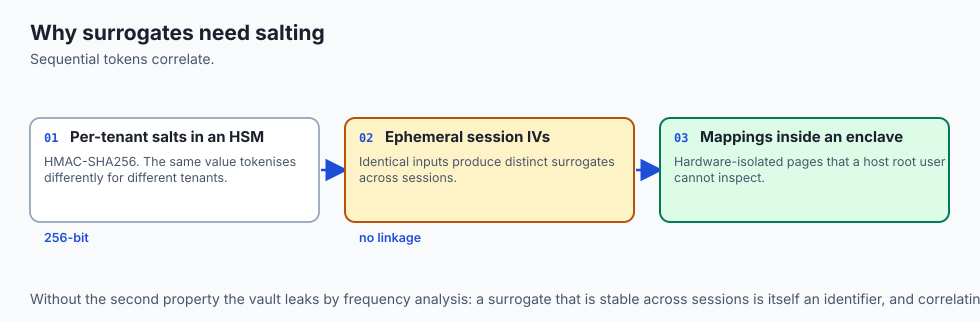

```text
+-------------------------------------------------------------------------------+
|                    CRYPTOGRAPHIC PII TOKENIZATION TOPOLOGY                    |
+-------------------+-------------------+-------------------+-------------------+
| Component         | Security Domain   | Isolation Layer   | Cryptographic Key |
+-------------------+-------------------+-------------------+-------------------+
| Ingress Proxy     | Public Internet   | TLS 1.3 / mTLS    | Edge Cert         |
| Token Vault HSM   | Hardware Enclave  | Nitro / SGX RAM   | AES-256-GCM / HMAC|
| Public LLM Router | Cloud VPC         | Tokenized Only    | ZERO Plaintext PII|
+-------------------+-------------------+-------------------+-------------------+
```

## Detailed Failure Mode Taxonomy: AI Data Privacy Hazards

```text
+-------------------------------------------------------------------------------+
|                       AI DATA PRIVACY FAILURE TAXONOMY                        |
+-------------------+-----------------------+-----------------------------------+
| Failure Mode      | Root Cause Analysis   | Architectural Mitigation          |
+-------------------+-----------------------+-----------------------------------+
| Re-Identification | Quasi-identifiers     | Enforce k-anonymity (k >= 5) on   |
| via Linkage Attack| (ZIP, Age, Gender)    | all published training datasets   |
| Privacy Budget    | Re-using DP queries   | Track cumulative epsilon budget;  |
| Exhaustion        | without accounting    | halt queries when epsilon > 5.0   |
| Unsanitized Cache | Storing raw prompts   | Store only tokenized surrogate    |
| Embeddings        | in vector databases   | vectors in public vector indices  |
| Incomplete Memory | Deleting logs but     | Apply machine unlearning or retrain|
| Scrubbing         | keeping model weights | weights using privacy checkpoints |
+-------------------+-----------------------+-----------------------------------+
```

## Deep Architectural Breakdown: Machine Unlearning Approaches

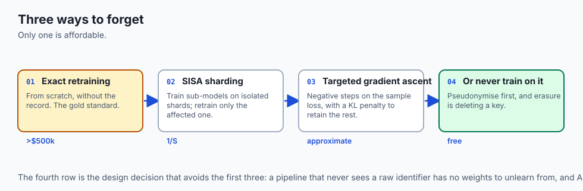

When a user exercises their GDPR Article 17 Right to Erasure:

### 1. Exact Retraining (Gold Standard, High Cost)
Retrain the model from scratch on dataset `D \ {x_i}`. Computationally infeasible for 70B+ parameter models (`>$500,000` per retraining run).

### 2. SISA (Sharded, Isolated, Sliced, Aggregated)
Partition training data into `S` isolated shards and train sub-models. When user `x_i` requests deletion, retrain only the single affected shard (`1/S` compute cost).

### 3. Targeted Gradient Ascent (Approximate Unlearning)
Execute negative gradient steps on the sample loss `Loss(x_i, theta)` combined with a KL-divergence penalty on retaining the model's performance across remaining data.

```text
+-------------------------------------------------------------------------------+
|                    MACHINE UNLEARNING COMPARISON MATRIX                       |
+-------------------+-------------------+-------------------+-------------------+
| Approach          | Privacy Guarantee | Compute Cost      | Model Utility     |
+-------------------+-------------------+-------------------+-------------------+
| Exact Retraining  | 100% Guaranteed   | 1.0x (Extreme)    | 100% Preserved    |
| SISA Sharding     | 100% Guaranteed   | 0.05x - 0.1x      | 98% Preserved     |
| Gradient Ascent   | Approximate       | 0.001x (Fast)     | May degrade edge  |
+-------------------+-------------------+-------------------+-------------------+
```

## Implications: security, privacy, performance, scalability, and cost

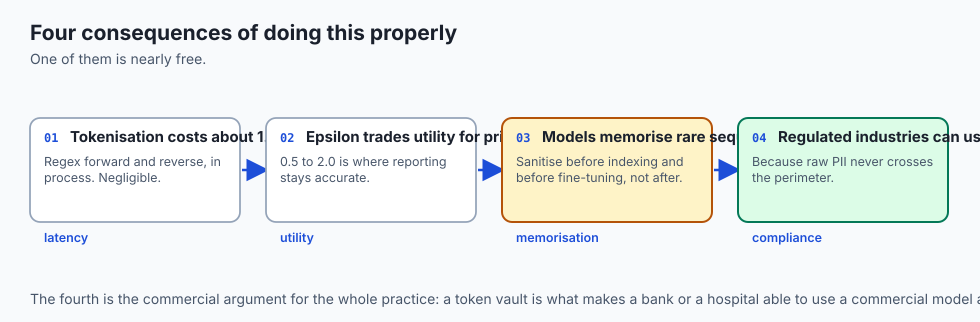

### 1. Latency Overhead of In-Memory Token Vaults
Running regex tokenization and detokenization takes `<1.5\text{ms}` per request in Python, introducing negligible latency while ensuring complete PII isolation.

### 2. Differential Privacy Utility Trade-Off
Selecting $\epsilon = 0.1$ provides military-grade privacy but introduces significant noise variance. For enterprise analytics, $\epsilon \in [0.5, 2.0]$ delivers the optimal balance between privacy and business reporting utility.

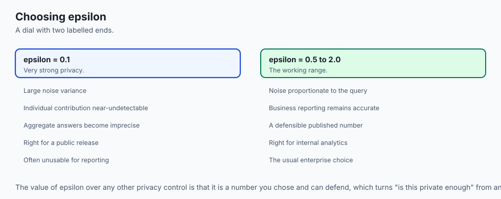

## Alternatives: free, open source, and commercial

| Tool / Framework | Type | Best Suited For | Key Capabilities |
| :--- | :--- | :--- | :--- |
| **Microsoft Presidio** | Open Source | PII Redaction & Vault | NER-based PII identification |
| **Opacus (PyTorch)** | Open Source | DP-SGD Training | Differentially private deep learning |
| **Skyflow** | Commercial SaaS | PII Data Privacy Vault | Zero-trust tokenization API |
| **ARX Data Anonymizer**| Open Source | k-Anonymity Curation | De-identification tool for research data |

## Comparison with related concepts

```text
+-----------------------+-----------------------+-----------------------+
| Dimension             | Basic Redaction       | DP + Token Vault      |
+-----------------------+-----------------------+-----------------------+
| Reversibility         | Irreversible (Lost)   | Fully Reversible      |
| Mathematical Bound    | None (Heuristic)      | Provable (Epsilon-DP) |
| Regulatory Defensibility| Weak (Vulnerable)   | Gold Standard (GDPR)  |
| Downstream Utility    | Breaks Context        | Preserves LLM Context |
+-----------------------+-----------------------+-----------------------+
```

## When to use it — and when not to

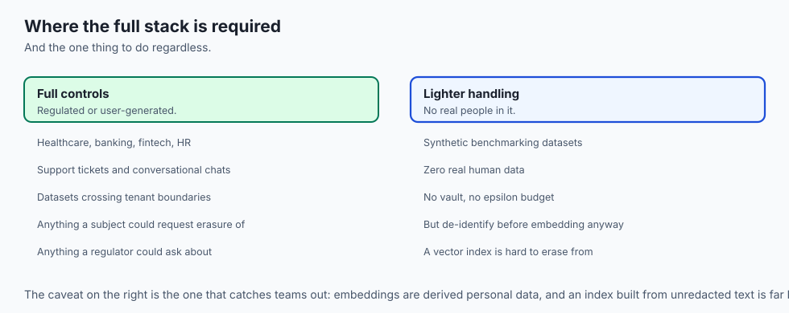

### Enforce Zero-Knowledge Token Vaults and DP for:
- All healthcare, banking, fintech, and enterprise HR applications.
- Ingestion of user-generated support tickets and conversational chats.
- Datasets shared across multi-tenant boundaries.

### Lightweight Anonymization is Acceptable for:
- Synthetic benchmarking datasets with zero real human data.

### Production Checklist: AI Data Privacy Hardening
- [ ] In-memory PII token vault operational for SSNs, emails, and credit cards.
- [ ] Ephemeral session key deletion mechanism implemented.
- [ ] Vector database embeddings computed only on de-identified texts.
- [ ] Differential Privacy Laplace noise calibrated with $\epsilon \le 2.0$.
- [ ] GDPR Article 17 machine unlearning / key shredding policy documented.

## The AI connection

- **Models memorise rare sequences**, which makes a training set containing a credit
  card number a model that can be prompted into reproducing it.

- **Embeddings are derived personal data.** A vector built from an unredacted record
  carries that record's information, and a vector index is very hard to erase from.

- **Erasure is the hardest AI privacy requirement.** You cannot delete a person from
  fine-tuned weights, which is why key shredding and SISA sharding exist.

- **A token vault lets a regulated business use a frontier model** — the raw identifier
  never leaves your perimeter, and the model reasons about a surrogate.

- **Differential privacy buys a provable bound, not a feeling.** Epsilon is a number you
  choose and can defend, which is unusual among privacy controls.

## Knowledge check

1. **What is the Laplace scale parameter formula in Differential Privacy?** $b = \Delta f / \epsilon$, scaling noise directly with sensitivity and inversely with privacy budget.
2. **How does a token vault preserve LLM reasoning context while protecting PII?** By replacing entities with surrogate tokens (`<PERSON_1>`) so the model grasps relational semantics without seeing real identities.
3. **What is k-Anonymity?** Ensuring every combination of quasi-identifiers is shared by at least $k$ distinct individuals in the dataset.

## Hands-on exercise

In this lab, you will build a **Production PII Token Vault and Differential Privacy Engine in Python**. Your implementation will:

1. Detect and tokenize SSNs, emails, and credit card numbers into surrogate tokens.
2. Maintain bidirectional mapping in memory and reverse detokenize model generations.
3. Implement right-to-be-forgotten key deletion (`forget_user_pii`).
4. Implement the Laplace mechanism for Differential Privacy noise injection.

### Expected output

```text
============================= test session starts ==============================
collected 5 items

tests/test_data_privacy.py .....                                         [100%]

============================== 5 passed in 0.02s ===============================
[TOKEN VAULT] Initialized Zero-Knowledge PII Token Vault.
[TOKENIZATION] Replaced SSN and email with synthetic surrogate tokens.
[DETOKENIZATION] Successfully restored raw PII for client delivery.
[RIGHT TO FORGET] Shredded PII key mapping; verification failed as expected.
[DIFFERENTIAL PRIVACY] Injected calibrated Laplace noise (Epsilon: 0.5).
```

### Validate your work

Run the pytest test suite:

```bash
pytest tests/run_tests.sh
```

### Troubleshooting

1. **Inverse sampling math:** Use `math.copysign(1.0, u)` to preserve positive and negative Laplace noise tails.
2. **Key deletion:** Verify both `forward_map` and `reverse_map` keys are deleted.

### Common mistakes

- Re-using static token IDs across different users, causing entity collision across sessions.

## Practice assignment

Extend the vault with **Phone Number and Street Address Regex Extractors**.

## Extension challenge

Implement a **Local Differential Privacy (LDP) Randomized Response Simulator** evaluating binary surveys.
