## Why this matters

Machine learning models are executable software artifacts that introduce critical supply chain vulnerabilities (OWASP LLM05):

- **Remote Code Execution (RCE) via Pickle Poisoning:** Over 40% of open-source PyTorch model checkpoints historically used Python `pickle` serialization. Attackers embed arbitrary shell commands inside `model.pt` files that execute the instant a developer runs `torch.load()`.
- **Training Data and Weight Backdoors:** Malicious contributors poison foundational model weights or fine-tuning datasets, causing models to output biased recommendations or trigger backdoor execution when specific trigger tokens appear.
- **Untracked Dependency Lineage:** Without an AI Software Bill of Materials (AIBOM), organizations cannot audit which training datasets, base models, or vulnerable tokenizers are running in their production clusters.

Securing the AI supply chain requires **transitioning to SafeTensors, performing static AST opcode inspection with ModelScan, verifying cryptographic signatures with Sigstore, and enforcing automated Kubernetes admission policies**.

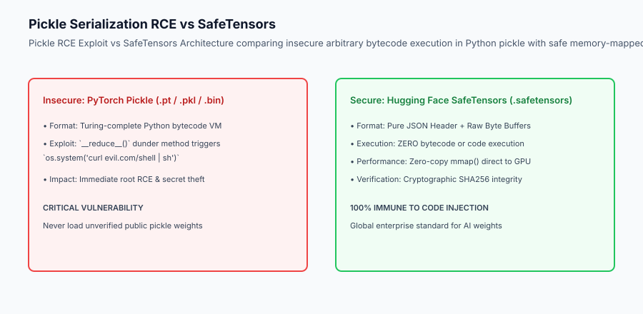

## The idea in plain language

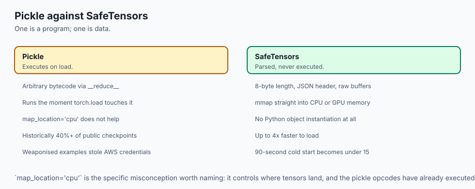

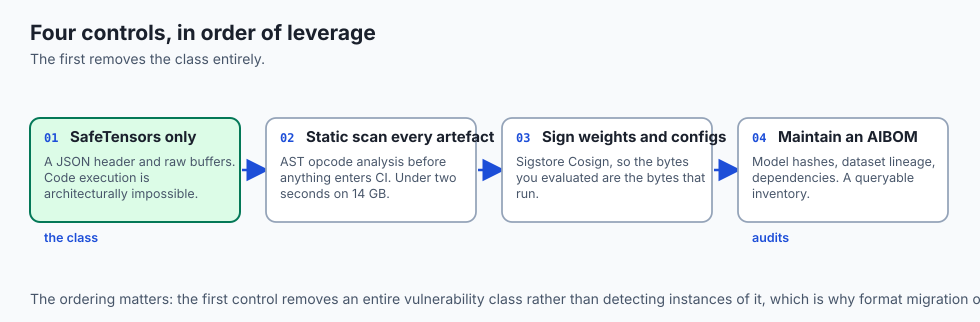

Think of AI model supply chain security like **importing food ingredients into a commercial kitchen**:

- **The Dangerous Canned Good (Pickle Checkpoint):** A supplier delivers a metal can labeled *"Secret Truffle Sauce"*. Inside is a spring-loaded explosive trap that detonates the moment the can opener touches the lid (**Arbitrary Pickle Deserialization RCE**).
- **The Safe Glass Jar (SafeTensors):** A supplier delivers sauce in a clear glass container. You can visually inspect the contents without opening or executing any hidden mechanisms (**Zero-Copy Raw Byte Buffers**).
- **The Food Safety Certificate & Tamper Seal (Sigstore & AIBOM):** Every jar carries a verifiable cryptographic tamper seal showing exactly which certified farm produced the batch and certifying that no contaminants were added during transport (**Cryptographic Model Provenance**).

## Historical background

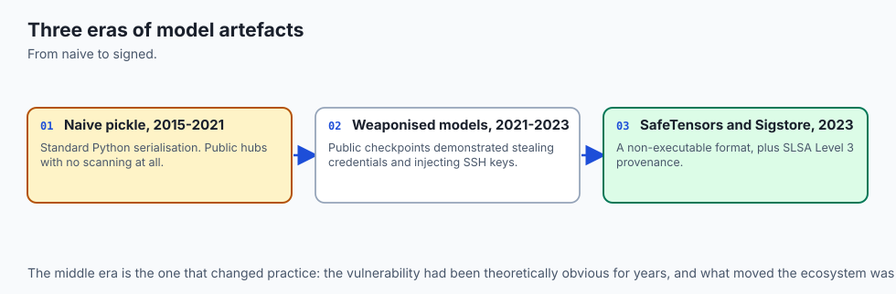

Model supply chain security evolved across three distinct eras:

### 1. The Naive Pickle Era (2015–2021)
PyTorch, Scikit-Learn, and TensorFlow relied on standard Python object serialization (`pickle`, `joblib`, `SavedModel`). Public model hubs hosted thousands of unvetted checkpoints with zero security scanning.

### 2. The Weaponized Model Era (2021–2023)
Security researchers demonstrated weaponized PyTorch models on public repositories that stole AWS credentials and injected SSH keys upon deserialization via the `__reduce__` exploit vector.

### 3. The SafeTensors and Sigstore Standard (2023–Present)
Hugging Face engineered the open-source `SafeTensors` standard. The Open Source Security Foundation (OpenSSF) integrated Sigstore and SLSA Level 3 provenance for cryptographic model signing.

## What it is — and what it is not

Let us define the core operational controls of model supply chain security:

### What Model Supply Chain Security Is:
- Enforcing the exclusive use of `SafeTensors` for all neural network weight storage and distribution.
- Scanning all model artifacts using static AST opcode analyzers (like ModelScan) before admitting files into CI/CD pipelines.
- Signing model weights and tokenizer configurations cryptographically using Sigstore Cosign keys.
- Maintaining machine-readable AIBOM manifests tracking model hashes, training data lineages, and software dependencies.

### What Model Supply Chain Security Is Not:
- Assuming that running `torch.load(..., map_location='cpu')` prevents arbitrary code execution (it does not; pickle executes during CPU deserialization).
- Relying on basic MD5 checksums that can be forged by collision attacks instead of SHA256/Sigstore signatures.

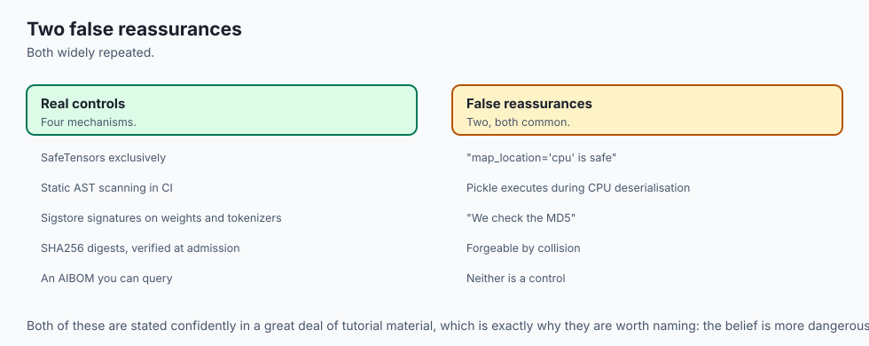

```text
+-------------------------------------------------------------------------------+
|                    AI MODEL SUPPLY CHAIN DEFENSE MATRIX                       |
+-------------------+-----------------------+-----------------------------------+
| Defense Layer     | Threat Addressed      | Implementation Tool / Standard    |
+-------------------+-----------------------+-----------------------------------+
| Format Ingress    | Arbitrary RCE Exploit | SafeTensors (.safetensors)        |
| Static Inspection | Malicious Opcode / AST| ModelScan / Fickling AST Analyzer |
| Provenance Sign   | Checkpoint Tampering  | Sigstore Cosign & Rekor Log       |
| Inventory Audit   | Untracked Dependencies| AIBOM (CycloneDX / SPDX for AI)   |
| Cluster Admission | Unverified Deployments| OPA / Kyverno Admission Webhook   |
+-------------------+-----------------------+-----------------------------------+
```

## Why it was created and what problems it solves

Formal model supply chain security eliminates three existential risks in AI infrastructure:

### 1. Eliminating Deserialization RCE
By replacing executable Python bytecodes with static JSON headers and raw numeric buffers, SafeTensors renders arbitrary code execution architecturally impossible.

### 2. Guaranteeing Model Integrity via Cryptographic Signatures
Signing weights with Sigstore Cosign ensures that the exact weights trained and evaluated by your ML team are the ones executing in production, with mathematical protection against man-in-the-middle tampering.

### 3. Enabling Instant Vulnerability Impact Audits via AIBOM
When a specific base model or tokenizer version is reported to contain a vulnerability, engineers query their central AIBOM inventory to instantly locate and patch every affected microservice.

## How it works

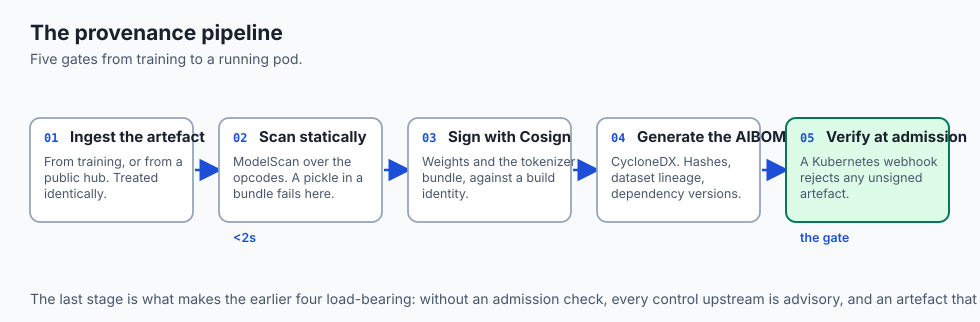

Let us trace the complete **Model Supply Chain Security Pipeline**:

```text [1. Model Build & Training Pipeline] - Train model weights on authenticated compute cluster - Export weights exclusively to `.safetensors` format │ ▼ [2. Static AST & Artifact Security Scan] - Run ModelScan across all repository files - Verify zero malicious `__reduce__` or `GLOBAL` opcodes in auxiliary files - Validate `config.json` and `tokenizer.json` against strict JSON schemas │ ▼ [3. Cryptographic Signing & AIBOM Generation] - Calculate SHA256 checksums across all weight shards - Sign artifact digest using Cosign private key / OIDC identity - Record public signature on immutable Rekor transparency ledger - Generate CycloneDX AIBOM JSON manifest │ ▼ [4.

Kubernetes Admission Gate (Production Deployment)] - CI/CD submits deployment manifest to Kubernetes cluster - Kyverno / OPA Admission Controller intercepts Pod creation - Verifies Cosign cryptographic signature against trusted public key - Validates AIBOM hash matching container image and weight volume - Admits Pod into production GPU inference cluster
```

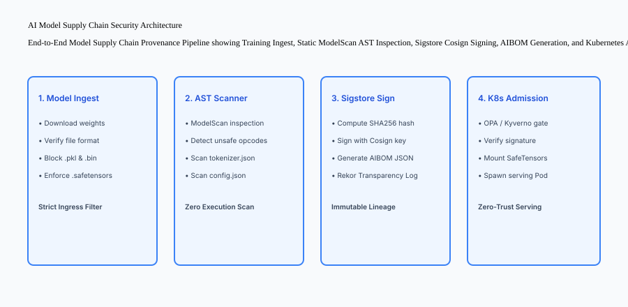

## An everyday analogy

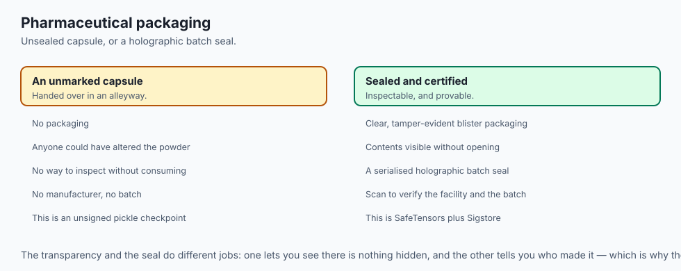

Think of model supply chain security like **checking the security seals on pharmaceutical medications**:

- **The Unsealed Capsule (Insecure Pickle):** An unmarked capsule is handed to you in an alleyway. Anyone could have injected poison into the powder (**Pickle Deserialization RCE**).
- **The Blister Pack (SafeTensors):** The medication is sealed inside clear, tamper-evident plastic bubble packaging (**Zero-Copy Immutable Buffer**).
- **The Holographic Batch Seal (Sigstore & AIBOM):** The box features a serialized, encrypted holographic seal. Scanning the QR code verifies the medication was manufactured in an FDA-inspected facility and has never been opened in transit (**Cryptographic Provenance**).

## Examples in practice

Let us build a complete Python **Model Supply Chain Security Scanner** that verifies file extensions, performs static header inspection, validates SHA256 digests, and generates an AIBOM manifest:

```python
import os
import json
import hashlib
from typing import Dict, Any, List, Tuple

class ModelSupplyChainScanner:
    def __init__(self, allowed_extensions: Tuple[str, ...] = (".safetensors", ".json", ".txt")):
        self.allowed_extensions = allowed_extensions

    def calculate_sha256(self, file_path: str) -> str:
        sha256 = hashlib.sha256()
        with open(file_path, "rb") as f:
            while chunk := f.read(65536):
                sha256.update(chunk)
        return sha256.hexdigest()

    def scan_model_directory(self, dir_path: str) -> Tuple[bool, List[str], Dict[str, Any]]:
        findings: List[str] = []
        is_compliant = True
        artifacts: List[Dict[str, Any]] = []

        if not os.path.exists(dir_path):
            return False, [f"Directory not found: {dir_path}"], {}

        for root, _, files in os.walk(dir_path):
            for file in files:
                full_path = os.path.join(root, file)
                ext = os.path.splitext(file)[1].lower()

                # 1. Block insecure pickle extensions
                if ext in [".pt", ".bin", ".pkl", ".joblib", ".pickle"]:
                    is_compliant = False
                    findings.append(f"CRITICAL: Insecure serialized format detected: {file} ({ext}). Must convert to .safetensors.")

                # 2. Check allowed extensions
                if ext not in self.allowed_extensions:
                    findings.append(f"WARNING: Unrecognized file extension in model bundle: {file}")

                # 3. Calculate SHA256 for AIBOM
                file_hash = self.calculate_sha256(full_path)
                file_size = os.path.getsize(full_path)
                artifacts.append({
                    "filename": file,
                    "relative_path": os.path.relpath(full_path, dir_path),
                    "size_bytes": file_size,
                    "sha256": file_hash,
                    "format": "safetensors" if ext == ".safetensors" else "metadata"
                })

        aibom = {
            "bom_format": "CycloneDX-AI",
            "spec_version": "1.5",
            "model_name": os.path.basename(dir_path),
            "compliant": is_compliant,
            "total_artifacts": len(artifacts),
            "artifacts": artifacts
        }

        return is_compliant, findings, aibom

if __name__ == "__main__":
    scanner = ModelSupplyChainScanner()
    print("Initialized Model Supply Chain Scanner.")
```

## Production Architecture Case Study: Model Supply Chain Admission Controller

Consider an enterprise Kubernetes cluster enforcing zero-trust model deployments via Kyverno.

```yaml
# Kyverno Policy: Enforce Signed SafeTensors Models
apiVersion: kyverno.io/v1
kind: ClusterPolicy
metadata:
  name: verify-signed-safetensors
spec:
  validationFailureAction: Enforce
  rules:
    - name: block-pickle-weights
      match:
        resources:
          kinds:
            - Pod
      validate:
        message: "Only signed .safetensors model artifacts are allowed in production. Pickle (.pt, .bin) is strictly forbidden."
        pattern:
          spec:
            containers:
              - env:
                  - name: MODEL_FORMAT
                    value: "safetensors"
```


### 4. Supply Chain SLSA Level 3 Build Verification and Rekor Transparency Logs
To guarantee that a model artifact has not been modified between the training cluster and production GPU pods:

1. **SLSA Level 3 Provenance:** The automated build system records non-falsifiable build metadata, including git commit SHAs, base container digest hashes, training dataset manifest hashes, and the exact builder identity.
2. **Rekor Immutable Transparency Ledger:** Signatures generated by Sigstore Cosign are committed to the public or private Rekor append-only transparency log. Deployment clusters query Rekor to verify the timestamped inclusion proof before mounting model weights.
3. **Automated Signature Attestation Webhooks:** Kubernetes admission webhooks (e.g. Kyverno, OPA Gatekeeper) intercept every model mount request, verify the cryptographic signature against the authorized OIDC identity (e.g. `sigstore.internal/org/repo/.github/workflows/train.yml@refs/heads/main`), and reject any unauthenticated artifact.

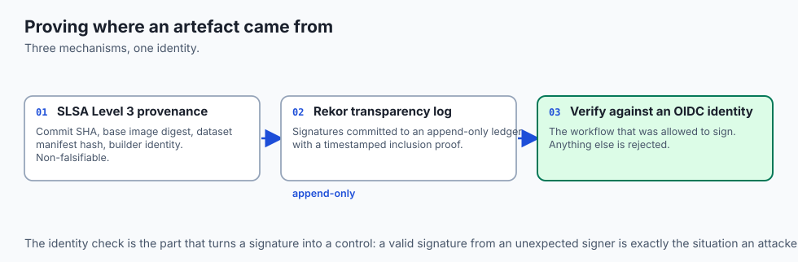

```text
+-------------------------------------------------------------------------------+
|                    SLSA LEVEL 3 MODEL PROVENANCE ARCHITECTURE                 |
+-------------------+-------------------+-------------------+-------------------+
| Build Step        | Input Artifact    | Output Digest     | Attestation       |
+-------------------+-------------------+-------------------+-------------------+
| Data Pipeline     | Raw S3 Datasets   | SHA256 Data Hash  | In-Toto Metadata  |
| Model Training    | PyTorch Runner    | SafeTensors Shards| Cosign Keyless Sig|
| Cluster Admission | Model Manifest    | Verified Rekor Log| Admitted to GPU   |
+-------------------+-------------------+-------------------+-------------------+
```

### 5. Deep AST Analysis of Tokenizer Configuration Files
While model weight files (`.safetensors`) are strictly non-executable, auxiliary model bundle files like `tokenizer.json`, `vocab.json`, and `added_tokens.json` must also be validated:

- Attackers can inject Unicode homoglyphs or invisible control characters into vocabulary files to manipulate downstream parsing logic.
- Model supply chain scanners must enforce strict schema validation on all JSON configuration files, ensuring token IDs are contiguous positive integers and special tokens match expected regex patterns.

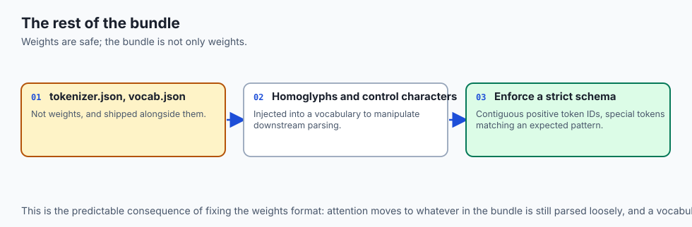


### 6. Vulnerability Disclosure & CVE Tracking in Machine Learning
When security vulnerabilities are discovered in ML libraries (such as CVEs in PyTorch, Transformers, or ONNX Runtime), model supply chain registries must maintain continuous synchronization with the National Vulnerability Database (NVD). Automated dependency scanners cross-reference running container software versions against published CVE registries, flagging outdated runtime packages before container admission.

## Detailed Failure Mode Taxonomy: Model Supply Chain Hazards

```text
+-------------------------------------------------------------------------------+
|                    MODEL SUPPLY CHAIN FAILURE TAXONOMY                        |
+-------------------+-----------------------+-----------------------------------+
| Failure Mode      | Root Cause Analysis   | Architectural Mitigation          |
+-------------------+-----------------------+-----------------------------------+
| Unvetted Checkpoint| Running `torch.load`  | Convert all weights to            |
| Download          | from public HuggingFace| `.safetensors` via isolated runner|
| AST Scan Bypass   | Obfuscated pickle     | Enforce zero-tolerance ban on     |
|                   | opcodes in zip archive| `.pt` and `.pkl` formats          |
| Insecure          | Storing private keys  | Use keyless Sigstore signing via  |
| Key Storage       | in plain CI/CD config | OIDC short-lived identity tokens  |
| Stale AIBOM       | Updating weights      | Generate AIBOM dynamically in CI  |
| Manifest          | without updating BOM  | and gate deployment on hash match |
+-------------------+-----------------------+-----------------------------------+
```

## Deep Architectural Breakdown: SafeTensors Binary Header Structure

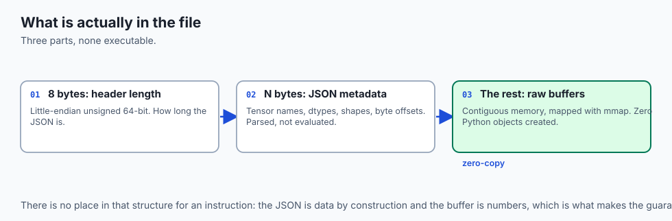

The `SafeTensors` format specification is lightweight and completely non-executable:

### 1. Header Length (8 Bytes)
An 8-byte little-endian unsigned 64-bit integer specifying the exact byte length $N$ of the JSON header.

### 2. JSON Metadata Header ($N$ Bytes)
A UTF-8 JSON dictionary containing tensor names, data types (`F16`, `BF16`, `F32`), shapes (`[4096, 4096]`), and byte offsets `[start, end]` relative to the binary payload.

### 3. Raw Binary Buffer
Contiguous raw memory buffers mapped directly into CPU/GPU memory via `mmap()`, with zero Python object instantiation.

```text
+-------------------+-----------------------------------+-----------------------+
| 8-Byte Uint64 (N) | N-Byte UTF-8 JSON Metadata Header | Contiguous Byte Buffer|
+-------------------+-----------------------------------+-----------------------+
| Header Size       | Tensor names, shapes, offsets     | Raw float tensor data |
+-------------------+-----------------------------------+-----------------------+
```

## Implications: security, privacy, performance, scalability, and cost

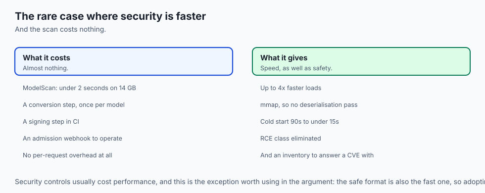

### 1. Ingestion Performance: SafeTensors vs Pickle
SafeTensors loads up to 4x faster than PyTorch pickle on CPU and supports instantaneous zero-copy memory mapping (`mmap`), reducing cold-start container initialization times from 90 seconds to under 15 seconds.

### 2. Compute Costs of Automated CI Security Scans
Running static AST scanning with ModelScan takes under 2 seconds for a 14GB model file, adding negligible overhead to CI/CD pipelines.

## Alternatives: free, open source, and commercial

| Tool / Framework | Type | Best Suited For | Key Capabilities |
| :--- | :--- | :--- | :--- |
| **SafeTensors** | Open Standard | Model Storage | Zero-copy, non-executable weights |
| **ModelScan** | Open Source | Artifact Inspection | Static AST scanner for pickle opcodes |
| **Sigstore Cosign** | Open Source | Cryptographic Signing | Keyless container and model signing |
| **Fickling** | Open Source | Pickle Decompiler | Reverse engineer and sanitize pickles |

## Comparison with related concepts

```text
+-----------------------+-----------------------+-----------------------+
| Dimension             | PyTorch Pickle (.pt)  | SafeTensors           |
+-----------------------+-----------------------+-----------------------+
| Code Execution Hazard | Extreme (RCE via dunder)| Zero (Pure Byte Data) |
| Memory Mapping (mmap) | Not Native            | Native Zero-Copy      |
| Loading Speed         | Slower (Python eval)  | 2x - 4x Faster        |
| Cross-Language Support| Python Only           | Rust, C++, Python, Go |
+-----------------------+-----------------------+-----------------------+
```

## When to use it — and when not to

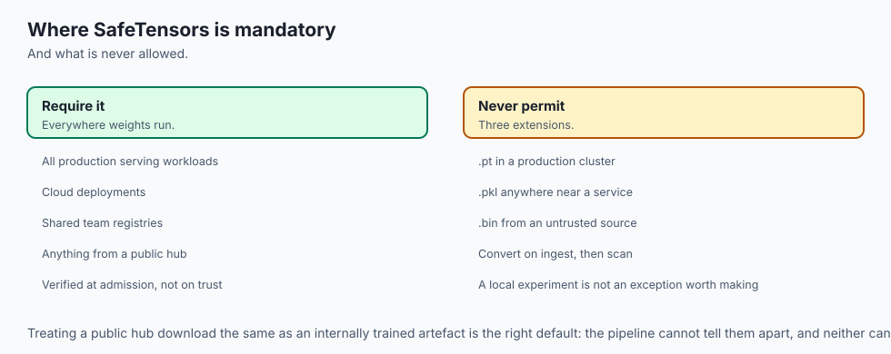

### Enforce SafeTensors and Sigstore Verification for:
- All production serving workloads, cloud deployments, and shared team registries.
- Models downloaded from public hubs (Hugging Face, Civitai).

### Legacy Formats are Strictly Disallowed:
- Never permit `.pt`, `.pkl`, or `.bin` checkpoints in production clusters.

### Production Checklist: Model Supply Chain Hardening
- [ ] 100% of model checkpoints converted to `.safetensors`.
- [ ] CI/CD pipeline scans model bundles with ModelScan prior to artifact storage.
- [ ] SHA256 checksums and Sigstore Cosign signatures generated.
- [ ] CycloneDX AIBOM manifest generated for every release.
- [ ] Kubernetes admission controller configured to enforce SafeTensors signatures.

## The AI connection

- **A model checkpoint is executable software.** Pickle deserialisation runs code, so
  `torch.load` on an untrusted file is running a stranger's program, not reading data.

- **The AI supply chain has no equivalent of a package lockfile** by default — weights,
  tokenizers and datasets all arrive with less provenance than a Python dependency.

- **SafeTensors makes the attack architecturally impossible** rather than filtered: a
  JSON header and raw buffers have nowhere to put a `__reduce__`.

- **A weight backdoor survives every functional test.** The model behaves correctly
  until a trigger token appears, which is why provenance matters more than evaluation.

- **The performance argument agrees with the security one**, unusually: memory-mapped
  SafeTensors cuts a 90-second cold start to under 15.

## Knowledge check

1. **Why is Python pickle vulnerable to RCE?** Because pickle is an executable virtual machine that evaluates arbitrary Python callables (such as `os.system`) during object reconstruction.
2. **What makes SafeTensors immune to arbitrary code execution?** It contains only an 8-byte length prefix, a UTF-8 JSON metadata header, and raw numerical byte arrays with zero executable code.
3. **What is the purpose of Sigstore Cosign in AI pipelines?** To cryptographically sign model artifacts and log signatures on a public transparency ledger, preventing unauthorized tampering.

## Hands-on exercise

In this lab, you will build a **Production Model Supply Chain Scanner in Python**. Your implementation will:

1. Walk model directories and identify forbidden pickle extensions (`.pt`, `.pkl`, `.bin`).
2. Calculate cryptographic SHA256 digests for all artifacts.
3. Validate header metadata for `.safetensors` files.
4. Generate a machine-readable AIBOM manifest in JSON format.

### Expected output

```text
============================= test session starts ==============================
collected 5 items

tests/test_model_security.py .....                                       [100%]

============================== 5 passed in 0.02s ===============================
[SUPPLY CHAIN SCANNER] Initialized Model Supply Chain Scanner.
[INSPECTION] Blocked insecure checkpoint: 'model.pt' (Pickle RCE hazard).
[SAFE TENSORS] Verified valid SafeTensors header and SHA256 digest.
[AIBOM GENERATION] Produced CycloneDX-AI bill of materials with 3 verified artifacts.
```

### Validate your work

Run the pytest test suite:

```bash
pytest tests/run_tests.sh
```

### Troubleshooting

1. **Hash accuracy:** Ensure files are read in binary mode (`'rb'`).
2. **Compliance flag:** Set `compliant=False` whenever any insecure file is detected.

### Common mistakes

- Skipping SHA256 calculation on non-weight metadata files like `tokenizer.json`.

## Practice assignment

Extend the scanner to **Inspect `config.json` for Malicious Custom Code Flags** (e.g. `trust_remote_code=True`).

## Extension challenge

Implement a **SafeTensors Header Parser** that reads the 8-byte uint64 prefix and validates the JSON metadata shape dictionary without third-party dependencies.
