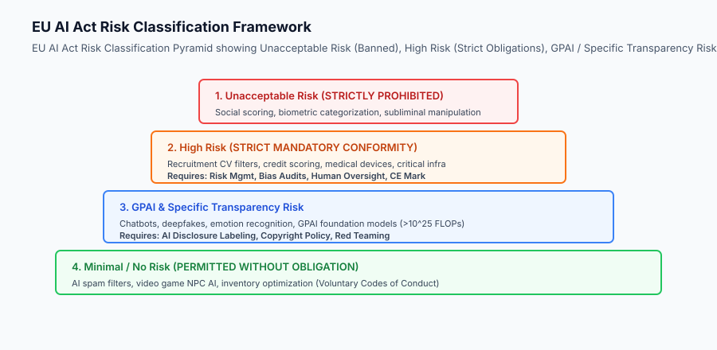
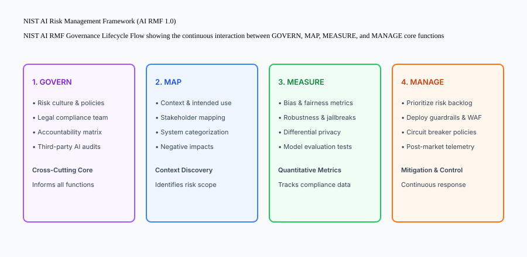

## Why this matters

Deploying production AI without structured governance and regulatory compliance creates massive legal, financial, and reputational hazards:
- **European Union AI Act Penalties:** Violations of prohibited AI practices carry fines up to 35 million euros or 7% of worldwide annual turnover (whichever is higher).
- **High-Risk AI System Enforcement:** Deploying uncertified AI systems for credit scoring, hiring, or insurance underwriting without mandatory bias testing and human oversight triggers regulatory bans across the EU and North America.
- **Model Card & Transparency Audits:** Enterprise customers and enterprise procurement teams increasingly require ISO/IEC 42001 certification and standardized Model Cards before approving enterprise software contracts.

Engineering compliant AI applications requires **operationalizing the EU AI Act risk tiers, implementing the NIST AI Risk Management Framework (AI RMF 1.0), and generating automated compliance artifacts in CI/CD**.



## The idea in plain language

Think of AI governance and regulation like **obtaining safety and emissions certifications for a new commercial automobile**:

- **Banned Designs (Unacceptable Risk):** Building a car with no brakes or steering wheel is strictly illegal (**Social Scoring & Biometric Surveillance Ban**).
- **Crash Testing & Safety Inspections (High-Risk AI):** A commercial airliner or heavy truck must pass extensive laboratory crash tests, airworthiness inspections, and emergency backup checks before carrying passengers (**Conformity Assessments & Bias Audits**).
- **The Window Sticker (Model Card & Transparency):** Every new car displays an EPA fuel economy sticker and safety crash rating so buyers understand its specifications and limitations (**Model Card & User Disclosure**).
- **The Factory Quality System (NIST AI RMF & ISO 42001):** The automaker maintains an audited, repeatable quality assurance process across all factories (**Organizational AI Governance**).

## Historical background

AI governance evolved through three landmark regulatory milestones:

### 1. The Voluntary Principles Era (2018–2021)
Organizations published ethical AI manifestos (OECD AI Principles, Asilomar AI Principles) with zero legally binding enforcement mechanisms.

### 2. The NIST AI RMF and ISO/IEC 42001 Era (2022–2023)
NIST released the AI Risk Management Framework 1.0, structuring corporate risk into GOVERN, MAP, MEASURE, and MANAGE. The International Organization for Standardization released ISO/IEC 42001, establishing the first global certifiable AI Management System.

### 3. The European Union AI Act Era (2024–Present)
The European Parliament enacted the EU AI Act (Regulation EU 2024/1689), establishing the world's first comprehensive, legally binding risk-tiered AI regulatory regime.

## What it is — and what it is not

Let us define the core boundaries of modern AI governance:

### What AI Governance Is:
- Systematically classifying AI applications into regulatory risk tiers (Unacceptable, High, GPAI, Minimal).
- Conducting mandatory Algorithmic Bias and Impact Assessments across protected demographic cohorts.
- Embedding automated compliance verification gates into continuous integration (CI/CD) pipelines.
- Publishing machine-readable Model Cards detailing intended usage, training datasets, and safety evaluation results.

### What AI Governance Is Not:
- A generic legal disclaimer tacked onto a website footer.
- A one-time compliance memo written by legal teams with zero technical verification in the software codebase.

```text
+-------------------------------------------------------------------------------+
|                    GLOBAL AI REGULATORY COMPLIANCE MATRIX                     |
+-------------------+-----------------------+-----------------------------------+
| Regulation / Std  | Jurisdiction / Scope  | Core Technical Obligation         |
+-------------------+-----------------------+-----------------------------------+
| EU AI Act         | European Union (Global| Risk classification, conformity,  |
|                   | market access)        | human-in-the-loop, CE marking     |
| NIST AI RMF 1.0   | United States / Global| GOVERN, MAP, MEASURE, MANAGE      |
| ISO/IEC 42001     | International Standard| Certified AI Management System    |
| NYC Local Law 144 | New York City (Hiring)| Annual independent bias audit for |
|                   |                       | automated employment decision AI  |
| US Executive Order| United States Federal | Dual-use model safety reporting,  |
| 14110             | Agencies / Frontier AI| red-teaming for GPAI models       |
+-------------------+-----------------------+-----------------------------------+
```

## Why it was created and what problems it solves

Formal AI governance resolves three fundamental failure modes in enterprise technology:

### 1. Eliminating Unchecked Algorithmic Bias
Without standardized demographic parity testing (e.g. testing for the four-fifths rule), resume screening or credit scoring algorithms inadvertently perpetuate historical societal discrimination.

### 2. Establishing Clear Accountability and Human Oversight
Governance frameworks mandate that high-risk autonomous agents must incorporate technical overrides, kill switches, and human review gates for high-stakes decisions.

### 3. Streamlining Enterprise Procurement and Audit Readiness
Maintaining automated Model Cards and compliance manifests reduces enterprise security review cycles from 6 months to under 48 hours.

## How it works

Let us examine the operational lifecycle of **NIST AI RMF 1.0**:

```text
[1. GOVERN (Organizational Foundation)]
  - Establish AI Ethics Committee and cross-functional accountability matrix
  - Define risk tolerance thresholds and regulatory compliance obligations
                    │
                    ▼
[2. MAP (Context & Scope Discovery)]
  - Identify application use case, target users, and potential negative impacts
  - Determine EU AI Act Risk Tier (e.g. High Risk for CV hiring tool)
                    │
                    ▼
[3. MEASURE (Quantitative Assessment)]
  - Execute automated fairness evaluations across demographic cohorts
  - Run adversarial red teaming jailbreak benchmarks
  - Calculate differential privacy epsilon metrics
                    │
                    ▼
[4. MANAGE (Continuous Risk Mitigation)]
  - Deploy runtime guardrails, prompt firewalls, and PII token vaults
  - Implement automated SRE circuit breakers and human override workflows
  - Generate Model Card and Conformity Assessment documentation
```



## An everyday analogy

Think of AI governance like **operating an air traffic control system**:

- **The Unregulated Sky (No Governance):** Pilots take off whenever they want, flying unvetted experimental airplanes with no radio communication (**Uncontrolled AI Deployments**).
- **The Aviation Authority (EU AI Act & NIST):** Flight rules dictate who can fly, establishing minimum pilot flight hours and emergency protocol standards (**Governance Frameworks**).
- **The Pre-Flight Checklist (Model Card & Conformity Assessment):** Before takeoff, pilots execute a standardized, verified instrument check to ensure all redundant systems are functional (**Automated CI/CD Compliance Gates**).

## Examples in practice

Let us build a complete Python **AI Governance & Compliance Validator** that evaluates an application against the EU AI Act risk tiers and generates a standardized Model Card:

```python
from typing import Dict, Any, List, Tuple

class AIGovernanceValidator:
    def __init__(self):
        self.prohibited_keywords = [
            "social_scoring", "subliminal_manipulation", 
            "untargeted_facial_scraping", "biometric_categorization_sensitive"
        ]
        self.high_risk_domains = [
            "recruitment_employment", "credit_scoring", "medical_diagnosis", 
            "law_enforcement", "critical_infrastructure", "educational_admission"
        ]

    def assess_eu_risk_tier(self, use_case_tag: str, is_gpai: bool = False, 
                            training_flops: float = 0.0) -> Tuple[str, List[str]]:
        obligations: List[str] = []

        # 1. Check Unacceptable Risk
        if use_case_tag in self.prohibited_keywords:
            return "UNACCEPTABLE_RISK", ["BANNED: System violates Article 5 of the EU AI Act. Deployment strictly prohibited."]

        # 2. Check High Risk
        if use_case_tag in self.high_risk_domains:
            obligations = [
                "Establish Continuous Risk Management System (Art. 9)",
                "Conduct Data Governance & Bias Testing (Art. 10)",
                "Provide Technical Documentation & Model Card (Art. 11)",
                "Implement Automated Logging & Audit Trails (Art. 12)",
                "Enforce Human Oversight & Kill Switches (Art. 14)",
                "Obtain CE Conformity Mark & Register in EU Database (Art. 49)"
            ]
            return "HIGH_RISK", obligations

        # 3. Check General Purpose AI (GPAI)
        if is_gpai:
            obligations = [
                "Publish Technical Documentation & Copyright Policy (Art. 53)",
                "Provide Summary of Training Content Used"
            ]
            if training_flops >= 1e25:
                obligations.append("GPAI WITH SYSTEMIC RISK: Mandatory adversarial red teaming, energy reporting, and incident notification (Art. 55)")
            return "GPAI", obligations

        # 4. Minimal Risk
        return "MINIMAL_RISK", ["Permitted without mandatory legal obligations. Follow voluntary codes of conduct."]

    def generate_model_card(self, model_id: str, author: str, intended_use: str,
                            risk_tier: str, evaluation_metrics: Dict[str, float],
                            limitations: List[str]) -> Dict[str, Any]:
        return {
            "model_card_version": "1.0",
            "model_id": model_id,
            "author": author,
            "governance_risk_tier": risk_tier,
            "intended_use": intended_use,
            "evaluation_metrics": evaluation_metrics,
            "known_limitations": limitations,
            "human_oversight_mechanism": "Manual review required for confidence scores under 0.85"
        }

if __name__ == "__main__":
    gov = AIGovernanceValidator()
    tier, reqs = gov.assess_eu_risk_tier("recruitment_employment")
    print(f"Assessed Risk Tier: {tier}")
    for r in reqs:
        print(f"  - {r}")
```

## Production Architecture Case Study: Automated Compliance Gate in GitHub Actions

Consider an automated CI/CD compliance gate blocking deployments of uncertified AI models.

```yaml
# .github/workflows/ai-governance-audit.yml
name: AI Governance & Compliance Audit

on:
  pull_request:
    branches: [main]

jobs:
  compliance-audit:
    runs-on: ubuntu-latest
    steps:
      - name: Checkout Code
        uses: actions/checkout@v4

      - name: Run AI Governance Validator
        run: |
          python3 scripts/governance_validator.py --manifest app_manifest.json
          
      - name: Verify Model Card Completeness
        run: |
          python3 -c "import json; card=json.load(open('MODEL_CARD.json')); assert len(card['known_limitations']) > 0, 'Model card missing safety limitations'"
```


### 4. Technical Conformity Assessments for High-Risk AI Systems under EU AI Act
Providers of High-Risk AI systems must assemble a comprehensive technical documentation dossier prior to commercial deployment:
1. **Risk Management System (Article 9):** A continuous, iterative process identifying known and foreseeable risks across the entire lifecycle, estimating risk probabilities, and implementing systematic mitigations.
2. **Data Governance & Bias Testing (Article 10):** Documenting training, validation, and testing dataset provenance, data collection methodologies, demographic representation, and mitigation of historical societal biases.
3. **Technical Documentation & Record-Keeping (Article 11 & 12):** Maintaining detailed architectural diagrams, algorithmic descriptions, dependency manifests, and automated logging capabilities tracking system operations and error rates.
4. **Human Oversight Interfaces (Article 14):** Providing user interfaces that enable qualified human overseers to fully understand system outputs, remain aware of automation bias, and execute emergency kill switches to halt autonomous operations.

```text
+-------------------------------------------------------------------------------+
|                    EU AI ACT HIGH-RISK CONFORMITY DOSSIER                     |
+-------------------+-------------------+-------------------+-------------------+
| Dossier Section   | Article Reference | Technical Requirement                 |
+-------------------+-------------------+-------------------+-------------------+
| Risk Management   | Article 9         | Continuous DREAD risk tracking        |
| Data Governance   | Article 10        | Four-fifths rule bias audit results   |
| Documentation     | Article 11        | Model Card & Architecture schematics  |
| Logging & Audit   | Article 12        | Automated OpenTelemetry audit trail   |
| Human Oversight   | Article 14        | Human-in-the-loop approval gates      |
+-------------------+-------------------+-------------------+-------------------+
```


### 5. Algorithmic Impact Assessments & Stakeholder Consultation
Under emerging international governance standards, organizations deploying high-risk artificial intelligence must conduct formal Algorithmic Impact Assessments (AIA) before rollout. These assessments systematically evaluate the societal implications, potential labor impacts, environmental energy consumption, and accessibility accommodations across diverse end-user populations.

## Detailed Failure Mode Taxonomy: AI Governance Hazards

```text
+-------------------------------------------------------------------------------+
|                       AI GOVERNANCE FAILURE TAXONOMY                          |
+-------------------+-----------------------+-----------------------------------+
| Failure Mode      | Root Cause Analysis   | Architectural Mitigation          |
+-------------------+-----------------------+-----------------------------------+
| Misclassifying    | Treating resume filter| Enforce automated legal tagging   |
| High-Risk AI      | as 'minimal risk' tool| review during product conception  |
| Demographic Bias  | Uneven training data  | Conduct four-fifths rule parity   |
| Disparities       | representation        | audits across protected classes   |
| Missing Human     | Agent auto-executing  | Enforce human-in-the-loop approval|
| Kill Switch       | high-stakes actions   | on all high-risk tool executions  |
| Unverifiable      | Model card written    | Generate model cards automatically|
| Model Cards       | manually without tests| from CI/CD benchmark test suites  |
+-------------------+-----------------------+-----------------------------------+
```

## Deep Architectural Breakdown: The Four-Fifths Rule for Algorithmic Fairness

In employment and credit scoring compliance:

### 1. The Disparate Impact Metric (Selection Rate Ratio)
Given group selection rates `SR_protected` and `SR_reference`:

`Disparate Impact Ratio = SR_protected / SR_reference`

### 2. The 80% Rule (EEOC Standard)
If the ratio is under 0.80 (i.e. the protected group selection rate is less than 80% of the reference group rate), the AI system is considered to exhibit adverse disparate impact, violating fair housing and employment laws.

```text
+-------------------+-------------------+-------------------+-------------------+
| Group Cohort      | Applicants        | Selected (AI)     | Selection Rate    |
+-------------------+-------------------+-------------------+-------------------+
| Reference Group   | 1,000             | 200               | 20.0%             |
| Protected Group A | 500               | 85                | 17.0% (Ratio: 0.85| -> COMPLIANT)
| Protected Group B | 500               | 60                | 12.0% (Ratio: 0.60| -> ADVERSE IMPACT)
+-------------------+-------------------+-------------------+-------------------+
```

## Implications: security, privacy, performance, scalability, and cost

### 1. Cost of Non-Compliance vs Cost of Governance
Building automated governance CI pipelines costs under 1% of engineering bandwidth. In contrast, regulatory fines under the EU AI Act can reach 35 million euros plus mandatory recall of deployed AI systems.

### 2. Procurement Acceleration
Companies with ISO/IEC 42001 certification and automated Model Cards close enterprise deals 3x faster by satisfying corporate risk committees immediately.

## Alternatives: free, open source, and commercial

| Tool / Framework | Type | Best Suited For | Key Capabilities |
| :--- | :--- | :--- | :--- |
| **AIF360 (IBM)** | Open Source | Bias Testing | 70+ algorithmic fairness metrics |
| **Hugging Face Model Cards**| Open Standard | Transparency | Standardized Markdown model cards |
| **Credo AI** | Commercial SaaS | Enterprise Governance| Continuous AI governance platform |
| **Fairlearn (Microsoft)** | Open Source | Model Fairness | Demographic parity mitigation |

## Comparison with related concepts

```text
+-----------------------+-----------------------+-----------------------+
| Dimension             | Ad-Hoc Ethics Charter | Formal AI Governance  |
+-----------------------+-----------------------+-----------------------+
| Enforcement           | Voluntary (Ignored)   | Mandatory (CI/CD Gate)|
| Auditability          | None                  | Immutable Model Cards |
| Regulatory Alignment  | Vague                 | EU AI Act & NIST RMF  |
| Mathematical Testing  | None                  | Fairness Metrics      |
+-----------------------+-----------------------+-----------------------+
```

## When to use it — and when not to

### Enforce Full AI Governance and Model Cards for:
- All enterprise AI systems deployed to production.
- High-risk use cases (hiring, lending, healthcare, education, law enforcement).
- Commercial applications operating in the European Union or global enterprise markets.

### Voluntary Best Practices Apply to:
- Purely internal developer prototyping scripts.

### Production Checklist: AI Governance Hardening
- [ ] EU AI Act Risk Tier assessed and documented.
- [ ] NIST AI RMF 1.0 GOVERN policies ratified by leadership.
- [ ] Demographic parity and fairness evaluations executed.
- [ ] Human oversight and emergency kill switches implemented.
- [ ] Standardized Model Card generated and version-controlled with weights.

## Knowledge check

1. **What are the four risk tiers of the EU AI Act?** Unacceptable Risk (Prohibited), High Risk (Strict Obligations), GPAI / Specific Transparency Risk, and Minimal Risk.
2. **What are the four core functions of NIST AI RMF 1.0?** GOVERN, MAP, MEASURE, and MANAGE.
3. **What does the Four-Fifths rule measure?** Whether the selection rate of a protected demographic group is at least 80% of the reference group rate to evaluate disparate impact.

## Hands-on exercise

In this lab, you will build an **Automated AI Governance & Model Card Validator in Python**. Your implementation will:
1. Classify use case tags into EU AI Act risk tiers.
2. Generate mandatory regulatory compliance obligation lists for High-Risk and GPAI systems.
3. Calculate Disparate Impact ratios to audit algorithmic fairness.
4. Generate standardized JSON Model Cards.

### Expected output

```text
============================= test session starts ==============================
collected 5 items

tests/test_ai_governance.py .....                                        [100%]

============================== 5 passed in 0.02s ===============================
[GOVERNANCE VALIDATOR] Initialized AI Governance & Compliance Engine.
[EU AI ACT] Assessed 'recruitment_employment' as HIGH_RISK (6 mandatory obligations).
[UNACCEPTABLE RISK] Flagged and blocked prohibited use case 'social_scoring'.
[FAIRNESS AUDIT] Computed Disparate Impact Ratio: 0.85 (Compliant under 80% rule).
[MODEL CARD] Generated standardized Model Card manifest with safety limitations.
```

### Validate your work

Run the pytest test suite:

```bash
pytest tests/run_tests.sh
```

### Troubleshooting

1. **Disparate impact calculation:** Ensure non-zero reference group selection rate to prevent division by zero.
2. **FLOPs comparison:** Check `training_flops >= 1e25` for systemic risk GPAI triggers.

### Common mistakes

- Failing to block unacceptable risk systems, allowing prohibited use cases to pass validation.

## Practice assignment

Extend the validator with an **ISO/IEC 42001 Policy Compliance Checklist Generator**.

## Extension challenge

Implement an automated **Model Card Markdown Exporter** that produces rendered README documents with evaluation charts.
