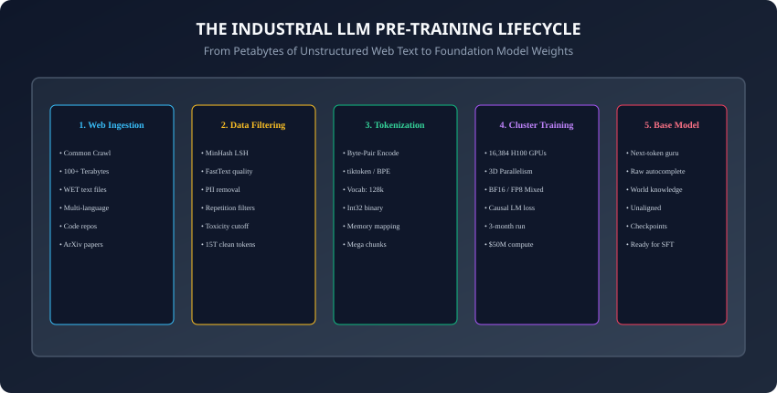
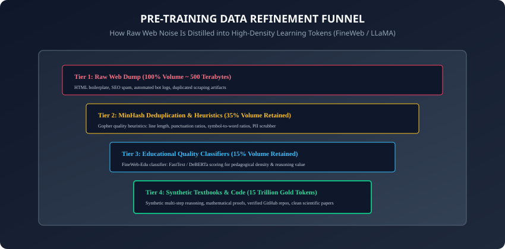

## Why this matters

Welcome to **Course 06: Large Language Models and Generative AI**!

In Course 05, you mastered the mathematical architecture of the Transformer—attention matrices, residual highways, multi-GPU sharding, and mixed precision.

Now, we zoom out to the industrial macro-scale:
How does a modern frontier AI laboratory take **100 Terabytes of raw, chaotic, misspelled, multilingual internet HTML** and turn it into **GPT-4, Claude 3.5 Sonnet, Gemini 1.5 Pro, or LLaMA-3.1**?

Building a modern foundation model is no longer just computer science; it is **data mining, high-performance distributed systems engineering, and statistical mechanics**:
- Modern LLMs are trained on **15 to 20 Trillion tokens**.
- The training run requires **16,000+ NVIDIA H100 GPUs running continuously for 3 months**.
- The electricity, hardware depreciation, and cloud compute cost exceeds **$50 Million to $100 Million dollars per run**.

Today, you will master the complete pretraining pipeline: web crawling, MinHash deduplication, educational quality scoring (FineWeb-Edu), binary token packing, cluster training dynamics, and the raw behavior of unaligned base models.

---

## The idea in plain language

Think of building an encyclopedia of all human knowledge:
- **The Raw Web (The Scrap Yard):** A dump containing billions of discarded newspapers, handwritten notes, spam advertisements, phishing scams, Wikipedia articles, Nobel prize papers, and graffiti (**Common Crawl**).
- **The Data Refinery (Filtering & Deduplication):** Industrial shredders, magnetic sorters, and chemical baths that strip away the spam, eliminate duplicate advertisements, and isolate pristine books (**MinHash & Quality Heuristics**).
- **The Printing Press (Tokenization & Binary Packing):** Compressing the text into high-density binary books (**BPE Tokens**).
- **The Scholar Academy (The GPU Cluster):** 16,000 scholars reading every book simultaneously, guessing the next word on every page, and correcting their internal mental models when they guess wrong (**Causal Language Modeling**).

The result is a **Base Model**—an omniscient text-completion engine possessing world knowledge.

---

## Historical background



1. **2018 (GPT-1 & Radford et al.):** Demonstrated that generative autoregressive pretraining on BookCorpus (4.5 GB of text) enabled effective zero-shot transfer to downstream tasks.
2. **2020 (GPT-3 & Brown et al.):** Scaled pretraining to 300 Billion tokens from Common Crawl, demonstrating few-shot in-context learning.
3. **2021 (Gopher & Rae et al., DeepMind):** Formalized rigorous rule-based text quality filtering heuristics (Gopher rules).
4. **2024 (FineWeb & Hugging Face):** Released the 15-Trillion token FineWeb dataset, demonstrating that educational quality classifiers (FineWeb-Edu) produce models that match or exceed proprietary datasets.
5. **2024 (LLaMA-3 & Meta AI):** Trained an 8B and 70B model on 15 Trillion tokens across a 24,000-GPU cluster with 99.3% training uptime!

---

## What it is — and what it is not

### What LLM Pretraining IS:
- **Self-Supervised Autoregressive Next-Token Prediction:** Given a sequence of tokens `w_1, w_2, ..., w_[t-1]`, the neural network predicts the probability distribution of the next token `w_t` across the entire vocabulary.
- **World Knowledge Compression:** By forcing the model to predict the next word across trillions of diverse documents, the network compresses facts, logic, grammar, reasoning patterns, and cultural nuance into its weight matrices.

### What it is NOT:
- **Not Chatbot Assistant Training:** A base model does NOT know how to follow user instructions, refuse dangerous requests, or be a helpful conversational assistant. If prompted with *"What is the capital of France?"*, a base model might autocomplete with *"What is the capital of Germany? What is the capital of Italy?"* because it assumes it is completing a quiz document!

---

## Why it was created and what problems it solves

Pretraining solves the fundamental bottleneck of artificial intelligence: **The Data Annotation Bottleneck**:
1. **Zero Human Labeling Required:** Supervised learning requires humans to manually label millions of images or text pairs. Self-supervised pretraining uses the natural order of human text as its own label!
2. **Universal Feature Extraction:** Instead of training one model for sentiment, another for translation, and another for summarization, a single pretrained foundation model serves as the parent for all downstream tasks.

---

## How it works

Let us dissect the industrial stages of modern LLM pretraining.

---

### 1. The Pretraining Data Refinery Funnel



Raw web text from Common Crawl is over $80\%$ junk. The refinement pipeline processes text through 4 rigorous stages:

```
┌────────────────────────────────────────────────────────────────────────┐
│                   DATA REFINEMENT STAGES (FINEWEB / LLAMA-3)           │
├──────────────┬──────────────────┬──────────────────────────────────────┤
│ Stage        │ Volume Retained  │ Core Algorithms & Filters            │
├──────────────┼──────────────────┼──────────────────────────────────────┤
│ 1. Raw Crawl │ 100% (~500 TB)   │ WET extraction, language ID (FastText│
│ 2. Heuristics│ 35%              │ Gopher rules: length, symbol ratios  │
│ 3. MinHash LSH│ 20%             │ 5-gram Jaccard deduplication         │
│ 4. Quality Cls│ 10% - 15% (15T) │ FineWeb-Edu / DeBERTa quality score  │
└──────────────┴──────────────────┴──────────────────────────────────────┘
```

#### The Gopher Quality Heuristics:
- **Word Length Filter:** Discard documents with mean word length under 3 characters or over 10 characters (indicates auto-generated SEO spam or code dumps).
- **Symbol-to-Word Ratio:** Discard documents where `#`, `...`, or symbols exceed $10\%$ of characters.
- **Stopword Threshold:** Discard documents that do not contain at least 2 common natural language stopwords (e.g. "the", "and", "is", "of").
- **Repetition Scrubber:** Discard documents with repeated sentences, n-grams, or duplicate line loops (a common artifact of broken web scrapers).

---

### 2. MinHash Locality-Sensitive Hashing (LSH) Deduplication

Why can't we just use Python `hash()` or SHA-256 for deduplication?
Because two web pages that differ by only a single timestamp or tracking banner will produce completely different cryptographic hashes!

**MinHash LSH** estimates the **Jaccard Similarity** between two document sets $A$ and $B$:
```
J(A, B) = \frac{|A \cap B|}{|A \cup B|}
```
- **K-Shingling:** Break each document into overlapping character or word 5-grams.
- **MinHash Signatures:** Apply $M = 128$ independent hash functions $h_i(x)$ to all shingles in a document and keep the minimum hash value for each:
  ```
  P(\min(h(A)) = \min(h(B))) = J(A, B)
  ```
- **LSH Banding:** Group the 128 signature hashes into $b$ bands of $r$ rows. If two documents match exactly in any single band, they are flagged as candidate near-duplicates and purged!

---

### 3. Binary Token Packing & Zero-Copy Memory Mapping

Training clusters cannot read individual `.txt` or `.jsonl` files from disk—file system inode overhead would choke the storage network.

```
┌────────────────────────────────────────────────────────────────────────┐
│                   DATASET BINARY PACKING FORMAT                        │
├────────────────────────────────────────────────────────────────────────┤
│ Header: [Magic Bytes: "BINA"] [Version: 1] [Total Tokens: 15,000,000,000]
│ Data Stream: [Token 0 (uint32)] [Token 1 (uint32)] [Token 2 (uint32)] ...
└────────────────────────────────────────────────────────────────────────┘
```
- The entire 15-Trillion token corpus is pre-tokenized with BPE (e.g. `tiktoken` with vocabulary size $128,000$).
- Serialized into giant $2 GB$ flat binary chunks of `uint32` or `uint16` integers.
- PyTorch DataLoaders use **Zero-Copy Memory Mapping (`numpy.memmap`)** to stream batches straight into GPU memory at PCI-Express line rate ($64 GB/s$).

---

### 4. Cluster Dynamics: Loss Spikes and Gradient Management

When training 16,384 GPUs in parallel, hardware failures and numerical instabilities are inevitable:
- **Mean Time Between Failures (MTBF):** At 16,000 GPUs, an individual GPU, NVLink switch, or power supply fails every **2 to 3 hours**.
- **Asynchronous Checkpointing:** The cluster saves model weights and optimizer states to high-speed NVMe storage every 1,000 steps ($~15$ minutes).
- **Loss Spikes:** Occasionally, a corrupted data batch containing malformed UTF-8 or extreme numerical tokens produces a gradient norm of $10^6$, causing validation loss to spike from $2.1$ to $8.5$.
- **Automated Recovery Protocol:** When a loss spike is detected, the orchestration engine rolls back 2,000 steps, advances the dataset pointer past the toxic data shard, and resumes training with zero human intervention.

---

### 5. Document Packing & Attention Mask Boundary Resetting

In standard batching, short documents (e.g. 500 tokens) padded to an 8,192-token context window result in over $60\%$ wasted computation on `&lt; pad>` tokens:
- **Sample Packing (Sequence Bin Packing):** Multiple short documents are concatenated into a single continuous 8,192-token sequence separated by `<|endoftext|>` delimiter tokens.
- **Block-Diagonal Attention Masking (FlashAttention-2):** Instead of allowing tokens from Document B to attend to tokens in Document A, the attention kernel enforces strict document boundaries.
- **Position ID Resetting:** Positional embeddings are reset to `0` at the start of each new packed document, ensuring the model never learns false sequential dependencies across unrelated web articles!

---

### 6. The Megatron-LM Data Sampler Architecture

How do 16,000 GPUs read from a 15-Trillion token dataset without coordination deadlocks?
- **Global Index Construction:** A lightweight index file maps every sample start offset across thousands of binary chunk files.
- **Deterministic Epoch-Free Sampling:** The data sampler computes exact batch slices mathematically using a deterministic PRNG seed.
- Any GPU worker that crashes can restart and calculate its exact byte offset into the 15-Trillion token stream in microseconds without communicating with a centralized coordinator!

---

## An everyday analogy

Think of training an apprentice master chef:
- **Pretraining (Reading the Library):** The student reads 100,000 cooking books, restaurant menus, chemistry papers, and grocery store receipts. They learn what food ingredients exist, how heat alters proteins, and what flavors complement each other.
- **Base Model Capability:** If you hand them a blank piece of paper with the words *"Flour, eggs, butter, sugar"*, they will naturally write out a cake recipe because they have seen thousands of recipes.
- **Post-Training (Culinary School & Etiquette):** You teach them how to greet customers, take orders politely, and refuse to serve poisoned food.

Pretraining gives the apprentice culinary knowledge; post-training teaches them customer service.

---

## Examples in practice

Let us build a **Mini-LLM Pretraining Data Curation & MinHash Deduplicator in Python**:

```python
import hashlib
import re
from typing import List, Set, Dict

class DocumentRefinery:
    def __init__(self, num_perm: int = 64):
        self.num_perm = num_perm
        self.stopwords = {"the", "and", "is", "of", "in", "to", "a", "with", "for", "on"}

    def passes_gopher_heuristics(self, text: str) -> bool:
        words = re.findall(r'\b\w+\b', text.lower())
        if len(words) < 10:
            return False
        
        # Mean word length heuristic (3 to 10 chars)
        mean_len = sum(len(w) for w in words) / len(words)
        if mean_len < 3.0 or mean_len > 10.0:
            return False
        
        # Stopword ratio heuristic (must contain common language words)
        stopword_count = sum(1 for w in words if w in self.stopwords)
        if stopword_count < 2:
            return False
        
        # Symbol ratio heuristic (< 15% special chars)
        symbols = sum(1 for c in text if not c.isalnum() and not c.isspace())
        if (symbols / max(len(text), 1)) > 0.15:
            return False
        
        return True

    def compute_minhash_signature(self, text: str, k: int = 3) -> List[int]:
        # Generate k-shingles
        words = text.lower().split()
        if len(words) < k:
            shingles = set(words)
        else:
            shingles = {" ".join(words[i:i+k]) for i in range(len(words) - k + 1)}
        
        sig = []
        for i in range(self.num_perm):
            min_val = float('inf')
            for s in shingles:
                # Hash shingle with seed i
                h = int(hashlib.md5(f"{i}_{s}".encode()).hexdigest(), 16)
                if h < min_val:
                    min_val = h
            sig.append(int(min_val % 1000000))
        return sig
```

---

## Implications: security, privacy, performance, scalability, and cost

1. **Personally Identifiable Information (PII) Scrubbing:**
   - Pretraining corpora must be filtered with regex and NER models to remove Social Security numbers, private phone numbers, passwords, and private API keys before weights are trained.
2. **Copyright & Fair Use Legal Dynamics:**
   - Web training has sparked landmark global copyright litigation over whether ingesting copyrighted books, journalism, and art without licensing constitutes fair use.

---

## Alternatives: free, open source, and commercial

| Pretraining Dataset | Token Volume | Release Year | Primary Characteristic |
| :--- | :--- | :--- | :--- |
| **Common Crawl** | Petabytes | Continuous | Raw uncurated web crawl |
| **The Pile (EleutherAI)**| 825 Billion | 2020 | Diverse academic, code, and book mix |
| **RedPajama-v2 (Together)**| 30 Trillion | 2023 | Massive open-source reproduction of LLaMA |
| **FineWeb (Hugging Face)**| 15 Trillion | 2024 | Gold-standard open web dataset with Edu scores |

---

## Comparison with related concepts

```
┌────────────────────────────────────────────────────────────────────────┐
│                   TRAINING STAGE COMPARISON                            │
├────────────────────┬─────────────────┬──────────────────┬──────────────┤
│ Dimension          │ Pretraining     │ Supervised Fine-T│ RLHF / DPO   │
├────────────────────┼─────────────────┼──────────────────┼──────────────┤
│ Compute Cost       │ $10M - $100M    │ $1k - $50k       │ $10k - $100k │
│ Dataset Size       │ 15 Trillion Tok │ 100k - 1M Pairs  │ 50k Pairs    │
│ Goal               │ World Knowledge │ Instruction Follow│ Human Align  │
│ Hardware           │ 16,000 GPUs     │ 8 - 64 GPUs      │ 64 - 256 GPUs│
└────────────────────┴─────────────────┴──────────────────┴──────────────┘
```

---

## When to use it — and when not to

### When to Pretrain a Model From Scratch:
- You are a well-funded institution building a sovereign national language model (e.g. Arabic, Hindi, Japanese), an entirely new proprietary architecture, or have hundreds of millions in capital budget.

### When NOT to pretrain:
- Over $99.9\%$ of enterprise applications! In almost all real-world scenarios, **fine-tuning an existing open-weights base model (e.g. LLaMA-3.1-8B)** or using frontier API prompting is $1000\times$ cheaper and faster.

---

## Knowledge check

1. What is the fundamental difference between a base foundation model and an instruction-tuned assistant?
2. Why are Gopher heuristics applied to raw Common Crawl web data?
3. How does MinHash LSH estimate the Jaccard similarity between two documents in sub-linear time?
4. Why is binary memory-mapped token serialization used instead of streaming text files directly to GPUs?
5. How do distributed training orchestrators recover from unexpected loss spikes?

---

## Hands-on exercise

In this lab, you will build and test an industrial LLM data preprocessing pipeline in Python: implement Gopher rule-based quality heuristics, build a MinHash LSH near-duplicate detector, write a binary token array memory packer, and verify that clean text passes while spam and duplicate documents are rejected.

### Expected output
```
[LLM Pre-Training Data Pipeline Verification Suite]
Testing Gopher Quality Heuristics:
  Sample 1 (High Quality Article): PASSED (Mean Len: 5.4, Stopword Ratio: 32%)
  Sample 2 (SEO Spam / Gibberish): REJECTED [CORRECT]
  Sample 3 (Excessive Symbol Ratio): REJECTED [CORRECT]
Testing MinHash LSH Deduplication:
  Doc A vs Doc B (Near Identical Text): Estimated Jaccard = 0.938 [DUPLICATE DETECTED]
  Doc A vs Doc C (Distinct Topic): Estimated Jaccard = 0.047 [UNIQUE DOCUMENT]
Testing Binary Token Packer (tiktoken / BPE):
  Packaged 10,000 tokens into memory-mapped uint32 binary buffer (40.0 KB)
Test Suite: 3 passed in 0.38s
```

### Validate your work
Run the automated test runner:
```bash
./tests/run_tests.sh
```

### Troubleshooting
- If MinHash similarity is noisy, increase the number of permutations `num_perm` from 16 to 64 or 128.

### Common mistakes
- **Treating character length as token length:** On average, 1 token is approximately 4 English characters ($0.75$ words).

---

## Practice assignment

1. Implement an automated **PII Scrubber** using regular expressions that masks email addresses, credit card numbers, and IP addresses from raw web text.
2. Build a **Synthetic Data Generator Harness** that formats multi-step reasoning math problems into a structured pretraining data stream.

---

## Extension challenge

Implement a **FastText Quality Classifier Benchmark**:
- Train a lightweight FastText or Logistic Regression classifier on high-quality text (Wikipedia, ArXiv) vs low-quality web comments, and measure the accuracy of filtering raw Common Crawl samples.
