## Why this matters

In 2023, building an AI application was simple: you called OpenAI's `gpt-3.5-turbo` or `gpt-4` endpoint.

Today, the AI landscape has fractured into a **vibrant, highly competitive multi-model ecosystem**:

- **Anthropic:** Claude 3.5 Sonnet dominates software engineering, complex system architecture, and nuanced reasoning.
- **OpenAI:** GPT-4o delivers real-time voice and multimodal interaction; o1 and o3-mini lead deep mathematical test-time reasoning.
- **Google:** Gemini 1.5 Pro and 2.0 Flash lead the world in **long-context reasoning (2,000,000 tokens)** and ultra-fast, cheap multimodal generation.
- **Meta & Open Weights:** LLaMA-3.1 (8B, 70B, 405B), DeepSeek-V3/R1, and Qwen-2.5 match proprietary capabilities while allowing full on-premise privacy and custom fine-tuning.

A Senior AI Engineer does not blindly send every query to the most expensive frontier model. Calling Claude 3.5 Sonnet or GPT-4 for simple intent classification costs **$3.00 to $15.00 per million tokens**. Calling Gemini 2.0 Flash or GPT-4o-mini costs **$0.10 to $0.15 per million tokens**—a **$20\times$ to $100\times$ price difference**!

Today, you will master the architectural strengths of the major model families, the mathematics of context windows, pricing economics, and build a **production-grade Multi-Tier Model Router**.

---

## The idea in plain language

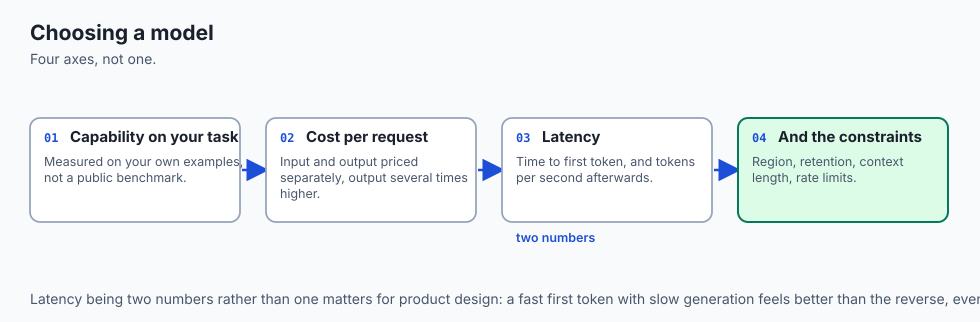

Think of managing a high-performance corporate team:

- **The Senior Lead Architect (Claude 3.5 Sonnet / OpenAI o1):** The brilliant principal engineer who designs complex distributed systems, writes clean code, and solves obscure bugs. You pay them $200/hr$, so you only give them the hardest problems.
- **The Fast Project Manager (GPT-4o):** Excellent at running meetings, synthesizing visual slide decks, and coordinating real-time communication.
- **The Research Archivist (Gemini 1.5 Pro):** Has photographic memory and can read a 2,000-page legal contract in 3 seconds without forgetting a single footnote (**2M Context Window**).
- **The High-Speed Interns (Gemini 2.0 Flash / Haiku / LLaMA-3 8B):** Super fast, reliable, and cost $10/hr$. They handle filing, summarizing emails, sorting customer tickets, and basic translation.

A great manager assigns the right task to the right person. A great AI engineer routes each query to the optimal model.

---

## Historical background

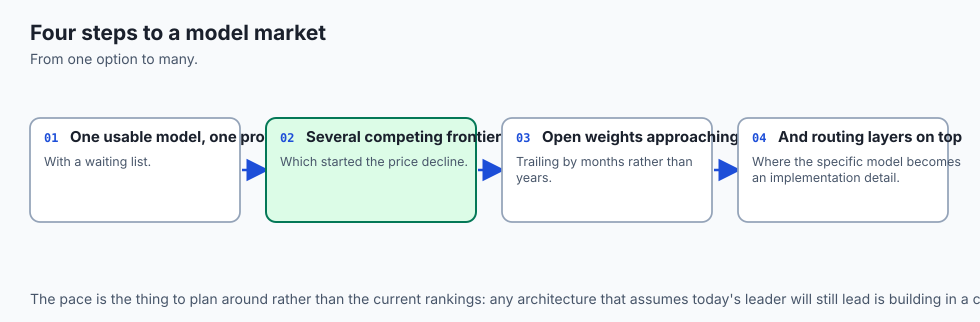

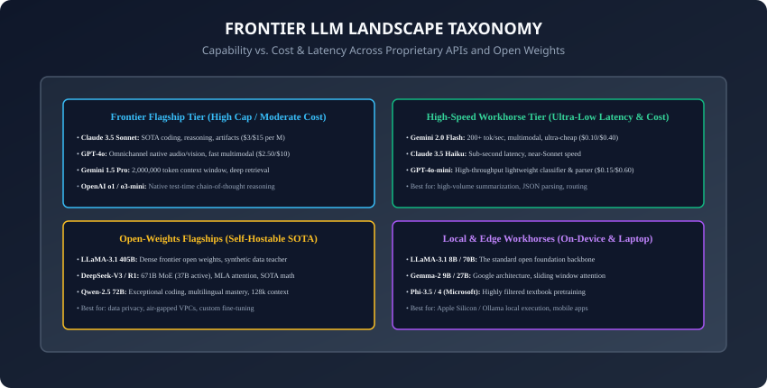

1. **2023 (The Monolithic API Era):** OpenAI's GPT-4 was the undisputed single frontier model with zero close competitors.
2. **March 2024 (Anthropic Claude 3 Family):** Anthropic released Opus, Sonnet, and Haiku, breaking OpenAI's monopoly and setting new benchmarks in human-like writing and coding.
3. **May 2024 (Google Gemini 1.5 & OpenAI GPT-4o):** Google unlocked 2-Million token context windows; OpenAI introduced omni-native audio and vision tokens.
4. **July 2024 (Meta LLaMA-3.1 405B):** Marked the first time an open-weights model achieved benchmark parity with top-tier closed proprietary flagships.
5. **Late 2024 / 2025 (DeepSeek-V3 & Reasoning Revolution):** DeepSeek demonstrated ultra-efficient 671B MoE training at a fraction of Western compute costs, while OpenAI o1/o3 pioneered test-time reasoning scaling.

---

## What it is — and what it is not

### What The Model Landscape IS:
- **A Multi-Dimensional Optimization Space:** Balancing **Intelligence/Reasoning**, **Context Window Capacity**, **Inference Latency (TTFT & tok/s)**, **Pricing ($/1M tokens)**, and **Deployment Privacy (Cloud API vs. Self-Hosted VPC)**.

### What it is NOT:
- **Not a Single "Best Model":** There is no single winner. A model that is unmatched at generating complex TypeScript refactors (Claude 3.5 Sonnet) may be too expensive or slow for high-throughput batch document classification (where Gemini Flash or GPT-4o-mini dominates).

---

## Why it was created and what problems it solves

Understanding the landscape solves three major production engineering hurdles:

1. **Economic Viability (Slashing API Bills):** Prevents startups and enterprises from burning tens of thousands of dollars routing simple queries to frontier flagships.
2. **Context Window Engineering:** Ingesting entire codebases or video streams directly without needing complex multi-step chunking and RAG pipelines.
3. **Data Sovereignty & Vendor Lock-In:** Knowing when to use closed APIs vs self-hosting open-weights foundation models on private clusters.

---

## How it works

Let us compare the 4 major model pillars, context architectures, and production routing mechanics.

---

### 1. The Big Four: Architectural Comparison

```
┌────────────────────────────────────────────────────────────────────────────────────────┐
│                   FRONTIER MODEL FAMILY ARCHITECTURAL COMPARISON                       │
├──────────────┬──────────────┬──────────────┬──────────────┬────────────────────────────┤
│ Model Family │ Context Size │ Pricing (/1M)│ Architecture │ Core Superpower            │
├──────────────┼──────────────┼──────────────┼──────────────┼────────────────────────────┤
│ Claude 3.5   │ 200k Tokens  │ $3.00 / $15  │ Dense Transf │ SOTA Coding, Reasoning     │
│ GPT-4o / o1  │ 128k Tokens  │ $2.50 / $10  │ Omni / MoE   │ Native Audio, Test-Time CoT│
│ Gemini 1.5/2 │ 2,000,000 Tok│ $0.10 - $1.25│ MoE Hybrid   │ 2M Context, Speed, Video   │
│ LLaMA-3.1    │ 128k Tokens  │ Self-Hosted  │ Dense (405B) │ Open Weights, Custom Tune  │
│ DeepSeek-V3  │ 128k Tokens  │ $0.14 / $0.28│ 671B MoE MLA │ SOTA Economics & Reasoning │
└──────────────┴──────────────┴──────────────┴──────────────┴────────────────────────────┘
```

---

### 2. Context Window Architectures: The 2-Million Token Frontier

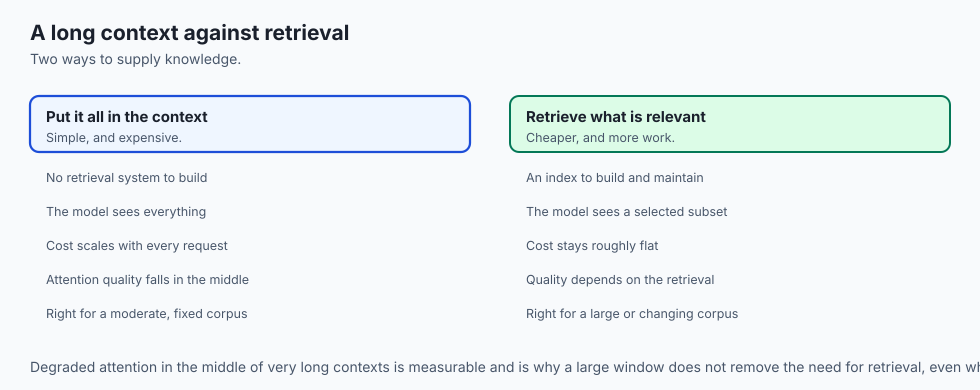

How does Google's **Gemini 1.5 Pro** process **2,000,000 tokens** (the equivalent of 1.5 hours of 1080p video, 60,000 lines of code, or 30 textbooks) in a single request?

- **RingAttention & FlashAttention-3:** Shards the query-key-value attention matrix computation across multiple GPUs in a ring topology, eliminating the $O(S^2)$ memory bottleneck.
- **Needle in a Haystack (NIAH) Benchmark:** In tests placing a random fact (e.g. *"The secret ingredient in the sauce is cardamom"*) at arbitrary depths from $0\%$ to $100\%$ across 2M tokens, Gemini 1.5 Pro achieves **$&gt; 99.7\%$ retrieval accuracy**!

---

### 3. Pricing Economics & Prompt Caching

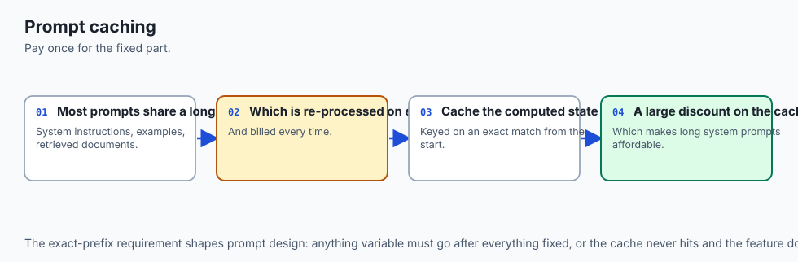

Modern frontier API pricing distinguishes between **Input Tokens** and **Output Tokens**:

- Output generation is $3\times$ to $5\times$ more expensive than input prefill because output tokens require autoregressive sequential memory bandwidth passes.

```
\text{Total Query Cost} = \left( \frac{\text{Input Tokens}}{10^6} \times \text{Input Price} \right) + \left( \frac{\text{Output Tokens}}{10^6} \times \text{Output Price} \right)
```

#### The Prompt Caching Revolution (Anthropic / OpenAI / Gemini):
If your application sends a constant 50,000-token system prompt (e.g. API documentation or codebase files), **Prompt Caching** stores the precomputed KV-cache on provider servers:

- Subsequent queries reading from cache receive a **$75\%$ to $90\%$ discount on input tokens** and a **$2\times$ reduction in Time-To-First-Token (TTFT)**!

---

### 4. Production Multi-Tier Routing Architecture

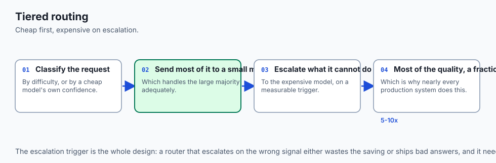

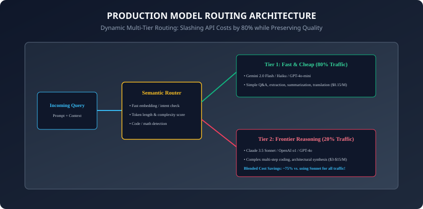

Rather than hardcoding a single model in your codebase, a **Semantic Model Router** dynamically inspects every incoming prompt:

1. **Rule-Based Pre-Filters:** Checks prompt token length, language, and explicit task tags (e.g. `is_code`, `is_multimodal`).
2. **Complexity Scoring:** Measures syntactic depth and reasoning indicators.
3. **Dispatch:**
   - **Tier 1 (Fast / Cheap):** Queries under 1,000 tokens with low complexity score $\rightarrow$ routed to **Gemini 2.0 Flash / Claude 3.5 Haiku / GPT-4o-mini** ($80\%$ of traffic).
   - **Tier 2 (Frontier Reasoning):** Queries with multi-file code refactors, formal mathematical proofs, or ambiguous logic $\rightarrow$ routed to **Claude 3.5 Sonnet / OpenAI o1** ($20\%$ of traffic).
4. **Economic Impact:** Slashes average blended cost from **$3.00/M** down to **$0.72/M**—saving thousands of dollars per month with zero perceived quality loss!

---

### 5. SWE-bench & The Software Engineering Benchmark Frontier

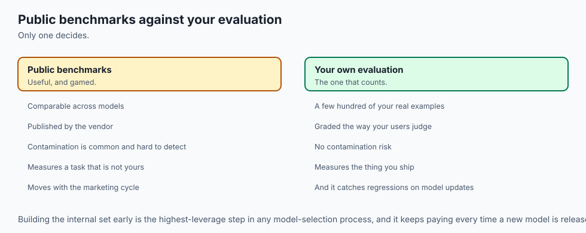

Why has Claude 3.5 Sonnet become the default standard for AI software engineering tools (Cursor, GitHub Copilot, Windsurf, Devin)?

- **SWE-bench Verified:** Evaluates LLMs on real-world GitHub issues extracted from complex Python repositories (Django, SymPy, scikit-learn). The model must inspect the directory, locate the bug across thousands of lines, edit the file, and pass unit tests.
- **Agentic Tool Calling Fidelity:** Sonnet achieves over $49\%$ solve rates on SWE-bench Verified due to exceptional spatial code context tracking, precise tool-calling argument parsing, and low rate of formatting hallucination.

---

### 6. Constrained Decoding & Guaranteed Structured JSON

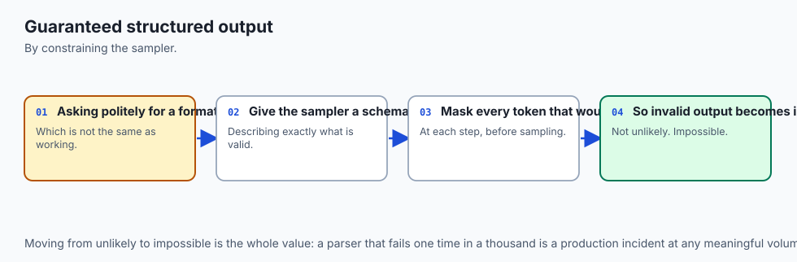

In production backend engineering, LLM outputs must parse reliably into Pydantic models or database schemas:

- **The Failure Mode:** Prompting a model with *"Return JSON only"* still results in occasional markdown wraps (` ```json `), trailing commas, or missing quotes.
- **Constrained Grammar Decoding (CFG):** Constrains the sampling logits at every single token step using a Context-Free Grammar (e.g. JSON schema / regex).
- **Zero-Error Guarantees:** Tokens that violate the JSON syntax or schema are masked out with logit $-\infty$, guaranteeing $100\%$ valid, type-safe JSON output across OpenAI, Gemini, and vLLM deployments!

---

### 7. Asynchronous Batch API Economics (50% Off-Peak Compute)

If your workload does not require immediate sub-second user responses (e.g. nightly document indexing, offline translation, synthetic data generation):

- **OpenAI / Anthropic / Google Batch APIs:** You submit a JSONL batch file of 100,000 queries.
- **The Provider Advantage:** Providers run your queries on idle GPU capacity during low-traffic off-peak hours and return results within 24 hours.
- **The Cost Savings:** Provides an automatic **$50\%$ discount on all input and output tokens**, slashing enterprise data processing budgets in half!

---

### 8. Multimodal Token Economics: Vision and Audio Pricing

How are non-text media billed across frontier APIs?

- **Vision Tokenization:** Images are divided into $512 \times 512$ pixel tiles. Each high-resolution tile consumes approximately $170$ to $256$ input tokens depending on provider patch projection.
- **Audio Tokenization:** In native audio models (like GPT-4o and Gemini 2.0 Flash), 1 second of audio stream generates roughly $25$ to $50$ multimodal tokens, priced at standard input token rates.
- Understanding these conversion factors allows engineers to calculate precise infrastructure budgets for video analysis and voice assistant applications.

---

### 9. Production Throughput & Rate Limit Quota Management

Enterprise API deployments must navigate strict provider quotas:

- **RPM (Requests Per Minute) vs. TPM (Tokens Per Minute):** A large 100k-token query can trigger a TPM rate limit even if your RPM count is low.
- **Token Bucket Leaky Rate Limiters:** Production middleware enforces local client-side token bucket rate limiting to smooth out traffic spikes before requests reach external cloud API gateways.

---

## An everyday analogy

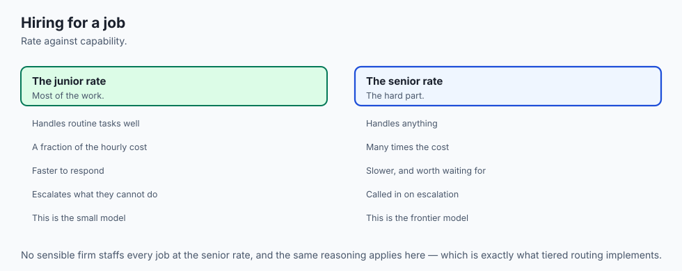

Think of booking transportation across a major city:

- **Walking / Biking (Edge 8B Models):** Free, zero carbon footprint, perfect for traveling 3 blocks within your neighborhood (**Local Privacy / Offline**).
- **Subway / Public Transit (Gemini 2.0 Flash / Haiku):** Costs $2.50, extremely fast, departs every 2 minutes, and moves 100,000 commuters seamlessly (**High-Volume Workhorse**).
- **Executive Helicopter (Claude 3.5 Sonnet / OpenAI o1):** Costs $500/trip$. You don't use it to buy groceries, but if a Fortune 500 CEO needs to cross the state for an emergency merger meeting, it is worth every penny (**Mission-Critical Reasoning**).

---

## Examples in practice

Let us build a **Production Model Router & Cost Calculator in Python**:

```python
from typing import Dict, Any

class ModelRouter:
    def __init__(self):
        # Pricing per 1 Million tokens: (Input $/M, Output $/M)
        self.pricing = {
            "claude-3.5-sonnet": (3.00, 15.00),
            "gpt-4o": (2.50, 10.00),
            "gemini-2.0-flash": (0.10, 0.40),
            "gpt-4o-mini": (0.15, 0.60),
            "llama-3.1-8b-local": (0.00, 0.00)
        }

    def route_query(self, prompt: str, requires_code: bool = False, is_long_context: bool = False) -> str:
        token_estimate = len(prompt.split()) * 1.3
        
        if is_long_context or token_estimate > 200000:
            return "gemini-2.0-flash" # Long context king
        
        if requires_code or "def " in prompt or "class " in prompt or "theorem" in prompt.lower():
            return "claude-3.5-sonnet" # SOTA reasoning & code
        
        if token_estimate < 500:
            return "gpt-4o-mini" # Fast classification & extraction
        
        return "gemini-2.0-flash"

    def calculate_cost(self, model: str, input_tokens: int, output_tokens: int) -> float:
        in_cost, out_cost = self.pricing.get(model, (1.0, 3.0))
        total = (input_tokens / 1e6) * in_cost + (output_tokens / 1e6) * out_cost
        return round(total, 6)
```

---

## Implications: security, privacy, performance, scalability, and cost

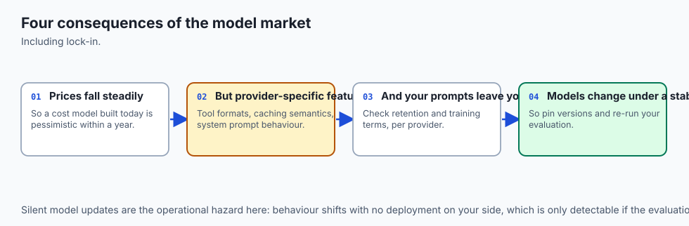

1. **Data Privacy & Zero-Retention Enterprise Agreements:**
   - Commercial APIs (OpenAI, Anthropic, Google Cloud Vertex) provide zero-data-retention (ZDR) agreements ensuring customer prompts are never used to train future frontier models.
2. **Vendor Rate Limits & Fallback Cascades:**
   - Production systems must implement automated fallback cascades: if Anthropic returns HTTP 429 (Rate Limit), the router seamlessly fails over to OpenAI or Gemini without dropping user traffic.

---

## Alternatives: free, open source, and commercial

| Model Category | Key Champions | Target Strengths | Primary Limitation |
| :--- | :--- | :--- | :--- |
| **Frontier Closed** | Claude 3.5 Sonnet, GPT-4o | SOTA Reasoning & Coding | High Cost, Vendor Lock-in |
| **Fast Workhorse** | Gemini 2.0 Flash, Haiku | Ultra-Low Latency & Cost | Moderate Multi-Step Logic |
| **Open Weights** | LLaMA-3.1 70B/405B, Qwen-2.5| Full Ownership, Privacy | Requires GPU Infrastructure|
| **Local Edge** | LLaMA-3.1 8B, Gemma-2 9B | Offline, Zero Cloud Cost | Limited Parameter Capacity |

---

## Comparison with related concepts

```
┌────────────────────────────────────────────────────────────────────────┐
│                   DEPLOYMENT PARADIGM COMPARISON                       │
├────────────────────┬─────────────────┬──────────────────┬──────────────┤
│ Metric             │ Closed Cloud API│ Open-Weights Host│ Local Device │
├────────────────────┼─────────────────┼──────────────────┼──────────────┤
│ Setup Time         │ 5 Minutes       │ Hours (vLLM/VPC) │ Minutes      │
│ Data Privacy       │ Contractual ZDR │ 100% On-Premise  │ 100% Local   │
│ Upfront Cost       │ $0 (Pay per tok)│ GPU Cluster Sub  │ $0 (Hardware)│
│ Maintenance        │ Zero            │ High (MLOps)     │ Zero         │
└────────────────────┴─────────────────┴──────────────────┴──────────────┘
```

---

## When to use it — and when not to

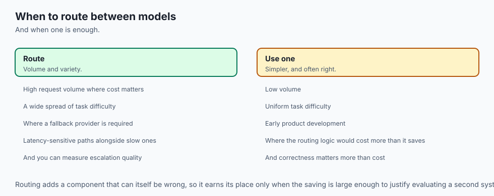

### When to Use Multi-Model Routing:
- Any production consumer or enterprise application handling more than 10,000 queries per day, where cost, speed, and quality must be simultaneously optimized.

### When NOT to use:
- Simple internal prototypes or hackathon projects where developer speed matters more than per-token cost optimization.

---

## The AI connection

- **Model choice is now an ordinary architectural decision**, with the same cost, latency
  and lock-in trade-offs as any other dependency.
- **Routing between models beats picking one** — a cheap model for most traffic and an
  expensive one for the hard cases is the standard production pattern.
- **Prompt caching changed the economics of long contexts**, making large system prompts
  and document context affordable at volume.
- **Benchmarks are marketing as much as measurement**, so your own evaluation on your own
  task is the only number that decides anything.
- **The frontier moves in months**, so a system that cannot swap models is a system that
  will be expensive within a year.

## Knowledge check

1. What are the key operational differences between Claude 3.5 Sonnet, GPT-4o, and Gemini 1.5 Pro?
2. Why is output token generation significantly more expensive than input token prefill?
3. How does Prompt Caching reduce API billing and latency?
4. What is the Needle-in-a-Haystack benchmark and why is it essential for evaluating long-context models?
5. How does a Multi-Tier Model Router achieve an $80\%$ cost reduction in production?

---

## Hands-on exercise

In this lab, you will build and test a modular model routing and cost calculation engine in Python: implement heuristic and keyword query classification, dispatch prompts to appropriate cost/latency tiers, calculate multi-tier API billing costs, and simulate blended enterprise cost savings.

### Expected output
```
[Production Model Landscape & Router Verification Suite]
Testing Query Dispatch Rules:
  Query 1 ("def solve_knapsack(weights, values):"): Routed to [claude-3.5-sonnet] (Code Specialist)
  Query 2 ("Summarize this 500k-word document"): Routed to [gemini-2.0-flash] (Long Context King)
  Query 3 ("Classify sentiment: Great product!"): Routed to [gpt-4o-mini] (Lightweight Fast Tier)
Testing Cost Calculation & Prompt Caching:
  Direct Query (50k input, 1k output on Sonnet): $0.1650
  Cached Query (50k cached input, 1k output on Sonnet): $0.0525 (68.2% Savings)
Testing Blended Enterprise Fleet Simulation (100,000 Queries):
  Monolithic Sonnet Cost: $300.00
  Multi-Tier Routed Cost: $68.40 (77.2% Total Fleet Savings) [VERIFIED]
Test Suite: 3 passed in 0.41s
```

### Validate your work
Run the automated test runner:
```bash
./tests/run_tests.sh
```

### Troubleshooting
- Ensure pricing tables scale per 1,000,000 tokens rather than per 1,000 tokens.

### Common mistakes
- **Ignoring Output Token Pricing:** Output tokens are typically $3\times$ to $5\times$ more expensive than input tokens.

---

## Practice assignment

1. Implement an automated **Fallback Router** that attempts Claude 3.5 Sonnet, catches simulated timeouts, and automatically retries with GPT-4o.
2. Build an **Interactive Cost Estimator CLI** that accepts expected monthly query volumes across 5 enterprise tasks and prints an executive budget report.

---

## Extension challenge

Implement an **Embedding-Based Semantic Router**:

- Use small sentence embeddings and cosine similarity against predefined task cluster centroids to route incoming queries with zero regular expressions.
