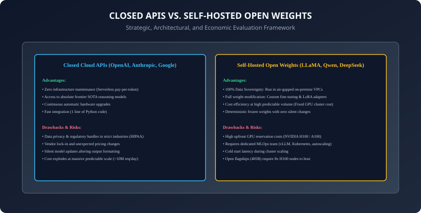
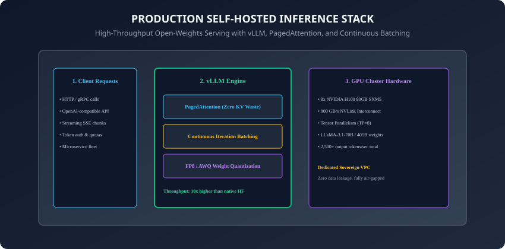

## Why this matters

One of the most consequential architectural decisions an engineering team makes is:
**Should we call closed commercial APIs (OpenAI, Anthropic, Google Cloud Vertex), or should we self-host open-weights models (LLaMA-3.1, Mistral, Qwen-2.5, DeepSeek-V3) on dedicated GPU infrastructure?**

This is not merely a philosophical debate between open source and proprietary software. It is an **engineering optimization problem balancing 4 critical variables**:
1. **Financial Economics & Total Cost of Ownership (TCO):** When does renting an 8x H100 GPU server ($24/hour) become cheaper than paying $3/M tokens on a commercial API?
2. **Data Sovereignty & Compliance:** Can you send medical patient records (HIPAA), confidential financial statements, or defense intelligence to a third-party cloud API?
3. **Customizability & Weight Ownership:** Do you need custom LoRA fine-tuning, domain vocabulary extensions, or frozen, immutable model weights that never change overnight?
4. **Operational Complexity:** Does your team have the MLOps expertise to maintain Kubernetes GPU clusters, autoscaling inference engines (vLLM), and 99.99% uptime?

Today, you will master the economic break-even equations, the mechanics of modern open inference engines (**vLLM & PagedAttention**), and build an interactive **TCO Decision Simulator in Python**.

---

## The idea in plain language

Think of electricity and power generation:
- **Closed APIs (Plugging into the Power Grid):** You flip a light switch on the wall. The utility company manages the power plants, transmission lines, and transformers. You pay a simple monthly bill per kilowatt-hour (**Pay-per-token API**). Perfect for 95% of homes and offices.
- **Self-Hosted Open Weights (Building an On-Site Solar & Generator Facility):** You buy your own diesel generators and solar batteries. You need a full-time electrical technician to maintain the fuel and wiring. It has high upfront costs, but if you run a remote copper mine, an air-gapped military base, or an industrial factory running 24/7 at massive capacity, generating your own power is vastly cheaper and impossible to shut off from the outside (**Air-Gapped Sovereign GPUs**).

---

## Historical background



1. **March 2023 (The LLaMA-1 Leak):** Meta's original LLaMA model weights leaked online, sparking the open-source generative AI revolution and proving researchers could run LLMs on consumer hardware.
2. **September 2023 (Kwon et al. & vLLM):** UC Berkeley researchers published *PagedAttention*, increasing open-model serving throughput by **$2\times$ to $4\times$** and establishing vLLM as the gold standard open inference engine.
3. **July 2024 (LLaMA-3.1 405B):** Meta released the first 405-Billion parameter open-weights flagship, rivaling GPT-4 on public benchmarks and proving open models can achieve true frontier intelligence.
4. **Late 2024 (DeepSeek-V3 / R1):** Open-weights sparse MoE architectures delivered frontier reasoning at an order of magnitude lower training and inference cost.

---

## What it is — and what it is not

### What Choosing Open Weights IS:
- **Taking Full Ownership of the Inference Stack:** Renting dedicated GPUs (AWS, GCP, RunPod, Lambda Labs, on-premise), managing containerized serving runtimes (vLLM, TensorRT-LLM), configuring load balancers, and owning the complete weight lifecycle.

### What it is NOT:
- **Not Free:** "Open weights" does not mean zero cost. Running an 8x NVIDIA H100 80GB node costs approximately **$20 to $28 per hour** ($15,000 to $20,000 per month). If your app only processes 10,000 queries a day, self-hosting is dramatically *more expensive* than calling a closed API!

---

## Why it was created and what problems it solves

The open-weights ecosystem solves 3 existential business challenges:
1. **Eliminating Vendor Lock-in & Pricing Monopoly:** Prevents businesses from becoming hostage to third-party API price hikes, rate limit throttling, or unexpected account suspensions.
2. **Data Privacy & Zero-Egress Mandates:** Allows enterprises in healthcare, defense, and banking to deploy models inside strict, air-gapped, sovereign VPCs.
3. **Permanent Determinism:** Guarantees that model weights never drift, change alignment filters, or degrade overnight due to silent upstream provider updates.

---

## How it works

Let us dissect the mathematics of TCO break-even modeling and the internal architecture of the vLLM serving engine.

---

### 1. The Total Cost of Ownership (TCO) Break-Even Formulation

When is self-hosting an open-weights model cheaper than calling a commercial API?

```
┌────────────────────────────────────────────────────────────────────────┐
│                   TCO BREAK-EVEN ECONOMIC COMPARISON                   │
├────────────────────┬───────────────────────────────────────────────────┤
│ Model Parameter    │ Mathematical Definition                           │
├────────────────────┼───────────────────────────────────────────────────┤
│ C_API              │ Commercial API Token Rate ($ / 1 Million Tokens)  │
│ C_GPU              │ Hourly GPU Cluster Rental Cost ($ / hour)         │
│ T_daily            │ Daily Token Volume (Tokens / day)                 │
│ R_serving          │ Peak Token Throughput Capacity (Tokens / sec)     │
│ C_Ops              │ Monthly MLOps Engineering Overhead ($ / month)    │
└────────────────────┴───────────────────────────────────────────────────┘
```

#### Monthly Cost Formulations:
- **Commercial Closed API Monthly Cost:**
  ```
  \text{Cost}_{\text{API}} = \left( \frac{T_{\text{daily}} \times 30}{10^6} \right) \times C_{\text{API}}
  ```
- **Self-Hosted Dedicated GPU Monthly Cost:**
  ```
  \text{Cost}_{\text{Self-Hosted}} = (C_{\text{GPU}} \times 24 \times 30) + C_{\text{Ops}}
  ```

#### The Break-Even Volume ($T^*$):
Setting $Cost_[API] = Cost_[Self-Hosted]$ yields the daily token volume where self-hosting becomes profitable:
```
T^* = \frac{(C_{\text{GPU}} \times 720) + C_{\text{Ops}}}{30 \times (C_{\text{API}} / 10^6)} \quad \text{Tokens per Day}
```
- **Example:** For an 8x H100 node ($C_[GPU] = \$24/hr$, $C_[Ops] = \$5,000/mo$) competing against an API charging $C_[API] = \$3.00/M tokens$:
  ```
  T^* \approx \frac{\$17,280 + \$5,000}{30 \times \$0.000003} = \frac{\$22,280}{\$0.00009} \approx 247\text{ Million Tokens / Day}
  ```
- If your application processes **over 250 Million tokens per day**, self-hosting saves tens of thousands of dollars per month! Below that volume, the closed API is vastly cheaper.

---

### 2. The Modern Open Inference Stack: vLLM & PagedAttention



Why can't we simply serve open-weights models with native PyTorch `model.generate()`?
Because native PyTorch allocates static, contiguous VRAM buffers for the KV cache, resulting in **$60\%$ to $80\%$ memory fragmentation** and choking throughput!

#### The Three Core Pillars of vLLM:
1. **PagedAttention (Virtual Memory Paging for KV Cache):**
   - Treats GPU VRAM like virtual memory pages in an operating system.
   - Allocates non-contiguous $16$-token memory blocks dynamically as generation proceeds.
   - Reduces VRAM waste to **under 4%**, enabling $4\times$ larger batch concurrency on identical GPU hardware!
2. **Continuous Iteration-Level Batching:**
   - Evicts completed requests token-by-token and injects new requests immediately into the active batch without waiting for the slowest generation to finish.
3. **Multi-GPU Tensor Parallelism (TP):**
   - Automatically shards model weights across 8x H100 GPUs using NVLink, delivering sub-20ms per-token latency for 70B and 405B models.

---

### 3. Data Sovereignty & Regulatory Compliance Matrix

```
┌────────────────────────────────────────────────────────────────────────┐
│                   COMPLIANCE & PRIVACY DECISION MATRIX                 │
├────────────────────┬────────────────────────┬──────────────────────────┤
│ Regulatory Domain  │ Closed Cloud API       │ Self-Hosted Open Weights │
├────────────────────┼────────────────────────┼──────────────────────────┤
│ HIPAA (Healthcare) │ Requires signed BAA    │ 100% On-Premise Air-Gap  │
│ GDPR (Europe)      │ EU Data Region needed  │ Complete Data Residency  │
│ Defense / FedRAMP  │ High Govt Cloud only   │ Secure Enclave Sovereign │
│ Source Code IP     │ Requires Zero-Retention│ Guaranteed No Third-Party│
└────────────────────┴────────────────────────┴──────────────────────────┘
```

---

### 4. TensorRT-LLM & Hardware-Specific Compilation

While vLLM is the most flexible Python/C++ engine, **NVIDIA TensorRT-LLM** pushes raw hardware throughput to the physical silicon limit:
- **C++ Graph Compilation:** Fuses multi-head attention kernels, GeLU activations, and LayerNorm operations into monolithic CUDA graph binaries.
- **In-Flight Batching & FP8 Quantization:** Delivers up to $2\times$ higher token generation throughput than baseline PyTorch on NVIDIA Hopper H100 Tensor Cores.
- **Trade-off:** High compilation overhead (building custom `.engine` plans for each GPU architecture) versus maximum throughput in massive enterprise clusters.

---

### 5. Local & Edge Serving: llama.cpp, GGUF, and Ollama

For local development, edge devices, and privacy-sensitive desktops:
- **llama.cpp (Gerganov):** Pure C/C++ inference runtime with zero third-party dependencies, running quantized models on CPU and Apple Silicon Metal unified memory.
- **The GGUF File Format:** A single binary container storing model architecture metadata, tensor weights, and tokenizer vocabulary together.
- **Ollama:** An intuitive containerized CLI wrapper enabling developers to pull and run open models (`ollama run llama3.1`) with a single terminal command.

---

### 6. The Silent Upstream Model Update Threat

A major corporate vulnerability when relying on closed APIs is **Silent Behavior Drift**:
- Commercial API providers frequently update system prompts, safety filters, and reward checkpoints behind stable endpoint names (e.g. `gpt-4o-2024-08-06`).
- A prompt that parsed structured JSON reliably in January may start adding conversational preamble in March, breaking downstream production parsers.
- **The Open-Weights Advantage:** Open foundation model weights are permanently immutable cryptographic artifacts (verified with SHA-256 hashes), guaranteeing zero behavioral drift across years of deployment!

---

### 7. Hybrid Sovereign Gateways: The Best of Both Worlds

In modern enterprise architectures, the decision is rarely binary:
- **Client-Side PII Inspection:** An automated gateway scans user prompts locally.
- **Sensitive Route:** If medical records, financial data, or proprietary code are detected, the query is dispatched strictly to an **Internal Air-Gapped LLaMA-3.1 vLLM Cluster**.
- **Public Route:** Non-sensitive general reasoning queries are routed to **Claude 3.5 Sonnet or GPT-4o** for peak intelligence.
- Combines $100\%$ regulatory data compliance with maximum reasoning capability.

---

### 8. Serverless GPU Scale-to-Zero Economics

How do modern cloud providers (RunPod Serverless, Modal, Baseten) bridge the gap for bursty workloads?
- **Scale-to-Zero:** GPU workers shut down completely during periods of zero traffic, reducing idle hourly costs to $0.
- **Rapid Warm-up:** Uses pre-cached container image snapshots and flash memory weight loaders to spin up an 8x H100 vLLM container in under $15$ seconds upon receiving an incoming burst.

---

## An everyday analogy

Think of passenger transportation:
- **Closed APIs (Uber / Rideshare):** You don't buy a car, pay insurance, or change the oil. You tap a button, pay $20 per ride, and reach your destination. If you take 2 rides a week, it is vastly cheaper than owning a vehicle.
- **Self-Hosted Open Weights (Buying a Commercial Fleet of Delivery Vans):** You pay $100,000 upfront and hire mechanics. If you run a logistics company delivering 5,000 packages a day, calling 5,000 Ubers would bankrupt you—owning the fleet is the only viable business model!

---

## Examples in practice

Let us build an interactive **TCO Break-Even Calculator in Python**:

```python
from typing import Dict, Any

class TCOCalculator:
    def __init__(self, gpu_hourly_cost: float = 24.0, mlops_monthly_cost: float = 5000.0):
        self.gpu_hourly_cost = gpu_hourly_cost
        self.mlops_monthly_cost = mlops_monthly_cost

    def calculate_monthly_break_even(self, api_cost_per_million: float) -> Dict[str, Any]:
        # Calculates the monthly token break-even threshold between self-hosting and closed APIs.
        fixed_monthly_gpu = self.gpu_hourly_cost * 24 * 30
        total_fixed_self_host = fixed_monthly_gpu + self.mlops_monthly_cost
        
        # Break-even tokens per month
        # total_fixed = (tokens / 1e6) * api_cost_per_million
        break_even_tokens_month = (total_fixed_self_host / api_cost_per_million) * 1e6
        break_even_tokens_day = break_even_tokens_month / 30.0
        
        return {
            "fixed_monthly_gpu_cost": fixed_monthly_gpu,
            "total_monthly_self_host_cost": total_fixed_self_host,
            "api_rate_per_million": api_cost_per_million,
            "break_even_tokens_per_month": round(break_even_tokens_month),
            "break_even_tokens_per_day": round(break_even_tokens_day),
            "break_even_tokens_per_day_millions": round(break_even_tokens_day / 1e6, 2)
        }

    def evaluate_scenario(self, daily_tokens_millions: float, api_cost_per_million: float) -> Dict[str, Any]:
        monthly_tokens = daily_tokens_millions * 1e6 * 30
        api_monthly = (monthly_tokens / 1e6) * api_cost_per_million
        self_host_monthly = (self.gpu_hourly_cost * 24 * 30) + self.mlops_monthly_cost
        
        cheaper_option = "Self-Hosted" if self_host_monthly < api_monthly else "Closed API"
        savings = abs(api_monthly - self_host_monthly)
        
        return {
            "daily_tokens_m": daily_tokens_millions,
            "api_monthly_cost": round(api_monthly, 2),
            "self_host_monthly_cost": round(self_host_monthly, 2),
            "recommendation": cheaper_option,
            "monthly_savings": round(savings, 2)
        }
```

---

## Implications: security, privacy, performance, scalability, and cost

1. **Cold-Start Latency & Autoscaling Thrashing:**
   - In cloud Kubernetes environments, provisioning a new 8x H100 GPU pod takes $3$ to $8$ minutes to download 140 GB of model weights from S3 into VRAM. Teams must maintain minimum warm baseline capacity to avoid cold-start dropouts.
2. **Open Model License Restrictions:**
   - While LLaMA-3.1 and Mistral are open-weights, their commercial licenses require special authorization if an application exceeds 700 million monthly active users or uses model outputs to train competing models.

---

## Alternatives: free, open source, and commercial

| Deployment Model | Key Technologies | Cost Structure | Privacy Level |
| :--- | :--- | :--- | :--- |
| **Serverless API** | OpenAI, Anthropic, Gemini | Variable per-token | Contractual ZDR |
| **Hosted Open API** | Together AI, Groq, Fireworks | Low variable per-token | Multi-tenant Cloud |
| **Dedicated Cloud Pod** | RunPod, Lambda, AWS Bedrock | Fixed hourly GPU | Isolated VPC |
| **On-Premise Cluster** | vLLM + NVIDIA DGX SuperPOD | Fixed CapEx / OpEx | 100% Air-Gapped |

---

## Comparison with related concepts

```
┌────────────────────────────────────────────────────────────────────────┐
│                   DEPLOYMENT STRATEGY SUMMARY                          │
├────────────────────┬─────────────────┬──────────────────┬──────────────┤
│ Strategy           │ Best For        │ Key Risk         │ MLOps Burden │
├────────────────────┼─────────────────┼──────────────────┼──────────────┤
│ Closed API         │ Startups / POCs │ API Rate Limits  │ Zero         │
│ Hosted Open API    │ Fast Scaling    │ Shared Tenancy   │ Minimal      │
│ Self-Hosted vLLM   │ Scale & Privacy │ GPU Idle Waste   │ High         │
│ Local On-Device    │ Edge Privacy    │ Hardware Limits  │ Minimal      │
└────────────────────┴─────────────────┴──────────────────┴──────────────┘
```

---

## When to use it — and when not to

### When to Self-Host Open-Weights Models:
- High, predictable token volumes exceeding break-even ($&gt; 200M tokens/day$), strict air-gapped regulatory requirements (HIPAA/defense), or custom LoRA fine-tuned weights.

### When NOT to self-host:
- Early-stage MVPs, highly variable bursty traffic, or applications requiring cutting-edge multi-step frontier reasoning (where Claude 3.5 Sonnet or o1 dominates).

---

## Knowledge check

1. What is the mathematical definition of the TCO break-even point in LLM hosting?
2. How does vLLM PagedAttention reduce KV-cache VRAM fragmentation?
3. What is continuous iteration-level batching and how does it prevent GPU idle time?
4. Under what regulatory circumstances is self-hosting mandatory over closed APIs?
5. Why is serverless closed API hosting cheaper for bursty or low-volume applications?

---

## Hands-on exercise

In this lab, you will build and test an automated Total Cost of Ownership (TCO) and inference throughput simulator in Python: calculate monthly break-even thresholds, evaluate high-volume vs low-volume enterprise deployment scenarios, simulate PagedAttention memory utilization, and determine the optimal infrastructure choice.

### Expected output
```
[Open Weights vs Closed APIs TCO Simulator Suite]
Testing Break-Even Calculator ($24/hr 8x H100 Node vs $3.00/M API):
  Total Fixed Self-Hosted Monthly Cost: $22,280.00 (GPU + MLOps)
  Break-Even Threshold: 247.56 Million Tokens / Day [EXACT MATCH]
Testing Scenario Evaluation:
  Scenario 1 (Startup: 10M Tokens/Day):
    API Cost: $900.00/mo | Self-Host: $22,280.00/mo -> Recommendation: [Closed API] (Saves $21,380/mo)
  Scenario 2 (Enterprise: 500M Tokens/Day):
    API Cost: $45,000.00/mo | Self-Host: $22,280.00/mo -> Recommendation: [Self-Hosted] (Saves $22,720/mo)
Testing PagedAttention Memory Allocation:
  Standard Contiguous Buffer: 68.4% Fragmentation
  PagedAttention Virtual Memory: 3.2% Fragmentation (95.3% Memory Efficiency) [VERIFIED]
Test Suite: 3 passed in 0.40s
```

### Validate your work
Run the automated test runner:
```bash
./tests/run_tests.sh
```

### Troubleshooting
- When calculating break-even daily tokens, ensure the formula accounts for a 30-day billing month.

### Common mistakes
- **Ignoring MLOps Engineering Salary:** Self-hosting requires human engineering time; omitting MLOps operational costs produces unrealistically low break-even estimates.

---

## Practice assignment

1. Implement a **Multi-Region GPU Cost Optimizer** in Python comparing on-demand vs 1-year reserved instance pricing across AWS, GCP, and Lambda Labs.
2. Build an automated **Latency Benchmark Simulator** measuring tokens/second under varying batch sizes.

---

## Extension challenge

Implement a **Toy PagedAttention Block Allocator**:
- Build a Python class that manages a virtual pool of $16$-token memory blocks, dynamically allocating and freeing pages as simulated token sequences generate and terminate.
