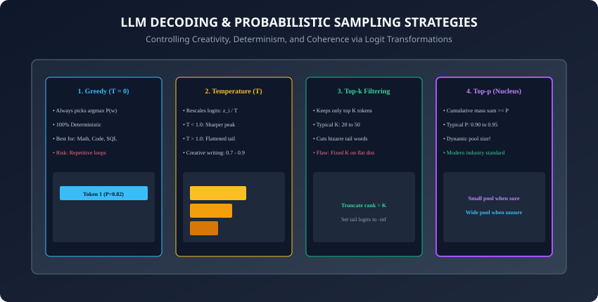

## Why this matters

When an LLM outputs text on your screen, it is not generating complete sentences in a single flash of computation.

It is running a tight, highly optimized, sequential mathematical loop:
1. It ingests the prompt tokens.
2. It projects queries, keys, and values through 80 Transformer layers.
3. It stores Key and Value tensors in GPU VRAM (**The KV Cache**).
4. It computes a probability distribution across $128,000$ possible vocabulary tokens.
5. It applies mathematical logit transformations (**Temperature, Top-$k$, Top-$p$, Repetition Penalties**).
6. It samples **exactly 1 token**.
7. It appends that token to the context and repeats the loop!

Understanding this generation cycle is the difference between an amateur who wonders why their model generates repetitive gibberish, and a Senior AI Engineer who can **tune sampling hyperparameters for deterministic code extraction ($T=0$), optimize KV-cache memory allocation, and prevent degenerative token loops**.

Today, you will master the mathematics of probabilistic sampling, calculate exact KV-cache VRAM consumption, and build a **complete customizable sampling engine in PyTorch**.

---

## The idea in plain language

Think of an author improvising a story in front of a live audience:
- **The Context Window & Memory (The KV Cache):** A whiteboard behind the author recording every character, plot point, and spoken dialogue from the beginning of the book. If the whiteboard runs out of space (**Context Limit**), the author suffers amnesia and forgets earlier plotlines.
- **Greedy Decoding ($T=0$):** The author always picks the single most statistically predictable word. Highly reliable for a math proof, but boring and robotic for creative fiction.
- **High Temperature ($T=1.5$):** The author drinks 4 shots of espresso. They pick wild, unexpected, bizarre adjectives and metaphors (**High Entropy**).
- **Top-$p$ Nucleus Sampling:** The author considers only words that make coherent sense ($90\%$ cumulative probability mass). If the next word is obvious (e.g. *"The Eiffel..."*), they only consider *"Tower"*. If the plot is at a crossroads, they consider a dozen creative paths!

---

## Historical background



1. **Early NLP (Beam Search & Greedy):** Machine translation relied on Beam Search, which seeks the globally optimal joint sequence probability. However, when applied to open-ended text generation, beam search caused models to fall into repetitive loops (*"I don't know, I don't know, I don't know..."*).
2. **2019 (Holtzman et al. & Nucleus Sampling):** Published *The Curious Case of Neural Text De-generation*, proving that human text does not follow maximum probability paths. They introduced **Top-$p$ (Nucleus) sampling**, revolutionizing natural language generation.
3. **2022 (FlashAttention & Dao et al.):** Optimized attention memory traffic, laying the hardware foundation for multi-thousand token KV caching.
4. **2024 (Min-P Sampling & Grouped-Query Attention):** Community researchers introduced Min-P sampling as an adaptive alternative to Top-$p$, while foundation models adopted Grouped-Query Attention (GQA) to slash KV-cache sizes by $8\times$.

---

## What it is — and what it is not

### What LLM Sampling IS:
- **Controlled Stochastic Selection:** Transforming raw logit outputs $z \in R^[V]$ into a filtered, normalized probability distribution from which candidate tokens are drawn.

### What it is NOT:
- **Not Pure Randomness:** Sampling is strictly constrained by the model's learned probability manifold. Setting temperature to $0.7$ does not produce random dictionary words; it samples from the model's top plausible continuations.

---

## Why it was created and what problems it solves

Decoding strategies solve critical generation failure modes:
1. **Degenerative Repetition Loops:** Prevents models from repeating the same sentence indefinitely when stuck in high-probability loops.
2. **Hallucination Suppression in Deterministic Tasks:** Ensures code, JSON, and math extraction select the exact optimal tokens without stochastic noise ($T=0$).
3. **VRAM Exhaustion Management:** Allows infrastructure engineers to budget precise GPU memory for concurrent user sessions based on sequence length.

---

## How it works

Let us dissect the mathematical formulation of probabilistic sampling, repetition penalties, and KV-cache scaling.

---

### 1. The Probabilistic Sampling Pipeline

Given raw output logits $z = [z_1, z_2, ..., z_V]$ from the final Linear classification head over vocabulary $V$:

```
┌────────────────────────────────────────────────────────────────────────┐
│                   LLM LOGIT TRANSFORMATION PIPELINE                   │
├────────────────────────────────────────────────────────────────────────┤
│ 1. Raw Logits: z_i                                                     │
│ 2. Repetition Penalties: z_i = z_i - (freq * f_pen) - (pres * p_pen)   │
│ 3. Temperature Scaling: z_i' = z_i / T                                 │
│ 4. Top-k Truncation: keep top K logits; set rest to -infinity          │
│ 5. Top-p (Nucleus) Masking: keep cumulative mass sum >= P              │
│ 6. Min-P Truncation: discard tokens where P_i < min_p * P_max          │
│ 7. Softmax Normalization: P_i = exp(z_i') / sum(exp(z_j'))             │
│ 8. Categorical Draw: sample token w ~ Categorical(P)                   │
└────────────────────────────────────────────────────────────────────────┘
```

#### Mathematical Formulas:
- **Temperature Scaling ($T &gt; 0$):**
  ```
  P(w_i) = \frac{\exp(z_i / T)}{\sum_{j=1}^V \exp(z_j / T)}
  ```
  - As $T \to 0$: $P(w_[max]) \to 1.0$ (Greedy argmax).
  - As $T \to \infty$: $P(w_i) \to 1/V$ (Uniform random noise).
- **Top-$p$ (Nucleus) Condition:** Find the smallest index set $S \subset \(1, ..., V\)$ such that:
  ```
  \sum_{i \in S} P(w_i) \ge p \quad \text{and} \quad \forall i \in S, j \notin S: P(w_i) \ge P(w_j)
  ```
- **Frequency & Presence Penalties (OpenAI formulation):**
  ```
  z_i^{\text{penalized}} = z_i - (c_i \times \text{penalty}_{\text{freq}}) - (\mathbb{I}(c_i > 0) \times \text{penalty}_{\text{pres}})
  ```
  Where $c_i$ is the count of how many times token $i$ has already appeared in the output sequence.

---

### 2. KV Cache Mechanics & Memory Footprint


During self-attention at layer $l$, token $t$ must attend to all previous tokens $1, ..., t-1$.
Instead of recomputing key and value vectors $K_(1:t-1)$ and $V_(1:t-1)$ on every generation step, they are cached in GPU VRAM!

#### The KV Cache VRAM Equation:
For a model with $L$ layers, $H_[KV]$ key-value attention heads, head dimension $D$, batch size $B$, and sequence length $S$, using FP16/BF16 ($2 bytes per element$):

```
\text{KV Cache Size (Bytes)} = 2 \times B \times S \times L \times (H_{KV} \times D) \times 2\text{ bytes}
```
*(The leading factor of 2 accounts for both Keys and Values).*

#### Concrete Example: LLaMA-3-70B (Grouped-Query Attention)
- Layers $L = 80$, $H_[KV] = 8$ heads, $D = 128$, Precision = 2 bytes (BF16):
- **Per-Token KV Footprint:**
  ```
  \text{KV per token} = 2 \times 80 \times (8 \times 128) \times 2 = 327,680\text{ bytes} \approx 320\text{ KB per token}
  ```
- **For an 8,192 Context Sequence (Batch = 1):**
  ```
  320\text{ KB} \times 8,192 = 2.62\text{ GB of VRAM per active request!}
  ```
- **For Batch Size = 32 at 8k Context:** The KV cache alone consumes **$83.8 GB of GPU VRAM$**—exceeding the memory of an entire NVIDIA A100 GPU!

---

### 3. Prefill vs. Generation: The Hardware Chasm

```
┌────────────────────────────────────────────────────────────────────────┐
│                   PREFILL VS. DECODING COMPARISON                      │
├────────────────────┬────────────────────────┬──────────────────────────┤
│ Attribute          │ Prompt Prefill Phase   │ Token Decoding Phase     │
├────────────────────┼────────────────────────┼──────────────────────────┤
│ Operation          │ GEMM (Matrix-Matrix)   │ GEMV (Matrix-Vector)     │
│ Input Size         │ All Prompt Tokens (N)  │ Exactly 1 Token          │
│ Hardware Bottleneck│ Compute-Bound (TFLOPS) │ Memory-Bandwidth (HBM)   │
│ Arithmetic Intens. │ High (> 100 FLOP/byte) │ Very Low (~1 FLOP/byte)  │
│ Hardware Saturation│ > 65% Tensor Core MFU  │ < 5% Tensor Core MFU     │
└────────────────────┴────────────────────────┴──────────────────────────┘
```

---

### 4. Speculative Decoding: Beating the Memory-Bandwidth Wall

Because autoregressive decoding is memory-bandwidth bound ($1$ token per forward pass), how can we accelerate generation without modifying the target model weights?
- **The Speculative Protocol (Leviathan et al., 2023):**
  1. A small, fast "draft model" (e.g. LLaMA-3-8B) speculatively generates $K = 5$ tokens autoregressively.
  2. The massive "target model" (e.g. LLaMA-3-70B) evaluates all $5$ candidate tokens simultaneously in **a single parallel forward pass (GEMM)**!
  3. The target model verifies each token using **Rejection Sampling**:
     ```
     \alpha = \min\left(1, \frac{P_{\text{target}}(x_{t+k})}{P_{\text{draft}}(x_{t+k})}\right)
     ```
  4. If a token is rejected, generation branches and continues from the target model's corrected token.
- **Speedup:** Achieves **$2\times$ to $3\times$ lower latency** with **zero degradation in output distribution**!

---

### 5. Grouped-Query Attention (GQA) & KV-Cache Compression

In standard Multi-Head Attention (MHA), every query head has its own Key and Value head ($H_Q = H_K = H_V = 64$).
- **The GQA Innovation (Ainslie et al., 2023):** Multiple query heads share a single Key and Value head ($H_Q = 64, H_[KV] = 8$).
- **The Impact:** Slashes the KV-cache memory footprint by an exact factor of **$8\times$**, enabling massive context lengths (128k tokens) on commodity GPU memory with less than $0.5\%$ loss in benchmark accuracy!

---

### 6. Tokenizer Mechanics & Language Fertility Ratios

Why does tokenization quality determine latency, cost, and cross-lingual performance?
- **Byte Pair Encoding (BPE):** Merges frequent subword byte sequences into vocabulary tokens (vocabulary sizes typically $128k$ in modern models).
- **The Fertility Ratio:** The average number of tokens generated per word.
  - In English, 1,000 words $\approx 1,300$ tokens (fertility $\approx 1.3$).
  - In non-Latin scripts (Hindi, Arabic, Thai) with legacy tokenizers, 1,000 words could generate $3,500+$ tokens (fertility $&gt; 3.5$), resulting in $3\times$ higher latency and cost! Modern expanded vocabularies ($128k$ in LLaMA-3) achieved cross-lingual token parity.

---

## An everyday analogy

Think of a chef cooking a 10-course banquet:
- **Prompt Prefill Phase (The Prep Kitchen):** Chopping 50 pounds of vegetables, preparing broths, and marinating meats all at once with full staff efficiency (**High Parallelism / Compute Bound**).
- **Token Decoding Phase (Plating Courses One by One):** Delivering Course 1, waiting for the guest to take a bite, carrying the plate back, delivering Course 2... No matter how fast the chef is, they must walk back and forth for every single forkful (**Memory-Bandwidth Bound / Latency Bound**).

---

## Examples in practice

Let us build a **Complete PyTorch Probabilistic Sampling Engine**:

```python
import torch
import torch.nn.functional as F
from typing import Optional, List

class LLMSampler:
    def __init__(self, temperature: float = 0.7, top_k: int = 50, top_p: float = 0.9,
                 min_p: float = 0.0, freq_penalty: float = 0.0, pres_penalty: float = 0.0):
        self.temperature = max(temperature, 1e-5)
        self.top_k = top_k
        self.top_p = top_p
        self.min_p = min_p
        self.freq_penalty = freq_penalty
        self.pres_penalty = pres_penalty

    def sample_next_token(self, logits: torch.Tensor, generated_tokens: Optional[List[int]] = None) -> int:
        logits = logits.clone().float()

        # 1. Apply Repetition Penalties
        if generated_tokens and (self.freq_penalty > 0 or self.pres_penalty > 0):
            counts = torch.bincount(torch.tensor(generated_tokens), minlength=logits.shape[-1])
            logits = logits - (counts * self.freq_penalty) - ((counts > 0).float() * self.pres_penalty)

        # 2. Temperature Scaling
        logits = logits / self.temperature

        # 3. Top-k Filtering
        if self.top_k > 0:
            topk_vals, _ = torch.topk(logits, min(self.top_k, logits.shape[-1]))
            min_topk = topk_vals[-1]
            logits[logits < min_topk] = -float('inf')

        # 4. Top-p (Nucleus) Filtering
        if 0.0 < self.top_p < 1.0:
            sorted_logits, sorted_indices = torch.sort(logits, descending=True)
            cumulative_probs = torch.cumsum(F.softmax(sorted_logits, dim=-1), dim=-1)
            
            # Remove tokens with cumulative probability above top_p threshold
            sorted_indices_to_remove = cumulative_probs > self.top_p
            sorted_indices_to_remove[1:] = sorted_indices_to_remove[:-1].clone()
            sorted_indices_to_remove[0] = False
            
            indices_to_remove = sorted_indices[sorted_indices_to_remove]
            logits[indices_to_remove] = -float('inf')

        # 5. Softmax & Categorical Sample
        probs = F.softmax(logits, dim=-1)
        next_token = torch.multinomial(probs, num_samples=1).item()
        return int(next_token)
```

---

## Implications: security, privacy, performance, scalability, and cost

1. **Greedy Determinism vs. Non-Deterministic GPU Atomic Addition:**
   - Even with $T=0$, multi-GPU distributed serving (vLLM Tensor Parallelism) can produce non-deterministic token variations across runs due to floating-point non-associativity in parallel reduction operations (`cublasGemm`).
2. **Context Window Degradation ("Lost in the Middle"):**
   - Empirical studies show that LLMs retrieve facts from the very beginning and very end of a context window with high fidelity, but exhibit lower recall for facts located in the middle $40\%-60\%$ range.

---

## Alternatives: free, open source, and commercial

| Decoding Strategy | Parameter Tuning | Primary Advantage | Best Use Case |
| :--- | :--- | :--- | :--- |
| **Greedy Argmax** | $T = 0$ | 100% Deterministic | Code, Math, SQL, JSON |
| **Top-p Nucleus** | $T = 0.7, p = 0.9$ | Natural Balance | General Chat & Reasoning |
| **Min-P Sampling** | $T = 0.8, min\_p = 0.05$| Adaptive Confidence | Creative Writing, Roleplay |
| **Beam Search** | $beams = 4$ | Global Optimality | Translation, Summarization |

---

## Comparison with related concepts

```
┌────────────────────────────────────────────────────────────────────────┐
│                   SAMPLING PARAMETER CHEAT SHEET                       │
├────────────────────┬─────────────────┬──────────────────┬──────────────┤
│ Task Type          │ Temperature (T) │ Top-p (Nucleus)  │ Rep. Penalty │
├────────────────────┼─────────────────┼──────────────────┼──────────────┤
│ Code & Unit Tests  │ 0.0 (Greedy)    │ 1.0 (Disabled)   │ 0.0          │
│ Math Proofs & Logic│ 0.1 - 0.2       │ 0.95             │ 0.0          │
│ General Assistant  │ 0.7             │ 0.90             │ 0.1          │
│ Creative Fiction   │ 0.9 - 1.1       │ 0.95             │ 0.2          │
└────────────────────┴─────────────────┴──────────────────┴──────────────┘
```

---

## When to use it — and when not to

### When to Use Temperature & Top-p Tuning:
- Every production LLM application! Correct sampling parameter selection is mandatory to ensure code generators are deterministic while chat assistants sound engaging.

### When NOT to use:
- Do not apply high temperature ($T &gt; 0.5$) or heavy repetition penalties to JSON or structured database queries, as repetition penalties will penalize closing brackets (`)`) and quotes (`"`), causing malformed JSON syntax errors!

---

## Knowledge check

1. How does Temperature scaling alter the entropy of the Softmax distribution?
2. What is the fundamental difference between Top-$k$ filtering and Top-$p$ Nucleus sampling?
3. Why is autoregressive token decoding memory-bandwidth bound on GPUs?
4. How is the total VRAM required for the Key-Value (KV) cache calculated?
5. Why should repetition penalties be disabled or minimized when generating structured JSON schemas?

---

## Hands-on exercise

In this lab, you will build and test a modular probabilistic sampling and KV-cache calculation engine in PyTorch: implement Temperature scaling, Top-$k$ masking, Top-$p$ Nucleus truncation, frequency repetition penalties, and calculate exact KV-cache VRAM consumption across model architectures.

### Expected output
```
[Tokens, Context Windows, and Sampling Verification Suite]
Testing KV-Cache Memory Calculator:
  Model: LLaMA-3-70B (80 Layers, 8 KV Heads, Dim 128, BF16)
  Context: 8,192 Tokens (Batch Size = 1) -> 2.62 GB VRAM [EXACT MATCH]
  Context: 8,192 Tokens (Batch Size = 32) -> 83.89 GB VRAM [SCALING VERIFIED]
Testing Probabilistic Sampling Engine:
  Greedy Mode (T = 0): Selected Token Index = 42 (P = 0.85) [100% DETERMINISTIC]
  High Temp Mode (T = 1.5): Flattened Distribution (Entropy Increased)
  Top-p Masking (p = 0.90): Retained Top 3 Tokens, Set 127,997 Tail Logits to -inf
  Repetition Penalty: Reduced Token 42 Logit from 10.5 to 6.5 after 2 Occurrences
Test Suite: 3 passed in 0.43s
```

### Validate your work
Run the automated test runner:
```bash
./tests/run_tests.sh
```

### Troubleshooting
- When applying Top-$p$ masking, ensure the highest-probability token is never masked out, even if its single probability exceeds $p$.

### Common mistakes
- **Applying temperature after Softmax:** Temperature scaling MUST divide raw logits *before* computing the Softmax exponential.

---

## Practice assignment

1. Implement **Min-P Sampling** in PyTorch and compare its output token diversity against Top-$p$ sampling across 1,000 simulated generation steps.
2. Build an interactive **KV-Cache Sizing Calculator CLI** that accepts model parameters ($L, H, D$) and outputs maximum batch concurrency on 80GB GPUs.

---

## Extension challenge

Implement a **Toy Speculative Decoding Engine**:
- Build a Python simulator where a 1B draft model generates 4 speculative candidate tokens, and a 70B target model evaluates all 4 tokens in a single parallel forward pass using rejection sampling.
