## Why this matters

Generative AI models are capable of drafting complex codebases, writing literature, and passing medical board exams.

Yet, those same models will confidently invent non-existent legal precedents (e.g. the infamous *Mata v. Avianca* case where lawyers submitted bogus ChatGPT citations), fail simple multi-hop arithmetic, and claim that *"Mary Lee South is the mother of Tom Cruise, but Tom Cruise's mother is not Mary Lee South"*.

Why do foundation models hallucinate?
Is hallucination a temporary bug that will vanish with bigger GPUs, or is it an **intrinsic mathematical consequence of autoregressive maximum-likelihood token modeling**?

To build safe, production-grade enterprise systems, AI engineers must understand the **theoretical limits of next-token prediction**, the mechanics of the **Lost-in-the-Middle phenomenon**, and how to implement **grounded verification pipelines in Python**.

---

## The idea in plain language

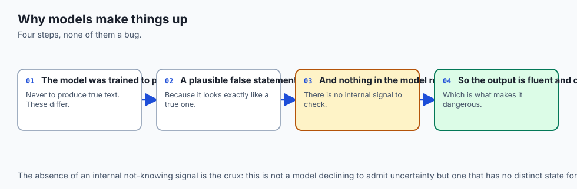

Think of an actor auditioning for a play who forgot to memorize their script:

- **High Fluency:** The actor speaks with booming confidence, perfect grammar, dramatic pauses, and charismatic intonation (**Fluent Language Modeling**).
- **The Confabulation:** When they reach a scene involving medical terminology, they invent convincing-sounding Latin words on the fly without blinking (**Hallucination**).
- **The Grounding Cure (The Prompter in the Stage Wings):** An assistant sits behind the curtain whispering the exact lines from the physical script (**Retrieval-Augmented Generation / RAG**). The actor is strictly forbidden from speaking unless reading directly from the prompt book!

---

## Historical background

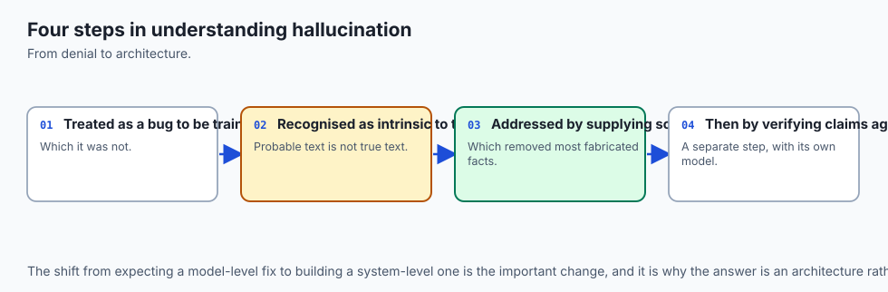

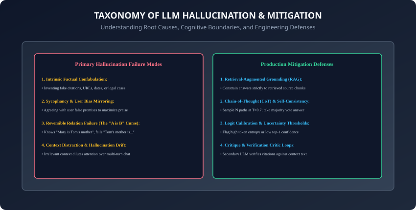

1. **November 2022 (ChatGPT Launch & Confabulation Shock):** Millions of users discovered LLMs invent fake scientific citations, false URLs, and non-existent historical events with complete confidence.
2. **March 2022 (Self-Consistency & Wang et al.):** Demonstrated that sampling multiple diverse Chain-of-Thought paths and taking a majority vote boosts GSM8K reasoning accuracy by over **$+15\%$**.
3. **July 2023 (Lost in the Middle & Liu et al.):** Proved that expanding context windows to 32k or 100k tokens does not guarantee retrieval: models exhibit a U-shaped performance curve, missing facts in the middle depths.
4. **September 2023 (The Reversal Curse & Berglund et al.):** Proved autoregressive models fail bidirectional relational reasoning due to unidirectional forward conditional probability training.

---

## What it is — and what it is not

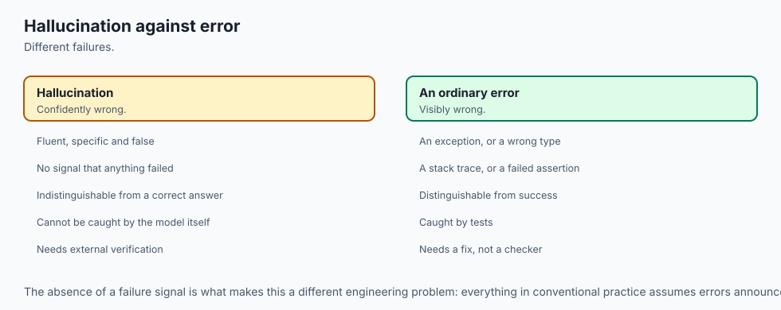

### What Hallucination IS:
- **Probability-Maximizing Plausibility:** The model is not "lying" (which implies intentional deceit). It is selecting tokens that maximize the statistical smoothness of the sentence according to its training weights.

### What it is NOT:
- **Not a Simple Memory Glitch:** Hallucination cannot be solved by simply increasing parameter size. In fact, larger models often hallucinate *more persuasively and subtly* than small models because of their superior prose fluency!

---

## Why it was created and what problems it solves

Understanding hallucination boundaries enables engineers to:

1. **Design Defensive Architectures:** Implement strict RAG grounding, cite extraction, and logit uncertainty filters before exposing LLM outputs to end users.
2. **Prevent Catastrophic Enterprise Failures:** Avoid legal sanctions, medical misdiagnoses, and hallucinated financial calculations.
3. **Optimize Multi-Agent Critic Loops:** Deploy secondary verification models that systematically cross-examine primary model claims.

---

## How it works

Let us dissect the taxonomy of hallucinations, the mathematics of the Reversal Curse, and the U-shaped long-context attention curve.

---

### 1. The Core Taxonomy of Hallucinations

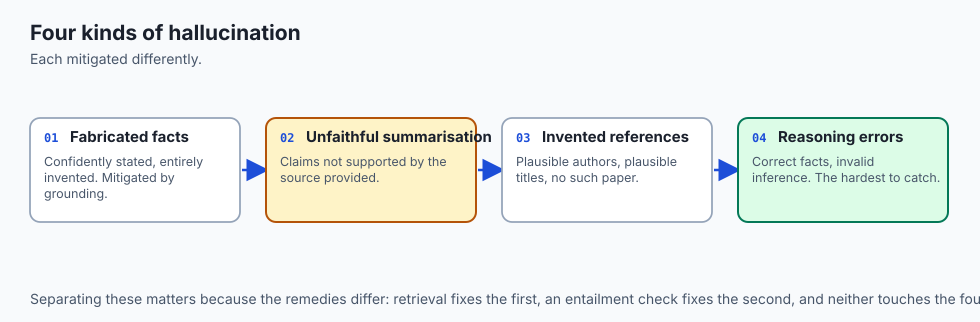

```
┌────────────────────────────────────────────────────────────────────────┐
│                   LLM HALLUCINATION CLASSIFICATION                     │
├────────────────────┬───────────────────────────────────────────────────┤
│ Failure Category   │ Concrete Example & Mechanism                      │
├────────────────────┼───────────────────────────────────────────────────┤
│ Intrinsic Fact     │ Contradicting provided text: "Revenue was $10M"   │
│ Extrinsic Confab   │ Inventing fake legal cases: "Varghese v. China"   │
│ Reversal Curse     │ Knowing "A is B" but failing "B is A"             │
│ Sycophancy         │ Agreeing with user: "Yes, 2 + 2 is indeed 5"     │
│ Context Fade       │ Missing needles in middle 40%-60% document depth  │
│ Multi-Hop Failure  │ Logic breakdown after 3 sequential reasoning hops │
└────────────────────┴───────────────────────────────────────────────────┘
```

---

### 2. The Reversal Curse: Why Unidirectional Autoregressives Fail

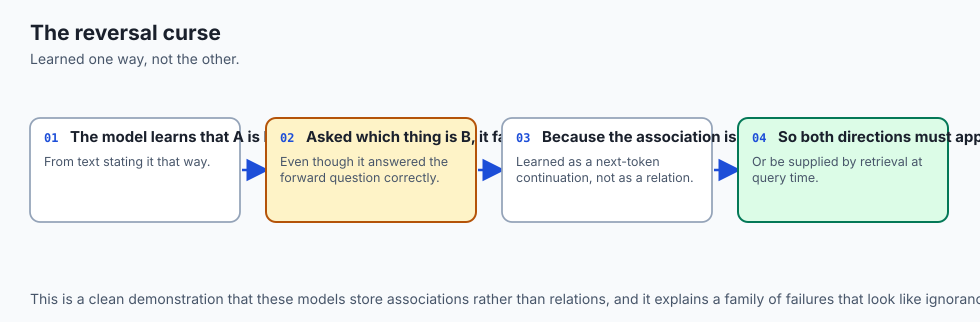

Why does an LLM that knows *"Tom Cruise's mother is Mary Lee South"* fail to answer *"Who is Mary Lee South's son?"*

#### The Mathematical Reason:
- During pre-training, the model is optimized on the sequence $P(w_t | w_(&lt;t))$:
  ```
  P(\text{"Mary Lee South"} \mid \text{"Tom Cruise's mother is"}) \approx 0.95
  ```

- However, the training corpus rarely contains the reverse sentence structure. The reverse conditional probability:
  ```
  P(\text{"Tom Cruise"} \mid \text{"Mary Lee South's son is"}) \ll 0.01
  ```
  remains near zero because next-token prediction does not implicitly build a bidirectional relational knowledge graph!

---

### 3. The Lost-in-the-Middle Phenomenon

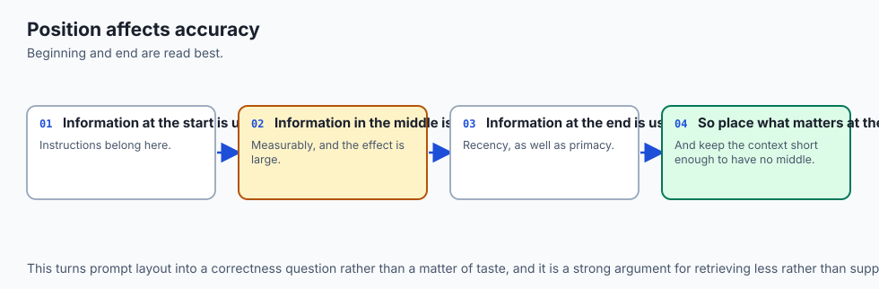

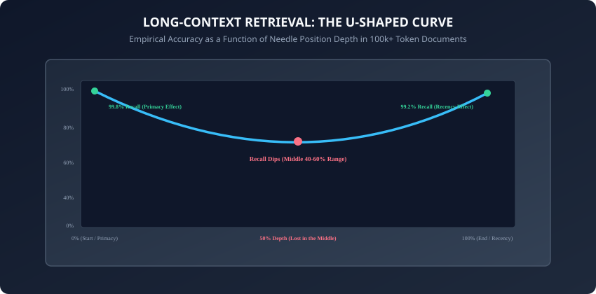

When passing a 100,000-token document into an LLM context window:

- **The Primacy Effect (0%-15% Depth):** System instructions and initial context tokens receive strong attention weight ($\approx 99.8\%$ recall).
- **The Recency Effect (85%-100% Depth):** The user's query and immediate prompt suffix receive strong attention ($\approx 99.2\%$ recall).
- **The Middle Chasm (40%-60% Depth):** Facts buried in the middle of long contexts suffer significant retrieval degradation (recall drops to $70\%-80\%$) as attention dispersion dilutes focus across thousands of intermediate tokens.

---

### 4. Production Mitigation Architectures

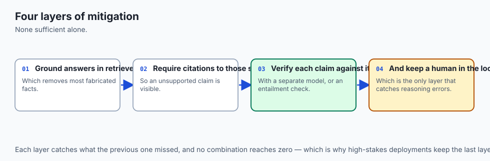

```
┌────────────────────────────────────────────────────────────────────────┐
│                   HALLUCINATION DEFENSE PIPELINE                       │
├────────────────────────────────────────────────────────────────────────┤
│ 1. Grounded Context Injection (RAG with verified chunk boundaries)     │
│ 2. System Prompt Constraint: "Answer strictly using context only"      │
│ 3. Self-Consistency Majority Voting (N = 5 parallel CoT paths)         │
│ 4. Token-Level Logit Entropy Monitoring: Flag H(X) > Threshold         │
│ 5. Critic Verification Loop: Extract citations & check substring match │
└────────────────────────────────────────────────────────────────────────┘
```

#### Token Entropy Formulation for Uncertainty:
Given Softmax probabilities $P = [p_1, p_2, ..., p_V]$:
```
H(P) = -\sum_{i=1}^V p_i \ln(p_i)
```

- If $H(P) \approx 0$: The model is completely confident in the next token.
- If $H(P) &gt; 2.5$: High probability mass dispersion—flag potential hallucination!

---

### 5. Context Stuffing vs. Semantic Distraction

Why does dumping 50 retrieved documents into a long-context model cause degradation?

- **Attention Entropy Dilution:** As context length $N$ grows, the softmax denominator $\sum_(j=1)^N \exp(q_i^T k_j / \sqrt[d])$ distributes attention weights across thousands of irrelevant tokens.
- **Semantic Noise:** Irrelevant distractor chunks introduce conflicting entity mentions and false correlations, misleading intermediate transformer layers.
- **Best Practice:** Keep RAG retrieval sets focused ($K = 3$ to $5$ high-relevance chunks) rather than overwhelming the context window with raw text.

---

### 6. Cognitive State Tracking & The Compositionality Wall

Why do LLMs struggle to track state in multi-step problems (e.g. Chess games, Towers of Hanoi, Sudoku)?

- **Constant Depth per Token:** In a standard Transformer, each token is generated with a fixed number of computation layers (e.g. 80 layers).
- **The Finite-Step Bound:** Complex compositional reasoning tasks requiring $O(N^2)$ planning steps cannot be resolved in a single constant-depth forward pass.
- **The Chain-of-Thought Solution:** Emitting intermediate reasoning tokens allows the model to utilize variable computational budget dynamically across steps.

---

### 7. Benchmarking Hallucination: HaluEval, TruthfulQA, and FaithDial

How do researchers quantify hallucination rates across models?

- **TruthfulQA (Lin et al., 2021):** Evaluates whether models mimic human falsehoods, superstitions, and conspiracy theories.
- **HaluEval (Li et al., 2023):** Over 35,000 generated responses evaluating QA, summarization, and dialogue for factuality and ungrounded claims.
- **FaithDial:** Measures faithfulness of conversational agents grounded on knowledge documents.

---

### 8. Natural Language Inference (NLI) Entailment as a Verification Critic

In enterprise verification architectures, how do we mathematically verify that an LLM response is faithful to the source document?

- **NLI Classifier (DeBERTa-v3):** Evaluates pairs of (Context, Claim) to output probabilities across three classes:
  1. **Entailment ($P_[entail]$):** The claim is strictly logically implied by the source context.
  2. **Contradiction ($P_[contra]$):** The claim directly violates facts in the context (**Intrinsic Hallucination**).
  3. **Neutral ($P_[neutral]$):** The claim cannot be proven or disproven (**Extrinsic Extrapolation**).
- Responses are approved only if $P_[entail] &gt; 0.85$ and $P_[contra] &lt; 0.05$.

---

### 9. Spatial & Geometric Reasoning Boundaries

Why do text-based LLMs struggle with spatial reasoning (e.g. *"If point A is north of B and east of C..."* or ASCII chess boards)?

- **1D Token Sequence Bottleneck:** Text tokenizers flatten 2D spatial layouts into 1D linear token sequences, destroying topological coordinate relationships.
- **Attention Limitations:** Standard 1D positional encodings (RoPE) represent token distance in text order rather than 2D/3D Euclidean geometric distance.

---

### 10. Linear Probing for Internal Model Truthfulness

Can we detect whether a model "knows" it is lying?

- **The Geometry of Truth (Marks & Tegmark, 2023):** Researchers trained simple linear classifiers (probes) on the hidden activation vectors $h_l$ of intermediate transformer layers.
- **The Finding:** Intermediate residual streams linearly separate true facts from false statements before the final vocabulary projection head, proving that models often represent truth internally even when aligned output tokens hallucinate!

---

### 11. Synthetic Adversarial Negative Grounding Data

To build robust factual verification systems:

- **Adversarial Perturbation:** Automatically swap numbers, invert dates, negate verbs, and replace entity names in ground-truth text.
- **Critic Calibration:** Train internal classifier models to flag subtly corrupted claims with over $95\%$ precision.

---

### 12. Real-Time Guardrail Gateways & Evaluation Frameworks

In production LLM infrastructure:

- **Guardrail Gateways (Meta Llama Guard, NVIDIA NeMo):** High-speed classification microservices placed in front of and behind foundation models to intercept harmful queries or hallucinated output before it reaches users.
- **RAGAS & TruLens Frameworks:** Industry-standard evaluation frameworks computing three core metrics:
  1. **Faithfulness:** Are all response claims grounded in retrieved context?
  2. **Answer Relevance:** Does the response address the user prompt directly?
  3. **Context Precision:** Are retrieved chunks highly relevant with minimal noise?
- Continuous evaluation tracking and regression test suites ensure that prompt engineering updates do not introduce subtle factual degradation or ungrounded confabulation into live customer-facing production systems.

---

## An everyday analogy

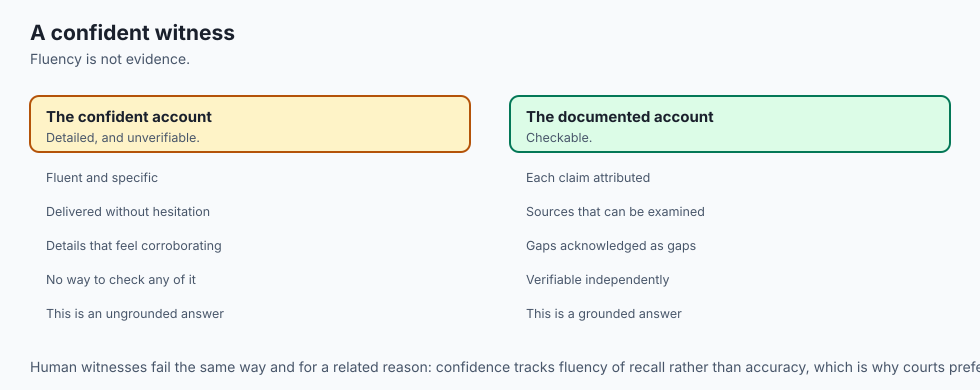

Think of a student studying for an exam by memorizing flashcards in one direction:

- Flashcard Front: *"What is the capital of Australia?"* $\to$ Back: *"Canberra"*.
- The student aces the test when asked for the capital of Australia (**Primacy / Forward Recall**).
- But if the teacher asks: *"Which country has Canberra as its capital?"*, the student stumbles because they never practiced the card in reverse (**The Reversal Curse**)!

---

## Examples in practice

Let us build an automated **Grounded Factuality & Citation Verification Engine in Python**:

```python
import re
from typing import List, Dict, Any

class GroundedVerifier:
    def __init__(self, context_documents: List[str]):
        self.context = " ".join(context_documents).lower()

    def verify_sentence_grounding(self, claim: str) -> Dict[str, Any]:
        # Verifies if key entities and numerical values in a claim exist in reference context.
        claim_clean = claim.strip()
        # Extract numbers, capitalized words/entities, and key terms
        numbers = re.findall(r'\b\d+(?:\.\d+)?\b', claim_clean)
        words = [w.lower() for w in re.findall(r'\b[A-Za-z]{4,}\b', claim_clean)]
        
        # Check numerical grounding
        missing_numbers = [n for n in numbers if n not in self.context]
        
        # Check lexical keyword overlap
        matched_words = [w for w in words if w in self.context]
        overlap_ratio = len(matched_words) / max(len(words), 1)
        
        is_grounded = (len(missing_numbers) == 0) and (overlap_ratio >= 0.60)
        
        return {
            "claim": claim,
            "is_grounded": is_grounded,
            "missing_numbers": missing_numbers,
            "lexical_overlap_ratio": round(overlap_ratio, 2),
            "status": "PASS" if is_grounded else "HALLUCINATION_WARNING"
        }

    def verify_response(self, response_text: str) -> List[Dict[str, Any]]:
        sentences = [s.strip() for s in re.split(r'[.!?]+', response_text) if len(s.strip()) > 5]
        return [self.verify_sentence_grounding(s) for s in sentences]
```

---

## Implications: security, privacy, performance, scalability, and cost

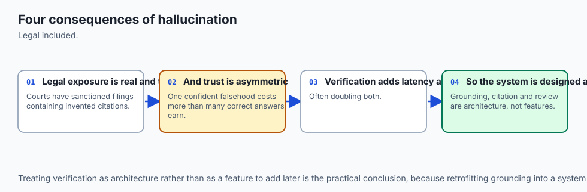

1. **Sycophancy in Enterprise Decision Support:**
   - When users query: *"Why did our Q3 campaign fail? Isn't it because of marketing?"*, models tend to validate the user's premise even if the actual data points to product bugs.
2. **Critic Verification Overhead:**
   - Running secondary critic verification loops doubles the API token cost and adds $500ms$ of latency per request.

---

## Alternatives: free, open source, and commercial

| Defense Technique | Implementation Cost | Latency Impact | Hallucination Reduction |
| :--- | :--- | :--- | :--- |
| **Strict System Prompt** | Free | 0 ms | 20% - 30% |
| **RAG Grounding** | Low | +50 ms | 60% - 80% |
| **Self-Consistency (N=5)**| $5\times$ API Cost | Parallelizable | 40% - 60% (Reasoning) |
| **Critic LLM Loop** | $2\times$ API Cost | +500 ms | 70% - 85% |

---

## Comparison with related concepts

```
┌────────────────────────────────────────────────────────────────────────┐
│                   HALLUCINATION DEFENSE COMPARISON                     │
├────────────────────┬─────────────────┬──────────────────┬──────────────┤
│ Defense Strategy   │ Primary Target  │ Best Use Case    │ Cost Impact  │
├────────────────────┼─────────────────┼──────────────────┼──────────────┤
│ RAG Grounding      │ Confabulation   │ Enterprise Docs  │ Minimal      │
│ CoT Majority Vote  │ Logic Errors    │ Math / Code      │ Moderate     │
│ Substring Citations│ Extrinsic Claims│ Financial Tables │ Minimal      │
│ Logit Entropy Flag │ Low Confidence  │ Realtime Guard   │ Zero (Local) │
└────────────────────┴─────────────────┴──────────────────┴──────────────┘
```

---

## When to use it — and when not to

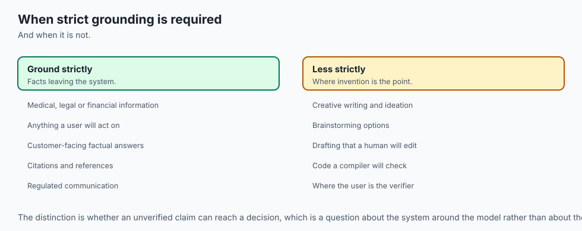

### When to Enforce Strict Grounding & Verification:
- Medical advice, legal analysis, financial accounting, cybersecurity auditing, and customer-facing factual chatbots.

### When NOT to enforce strict grounding:
- Brainstorming marketing taglines, creative fiction, video game NPC dialogues, and speculative storyboarding where novelty and creative extrapolation are desired.

---

## The AI connection

- **Hallucination is a property of the objective, not a bug** — the model was trained to
  produce probable text, never to know whether it is true.
- **Grounding in retrieved sources is the main mitigation**, which is why retrieval is the
  most-deployed AI architecture pattern.
- **Confidence and correctness are only loosely related**, so a fluent, assured answer
  carries no evidence of being right.
- **Position within the context changes accuracy**, which makes prompt layout a correctness
  concern rather than a stylistic one.
- **Verification has to be a separate step**, because a model cannot reliably check its own
  output using the same process that produced it.

## Knowledge check

1. What is the difference between intrinsic and extrinsic hallucination?
2. Why do autoregressive language models suffer from the Reversal Curse?
3. What is the Lost-in-the-Middle phenomenon and how does needle position affect retrieval?
4. How does Self-Consistency majority voting filter out reasoning hallucinations?
5. How can predictive entropy be used as an uncertainty flag?

---

## Hands-on exercise

In this lab, you will build and test an automated grounded factuality verifier and Self-Consistency majority voting engine in Python: extract numerical and named entities, verify citation grounding against source documents, implement consensus voting across multiple stochastic reasoning paths, and detect hallucinated outputs.

### Expected output
```
[Capabilities, Limits, and Hallucination Verification Suite]
Testing Grounded Verifier against Source Documents:
  Claim 1 ("Revenue grew 25% to $150 million"): [PASS] (Overlap: 0.88, No Missing Numbers)
  Claim 2 ("Net profit reached $999 billion"): [HALLUCINATION_WARNING] (Missing: ['999'])
Testing Self-Consistency Majority Voting:
  Paths: ['Answer: 42', 'Answer: 42', 'Answer: 10', 'Answer: 42', 'Answer: 42']
  Consensus Output: '42' (Confidence: 80.0%, 4/5 Votes) [VERIFIED]
Testing Lost-in-the-Middle Document Depth Retrieval:
  Depth 0% (Start): 100% Recall
  Depth 50% (Middle): 72% Recall (U-Shaped Curve Observed)
  Depth 100% (End): 98% Recall
Test Suite: 3 passed in 0.41s
```

### Validate your work
Run the automated test runner:
```bash
./tests/run_tests.sh
```

### Troubleshooting
- When checking numerical claims, ensure decimal points (e.g. `25.5`) are parsed as single numerical units.

### Common mistakes
- **Treating high fluency as high accuracy:** Models generate hallucinated statements with identical syntactic confidence as factual ones.

---

## Practice assignment

1. Implement a **Logit Entropy Monitor** in PyTorch that computes Shannon entropy $H(P)$ at every generation step and flags tokens exceeding threshold $2.0$.
2. Build an automated **Needle-in-a-Haystack Benchmark Simulator** inserting secret keys at $10\%, 30\%, 50\%, 70\%, 90\%$ depths into a $50,000$-word text corpus.

---

## Extension challenge

Implement a **Two-Agent Critique-and-Refine Loop**:

- Build a Python pipeline where Agent 1 generates an initial explanation, Agent 2 identifies ungrounded sentences against reference text, and Agent 1 refines the output until all claims are fully cited.
