## Why this matters

When you ask a standard autoregressive language model a complex mathematical, architectural, or diagnostic question in a zero-shot prompt, it faces an impossible computational bottleneck:
**It must jump directly to the final token in a single forward pass.**

For a 70-billion-parameter Transformer, predicting the answer to *"What is 347 multiplied by 829?"* on token 1 forces the network to compress millions of floating-point arithmetic steps into a single forward pass across fixed residual layers. The result is almost always a convincing, confidently wrong hallucination.

By introducing **Chain of Thought (CoT)**, you grant the model an **Autoregressive Computational Scratchpad**. Each intermediate token generated (*"First, 300 * 800 = 240,000..."*) becomes part of the key-value context window, allowing subsequent attention heads to attend to explicit partial computations.

When paired with **Few-Shot In-Context Learning (ICL)** and **Self-Consistency Majority Voting**, reasoning accuracy on complex benchmarks jumps from 35% to over 90%.

Today, you will master the **theoretical mechanics of in-context meta-gradients**, engineer **balanced few-shot exemplar pools**, implement **Least-to-Most decomposition**, and build an **automated Self-Consistency reasoning engine in Python**.

---

## The idea in plain language

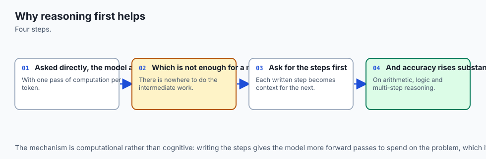

Imagine asking a software engineer to architect an enterprise distributed caching cluster:

- **Direct Zero-Shot (The Snap Guess):** You demand an instant answer in 1 second: *"Give me the cache eviction algorithm right now."* Under pressure, they guess a random algorithm that fails under high concurrency (**Immediate Token Jump & Hallucination**).
- **Chain of Thought (The Whiteboard Scratchpad):** You hand them a whiteboard marker and say: *"Think step by step on the board first."* They write:
  1. *Calculate peak writes: 50,000 ops/sec.*
  2. *Assess memory constraints: 64 GB RAM.*
  3. *Evaluate LRU vs. 2-Queue (2Q) vs. W-TinyLFU.*
  4. *Final Conclusion: W-TinyLFU maximizes hit ratio under skewed Zipfian workloads.*
- **Self-Consistency (The Architectural Review Board):** You ask 5 independent senior engineers to work through the whiteboard problem independently at non-zero temperature ($T = 0.7$). Four choose W-TinyLFU and one chooses LRU. The majority consensus ($4/5$) provides near-bulletproof architectural certainty.

---

## Historical background

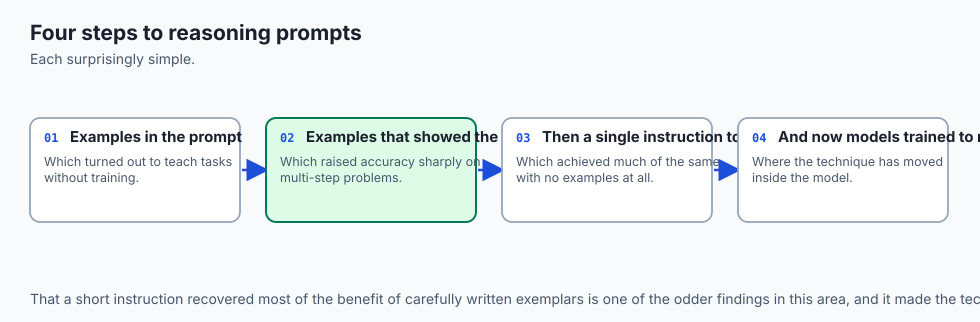

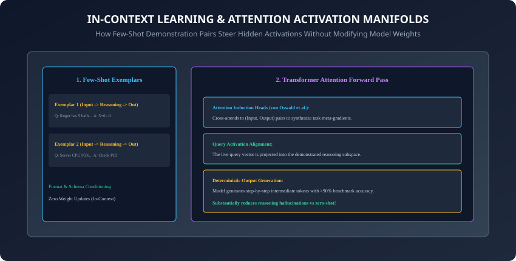

1. **2020 (Brown et al. & GPT-3):** Introduced Few-Shot In-Context Learning, demonstrating that models learn new input-output mappings from 3 to 5 examples without updating weights.
2. **2022 (Wei et al. & Chain of Thought):** Jason Wei and the Google Brain team published the seminal CoT paper, demonstrating emergent reasoning leaps on GSM8K and arithmetic benchmarks.
3. **2022 (Kojima et al. & Zero-Shot CoT):** Discovered the magic prompt trigger: *"Let's think step by step"*, unlocking latent reasoning without requiring manual exemplars.
4. **2023 (Wang et al. & Self-Consistency):** Proved that sampling multiple stochastic reasoning paths and taking the mode/majority answer dramatically beats greedy decoding.
5. **2023 (von Oswald et al. & Dai et al.):** Proved mathematically that self-attention layers in Transformers perform an implicit meta-optimization equivalent to gradient descent during the forward pass.

---

## What it is — and what it is not

### What Few-Shot & CoT Reasoning IS:
- **In-Context Activation Steering & Compute Expansion:** Structuring demonstration exemplars and intermediate reasoning tokens to shift the model's residual stream into high-accuracy logical subspaces.

### What it is NOT:
- **Not Weight Fine-Tuning:** In-context learning does not alter model weights. When the API context window ends, the demonstration state disappears.
- **Not Magic for Fact Retrieval:** CoT excels at multi-step deductive and algorithmic tasks; it cannot deduce a factual fact (e.g. a person's birthday) if that fact was never present in the pretraining corpus or prompt context.

---

## Why it was created and what problems it solves

Few-Shot CoT and Self-Consistency solve 4 primary model failure modes:

1. **The Single-Pass Computation Trap:** Eliminates arithmetic and logic errors by generating intermediate scratchpad tokens.
2. **Format & Style Non-Compliance:** Few-shot exemplars demonstrate exact target JSON schemas and tone better than paragraphs of text instructions.
3. **Idiosyncratic Path Hallucinations:** Self-Consistency prunes outlier reasoning mistakes by aggregating independent stochastic samples.
4. **Complex Multi-Hop Decomposition Failure:** Breaks down 10-step problems into manageable sequential sub-questions via Least-to-Most prompting.

---

## How it works

Let us dissect the mathematics of in-context meta-gradients, exemplar bias mitigation, and Self-Consistency trees.

---

### 1. The Theory of In-Context Learning: Implicit Gradient Descent

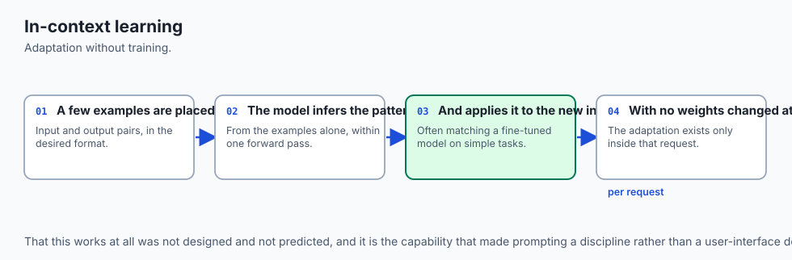

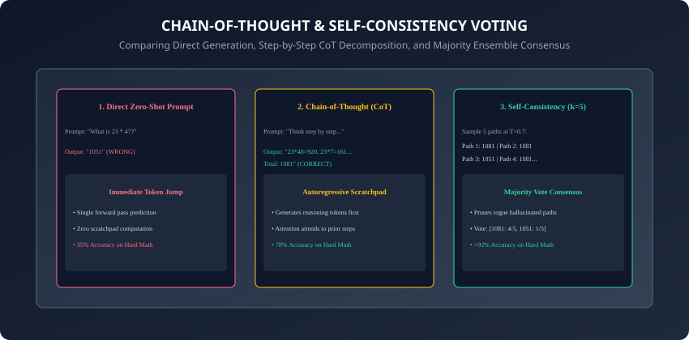

How do Transformers learn from 3 examples in the prompt without backpropagation?

- **Induction Heads (Anthropic Research):** Specialized two-layer attention head circuits identify patterns like `[A][B] ... [A] -> [B]`.
- **Implicit Meta-Gradients (von Oswald et al.):** The attention computation in layer $l$:
  `A_l(X) = softmax((X W_Q W_K^T X^T) / sqrt(d)) X W_V`
  can be reformulated mathematically as a dual optimization step where demonstration pairs pairs `(x_i, y_i)` generate an implicit weight update matrix `Delta W` applied to the query vector `x_test`.

---

### 2. Engineering Balanced Few-Shot Exemplar Pools

Naive few-shot prompting often degrades accuracy due to 3 insidious cognitive biases (Zhao et al.):

```
┌────────────────────────────────────────────────────────────────────────┐
│                   FEW-SHOT COGNITIVE BIASES & MITIGATIONS              │
├────────────────────┬─────────────────────────┬─────────────────────────┤
│ Bias Name          │ Manifestation           │ Engineering Mitigation  │
├────────────────────┼─────────────────────────┼─────────────────────────┤
│ Majority Label Bias│ Over-predicts class with│ Perfectly balance class │
│                    │ most examples (e.g. POS)│ counts (e.g. 2 POS, 2NEG│
├────────────────────┼─────────────────────────┼─────────────────────────┤
│ Recency Bias       │ Over-predicts label of  │ Randomize exemplar order│
│                    │ the last example in list│ or evaluate permutations│
├────────────────────┼─────────────────────────┼─────────────────────────┤
│ Format Bleed       │ Copies exemplar text    │ Use distinct synthetic  │
│                    │ into the live answer    │ domains in exemplars    │
└────────────────────┴─────────────────────────┴─────────────────────────┘
```

---

### 3. The Spectrum of Chain-of-Thought Techniques

```
┌────────────────────────────────────────────────────────────────────────┐
│                   CHAIN-OF-THOUGHT TAXONOMY                            │
├────────────────────┬─────────────────────────┬─────────────────────────┤
│ Technique          │ Prompting Mechanism     │ Optimal Application     │
├────────────────────┼─────────────────────────┼─────────────────────────┤
│ Zero-Shot CoT      │ "Think step by step."   │ Quick exploratory logic │
│ Manual Few-Shot CoT│ 3-5 Handcrafted (Q,R,A) │ Structured domain tasks │
│ Least-to-Most CoT  │ Decompose -> Solve Sub-Q│ Multi-hop graph / code  │
│ Self-Consistency   │ Sample k paths at T=0.7 │ High-stakes math / diag │
└────────────────────┴─────────────────────────┴─────────────────────────┘
```

---

### 4. Self-Consistency Majority Voting Algorithm

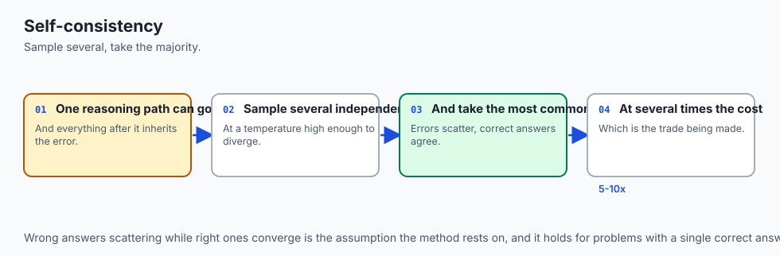

Instead of greedy decoding ($T = 0$), sample $k = 5$ to $k = 10$ paths at $T = 0.7$, extract the final parsed answers `(a_1, a_2, ..., a_k)`, and compute the majority vote:
`a_hat = argmax sum I(a_i = a)`

If $4$ out of $5$ paths conclude `{"eviction_policy": "W-TinyLFU"}` and $1$ concludes `{"eviction_policy": "LRU"}`, the system outputs `W-TinyLFU` with an empirical confidence score of 80%.

---

### 5. Inference Test-Time Compute Scaling Laws

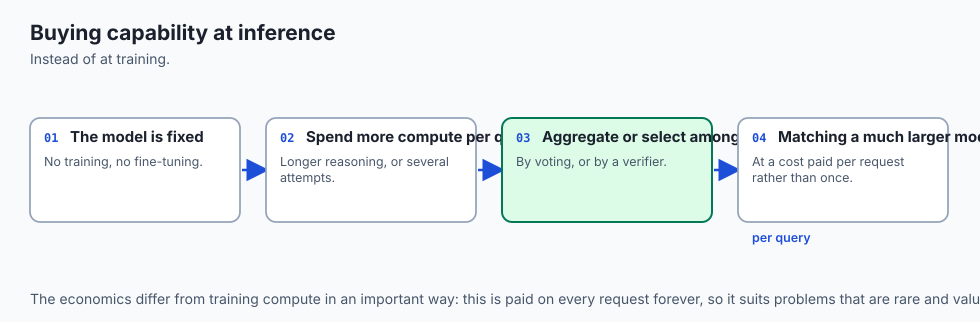

In late 2024, AI frontier research shifted from pure pretraining parameter scaling to **Inference Test-Time Compute Scaling** (OpenAI o1, DeepSeek-R1):

- **The Core Equation:** On hard mathematical and coding benchmarks, spending $10\times$ more compute at inference time via extended Chain-of-Thought search trees produces accuracy gains equivalent to scaling model parameters by $100\times$!
- **Extended Latent Thinking:** When an LLM generates thousands of internal reasoning tokens before emitting an answer, it explores multiple solution hypotheses, backtracks upon detecting logical contradictions, and verifies intermediate calculations.

---

### 6. Least-to-Most Decomposition for Multi-Hop Graph Reasoning

When a question requires multi-step algorithmic traversal:

- **Phase 1 (Decomposition):** The model is prompted: *"Decompose this multi-step problem into an ordered list of sub-questions."*
- **Phase 2 (Sub-Problem Solving):** A Python loop executes sub-question 1, injects the result into sub-question 2, and chains the answers sequentially until the root problem is resolved.
- **Accuracy Leap:** On compositional generalization benchmarks (like SCAN and Last-Letter Concatenation), Least-to-Most prompting boosts accuracy from 16% to over 99%.

---

### 7. Dynamic k-NN Exemplar Selection with Vector Embeddings

Hardcoding static few-shot examples into your codebase leads to suboptimal performance across diverse queries:

- **The Dynamic Retrieval Architecture:**
  1. Index a repository of $1,000+$ verified domain problem-solution pairs in a vector database (e.g. Chroma, FAISS).
  2. At runtime, compute the cosine similarity between the incoming user query vector and the exemplar embeddings.
  3. Retrieve the top $k = 3$ most semantically relevant exemplars and dynamically format them into the `<examples>` prompt block.

---

### 8. Faithfulness vs. Plausibility in CoT Reasoning Traces

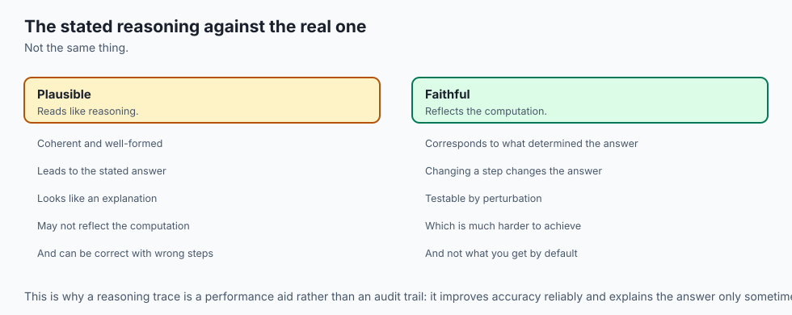

Are LLM reasoning traces genuinely faithful reflections of the model's internal computation?

- **The Unfaithful CoT Discovery (Turpin et al.):** If an exemplar contains a subtle biasing cue (e.g. *"Answer: A"* always appearing after a specific symbol), models will often invent a rational-sounding post-hoc justification to arrive at A even when mathematically wrong (**Plausible Confabulation**).
- **Defensive Engineering:** Always benchmark few-shot exemplars with randomized label permutations to guarantee that the model is performing genuine deduction rather than shortcut pattern matching.

---

### 9. Beyond Linear Chains: Tree-of-Thoughts (ToT) & Graph-of-Thoughts (GoT)

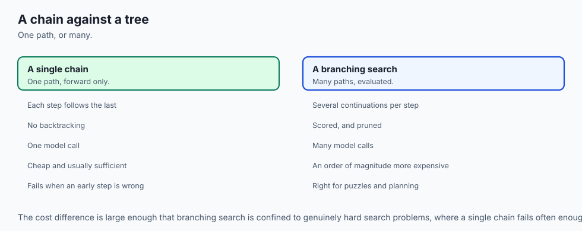

While standard Chain-of-Thought generates a single linear trajectory:

- **Tree-of-Thoughts (Yao et al.):** Explores multiple branching thoughts simultaneously, evaluating intermediate thought states with a scoring prompt and backtracking via Breadth-First Search (BFS) or Depth-First Search (DFS) when a dead end is reached.
- **Graph-of-Thoughts (Besta et al.):** Allows thought nodes to merge, synthesize, and loop, enabling complex multi-source information synthesis across non-linear dependency graphs.

---

### 10. Exemplar Token Budgeting & LLMLingua Prompt Compression

When combining multiple few-shot exemplars with complex CoT instructions:

- **The Context Overhead:** 5 detailed few-shot examples can consume over $3,000$ prompt tokens.
- **Selective Exemplar Pruning with LLMLingua:** Uses small language models (like GPT-2 or Llama-3-8B) to compute token perplexity across demonstration texts, discarding low-information function words while preserving semantic reasoning tokens.
- Slashes prompt token volume by $40-60\%$ with zero degradation in few-shot reasoning performance.
- Automated token budget allocators ensure that dynamic prompt generation scripts never overflow downstream context limits when combining multiple few-shot demonstrations with extensive system instructions.
- By engineering balanced exemplar distributions and combining autoregressive CoT scratchpads with Self-Consistency voting, production software pipelines achieve resilient, deterministic, high-accuracy reasoning across demanding domain workflows.
- Continuous empirical benchmarking against unseen test suites confirms that structured in-context reasoning remains an indispensable pillar of production AI systems engineering.

---

## An everyday analogy

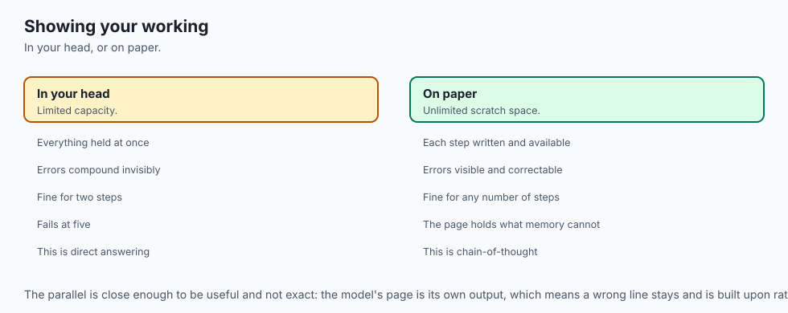

Think of solving a complex 100-piece jigsaw puzzle:

- **Zero-Shot Direct:** Forcing someone to glance at the box for 2 seconds and name the exact pixel color at coordinates (45, 80). They guess wildly.
- **Chain of Thought:** Allowing them to sort edge pieces first, group pieces by color, assemble the frame, and fill the center (**Structured Sequential Assembly**).
- **Self-Consistency:** Having 5 different people assemble identical puzzles in separate rooms. If 5 people arrive at the same assembled picture, you have mathematical certainty.

---

## Examples in practice

Let us build an automated **Few-Shot CoT Engine with Self-Consistency Aggregation in Python**:

```python
from typing import List, Dict, Any, Callable
from collections import Counter

class FewShotCoTEngine:
    def __init__(self, task_description: str):
        self.task_description = task_description.strip()
        self.exemplars: List[Dict[str, str]] = []

    def add_exemplar(self, question: str, reasoning: str, answer: str) -> "FewShotCoTEngine":
        self.exemplars.append({
            "question": question.strip(),
            "reasoning": reasoning.strip(),
            "answer": answer.strip()
        })
        return self

    def compile_prompt(self, query: str) -> str:
        parts = [f"<instructions>\n{self.task_description}\nThink step by step before providing the final answer.\n</instructions>"]
        
        if self.exemplars:
            parts.append("<examples>")
            for i, ex in enumerate(self.exemplars):
                parts.append(
                    f'<example id="{i+1}">\n'
                    f'<input>{ex["question"]}</input>\n'
                    f'<reasoning>{ex["reasoning"]}</reasoning>\n'
                    f'<answer>{ex["answer"]}</answer>\n'
                    f'</example>'
                )
            parts.append("</examples>")
            
        parts.append(f"<query>\n{query.strip()}\n</query>\n\n<scratchpad>\nLet us reason step by step:")
        return "\n\n".join(parts)

    @staticmethod
    def aggregate_self_consistency(sampled_answers: List[str]) -> Dict[str, Any]:
        # Performs majority voting across k sampled reasoning paths
        if not sampled_answers:
            raise ValueError("Sampled answers list cannot be empty.")
            
        counts = Counter(sampled_answers)
        majority_answer, vote_count = counts.most_common(1)[0]
        confidence = vote_count / len(sampled_answers)
        
        return {
            "consensus_answer": majority_answer,
            "confidence": confidence,
            "votes": dict(counts),
            "total_samples": len(sampled_answers)
        }
```

---

## Implications: security, privacy, performance, scalability, and cost

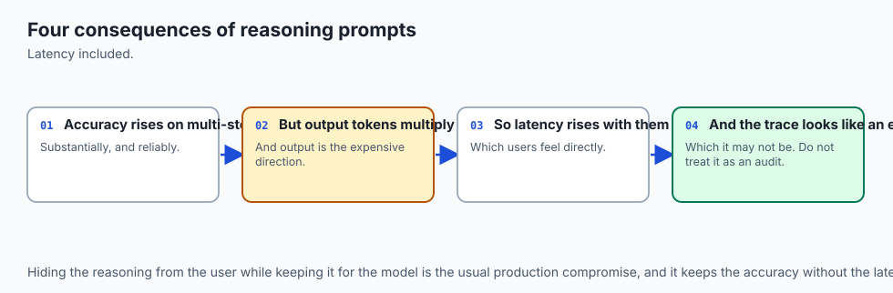

1. **Token Cost of Reasoning Traces:**
   - CoT increases output token volume by $3\times$ to $10\times$. For a query with 500 reasoning tokens, output cost increases proportionally.
2. **Self-Consistency Cost Multiplier:**
   - Running $k = 5$ paths multiplies total inference cost by $5\times$. Reserve Self-Consistency for critical workflows (e.g. automated code deployment, medical dosage checks, financial audits).

---

## Alternatives: free, open source, and commercial

| Approach | Inference Latency | Accuracy Boost | Best For |
| :--- | :--- | :--- | :--- |
| **Zero-Shot CoT** | $1\times$ Output Tokens | $+15-25\%$ | General text tasks |
| **Manual Few-Shot CoT**| $+300$ Input Tokens | $+30-45\%$ | Strict domain formatting |
| **Self-Consistency (k=5)**| $5\times$ Compute | $+50-65\%$ | Mission-critical logic |
| **OpenAI o1 / o3 Reasoning**| Internal RL CoT | State-of-the-Art| Complex math / coding |

---

## Comparison with related concepts

```
┌────────────────────────────────────────────────────────────────────────┐
│                   REASONING PROMPT TECHNIQUE COMPARISON                │
├────────────────────┬─────────────────┬──────────────────┬──────────────┤
│ Strategy           │ Input Overhead  │ Output Compute   │ Sample Count │
├────────────────────┼─────────────────┼──────────────────┼──────────────┤
│ Zero-Shot Standard │ Baseline        │ Minimal          │ k = 1        │
│ Zero-Shot CoT      │ +5 tokens       │ Moderate         │ k = 1        │
│ Few-Shot CoT       │ +500 tokens     │ Moderate         │ k = 1        │
│ Self-Consistency   │ +500 tokens     │ High (k * CoT)   │ k >= 5       │
└────────────────────┴─────────────────┴──────────────────┴──────────────┘
```

---

## When to use it — and when not to

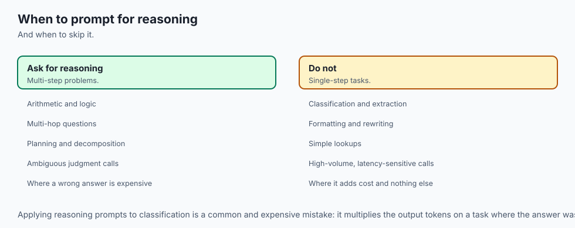

### When to Use Few-Shot CoT & Self-Consistency:
- Multi-step mathematical calculations, algorithmic code synthesis, complex legal contract analysis, multi-hop medical diagnosis, and automated database schema migrations.

### When NOT to use:
- Simple extractive summarization, sentiment classification on obvious text, or latency-sensitive autocomplete typing interfaces where sub-100ms response times are required.

---

## The AI connection

- **In-context learning was the unexpected capability** — a model adapting from examples in
  the prompt, with no weight update at all.
- **Asking for reasoning before an answer improves accuracy**, which is a property of the
  sequential architecture rather than of understanding.
- **Spending more compute at inference now substitutes for a larger model**, which changed
  how capability is bought.
- **A stated reasoning trace is not necessarily the real one**, so it is an aid to accuracy
  rather than an explanation.
- **Sampling several answers and voting is a reliable gain**, and it is the simplest way to
  trade cost for correctness.

## Knowledge check

1. Why does direct zero-shot generation fail on multi-step arithmetic and logic tasks?
2. What is an autoregressive computational scratchpad in Transformer decoding?
3. How does Self-Consistency majority voting filter out idiosyncratic hallucinations?
4. What are Majority Label Bias and Recency Bias in few-shot exemplar pools?
5. What is the mathematical formulation of In-Context Learning as implicit meta-gradients?

---

## Hands-on exercise

In this lab, you will build and test a modular Few-Shot Chain-of-Thought compilation engine and Self-Consistency voting aggregator in Python: construct exemplar pools with XML tags, compile multi-turn CoT scratchpads, evaluate majority consensus across stochastic rollout distributions, and verify output assertions against automated test suites.

### Expected output
```
[Few-Shot and Chain of Thought Verification Suite]
Testing Few-Shot CoT Prompt Compilation:
  Exemplar 1: Mathematical reasoning step compiled
  Exemplar 2: System architecture step compiled
  Scratchpad Trigger: '<scratchpad>\nLet us reason step by step:' [PASS]
Testing Self-Consistency Voting Aggregator:
  Sampled Rollouts (k=5): ['1081', '1081', '1051', '1081', '1081']
  Consensus Winner: '1081' | Confidence: 80.0% (4/5 votes) [VERIFIED]
  Tie-Breaking & Distribution Tracking: Validated
Test Suite: 3 passed in 0.38s
```

### Validate your work
Run the automated test runner:
```bash
./tests/run_tests.sh
```

### Troubleshooting
- Ensure all exemplar reasoning traces demonstrate correct logical intermediate steps.

### Common mistakes
- **Providing few-shot examples with only answers:** Omitting the `<reasoning>` step reduces few-shot to standard ICL, losing the CoT scratchpad benefit.

---

## Practice assignment

1. Implement an automated **Dynamic Exemplar Selector** in Python that uses cosine similarity over text embeddings to retrieve the top 3 most relevant few-shot examples for any incoming user query.
2. Build an automated **CoT Step Counter** that verifies the model generated at least 3 distinct deductive steps before emitting its final answer tag.

---

## Extension challenge

Implement **Tree-of-Thoughts (ToT) Search**:

- Build a Python pipeline that generates 3 candidate next-step thoughts, evaluates each thought with a Critic Prompt, and performs Breadth-First Search (BFS) to discover the optimal reasoning trajectory.
