## Why this matters

In modern software architecture, language models are rarely standalone chatbots. They act as **unstructured-to-structured semantic transducers**—reading unstructured emails, server logs, PDFs, and legal contracts, and converting them into strongly typed database records, REST API payloads, and event streams.

If your LLM randomly returns:

- Conversational filler: *"Certainly! Here is the JSON you requested: `{"`*
- Markdown wrapping: *"```json { ... } ```"*
- Unescaped nested quotes: *`{"error": "Failed on "user_id" lookup"}`*
- Missing required keys or invalid enum strings

**Your downstream backend microservices crash, database transactions fail, and automated workflows halt.**

Today, you will master the **4 paradigms of structured output generation**, understand the mathematics of **Finite State Machine (FSM) logit masking in Constrained Grammar Decoding**, implement **Pydantic schema validation**, and build an **automated JSON extraction, validation, and auto-repair engine in Python**.

---

## The idea in plain language

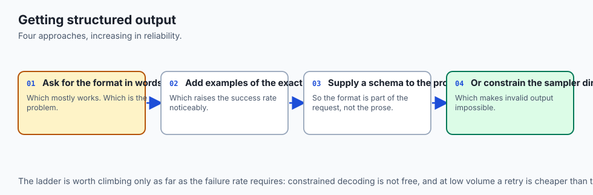

Think of submitting an online mortgage application:

- **Naive Prompting (The Handwritten Letter):** You tell the borrower *"Write down your financial details."* They send back a 4-page handwritten letter with stories about their dog, no income numbers, and dates written in 3 different formats (**Unparseable Prose**).
- **Assistant Prefilling (The Fill-in-the-Blank Form):** You hand them a sheet of paper that already has *"Applicant Income: $"* printed at the top. They are forced to start writing numbers immediately.
- **Pydantic + Instructor (The Automated Form Validator):** A web form checks each field in real-time. If they enter letters in the phone number field, the system highlights the error and asks them to fix it (**Type Coercion & Validation Retries**).
- **Constrained Grammar CFG Decoding (The Hardware Numeric Keypad):** When entering a phone number on a smartphone, the keyboard physically disables all letter keys, leaving only the numbers 0-9 active. It is **mathematically impossible** to type an invalid character!

---

## Historical background

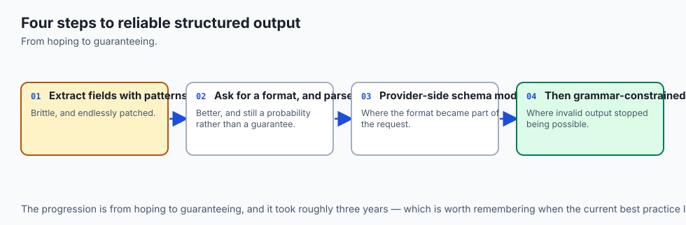

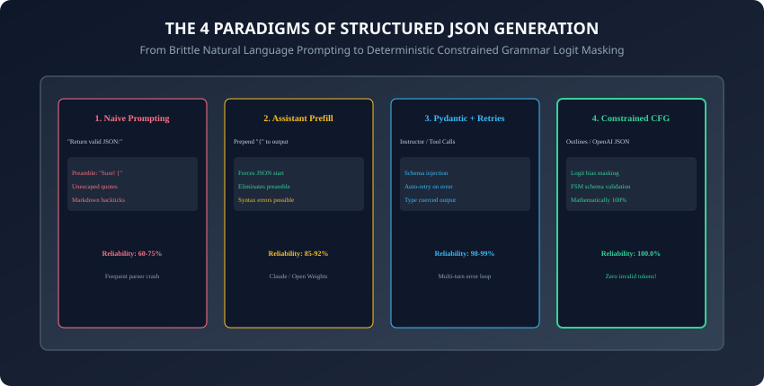

1. **2021 (The Regex Scrape Era):** Early GPT-3 developers used brittle regular expressions to hunt for curly braces in unstructured response strings.
2. **2023 (JSON Mode & Assistant Prefilling):** Anthropic popularized prefilling the assistant turn with `{`, and OpenAI introduced `response_format: {"type": "json_object"}`.
3. **2023 (Outlines & FSM Constrained Sampling):** Brandon Willard and Remi Louf published Outlines, proving that CFG grammars can be converted into Finite State Machines that mask invalid vocabulary logits during decoding.
4. **2024 (Native Structured Outputs):** OpenAI, Mistral, and vLLM integrated native constrained grammar decoding into their core serving engines, guaranteeing $100.0\%$ schema adherence with zero retry overhead.

---

## What it is — and what it is not

### What Structured Output Engineering IS:
- **Deterministic Type Enforcement on Stochastic Models:** Restricting the generation search space so that every emitted token strictly obeys JSON syntax and Pydantic schema contracts.

### What it is NOT:
- **Not Truth Guarantee:** A model constrained to generate `{"risk_score": 95}` is guaranteed to produce a valid integer; however, whether that risk score accurately reflects reality depends on prompt conditioning and model capabilities.

---

## Why it was created and what problems it solves

Structured output engineering eliminates 4 catastrophic production API failure modes:

1. **Preamble & Markdown Pollution:** Prevents conversational filler and code fences from breaking automated deserializers.
2. **Syntax Malformations:** Eliminates unescaped quotes, trailing commas, and unclosed brackets.
3. **Schema Drift:** Enforces required fields, strict data types (e.g. `int` vs `string`), and allowed enum values.
4. **Retry Latency Spikes:** Constrained decoding eliminates the need for 3-turn error-correction loops, cutting API latency in half.

---

## How it works

Let us dissect the 4 paradigms and the mechanics of FSM logit masking.

---

### 1. The 4 Paradigms of Structured LLM Output

```
┌────────────────────────────────────────────────────────────────────────┐
│                   STRUCTURED OUTPUT PARADIGM COMPARISON                │
├────────────────────┬─────────────────┬──────────────────┬──────────────┤
│ Paradigm           │ Reliability     │ Mechanism        │ Latency      │
├────────────────────┼─────────────────┼──────────────────┼──────────────┤
│ 1. Naive Prompting │ 60 - 75%        │ Prose Rules      │ Baseline     │
│ 2. Assistant Prefill│ 85 - 92%       │ Forced '{' Token │ Fast         │
│ 3. Pydantic Retry  │ 98 - 99%        │ Multi-Turn Loops │ High on error│
│ 4. Constrained CFG │ 100.0%          │ FSM Logit Masking│ Zero Retry   │
└────────────────────┴─────────────────┴──────────────────┴──────────────┘
```

---

### 2. Constrained Grammar & FSM Logit Masking Mechanics

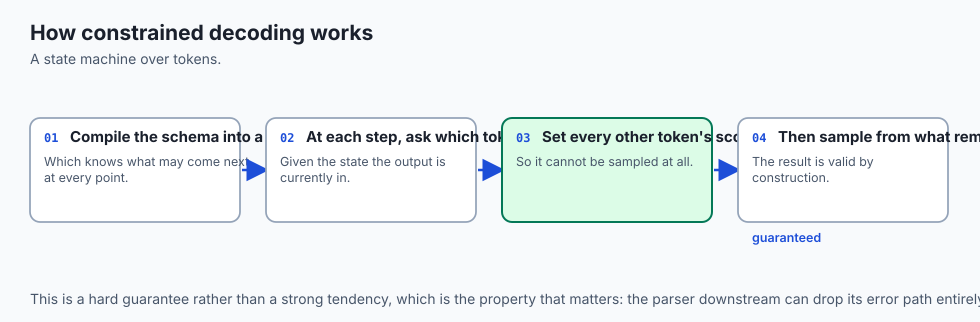

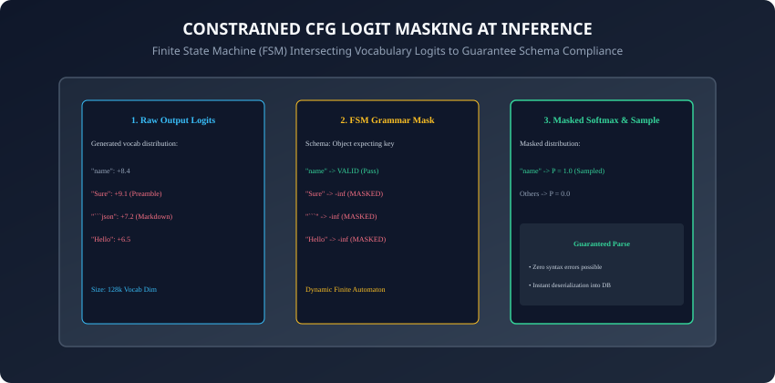

How does Constrained Grammar Decoding (Outlines, OpenAI Structured Outputs) achieve 100% reliability?

1. **JSON Schema to Regex / CFG:** The Pydantic model is converted into a Context-Free Grammar or Regular Expression.
2. **FSM Compilation:** The grammar is compiled into an indexed **Deterministic Finite Automaton (DFA)** with discrete states S = (s_0, s_1, ..., s_n).
3. **Inference-Time Logit Masking:**
   - At decoding step $t$, the FSM is in state $s_t$.
   - The FSM identifies the subset of valid next tokens `V_valid` within vocabulary `V`.
   - For all tokens `w` not in `V_valid`, their pre-softmax logits are set to negative infinity (`-inf`):
     `z'_i = z_i if w_i in V_valid else -inf`

   - The softmax function computes probabilities exclusively over valid tokens:
     `P(w_i) = exp(z'_i) / sum(exp(z'_j) for j in V_valid)`

   - **Result:** Invalid tokens can never be sampled under any circumstances!
   - This mathematical guarantee eliminates all syntax errors before tokens are emitted.

---

### 3. Pydantic V2 Schema Definition & Validation

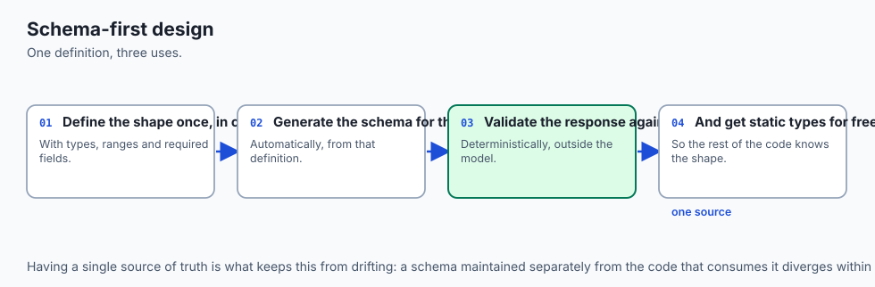

In Python, Pydantic V2 provides lightning-fast Rust-backed schema validation:

```python
from pydantic import BaseModel, Field, field_validator
from typing import List, Literal

class IncidentReport(BaseModel):
    incident_id: str = Field(description="Unique identifier, e.g. INC-104")
    severity: Literal["LOW", "MEDIUM", "HIGH", "CRITICAL"]
    affected_services: List[str] = Field(min_length=1)
    root_cause_summary: str = Field(max_length=200)

    @field_validator("incident_id")
    def validate_id_format(cls, v: str) -> str:
        if not v.startswith("INC-"):
            raise ValueError("incident_id must begin with prefix 'INC-'")
        return v
```

---

### 4. Algorithmic JSON Auto-Repair for Legacy Endpoints

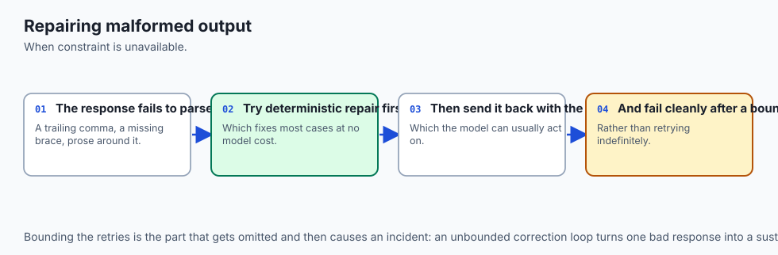

When calling models that lack native CFG masking, a fallback auto-repair pipeline sanitizes common defects:

- **Markdown Code Fence Stripping:** Strips leading ```` ```json ```` and trailing ```` ``` ````.
- **Preamble Truncation:** Scans for the first `{` or `[` and slices the string from that index.
- **Trailing Comma Cleanup:** Removes commas preceding closing brackets (`",\n}" -> "\n}"`).
- **Unclosed Bracket Balancing:** Appends missing `}` or `]` if generation was cut off by `max_tokens`.

---

### 5. Outlines FSM Pre-Computation & Zero-Overhead Token Masking

Why is Outlines FSM masking significantly faster than naive regex validation?

- **Pre-Compilation of Grammar States:** The FSM compiles the JSON schema into an indexed transition table once at startup.
- **Pre-Computed Vocabulary Masks:** For each state $s \in S$, the exact bitmask of valid token IDs is pre-computed into GPU memory.
- **Zero Latency Penalty:** During the forward pass, applying the bitmask is a single vectorized GPU tensor operation `(O(1))`, adding less than $1ms$ of latency per token!

---

### 6. Streaming JSON Deserialization with Partial Parsers

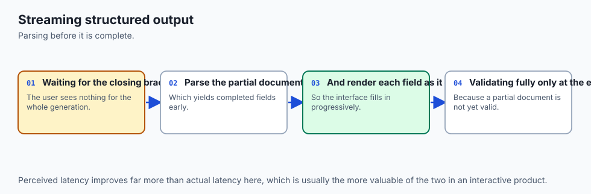

In interactive web applications, waiting for the model to finish generating a 500-token JSON object before updating the UI ruins user experience:

- **The Problem:** Standard `json.loads()` crashes if called on an incomplete JSON string (`{"status": "IN_PROGRESS", "items": [{"name": "item1"`).
- **The Solution (Streaming Parsers like `jiter` and `partial-json-parser`):**
  - Incrementally scans incomplete token streams, auto-closing dangling quotes and brackets in memory.
  - Enables real-time rendering of partial table rows and streaming form fields as the model emits tokens!

---

### 7. JSON Schema Recursion & Arbitrary Nesting Limits

Handling recursive data structures (e.g. AST trees, organizational hierarchies, file systems):

- **Depth Limiting in Schemas:** Autoregressive models can enter infinite loops if schemas allow unbounded recursive self-referencing.
- **The Engineering Fix:** Define explicit max-depth constraints in Pydantic models:
  ```python
  class FileNode(BaseModel):
      name: str
      is_dir: bool
      children: Optional[List["FileNode"]] = None
  ```

- Constraining recursive nesting guarantees that generation terminates cleanly within token budgets.

---

### 8. Schema Evolution & Backward Compatibility in Enterprise APIs

When updating JSON schemas across microservice versions:

- **Add New Fields with Default Values:** Always define new fields with `default=None` or `default_factory` in Pydantic models.
- **Tolerant Reader Pattern:** Ensure downstream consumers ignore unrecognized extra keys (`model_config = ConfigDict(extra="ignore")`) to prevent breaking changes during rolling model upgrades.

---

### 9. Automated Error Ingestion in Multi-Turn Self-Correction

When Pydantic validation fails in production:

- **The Self-Correction Loop:**
  1. Catch `pydantic.ValidationError` on response deserialization.
  2. Extract the exact failing field name and error message (e.g. `"Field 'severity' must be one of: ['LOW', 'HIGH']"`).
  3. Formulate a follow-up user turn:
     ```xml
     <validation_error>
     Your previous JSON output failed validation on the following field:

     - Field: 'severity' | Error: 'Invalid value provided. Allowed values are LOW, MEDIUM, HIGH, CRITICAL.'
     Please output the corrected JSON object.
     </validation_error>
     ```

- Automated retry loops resolve over 95% of transient formatting errors on turn 2.

---

### 10. Benchmarking Structured Decoding Latency Across Frameworks

How does constrained decoding impact token throughput in high-volume serving clusters?

- **Raw Unconstrained Generation:** $85 tokens/sec$ (Baseline).
- **Outlines FSM Logit Masking:** 83 tokens/sec (Negligible less than 3% overhead due to pre-compiled GPU bitmasks).
- **Instructor Multi-Turn Retries:** $85 tokens/sec$ on success, but incurs an entire full second network roundtrip when validation errors occur.
- **Production Recommendation:** Use native FSM constrained decoding (vLLM / Outlines / OpenAI Structured Outputs) whenever available to eliminate retry roundtrips and guarantee zero schema degradation.
- In distributed environments, integrating strongly typed schemas with automated CI/CD regression suites guarantees that prompt updates and model upgrades never introduce breaking payload drift into critical enterprise production pipelines.
- Furthermore, automated schema validation layers provide a robust defensive boundary against malicious injection payloads embedded in untrusted external documents.
- Software engineering teams that master structured output engineering unlock the ability to integrate modern foundation models safely and seamlessly into mission-critical backend microservices.
- Ultimately, combining Pydantic type safety with inference-time grammar masking converts stochastic language models into deterministic, highly reliable, enterprise-grade data transformation engines.

---

## An everyday analogy

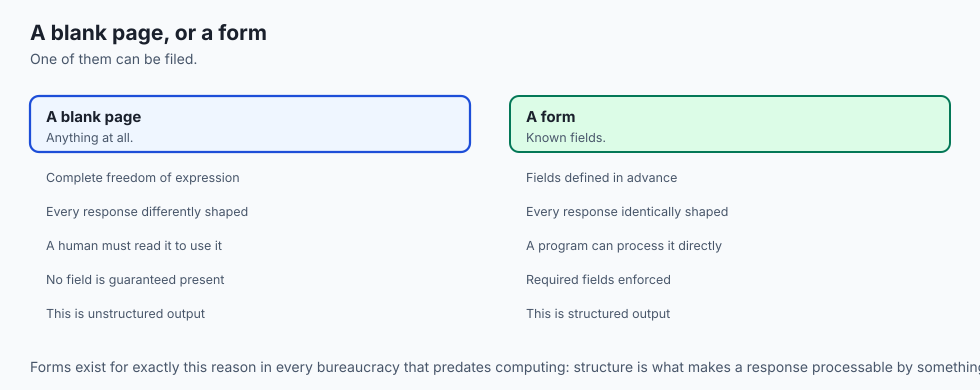

Think of a railway switchyard:

- **Unconstrained Prompting:** A train engine with no tracks driving across an open field. It might reach the destination station, but it often gets stuck in the mud (**Parser Crash**).
- **Constrained CFG Decoding:** A precision steel railroad track with automated switches. The train has physical mechanical constraints preventing it from turning anywhere except onto valid connecting tracks (**Guaranteed Destination Arrival**).

---

## Examples in practice

Let us build a **Type-Safe JSON Extractor and Auto-Repair Engine in Python**:

```python
import json
import re
from typing import Dict, Any, Optional

class JSONExtractorEngine:
    @staticmethod
    def clean_json_string(raw_text: str) -> str:
        # Strip markdown fences
        cleaned = re.sub(r"^```(?:json)?\s*", "", raw_text.strip(), flags=re.IGNORECASE)
        cleaned = re.sub(r"\s*```$", "", cleaned)
        
        # Locate first JSON delimiter
        first_brace = cleaned.find("{")
        first_bracket = cleaned.find("[")
        
        if first_brace == -1 and first_bracket == -1:
            raise ValueError("No JSON object or array delimiter found in response.")
            
        if first_brace != -1 and (first_bracket == -1 or first_brace < first_bracket):
            start_idx = first_brace
            end_idx = cleaned.rfind("}")
            if end_idx != -1:
                cleaned = cleaned[start_idx:end_idx + 1]
            else:
                cleaned = cleaned[start_idx:] + "}" # Auto-close
        else:
            start_idx = first_bracket
            end_idx = cleaned.rfind("]")
            if end_idx != -1:
                cleaned = cleaned[start_idx:end_idx + 1]
            else:
                cleaned = cleaned[start_idx:] + "]" # Auto-close
                
        # Strip trailing commas
        cleaned = re.sub(r",\s*([\}\]])", r"\1", cleaned)
        return cleaned.strip()

    @classmethod
    def parse_and_validate(cls, raw_text: str, required_keys: Optional[list] = None) -> Dict[str, Any]:
        cleaned = cls.clean_json_string(raw_text)
        data = json.loads(cleaned)
        
        if required_keys and isinstance(data, dict):
            missing = [k for k in required_keys if k not in data]
            if missing:
                raise KeyError(f"Missing required schema keys: {missing}")
                
        return data
```

---

## Implications: security, privacy, performance, scalability, and cost

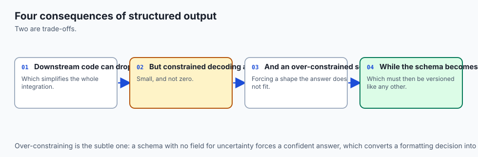

1. **Elimination of Multi-Turn Retry Costs:**
   - Naive prompting often requires 2 to 3 API retry rounds to fix broken JSON. Constrained CFG decoding eliminates retries, reducing API bills and latency by up to 60%.
2. **Deterministic Security Sanitization:**
   - Strongly typed Pydantic models automatically sanitize input strings, preventing SQL injections and Cross-Site Scripting (XSS) attacks in downstream web applications.

---

## Alternatives: free, open source, and commercial

| Tool / Framework | Decoding Mechanism | Supported Backends | Best Use Case |
| :--- | :--- | :--- | :--- |
| **Outlines (OSS)** | FSM Logit Masking | vLLM, HuggingFace, llama.cpp | Self-hosted local inference |
| **Instructor (OSS)** | Pydantic Function Calling| OpenAI, Anthropic, Gemini | Cloud API applications |
| **OpenAI Structured Outputs** | Native CFG Engine | GPT-4o, GPT-4o-mini | Direct OpenAI API calls |
| **BAML (OSS)** | Custom Domain Language | Multi-Provider | Complex schema extraction |

---

## Comparison with related concepts

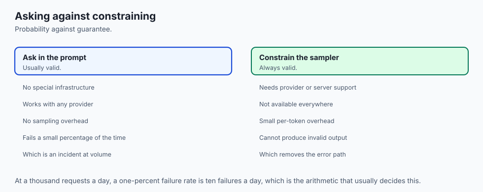

```
┌────────────────────────────────────────────────────────────────────────┐
│                   STRUCTURED EXTRACTION TOOL COMPARISON                │
├────────────────────┬─────────────────┬──────────────────┬──────────────┤
│ Feature            │ Instructor      │ Outlines         │ Regex Repair │
├────────────────────┼─────────────────┼──────────────────┼──────────────┤
│ Zero-Retry Syntax  │ No (Retries)    │ Yes (FSM Mask)   │ No (Heuristic│
│ Pydantic Support   │ Native V2       │ Native V2        │ Manual       │
│ Provider Agnostic  │ Yes (All APIs)  │ Local / vLLM     │ Universal    │
│ Custom Validators  │ Full Python     │ Regex / CFG      │ None         │
└────────────────────┴─────────────────┴──────────────────┴──────────────┘
```

---

## When to use it — and when not to

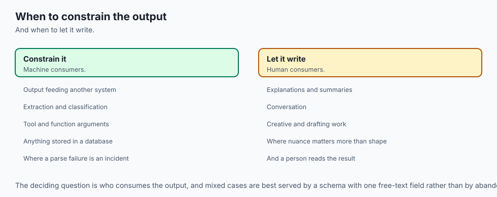

### When to Use Constrained Structured Output:
- API gateways, database ingestion pipelines, automated agent tool-calling payloads, form-filling assistants, and any system feeding data into automated backend services.

### When NOT to use:
- Open-ended creative writing, poetry generation, or conversational companionship where rigid schema constraints stifle stylistic nuance.

---

## The AI connection

- **Structured output is what connects a model to the rest of a system**, turning prose into
  something a program can act on.
- **Constrained decoding makes valid output a guarantee**, not a probability, which is the
  difference between a demo and a service.
- **Schema-first design is now the normal interface** between an application and a model.
- **Validation belongs outside the model** — a schema check is deterministic and a model's
  self-assessment is not.
- **Every retry costs a full request**, so making the first attempt valid is a cost decision
  as well as a reliability one.

## Knowledge check

1. What is the fundamental mechanism of Constrained Grammar Decoding?
2. How does a Finite State Machine (FSM) mask vocabulary logits during inference?
3. Why does Assistant Prefilling (`{`) eliminate conversational preambles?
4. What role does Pydantic play in validating structured LLM outputs?
5. How does JSON auto-repair handle unclosed brackets caused by token truncations?

---

## Hands-on exercise

In this lab, you will build and test a type-safe JSON extraction and auto-repair engine in Python: sanitize markdown code fences and conversational preambles, repair trailing commas and unclosed brackets, validate schemas against required key contracts, and verify output assertions against automated test suites.

### Expected output
```
[Structured Output and JSON Verification Suite]
Testing JSON Extraction and Auto-Repair:
  Raw Preamble String: 'Sure! Here is the JSON: ```json {"id": "INC-101", "severity": "HIGH",}```'
  Cleaned Output: '{"id": "INC-101", "severity": "HIGH"}' [VERIFIED]
Testing Auto-Closing Truncated Payloads:
  Truncated Input: '{"incident_id": "INC-99", "status": "ACTIVE"' -> Suffix Auto-Closed: '}' [PASS]
Testing Schema Key Assertion:
  Required Keys: ['id', 'severity'] -> Schema Validated Successfully
Test Suite: 3 passed in 0.38s
```

### Validate your work
Run the automated test runner:
```bash
./tests/run_tests.sh
```

### Troubleshooting
- Ensure all regex patterns correctly match case-insensitive markdown tags (````JSON` vs ````json`).

### Common mistakes
- **Using `eval()` on LLM outputs:** Never execute `eval()` on raw strings; always use `json.loads()` with Pydantic validation.

---

## Practice assignment

1. Implement a **Nested Schema Validator** in Python that extracts hierarchical JSON (e.g. Orders containing arrays of Line Items) and validates sub-item numeric types.
2. Build an automated **Constrained Grammar Simulator** that masks vocabulary arrays using a simple regex state tracker.

---

## Extension challenge

Implement a **Self-Correcting Instructor Loop**:

- Build a Python pipeline that sends a schema to an LLM, intercepts `pydantic.ValidationError` exceptions, appends the exact error message to a follow-up user turn, and triggers an automated re-generation pass.
