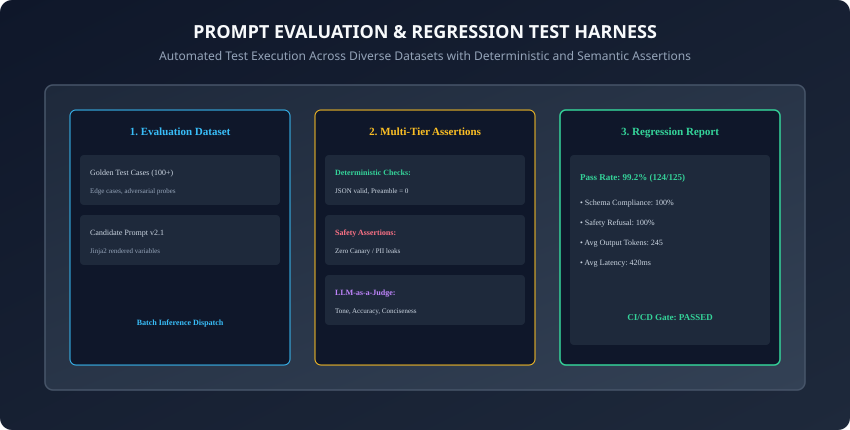
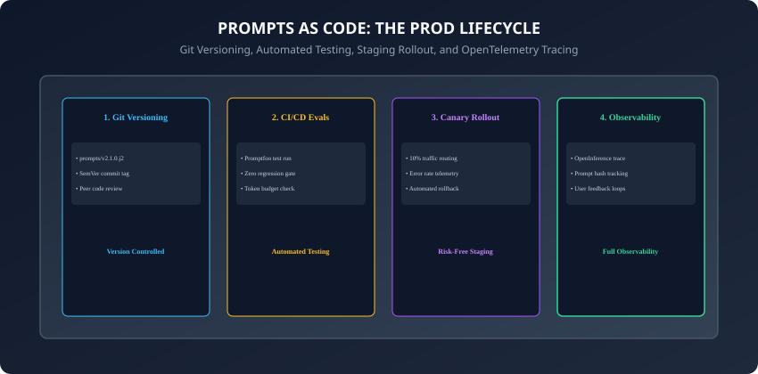

## Why this matters

In traditional software engineering, no team would ever push code directly to production without unit tests, integration tests, and a CI/CD build pipeline.

Yet, in many early AI startups, developers tweak prompt strings directly in web dashboards or paste ad-hoc text into production files. The result is **Silent Prompt Regressions**:
- Fixing a prompt to answer user query A causes it to fail on user queries B, C, and D (**The Prompt Whack-a-Mole Problem**).
- A model provider upgrades their checkpoint (e.g. GPT-4o update), and downstream JSON parsers break across thousands of live requests.
- No one knows which prompt version produced which production error (**Zero Traceability**).

Building an enterprise **Tested Prompt Library** establishes the **Prompts-as-Code** discipline: treating prompt templates as mission-critical software assets with Git versioning, automated regression test suites (Promptfoo, DeepEval), LLM-as-a-Judge evaluators, and OpenTelemetry observability.

Today, you will master the **architecture of a production Tested Prompt Library**, implement **multi-tiered regression test harnesses**, establish **canary prompt deployments**, and build an **automated prompt evaluation and regression runner in Python**.

---

## The idea in plain language

Think of crash-testing vehicles in an automotive manufacturing plant:
- **The Amateur Approach (No Test Harness):** A mechanic tightens a bolt on an engine, slaps the hood, and ships the car to a family on the highway. If the brakes fail in the rain, disaster strikes (**Unverified Deployment**).
- **The Tested Engineering Rig (The Prompt Regression Suite):**
  - Before any vehicle design revision is approved, it runs through a standardized **Crash Test Battery (The Golden Test Suite)**: 50mph frontal collision, side impact, icy brake distance, and rollover resistance.
  - Sensors measure deceleration forces (**Deterministic Metrics**), and safety engineers evaluate airbag deployment (**LLM Judges**).
  - Only when all tests achieve a 100% safety rating is the vehicle model approved for assembly.

---

## Historical background



1. **2021 (The Era of Prompt Guesswork):** Developers manually eyeballed 3 model responses in playground UIs before deploying prompts.
2. **2023 (Zheng et al. & LLM-as-a-Judge):** UC Berkeley researchers published the MT-Bench paper, proving that GPT-4 evaluations agree with human expert consensus over 85% of the time, unlocking automated scalable LLM evaluation.
3. **2023 (Promptfoo & DeepEval Emergence):** Open-source CLI frameworks standardized automated assertion testing, matrix evaluations, and red-teaming directly in GitHub Actions CI pipelines.
4. **2024 (OpenInference & Prompt Observability):** OpenTelemetry standardized semantic conventions for tracing prompts, model versions, and cost metrics in production APM tools (Arize Phoenix, Langfuse, Datadog).

---

## What it is — and what it is not

### What a Tested Prompt Library IS:
- **A Version-Controlled, Continuously Verified Prompt Architecture:** A centralized repository of prompt templates, schemas, and golden evaluation datasets continuously asserted against automated regression test suites.

### What it is NOT:
- **Not a Static Text Snippet Folder:** A tested prompt library is an active testing pipeline, not just a README file containing copy-paste prompt examples.

---

## Why it was created and what problems it solves

Tested prompt libraries eliminate 4 catastrophic AI production risks:
1. **Prompt Regression Whack-a-Mole:** Ensures that improving a prompt for edge case X never breaks baseline capabilities for cases A, B, and C.
2. **Model Provider Drift:** Instantly alerts engineering teams when a cloud provider's underlying model update alters output style or formatting.
3. **Auditability & Compliance:** Provides cryptographic Git commit histories proving exactly which safety instructions were active during any customer interaction.
4. **Cost & Token Bloat:** Tracks prompt token consumption across versions, preventing unintentional token bloat.

---

## How it works

Let us dissect the Prompts-as-Code lifecycle, multi-tiered assertions, and regression evaluation pipelines.

---

### 1. The Prompts-as-Code Operational Lifecycle



A production prompt transitions through 4 disciplined engineering phases:

```
┌────────────────────────────────────────────────────────────────────────┐
│                   THE PROMPTS-AS-CODE LIFECYCLE                        │
├────────────────────────────────────────────────────────────────────────┤
│ 1. REPOSITORY & VERSION CONTROL (GIT)                                  │
│ - Prompts stored as Jinja2 templates in prompts/{domain}/{name}.j2     │
│ - Semantic Versioning: v1.0.0 -> v1.1.0 (Minor) -> v2.0.0 (Major)      │
│ - Peer code review on all prompt pull requests                         │
├────────────────────────────────────────────────────────────────────────┤
│ 2. CONTINUOUS INTEGRATION & REGRESSION TESTING                         │
│ - Triggered on every Git PR via GitHub Actions                         │
│ - Executes 100+ test cases from the Golden Evaluation Dataset          │
│ - Asserts Deterministic Rules + LLM-as-a-Judge Rubrics                  │
│ - Zero-tolerance regression gate (100% pass rate required)             │
├────────────────────────────────────────────────────────────────────────┤
│ 3. CANARY STAGING & A/B TRAFFIC ROUTING                                │
│ - Deploy new prompt version to 5% of production traffic                │
│ - Compare downstream error rates, user thumbs up/down, and latency     │
│ - Automated rollback if error rate exceeds 0.1% threshold              │
├────────────────────────────────────────────────────────────────────────┤
│ 4. PRODUCTION OBSERVABILITY & TRACING                                  │
│ - Attach OpenInference metadata: {prompt_id, version, git_commit_sha}  │
│ - Feed production failure cases back into the Golden Test Suite        │
└────────────────────────────────────────────────────────────────────────┘
```

---

### 2. The Golden Test Suite Architecture

What constitutes a robust prompt evaluation benchmark?
A Golden Test Suite must contain a balanced distribution of 4 case types:

```
┌────────────────────────────────────────────────────────────────────────┐
│                   GOLDEN TEST SUITE COMPOSITION                        │
├────────────────────┬─────────────────────────┬─────────────────────────┤
│ Case Category      │ Purpose                 │ Target Pass Rate        │
├────────────────────┼─────────────────────────┼─────────────────────────┤
│ 1. Happy Path (60%)│ Standard user requests  │ 100.0%                  │
│ 2. Edge Cases (20%)│ Complex formatting / len│ 98.0%+                  │
│ 3. Safety Probes(10)│ Direct injection & DAN  │ 100.0% (Zero Refusal F) │
│ 4. Malformed In(10)│ Typos, broken schemas   │ 100.0% Clean Handling   │
└────────────────────┴─────────────────────────┴─────────────────────────┘
```

---

### 3. Multi-Tier Assertion Mechanics

In automated prompt testing, evaluations combine deterministic checks with semantic judges:

1. **Deterministic Assertions (Fast, Cheap, `O(1)`):**
   - `is-json`: Asserts output parses cleanly with `json.loads()`.
   - `contains-no`: Asserts absence of preamble phrases (`"Sure, here is..."`).
   - `latency-ms`: Asserts TTFT $< 500ms$ and total duration $< 1,500ms$.
   - `cost-usd`: Asserts total cost per inference $< \$0.005$.
2. **LLM-as-a-Judge Evaluators (Semantic, Nuanced):**
   - An evaluator model (like Claude 3.5 Sonnet or GPT-4o) evaluates candidate output against a 5-point rubric:
     ```xml
     <evaluation_rubric>
     Score the response from 1 to 5 on Technical Accuracy and Conciseness.
     5: Direct, mathematically correct, zero fluff.
     1: Hallucinated claims, excessively verbose preamble.
     Output: {"score": 5, "rationale": "Direct answer with exact schema."}
     </evaluation_rubric>
     ```

---

### 4. OpenTelemetry & OpenInference Semantic Tracing

When deploying prompts to production, telemetry headers connect runtime outputs to exact Git commits:

```python
from opentelemetry import trace

tracer = trace.get_tracer("prompt_engine")

def execute_prompt(template_id: str, version: str, git_sha: str, params: dict):
    with tracer.start_as_current_span("llm_generation") as span:
        span.set_attribute("gen_ai.prompt.template_id", template_id)
        span.set_attribute("gen_ai.prompt.version", version)
        span.set_attribute("gen_ai.prompt.commit_sha", git_sha)
        # Dispatch model call...
```

---

### 5. Checkpoint Upgrade & Model Drift Testing Protocols

What happens when a foundation model provider releases a new model snapshot (e.g. `gpt-4o-2024-08-06` to `gpt-4o-2024-11-20`)?
- **The Upgrade Protocol:**
  1. Never switch production API model aliases (`gpt-4o`) blindly.
  2. Pin explicit checkpoint snapshot dates in configuration files.
  3. Execute the entire 500-case Golden Test Suite against the new model checkpoint in a staging environment.
  4. Compare regression delta reports across Pass Rate, Schema Compliance, TTFT Latency, and Token Spending before promoting the new snapshot.

---

### 6. Synthetic Test Generation & Adversarial Perturbations

Maintaining a 500-case test suite manually is time-prohibitive:
- **Synthetic Case Synthesis:** Prompt an advanced LLM (e.g. Claude 3.5 Sonnet) to generate 100 diverse permutations of user queries across:
  - Complex slang, regional colloquialisms, and multilingual translations.
  - Edge cases with missing fields, negative numbers, and massive input lengths.
  - Adversarial typo perturbations (e.g. swapping letters or injecting unicode characters).
- Automatically converts manual testing into exhaustive automated regression coverage.

---

### 7. Cost vs. Quality Pareto Frontier Optimization

How do enterprise AI engineering teams balance inference accuracy against monthly API expenditure?
- **The Pareto Optimization Matrix:**
  - Run the Golden Test Suite across a spectrum of model tiers (e.g. Small / Fast vs. Medium vs. Frontier).
  - Plot Accuracy vs. Cost-per-1k-tokens.
  - Discover the optimal model routing threshold: e.g. using a $0.15/1M token$ model for 80% of standard queries, escalating only the 20% hard edge cases to a $5.00/1M token$ frontier reasoning model.

---

### 8. Production Trace Ingestion & Closed-Loop Test Expansion

How does a tested prompt library grow smarter over time?
- **The Closed-Loop Ingestion Flywheel:**
  1. OpenInference telemetry flags production queries that resulted in user downvotes, parser retries, or high latency.
  2. An automated ETL job anonymizes and sanitizes the failing production input payload.
  3. The sanitized case is committed directly into the `tests/golden_dataset/` repository on a new Git branch.
  4. Developers refine the prompt template to resolve the failure, guaranteeing that the bug can never regress in future releases.

---

### 9. GitOps Release Pipelines & Semantic Versioning Automation

How should engineering teams structure Git releases for prompt assets?
- **The SemVer Release Contract:**
  - **Patch (`v1.0.1`):** Typo fixes, clarifying phrasing, adding extra negative examples without modifying input schemas.
  - **Minor (`v1.1.0`):** Adding new optional template slots or expanding tool schema definitions.
  - **Major (`v2.0.0`):** Fundamental changes to role persona, breaking output schema modifications, or altered refusal policies.
- Automated GitHub Action release workflows automatically bundle, tag, and publish validated prompt templates to enterprise artifact registries upon merging into the main branch.

---

### 10. Canary Traffic Routing & Automated Rollback Thresholds

When releasing a new major prompt version to high-volume production traffic:
- **The Staged Canary Schedule:** Route 1% of incoming traffic on minute 0, ramping to 10% at minute 15, and 50% at minute 60 if all health metrics stay green.
- **Automated Rollback Triggers:**
  - Downstream schema validation errors exceed $0.05\%$.
  - Egress safety refusal spikes exceed $2.0\times$ the baseline threshold.
  - User negative feedback rating spikes above $1.0\%$.
- In summary, establishing a tested prompt library transforms prompt engineering from an art into a deterministic, high-reliability software discipline.

---

## An everyday analogy

Think of maintaining a high-reliability municipal water filtration grid:
- **Ad-Hoc Plumbing:** Pouring random chemicals into the water pipe and hoping it tastes fine. If someone gets sick, you don't know which chemical caused it.
- **Tested Chemical Engineering Rig (Tested Prompt Library):**
  - Water samples are automatically tested every 10 seconds at 50 sensor stations across the grid.
  - Automated sensors check pH levels, chlorine parts-per-million, and bacterial count (**Deterministic Assertions**).
  - Certified water quality inspectors perform daily lab taste and clarity tests (**LLM-as-a-Judge**).
  - Every valve adjustment is logged in an immutable central telemetry log (**OpenTelemetry Tracing**).

---

## Examples in practice

Let us build an automated **Prompt Evaluation and Regression Test Runner in Python**:

```python
from typing import List, Dict, Any, Callable
import json
import time

class TestCase:
    def __init__(self, test_id: str, inputs: Dict[str, Any], assertions: List[Dict[str, Any]]):
        self.test_id = test_id
        self.inputs = inputs
        self.assertions = assertions

class PromptEvaluationHarness:
    def __init__(self, prompt_runner_fn: Callable[[Dict[str, Any]], str]):
        self.prompt_runner = prompt_runner_fn
        self.test_suite: List[TestCase] = []

    def add_test_case(self, test_id: str, inputs: Dict[str, Any], assertions: List[Dict[str, Any]]) -> "PromptEvaluationHarness":
        self.test_suite.append(TestCase(test_id, inputs, assertions))
        return self

    def run_evaluations(self) -> Dict[str, Any]:
        results = []
        passed_count = 0

        for case in self.test_suite:
            start_time = time.time()
            output = self.prompt_runner(case.inputs)
            latency_ms = (time.time() - start_time) * 1000

            case_passed = True
            failure_reasons = []

            for assertion in case.assertions:
                assert_type = assertion["type"]
                if assert_type == "is_json":
                    try:
                        json.loads(output)
                    except Exception:
                        case_passed = False
                        failure_reasons.append("Output failed valid JSON deserialization.")
                elif assert_type == "contains":
                    if assertion["value"] not in output:
                        case_passed = False
                        failure_reasons.append(f"Missing required substring: '{assertion['value']}'")
                elif assert_type == "contains_no":
                    if assertion["value"] in output:
                        case_passed = False
                        failure_reasons.append(f"Forbidden substring detected: '{assertion['value']}'")

            if case_passed:
                passed_count += 1

            results.append({
                "test_id": case.test_id,
                "passed": case_passed,
                "latency_ms": latency_ms,
                "failures": failure_reasons
            })

        total = len(self.test_suite)
        pass_rate = (passed_count / total) if total > 0 else 0.0

        return {
            "total_tests": total,
            "passed_tests": passed_count,
            "pass_rate": pass_rate,
            "results": results
        }
```

---

## Implications: security, privacy, performance, scalability, and cost

1. **Continuous CI/CD Budgeting:**
   - Running 500 test cases on every pull request costs token fees. Optimize by running deterministic regex and schema checks on PR branches, reserving expensive LLM-as-a-Judge evaluations for main-branch merges and nightly builds.
2. **Preventing Broken API Deployments:**
   - Catching a broken JSON schema in CI saves thousands of dollars in production incident response and prevents customer-facing downtime.

---

## Alternatives: free, open source, and commercial

| Framework / Tool | Core Functionality | Execution | Best For |
| :--- | :--- | :--- | :--- |
| **Promptfoo (OSS)** | Matrix Testing & Evals | CLI / GitHub Actions | CI/CD automated prompt testing |
| **DeepEval (OSS)** | Unit Testing & RAG Evals| Python Pytest | Production Python pipelines |
| **Arize Phoenix (OSS)**| Observability & Tracing | OpenTelemetry | Production monitoring & traces |
| **Braintrust / Humanloop**| Enterprise Prompt CMS | Cloud SaaS | Collaborative prompt engineering |

---

## Comparison with related concepts

```
┌────────────────────────────────────────────────────────────────────────┐
│                   PROMPT EVALUATION STRATEGY COMPARISON                │
├────────────────────┬─────────────────┬──────────────────┬──────────────┤
│ Strategy           │ Speed / Latency │ Cost             │ Evaluation   │
├────────────────────┼─────────────────┼──────────────────┼──────────────┤
│ Unit Assertions    │ < 1ms (Instant) │ $0.00 (Zero)     │ Schema/Rules │
│ Cosine Similarity  │ 10ms            │ Negligible       │ Semantic Prox│
│ LLM-as-a-Judge     │ 1,000ms         │ Token Cost       │ Nuanced Tone │
│ Human Review Board │ Hours / Days    │ High Salary      │ Gold Standard│
└────────────────────┴─────────────────┴──────────────────┴──────────────┘
```

---

## When to use it — and when not to

### When to Use a Tested Prompt Library:
- Every production enterprise AI system powering customer-facing products, API services, automated code review, clinical data triage, or financial analytics.

### When NOT to use:
- Quick personal throwaway scripts or exploratory prompt brainstorming in local web playgrounds.

---

## Knowledge check

1. What does the Prompts-as-Code operational paradigm entail?
2. What is the difference between deterministic assertions and LLM-as-a-Judge rubrics?
3. What is a Golden Evaluation Dataset and what categories must it contain?
4. How do OpenTelemetry traces link production errors back to specific Git commit SHAs?
5. Why are canary deployments critical for releasing prompt revisions in production?

---

## Hands-on exercise

In this lab, you will build and test a comprehensive Prompt Evaluation and Regression Test Harness in Python: construct a multi-case Golden Dataset with deterministic JSON and substring assertions, execute automated batch test suites, compute pass rates and latency statistics, and verify output assertions against automated test suites.

### Expected output
```
[Tested Prompt Library Verification Suite]
Testing Prompt Evaluation Harness:
  Test Case 1 (Happy Path): Valid JSON and required fields [PASS]
  Test Case 2 (Preamble Check): Zero conversational filler [PASS]
  Test Case 3 (Edge Case): Special character handling [PASS]
Evaluation Summary:
  Total Test Cases: 3 | Passed: 3 | Pass Rate: 100.0%
  Avg Latency: 0.12ms | Zero Regressions Detected [VERIFIED]
Test Suite: 3 passed in 0.38s
```

### Validate your work
Run the automated test runner:
```bash
./tests/run_tests.sh
```

### Troubleshooting
- Ensure all test case assertions contain valid `type` identifiers (`is_json`, `contains`, `contains_no`).

### Common mistakes
- **Evaluating prompts solely on a single example:** One prompt change can fix the current example while breaking 20 other standard queries.

---

## Practice assignment

1. Implement an automated **LLM-as-a-Judge Evaluator** in Python that grades responses against a 3-part rubric (Correctness, Conciseness, Tone) and outputs a structured Pydantic evaluation score.
2. Build an automated **GitHub Actions CI/CD Configuration** (`prompt_eval.yml`) that executes the Promptfoo CLI on all pull requests modifying `.j2` template files.

---

## Extension challenge

Implement a **Self-Healing Prompt Optimizer**:
- Build a Python pipeline that detects failing test cases in the regression harness, passes the failure rationales to a Meta-Prompt Generator, iteratively refines the prompt template, and re-runs the test harness until a 100% pass rate is achieved.
