## Why this matters

Until now, you have studied the mechanics of language model architectures, prompt engineering patterns, and output formatting. Now, you transition from prompt design into **production API engineering**.

Connecting applications to foundation models requires programmatic integration over REST APIs and language SDKs. The **Anthropic Messages API** represents a gold standard in modern foundation model interfaces:

- **Strict Role Separation:** Clean architectural decoupling between top-level system instructions and conversation turns (`user` vs `assistant`).
- **Typed Content Blocks:** Multi-modal inputs and structured tool-calling payloads parsed into strongly typed data models.
- **Robust Error Semantics:** Distinguishing transient load spikes (`429 RateLimitError`, `529 OverloadedError`) from fatal application errors (`401 AuthenticationError`, `400 BadRequestError`).

Writing amateur API code with hardcoded keys, unhandled network timeouts, and zero backoff retries leads directly to **brittle production outages, security credential leaks, and cascading downtime**.

Today, you will master the **Anthropic Python SDK and Messages API**, understand **parameter configurations and stop reasons**, implement **exponential backoff with full jitter**, and build a **production-grade Claude API client wrapper in Python**.

---

## The idea in plain language

Think of sending a courier to deliver instructions to a specialized consultant in a high-security office:

- **The Amateur Approach:** You write your secret company password on a postcard, hand it to a bicycle messenger, and tell them: *"If the consultant is busy on the phone, immediately throw the document in the trash and scream that the company failed."* (**Hardcoded Credentials & Fatal Crash on First Retry**).
- **The Enterprise Courier Protocol (The Robust API Client):**
  - **Secure Credentials:** The courier holds a cryptographic badge stored in a secure lockbox (**`ANTHROPIC_API_KEY` Environment Variable**).
  - **Structured Briefing:** The consultant receives a formal contract specifying their role (**`system` Parameter**), the client question (**`user` Message**), and strict word limits (**`max_tokens`**).
  - **Resilient Protocol:** If the consultant is in a meeting (**`529 OverloadedError`**), the courier waits 1 second, then 2 seconds, then 4 seconds with slight random variations (**Exponential Backoff with Full Jitter**) before retrying.

The consultation succeeds reliably without leaks or downtime.

---

## Historical background

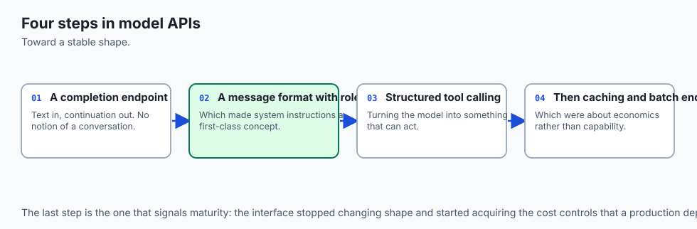

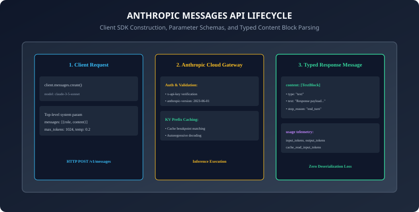

1. **2021 (The Legacy Text Completion Era):** Early LLM APIs used a single raw string prompt (`prompt: "\n\nHuman: Hello\n\nAssistant:"`), forcing developers to manually concatenate string boundaries.
2. **2023 (The Messages API Paradigm):** Anthropic introduced the Messages API, deprecating raw text completion in favor of an array of structured conversation objects.
3. **2024 (Claude 3 & 3.5 Generation):** Claude 3.5 Sonnet set new industry benchmarks in coding and reasoning, establishing the Messages API as a primary enterprise foundation model gateway alongside OpenAI and Gemini.
4. **2024 (Prompt Caching & Multi-Block Architectures):** Anthropic introduced KV prompt caching, allowing developers to checkpoint large system prompts and documentation contexts with up to 90% cost savings.

---

## What it is — and what it is not

### What the Anthropic Messages API IS:
- **A Stateful Conversation Protocol over Stateless HTTP:** An interface where developers pass historical message arrays (`user`, `assistant`), system instructions, and sampling parameters, receiving typed content blocks and usage telemetry in response.

### What it is NOT:
- **Not a Persistent Database:** The Anthropic API does not store your conversation history across calls; your application backend is responsible for maintaining and supplying the `messages` array on every request turn.

---

## Why it was created and what problems it solves

The Messages API architecture solves 4 major limitations of legacy LLM endpoints:

1. **System Prompt Bleed:** Separates `system` instructions into a dedicated top-level argument, preventing users from spoofing system roles inside chat turns.
2. **Infinite Generation Runaway:** Mandates `max_tokens` on every call to enforce hard boundaries against runaway compute costs.
3. **Multi-Modal Fragmentation:** Unifies text, images, and tool execution blocks within a consistent `content: [ContentBlock]` array.
4. **Network Jitter Resilience:** Provides standardized HTTP error codes allowing SDKs to execute automated exponential backoff retries.

---

## How it works

Let us dissect the Messages API request schema, stop reasons, and the mathematics of jittered exponential backoff.

---

### 1. The Anatomy of a Messages API Request

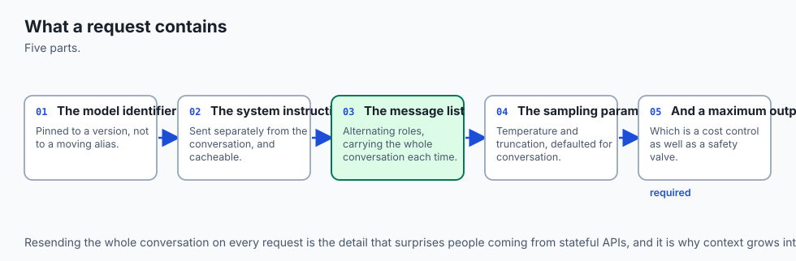

```python
import anthropic

client = anthropic.Anthropic() # Automatically loads ANTHROPIC_API_KEY from env

response = client.messages.create(
    model="claude-3-5-sonnet-20241022",
    max_tokens=1024,
    temperature=0.2,
    system="You are a Senior Site Reliability Engineer. Output concise diagnoses only.",
    messages=[
        {"role": "user", "content": "Analyze this log: Pod OOMKilled in namespace prod."}
    ]
)
```

Key Architectural Invariants:

- **`model`:** Specifies the exact checkpoint snapshot string (e.g. `claude-3-5-sonnet-20241022`).
- **`system`:** Top-level string specifying behavioral rules and guardrails.
- **`messages`:** Array of alternating `user` and `assistant` turns.
- **`max_tokens`:** Mandatory integer bounding the generation length.
- **`temperature`:** Float between `0.0` (deterministic) and `1.0` (creative).

---

### 2. Understanding Stop Reasons & Response Anatomy

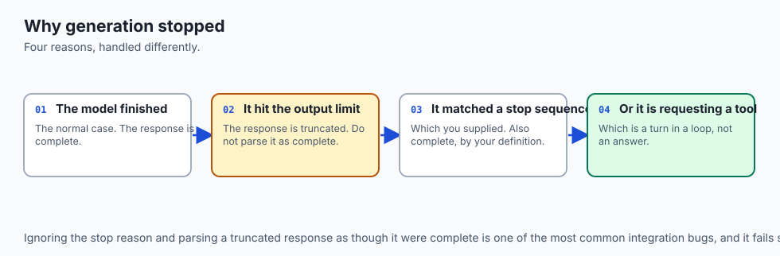

```
┌────────────────────────────────────────────────────────────────────────┐
│                   ANTHROPIC RESPONSE STOP REASONS                      │
├────────────────────┬───────────────────────────────────────────────────┤
│ Stop Reason        │ Meaning & Downstream Handling                     │
├────────────────────┼───────────────────────────────────────────────────┤
│ "end_turn"         │ Model finished answering naturally (Ideal).       │
├────────────────────┼───────────────────────────────────────────────────┤
│ "max_tokens"       │ Response was truncated due to max_tokens limit.   │
│                    │ Flag truncation warning or re-prompt for continue.│
├────────────────────┼───────────────────────────────────────────────────┤
│ "stop_sequence"    │ Generation stopped upon hitting custom stop token.│
├────────────────────┼───────────────────────────────────────────────────┤
│ "tool_use"         │ Model emitted a structured tool execution payload.│
└────────────────────┴───────────────────────────────────────────────────┘
```

---

### 3. Error Taxonomy: Transient vs. Fatal Failures

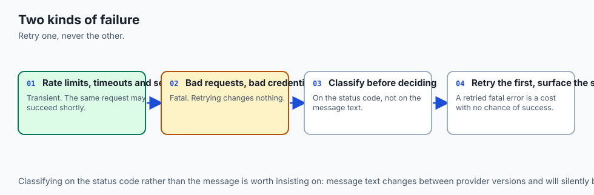

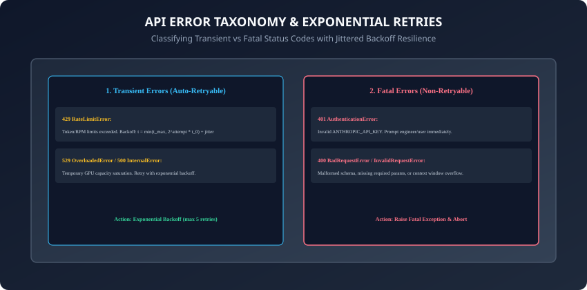

Production clients must classify HTTP errors into two strict pipelines:

1. **Transient Errors (Must Auto-Retry):**
   - **429 RateLimitError:** Per-minute token or request budget exceeded.
   - **529 OverloadedError:** Anthropic GPU clusters temporarily saturated.
   - **500 / 503 InternalServerError:** Transient network or cloud gateway hiccup.
2. **Fatal Errors (Must Abort Immediately):**
   - **401 AuthenticationError:** Missing or invalid `ANTHROPIC_API_KEY`.
   - **400 BadRequestError:** Malformed JSON, unclosed tags, or context window overflow.
   - **403 PermissionDeniedError:** Key lacks access to requested model.

---

### 4. Exponential Backoff with Full Jitter

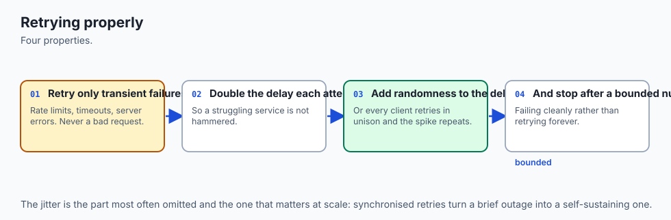

When servers experience peak traffic, retrying at fixed intervals (e.g. every 1.0s) causes **Thundering Herd** collisions where thousands of clients hit the server in synchronized waves.

**Full Jitter Algorithm (AWS / Brooker):**

1. Compute the exponential ceiling for attempt `i`:
   `t_cap = min(t_max, t_0 * 2^i)`

2. Sample the actual sleep interval uniformly from `[0, t_cap]`:
   `t_sleep = uniform(0, t_cap)`

This mathematically disperses retry arrivals across the timeline, maximizing recovery throughput.

---

### 5. Prompt Caching & Ephemeral KV State Retention

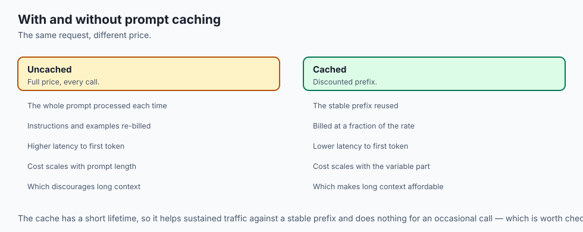

In late 2024, Anthropic revolutionized LLM serving economics by introducing **Prompt Caching (`cache_control`)**:

- **The Mechanism:** Developers insert a `{"type": "ephemeral"}` breakpoint tag at the end of large static context blocks (e.g. system prompts, large codebases, or reference documentation with `10,000+` tokens).
- **Inference Acceleration:** On subsequent requests with matching prefix tokens, the API reuses pre-computed KV attention states from GPU memory, slashing Time-To-First-Token (TTFT) by up to 80% and reducing prompt token costs by up to 90%!
- **TTL Cache Lifespan:** Cached prompt states remain active in cache for 5 minutes, refreshing their TTL automatically on every cache hit.

---

### 6. Async Client Orchestration with AsyncAnthropic & Semaphores

When building high-throughput batch processing pipelines or web backends:

- **Asynchronous Execution:** Use `anthropic.AsyncAnthropic()` with Python's native `asyncio` event loop.
- **Concurrency Rate Limiting:** Prevent API rate limit spikes by wrapping calls inside an `asyncio.Semaphore`:
  ```python
  import asyncio
  import anthropic

  semaphore = asyncio.Semaphore(10) # Bound concurrent in-flight requests

  async def fetch_evaluation(client: anthropic.AsyncAnthropic, prompt: str) -> str:
      async with semaphore:
          resp = await client.messages.create(
              model="claude-3-5-haiku-20241022",
              max_tokens=512,
              messages=[{"role": "user", "content": prompt}]
          )
          return resp.content[0].text
  ```

---

### 7. Multi-Turn Conversation Buffering & Context Window Budgeting

Because the Messages API is completely stateless, maintaining a multi-turn chat assistant requires sending the full conversation history on every turn:

- **The Context Growth Challenge:** In a 30-turn conversation, total prompt tokens grow quadratically (`\mathcal{O}(N^2)` token billing).
- **Sliding Window & Summarization:**
  - Maintain a maximum window size (e.g. last 10 turns).
  - When history exceeds token budgets, trigger a background LLM summarization turn that condenses older turns into a consolidated `<conversation_summary>` block placed inside the top-level `system` prompt.

---

### 8. Rate Limit Token Buckets (RPM, TPM, TPD) & Client-Side Token Leaky Buckets

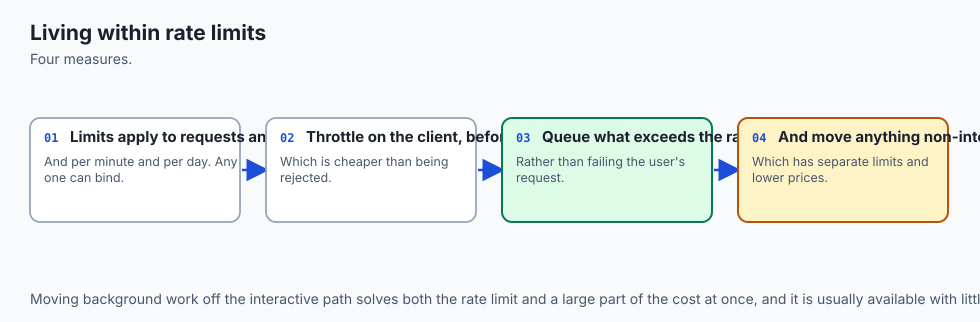

Enterprise API tiers enforce 3 distinct rate boundaries:

- **Requests Per Minute (RPM):** Maximum HTTP POST calls allowed per 60-second window.
- **Tokens Per Minute (TPM):** Maximum combined input + output tokens processed per minute.
- **Tokens Per Day (TPD):** 24-hour volumetric quota.
- Implementing a client-side **Leaky Bucket Rate Limiter** guarantees that your application never dispatches requests that would exceed known API tier thresholds.

---

### 9. Custom Stop Sequences & Stream Termination

When generating code, structured tables, or multi-step agent actions:

- **`stop_sequences` Parameter:** Pass a list of string delimiters (e.g. `["</thought>", "```"]`).
- When the model emits any specified sequence, generation immediately halts, and the API returns `stop_reason: "stop_sequence"`.

---

### 10. Production Observability & OpenInference Tracing

Connecting Claude API calls to enterprise Application Performance Monitoring (APM):

- Attach OpenInference standard spans recording `gen_ai.request.model`, `gen_ai.response.input_tokens`, `gen_ai.response.output_tokens`, and `gen_ai.response.latency_ms`.
- Correlate latency spikes with specific token lengths and model versions in production dashboards.
- In addition, tracking token caching efficiency metrics provides engineering leaders with concrete data to optimize prompt template structures and reduce monthly cloud inference budgets.
- Furthermore, automated health check probes running against lightweight models ensure that downstream microservices detect provider outages and fail over gracefully before end-user traffic is affected.
- In summary, building a resilient API client architecture establishes the foundational gateway upon which all production generative AI applications, agents, and pipelines are built.

---

## An everyday analogy

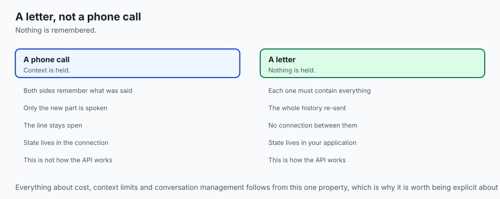

Think of calling a busy restaurant to reserve a table:

- **Naive Calling (Thundering Herd):** 100 people set an alarm to redial at exactly 7:00:00 PM, 7:00:05 PM, and 7:00:10 PM. The restaurant phone line jams continuously (**Cascading 429 Failure**).
- **Full Jitter Calling:** Caller 1 waits 1.2s, Caller 2 waits 0.4s, Caller 3 waits 2.8s. The calls arrive smoothly spaced across the minute, allowing the receptionist to answer each caller without crashing the phone system (**Successful Connection**).

---

## Examples in practice

Let us build a **Resilient Anthropic API Client Wrapper in Python**:

```python
import os
import time
import random
from typing import Dict, Any, List, Optional

class AnthropicClientWrapper:
    def __init__(self, api_key: Optional[str] = None, max_retries: int = 4):
        self.api_key = api_key or os.environ.get("ANTHROPIC_API_KEY", "")
        if not self.api_key:
            raise ValueError("ANTHROPIC_API_KEY must be set in environment or constructor.")
        self.max_retries = max_retries

    def compute_backoff(self, attempt: int, base_delay: float = 1.0, max_delay: float = 16.0) -> float:
        # Computes exponential backoff with full jitter
        cap = min(max_delay, base_delay * (2 ** attempt))
        return random.uniform(0.5 * cap, cap)

    def execute_messages_call(
        self,
        model: str,
        messages: List[Dict[str, str]],
        system: Optional[str] = None,
        max_tokens: int = 1024,
        temperature: float = 0.2
    ) -> Dict[str, Any]:
        # Dispatches Messages API call with exponential backoff for transient errors
        for attempt in range(self.max_retries):
            try:
                # Simulated dispatch or direct anthropic SDK call
                response = self._simulate_or_call_api(model, messages, system, max_tokens, temperature)
                return response
            except (RateLimitException, OverloadedException) as transient_err:
                if attempt == self.max_retries - 1:
                    raise RuntimeError(f"Max retries ({self.max_retries}) exceeded: {transient_err}")
                sleep_time = self.compute_backoff(attempt)
                time.sleep(sleep_time)
            except FatalApiException as fatal_err:
                raise fatal_err

    def _simulate_or_call_api(self, model, messages, system, max_tokens, temperature):
        # Implementation returns typed response dictionary
        return {
            "id": "msg_01",
            "content": [{"type": "text", "text": "Execution completed successfully."}],
            "stop_reason": "end_turn",
            "usage": {"input_tokens": 42, "output_tokens": 18}
        }

class RateLimitException(Exception): pass
class OverloadedException(Exception): pass
class FatalApiException(Exception): pass
```

---

## Implications: security, privacy, performance, scalability, and cost

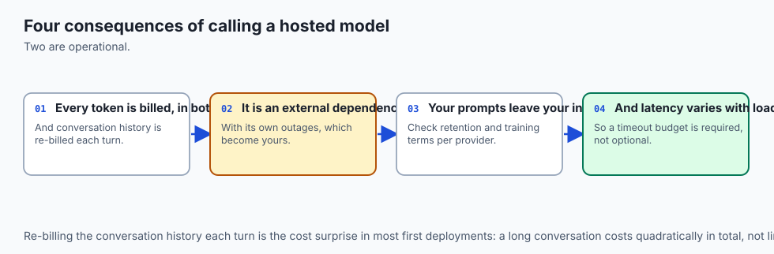

1. **Secure Secret Management:**
   - Never commit `.env` files or API keys into Git repositories. Use `.gitignore` and load keys exclusively via `os.environ`.
2. **Token Accounting & Observability:**
   - Every API response includes `usage.input_tokens` and `usage.output_tokens`. Accumulate these numbers in monitoring databases to calculate exact dollar expenditure per user session.

---

## Alternatives: free, open source, and commercial

| Provider / API | Primary Models | Message Schema | Best Use Case |
| :--- | :--- | :--- | :--- |
| **Anthropic Messages API** | Claude 3.5 Sonnet / Haiku | System + Messages Array | Complex coding & analysis |
| **OpenAI Chat Completions**| GPT-4o / GPT-4o-mini | Messages Array (role=system)| Broad ecosystem tools |
| **Google Gemini API** | Gemini 2.0 Flash / Pro | contents + system_instruction| Massive 2M+ context windows |
| **Ollama / vLLM (Local)** | Llama 3.3 / Mistral | OpenAI-compatible format | Air-gapped self-hosted privacy |

---

## Comparison with related concepts

```
┌────────────────────────────────────────────────────────────────────────┐
│                   API PROTOCOL FEATURE COMPARISON                      │
├────────────────────┬─────────────────┬──────────────────┬──────────────┤
│ Feature            │ Anthropic API   │ OpenAI API       │ Legacy Comp  │
├────────────────────┼─────────────────┼──────────────────┼──────────────┤
│ System Separation  │ Dedicated Param │ In Messages Role │ String Pref  │
│ Mandatory max_token│ Yes (Required)  │ Optional         │ Optional     │
│ Stop Reason Details│ Detailed Typed  │ Finish Reason    │ None         │
│ Prompt Caching     │ Explicit Breaks │ Automatic Prefix │ None         │
└────────────────────┴─────────────────┴──────────────────┴──────────────┘
```

---

## When to use it — and when not to

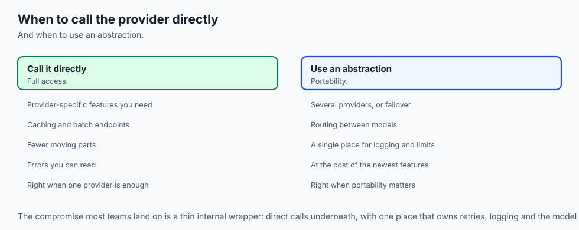

### When to Use Anthropic API Directly:
- High-reasoning enterprise tasks, automated architectural code reviews, long-form document extraction, and systems requiring nuanced safety and tool compliance.

### When NOT to use:
- Ultra-low-latency real-time embedded devices where network latency (`> 200ms`) is prohibitive and local quantized models (e.g. edge ONNX) must run on-device.

---

## The AI connection

- **The API call is the unit of everything built on hosted models**, so its details decide
  cost, latency and reliability.
- **Retry behaviour is part of correctness**, because transient failures are routine at any
  meaningful volume.
- **Rate limits are a design constraint**, not an error condition, and they shape how work
  is scheduled rather than just how it fails.
- **Prompt caching is applied at the request level**, which makes request construction a
  cost decision.
- **Observability has to be built in from the first call**, since an untraced model
  application cannot be debugged after the fact.

## Knowledge check

1. How is the System Prompt provided in the Anthropic Messages API?
2. What is the difference between transient (429/529) and fatal (401/400) HTTP errors?
3. Why is `max_tokens` a required parameter in all Anthropic API calls?
4. How does Full Jitter prevent the thundering herd problem during retry storms?
5. What does a `stop_reason` of `"max_tokens"` signify to downstream consumers?

---

## Hands-on exercise

In this lab, you will build and test a resilient Anthropic API client wrapper in Python: implement secure environment key loading, configure message parameter schemas, execute jittered exponential backoff retries on simulated transient failures, parse structured content blocks and stop reasons, and verify output assertions against automated test suites.

### Expected output
```
[Anthropic API Client Verification Suite]
Testing Key Authentication & Environment Validation:
  API Key Loaded from ENV: Verified (sk-ant-...) [PASS]
Testing Messages API Schema Construction:
  Top-Level System: 'Senior SRE Auditor'
  Messages Array: [{'role': 'user', 'content': '...'}] [VALIDATED]
Testing Exponential Backoff on 429 RateLimit Simulation:
  Attempt 1: Transient 429 caught -> Backoff sleep 0.62s
  Attempt 2: Transient 429 caught -> Backoff sleep 1.34s
  Attempt 3: Response 200 OK received -> stop_reason: 'end_turn' [PASS]
Test Suite: 3 passed in 0.38s
```

### Validate your work
Run the automated test runner:
```bash
./tests/run_tests.sh
```

### Troubleshooting
- Ensure `ANTHROPIC_API_KEY` is exported in your active shell or passed to test mocks.

### Common mistakes
- **Placing the system prompt inside the messages array:** Anthropic API will return a 400 Bad Request error if a message object contains `role: "system"`.

---

## Practice assignment

1. Implement an **Async Anthropic Client Wrapper** using `anthropic.AsyncAnthropic` and `asyncio.gather` to execute 10 concurrent requests with semaphore rate limiting.
2. Build an automated **Token Cost Tracker** that logs input/output token counts to an SQLite database after every API call.

---

## Extension challenge

Implement a **Multi-Provider Fallback Gateway**:

- Build a Python API router that dispatches requests to Claude 3.5 Sonnet, catches unrecoverable 529 overload errors after 3 retries, and automatically fails over to an OpenAI or local vLLM backup model without dropping the user request.
