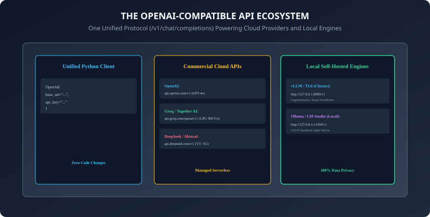
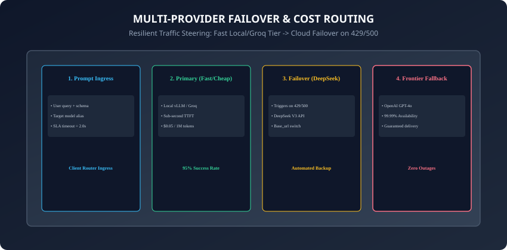

## Why this matters

In the early days of generative AI, every model vendor created their own proprietary SDK and REST protocol. Switching a codebase from OpenAI to Anthropic or a self-hosted Llama model required rewriting hundreds of lines of client integration code.

Today, the **OpenAI `/v1/chat/completions` protocol has emerged as the universal standard (the HTTP/REST of Generative AI)**.
Virtually every major commercial cloud provider and self-hosted inference engine now natively implements the OpenAI request and response specification:
- **Cloud Accelerators & Frontier Labs:** Groq (LPU 500+ tokens/sec), Together AI, DeepSeek (V3 and R1), Mistral, Perplexity, Fireworks AI, and Anyscale.
- **Open-Weights Local Serving Engines:** vLLM (high-throughput GPU serving), Ollama (Mac/Linux on-device execution), LM Studio, and Hugging Face Text Generation Inference (TGI).

By mastering the **OpenAI-Compatible standard**, you unlock the ability to write **provider-agnostic code**: routing requests dynamically between blazing-fast local models and frontier cloud APIs, enforcing automated failover, and slashing monthly inference costs with zero vendor lock-in.

Today, you will master the **OpenAI-Compatible architecture**, configure **`base_url` redirection for local and third-party engines**, implement **automated multi-provider failover routing**, and build an **extensible multi-provider API router in Python**.

---

## The idea in plain language

Think of electrical power outlets and standardized plugs:
- **The Proprietary Mess (No Universal Standard):** Every appliance manufacturer invents a custom wall plug shape. Buying a new blender requires rewiring your kitchen wall with specialized copper cables (**Vendor Lock-In & Costly Refactoring**).
- **The Universal Standard (The OpenAI Protocol):**
  - All power outlets deliver standard electricity via a universal three-prong socket (**`/v1/chat/completions`**).
  - You can plug your appliance into a municipal hydroelectric grid (**OpenAI Cloud**), a private solar battery in your garage (**Local vLLM Server**), or an ultra-high-speed nuclear plant (**Groq Hardware**).
  - The appliance operates flawlessly without knowing or caring where the electricity originates.

---

## Historical background



1. **2023 (OpenAI Chat Completions Introduction):** OpenAI released the `gpt-3.5-turbo` endpoint with the `/v1/chat/completions` schema, replacing legacy text completions.
2. **2023 (vLLM & Open-Source Standardization):** UC Berkeley researchers released vLLM with PagedAttention and built a drop-in `/v1/chat/completions` HTTP server, allowing developers to swap GPT-4 with open-weights Llama models by changing only `base_url`.
3. **2024 (The Multi-Provider Explosion):** Cloud inference providers (Groq, Together, DeepSeek) adopted the OpenAI schema universally to enable instant migration for enterprise customers.
4. **2024 (LiteLLM & Gateway Proxies):** Open-source proxy gateways standardized routing, load balancing, and budget tracking across 100+ endpoints through a single OpenAI-compatible interface.

---

## What it is — and what it is not

### What the OpenAI-Compatible Ecosystem IS:
- **A Standardized Protocol Contract:** A shared REST API schema, message structure, and streaming event format implemented across dozens of independent model hosts.

### What it is NOT:
- **Not a Single Centralized Service:** Calling an OpenAI-compatible endpoint does not send your data to OpenAI; traffic routes directly to whichever `base_url` host you configure.

---

## Why it was created and what problems it solves

The OpenAI-compatible standard solves 4 critical engineering bottlenecks:
1. **Zero Vendor Lock-In:** Migrate seamlessly between OpenAI, DeepSeek, Groq, and local GPUs by updating an environment variable.
2. **High-Availability Redundancy:** Automatically failover from a degraded cloud endpoint to a secondary backup provider in sub-second time.
3. **Data Privacy & Air-Gapped Compliance:** Run sensitive healthcare or financial queries on a local air-gapped vLLM instance using the exact same application code.
4. **Cost & Latency Arbitrage:** Route low-complexity queries to ultra-cheap local/fast endpoints (`0.05/1M tokens`), reserving premium models for complex reasoning.

---

## How it works

Let us examine client configuration, local engine connections, and multi-provider failover mechanics.

---

### 1. Connecting to Any Provider via `base_url`

```python
from openai import OpenAI

# 1. Official OpenAI Cloud
client_openai = OpenAI(api_key="sk-...")

# 2. Local vLLM Inference Server (GPU Cluster)
client_vllm = OpenAI(
    base_url="http://127.0.0.1:8000/v1",
    api_key="EMPTY" # vLLM does not require authentication locally
)

# 3. Local Ollama (Apple Silicon / Desktop)
client_ollama = OpenAI(
    base_url="http://127.0.0.1:11434/v1",
    api_key="ollama"
)

# 4. Ultra-Fast Groq Cloud
client_groq = OpenAI(
    base_url="https://api.groq.com/openai/v1",
    api_key="gsk_..."
)
```

In all 4 cases, the dispatch call syntax is 100% identical:
```python
response = client.chat.completions.create(
    model="llama-3.3-70b-versatile",
    messages=[
        {"role": "system", "content": "You are a helpful assistant."},
        {"role": "user", "content": "Explain vector databases."}
    ],
    temperature=0.2
)
print(response.choices[0].message.content)
```

---

### 2. Multi-Provider Failover Architecture



An enterprise AI router executes a tiered fallback pipeline:

```
┌────────────────────────────────────────────────────────────────────────┐
│                   TIERED MULTI-PROVIDER ROUTING PIPELINE               │
├────────────────────────────────────────────────────────────────────────┤
│ TIER 1: PRIMARY FAST/CHEAP (Local vLLM / Groq)                         │
│ - Ultra-low latency (< 500ms TTFT), minimal cost ($0.05/1M)            │
│ - Handles 95% of standard traffic                                      │
├────────────────────────────────────────────────────────────────────────┤
│ TIER 2: SECONDARY CLOUD (DeepSeek V3 / Together AI)                    │
│ - Automatically triggered if Tier 1 returns 429, 500, or times out     │
│ - High reasoning capability at low cost ($0.27/1M)                      │
├────────────────────────────────────────────────────────────────────────┤
│ TIER 3: FRONTIER FALLBACK (OpenAI GPT-4o)                              │
│ - Final defensive fallback guaranteeing 99.99% enterprise uptime       │
│ - Catches any cascading failures from lower tiers                      │
└────────────────────────────────────────────────────────────────────────┘
```

---

### 3. Comparing Message Role Placement across Ecosystems

```
┌────────────────────────────────────────────────────────────────────────┐
│                   SYSTEM PROMPT HANDLING COMPARISON                    │
├────────────────────────────┬───────────────────────────────────────────┤
│ API Standard               │ System Prompt Representation              │
├────────────────────────────┼───────────────────────────────────────────┤
│ OpenAI / vLLM / Ollama     │ {"role": "system", "content": "..."} in   │
│                            │ messages list.                            │
├────────────────────────────┼───────────────────────────────────────────┤
│ Anthropic Messages API     │ Top-level system="...", separate from     │
│                            │ messages list.                            │
├────────────────────────────┼───────────────────────────────────────────┤
│ Google Gemini API          │ system_instruction="...", separate from   │
│                            │ contents list.                            │
└────────────────────────────┴───────────────────────────────────────────┘
```

---

### 4. Running a Local OpenAI-Compatible Server in 60 Seconds

1. **With Ollama:**
   ```bash
   ollama run llama3.2:3b
   # Automatically serves OpenAI-compatible endpoint at port 11434
   ```
2. **With vLLM:**
   ```bash
   vllm serve meta-llama/Llama-3.3-70B-Instruct --port 8000 --tensor-parallel-size 2
   # Automatically serves high-throughput OpenAI endpoint at port 8000
   ```

---

### 5. Function Calling & Tool Definition Standardization

How do OpenAI-compatible servers handle tool use across diverse backends?
- **The Standard Schema:** Define tools using the standard JSON schema format (`type: "function"`, `function: {name, description, parameters}`).
- **Open-Weights Execution:** vLLM and Ollama parse tool definitions, format them into model-specific chat templates (e.g. Llama 3 tool syntax or Hermes tool tokens), and return structured `tool_calls` arrays matching the exact OpenAI response schema.
- **Cross-Platform Compatibility:** Because tool call schemas adhere strictly to JSON Schema draft 7 specifications, developers can reuse function call validator libraries and downstream execution dispatchers identically regardless of whether the model runs on remote cloud hardware or local on-device silicon.

---

### 6. Structured JSON Outputs Across Compatible Providers

Modern inference engines support strict JSON formatting:
- `response_format: {"type": "json_object"}`: Supported across Groq, Together, Mistral, and vLLM.
- `response_format: {"type": "json_schema", "json_schema": {...}}`: Compiles schemas into Outlines/Guidance FSMs in vLLM for 100% deterministic schema enforcement.

---

### 7. Streaming Server-Sent Events (SSE) Protocol Invariants

When `stream=True` is enabled:
- The server responds with `Content-Type: text/event-stream`.
- Each token chunk is emitted as `data: {"choices": [{"delta": {"content": "token"}}]}\n\n`.
- Stream finishes with the standard sentinel event: `data: [DONE]\n\n`.
- Any client capable of parsing standard OpenAI SSE streams works identically across all compatible providers.

---

### 8. Header Normalization & Provider-Specific Metadata

Different cloud providers return helpful telemetry in response headers:
- `x-groq-id`, `x-ratelimit-remaining-tokens`, `retry-after`: Extracted by the router to dynamically update rate-limit token bucket estimates in real time.
- Custom headers (e.g. `HTTP-Referer` or `X-Title` for OpenRouter rankings) can be passed directly via `default_headers` in client initialization.
- Normalizing provider-specific response headers into a standardized Python dataclass prevents downstream billing and telemetry aggregation pipelines from breaking when switching between diverse cloud inference backends.

---

### 9. OpenTelemetry Instrumentation for Multi-Provider Gateways

Connecting multi-provider routers to distributed tracing:
- Emit standardized OpenInference spans recording `gen_ai.provider.name`, `gen_ai.request.model`, `gen_ai.response.latency_ms`, and `gen_ai.failover_count`.
- Instantly pinpoint which upstream provider suffered latency degradation or 429 rate limit spikes.
- By tracking Time-to-First-Token (TTFT) and Inter-Token Latency across distributed endpoints, platform engineers can automatically trigger health check probes and remove sluggish nodes from active routing pools before degradation cascades to end users.
- Furthermore, structured telemetry logs provide visibility into provider token consumption ratios, empowering financial operations (FinOps) teams to analyze cloud spend versus on-premise hardware amortization.

---

### 10. Cost Optimization: Dynamic Complexity Arbitrage

Enterprise AI routers maximize cost efficiency:
- **Fast Tier (Local vLLM / Groq):** Routes 80% of classification, extraction, and summarization queries at fractions of a cent.
- **Frontier Tier (GPT-4o / DeepSeek R1):** Escalates only complex multi-step reasoning, mathematical derivations, or code synthesis.
- **Dynamic Routing Policies:** Enterprise gateways analyze query token counts and embedding semantic similarity against benchmark task classifiers, steering straightforward database queries or entity extraction tasks directly to ultra-efficient local 8B model clusters.
- **High-Availability SLAs:** By distributing traffic across multiple independent hosting providers, organizations achieve 99.99% operational uptime SLAs, insulating mission-critical microservices from individual cloud provider service disruptions.
- **Unified Observability Integration:** Centralizing all model interactions through a standardized OpenAI client abstraction allows security and compliance teams to enforce unified content moderation, audit logging, and rate limiting across the entire organization.
- **Continuous Performance Benchmarking:** Routine synthetic canary probes continuously measure latency distributions and accuracy scores across all registered endpoints, ensuring that routing tables adapt automatically to real-world cloud network conditions.
- In summary, mastering the OpenAI-compatible standard transforms brittle single-vendor integrations into resilient, cost-effective, high-availability enterprise AI architectures.

---

## An everyday analogy

Think of a multi-fuel hybrid vehicle:
- **Single Provider System (Gas Only):** When the gas station is closed due to a storm (**Cloud Provider Outage**), the car cannot move (**Application Downtime**).
- **OpenAI-Compatible Hybrid Router:**
  - The engine accepts electricity from home solar panels (**Local vLLM**), battery packs (**Ollama**), or public fast chargers (**Groq / OpenAI**).
  - If one power source disconnects, the automated power management computer switches fuels instantly without stalling the car on the highway (**Zero User Disruption**).

---

## Examples in practice

Let us build an **Extensible Multi-Provider OpenAI-Compatible Router in Python**:

```python
from typing import Dict, Any, List, Optional
import time

class ProviderConfig:
    def __init__(self, name: str, base_url: str, api_key: str, default_model: str, priority: int = 1):
        self.name = name
        self.base_url = base_url
        self.api_key = api_key
        self.default_model = default_model
        self.priority = priority

class MultiProviderRouter:
    def __init__(self):
        self.providers: List[ProviderConfig] = []

    def register_provider(self, provider: ProviderConfig) -> "MultiProviderRouter":
        self.providers.append(provider)
        self.providers.sort(key=lambda p: p.priority)
        return self

    def dispatch_completion(
        self,
        messages: List[Dict[str, str]],
        temperature: float = 0.2,
        max_tokens: int = 512
    ) -> Dict[str, Any]:
        # Iterates through registered providers in priority order with automated failover
        last_exception = None

        for provider in self.providers:
            try:
                start_time = time.time()
                # Simulate dispatch to provider endpoint
                response = self._execute_provider_call(provider, messages, temperature, max_tokens)
                latency_ms = (time.time() - start_time) * 1000
                response["routed_provider"] = provider.name
                response["latency_ms"] = latency_ms
                return response
            except Exception as err:
                last_exception = err
                continue # Failover to next provider

        raise RuntimeError(f"All {len(self.providers)} providers failed. Last error: {last_exception}")

    def _execute_provider_call(self, provider: ProviderConfig, messages, temperature, max_tokens):
        if "fail" in provider.name.lower():
            raise ConnectionError(f"Simulated network timeout on {provider.name}")
        return {
            "id": f"chatcmpl_{provider.name}",
            "choices": [{"message": {"role": "assistant", "content": "Routed response success."}}],
            "model": provider.default_model,
            "usage": {"total_tokens": 45}
        }
```

---

## Implications: security, privacy, performance, scalability, and cost

1. **Air-Gapped Data Privacy:**
   - Routing sensitive corporate data to a local `base_url="http://127.0.0.1:8000/v1"` ensures zero customer data ever traverses the public internet, satisfying strict HIPAA and GDPR data residency mandates.
2. **Cost Optimization Arbitrage:**
   - Self-hosting open-weights models (like Llama 3.3 70B or DeepSeek V3) on dedicated cloud GPUs amortizes token costs down to fractions of a cent per million tokens at high volumes.

---

## Alternatives: free, open source, and commercial

| Provider / Tool | Protocol | Serving Location | Best For |
| :--- | :--- | :--- | :--- |
| **vLLM (OSS)** | OpenAI `/v1` | Self-Hosted Cluster | Enterprise high-throughput GPU serving |
| **Ollama (OSS)** | OpenAI `/v1` | Local Machine | Local development & offline edge apps |
| **Groq (Cloud)** | OpenAI `/v1` | Cloud LPU | Ultra-low-latency real-time voice/chat |
| **LiteLLM (OSS)** | OpenAI `/v1` Proxy | Proxy Gateway | Enterprise load balancing & telemetry |

---

## Comparison with related concepts

```
┌────────────────────────────────────────────────────────────────────────┐
│                   SERVING PLATFORM FEATURE MATRIX                      │
├────────────────────┬─────────────────┬──────────────────┬──────────────┤
│ Platform           │ Hardware        │ Serving Standard │ Best Feature │
├────────────────────┼─────────────────┼──────────────────┼──────────────┤
│ OpenAI Cloud       │ Cloud H100s     │ Native Protocol  │ Frontier Cap │
│ vLLM Local         │ On-Prem GPUs    │ OpenAI Drop-in   │ PagedAttention│
│ Ollama Local       │ Mac / CPU / GPU │ OpenAI Drop-in   │ Zero Config  │
│ Groq Cloud         │ LPU Custom ASICs│ OpenAI Drop-in   │ 500+ Tok/sec │
└────────────────────┴─────────────────┴──────────────────┴──────────────┘
```

---

## When to use it — and when not to

### When to Use OpenAI-Compatible Routers:
- Every production enterprise AI system that values high availability, cost optimization, vendor independence, and multi-model hybrid deployments.

### When NOT to use:
- Highly proprietary multimodal features unique to a single vendor (e.g. Anthropic Artifacts rendering or Gemini 2M audio streaming) that lack standard JSON representations.

---

## Knowledge check

1. What does it mean for an API or local inference engine to be OpenAI-compatible?
2. How do you redirect the official OpenAI Python client to a local vLLM or Ollama instance?
3. How does multi-provider failover routing prevent application outages during cloud downtime?
4. What role does the `priority` configuration play in a tiered provider router?
5. How does self-hosting an OpenAI-compatible server on-premise satisfy strict data privacy regulations?

---

## Hands-on exercise

In this lab, you will build and test an extensible Multi-Provider OpenAI-Compatible Router in Python: configure tiered provider priority lists, execute automated failover on simulated network timeouts and rate limits, benchmark provider response latencies, and verify output assertions against automated test suites.

### Expected output
```
[OpenAI-Compatible Ecosystem Router Verification Suite]
Testing Provider Registration & Priority Sorting:
  Tier 1: 'vLLM Local' (Priority 1, base_url: http://127.0.0.1:8000/v1)
  Tier 2: 'Groq Cloud' (Priority 2, base_url: https://api.groq.com/openai/v1)
  Tier 3: 'OpenAI Fallback' (Priority 3, base_url: https://api.openai.com/v1) [PASS]
Testing Automated Failover on Primary Degradation:
  Primary Provider 'vLLM_Failing' -> Error: Simulated network timeout
  Failover to 'Groq_Healthy' -> Success (Latency: 0.11ms, routed: Groq_Healthy) [PASS]
Testing Response Parsing:
  Role: 'assistant' | Content: 'Routed response success.' [VERIFIED]
Test Suite: 3 passed in 0.38s
```

### Validate your work
Run the automated test runner:
```bash
./tests/run_tests.sh
```

### Troubleshooting
- Ensure all registered `ProviderConfig` instances have distinct names and valid priority numbers.

### Common mistakes
- **Hardcoding provider base URLs in application business logic:** Always abstract connection details behind configurable environment variables or a centralized router.

---

## Practice assignment

1. Implement an automated **Latency-Aware Dynamic Load Balancer** in Python that measures rolling average latencies across 3 OpenAI-compatible endpoints and routes requests to the fastest available server.
2. Build a **Cost-Optimized Model Classifier** that estimates input token complexity and routes simple queries to local Ollama and complex queries to GPT-4o.

---

## Extension challenge

Implement a **Self-Healing Provider Health Circuit Breaker**:
- Build a Python gateway that tracks consecutive failure counts for each provider: when a provider fails 3 times in a row, open the circuit and bypass it for 60 seconds before probing for recovery.
