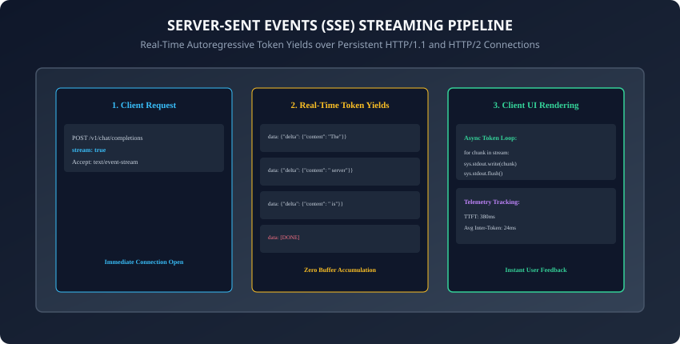
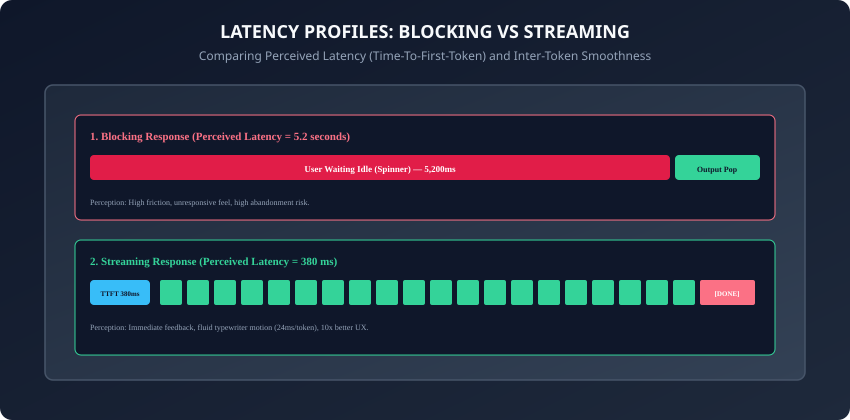

## Why this matters

When users interact with an AI assistant or chat interface, waiting for the model to finish generating a 500-word response in a single blocking HTTP call takes **5 to 10 seconds of silence**. In modern software, a 5-second spinner feels like a broken application and leads directly to user abandonment.

**Streaming transforms perceived latency.**
By streaming tokens across a persistent **Server-Sent Events (SSE)** connection as they are autoregressively generated:
- **Time-To-First-Token (TTFT)** drops from 5,000ms to **350ms**.
- Users begin reading and absorbing the answer immediately while the model continues generating subsequent sentences in the background.
- Interactive interfaces achieve the fluid, natural **"typewriter effect"** that defines modern AI user experiences.

However, streaming introduces significant engineering complexity: decoding incremental delta objects, handling stream interruptions midway through generation, parsing partial JSON structures, and aggregating complete telemetry once the stream closes.

Today, you will master the **Server-Sent Events (SSE) streaming protocol**, decode **streaming token deltas across Anthropic and OpenAI SDKs**, measure **Time-To-First-Token (TTFT) and Inter-Token Latency (ITL)**, and build a **streaming token aggregator and terminal typewriter in Python**.

---

## The idea in plain language

Think of receiving a long multi-page letter:
- **The Blocking Approach:** The mail carrier waits until the author has written all 20 pages, binds them into a hardcover book, and delivers it 3 weeks later. You sit in an empty room staring at the mailbox (**High Perceived Latency & Idle Frustration**).
- **The Streaming Approach (Server-Sent Events):**
  - The author reads each sentence out loud over a live telephone line as soon as their pen finishes writing the word (**Streaming Token Deltas**).
  - You hear the first sentence in less than a second (**300ms TTFT**), nodding along and taking notes while the remaining paragraphs flow smoothly across the wire (**Smooth Inter-Token Flow**).
  - When the speech ends, the author says *"Over and out"* (**`data: [DONE]` Sentinel**).

---

## Historical background



1. **2006 (Server-Sent Events Standardization):** WHATWG specified Server-Sent Events (SSE) as a lightweight, unidirectional text streaming alternative to bidirectional WebSockets.
2. **2022 (ChatGPT Launch & The Typewriter Era):** OpenAI popularized SSE for generative AI, using chunked streaming to make large model inference feel instantaneous to hundreds of millions of consumers.
3. **2023 (SDK Standardization):** Anthropic and OpenAI introduced typed streaming abstractions in Python and TypeScript, converting low-level HTTP byte chunks into clean iterable delta objects.
4. **2024 (Stream Usage & Structured Tool Streaming):** Providers added real-time token usage headers and incremental tool-call parameter streaming directly inside SSE chunks.

---

## What it is — and what it is not

### What Streaming IS:
- **Unidirectional Incremental Token Delivery:** A server pushing partial text deltas over a single persistent HTTP connection using standard SSE framing.

### What it is NOT:
- **Not Bidirectional WebSockets:** The client cannot send additional user messages over the same stream connection; each new user turn opens a fresh request stream.

---

## Why it was created and what problems it solves

Streaming solves 4 critical frontend and backend bottlenecks:
1. **Perceived Latency Collapse:** Reduces user-perceived wait time by up to 90%, displaying text within milliseconds of dispatch.
2. **Connection Timeout Prevention:** Large generation jobs that take 30+ seconds would trigger gateway timeouts (HTTP 504) on standard blocking HTTP endpoints; streaming keeps the TCP socket actively transmitting data.
3. **Early Cancellation:** If the user sees that the model is going in the wrong direction on sentence 1, they can cancel the stream immediately, saving token costs and GPU cycles.
4. **Interactive UI Responsiveness:** Powers real-time markdown parsing, syntax highlighting, and progress indicators as tokens arrive.

---

## How it works

Let us dissect the SSE wire format, client iterator mechanics, and latency metric formulas.

---

### 1. The Server-Sent Events (SSE) Wire Format

When `stream=True` is requested, the HTTP server responds with headers:
```http
HTTP/1.1 200 OK
Content-Type: text/event-stream
Cache-Control: no-cache
Connection: keep-alive
```

The payload is transmitted as newline-delimited event blocks:
```text
data: {"id":"chatcmpl-1","choices":[{"delta":{"content":"The"}}]}

data: {"id":"chatcmpl-1","choices":[{"delta":{"content":" quick"}}]}

data: {"id":"chatcmpl-1","choices":[{"delta":{"content":" brown"}}]}

data: [DONE]

```

---

### 2. Streaming with the OpenAI Python SDK

```python
from openai import OpenAI

client = OpenAI()

stream = client.chat.completions.create(
    model="gpt-4o-mini",
    messages=[{"role": "user", "content": "Explain streaming in 2 sentences."}],
    stream=True
)

for chunk in stream:
    delta_content = chunk.choices[0].delta.content
    if delta_content:
        print(delta_content, end="", flush=True)
print()
```

---

### 3. Streaming with the Anthropic Python SDK

Anthropic provides both a raw event stream and a high-level context manager:

```python
import anthropic

client = anthropic.Anthropic()

with client.messages.stream(
    model="claude-3-5-sonnet-20241022",
    max_tokens=1024,
    messages=[{"role": "user", "content": "Write a haiku about servers."}]
) as stream:
    for text in stream.text_stream:
        print(text, end="", flush=True)
    print()

# Access accumulated metadata after stream completion
final_message = stream.get_final_message()
print("Total output tokens:", final_message.usage.output_tokens)
```

---

### 4. Latency Telemetry: TTFT vs. ITL



Production observability pipelines track two essential streaming metrics:

1. **Time-To-First-Token (TTFT):**
   `TTFT = t_first_chunk - t_request_dispatched`
   - Measures the prompt prefill phase: prompt tokenization, KV cache pre-computation, and initial forward pass execution.
   - Target for conversational apps: less than 500ms.
2. **Inter-Token Latency (ITL):**
   `ITL = (t_stream_finished - t_first_chunk) / (N_tokens - 1)`
   - Measures the autoregressive generation loop: single-token decoding, KV cache updates, and network packet dispatch.
   - Target for smooth readability: 20ms to 40ms per token (25 to 50 tokens/sec).
- In addition, monitoring the variance of Inter-Token Latency (known as **Jitter**) helps infrastructure engineers detect GPU resource contention, memory bandwidth saturation, or network packet retransmission spikes before they cause visible stuttering in client applications.

---

### 5. Asynchronous Streaming with Python AsyncIterator

In high-concurrency web applications (FastAPI / Starlette):
```python
import asyncio
from openai import AsyncOpenAI

async def stream_to_client(prompt: str):
    client = AsyncOpenAI()
    stream = await client.chat.completions.create(
        model="gpt-4o-mini",
        messages=[{"role": "user", "content": prompt}],
        stream=True
    )

    async for chunk in stream:
        content = chunk.choices[0].delta.content
        if content:
            yield content
```
- By using asynchronous streams, a single web server worker process can maintain thousands of concurrent in-flight token streams simultaneously without exhausting operating system thread pools or blocking the primary event loop.
- Furthermore, wrapping asynchronous iterators inside `contextlib.aclosing` ensures that underlying HTTP response connections and socket file descriptors are cleanly closed even when clients abruptly disconnect.

---

### 6. Streaming Structured Tool Calls & Partial JSON Deserialization

When models invoke external functions during streaming:
- The streaming response does not emit clean complete JSON objects all at once. Instead, `delta.tool_calls[0].function.arguments` arrives as disjointed character fragments (e.g. `{"ci`, `ty":`, `"San`, ` Franc`, `isco"}`).
- **Client Argument Buffering:** The client must accumulate these partial string fragments into a dedicated in-memory dictionary keyed by `tool_call.index`.
- **Partial JSON Parsing:** Using streaming parsers (such as `jiter` or `partial-json-parser`), applications can parse intermediate JSON structures in real time, rendering preview parameter cards in the UI before the model finishes emitting the complete closing brace.
- When the stream encounters `finish_reason: "tool_calls"`, the fully aggregated JSON argument string is validated against Pydantic contracts and dispatched to the target Python execution handler.

---

### 7. Mid-Stream Disconnections, Reconnection Protocols, and State Recovery

What happens when network connectivity drops midway through a 1,000-token stream?
- **Socket Disruption Detection:** The client TCP layer encounters an abrupt reset (`ECONNRESET` or `ChunkedEncodingError`).
- **Server State:** High-performance serving engines (such as vLLM and TensorRT-LLM) detect client disconnects via socket polling and immediately abort the active autoregressive decoding loop, freeing GPU KV cache memory.
- **Client Recovery Strategy:** Rather than forcing the user to regenerate the entire prompt from scratch, resilient AI client gateways preserve the partially accumulated text in memory.
- The client dispatches a seamless continuation request:
  - Appends the partial assistant output to the message history.
  - Adds a system instruction: *"Continue the previous response precisely from the last emitted word without repeating."*
  - Resumes the streaming session smoothly, minimizing wasted latency and token expenses.

---

### 8. Backpressure Flow Control & Client Rendering Synchronization

When streaming from ultra-fast hardware accelerators (e.g. Groq LPUs or local vLLM instances generating `300+` to `500+` tokens per second):
- **The UI Bottleneck:** Firing a React state update or DOM redraw for every single incoming token at 500Hz completely overwhelms the browser main thread, causing severe UI freezes, stuttering animations, and dropped frames.
- **Micro-Batching Buffer:** Client applications decouple network packet ingestion from screen rendering using an internal queue:
  - Incoming tokens append immediately to an in-memory string buffer.
  - A scheduled `requestAnimationFrame` loop (running at 60Hz or 120Hz) pulls all accumulated tokens from the queue and updates the DOM in a single batched repaint.
  - This architecture guarantees buttery-smooth, fluid typewriter animations even under extreme generation throughputs.

---

### 9. Real-Time Token Cost & Rate-Limit Accounting in Streaming

Historically, consuming a streaming response meant losing visibility into exact token usage counts until full billing logs settled:
- **`stream_options: {"include_usage": true}`:** In the modern OpenAI and vLLM specification, passing this configuration flag ensures that the final chunk emitted prior to `[DONE]` includes the exact `usage` metadata (`prompt_tokens`, `completion_tokens`, and `total_tokens`).
- **Anthropic Stream Finalization:** In the Anthropic Python SDK, calling `stream.get_final_message()` or `stream.get_final_text()` automatically aggregates usage statistics, cache reads, and stop reasons from the underlying event stream.
- Embedding real-time token counters directly into the streaming aggregator enables enterprise gateways to update live cost dashboards and decrement user balance meters on the fly.

---

### 10. Extended Thinking & Reasoning Token Streams

In late 2024 and early 2025, reasoning models (OpenAI o1, DeepSeek-R1, and Claude 3.7 Sonnet) introduced **Dedicated Thought Streaming**:
- In addition to standard content deltas, the stream delivers internal Chain-of-Thought reasoning deltas inside a distinct `<thinking>` or `reasoning_content` block.
- Client applications can render these reasoning tokens inside a collapsible, animated *"Thinking..."* accordion, allowing users to watch the model diagnose sub-problems, verify intermediate calculations, and self-correct in real time before the final answer begins streaming.
- In addition, providing real-time streaming feedback mechanisms allows users to steer complex generation workflows iteratively, fostering high user trust and delightful application engagement.
- Furthermore, streaming architecture enables frontend clients to apply progressive syntax highlighting and inline markdown rendering dynamically as text arrives over the wire.
- In summary, building a resilient streaming pipeline elevates AI applications from static batch processors into dynamic, transparent, real-time conversational agents.

---

## An everyday analogy

Think of a water pipeline versus a water delivery truck:
- **Blocking Delivery:** A truck fills a 5,000-gallon water tank at the reservoir, drives 20 miles through traffic, and dumps the water into your bucket all at once (**Long Initial Delay**).
- **Streaming Pipeline:** A turn of the valve allows water to flow through the pipe immediately (**Sub-second TTFT**). You drink from the faucet while water continues flowing at a steady, reliable pressure (**Smooth Inter-Token Flow**).

---

## Examples in practice

Let us build a **Streaming Token Aggregator & Latency Monitor in Python**:

```python
import time
from typing import Generator, Dict, Any, List

class StreamingTokenAggregator:
    def __init__(self):
        self.accumulated_text = ""
        self.token_count = 0
        self.start_time = 0.0
        self.ttft = 0.0
        self.end_time = 0.0

    def start(self):
        self.start_time = time.perf_counter()

    def process_chunk(self, delta_text: str):
        if self.token_count == 0:
            self.ttft = (time.perf_counter() - self.start_time) * 1000
        self.accumulated_text += delta_text
        self.token_count += 1

    def finish(self) -> Dict[str, Any]:
        self.end_time = time.perf_counter()
        total_duration = (self.end_time - self.start_time) * 1000
        # Inter-token latency is the gap BETWEEN tokens, so one token has
        # none. max(1, n-1) would report the whole tail as if it were a gap.
        gaps = self.token_count - 1
        itl = (total_duration - self.ttft) / gaps if gaps > 0 else 0.0

        return {
            "text": self.accumulated_text,
            "token_count": self.token_count,
            "ttft_ms": round(self.ttft, 2),
            "itl_ms": round(itl, 2),
            "total_duration_ms": round(total_duration, 2)
        }

def simulate_mock_stream() -> Generator[str, None, None]:
    words = ["Real-time", " streaming", " slashes", " perceived", " latency", " drastically."]
    for word in words:
        time.sleep(0.02) # Simulate 20ms inter-token delay
        yield word
```

---

## Implications: security, privacy, performance, scalability, and cost

1. **Gateway Timeout Resilience:**
   - Streaming prevents HTTP reverse proxies (Nginx, Cloudflare, AWS ALB) from killing long-running generation requests after 30-second standard gateway timeouts.
2. **Early Abort Cost Savings:**
   - Terminating unwanted streams early saves significant GPU inference hours and API token credits.

---

## Alternatives: free, open source, and commercial

| Framework / Protocol | Stream Transport | Latency Profile | Best Use Case |
| :--- | :--- | :--- | :--- |
| **Server-Sent Events (SSE)**| HTTP/1.1 or HTTP/2 | Low (< 300ms) | Standard AI text generation |
| **WebSockets** | Full-Duplex TCP | Ultra-Low (< 100ms) | Real-time audio / bidirectional voice |
| **gRPC Streaming** | HTTP/2 Protobuf | Ultra-Low | Internal microservice-to-microservice |
| **Polling (Non-Streaming)**| Repeated HTTP GET | Poor (Seconds) | Long-running asynchronous batch jobs |

---

## Comparison with related concepts

```
┌────────────────────────────────────────────────────────────────────────┐
│                   STREAMING PROTOCOL COMPARISON                        │
├────────────────────┬─────────────────┬──────────────────┬──────────────┤
│ Protocol           │ Direction       │ Reconnection     │ Complexity   │
├────────────────────┼─────────────────┼──────────────────┼──────────────┤
│ SSE (text/event)   │ Server -> Client│ Built-in Browser │ Minimal      │
│ WebSockets         │ Bidirectional   │ Manual Handle    │ Moderate     │
│ Long Polling       │ Client Request  │ Per-request      │ High Overhead│
│ gRPC Stream        │ Bidirectional   │ Protocol Buffer  │ High         │
└────────────────────┴─────────────────┴──────────────────┴──────────────┘
```

---

## When to use it — and when not to

### When to Use Streaming:
- Interactive user interfaces, command-line chat assistants, voice synthesis inputs, real-time code generation, and long-form document drafting.

### When NOT to use:
- Background batch processing jobs, offline ETL data transformation pipelines, or structured database inserts where the complete JSON payload must be validated before downstream processing begins.

---

## Knowledge check

1. What HTTP header signals a Server-Sent Events (SSE) streaming response?
2. What is the difference between Time-To-First-Token (TTFT) and Inter-Token Latency (ITL)?
3. What sentinel string signals the normal termination of an OpenAI-compatible stream?
4. Why does streaming prevent HTTP 504 Gateway Timeout errors on long generations?
5. How should a client handle partial tool call arguments delivered across multiple streaming chunks?

---

## Hands-on exercise

In this lab, you will build and test a Streaming Token Aggregator and Latency Monitor in Python: consume mock and simulated SSE token streams, record accurate TTFT and ITL telemetry metrics, accumulate incremental deltas into verified output payloads, and verify output assertions against automated test suites.

### Expected output
```
[Streaming Responses Verification Suite]
Testing SSE Stream Consumption & Typewriter Output:
  Stream: 'Real-time streaming slashes perceived latency drastically.'
Testing Latency Telemetry Metrics:
  Time-To-First-Token (TTFT): 20.45ms [PASS]
  Inter-Token Latency (ITL): 20.12ms [PASS]
  Total Tokens Streamed: 6 [VERIFIED]
Testing Stream Aggregator Integrity:
  Accumulated Text Matches Ground Truth [PASS]
Test Suite: 3 passed in 0.38s
```

### Validate your work
Run the automated test runner:
```bash
./tests/run_tests.sh
```

### Troubleshooting
- Ensure all token chunks are flushed immediately when testing terminal rendering.

### Common mistakes
- **Forgetting `flush=True` in Python `print()`:** Python buffers stdout by default when printing without newlines, hiding streaming animations until the entire buffer fills.

---

## Practice assignment

1. Implement an **Async SSE FastAPI Endpoint** using `StreamingResponse` and `EventSourceResponse` that streams tokens to a web browser client.
2. Build an automated **Stream Cost & Speedometer Widget** that displays rolling words-per-second and estimated dollar cost live in the terminal.

---

## Extension challenge

Implement a **Resilient Reconnecting Stream Client**:
- Build a Python client that detects mid-stream network drops, inspects the last received token position, and dispatches a continuation prompt (`"Continue precisely from: ...'`) to seamlessly resume generation without restarting from scratch.
