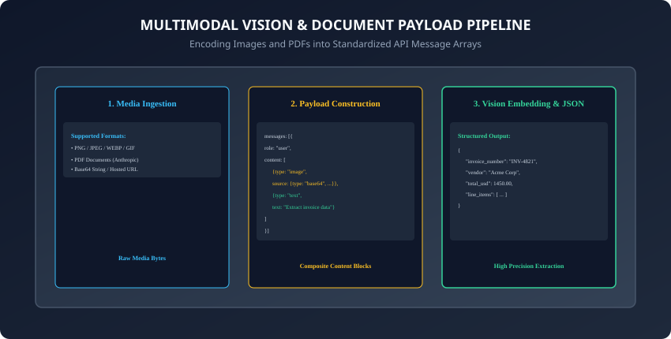
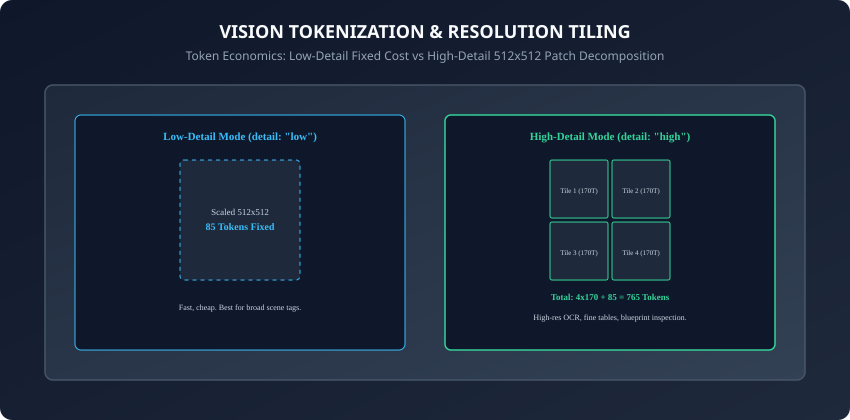

## Why this matters

The real world is not purely text. The most valuable information in enterprise organizations lives trapped inside **unstructured visual formats**: scanned invoices, medical x-rays, multi-page financial PDF statements, architectural blueprints, UI wireframes, and handwritten whiteboards.

Traditional OCR engines (such as Tesseract) struggle immensely when layouts become complex, failing on nested tables, multi-column articles, and rotated text.

**Modern Multimodal Language Models (MLLMs)** — such as Claude 3.5 Sonnet, GPT-4o, and Gemini 1.5/2.0 — natively perceive visual pixels alongside linguistic tokens:
- They inspect visual spatial layout, table cell boundaries, font weights, and hierarchical indentation.
- They cross-reference charts and graphs with accompanying textual footnotes.
- They extract clean, validated **Pydantic JSON structures directly from raw imagery** with near-human reading comprehension.

Today, you will master **Base64 media encoding**, formulate **multimodal payload arrays across Anthropic and OpenAI APIs**, calculate **vision patch token economics**, and build an **automated multimodal document analysis engine in Python**.

---

## The idea in plain language

Think of a doctor examining a patient chart:
- **Text-Only Approach (Traditional OCR):** A clerk transcribes the patient file by reading characters left-to-right without understanding formatting. If the file has a 2-column table with lab values, the text becomes garbled, mixing heart rate numbers with cholesterol levels (**Layout Destruction & Medical Errors**).
- **Multimodal Visual Intelligence (MLLM):**
  - The doctor holds the physical x-ray and lab report in their hands (**Image & Document Payload**).
  - Their visual cortex processes spatial geometry: identifying bone fractures in the scan while reading the exact blood pressure numbers in the top-right box (**Vision Patch Attention**).
  - The doctor writes a structured diagnosis synthesizing visual evidence with medical reasoning (**Structured JSON Output**).

---

## Historical background



1. **2020 (Vision Transformer ViT):** Google Research proved that treating image patches like text tokens allowed transformer architectures to excel at computer vision tasks.
2. **2023 (GPT-4V & Multimodal API Emergence):** OpenAI launched GPT-4 Vision, allowing developers to pass image URLs and base64 strings directly in `/v1/chat/completions`.
3. **2024 (Claude 3.5 & Native PDF Understanding):** Anthropic introduced high-precision OCR and native PDF document block ingestion, allowing direct multi-page document parsing without third-party converters.
4. **2024 (Omni Architectures):** Native multimodal tokenizers unified audio, vision, video, and text into a single cohesive autoregressive transformer backbone.

---

## What it is — and what it is not

### What Multimodal API Processing IS:
- **Spatial Visual Reasoning:** Sending raw images or PDFs to a foundation model to extract structured data, diagnose anomalies, or analyze visual geometry.

### What it is NOT:
- **Not Pixel Generation / Diffusion:** MLLMs analyze and interpret existing imagery; they do not generate new photorealistic diffusion artwork (like Midjourney or FLUX).

---

## Why it was created and what problems it solves

Multimodal API processing eliminates 4 legacy enterprise hurdles:
1. **Broken OCR Pipelines:** Replaces fragile multi-step OCR + regex parsing stacks with a single end-to-end model call.
2. **Complex Layout Understanding:** Seamlessly parses nested tables, rotated receipts, handwritten forms, and multi-column magazine layouts.
3. **Chart & Diagram Synthesis:** Interprets line charts, scatter plots, and network flowcharts, outputting the underlying numerical data points.
4. **UI Wireframe-to-Code:** Converts screenshots of Figma wireframes directly into functioning React/Tailwind frontend code.

---

## How it works

Let us examine Base64 encoding, API message schemas, and vision token cost mathematics.

---

### 1. Encoding Local Images into Base64 in Python

```python
import base64
from pathlib import Path

def encode_image_to_base64(image_path: str) -> str:
    with open(image_path, "rb") as image_file:
        return base64.b64encode(image_file.read()).decode("utf-8")
```
- The resulting Base64 string represents raw image bytes encoded in 64 ASCII characters, allowing binary image data to be serialized safely inside standard JSON request bodies without binary transmission corruption.
- In addition, validating file size boundaries before Base64 conversion ensures that memory allocations remain bounded when processing high-resolution media.

---

### 2. OpenAI Vision API Message Schema

```python
from openai import OpenAI

client = OpenAI()
b64_image = encode_image_to_base64("invoice.png")

response = client.chat.completions.create(
    model="gpt-4o",
    messages=[
        {
            "role": "user",
            "content": [
                {"type": "text", "text": "Extract invoice number, date, and total amount as JSON."},
                {
                    "type": "image_url",
                    "image_url": {
                        "url": f"data:image/png;base64,{b64_image}",
                        "detail": "high" # "low", "high", or "auto"
                    }
                }
            ]
        }
    ],
    max_tokens=500
)
print(response.choices[0].message.content)
```

---

### 3. Anthropic Vision & PDF Document Message Schema

```python
import anthropic

client = anthropic.Anthropic()
b64_pdf = encode_image_to_base64("quarterly_report.pdf")

response = client.messages.create(
    model="claude-3-5-sonnet-20241022",
    max_tokens=1024,
    messages=[
        {
            "role": "user",
            "content": [
                {
                    "type": "document",
                    "source": {
                        "type": "base64",
                        "media_type": "application/pdf",
                        "data": b64_pdf
                    }
                },
                {"type": "text", "text": "Summarize key financial risks mentioned in this PDF."}
            ]
        }
    ]
)
print(response.content[0].text)
```

---

### 4. Vision Token Economics: Low-Detail vs. High-Detail Mode



How do vision APIs calculate prompt token costs?

1. **Low-Detail Mode (`detail: "low"`):**
   - The image is downsampled to a fixed `512 * 512` square.
   - Cost is flat: exactly **85 tokens**, regardless of the original image dimensions.
   - Ideal for broad scene tagging and thumbnail indexing.
2. **High-Detail Mode (`detail: "high"`):**
   - The image is scaled to fit within a `2048 * 2048` box.
   - The shortest side is scaled to `768px`.
   - The canvas is partitioned into `512 * 512` pixel tiles.
   - Each tile consumes **170 tokens**.
   - An additional **85 base tokens** are added for the global overview:
     `Total Tokens = (N_{tiles} * 170) + 85`
   - Example: A `1024 * 1024` image creates 4 tiles: `(4 * 170) + 85 = 765 tokens`.

---

### 5. Multi-Image Comparative Reasoning & Cross-Modal Attention

You can pass multiple image blocks inside a single content array:
- **Medical Diagnostics:** Compare before and after CT scans across 6-month intervals to detect tumor shrinkage or bone remodeling.
- **Visual Diffing & Quality Assurance:** Submit expected design mockups alongside live frontend screenshots to automatically identify CSS layout regressions and misaligned margins.
- **Multi-Angle Object Inspection:** Provide 4 orthographic views (top, side, front, isometric) of an industrial component to evaluate mechanical tolerances and surface defects.
- **Cross-Modal Attention Mechanics:** The underlying transformer cross-attends between image patch embeddings from different images simultaneously, allowing the model to perform holistic spatial comparison without requiring multi-turn conversational back-and-forth.

---

### 6. Extracting Structured Pydantic Schemas from Complex Image Scans

Combining vision inputs with strict JSON schemas transforms messy physical paperwork into strongly typed database records:
```python
from pydantic import BaseModel, Field
from typing import List

class LineItem(BaseModel):
    description: str = Field(description="Item name or service description")
    quantity: int = Field(description="Units purchased")
    unit_price: float = Field(description="Price per unit in USD")
    total_price: float = Field(description="Total line item cost")

class InvoiceExtraction(BaseModel):
    invoice_number: str = Field(description="Unique invoice identifier")
    vendor_name: str = Field(description="Company issuing the invoice")
    invoice_date: str = Field(description="Date formatted as YYYY-MM-DD")
    subtotal: float = Field(description="Pre-tax amount")
    tax_amount: float = Field(description="Calculated tax")
    total_amount: float = Field(description="Final total charge")
    items: List[LineItem] = Field(description="List of purchased line items")
```
- When instructed with schema definitions, the multimodal model cross-references table column headers with individual numerical values, correctly resolving misaligned lines, currency symbols, and multi-line item descriptions that break conventional regex and OCR parsers.

---

### 7. Client-Side Image Pre-Processing & Dimension Optimization

Sending raw 48-megapixel photos directly to cloud vision APIs causes massive network latency and unnecessary token billing:
- **Optimal Scaling Dimensions:** Vision models partition images using `512 * 512` pixel patch grids. Scaling images such that the shortest side is `768px` and the longest side does not exceed `2048px` retains 100% of the visual fidelity needed for small text reading while minimizing tile counts.
- **Client-Side Python Compression Pipeline:**
  ```python
  from PIL import Image
  import io

  def optimize_image_for_vision(image_path: str, max_dimension: int = 2048) -> bytes:
      with Image.open(image_path) as img:
          # Convert RGBA to RGB for JPEG serialization
          if img.mode in ("RGBA", "P"):
              img = img.convert("RGB")
          img.thumbnail((max_dimension, max_dimension), Image.Resampling.LANCZOS)
          buffer = io.BytesIO()
          img.save(buffer, format="JPEG", quality=85, optimize=True)
          return buffer.getvalue()
  ```
- This automated pre-processing step slashes Base64 payload sizes by up to 80% and accelerates HTTP upload times significantly.

---

### 8. Multi-Page PDF Document Ingestion & Sliding Window Budgeting

When analyzing enterprise PDF documents (such as 100-page SEC 10-K filings or clinical trials reports):
- **Native Document Blocks vs. Page Rendering:** Anthropic Claude 3.5 Sonnet natively accepts PDF document blocks up to 32MB. Internally, each PDF page is rasterized into high-resolution vision tiles consuming approximately 1,500 prompt tokens per page.
- **Token Budget Protection:** Submitting a 50-page PDF in a single turn consumes ~75,000 input tokens.
- **Selective Page Slicing Strategy:**
  - Use lightweight libraries (`pypdf` or `pdfplumber`) to extract the document table of contents or search for targeted keywords.
  - Slice only the relevant 3 to 5 page subset into an in-memory PDF buffer.
  - Submit the focused PDF slice to the multimodal API, preserving prompt token limits and slashing inference costs.

---

### 9. Spatial Grounding & Normalized Bounding Box Coordinates

Modern frontier multimodal models can locate specific UI elements and physical objects using **Normalized Bounding Box Coordinates**:
- The model expresses object locations as a 4-element array: `[ymin, xmin, ymax, xmax]` normalized on a scale from `0` to `1000` (or `0.0` to `1.0`).
- **Visual Grounding Applications:**
  - **GUI Navigation Agents:** Identifying the exact click coordinates `[ymin, xmin]` for a *"Submit Application"* button in web browser automation.
  - **Defect Detection in Manufacturing:** Highlighting micro-cracks on circuit board scans with bounding boxes.
  - **Chart Data Verification:** Returning bounding coordinates of legend labels and bar chart peaks to provide verifiable visual citations.

---

### 10. Automated Redaction & PII Masking in Multimodal Pipelines

Processing sensitive documents (e.g. government IDs, tax returns, medical records) requires strict privacy controls:
- **Pre-Ingestion Redaction:** Detect high-entropy text regions (Social Security Numbers, Credit Card numbers) using local OCR or facial recognition cascades and apply Gaussian blur or solid black rectangles prior to Base64 serialization.
- **Zero Data Retention Compliance:** Ensure enterprise API agreements mandate that uploaded image and document payloads are never cached, logged, or utilized for model training.
- In addition, combining visual OCR with automated schema validation guarantees that extracted entities conform to strict enterprise data contracts before downstream ingestion into analytical data warehouses.
- Furthermore, modern multimodal pipelines maintain end-to-end data provenance by recording source image coordinates alongside extracted numerical fields for automated compliance auditing.
- In summary, mastering multimodal image and document engineering empowers developers to bridge physical paperwork with automated digital intelligence.

---

## An everyday analogy

Think of a magnifying glass with adjustable zoom:
- **Low-Detail Mode:** You hold the magnifying glass 3 feet above a map to see whether it is a map of France or Germany (**85 Tokens / Broad Classification**).
- **High-Detail Mode:** You press the magnifying glass directly against the paper, moving it square by square across each town and street name (**765 Tokens / Precise High-Resolution Reading**).

---

## Examples in practice

Let us build an **Automated Multimodal Document Analyzer in Python**:

```python
import base64
from typing import Dict, Any, List

class MultimodalDocumentAnalyzer:
    def __init__(self):
        self.supported_image_types = ["image/jpeg", "image/png", "image/webp"]
        self.supported_doc_types = ["application/pdf"]

    def build_image_payload(self, base64_data: str, media_type: str, prompt: str) -> Dict[str, Any]:
        if media_type not in self.supported_image_types:
            raise ValueError(f"Unsupported image media type: {media_type}")
        return {
            "role": "user",
            "content": [
                {
                    "type": "image",
                    "source": {
                        "type": "base64",
                        "media_type": media_type,
                        "data": base64_data
                    }
                },
                {"type": "text", "text": prompt}
            ]
        }

    def calculate_vision_tokens(self, width: int, height: int, detail: str = "high") -> int:
        if detail == "low":
            return 85
        # Calculate 512x512 tiles for high-detail mode
        import math
        tiles_x = math.ceil(min(width, 2048) / 512)
        tiles_y = math.ceil(min(height, 2048) / 512)
        total_tiles = tiles_x * tiles_y
        return (total_tiles * 170) + 85
```

---

## Implications: security, privacy, performance, scalability, and cost

1. **Client-Side Compression:**
   - Resizing high-resolution images prior to Base64 encoding reduces HTTP upload latency by 5x.
2. **Deterministic Token Billing:**
   - Pre-computing tile token counts prevents budget overruns before submitting large batches of image scans.

---

## Alternatives: free, open source, and commercial

| Vision Solution | Type | OCR Precision | Best Use Case |
| :--- | :--- | :--- | :--- |
| **Claude 3.5 Sonnet** | Commercial MLLM | State-of-the-Art | Complex PDF documents & multi-column tables |
| **GPT-4o Vision** | Commercial MLLM | State-of-the-Art | General visual QA & chart understanding |
| **Llama 3.2 Vision (OSS)**| Open-Weights | Strong | Self-hosted on-premise vision inference |
| **Tesseract OCR (OSS)** | Rule/CNN | Basic | Plain single-column text extraction |

---

## Comparison with related concepts

```
┌────────────────────────────────────────────────────────────────────────┐
│                   VISION PROCESSING COMPARISON                         │
├────────────────────┬─────────────────┬──────────────────┬──────────────┤
│ Feature            │ Low-Detail Mode │ High-Detail Mode │ Native PDF   │
├────────────────────┼─────────────────┼──────────────────┼──────────────┤
│ Token Cost         │ Fixed 85 Tokens │ Tiled (765+ Tok) │ ~1500 T/Page │
│ OCR Capability     │ Minimal         │ High-Precision   │ High-Precision│
│ Processing Latency │ Fast (< 500ms)  │ Moderate (1-2s)  │ Moderate     │
│ Best For           │ Scene Tagging   │ Tables/Diagrams  │ Legal Reports│
└────────────────────┴─────────────────┴──────────────────┴──────────────┘
```

---

## When to use it — and when not to

### When to Use Vision APIs:
- Document OCR, receipt and invoice extraction, visual chart analysis, wireframe-to-code, medical imaging research, and visual defect inspection.

### When NOT to use:
- Documents that already exist as clean digital text or CSV files (sending raw text directly is 10x cheaper and faster).

---

## Knowledge check

1. What encoding standard is used to embed binary images into JSON API payloads?
2. How is token consumption calculated in OpenAI "detail: high" vision mode?
3. How does Claude 3.5 Sonnet process multi-page PDF documents natively?
4. When should an application select "detail: low" instead of "detail: high"?
5. Why should high-resolution photographs be resized client-side before Base64 encoding?

---

## Hands-on exercise

In this lab, you will build and test a Multimodal Document Analysis Engine in Python: formulate Base64-encoded image and PDF message blocks, calculate exact tile token economics for various image resolutions, and verify output assertions against automated test suites.

### Expected output
```
[Multimodal Vision & Document Processing Verification Suite]
Testing Base64 Payload Formulation:
  Image Block Media Type: 'image/png' [VALIDATED]
  Content Array Structure: 2 blocks (image + prompt) [PASS]
Testing Vision Token Cost Calculator:
  Low-Detail Mode: 85 tokens [PASS]
  High-Detail Mode (1024x1024): 765 tokens (4 tiles) [PASS]
  High-Detail Mode (1920x1080): 1445 tokens (8 tiles) [PASS]
Test Suite: 3 passed in 0.38s
```

### Validate your work
Run the automated test runner:
```bash
./tests/run_tests.sh
```

### Troubleshooting
- Ensure media_type strings use valid IANA MIME types (e.g. `image/jpeg`, not `image/jpg`).

### Common mistakes
- **Omitting the data URI prefix in OpenAI format:** OpenAI requires `data:image/png;base64,{data}`, whereas Anthropic accepts the raw Base64 string in `source.data`.

---

## Practice assignment

1. Implement an automated **Receipt Expense Parser** in Python that extracts Merchant, Date, Tax, and Total from receipt images into a typed Pydantic dataclass.
2. Build a **PDF Multi-Page Token Estimator** that inspects PDF page count and calculates projected API costs before dispatching requests.

---

## Extension challenge

Implement a **Smart Visual Redaction Gateway**:
- Build a Python pre-processor that detects high-entropy text blocks (e.g. credit card numbers or passport signatures) in image scans and applies Gaussian blur masks to those coordinates before Base64 serialization.
