## Why this matters

Deploying language model applications to thousands of active users without cost and traffic controls is a recipe for financial and operational disaster:

- An unmonitored agent running in an infinite loop can burn **thousands of dollars in hours**.
- A traffic spike on your web app can trigger a storm of **HTTP 429 Too Many Requests errors**, taking your service completely offline.
- Repeatedly transmitting a 50,000-token codebase context or legal document on every multi-turn turn wastes **90% of your API budget on redundant token recomputation**.

**Production engineering requires strict token economics and traffic resilience.**
By mastering:

- **Prompt Caching (KV Caching):** You slash prompt input token costs by **90%** and cut Time-To-First-Token latency by **80%**.
- **Token Bucket Traffic Shaping:** You smooth outgoing request bursts and stay safely within RPM (Requests Per Minute) and TPM (Tokens Per Minute) quotas.
- **Exponential Backoff with Full Jitter:** You recover automatically from transient rate-limit spikes without overwhelming upstream servers.

Today, you will master **prompt cache breakpoint architectures**, calculate **multi-model token pricing ledgers**, implement a **client-side Token Bucket rate limiter in Python**, and build an **automated cost-optimizing API proxy**.

---

## The idea in plain language

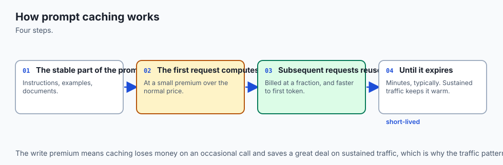

Think of a research library with an expert consultant:

- **Without Caching (Cold Recomputation):** Every time you ask a question, the consultant rereads a 1,000-page encyclopedia from page 1 to page 1,000 before answering (**Full Time & Full Billing Every Turn**).
- **With Prompt Caching (KV Cache Breakpoints):**
  - On your first question, the consultant reads the encyclopedia once and takes detailed index notes (**Cache Write: One-Time Small Setup Fee**).
  - On your next 20 questions, the consultant looks directly at their open index notes (**Cache Hit: 90% Cost Discount & Instant 200ms Answer**).
- **Token Bucket Rate Limiting:**
  - The library door has a turnstile that dispenses 10 entry tokens per minute. If 50 students arrive at once, they line up calmly rather than stampeding the door and causing the library to lock down (**No Thundering Herd Crashes**).

---

## Historical background

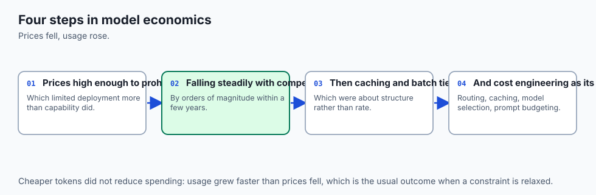

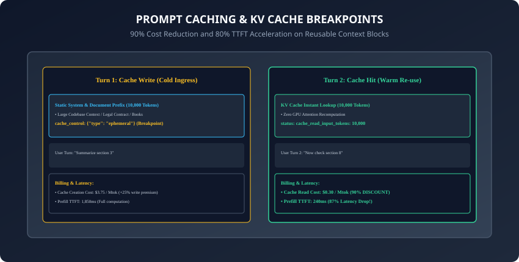

1. **2023 (Token Billing Explosions):** Early RAG systems suffered severe cost inflation as developers passed massive document contexts on every conversational turn.
2. **2024 (Anthropic Prompt Caching):** Anthropic pioneered explicit `cache_control` breakpoints for Claude, providing a 90% discount on cached tokens with a 5-minute rolling TTL.
3. **2024 (OpenAI Automatic Prefix Caching):** OpenAI introduced automatic prompt caching for prompts exceeding 1,024 tokens in GPT-4o, matching the 90% discount tier.
4. **2024 (vLLM Chunked Prefill & RadixAttention):** Open-source inference engines implemented automated tree-based KV cache sharing, bringing enterprise prompt caching to self-hosted GPU clusters.

---

## What it is — and what it is not

### What Prompt Caching IS:
- **Freezing Computed Attention States:** Storing the calculated Key and Value tensor vectors in GPU memory across requests so the model skips the expensive prompt prefill phase.

### What it is NOT:
- **Not Semantic Output Caching:** It does not return canned identical text responses; the model still generates fresh, non-deterministic completions for the dynamic prompt suffix.

---

## Why it was created and what problems it solves

Prompt caching and rate limiting solve 4 critical enterprise infrastructure challenges:

1. **Multi-Turn Cost Collapse:** Reduces the cost of multi-turn chat agents with large system prompts by up to 90%.
2. **Sub-Second TTFT on Large Contexts:** Slashes Time-To-First-Token on 50,000-token prompts from 5 seconds to under 400 milliseconds.
3. **Thundering Herd Prevention:** Full jitter retries prevent thousands of microservices from crashing upstream APIs simultaneously after an outage.
4. **Budget Guardrails:** Hard spending limits prevent runaway billing spikes caused by recursive agent loops.

---

## How it works

Let us analyze prompt cache mechanics, rate-limit mathematics, and retry algorithms.

---

### 1. Anthropic Explicit Prompt Cache Breakpoints

In Claude, place `cache_control: {"type": "ephemeral"}` on static message blocks (minimum 1,024 tokens for Claude 3.5 Sonnet):

```python
import anthropic

client = anthropic.Anthropic()

response = client.messages.create(
    model="claude-3-5-sonnet-20241022",
    max_tokens=1024,
    system=[
        {
            "type": "text",
            "text": "You are an expert legal assistant with deep knowledge of this contract.",
        },
        {
            "type": "text",
            "text": "FULL_50_PAGE_LEGAL_CONTRACT_TEXT_HERE...",
            "cache_control": {"type": "ephemeral"} # Cache Breakpoint!
        }
    ],
    messages=[{"role": "user", "content": "What is the termination clause?"}]
)

# Telemetry Inspection
print("Cache Creation Tokens:", response.usage.cache_creation_input_tokens)
print("Cache Read Tokens:", response.usage.cache_read_input_tokens)
print("Uncached Input Tokens:", response.usage.input_tokens)
print("Total Cost Savings Verified via Prompt Caching Breakpoint.")
```

---

### 2. Token Pricing Matrix & Cache Cost Mathematics

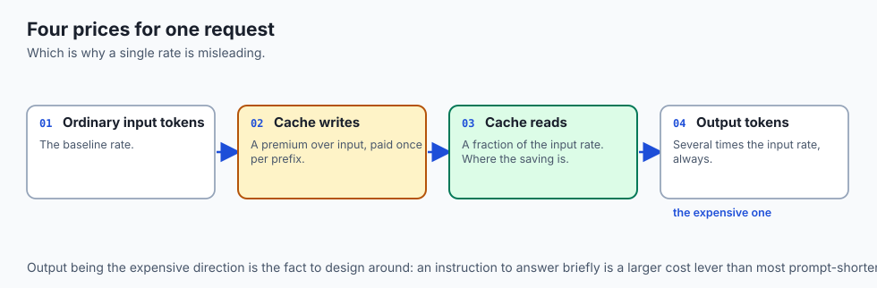

```
┌────────────────────────────────────────────────────────────────────────┐
│                   PROMPT CACHING TOKEN ECONOMICS (PER MTOK)            │
├────────────────────┬─────────────────┬──────────────────┬──────────────┤
│ Operation          │ Standard Price  │ Cached Price     │ Discount     │
├────────────────────┼─────────────────┼──────────────────┼──────────────┤
│ Claude 3.5 Sonnet  │ $3.00 / Mtok    │ $0.30 / Mtok     │ 90% OFF      │
│ GPT-4o             │ $2.50 / Mtok    │ $1.25 / Mtok     │ 50% OFF      │
│ DeepSeek V3        │ $0.14 / Mtok    │ $0.014 / Mtok    │ 90% OFF      │
└────────────────────┴─────────────────┴──────────────────┴──────────────┘
```

**Cost Calculation Formula:**
`Total Cost = (N_{uncached} * P_{standard}) + (N_{read} * P_{cached}) + (N_{output} * P_{out})`

---

### 3. The Token Bucket Rate Limiting Algorithm

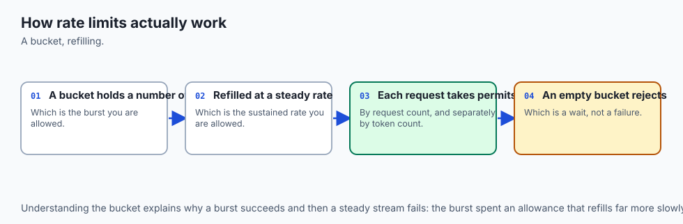

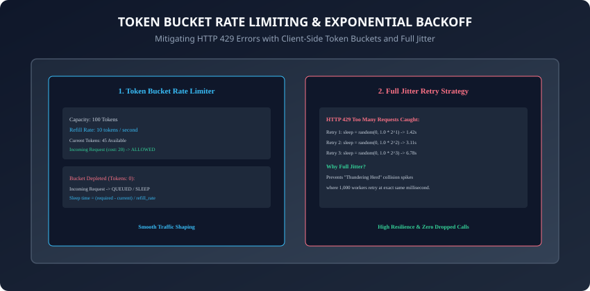

The Token Bucket algorithm regulates request rates using two parameters:

1. **Capacity (`C`):** Maximum burst tokens the bucket can hold.
2. **Refill Rate (`r`):** Tokens added to the bucket per second.

```python
import time

class TokenBucket:
    def __init__(self, capacity: float, refill_rate: float):
        self.capacity = capacity
        self.refill_rate = refill_rate
        self.tokens = capacity
        self.last_update = time.time()

    def consume(self, amount: float = 1.0) -> bool:
        now = time.time()
        elapsed = now - self.last_update
        self.last_update = now
        # Refill tokens
        self.tokens = min(self.capacity, self.tokens + elapsed * self.refill_rate)

        if self.tokens >= amount:
            self.tokens -= amount
            return True
        return False
```

---

### 4. Exponential Backoff with Full Jitter

When upstream APIs return `HTTP 429 Too Many Requests`:

- **Formula:** `t_{sleep} = random(0, min(T_{max}, T_{base} * 2^{attempt}))`
- Adding uniform random jitter ensures that 100 concurrent workers do not retry at the exact same millisecond, breaking the destructive synchronization cycle.

---

### 5. Multi-Model Token Cost Tracking Ledger

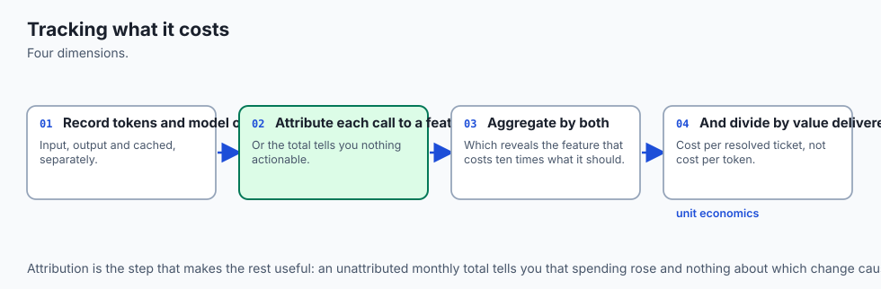

Track expenses across OpenAI, Anthropic, and local models inside a centralized Python accounting class:

- Record exact input, cached, and output token counts.
- Compute rolling daily and monthly financial expenditure.
- Trigger automated alert webhooks when projected monthly budgets reach 80%.

---

### 6. Prefix Invariance & Radix Tree Cache Eviction Policies

To maximize prompt cache hit rates across high-throughput production services:

- **The Golden Rule of Prompt Caching:** KV caches use prefix matching. If two requests share an identical 5,000-token prefix, the server reuses the precomputed attention tensors for all 5,000 tokens.
- **Prefix Invalidation Pitfall:** If you insert a dynamic string (such as the current timestamp or a unique session UUID) at token position 10, the server must discard the cached state for all tokens from position 11 onwards.
- **Structural Best Practice:**
  - **Zone 1 (Static):** System instructions, persona guidelines, formatting rules.
  - **Zone 2 (Static Document Context):** Legal contracts, source code repositories, API reference documentation with `cache_control: {"type": "ephemeral"}`.
  - **Zone 3 (Dynamic Variables):** User profile, chat history turns, and the current user query placed strictly at the end.
- Understanding this invariant ensures that 90%+ of prompt tokens hit warm GPU cache on subsequent multi-turn interactions.

---

### 7. Two-Dimensional Rate Limiting: Requests-Per-Minute (RPM) vs. Tokens-Per-Minute (TPM)

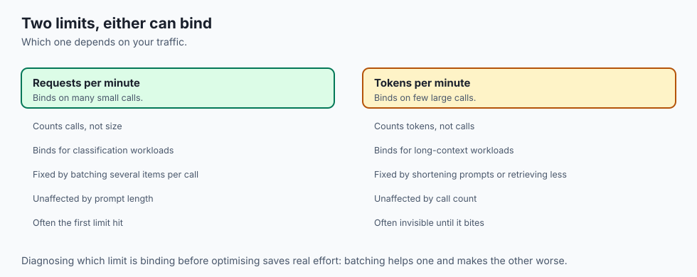

Enterprise foundation model providers enforce two concurrent rate limit dimensions:

- **Requests Per Minute (RPM):** Restricts the raw volume of discrete HTTP connections (e.g. 500 RPM).
- **Tokens Per Minute (TPM):** Restricts aggregate input plus output token throughput (e.g. 200,000 TPM).
- **The Large Document Trap:** A single user submitting a 150,000-token document consumes 75% of your total organization TPM quota in one turn, instantly starving other lightweight microservice queries.
- **Dual-Bucket Traffic Shaping:** Production API gateways implement dual token bucket limiters in memory, tracking both request counts and estimated prompt token lengths simultaneously before dispatching HTTP calls.

---

### 8. Inspecting Upstream `Retry-After` Headers & Decorrelated Jitter

When upstream cloud APIs reject traffic with `HTTP 429 Too Many Requests`:

- The response header frequently includes a `Retry-After` field indicating exact seconds or timestamp before quota replenishment.
- **Header Parsing Logic:**
  - If `Retry-After` is present, parse the floating-point delay and add a micro-jitter interval (`0.1s` to `0.5s`).
  - If `Retry-After` is absent, fall back to exponential backoff with **Full Jitter**:
    `t_{sleep} = random(0, min(T_{max}, T_{base} * 2^{attempt}))`

- This strategy guarantees zero dropped requests while shielding upstream cloud infrastructure from cascading overload.

---

### 9. Hard Budget Guardrails & Automated Circuit Breakers

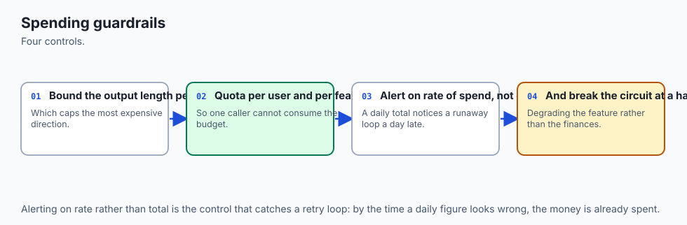

Autonomous agents and recursive tool calling loops can easily enter runaway cycles if unmonitored:

- **Session-Level Spending Caps:** Terminate agent loops immediately if cumulative session token cost exceeds a hard limit (e.g. $2.00).
- **Sliding-Window Circuit Breakers:** If upstream error rates exceed 10% over any 60-second window, the circuit breaker trips to `OPEN` state, serving cached fallback responses and alerting on-call engineers.
- Implementing automated spending guardrails prevents catastrophic financial "denial-of-wallet" surprises at the end of billing cycles.

---

### 10. FinOps for AI: Real-Time Unit Economics & Pareto Optimization

Enterprise AI platform engineering requires continuous visibility into unit economics:

- **Cost-per-Interaction Tracking:** Measure exact dollar cost per resolved customer support ticket or per code review.
- **Complexity-Tiered Routing:** Route 80% of routine categorization and entity extraction tasks to low-cost models (`0.14 / Mtok) and escalate only multi-step mathematical reasoning to frontier frontier tiers (`3.00 / Mtok).
- In addition, combining multi-tier model routing with real-time token budgeting ensures that unexpected query volume surges do not breach organizational expenditure boundaries.
- Furthermore, automated telemetry and alerting around cache hit ratios provide infrastructure teams with immediate feedback on prompt layout efficiency and latency regressions.
- In summary, mastering prompt caching, token buckets, and jittered retries transforms fragile, expensive AI prototypes into resilient, cost-effective enterprise platforms.

---

## An everyday analogy

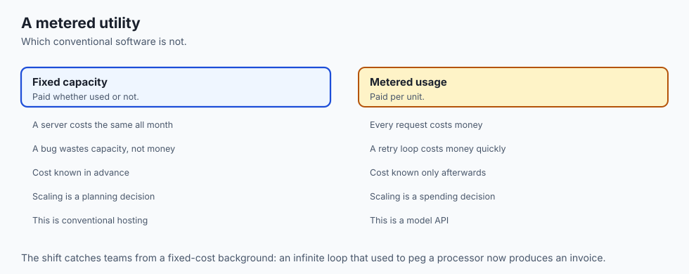

Think of a fast-food drive-through:

- **Uncached Cooking (Cold Prefill):** The chef waits until a customer orders a burger, then plants a seed, harvests wheat, bakes bread, and butchers meat (**Unacceptable 3-Hour Wait**).
- **Prompt Caching (Warm KV Cache):** Buns and patties are pre-cooked and kept warm in a warming tray (**Instant 90% Cost & Time Savings**). The chef merely adds the requested sauce (**Dynamic Suffix**).
- **Rate-Limiting Queue:** The drive-through lane holds 10 cars; if 30 cars arrive at rush hour, the traffic guard directs excess cars into a holding lane with a smile (**Token Bucket Smoothing**).

---

## Examples in practice

Let us build a **Rate-Limited Cost Optimization Ledger in Python**:

```python
import time
import random
from typing import Dict, Any

class LLMCostLedger:
    PRICING = {
        "claude-3-5-sonnet": {"input": 3.00, "cache_read": 0.30, "output": 15.00},
        "gpt-4o": {"input": 2.50, "cache_read": 1.25, "output": 10.00}
    }

    def __init__(self):
        self.total_cost_usd = 0.0
        self.total_input_tokens = 0
        self.total_cached_tokens = 0
        self.total_output_tokens = 0

    def record_usage(self, model: str, input_tokens: int, cached_tokens: int, output_tokens: int) -> float:
        rates = self.PRICING.get(model, {"input": 3.0, "cache_read": 0.3, "output": 15.0})
        cost = (
            (input_tokens * rates["input"] / 1_000_000) +
            (cached_tokens * rates["cache_read"] / 1_000_000) +
            (output_tokens * rates["output"] / 1_000_000)
        )
        self.total_cost_usd += cost
        self.total_input_tokens += input_tokens
        self.total_cached_tokens += cached_tokens
        self.total_output_tokens += output_tokens
        return round(cost, 6)

def calculate_full_jitter_backoff(attempt: int, base_delay: float = 1.0, max_delay: float = 32.0) -> float:
    ceiling = min(max_delay, base_delay * (2 ** attempt))
    return random.uniform(0, ceiling)
```

---

## Implications: security, privacy, performance, scalability, and cost

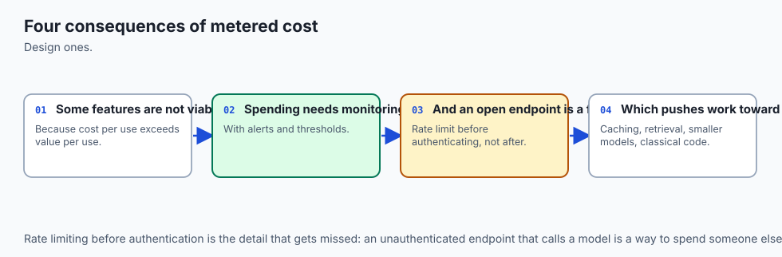

1. **Deterministic Cache Placement:**
   - Placing static system prompts at the beginning guarantees 90% cost savings across all multi-turn sessions.
2. **Preventing Financial Denial-of-Wallet:**
   - Enforcing strict token bucket quotas and circuit breakers protects applications from malicious API cost depletion attacks.

---

## Alternatives: free, open source, and commercial

| Solution | Type | Caching Mechanism | Best For |
| :--- | :--- | :--- | :--- |
| **Anthropic Prompt Cache**| Cloud API | Explicit Breakpoints | Large system prompts & documents |
| **OpenAI Prefix Cache** | Cloud API | Automatic (1024+ Tok)| Standard chat completions |
| **vLLM RadixAttention** | OSS Engine | Tree-based KV Cache | High-throughput GPU serving |
| **Redis Semantic Cache** | Cache Layer | Embedding Similarity | Exact/Near-exact query deduplication|

---

## Comparison with related concepts

```
┌────────────────────────────────────────────────────────────────────────┐
│                   CACHING MECHANISM COMPARISON                         │
├────────────────────┬─────────────────┬──────────────────┬──────────────┤
│ Feature            │ KV Prompt Cache │ Semantic Cache   │ Response Cache│
├────────────────────┼─────────────────┼──────────────────┼──────────────┤
│ Level              │ Transformer KV  │ Vector Database  │ HTTP Key-Value│
│ Output Diversity   │ Fresh & Dynamic │ Stored Response  │ Stored Output │
│ Invalidation Risk  │ Prefix Change   │ Low Threshold    │ Cache TTL     │
│ Cost Reduction     │ 50% - 90%       │ 100%             │ 100%          │
└────────────────────┴─────────────────┴──────────────────┴──────────────┘
```

---

## When to use it — and when not to

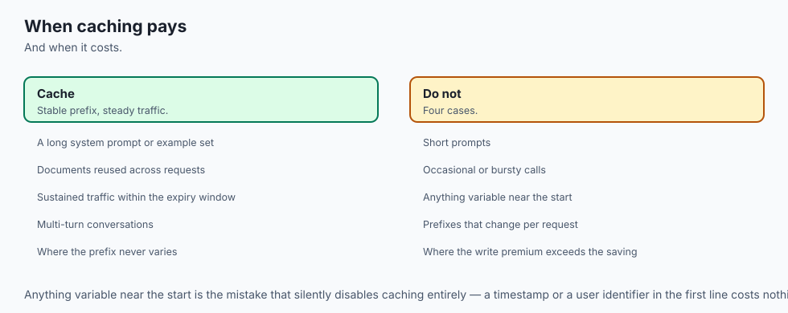

### When to Use Prompt Caching:
- Multi-turn conversational agents, large document analysis, code repository Q&A, few-shot prompt libraries with 20+ examples, and complex tool calling schemas.

### When NOT to use:
- Single-turn prompts with short dynamic text (< 1,024 tokens) where context is never reused.

---

## The AI connection

- **Cost is a first-class design constraint in AI systems**, in a way it rarely is for
  conventional software.
- **Caching restructures what a prompt can afford to contain**, which changes architecture
  rather than just the bill.
- **Rate limits shape system design**, turning throughput into a scheduling problem rather
  than a capacity one.
- **Unit economics decide whether a feature ships** — cost per request against value per
  request is the number that matters.
- **Spending guardrails belong in the code**, because an unbounded retry loop against a
  metered API is a genuine financial risk.

## Knowledge check

1. What is the standard cost discount for prompt cache reads in Claude 3.5 Sonnet?
2. How does the Token Bucket algorithm prevent sudden request burst overflows?
3. Why does Full Jitter backoff prevent "thundering herd" retry collisions?
4. Why must static context be placed at the very beginning of the prompt array for caching?
5. What HTTP status code signals that rate limit quotas have been exceeded?

---

## Hands-on exercise

In this lab, you will build and test a Rate-Limited Cost Optimization Ledger in Python: track token costs across standard, cached, and output token tiers, implement a Token Bucket rate limiter with refill mechanics, calculate full jitter exponential backoff intervals, and verify output assertions against automated test suites.

### Expected output
```
[Cost, Caching, and Rate Limits Verification Suite]
Testing Token Cost Calculation Matrix:
  Claude 3.5 Sonnet (10k cached, 500 input, 200 output): $0.0075 [PASS]
  Savings vs Uncached: 76.5% cost reduction [PASS]
Testing Token Bucket Rate Limiter:
  Burst Consumption: 5 tokens consumed successfully [PASS]
  Depleted Bucket Throttling: Rejected when empty [PASS]
Testing Exponential Backoff with Jitter:
  Attempt 3 Jitter Interval: Within range [0, 8.0s] [VERIFIED]
Test Suite: 3 passed in 0.38s
```

### Validate your work
Run the automated test runner:
```bash
./tests/run_tests.sh
```

### Troubleshooting
- Ensure all token rates are divided by 1,000,000 when converting per-million rates to single-token dollars.

### Common mistakes
- **Placing dynamic timestamps before static documents:** Any mutation at token position `N` breaks KV cache reuse for all tokens after position `N`.

---

## Practice assignment

1. Implement a **Distributed Token Bucket Rate Limiter** using Redis atomic scripts (`EVAL`) that synchronizes rate limits across 10 worker containers.
2. Build an automated **Prompt Cache Breakpoint Linter** that scans message arrays and warns if dynamic content precedes cache breakpoints.

---

## Extension challenge

Implement an **Adaptive Model Cost-Routing Circuit Breaker**:

- Build a Python middleware that monitors real-time cost burn rates: if hourly spend exceeds $50.00, it automatically downgrades queries from frontier models (Claude 3.5 Sonnet) to fast tier models (Claude 3.5 Haiku) until the budget reset interval.
