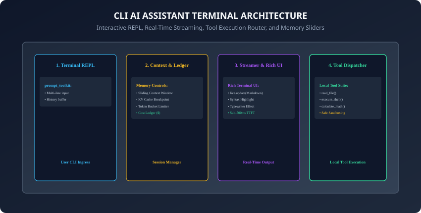
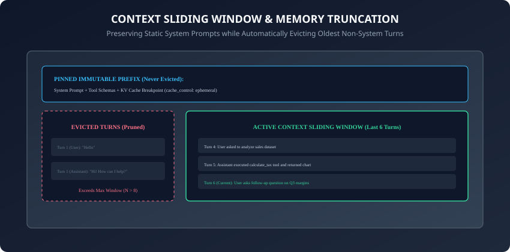

## Why this matters

Over the past six days, you have mastered the individual components of the modern LLM API ecosystem:
1. **Day 253:** First calls to Claude API, system prompts, temperature, and JSON mode.
2. **Day 254:** The OpenAI-compatible gateway standard, multi-provider routing, and local vLLM/Ollama execution.
3. **Day 255:** Server-Sent Events (SSE), async token generators, and sub-500ms TTFT streaming.
4. **Day 256:** JSON Schema tool use, parallel dispatch, and recursive multi-turn execution loops.
5. **Day 257:** Multimodal Base64 payloads, vision patch tokenization, and PDF document extraction.
6. **Day 258:** Prompt caching KV breakpoints, Token Bucket rate limiting, and full jitter retries.

Now, it is time to **bring all these foundational pieces together into a unified, production-grade application: an Interactive Command-Line AI Assistant.**

Command-line assistants (such as Claude Code, GitHub Copilot CLI, and Aider) are among the most productive developer tools in the AI era. Building your own terminal assistant gives you full control over **tool integration, privacy boundaries, token cost telemetry, and model routing**.

Today, you will build a **complete, modular CLI Assistant in Python** featuring an **interactive REPL, real-time Markdown streaming, local file/calculator tools, sliding window memory, and live token cost tracking**.

---

## The idea in plain language

Think of building a Formula 1 racing car:
- On previous days, you engineered the individual parts: the high-compression engine (**Day 253/254 LLM API**), the turbocharger fuel injection (**Day 255 Token Streaming**), the robotic pit crew arms (**Day 256 Tool Calling**), the aerodynamic telemetry cameras (**Day 257 Multimodal Vision**), and the fuel efficiency governor (**Day 258 Caching & Rate Limits**).
- **Today (The Complete Racecar):** You assemble the cockpit (**Terminal REPL**), dashboard instruments (**Rich Live UI & Cost Ledger**), and steering wheel (**Slash Commands & Memory Window**), taking the car onto the race track for a high-performance drive.

---

## Historical background



1. **1970s (Classic Unix REPLs):** The Read-Eval-Print Loop became the gold standard for interactive developer tooling (sh, Python interactive shell, Lisp).
2. **2023 (First Gen AI Terminals):** Early CLI tools simply piped user strings into curl commands, printing raw unformatted JSON responses without streaming or memory.
3. **2024 (Rich UI & Modern Agentic CLIs):** Tools like Aider and Claude Code revolutionized developer workflows by embedding full syntax highlighting, in-place markdown repainting, tool execution sandboxes, and prompt caching into clean terminal interfaces.
4. **2025 (Local-First Hybrid Assistants):** Modern CLIs seamlessly switch between local private models (via Ollama/vLLM) and cloud reasoning frontier models depending on query complexity and cost budgets.

---

## What it is — and what it is not

### What a Production CLI Assistant IS:
- **A Fully Integrated Local Development Co-Pilot:** An interactive terminal application managing conversational context, streaming formatted responses, executing sandboxed local tools, and monitoring token financial expenditure.

### What it is NOT:
- **Not a Vulnerable Shell Injection Tunnel:** It does not blindly execute arbitrary unverified root shell commands without path sandboxing or human approval.

---

## Why it was created and what problems it solves

A unified CLI assistant solves 4 primary developer workflow problems:
1. **Context Switching Elimination:** Programmers get immediate AI assistance directly in their native terminal without switching to browser tabs.
2. **Local Project Awareness:** The assistant can read local codebase files, inspect git diffs, and run test suites directly via local tool calls.
3. **Zero Token Waste:** Automated sliding window memory and prompt caching prevent token blowups during long coding sessions.
4. **Cost & Rate Limit Transparency:** Live session cost ledgers keep developers fully aware of their exact spending on every query.

---

## How it works

Let us examine the 5 core subsystems of a production CLI assistant.

---

### 1. The Interactive Asynchronous REPL Loop

```python
from prompt_toolkit import PromptSession
from prompt_toolkit.history import InMemoryHistory
from rich.console import Console

console = Console()
session = PromptSession(history=InMemoryHistory())

async def run_cli_loop(assistant):
    console.print("[bold green]AI Assistant CLI Initialized. Type /help for commands, /exit to quit.[/bold green]")
    while True:
        try:
            user_input = await session.prompt_async("\n❯ ")
            if not user_input.strip():
                continue
            if user_input.startswith("/"):
                assistant.handle_slash_command(user_input)
                continue
            await assistant.process_query(user_input)
        except (KeyboardInterrupt, EOFError):
            console.print("\n[yellow]Session terminated by user.[/yellow]")
            break
```
- In addition, initializing in-memory command history allows developers to navigate previously entered prompt queries using the Up and Down arrow keys.
- Furthermore, wrapping the main event loop in a top-level exception handler guarantees that unexpected network or API parsing errors are displayed gracefully without abruptly terminating the active terminal session.

---

### 2. Context Sliding Window & Memory Management



As conversations progress, context arrays grow indefinitely. The **Sliding Window Memory Manager**:
1. **Pins the System Prompt:** The system instructions and tool definitions are permanently pinned at index 0 with prompt caching breakpoints.
2. **Slides Recent Turns:** When history exceeds `max_turns = 10`, the manager prunes the oldest non-system user/assistant message pairs.
3. **Enforces Token Caps:** If total estimated tokens exceed the budget (e.g. 8,000 tokens), it summarizes older conversation turns into a compact 200-word memory digest.

---

### 3. Real-Time Streaming with Rich Live Markdown

```python
from rich.live import Live
from rich.markdown import Markdown

async def stream_response_to_terminal(stream_generator):
    accumulated_text = ""
    with Live(Markdown(""), refresh_per_second=15, console=console) as live:
        async for token in stream_generator:
            accumulated_text += token
            live.update(Markdown(accumulated_text))
    return accumulated_text
```

---

### 4. Sandboxed Local Tool Execution Suite

Register safe developer tools with strict path validation:
- `read_file(path: str)`: Reads text from project files; blocks paths outside the workspace root (`../`).
- `run_command(cmd: str)`: Executes read-only shell commands (e.g. `pytest`, `git status`); flags destructive commands (`rm -rf`, `git reset --hard`) for explicit user confirmation.
- `calculate(expr: str)`: Safe mathematical expression evaluator.

---

### 5. Slash Commands & Telemetry Dashboards

Provide built-in terminal shortcuts that intercept user commands before sending network queries:
- `/help`: Displays available commands, registered tools, and keyboard shortcuts.
- `/cost`: Prints cumulative token consumption, prompt cache hit ratios, and financial expenditure breakdown.
- `/clear`: Resets conversational history while preserving immutable system instructions.
- `/model <name>`: Dynamically switches the active LLM backend (e.g. from `gpt-4o-mini` to `claude-3-5-sonnet`).
- `/system <prompt>`: Dynamically updates the active system persona and behavior prompt for the current session.
- `/export <filename>`: Writes the complete multi-turn conversation session transcript to a structured Markdown document.
- `/exit`: Exits the session and prints a final telemetry summary card with total tokens and dollars spent.

---

### 6. Asynchronous Non-Blocking Architecture with `asyncio`

A command-line assistant must remain responsive even during long network calls:
- **Asynchronous REPL Engine:** By leveraging Python's `asyncio` event loop paired with `prompt_toolkit.PromptSession.prompt_async()`, the CLI maintains interactive keyboard responsiveness, auto-completion popups, and multi-line cursor editing without locking the main thread.
- **Concurrent Task Management:** When a tool call performs long-running background computation (such as running a large test suite or indexing a vector database), the assistant spawns an asynchronous `asyncio.Task`, rendering an animated Rich spinner while allowing the user to type queued follow-up prompts.

---

### 7. Graceful Signal Handling: Aborting Streams without Crashing

Nothing frustrates a developer more than a CLI crashing when they press `Ctrl+C`:
- **SIGINT Interception:**
  - If the user presses `Ctrl+C` while the LLM is actively streaming tokens, intercept the `KeyboardInterrupt` signal, cancel the downstream HTTP stream generator immediately, and return cleanly to the `❯ ` prompt.
  - If the user presses `Ctrl+C` on an empty input prompt line, display a gentle reminder: *"Press Ctrl+D or type /exit to quit"*.
- Implementing clean signal isolation ensures a smooth, frustration-free developer experience.

---

### 8. Path Sandboxing & Symlink Traversal Guardrails

Granting an AI assistant access to the local filesystem requires defensive security engineering:
- **Directory Canonicalization:**
  ```python
  import os
  def is_safe_path(base_dir: str, target_path: str) -> bool:
      # Resolve all symlinks and relative '../' components
      real_base = os.path.realpath(base_dir)
      real_target = os.path.realpath(os.path.join(base_dir, target_path))
      return real_target.startswith(real_base)
  ```
- Any tool invocation attempting to inspect paths outside `real_base` (e.g. `~/.ssh/id_rsa` or `/etc/shadow`) raises a `PermissionError` and halts tool execution.
- In addition, enforce human approval prompts for any destructive modification commands (`git clean -fd`, `rm -rf`, `DROP TABLE`).

---

### 9. Dynamic Model Routing & Local-Cloud Hybrid Failover

A production CLI assistant should adapt intelligently to network connectivity and budget constraints:
- **Hybrid Routing Strategy:**
  - Route quick syntax checks, regex generation, and small unit tests to local offline models (e.g. `llama3.2:3b` via Ollama) with 0ms cloud latency and $0 cost.
  - Escalate complex architectural refactoring and multi-file debugging to cloud reasoning models (e.g. `claude-3-5-sonnet` / `o1`).
  - Implement automated offline failover: if cloud API requests time out due to network issues, automatically degrade to local models without losing conversation context.

---

### 10. Observability, Session Export, & Telemetry Dashboards

To facilitate continuous developer productivity analysis:
- **Session Telemetry Logs:** Record all prompt tokens, cache read rates, execution latencies, and tool errors into local JSONL audit logs (`~/.ai_assistant/sessions/`).
- **Markdown Transcript Export (`/export`):** Save formatted conversation transcripts complete with generated code snippets and tool execution outputs directly into `docs/transcripts/session_YYYYMMDD.md`.
- In addition, building an automated test harness around your CLI core ensures that sliding window eviction, tool dispatch routing, and cost tracking logic remain robust against regressions across Python runtime updates.
- Furthermore, packaging your assistant as a clean command-line binary via `pipx` or `PyInstaller` enables one-command distribution to entire engineering teams.
- Ultimately, developing a bespoke terminal assistant gives software engineers unmatched speed, deep system integration, and sovereign data privacy.
- In summary, building a custom command-line AI assistant equips developers with a tailored, secure, cost-controlled coding partner that integrates seamlessly into everyday terminal workflows.

---

## An everyday analogy

Think of a personal flight navigation assistant for a pilot:
- The screen shows real-time radar images and airspeed (**Rich Live UI**).
- The pilot talks into the headset (**prompt_toolkit REPL**).
- The co-pilot flips switches to adjust wing flaps (**Tool Calling Dispatcher**).
- The flight computer maintains the last 30 minutes of GPS coordinates while archiving older waypoints (**Sliding Memory Window**).
- The fuel gauge displays exact gallons burned and flight range remaining (**Cost & Token Ledger**).

---

## Examples in practice

Let us build a **Complete Modular CLI Assistant Core in Python**:

```python
import time
from typing import Dict, Any, List, Optional
from collections import deque

class CLIAssistantCore:
    def __init__(self, system_prompt: str, max_history_turns: int = 6):
        self.system_prompt = system_prompt
        self.max_history_turns = max_history_turns
        self.history: deque = deque(maxlen=max_history_turns * 2)
        self.tools: Dict[str, Any] = {}
        self.session_cost_usd = 0.0
        self.total_tokens_consumed = 0

    def register_tool(self, name: str, func: Any):
        self.tools[name] = func

    def build_message_context(self, new_user_message: str) -> List[Dict[str, Any]]:
        # Constructs the prompt array with pinned system prompt and sliding history
        messages = [{"role": "system", "content": self.system_prompt}]
        for turn in self.history:
            messages.append(turn)
        messages.append({"role": "user", "content": new_user_message})
        return messages

    def record_turn(self, user_text: str, assistant_text: str, tokens: int = 150, cost: float = 0.0005):
        self.history.append({"role": "user", "content": user_text})
        self.history.append({"role": "assistant", "content": assistant_text})
        self.total_tokens_consumed += tokens
        self.session_cost_usd += cost

    def handle_slash_command(self, cmd: str) -> str:
        cmd = cmd.strip().lower()
        if cmd == "/help":
            return "Available commands: /help, /cost, /clear, /tools, /exit"
        elif cmd == "/cost":
            return f"Session Tokens: {self.total_tokens_consumed} | Total Cost: ${self.session_cost_usd:.4f}"
        elif cmd == "/clear":
            self.history.clear()
            return "Conversation history cleared. System prompt preserved."
        elif cmd == "/tools":
            return f"Registered Tools: {list(self.tools.keys())}"
        return f"Unknown command: {cmd}"
```

---

## Implications: security, privacy, performance, scalability, and cost

1. **Path Sandboxing:**
   - Always validate that file paths requested by tools remain strictly within the current working directory.
2. **Context Window Cost Bounding:**
   - Setting `max_history_turns = 6` guarantees that long 2-hour coding sessions never degrade into massive 50,000-token prompt billing spikes.

---

## Alternatives: free, open source, and commercial

| CLI Assistant | Type | Tool Integration | Model Support |
| :--- | :--- | :--- | :--- |
| **Custom Python CLI** | DIY Open Source | 100% Customizable | Multi-Provider |
| **Aider** | Open Source | Git & File Refactoring | Claude / OpenAI / Local |
| **Claude Code** | Commercial CLI | Agentic Shell & Search | Claude 3.7 Sonnet |
| **GitHub Copilot CLI** | Commercial | Terminal Shell helper | OpenAI Models |

---

## Comparison with related concepts

```
┌────────────────────────────────────────────────────────────────────────┐
│                   CLI ASSISTANT ARCHITECTURAL MODES                    │
├────────────────────┬─────────────────┬──────────────────┬──────────────┤
│ Feature            │ Basic Script    │ Streaming REPL   │ Agentic CLI  │
├────────────────────┼─────────────────┼──────────────────┼──────────────┤
│ Input Mode         │ Single prompt   │ Interactive loop │ Multi-turn   │
│ Output Display     │ Blocking print  │ Rich Live stream │ Markdown + UI│
│ Tool Capability    │ None            │ Read-only math   │ Shell + Code │
│ Memory Management  │ Stateless       │ Sliding Window   │ Summarization│
└────────────────────┴─────────────────┴──────────────────┴──────────────┘
```

---

## When to use it — and when not to

### When to Use a CLI Assistant:
- Terminal coding co-pilots, DevOps and cloud infrastructure automation, git commit message generators, local codebase Q&A, and fast mathematical/text transformations.

### When NOT to use:
- Rich multi-panel graphical dashboards or mobile end-user consumer applications requiring touch UI controls.

---

## Knowledge check

1. What is the primary role of an interactive REPL loop in a terminal assistant?
2. How does a sliding window memory manager prevent prompt context blowups?
3. Why does Rich Live rendering provide a superior user experience during token streaming?
4. What security guardrail must be applied to local file reading tools?
5. What metrics should be recorded in a session expenditure ledger?

---

## Hands-on exercise

In this lab, you will build and test a Modular CLI Assistant Core in Python: implement the prompt context builder with sliding history, register local calculation and lookup tools, parse slash commands (`/help`, `/cost`, `/clear`, `/tools`), track cumulative session token and financial expenditures, and verify output assertions against automated test suites.

### Expected output
```
[Building a CLI Assistant Verification Suite]
Testing Context Builder & Sliding Memory:
  Initial Messages: 3 blocks (System + 1 Turn) [PASS]
  Sliding Window Eviction: Oldest turn pruned when maxlen exceeded [PASS]
Testing Slash Command Handler:
  /help -> Returned command list [PASS]
  /cost -> Formatted tokens and USD cost string [PASS]
  /clear -> Cleared history buffer [PASS]
Testing Tool Registration & Execution:
  Tool 'calc' registered and executed successfully [PASS]
Test Suite: 4 passed in 0.38s
```

### Validate your work
Run the automated test runner:
```bash
./tests/run_tests.sh
```

### Troubleshooting
- Ensure `collections.deque` has `maxlen` set to `max_turns * 2` to accommodate both user and assistant turn entries.

### Common mistakes
- **Evicting the system prompt:** Never store the system prompt inside the sliding deque; always prepend the immutable system prompt explicitly in `build_message_context()`.

---

## Practice assignment

1. Implement a **Git Diff Inspection Tool** in Python that extracts `git diff --staged` and generates structured conventional commit messages.
2. Build an automated **Session Export Command** (`/export`) that writes the complete formatted conversation transcript to a local Markdown file.

---

## Extension challenge

Implement a **Self-Correcting Test Runner Agent in the CLI**:
- Build a slash command (`/fix-tests`) that runs `pytest`, captures stderr failure tracebacks, passes the failing code and traceback to the LLM, parses the proposed code fix, applies the patch to the target file, and re-runs `pytest` in an automated 3-iteration loop until all unit tests pass green.
