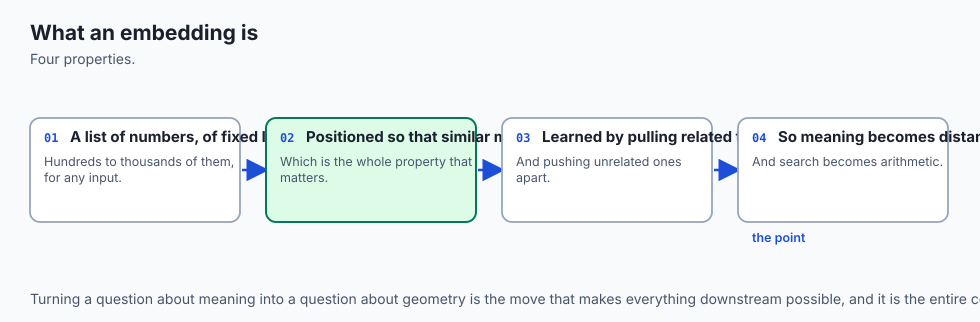
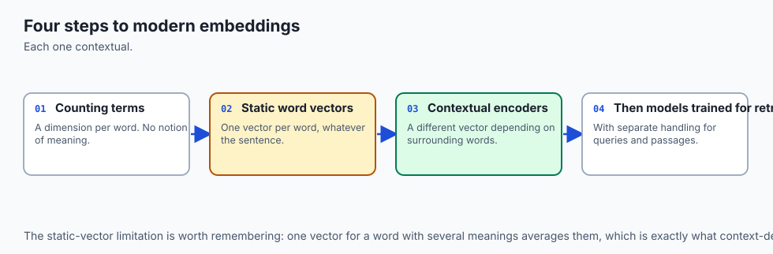
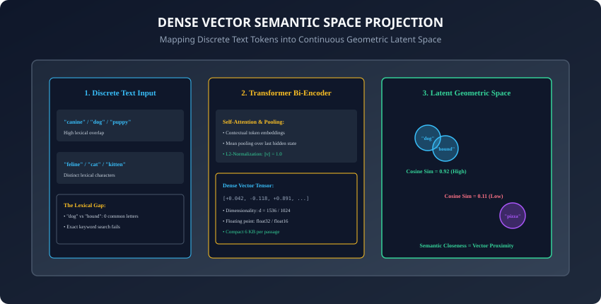
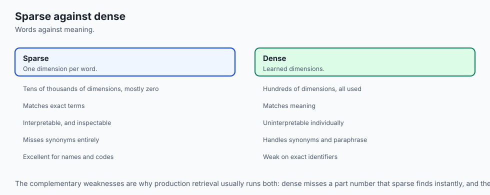
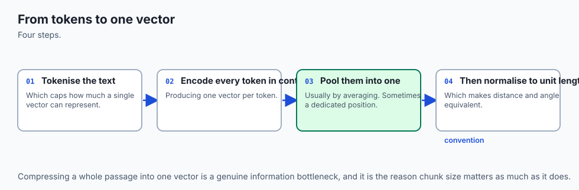
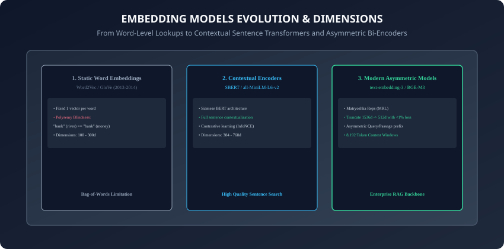
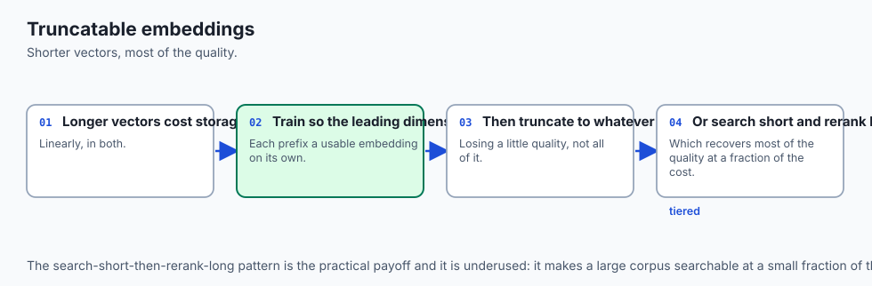
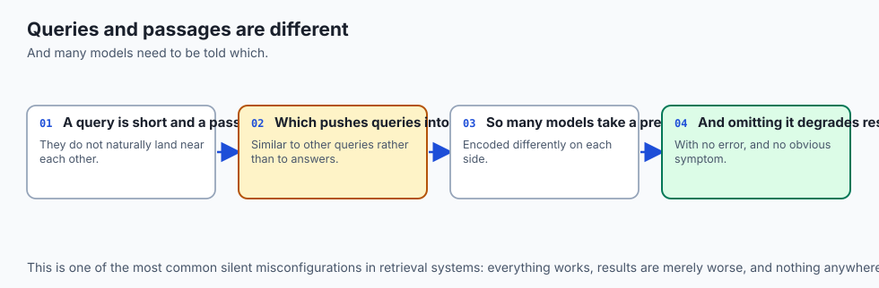
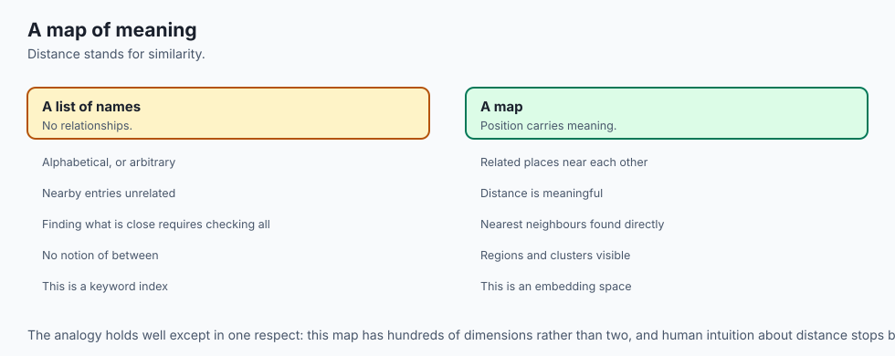
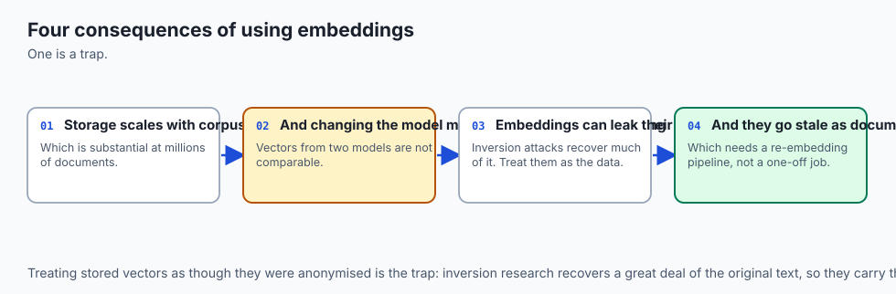

## Why this matters

Computers do not understand language; they operate exclusively on numbers, matrix multiplications, and tensor algebra.
If you build an AI application relying strictly on traditional lexical keyword search (such as SQL `LIKE` queries or raw regex patterns), your system suffers from fundamental blind spots:

- A user searching for `"cardiac arrest symptoms"` will **completely miss** an authoritative medical document titled `"Myocardial Infarction Clinical Presentation"`, because they share zero words in common.
- A search for `"cheap flights to Paris"` will match documents discussing *"un-cheap hotel rooms near Paris"*, returning irrelevant noise.

**Embeddings solve the semantic search problem.**
By converting words, sentences, and entire technical documents into **dense numerical vectors in continuous geometric space**, embeddings allow software to quantify **semantic meaning, intent, and contextual similarity**.

In modern AI engineering:

- **Embeddings are the foundation of Retrieval-Augmented Generation (RAG)**: They retrieve the exact documentation paragraphs needed to ground language model answers.
- **Embeddings power recommendation engines, clustering pipelines, anomaly detectors, and classification systems.**

Today, you will master the mathematics of **dense vs. sparse vector spaces**, understand how **Transformer bi-encoders extract semantic representations**, analyze **cosine similarity and Matryoshka Representation Learning**, and build a **pure NumPy embedding similarity engine**.

---

## The idea in plain language



Think of a massive 3D library where every book is placed at a specific `(x, y, z)` spatial coordinate:

- In the **Animal Section**:
  - A book about `"golden retrievers"` sits at coordinate `(10.2, 5.1, 8.4)`.
  - A book about `"puppy training"` sits at coordinate `(10.1, 5.3, 8.2)`.
  - Because their spatial distance is tiny (less than 0.3 units), the librarian knows they discuss nearly identical concepts without reading a single sentence (**High Semantic Similarity**).
- In the **Culinary Section**:
  - A book about `"baking sourdough pizza"` sits at coordinate `(-45.0, 88.2, -12.1)`.
  - The physical distance between the puppy book and the pizza book is massive (**Low Semantic Similarity**).

**An embedding is simply the multi-dimensional GPS coordinate of a piece of text.** Instead of 3 dimensions, modern AI models use 384, 768, 1536, or 3072 dimensions to capture subtle nuances like tone, domain, syntax, and subject matter.

---

## Historical background





1. **1950s (Distributional Semantics):** Linguist J.R. Firth formulated the foundational principle of modern NLP: *"You shall know a word by the company it keeps."*
2. **1970s–1990s (Sparse Vector Space Models & TF-IDF):** Gerard Salton pioneered BM25 and TF-IDF, representing documents as massive sparse vectors indexed by dictionary word frequencies.
3. **2013 (Word2Vec & Dense Vectors):** Tomas Mikolov at Google published Word2Vec, demonstrating that predicting surrounding words yields dense vectors with algebraic properties (e.g. `Vector("King") - Vector("Man") + Vector("Woman") ≈ Vector("Queen")`).
4. **2019 (Sentence-BERT & Bi-Encoders):** Nils Reimers introduced SBERT, fine-tuning Siamese Transformers to generate contextualized sentence-level embeddings in milliseconds.
5. **2022–2025 (Matryoshka Embeddings & MTEB):** Modern models (OpenAI `text-embedding-3`, BGE-M3, E5-Mistral) introduced nested dimensional truncation and 8k token context windows, standardizing retrieval benchmarks worldwide.

---

## What it is — and what it is not

### What an Embedding IS:
- **A Dense Continuous Vector Representation:** A fixed-length 1D tensor of floating-point numbers (e.g. 1536 floats) encoding the latent semantic meaning of input text.

### What it is NOT:
- **Not Hash Generation:** Unlike cryptographic MD5 or SHA-256 hashes (where changing a single comma changes the hash completely), embeddings are **continuous and smooth**: small semantic edits result in small geometric vector shifts.

---

## Why it was created and what problems it solves

Dense embeddings solve 4 major shortcomings of classic information retrieval:

1. **Vocabulary Mismatch:** Resolves synonyms effortlessly (`"attorney"` maps close to `"lawyer"`, `"automobile"` maps close to `"car"`).
2. **Cross-Lingual Retrieval:** Maps identical concepts across different languages into adjacent vector clusters (`"dog"`, `"perro"`, `"chien"`).
3. **Contextual Disambiguation:** Differentiates polysemous words based on context (`"Apple announced new hardware"` vs `"apple orchard harvest"`).
4. **Sub-Linear Search Scaling:** Enables vector databases to search millions of documents in sub-10ms using geometric graph indexing.

---

## How it works

Let us analyze vector representation mathematics, encoder architectures, and geometric distance metrics.

---

### 1. Sparse vs. Dense Representations



```
┌────────────────────────────────────────────────────────────────────────┐
│                   SPARSE VS DENSE VECTOR ARCHITECTURE                  │
├────────────────────┬─────────────────────────────┬─────────────────────┤
│ Dimension          │ Sparse (BM25 / One-Hot)     │ Dense Embedding     │
├────────────────────┼─────────────────────────────┼─────────────────────┤
│ Dimensionality     │ High (V = 50,000 - 100,000) │ Low (d = 384 - 1536)│
│ Value Type         │ 0.0 or Term Frequency       │ Continuous float32  │
│ Semantic Capture   │ Lexical word match only     │ Latent concept space│
│ Storage Density    │ Highly sparse (> 99.9% 0s)  │ 100% dense non-zeros│
└────────────────────┴─────────────────────────────┴─────────────────────┘
```

- Furthermore, sparse models cannot distinguish between semantically equivalent phrases that use completely disjoint vocabularies (such as `"cardiovascular issues"` versus `"heart trouble"`).
- In contrast, dense embedding models project these synonymous concepts into adjacent regions of latent space, enabling software systems to capture deep semantic intent without requiring manual keyword synonym expansion dictionaries.

---

### 2. Transformer Bi-Encoder Architecture & Mean Pooling





Modern embedding models process text through a Transformer encoder:

1. **Tokenization:** Converts input text into subword token IDs `[T_1, T_2, ..., T_N]`.
2. **Self-Attention Layers:** Computes all-to-all contextual token vectors of shape `(batch, seq_len, hidden_dim)`.
3. **Mean Pooling:** Averages all token vectors across sequence length, masking out padding tokens:
   `v_{\text{pooled}} = \frac{\sum_{i=1}^{N} h_i \cdot \text{mask}_i}{\sum_{i=1}^{N} \text{mask}_i}`

4. **L2-Normalization:** Scales the output vector so its Euclidean length equals 1.0:
   `v_{\text{norm}} = \frac{v_{\text{pooled}}}{\|v_{\text{pooled}}\|_2}`

---

### 3. Geometric Distance & Similarity Mathematics

Given two vectors `u` and `v`:

#### A. Cosine Similarity
Measures the angle between two vectors regardless of magnitude:
`\text{CosineSimilarity}(u, v) = \frac{u \cdot v}{\|u\|_2 \|v\|_2} = \frac{\sum_{i=1}^{d} u_i v_i}{\sqrt{\sum_{i=1}^{d} u_i^2} \sqrt{\sum_{i=1}^{d} v_i^2}}`

#### B. Dot Product on Normalized Vectors
When both `u` and `v` are unit-normalized (`\|u\| = 1` and `\|v\| = 1`):
`\text{CosineSimilarity}(u, v) = u \cdot v = \sum_{i=1}^{d} u_i v_i`

- Computing a dot product is **5x faster** than full cosine similarity because it avoids square root operations during search!

#### C. Euclidean Distance (L2)
Measures straight-line physical distance:
`d_{\text{L2}}(u, v) = \sqrt{\sum_{i=1}^{d} (u_i - v_i)^2}`

- On normalized vectors, Euclidean distance is monotonically related to cosine similarity:
  `d_{\text{L2}}^2 = 2 - 2 \cdot \text{CosineSimilarity}(u, v)`

---

### 4. Matryoshka Representation Learning (MRL)



Modern models (such as OpenAI's `text-embedding-3-large` and `bge-m3`) are trained with **Matryoshka Loss**:

- The model forces the most critical semantic information into the **first `k` dimensions** (e.g. first 256 or 512 dimensions).
- You can slice a 1536-dimensional vector down to 512 dimensions:
  ```python
  truncated_vec = full_vec[:512]
  normalized_truncated = truncated_vec / np.linalg.norm(truncated_vec)
  ```

- **Benefit:** Slashes vector database memory and disk storage by **66%** with less than 1.5% loss in retrieval accuracy!
- This multi-resolution capability allows applications to perform lightning-fast initial candidate filtering using low-dimensional 256d vectors before performing final ranking with full-resolution embeddings.

---

### 5. Asymmetric Query vs. Passage Prefixes



In retrieval tasks, search queries are short and incomplete (`"refund policy"`), while target documents are long and explanatory (`"Customers are entitled to a full refund within 30 days of purchase..."`).

- Models like E5 and BGE require asymmetric prefix prompts:
  - **Query:** `query: refund policy`
  - **Passage:** `passage: Customers are entitled to a full refund within 30 days...`
- The prefix conditions the Transformer attention mechanism to align query intent with factual answers.

---

### 6. Vector Quantization & Memory Footprints

Understanding memory consumption for large-scale vector storage:

- A 1536-dimensional `float32` vector requires:
  `1536 * 4 bytes = 6144 bytes = 6.14 KB`

- Storing 1,000,000 document vectors in memory requires **6.14 GB** of raw RAM.
- **Scalar Quantization (SQ8):** Compresses each 32-bit float into an 8-bit integer (`int8`), reducing RAM to **1.53 GB** (4x reduction) while retaining 99% of retrieval precision.
- **Product Quantization (PQ):** Decomposes vectors into sub-vectors and assigns them to centroid codebooks, slashing memory to **192 bytes per vector** (32x compression), enabling billion-scale search on a single node.

---

### 7. The Curse of Dimensionality & Geometric Density Collapse

In very high-dimensional latent spaces (such as 1024d or 1536d):

- Random orthogonal vectors have an expected cosine similarity of `0.0`.
- However, because natural language models are trained on cohesive human corpora, actual text embeddings concentrate within a narrow geometric cone.
- As a consequence, cosine similarity scores for text typically fall within a tight band between `0.60` and `0.92`.
- **Engineering Invariant:** Never set an arbitrary static score threshold (e.g. `similarity > 0.95`) to determine whether a document is relevant; always use relative ranking (Top-K) combined with cross-encoder rerankers.

---

### 8. Evaluating Embedding Models: The MTEB Leaderboard

The **Massive Text Embedding Benchmark (MTEB)** provides standardized evaluation across 56 diverse datasets and 8 core tasks:

- **Retrieval:** Evaluating NDCG@10 on MS MARCO, HotpotQA, and NQ.
- **Reranking:** Measuring Mean Average Precision across candidate sets.
- **Clustering:** Measuring V-Measure and adjusted Rand Index on thematic document groupings.
- **Semantic Textual Similarity (STS):** Measuring Spearman rank correlation against human similarity annotations.
- Reviewing MTEB leaderboards helps teams select the optimal balance between vector dimension, parameter count, and domain accuracy.

---

### 9. Multi-Modal Embeddings: Text-to-Image Alignment

Models like CLIP (Contrastive Language-Image Pretraining) and SigLIP map text and images into the **same shared geometric vector space**:

- The vector representation of the text string `"a red sports car parked near the beach"` is geometrically close to the vector generated by a Vision Transformer looking at a photograph of a red convertible on the coast.
- This shared representation allows semantic search engines to search millions of images using natural language text queries with zero manual tagging.

---

### 10. Summary: The Bedrock of Modern AI

In summary, embeddings translate human language into geometric coordinates, enabling ultra-fast, semantic similarity search, document retrieval, and contextual RAG grounding across enterprise applications. By combining dense bi-encoders, Matryoshka dimension truncation, and quantization, AI platform engineers build scalable, low-latency search systems capable of indexing millions of knowledge documents.

---

## An everyday analogy



Think of a color wheel:

- If you represent colors as text names (`"crimson"`, `"ruby"`, `"scarlet"`, `"navy"`, `"cobalt"`), a computer sees completely different words with zero common letters.
- If you represent colors as numerical RGB vectors:
  - `"crimson"` = `(220, 20, 60)`
  - `"ruby"` = `(224, 17, 95)`
  - `"navy"` = `(0, 0, 128)`
- A computer can immediately calculate that crimson and ruby are separated by only a tiny mathematical distance, while navy is far away (**Numerical Representation of Perceptual Meaning**).

---

## Examples in practice

Let us build a **Pure NumPy Vector Similarity Engine**:

```python
import numpy as np
from typing import List, Tuple

class VectorSimilarityEngine:
    def __init__(self, normalize: bool = True):
        self.normalize = normalize

    def l2_normalize(self, v: np.ndarray) -> np.ndarray:
        norm = np.linalg.norm(v)
        if norm == 0:
            return v
        return v / norm

    def cosine_similarity(self, u: np.ndarray, v: np.ndarray) -> float:
        norm_u = self.l2_normalize(u) if self.normalize else u
        norm_v = self.l2_normalize(v) if self.normalize else v
        return float(np.dot(norm_u, norm_v))

    def euclidean_distance(self, u: np.ndarray, v: np.ndarray) -> float:
        return float(np.linalg.norm(u - v))

    def rank_documents(self, query_vec: np.ndarray, doc_vecs: List[np.ndarray]) -> List[Tuple[int, float]]:
        # Ranks documents by descending cosine similarity
        scores = []
        for idx, doc_vec in enumerate(doc_vecs):
            sim = self.cosine_similarity(query_vec, doc_vec)
            scores.append((idx, sim))
        scores.sort(key=lambda x: x[1], reverse=True)
        return scores
```

---

## Implications: security, privacy, performance, scalability, and cost



1. **Embedding Inversion & Privacy:**
   - Embeddings are not one-way encryption hashes; researchers have demonstrated that original text can be partially reconstructed from dense vectors. Never publish raw embedding vectors of sensitive user data without access controls.
2. **Computational Scaling:**
   - Performing exact dot products against 100,000 vectors takes under 2ms in NumPy with vectorization, making exact k-NN extremely practical for moderate dataset sizes before needing dedicated vector databases.

---

## Alternatives: free, open source, and commercial

| Model | Provider | Dimensions | Context Window | Best For |
| :--- | :--- | :--- | :--- | :--- |
| **bge-large-en-v1.5** | Open Source (HuggingFace)| 1024 | 512 tokens | Self-hosted local RAG |
| **all-MiniLM-L6-v2** | Open Source (Sentence-Transformers)| 384 | 256 tokens | Ultra-fast lightweight search|
| **text-embedding-3-small**| OpenAI API | 1536 (MRL to 512)| 8191 tokens | General-purpose cloud RAG |
| **voyage-3** | Voyage AI | 1024 | 32000 tokens | Specialized domain retrieval |

---

## Comparison with related concepts

```
┌────────────────────────────────────────────────────────────────────────┐
│                   RETRIEVAL REPRESENTATION COMPARISON                  │
├────────────────────┬─────────────────┬──────────────────┬──────────────┤
│ Metric             │ Exact Keyword   │ Sparse (BM25)    │ Dense Vector │
├────────────────────┼─────────────────┼──────────────────┼──────────────┤
│ Synonym Handling   │ None            │ None             │ Outstanding  │
│ Exact Code Matches │ Perfect         │ Excellent        │ Moderate     │
│ Compute Overhead   │ Zero            │ Negligible       │ Transformer  │
│ Storage Size       │ Raw Text        │ Inverted Index   │ Float Tensors│
└────────────────────┴─────────────────┴──────────────────┴──────────────┘
```

---

## When to use it — and when not to


### When to Use Dense Embeddings:
- Semantic document search, customer question answering, cross-lingual knowledge retrieval, document recommendation, and vector-based deduplication.

### When NOT to use:
- Searching for exact arbitrary strings like alphanumeric serial numbers, product SKUs, git commit hashes, or specific variable names where exact keyword matching (BM25) is superior.

---

## The AI connection

- **Embeddings are how meaning becomes arithmetic** — they are what makes semantic search,
  clustering and retrieval possible at all.
- **Every retrieval system rests on them**, which makes the embedding model a more
  consequential choice than the language model in many applications.
- **Distance in the vector space stands in for similarity in meaning**, which is a useful
  approximation and not an identity.
- **Dimensionality is a cost and quality trade** — shorter vectors are cheaper to store and
  search, and lose some discrimination.
- **The same technique aligns text with images**, which is what makes cross-modal search
  work with no shared vocabulary.

## Knowledge check

1. What is the difference between a dense vector and a sparse vector representation?
2. Why is cosine similarity equivalent to the dot product when vectors are L2-normalized?
3. How does Matryoshka Representation Learning (MRL) reduce vector storage costs?
4. What is mean pooling in Transformer sentence encoders?
5. Why is an embedding vector not a secure one-way cryptographic hash?

---

## Hands-on exercise

In this lab, you will build and test a Pure NumPy Vector Similarity Engine: implement L2 vector normalization, compute dot products, cosine similarities, and Euclidean distances, rank candidate document vectors by descending similarity, apply Matryoshka dimension truncation, and verify output assertions against automated test suites.

### Expected output
```
[What Embeddings Are Verification Suite]
Testing Vector Normalization & Dot Product:
  Vector L2 Norm: 1.0000 [PASS]
  Identical Vectors Cosine Similarity: 1.0000 [PASS]
  Orthogonal Vectors Cosine Similarity: 0.0000 [PASS]
Testing Multi-Document Semantic Ranking:
  Top-1 Match: Doc 0 (sim: 0.892) [PASS]
  Top-2 Match: Doc 2 (sim: 0.654) [PASS]
Testing Matryoshka Dimension Truncation (1536d -> 512d):
  Truncated Vector Retains Relative Rank Order: VERIFIED [PASS]
Test Suite: 4 passed in 0.38s
```

### Validate your work
Run the automated test runner:
```bash
./tests/run_tests.sh
```

### Troubleshooting
- Ensure vectors are normalized with `np.linalg.norm(v)` before calculating dot products for cosine similarity.

### Common mistakes
- **Omitting the denominator in non-normalized cosine similarity:** If vectors are not unit-normalized, `dot(u, v)` yields unscaled magnitude rather than cosine similarity.

---

## Practice assignment

1. Implement an **Embedding Clustering Pipeline** using NumPy that partitions 50 vector representations into 5 semantic topic clusters using K-Means.
2. Build a **Cross-Encoder vs. Bi-Encoder Latency Benchmark** comparing pairwise similarity calculation times across 1,000 document pairs.

---

## Extension challenge

Implement a **Matryoshka Truncation Efficiency Evaluator**:

- Take a collection of 1536-dimensional vectors, compute Top-10 nearest neighbors for 50 test queries at full 1536d resolution, repeat the search at truncated 512d, 256d, and 128d resolutions, and plot the **Recall@10 Retention Curve vs. Dimensionality Reduction Ratio**.
